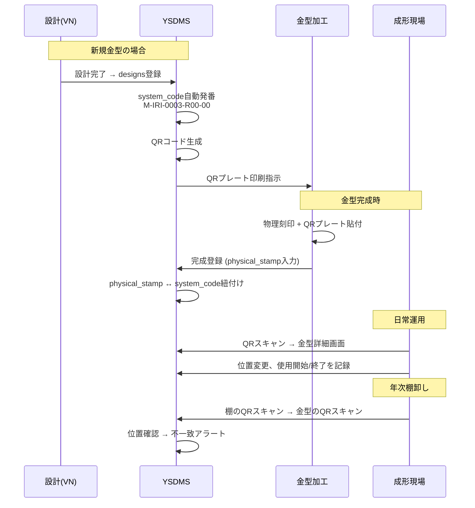
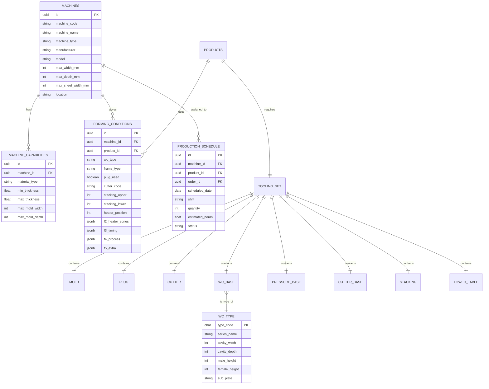

# 🔬 Thảo luận Chuyên sâu: Mold Naming & Machine Specs
# 金型命名規則 と 成形機仕様 — 詳細検討

> **ステータス:** PO レビュー待ち
> **作成日:** 2026-06-03
> **ソース:** `Đề án quản lý khuôn V4.docx` (271KB), サーバー実データ, PO のフィードバック

---

## PART A: 金型命名規則 と QR/Barcode (Quy tắc đặt tên khuôn & QR Code)

### A.1 現状分析 — 名称に含まれる要素

PO のフィードバック + サーバーデータ + MoldCutterSearch DB (`moldmaster.csv`, `moldrevision.csv`, `cav.csv`) から:

```
┌──────────────────────────────────────────────────────────────────┐
│  金型名の構造（統合分析結果）                                       │
├──────────────────────────────────────────────────────────────────┤
│                                                                  │
│  JAE-001AB-R1-D-N02                                              │
│  ─┬── ─┬─ ┬─ ─┬ ┬ ─┬─                                           │
│   │    │  │   │ │  │                                              │
│   │    │  │   │ │  └─ 複製番号 (Copy No: N01, N02...)             │
│   │    │  │   │ └──── 金型種別 (M=正規/D=試作ポケット)             │
│   │    │  │   └────── 改造版 (R1, R2, R3... 初版R1=省略可)        │
│   │    │  └────────── 型式バリアント (A, B, AB, T, BT, Type1...)  │
│   │    └───────────── 連番 (001~999, 客先コードに連続)             │
│   └────────────────── 客先コード (ABC略称、重複時は数字追加)        │
│                                                                  │
│  ※ 客先コード例: JAE, IRI, DIC, SMK, MICS, MISC2                │
│  ※ 連番は kinh doanh(営業) が決定                                 │
│  ※ R0 は存在しない。R = R1 と見なす (旧金型互換)                   │
└──────────────────────────────────────────────────────────────────┘
```

#### 実データから確認した命名パターン

| ソース | 実例 | 解読 |
|:---|:---|:---|
| moldmaster.csv | `ADY-078` | 初回金型 |
| moldmaster.csv | `ADY-078B` | B型 (Bottom/Body variant) |
| moldmaster.csv | `ADY-078T` | T型 (Top variant) |
| moldrevision.csv | `CHG-004D R1` | 試作ポケットD, 改造版R1 |
| moldrevision.csv | `MCT-004D R1` | 試作ポケットD, 改造版R1 |
| moldrevision.csv | `TE-6-161-1 R2` | TE客番, 改造版R2 |
| moldrevision.csv | `JAE-363D` | 試作ポケット (Rなし=R1) |
| moldrevision.csv | `JAE-036 ZF` | ZFバリアント |
| cav.csv | `A-74B` (470×300) | CAV Type A |
| cav.csv | `ZD-74C` (470×347) | CAV Type ZD |

### A.2 ⚡ 新命名規則の提案 — QR対応・標準化

#### A.2.1 基本原則

1. **安定→変動の順**: 変わりにくい要素を左に、変わりやすい要素を右に
2. **スペースなし**: QRコード・バーコード出力に最適（ハイフン区切り）
3. **3層構造**: system_code / display_name / physical_stamp

#### A.2.2 `system_code` の構造

```
{客先}-{連番}{型式}-{版}-{種別}-{複製}

フィールド順序の理由:
  ┌───────────────┐
  │ 安定 (不変)    │  客先コード + 連番 + 型式 → 金型の本質的ID
  ├───────────────┤
  │ 変動 (改造)    │  版番号R → 改造時のみ変更
  ├───────────────┤
  │ 属性 (補助)    │  種別M/D + 複製N → 追加情報
  └───────────────┘
```

#### A.2.3 各フィールド仕様

| フィールド | 必須 | 形式 | ルール | 例 |
|:---|:---:|:---|:---|:---|
| **客先コード** | ✅ | 英字2~5文字(+数字) | 営業が決定。重複時は数字追加 | `JAE`, `MICS`, `MISC2` |
| **連番** | ✅ | 3桁数字 (001~999) | 客先内連番 | `001`, `335` |
| **型式** | △ | 英字1~4文字 | 型なしの場合省略 | `A`, `B`, `AB`, `T`, `BT`, `Type1` |
| **版** | △ | R + 数字 | 初版(R1)は省略。改造時のみ追加 | `R2`, `R3` |
| **種別** | △ | M or D | 正規(M)はデフォルト省略。試作ポケット(D)は必須。小型正規は`M`明記 | `D`, `M` |
| **複製** | △ | N + 2桁 | 複製なし(単品)の場合省略 | `N01`, `N02` |

#### A.2.4 具体例

```
=== 基本ケース ===
JAE-001          → JAE客先, 連番001, 初版, 正規, 単品
                   (= JAE-001-R1-M-N00 の省略形)

=== 型式あり ===
JAE-001AB        → AB tray (蓋と身の合体 or 2設計合体)
JAE-001A         → A型単体
JAE-001T         → Top型
JAE-001BT        → Bottom+Top合体

=== 改造あり ===
JAE-001-R2       → 改造版2 (物理刻印にR2追加)
JAE-001AB-R2     → AB tray, 改造版2

=== 試作ポケット ===
JAE-001-D        → 試作ポケット金型 (Dが付くと試作、使い捨て前提)
JAE-001-D-R1     → 試作の改造版1 (稀だが存在)

=== 小型正規金型 (210×160等, D混同防止) ===
JAE-001-M        → 小型だが正規金型であることを明示
                   (通常サイズの正規金型はMを省略)

=== 複製あり ===
JAE-001-N01      → 複製1号 (同一設計の別金型)
JAE-001-N02      → 複製2号
JAE-001AB-R2-N01 → AB tray, 改造版2, 複製1号

=== CAV型式あり (多面取り) ===
JAE-001[A]       → CAV Type A (470×300) の金型
JAE-001[ZD]      → CAV Type ZD (470×347) の金型
  ※ 同一設計JAE-001でも、1面取りと2面取りでCAVが異なる場合
  ※ CAV区別は [ ] で囲んで型式と明確に区別
  ※ [ ] を使う理由: TypeのDとCAVのDの混同を完全排除
```

> [!IMPORTANT]
> **DとCAVのDの区別:**
> - `JAE-001-D` → 試作ポケット金型（ハイフン区切り）
> - `JAE-001[D]` → CAV Type D (354×300) の金型（角括弧で囲む）
> - この表記法により一意に区別可能

#### A.2.5 3層構造

| 層 | 用途 | 例 | 備考 |
|:---:|:---|:---|:---|
| `system_code` | DB主キー, QRコード | `JAE-001AB-R2-N01` | ハイフン区切り, スペースなし |
| `display_name` | 画面表示, 帳票 | `JAE-001 AB R2 N01` | スペース区切り, 読みやすい |
| `physical_stamp` | 物理刻印 | `JAE-001AB R2` | N01は刻印しない場合あり |

> **物理刻印ルール:** 改造時は右側にR2を追加刻印するだけ。左側(客先+連番+型式)は不変なので再刻印不要。

### A.3 ⚡ QR/Barcode システム設計

#### A.3.4 QRコードの物理仕様

| 項目 | 推奨仕様 | 理由 |
|:---|:---|:---|
| **コード形式** | QR Code (Model 2) | 多言語対応、URL埋込可 |
| **内容** | `https://ysdms.app/m/{UUID}` | URLスキャンで直接アプリ画面へ |
| **サイズ** | 30mm × 30mm | 金型表面に貼付可能 |
| **素材** | 耐熱メタルプレート or セラミックラベル | 成形時温度 (200~500℃) に耐える |
| **貼付位置** | 金型の非成形面(側面/裏面) | 成形に影響しない位置 |
| **バックアップ** | 連番バーコード (Code128) | QR損傷時の代替 |

#### A.3.5 運用フロー



---

## PART B: 成形機仕様と自動スケジューリング (Machine Specs & Auto-Scheduling)

### B.1 成形機一覧と仕様

#### B.1.1 定形機 (Thermoforming Machines)

`Đề án V4` + `11）機械関連` + `成形条件表` から:

| 号機 | メーカー/型式 | 対応サイズ(max) | シート幅 | 材料 | 備考 |
|:---|:---|:---|:---|:---|:---|
| **4号機** | ILLIG系 | 405×300 | 520mm | PS, PVC | 小型専用 |
| **5号機** | ILLIG系 | 499×347 | 550mm | PS, PET, PP, PVC | 中型主力 |
| **6号機** | **ILLIG RV-74c** | 470×347 | 520mm | PS, PET, PP | 主力・マニュアルあり |
| **7号機** | **ILLIG RV-74c** | 470×347 | 520mm | PS, PET, PP | 主力 |
| **8号機** | ILLIG RV-74d? | 590×350 | 670mm | PS, PET, PP | 大型・見積RV74d |
| **9号機(青森)** | ILLIG系 | 585×285 | 640mm | PET | 青森工場 |
| **台湾機** | 不明 | 不明 | 不明 | 不明 | 別シート管理 |

#### B.1.2 水冷ベース TYPE マスター (新発見!)

`5号機成形条件/条件記入表` Sheet `水冷ベース一覧表` から:

| TYPE | シリーズ | キャビ寸法(mm) | 雄高さ | 雌高さ | サブプレート |
|:---:|:---|:---|:---:|:---:|:---|
| **A** | C6 | 470×300 | 12 | 45 | 10, 25 |
| **B** | PS | 335×265 | — | 45, 30 | 15 |
| **C** | JR | 499×347 | 12 | 60, 30 | 30 |
| **D** | C3 | 354×300 | 12 | 45 | — |
| **E** | NT | 430×260 | — | 45 | — |
| **F** | K1 | 340×285 | 12 | 45 | — |
| **G** | K2 | 320×195 | 12 | 45 | 20 |
| **H** | K3 | 300×246 | — | 45 | 20 |
| **I** | K4 | 405×300 | 12 | 45 | — |
| **J** | K5 | 338×175 | 12 | 45 | — |
| **K** | HK | 503×273 | 12 | — | — |
| **L** | K23 | 416×336 | — | 45 | — |
| **M** | K24 | 500×330 | 12 | 57 | — |
| **N** | SL | 478×192 | 8 | — | — |
| **O** | KN | 420×220 | 12 | 45 | — |
| **P** | K17 | 443×246 | 12 | 45 | — |
| **Q** | SG | 310×210 | — | 45 | 20 |
| **R** | QA3 | 310×240 | 12 | 45 | — |
| **S** | SMK1 | 385×265 | 12 | 45 | — |
| **T** | SET | 390×330 | 12 | — | — |
| **U** | SLK | 498×245 | 12 | 45 | — |
| **V** | MBM | 355×240 | 12 | 45 | 20 |
| **W** | 2C | 492×270 | — | 45 | — |
| **X** | SLK2 | 506×320 | — | — | キャビ、水冷一体 |

> [!TIP]
> **24種類のTYPE** → 金型サイズと水冷ベースTYPEは自動マッチング可能。
> 成形条件表で `水冷盤: J` のように記載 → 自動で `338×175` と判定。

#### B.1.3 成形条件パラメータ構造 (1,379 records)

`条件記入表` シート (1,379行 × 46列) から:

```
P/N | TYPE | プラグ | 水冷盤 | 枠 | カッター | スタッキング | F2(12ゾーン) | F3(4値) | F4(9値) | F5(...)
```

各パラメータの意味:

| パラメータ | 内容 | 値域 | 自動スケジュール関連 |
|:---|:---|:---|:---|
| **TYPE** | 水冷ベースTYPE | A~X | 金型サイズ → 号機適合性 |
| **プラグ** | プラグ使用有無 | 有/無 | セットアップ時間に影響 |
| **水冷盤** | 水冷ベースTYPE | A~X | 金型互換性判定 |
| **枠** | フレームTYPE | A~X | 金型互換性判定 |
| **カッター** | カッター番号 | 数字+英字 | カッター準備確認 |
| **スタッキング** | 上下スタッキング | 数字/- | スタッキング互換性 |
| **下ヒーター位置** | ヒーター高さ(mm) | 150~370 | 成形条件プリセット |
| **F2** | ヒーターゾーン温度 | 12ゾーン×温度℃ | 材料別温度設定 |
| **F3** | タイミング | 4パラメータ | サイクルタイム計算 |
| **F4** | プロセスパラメータ | 9パラメータ | 品質管理 |

### B.2 その他の機械

#### B.2.1 プレス機 (Press Machines)

`遠藤データ\プレス抜き刃管理` (1,470 files) から:
- プレス1号機、2号機、3号機で抜き加工
- 工程表で成形機とは別シートで管理

#### B.2.2 CNC マシニングセンター

`11）機械関連` から:
- **CMX1100V** — 2024年10月見積書あり
- **ナスカ(NASUKA)** — CAM/NCデータ作成ソフト

#### B.2.3 粉砕機

- **DN250-750os型** — 端材粉砕用
- 保管場所: `粉砕機・シャッター` エリア

### B.3 自動スケジューリングに必要なデータモデル



### B.4 自動スケジューリングのロジック (提案)

```
入力: 注文 (型番, 数量, 納期)

Step 1: 型番 → FORMING_CONDITIONS から対応する号機を検索
Step 2: 各号機のスケジュール空き状況を確認
Step 3: 優先順位で割り当て:
  a. 推奨号機 (成形条件登録済み)
  b. 互換号機 (型サイズ・材料が適合)
  c. 手動指定 (条件未登録の場合)
Step 4: TOOLING_SET の準備状況確認:
  - 金型位置 (棚番号 → 取り出し時間)
  - プラグ/カッター/水冷盤 の在庫状況
Step 5: 材料在庫確認 (材質×厚み×幅)
Step 6: スケジュール確定 → 工程表に反映
```

---

## PART C: 討議事項 (Các điểm cần thảo luận)

### C.1 命名規則について

> [!IMPORTANT]
> **PO確認必要:**

1. **`system_code` の構造は受け入れ可能ですか？**
   - 提案: `JAE-001AB-R2-N01` 形式 (ハイフン区切り, スペースなし)
   - フィールド順: `{客先}-{連番}{型式}-{版}-{種別}-{複製}`
   - 省略ルール: R1省略、M省略、N00省略

2. **旧金型の移行方針:**
   - 2,711件の既存金型 → `system_code` 自動生成は可能？
   - `physical_stamp` との不整合はケースバイケースで手動確認
   - MoldCutterSearch の `moldmaster.csv` (531KB) データを移行起点に

3. **QRプレートの物理仕様:**
   - 耐熱要件: 成形温度は何℃まで？(F2ヒーターは150~480℃)
   - 金属プレート vs セラミックラベル の好み？
   - 金型以外の設備(プラグ, カッター, 水冷盤)にもQR貼付？

4. **`D` の扱い:**
   - 提案: `D` をそのまま使用 (試作ポケット金型の意味)
   - CAV Type D との区別: `JAE-001-D` vs `JAE-001[D]` (角括弧方式)
   - この区別方法で問題ないか？

5. **CAV表記の確認:**
   - 角括弧 `[A]` でCAV Typeを囲む提案
   - MoldCutterSearch DB `cav.csv` には29種類登録 (下表)
   - CAVはsystem_codeに含める？ or DB属性として別管理？

### C.2 CAVマスター (MoldCutterSearch `cav.csv` から)

| CAVID | CAV | Serial | 寸法(mm) | 登録数 |
|:---:|:---|:---|:---|:---:|
| 1 | **A-74B** | C6 | 470×300 | 25 |
| 2 | **B** | PS | 335×265 | 6 |
| 3 | **C-74F** | JR | 499×347 | 36 |
| 4 | **D** | C3 | 354×300 | 9 |
| 5 | **E** | — | 430×260 | 20 |
| 6 | **F** | — | 340×285 | 8 |
| 7 | **G** | — | 320×195 | 5 |
| 8 | **H** | — | 300×246 | 1 |
| 9 | **I** | — | 405×300 | 17 |
| 10 | **J** | — | 338×175 | 7 |
| 11 | **K** | HK | 503×273 | 39 |
| 12 | **L** | — | 416×336 | 18 |
| 13 | **M** | — | 500×330 | 38 |
| 14 | **O** | — | 420×220 | 19 |
| 15 | **P** | — | 443×246 | 22 |
| 16 | **Q** | — | 310×210 | 3 |
| 17 | **R** | — | 310×240 | 4 |
| 18 | **S** | SMK | 385×265 | 14 |
| 19 | **T** | — | 390×330 | 16 |
| 20 | **U** | SLK | 498×245 | 34 |
| 21 | **V** | — | 355×240 | 10 |
| 22 | **W** | 2C | 492×270 | 33 |
| 23 | **Y** | — | 435×312 | 21 |
| 24 | **Z** | — | 355×260 | 11 |
| 25 | **ZA-74A** | — | 460×330 | 23 |
| 26 | **ZB** | — | 355×347 | 12 |
| 27 | **ZC** | — | 515×347 | 40 |
| 28 | **ZD-74C** | — | 470×347 | 29 |
| 29 | **ZE** | NEC | 370×320 | 13 |

> [!NOTE]
> **CAVNo = 登録金型数**: 最多は `ZC` (515×347) 40面, `K` (503×273) 39面, `M` (500×330) 38面。
> 水冷ベースTYPE表 (24種: A~X) と CAVマスター (29種) は重複するが完全一致ではない。
> CAVに `Y`, `Z`, `ZA~ZE` があり、水冷ベースにはない。統合が必要。

### C.3 成形機について

6. **4号機 と 5号機 の正確な型式名は？**
   - サーバーには6号機(RV-74c)と8号機(RV-74d)の情報あり
   - 4号機・5号機の正確なメーカー・型式名が不明

7. **台湾機の詳細:**
   - 型式、対応サイズ、材料互換性
   - 青森9号機と同じ？

8. **成形条件の網羅率:**
   - 4号機: 8件、5号機: 21件 (Excelファイル数)
   - 条件記入表: 1,379行 (全号機の全型番分？)
   - 未登録の成形条件をどう扱う？(初回成形時に登録？)

### C.4 水冷ベースTYPEについて

9. **29種類のCAV TYPE は全て現役ですか？**
   - 廃止されたTYPEはある？

10. **CAV TYPE と 号機の対応:**
    - CAV A (470×300) → 6/7号機で使用可能？
    - CAV C-74F (499×347) → 5号機で使用可能？
    - CAV ZC (515×347) → 8号機のみ？
    - この対応関係を明示する `machine_cav_compatibility` テーブルが必要


