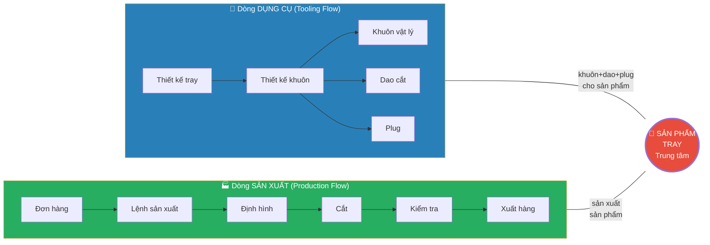
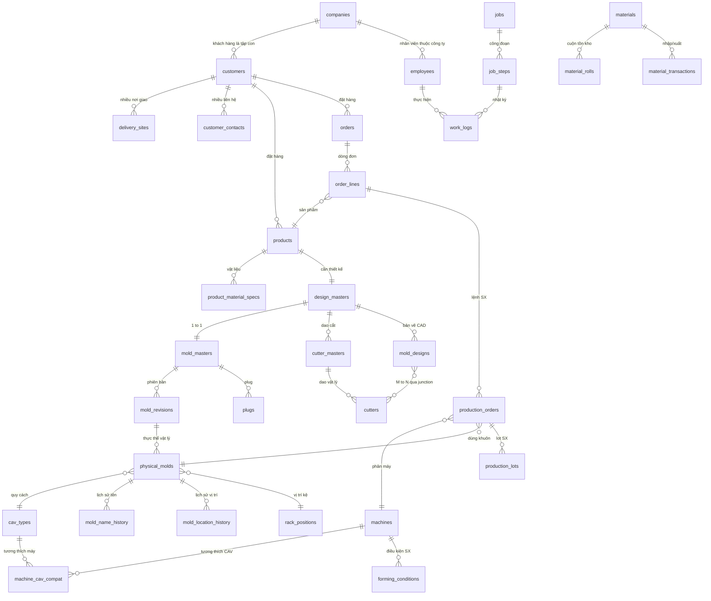

# 🏗️ YSDMS NextGen — Thiết kế Database Schema
# データベーススキーマ設計 — 業務フロー中心

> **Trạng thái:** Chờ PO xác nhận trước khi triển khai
> **Ngày:** 2026-06-03
> **Phương pháp:** Luồng nghiệp vụ → Thực thể → Quan hệ → Schema

---

## 1. XÁC ĐỊNH TRUNG TÂM HỆ THỐNG

### 1.1 Hai dòng chảy chính



> [!IMPORTANT]
> **TRUNG TÂM = SẢN PHẨM (Tray/Product)**
> - Mọi thứ xoay quanh: "sản xuất khay gì cho khách hàng nào"
> - Sản phẩm CÓ thiết kế, CẦN bộ dụng cụ (khuôn+dao+plug), CHẠY trên máy
> - Đơn hàng ĐẶT sản phẩm, Lệnh SX THỰC HIỆN sản phẩm

### 1.2 Quan hệ truy xuất ngược — Đảm bảo đổi tên vẫn truy được

```
Khuôn vật lý (physical_stamp: "JAE-001AB R2")
  │
  ├── system_code: "JAE-001AB-R2"          ← Mã hệ thống bất biến
  │
  ├── FK → mold_revision (R2)              ← Phiên bản cải tạo
  │         └── FK → mold_master           ← Khuôn gốc (JAE-001AB)
  │                   └── FK → mold_design ← Thiết kế CAD (.dwg)
  │                             └── FK → product (Tray) ← Sản phẩm
  │                                        └── FK → customer ← Khách hàng
  │
  ├── mold_name_history[]                  ← Lịch sử đổi tên (audit)
  │     [2020: "JAE-001AB", 2024: "JAE-001AB R2"]
  │
  └── FK → cav_type (ZF = 300×285)         ← Quy cách kích thước
        └── machine_cav_compat → machines[] ← Máy tương thích
```

**Khi đổi tên khuôn vật lý:**
1. Cập nhật `physical_stamp` mới
2. Ghi lịch sử vào `mold_name_history`
3. `system_code` và `mold_revision_id` (FK) KHÔNG ĐỔI
4. → Luôn truy xuất ngược được về thiết kế gốc

---

## 2. SƠ ĐỒ TỔNG THỂ — 9 DOMAIN (cập nhật từ dữ liệu thực)

> [!IMPORTANT]
> **Đính chính quan trọng từ dữ liệu MoldCutterSearch (67 CSV):**
> 1. `companies` (1,726 bản ghi) là bảng CHA → `customers` (51) là tập con
> 2. `design_masters` (4,589) tồn tại song song với `mold_masters` (4,589) — 1:1
> 3. `cutter_masters` (1,692) tồn tại riêng — nhóm dao theo thiết kế
> 4. `mold_design_cutters` — bảng liên kết M:N giữa khuôn và dao
> 5. `item_types` (11 loại) + `processing_items` (21 loại) — phân loại dụng cụ và công đoạn
> 6. `destinations` (17) — vị trí di chuyển trong nhà máy



---

## 3. CHI TIẾT TỪNG DOMAIN

### DOMAIN 0: Tổ chức (組織) — BỔ SUNG MỚI

> [!WARNING]
> **Phát hiện từ dữ liệu thực:** `companies.csv` có **1,726** bản ghi, bao gồm cả khách hàng, nhà thầu phụ, nhà cung cấp.
> `customers.csv` chỉ có **51** bản ghi — là TẬP CON của companies.
> → Companies là bảng CHA, customers kế thừa từ companies.

```sql
-- ═══════════════════════════════════════════════
-- D0: TỔ CHỨC (COMPANIES + EMPLOYEES)
-- Nguồn: companies.csv (1,726), employees.csv (24), machiningcustomer.csv (6)
-- ⚡ Companies = bảng CHA. Customers/Suppliers/Subcontractors = vai trò.
-- ═══════════════════════════════════════════════

CREATE TABLE companies (
    company_id        UUID PRIMARY KEY DEFAULT gen_random_uuid(),
    company_code      TEXT UNIQUE NOT NULL,     -- YSD, SAKATA, MARUDAI, NICHISAN
    company_name      TEXT NOT NULL,            -- 坂田精文堂, 茨城（株）丸大
    company_name_romaji TEXT,                   -- SAKATA, MARUDAI
    company_type      TEXT[],                   -- {'CUSTOMER','SUBCONTRACTOR','SUPPLIER'}
    -- Đường dẫn thư mục
    order_folder_path TEXT,                     -- \\ysd-folder\注文書\SAKATA\
    cad_folder_path   TEXT,                     -- \\ysd-cad\SAKATA\
    address           TEXT,
    tel               TEXT,
    fax               TEXT,
    is_active         BOOLEAN DEFAULT true,
    notes             TEXT,
    created_at        TIMESTAMPTZ DEFAULT now(),
    updated_at        TIMESTAMPTZ DEFAULT now(),
    updated_by        TEXT
);

CREATE TABLE employees (
    employee_id       UUID PRIMARY KEY DEFAULT gen_random_uuid(),
    employee_code     TEXT UNIQUE NOT NULL,
    employee_name     TEXT NOT NULL,            -- 新井, 谷口, クアン
    employee_name_short TEXT,                   -- ARAI, TANIGUCHI
    company_id        UUID REFERENCES companies(company_id), -- Thuộc công ty nào
    department        TEXT,                     -- 営業/設計/金型/成形/検査/業務
    role              TEXT,
    order_code        TEXT,                     -- Mã trên chỉ thị (từ Access)
    joining_date      DATE,
    is_active         BOOLEAN DEFAULT true,
    created_at        TIMESTAMPTZ DEFAULT now(),
    updated_at        TIMESTAMPTZ DEFAULT now()
);

-- Vị trí/Điểm đến trong nhà máy (destinations)
CREATE TABLE destinations (
    destination_id    UUID PRIMARY KEY DEFAULT gen_random_uuid(),
    destination_name  TEXT UNIQUE NOT NULL,     -- 出荷, 金型室-写真撮影, テフロン加工,
                                                -- 06号成形機, 坂田精文堂...
    destination_type  TEXT,                     -- SHIP/FACTORY/MACHINE/EXTERNAL
    is_active         BOOLEAN DEFAULT true
);
```

### DOMAIN 1: Khách hàng (顧客)

```sql
-- ═══════════════════════════════════════════════
-- D1: KHÁCH HÀNG (tập con của Companies)
-- Nguồn: customers.csv (51), destinations.csv, 納入先一覧表 (1,069 dòng)
-- ═══════════════════════════════════════════════

CREATE TABLE customers (
    customer_id       UUID PRIMARY KEY DEFAULT gen_random_uuid(),
    company_id        UUID NOT NULL REFERENCES companies(company_id), -- ← Kế thừa từ CHA
    customer_code     TEXT UNIQUE NOT NULL,     -- Mã rút gọn: JAE, IRI, SMK
    customer_name_ja  TEXT NOT NULL,            -- 日本電産エレシス(株)
    customer_name_romaji TEXT,                  -- NIDEC ELESYS
    customer_name_kana TEXT,                    -- ニホンデンサンエレシス
    customer_no       INTEGER,                 -- Số KH nội bộ (từ Access)
    contact_person    TEXT,                     -- Người liên hệ chính
    -- Thư mục
    order_folder      TEXT,
    cad_folder        TEXT,
    is_active         BOOLEAN DEFAULT true,
    notes             TEXT,
    created_at        TIMESTAMPTZ DEFAULT now(),
    updated_at        TIMESTAMPTZ DEFAULT now(),
    updated_by        TEXT
);

CREATE TABLE customer_contacts (
    contact_id        UUID PRIMARY KEY DEFAULT gen_random_uuid(),
    customer_id       UUID NOT NULL REFERENCES customers(customer_id),
    contact_name      TEXT NOT NULL,            -- 早坂, 鎌田, 遠藤
    contact_role      TEXT,                     -- 購買, 技術, 品管
    contact_email     TEXT,
    contact_tel       TEXT,
    is_primary        BOOLEAN DEFAULT false,
    created_at        TIMESTAMPTZ DEFAULT now(),
    updated_at        TIMESTAMPTZ DEFAULT now()
);

CREATE TABLE delivery_sites (
    site_id           UUID PRIMARY KEY DEFAULT gen_random_uuid(),
    customer_id       UUID NOT NULL REFERENCES customers(customer_id),
    site_code         TEXT NOT NULL,            -- ADV1, ADV5, HAE01
    site_name         TEXT NOT NULL,            -- 第3ヤード受入係
    site_address      TEXT,
    site_tel          TEXT,
    site_fax          TEXT,
    delivery_notes    TEXT,                     -- 購買Gr. 湘南チーム 昆野 様宛
    is_active         BOOLEAN DEFAULT true,
    created_at        TIMESTAMPTZ DEFAULT now(),
    updated_at        TIMESTAMPTZ DEFAULT now()
);
```

### DOMAIN 2: Sản phẩm / Khay (製品/トレイ) — TRUNG TÂM

```sql
-- ═══════════════════════════════════════════════
-- D2: SẢN PHẨM (TRUNG TÂM HỆ THỐNG)
-- Nguồn: tray.csv (131KB, 6,887 dòng), trays.csv, トレイデータ一覧表
-- ═══════════════════════════════════════════════

CREATE TABLE products (
    product_id        UUID PRIMARY KEY DEFAULT gen_random_uuid(),
    product_code      TEXT UNIQUE NOT NULL,     -- YSD型番: JAE-316, IRI-003
    customer_id       UUID NOT NULL REFERENCES customers(customer_id),
    customer_pn       TEXT,                     -- KH品番: K-18052S-01-02, 025-60050
    product_name_ja   TEXT,                     -- JAE-316 025-60050 MX34R16VF※T 40P
    product_name_en   TEXT,                     -- TRAY FOR HMZD CONN.COVER 2PAIR

    -- Thông số sản phẩm
    pocket_count      INTEGER,                 -- 40P = 40 pocket
    pieces_per_box    INTEGER,                  -- 入数: 200
    box_spec          TEXT,                     -- 荷姿: 200×2箱

    -- Liên kết thiết kế (1 sản phẩm → 1 khuôn master)
    mold_master_id    UUID REFERENCES mold_masters(mold_master_id),

    -- Trạng thái
    product_status    TEXT DEFAULT 'ACTIVE',    -- ACTIVE/DISCONTINUED/ARCHIVED
    date_entry        TIMESTAMPTZ,
    notes             TEXT,

    created_at        TIMESTAMPTZ DEFAULT now(),
    updated_at        TIMESTAMPTZ DEFAULT now(),
    updated_by        TEXT
);

CREATE TABLE product_material_specs (
    spec_id           UUID PRIMARY KEY DEFAULT gen_random_uuid(),
    product_id        UUID NOT NULL REFERENCES products(product_id),
    material_type     TEXT NOT NULL,            -- PS, PET, PP, PVC
    material_grade    TEXT,                     -- CL, N, G
    thickness_mm      NUMERIC(4,2),            -- 0.50, 0.80, 1.00
    sheet_width_mm    INTEGER,                 -- 520, 550, 640
    static_charge     TEXT,                     -- 導電印刷, カーボン練り込み, 無
    silicone          TEXT,                     -- シリコン有, シリコン無
    coating           TEXT,                     -- 塗布有, 塗布無
    is_default        BOOLEAN DEFAULT true,     -- Vật liệu mặc định
    notes             TEXT,
    created_at        TIMESTAMPTZ DEFAULT now(),
    updated_at        TIMESTAMPTZ DEFAULT now()
);
```

### DOMAIN 3: Dụng cụ — Khuôn / Dao / Plug (金型・抜型・プラグ)

> [!IMPORTANT]
> **Thiết kế 5 lớp:** DesignMaster → MoldMaster → MoldRevision → PhysicalMold → MoldNameHistory
>
> **Phát hiện từ dữ liệu:**
> - `designmaster.csv` (4,589) = nhóm thiết kế gốc (design grouping)
> - `moldmaster.csv` (4,589) = nhóm khuôn gốc — **1:1 với design_masters**
> - `moldrevision.csv` (4,590) = phiên bản khuôn (gốc, R1, R2...)
> - `molds.csv` (thực thể vật lý)
> - `cuttermaster.csv` (1,692) = nhóm dao — riêng biệt
> - `moldcutter.csv` = **M:N** junction giữa dao và khuôn

```sql
-- ═══════════════════════════════════════════════
-- D3: DỤNG CỤ (TOOLING)
-- Nguồn: designmaster(4589), moldmaster(4589), moldrevision(4590),
--         molds, cuttermaster(1692), cutters, moldcutter, cav(58)
-- ═══════════════════════════════════════════════

-- Phân loại dụng cụ (11 loại — từ itemtype.csv)
CREATE TABLE item_types (
    item_type_id      SERIAL PRIMARY KEY,
    item_type_code    TEXT UNIQUE NOT NULL,     -- MOLD, CUTTER, PLUG, ALUMI,
                                                -- WATER_COOLING_BASE, PRESSURE_BASE,
                                                -- STACKING, FRAME, MACHINE, TEST_MOLD, OTHER
    item_type_name_ja TEXT NOT NULL,            -- 金型, 抜型, プラグ...
    item_type_name_vi TEXT
);

-- CAV Type (quy cách khuôn — 57 loại, bỏ OTHER)
CREATE TABLE cav_types (
    cav_type_id       UUID PRIMARY KEY DEFAULT gen_random_uuid(),
    cav_code          TEXT UNIQUE NOT NULL,     -- A-74B, ZF, 74H, TEST
    cav_series        TEXT,                     -- C6, JAE, PS
    cav_length_mm     INTEGER NOT NULL,         -- 470, 300, 585
    cav_width_mm      INTEGER NOT NULL,         -- 300, 285, 285
    machine_group     TEXT NOT NULL,            -- '53b' | '74' | 'special'
    alias_cav_code    TEXT,                     -- A-74B ↔ 74B-A (alias đôi)
    is_active         BOOLEAN DEFAULT true,
    notes             TEXT,
    created_at        TIMESTAMPTZ DEFAULT now(),
    updated_at        TIMESTAMPTZ DEFAULT now()
);

-- ⚡ Design Master — nhóm thiết kế gốc (bao trùm)
CREATE TABLE design_masters (
    design_master_id  UUID PRIMARY KEY DEFAULT gen_random_uuid(),
    design_master_code TEXT UNIQUE NOT NULL,    -- JAE-001AB
    design_master_name TEXT NOT NULL,
    customer_id       UUID NOT NULL REFERENCES customers(customer_id),
    product_id        UUID REFERENCES products(product_id),
    active_revision_id UUID,                    -- → mold_revisions (set sau)
    status            TEXT DEFAULT 'ACTIVE',
    created_at        TIMESTAMPTZ DEFAULT now(),
    updated_at        TIMESTAMPTZ DEFAULT now(),
    updated_by        TEXT
);

-- Thiết kế khuôn (CAD) — bản vẽ .dwg (mỗi version)
CREATE TABLE mold_designs (
    design_id         UUID PRIMARY KEY DEFAULT gen_random_uuid(),
    design_code       TEXT UNIQUE NOT NULL,     -- IRI-003(Q), JAE-335M(Q)
    design_master_id  UUID REFERENCES design_masters(design_master_id),
    customer_id       UUID REFERENCES customers(customer_id),
    cav_type_id       UUID REFERENCES cav_types(cav_type_id),

    -- Thông số thiết kế
    design_length_mm  NUMERIC(6,1),
    design_width_mm   NUMERIC(6,1),
    design_height_mm  NUMERIC(6,1),
    design_depth_mm   NUMERIC(6,1),
    design_weight     TEXT,
    pocket_numbers    INTEGER,
    piece_count       INTEGER,                 -- 1面取り, 2面取り
    pitch_mm          NUMERIC(6,1),
    cutline_x_mm      NUMERIC(6,1),
    cutline_y_mm      NUMERIC(6,1),
    corner_r          TEXT,
    chamfer_c         TEXT,
    mold_orientation  TEXT,                     -- 上/下 (Upper/Lower)
    mold_setup_type   TEXT,                     -- Kiểu setup
    under_angle       TEXT,
    under_depth       TEXT,
    draft_angle       TEXT,
    has_plug          BOOLEAN DEFAULT false,
    has_separate_cutter BOOLEAN DEFAULT false,
    design_for_plastic_type TEXT,               -- PS, PET, PP...

    -- Thông tin tạo
    designer          TEXT,                     -- Quản, Toàn...
    design_date       TIMESTAMPTZ,
    cad_folder_path   TEXT,                     -- \\ysd-cad\新規仕掛\IRI-003\
    customer_drawing_no TEXT,                   -- Mã bản vẽ KH
    customer_equipment_no TEXT,                 -- Mã thiết bị KH
    customer_tray_name TEXT,                    -- Tên khay KH gọi
    text_content      TEXT,                     -- Chữ khắc trên tray
    version_note      TEXT,

    created_at        TIMESTAMPTZ DEFAULT now(),
    updated_at        TIMESTAMPTZ DEFAULT now(),
    updated_by        TEXT
);

-- Khuôn Master — danh tính khuôn (bất biến, gốc, 1:1 với DesignMaster)
CREATE TABLE mold_masters (
    mold_master_id    UUID PRIMARY KEY DEFAULT gen_random_uuid(),
    mold_master_code  TEXT UNIQUE NOT NULL,     -- JAE-001AB (system_code gốc, không R)
    mold_master_name  TEXT NOT NULL,            -- Tên hiển thị
    design_master_id  UUID NOT NULL REFERENCES design_masters(design_master_id),
    customer_id       UUID NOT NULL REFERENCES customers(customer_id),
    product_id        UUID REFERENCES products(product_id),
    mold_class        TEXT DEFAULT 'STD',       -- STD | TEST | SPECIAL
    status            TEXT DEFAULT 'ACTIVE',
    notes             TEXT,
    created_at        TIMESTAMPTZ DEFAULT now(),
    updated_at        TIMESTAMPTZ DEFAULT now(),
    updated_by        TEXT
);

-- Phiên bản khuôn (gốc / R1 / R2 / R3...)
CREATE TABLE mold_revisions (
    revision_id       UUID PRIMARY KEY DEFAULT gen_random_uuid(),
    mold_master_id    UUID NOT NULL REFERENCES mold_masters(mold_master_id),
    design_id         UUID REFERENCES mold_designs(design_id),     -- Thiết kế cho phiên bản này
    revision_code     TEXT,                     -- NULL = gốc, 'R1', 'R2'...
    revision_name     TEXT NOT NULL,            -- JAE-001AB, JAE-001AB R1
    revision_reason   TEXT,                     -- 改造指示, 顧客要求...
    effective_date    TIMESTAMPTZ,
    is_active         BOOLEAN DEFAULT true,     -- Phiên bản hiện hành

    UNIQUE(mold_master_id, revision_code),
    created_at        TIMESTAMPTZ DEFAULT now(),
    updated_at        TIMESTAMPTZ DEFAULT now(),
    updated_by        TEXT
);

-- ⚡ Khuôn vật lý — thực thể khuôn trong nhà xưởng
CREATE TABLE physical_molds (
    physical_mold_id  UUID PRIMARY KEY DEFAULT gen_random_uuid(),
    -- 3 lớp tên (V4 naming)
    system_code       TEXT UNIQUE NOT NULL,     -- JAE-001AB-R2-N1--2P
    display_name      TEXT NOT NULL,            -- JAE-001 AB R2 N1 2P
    physical_stamp    TEXT,                     -- JAE-001AB R2 (khắc trên khuôn)

    -- Liên kết truy xuất ngược
    mold_revision_id  UUID NOT NULL REFERENCES mold_revisions(revision_id),
    cav_type_id       UUID REFERENCES cav_types(cav_type_id),

    -- Thông số vật lý (có thể khác thiết kế sau cải tạo)
    actual_length_mm  TEXT,
    actual_width_mm   TEXT,
    actual_height_mm  TEXT,
    actual_weight     TEXT,

    -- Vị trí & trạng thái
    rack_position_id  UUID REFERENCES rack_positions(rack_position_id),
    keeper_company_id UUID REFERENCES companies(company_id),
    device_status     TEXT DEFAULT 'ACTIVE',    -- ACTIVE/RETURNED/DISPOSED/MAINTENANCE
    usage_status      TEXT DEFAULT 'IN_STOCK',  -- IN_STOCK/IN_USE/IN_TRANSIT

    -- Lịch sử trạng thái
    mold_entry_date   TIMESTAMPTZ,             -- Ngày nhập kho
    disposed_date     TIMESTAMPTZ,
    returned_date     TIMESTAMPTZ,

    -- Copy number (N1, N2) — parsed from system_code
    copy_number       INTEGER DEFAULT 0,        -- 0 = đơn, 1 = N1, 2 = N2
    -- Số mảnh — parsed from system_code
    piece_count       INTEGER DEFAULT 1,        -- 1, 2, 3... (面取り)
    -- Loại
    mold_type         TEXT DEFAULT 'M',         -- M = chính, D = test pocket

    -- QR
    qr_uuid           UUID DEFAULT gen_random_uuid(),
    qr_url            TEXT GENERATED ALWAYS AS ('https://ysdms.app/m/' || qr_uuid) STORED,
    on_checklist      BOOLEAN DEFAULT false,

    notes             TEXT,
    created_at        TIMESTAMPTZ DEFAULT now(),
    updated_at        TIMESTAMPTZ DEFAULT now(),
    updated_by        TEXT
);

-- Lịch sử đổi tên khuôn (audit trail)
CREATE TABLE mold_name_history (
    history_id        UUID PRIMARY KEY DEFAULT gen_random_uuid(),
    physical_mold_id  UUID NOT NULL REFERENCES physical_molds(physical_mold_id),
    old_system_code   TEXT,
    new_system_code   TEXT NOT NULL,
    old_physical_stamp TEXT,
    new_physical_stamp TEXT,
    change_reason     TEXT,                     -- 改造, 訂正, 初回登録
    changed_by        TEXT,
    changed_at        TIMESTAMPTZ DEFAULT now()
);

-- Lịch sử di chuyển vị trí khuôn
CREATE TABLE mold_location_history (
    location_log_id   UUID PRIMARY KEY DEFAULT gen_random_uuid(),
    physical_mold_id  UUID NOT NULL REFERENCES physical_molds(physical_mold_id),
    old_rack_position UUID REFERENCES rack_positions(rack_position_id),
    new_rack_position UUID REFERENCES rack_positions(rack_position_id),
    moved_by          UUID REFERENCES employees(employee_id),
    moved_at          TIMESTAMPTZ DEFAULT now(),
    notes             TEXT
);

-- Bảo trì khuôn (Teflon, sửa chữa...)
CREATE TABLE mold_maintenance (
    maintenance_id    UUID PRIMARY KEY DEFAULT gen_random_uuid(),
    physical_mold_id  UUID NOT NULL REFERENCES physical_molds(physical_mold_id),
    maintenance_type  TEXT NOT NULL,            -- TEFLON/REPAIR/POLISH/OTHER
    request_date      TIMESTAMPTZ,
    completed_date    TIMESTAMPTZ,
    vendor_id         UUID REFERENCES companies(company_id),
    employee_id       UUID REFERENCES employees(employee_id),
    reason            TEXT,
    result            TEXT,
    cost              NUMERIC(10,2),
    status            TEXT DEFAULT 'REQUESTED', -- REQUESTED/IN_PROGRESS/COMPLETED
    notes             TEXT,
    created_at        TIMESTAMPTZ DEFAULT now(),
    updated_at        TIMESTAMPTZ DEFAULT now()
);

-- ⚡ Dao cắt Master — nhóm dao (từ cuttermaster.csv: 1,692)
CREATE TABLE cutter_masters (
    cutter_master_id  UUID PRIMARY KEY DEFAULT gen_random_uuid(),
    cutter_master_code TEXT UNIQUE NOT NULL,    -- Mã nhóm dao
    cutter_master_name TEXT NOT NULL,
    design_master_id  UUID REFERENCES design_masters(design_master_id),
    customer_id       UUID REFERENCES customers(customer_id),
    product_id        UUID REFERENCES products(product_id),
    status            TEXT DEFAULT 'ACTIVE',
    created_at        TIMESTAMPTZ DEFAULT now(),
    updated_at        TIMESTAMPTZ DEFAULT now()
);

-- Dao cắt vật lý (抜型)
CREATE TABLE cutters (
    cutter_id         UUID PRIMARY KEY DEFAULT gen_random_uuid(),
    cutter_no         TEXT UNIQUE NOT NULL,     -- Mã dao (cutter_no)
    cutter_code       TEXT,                     -- Mã phụ
    cutter_name       TEXT NOT NULL,
    cutter_master_id  UUID REFERENCES cutter_masters(cutter_master_id),
    cutter_design_code TEXT,                    -- Mã thiết kế dao
    customer_id       UUID REFERENCES customers(customer_id),
    mold_design_id    UUID REFERENCES mold_designs(design_id), -- Thiết kế khuôn liên quan
    item_type_id      INTEGER REFERENCES item_types(item_type_id),

    -- Thông số
    blade_count       TEXT,
    pitch_mm          NUMERIC(6,1),
    cutter_length_mm  NUMERIC(6,1),
    cutter_width_mm   NUMERIC(6,1),
    cutter_height_mm  NUMERIC(6,1),
    cutter_type       TEXT,                     -- トムソン, ピナクル...
    post_cut_length   NUMERIC(6,1),
    post_cut_width    NUMERIC(6,1),
    cutline_length    NUMERIC(6,1),
    cutline_width     NUMERIC(6,1),
    corner_r          TEXT,
    chamfer_c         TEXT,
    plastic_cut_type  TEXT,
    pp_cushion_use    TEXT,
    mold_shared       TEXT,                     -- Chia sẻ khuôn?

    -- Vị trí & trạng thái
    rack_position_id  UUID REFERENCES rack_positions(rack_position_id),
    keeper_company_id UUID REFERENCES companies(company_id),
    storage_company_id UUID REFERENCES companies(company_id),
    usage_status      TEXT DEFAULT 'ACTIVE',
    cutter_presence   BOOLEAN DEFAULT true,
    date_entry        TIMESTAMPTZ,

    -- QR (dán trên hộp dao)
    qr_uuid           UUID DEFAULT gen_random_uuid(),

    notes             TEXT,
    created_at        TIMESTAMPTZ DEFAULT now(),
    updated_at        TIMESTAMPTZ DEFAULT now(),
    updated_by        TEXT
);

-- Junction: Khuôn ↔ Dao (M:N — từ moldcutter.csv)
CREATE TABLE mold_design_cutters (
    id                UUID PRIMARY KEY DEFAULT gen_random_uuid(),
    cutter_id         UUID NOT NULL REFERENCES cutters(cutter_id),
    mold_design_id    UUID NOT NULL REFERENCES mold_designs(design_id),
    date_entry        TIMESTAMPTZ,
    notes             TEXT,
    UNIQUE(cutter_id, mold_design_id)
);

-- Plug (プラグ — nắp khuôn gỗ)
CREATE TABLE plugs (
    plug_id           UUID PRIMARY KEY DEFAULT gen_random_uuid(),
    plug_code         TEXT UNIQUE NOT NULL,
    plug_name         TEXT NOT NULL,
    mold_master_id    UUID REFERENCES mold_masters(mold_master_id),
    material          TEXT DEFAULT 'WOOD',      -- WOOD/RESIN/ALUMINUM
    rack_position_id  UUID REFERENCES rack_positions(rack_position_id),
    status            TEXT DEFAULT 'ACTIVE',
    notes             TEXT,
    created_at        TIMESTAMPTZ DEFAULT now(),
    updated_at        TIMESTAMPTZ DEFAULT now()
);

-- Nhật ký trạng thái thiết bị (di chuyển, xuất kho...) — từ statuslogs.csv (304)
CREATE TABLE equipment_status_logs (
    log_id            UUID PRIMARY KEY DEFAULT gen_random_uuid(),
    physical_mold_id  UUID REFERENCES physical_molds(physical_mold_id),
    cutter_id         UUID REFERENCES cutters(cutter_id),
    item_type_id      INTEGER REFERENCES item_types(item_type_id),
    status            TEXT,
    destination_id    UUID REFERENCES destinations(destination_id),
    employee_id       UUID REFERENCES employees(employee_id),
    session_id        TEXT,                     -- Phiên làm việc
    session_name      TEXT,
    notes             TEXT,
    logged_at         TIMESTAMPTZ DEFAULT now()
);

-- Nhật ký xuất/nhập thiết bị (shiplog — 339 bản ghi)
CREATE TABLE equipment_ship_logs (
    ship_id           UUID PRIMARY KEY DEFAULT gen_random_uuid(),
    customer_id       UUID REFERENCES customers(customer_id),
    item_type_id      INTEGER REFERENCES item_types(item_type_id),
    ship_item_name    TEXT,
    ship_date         TIMESTAMPTZ,
    from_company_id   UUID REFERENCES companies(company_id),
    to_company_id     UUID REFERENCES companies(company_id),
    physical_mold_id  UUID REFERENCES physical_molds(physical_mold_id),
    cutter_id         UUID REFERENCES cutters(cutter_id),
    ship_status       TEXT,
    notes             TEXT,
    created_at        TIMESTAMPTZ DEFAULT now()
);
```

### DOMAIN 4: Máy móc & Điều kiện SX (機械・成形条件)

```sql
-- ═══════════════════════════════════════════════
-- D4: MÁY MÓC
-- Nguồn: machine.csv, 成形条件表 (1,379 dòng), PO xác nhận
-- ═══════════════════════════════════════════════

CREATE TABLE machines (
    machine_id        UUID PRIMARY KEY DEFAULT gen_random_uuid(),
    machine_code      TEXT UNIQUE NOT NULL,     -- M04, M05, M06...
    machine_name      TEXT NOT NULL,            -- 4号機, 5号機...
    machine_type      TEXT NOT NULL,            -- FORMING/PRESS/CNC/GRINDER
    manufacturer      TEXT,                     -- ILLIG
    model             TEXT,                     -- RV-53b, RV-74c, RV-74d
    max_mold_length   INTEGER,                 -- Kích thước khuôn tối đa (mm)
    max_mold_width    INTEGER,
    max_sheet_width   INTEGER,                 -- Khổ sheet tối đa
    location          TEXT,                     -- 本社, 青森, 台湾
    machine_group     TEXT,                     -- '53b' | '74' | 'taiwan' | 'cnc' | 'press'
    is_active         BOOLEAN DEFAULT true,
    notes             TEXT,
    created_at        TIMESTAMPTZ DEFAULT now(),
    updated_at        TIMESTAMPTZ DEFAULT now()
);

-- Bảng tương thích Máy ↔ CAV
CREATE TABLE machine_cav_compatibility (
    compat_id         UUID PRIMARY KEY DEFAULT gen_random_uuid(),
    machine_id        UUID NOT NULL REFERENCES machines(machine_id),
    cav_type_id       UUID NOT NULL REFERENCES cav_types(cav_type_id),
    is_preferred      BOOLEAN DEFAULT false,    -- Máy ưu tiên cho CAV này
    notes             TEXT,
    UNIQUE(machine_id, cav_type_id)
);

-- Điều kiện thành hình (成形条件) — PER máy × sản phẩm
CREATE TABLE forming_conditions (
    condition_id      UUID PRIMARY KEY DEFAULT gen_random_uuid(),
    machine_id        UUID NOT NULL REFERENCES machines(machine_id),
    product_id        UUID NOT NULL REFERENCES products(product_id),
    cav_type_id       UUID REFERENCES cav_types(cav_type_id),

    -- Thiết bị đi kèm
    plug_used         BOOLEAN DEFAULT false,
    cooling_base_type TEXT,                     -- A~X (水冷盤TYPE)
    frame_type        TEXT,                     -- A~X (枠TYPE)
    cutter_code       TEXT,                     -- Mã dao cắt
    stacking_upper    TEXT,                     -- Xếp chồng trên
    stacking_lower    TEXT,                     -- Xếp chồng dưới
    heater_position   INTEGER,                 -- Vị trí heater dưới (mm)

    -- Thông số F2~F5 (JSON — linh hoạt)
    f2_heater_zones   JSONB,                   -- 12 zone nhiệt độ
    f3_timing         JSONB,                   -- 4 thông số thời gian
    f4_process        JSONB,                   -- 9 thông số quy trình
    f5_extra          JSONB,                   -- Thông số bổ sung

    is_verified       BOOLEAN DEFAULT false,    -- Đã xác nhận hoạt động
    last_used_date    TIMESTAMPTZ,
    notes             TEXT,

    UNIQUE(machine_id, product_id),
    created_at        TIMESTAMPTZ DEFAULT now(),
    updated_at        TIMESTAMPTZ DEFAULT now()
);
```

### DOMAIN 5: Đơn hàng (受注)

```sql
-- ═══════════════════════════════════════════════
-- D5: ĐƠN HÀNG
-- Nguồn: orderhead.csv, orderline.csv, 注文書 Excel, 受注一覧 (3,014 dòng)
-- ═══════════════════════════════════════════════

CREATE TABLE orders (
    order_id          UUID PRIMARY KEY DEFAULT gen_random_uuid(),
    order_no          TEXT UNIQUE NOT NULL,     -- 261881, TO-2
    customer_id       UUID NOT NULL REFERENCES customers(customer_id),
    order_date        DATE NOT NULL,
    requested_delivery DATE,
    order_status      TEXT DEFAULT 'NEW',       -- NEW/CONFIRMED/IN_PRODUCTION/SHIPPED/CLOSED
    customer_po       TEXT,                     -- KH yêu cầu No: 4218723411
    contact_person    TEXT,
    order_source      TEXT,                     -- FAX/EMAIL/PHONE
    notes             TEXT,
    created_at        TIMESTAMPTZ DEFAULT now(),
    updated_at        TIMESTAMPTZ DEFAULT now(),
    updated_by        TEXT
);

CREATE TABLE order_lines (
    line_id           UUID PRIMARY KEY DEFAULT gen_random_uuid(),
    order_id          UUID NOT NULL REFERENCES orders(order_id),
    line_no           INTEGER NOT NULL,
    product_id        UUID NOT NULL REFERENCES products(product_id),
    quantity          INTEGER NOT NULL,
    unit              TEXT DEFAULT 'PCS',
    due_date          DATE,
    delivery_site_id  UUID REFERENCES delivery_sites(site_id),
    line_status       TEXT DEFAULT 'NEW',
    priority          INTEGER DEFAULT 1,

    -- Vật liệu cụ thể cho đơn này (có thể khác mặc định)
    material_spec_id  UUID REFERENCES product_material_specs(spec_id),

    notes             TEXT,
    UNIQUE(order_id, line_no),
    created_at        TIMESTAMPTZ DEFAULT now(),
    updated_at        TIMESTAMPTZ DEFAULT now()
);

-- Báo giá
CREATE TABLE quotations (
    quotation_id      UUID PRIMARY KEY DEFAULT gen_random_uuid(),
    quotation_no      TEXT UNIQUE NOT NULL,     -- Số serial: №515
    customer_id       UUID NOT NULL REFERENCES customers(customer_id),
    quote_date        DATE NOT NULL,
    valid_until       DATE,
    total_amount      NUMERIC(12,2),
    status            TEXT DEFAULT 'DRAFT',     -- DRAFT/SENT/ACCEPTED/REJECTED
    file_path         TEXT,                     -- Đường dẫn file PDF
    notes             TEXT,
    created_at        TIMESTAMPTZ DEFAULT now(),
    updated_at        TIMESTAMPTZ DEFAULT now()
);
```

### DOMAIN 6: Sản xuất (生産)

```sql
-- ═══════════════════════════════════════════════
-- D6: SẢN XUẤT
-- Nguồn: productionplan.csv, productionplanstep.csv, productionschedule.csv,
--         forminglot.csv, productionresult.csv
-- ═══════════════════════════════════════════════

-- Lệnh sản xuất (= 注文書/納入指示書)
CREATE TABLE production_orders (
    po_id             UUID PRIMARY KEY DEFAULT gen_random_uuid(),
    po_code           TEXT UNIQUE NOT NULL,     -- PLAN-261881-01
    order_line_id     UUID REFERENCES order_lines(line_id),

    -- Phân bổ máy & khuôn
    machine_id        UUID REFERENCES machines(machine_id),
    physical_mold_id  UUID REFERENCES physical_molds(physical_mold_id),
    cutter_id         UUID REFERENCES cutters(cutter_id),

    -- Kế hoạch
    planned_quantity  INTEGER,
    planned_start     TIMESTAMPTZ,
    planned_end       TIMESTAMPTZ,
    priority          INTEGER DEFAULT 1,

    -- Thông số vật liệu
    material_type     TEXT,                     -- PS(G), PET(BK)
    material_thickness NUMERIC(4,2),
    material_width    INTEGER,
    forming_location  TEXT,                     -- 本社/坂田/台湾

    -- Trạng thái
    po_status         TEXT DEFAULT 'PLANNED',   -- PLANNED/IN_PROGRESS/COMPLETED/CANCELLED
    actual_quantity    INTEGER,
    actual_start      TIMESTAMPTZ,
    actual_end        TIMESTAMPTZ,

    notes             TEXT,
    created_at        TIMESTAMPTZ DEFAULT now(),
    updated_at        TIMESTAMPTZ DEFAULT now(),
    updated_by        TEXT
);

-- Kết quả sản xuất theo lot
CREATE TABLE production_lots (
    lot_id            UUID PRIMARY KEY DEFAULT gen_random_uuid(),
    po_id             UUID NOT NULL REFERENCES production_orders(po_id),
    lot_no            TEXT NOT NULL,
    machine_id        UUID REFERENCES machines(machine_id),
    operator_id       UUID REFERENCES employees(employee_id),
    start_time        TIMESTAMPTZ,
    end_time          TIMESTAMPTZ,
    input_quantity    INTEGER,
    good_quantity     INTEGER,
    ng_quantity       INTEGER,
    scrap_quantity    INTEGER,
    lot_status        TEXT DEFAULT 'IN_PROGRESS',
    ship_date         DATE,
    package_spec      TEXT,                     -- 200×2箱
    notes             TEXT,
    created_at        TIMESTAMPTZ DEFAULT now(),
    updated_at        TIMESTAMPTZ DEFAULT now()
);
```

### DOMAIN 7: Công việc (ジョブ) — Generic cho tất cả loại công việc

```sql
-- ═══════════════════════════════════════════════
-- D7: CÔNG VIỆC
-- Nguồn: jobs.csv, worklog.csv, processingdeadline.csv,
--         processingitems.csv, processingstatus.csv
-- THIẾT KẾ: Hệ thống Job chung cho MỌI loại công việc
-- ═══════════════════════════════════════════════

-- Loại công việc
CREATE TABLE job_types (
    job_type_id       TEXT PRIMARY KEY,         -- MOLD_NEW, MOLD_MODIFY, PLUG, CUTTER,
                                                -- TEST_POCKET, COOLING_BASE, PRESSURE_BASE,
                                                -- FORMING, CUTTING, QC, SHIPPING,
                                                -- OFFICE, MAINTENANCE, OTHER
    job_type_name_ja  TEXT NOT NULL,
    job_type_name_vi  TEXT NOT NULL,
    description       TEXT
);

-- Job — đơn vị công việc
CREATE TABLE jobs (
    job_id            UUID PRIMARY KEY DEFAULT gen_random_uuid(),
    job_code          TEXT UNIQUE NOT NULL,     -- Mã job tự động: JOB-2026-001
    job_name          TEXT NOT NULL,            -- IRI-003 金型製造
    job_type_id       TEXT NOT NULL REFERENCES job_types(job_type_id),

    -- Liên kết (nullable — tùy loại job)
    mold_master_id    UUID REFERENCES mold_masters(mold_master_id),
    physical_mold_id  UUID REFERENCES physical_molds(physical_mold_id),
    mold_design_id    UUID REFERENCES mold_designs(design_id),
    production_order_id UUID REFERENCES production_orders(po_id),
    customer_id       UUID REFERENCES customers(customer_id),

    -- Người phụ trách
    responsible_id    UUID REFERENCES employees(employee_id),
    outsource_company UUID REFERENCES companies(company_id),

    -- Thời gian
    start_date        TIMESTAMPTZ,
    deadline          TIMESTAMPTZ,
    completed_date    TIMESTAMPTZ,
    estimated_hours   NUMERIC(6,1),

    -- Trạng thái
    job_status        TEXT DEFAULT 'NEW',       -- NEW/IN_PROGRESS/REVIEW/COMPLETED/CANCELLED
    approved          BOOLEAN DEFAULT false,
    priority          INTEGER DEFAULT 5,        -- 1(cao)~10(thấp)

    -- Kỳ kế toán
    year_period       INTEGER,
    month_period      INTEGER,

    notes             TEXT,
    created_at        TIMESTAMPTZ DEFAULT now(),
    updated_at        TIMESTAMPTZ DEFAULT now(),
    updated_by        TEXT
);

-- Loại công đoạn gia công (21 loại — từ processingitems.csv)
CREATE TABLE processing_items (
    processing_item_id SERIAL PRIMARY KEY,
    item_name         TEXT UNIQUE NOT NULL,     -- 金型, 試作ポケット, 水冷盤, 圧空ベース,
                                                -- プラグ, スタッキング, カッターベース,
                                                -- ロアテーブル, フレーム...
    description       TEXT,
    notes             TEXT
);

-- Trạng thái gia công (13 trạng thái — từ processingstatus.csv)
CREATE TABLE processing_statuses (
    status_id         SERIAL PRIMARY KEY,
    status_code       TEXT UNIQUE NOT NULL,     -- 0.未確認, 1.プログラム, 2.機械加工,
                                                -- 3.穴あけ, 4.ミガキ, 5.プラグ作成,
                                                -- 6.ネル貼り, F.完了, N.進行中, R.REQUEST
    status_name_vi    TEXT
);

-- Công đoạn gia công (processing deadlines — từng hạng mục trong job)
CREATE TABLE job_steps (
    step_id           UUID PRIMARY KEY DEFAULT gen_random_uuid(),
    job_id            UUID NOT NULL REFERENCES jobs(job_id),
    step_no           INTEGER NOT NULL,
    processing_item_id INTEGER REFERENCES processing_items(processing_item_id),
    processing_status_id INTEGER REFERENCES processing_statuses(status_id),
    step_name         TEXT NOT NULL,            -- プログラム, 機械加工, 穴あけ...
    step_status       TEXT DEFAULT 'PENDING',   -- PENDING/IN_PROGRESS/COMPLETED
    deadline          TIMESTAMPTZ,
    estimated_hours   NUMERIC(6,1),
    outsource_company UUID REFERENCES companies(company_id),
    machining_location TEXT,                   -- 社内/茨城/坂田精文堂/日三化成/青森
    set_info          TEXT,                     -- Thông tin setup
    tehai_info        TEXT,                     -- Thông tin chuẩn bị
    drawing_receipt_date TIMESTAMPTZ,           -- Ngày nhận bản vẽ
    notes             TEXT,
    UNIQUE(job_id, step_no),
    created_at        TIMESTAMPTZ DEFAULT now(),
    updated_at        TIMESTAMPTZ DEFAULT now()
);

-- Nhật ký công việc (work log — ai làm gì, bao lâu)
CREATE TABLE work_logs (
    log_id            UUID PRIMARY KEY DEFAULT gen_random_uuid(),
    job_step_id       UUID REFERENCES job_steps(step_id),
    job_id            UUID NOT NULL REFERENCES jobs(job_id),
    employee_id       UUID NOT NULL REFERENCES employees(employee_id),
    company_id        UUID REFERENCES companies(company_id), -- Công ty thực hiện
    work_date         DATE NOT NULL,
    hours_spent       NUMERIC(5,2),
    quantity_done     INTEGER,
    is_finished       BOOLEAN DEFAULT false,
    contact_content   TEXT,                     -- Nội dung liên lạc (noidunglienlac)
    description       TEXT,
    notes             TEXT,
    created_at        TIMESTAMPTZ DEFAULT now()
);
```

### DOMAIN 8: Vật liệu & Tồn kho (材料・在庫)

```sql
-- ═══════════════════════════════════════════════
-- D8: VẬT LIỆU
-- Nguồn: plastic_master.csv (92KB), plastic_receipt_roll.csv (86KB),
--         plastic_tray_inventory.csv (798KB), plastic_packaging_inventory.csv (375KB)
-- ═══════════════════════════════════════════════

CREATE TABLE materials (
    material_id       UUID PRIMARY KEY DEFAULT gen_random_uuid(),
    material_code     TEXT UNIQUE NOT NULL,
    material_type     TEXT NOT NULL,            -- PS, PET, PP, PVC
    material_grade    TEXT,                     -- CL, N, G, BK
    color             TEXT,
    thickness_mm      NUMERIC(4,2),
    width_mm          INTEGER,
    manufacturer      TEXT,
    supplier_id       UUID REFERENCES companies(company_id),
    unit_price        NUMERIC(10,2),
    is_active         BOOLEAN DEFAULT true,
    notes             TEXT,
    created_at        TIMESTAMPTZ DEFAULT now(),
    updated_at        TIMESTAMPTZ DEFAULT now()
);

CREATE TABLE material_inventory (
    inventory_id      UUID PRIMARY KEY DEFAULT gen_random_uuid(),
    material_id       UUID NOT NULL REFERENCES materials(material_id),
    location          TEXT,                     -- 本社/倉庫/青森
    quantity_rolls    INTEGER DEFAULT 0,
    quantity_meters   NUMERIC(10,2) DEFAULT 0,
    quantity_kg       NUMERIC(10,2) DEFAULT 0,
    last_counted      TIMESTAMPTZ,
    updated_at        TIMESTAMPTZ DEFAULT now()
);

CREATE TABLE material_transactions (
    transaction_id    UUID PRIMARY KEY DEFAULT gen_random_uuid(),
    material_id       UUID NOT NULL REFERENCES materials(material_id),
    transaction_type  TEXT NOT NULL,            -- RECEIPT/ISSUE/RETURN/ADJUST/SCRAP
    quantity          NUMERIC(10,2),
    unit              TEXT,                     -- ROLL/METER/KG
    reference_id      UUID,                    -- FK → production_orders hoặc orders
    reference_type    TEXT,                     -- 'PRODUCTION_ORDER' | 'PURCHASE' | 'ADJUST'
    employee_id       UUID REFERENCES employees(employee_id),
    notes             TEXT,
    created_at        TIMESTAMPTZ DEFAULT now()
);
```

### Bảng phụ trợ chung

```sql
-- ═══════════════════════════════════════════════
-- BẢNG PHỤ TRỢ
-- ※ companies, employees, destinations → đã định nghĩa trong D0
-- ═══════════════════════════════════════════════

CREATE TABLE rack_positions (
    rack_position_id  UUID PRIMARY KEY DEFAULT gen_random_uuid(),
    rack_code         TEXT NOT NULL,            -- ①, ②, ③...
    rack_location     TEXT,                     -- 6号機室, 7号機室, 2階
    layer_number      INTEGER,                 -- 1~5
    company_location  TEXT,                     -- 本社工場, 青森, ベトナム
    notes             TEXT,
    UNIQUE(rack_code, layer_number, company_location)
);

-- Xuất hàng
CREATE TABLE shipments (
    shipment_id       UUID PRIMARY KEY DEFAULT gen_random_uuid(),
    order_id          UUID REFERENCES orders(order_id),
    po_id             UUID REFERENCES production_orders(po_id),
    ship_date         DATE NOT NULL,
    delivery_site_id  UUID REFERENCES delivery_sites(site_id),
    shipped_by        UUID REFERENCES employees(employee_id),
    delivery_method   TEXT,                     -- 配送/持ち込み/運送会社
    tracking_no       TEXT,
    delivery_note_no  TEXT,                     -- 納品書番号
    invoice_no        TEXT,                     -- 請求書番号
    status            TEXT DEFAULT 'SHIPPED',
    notes             TEXT,
    created_at        TIMESTAMPTZ DEFAULT now(),
    updated_at        TIMESTAMPTZ DEFAULT now()
);

-- Kiểm tra chất lượng
CREATE TABLE inspections (
    inspection_id     UUID PRIMARY KEY DEFAULT gen_random_uuid(),
    po_id             UUID REFERENCES production_orders(po_id),
    lot_id            UUID REFERENCES production_lots(lot_id),
    inspector_id      UUID REFERENCES employees(employee_id),
    inspection_date   DATE NOT NULL,
    result            TEXT,                     -- OK/NG/CONDITIONAL
    notes             TEXT,
    file_path         TEXT,                     -- Đường dẫn file 検査表
    created_at        TIMESTAMPTZ DEFAULT now(),
    updated_at        TIMESTAMPTZ DEFAULT now()
);

-- Thiết kế dự án (新規仕掛)
CREATE TABLE design_projects (
    project_id        UUID PRIMARY KEY DEFAULT gen_random_uuid(),
    project_code      TEXT UNIQUE NOT NULL,     -- IRI-003
    customer_id       UUID NOT NULL REFERENCES customers(customer_id),
    designer_id       UUID REFERENCES employees(employee_id),
    design_id         UUID REFERENCES mold_designs(design_id),

    -- Trạng thái phê duyệt
    customer_approval TEXT DEFAULT 'PENDING',   -- PENDING/APPROVED/REJECTED/REVISION
    approval_date     TIMESTAMPTZ,
    approval_contact  TEXT,                     -- IRI 鎌田: 問題ございません

    -- File
    cad_folder_path   TEXT,
    drawing_pdf_path  TEXT,
    step_3d_path      TEXT,

    project_status    TEXT DEFAULT 'IN_PROGRESS',
    notes             TEXT,
    created_at        TIMESTAMPTZ DEFAULT now(),
    updated_at        TIMESTAMPTZ DEFAULT now()
);
```

---

## 4. LUỒNG TRUY XUẤT NGƯỢC — KIỂM CHỨNG

### 4.1 Từ khuôn vật lý → Thiết kế gốc

```sql
-- Cho khuôn vật lý "JAE-001AB-R2"
SELECT
    pm.system_code,           -- JAE-001AB-R2
    pm.physical_stamp,        -- JAE-001AB R2
    mr.revision_code,         -- R2
    mm.mold_master_code,      -- JAE-001AB (danh tính gốc)
    md.design_code,           -- JAE-001AB(Q).dwg
    p.product_code,           -- JAE-001
    c.customer_code,          -- JAE
    cv.cav_code               -- A-74B (quy cách)
FROM physical_molds pm
JOIN mold_revisions mr ON pm.mold_revision_id = mr.revision_id
JOIN mold_masters mm ON mr.mold_master_id = mm.mold_master_id
JOIN mold_designs md ON mr.design_id = md.design_id
JOIN products p ON mm.mold_master_id = p.mold_master_id
JOIN customers c ON p.customer_id = c.customer_id
LEFT JOIN cav_types cv ON pm.cav_type_id = cv.cav_type_id
WHERE pm.system_code = 'JAE-001AB-R2';
```

### 4.2 Từ đơn hàng → Máy & Khuôn & Vật liệu

```sql
-- Cho đơn hàng "261881"
SELECT
    o.order_no,
    ol.quantity,
    p.product_code,
    po.po_code,
    m.machine_name,
    pm.display_name AS mold_name,
    ct.cutter_name,
    po.material_type, po.material_thickness
FROM orders o
JOIN order_lines ol ON o.order_id = ol.order_id
JOIN products p ON ol.product_id = p.product_id
JOIN production_orders po ON ol.line_id = po.order_line_id
LEFT JOIN machines m ON po.machine_id = m.machine_id
LEFT JOIN physical_molds pm ON po.physical_mold_id = pm.physical_mold_id
LEFT JOIN cutters ct ON po.cutter_id = ct.cutter_id
WHERE o.order_no = '261881';
```

### 4.3 Lịch sử làm việc — toàn bộ job cho 1 khuôn

```sql
-- Tất cả job liên quan đến khuôn JAE-001AB
SELECT
    j.job_code, j.job_name,
    jt.job_type_name_ja,
    j.job_status,
    j.start_date, j.completed_date,
    e.employee_name,
    SUM(wl.hours_spent) AS total_hours
FROM jobs j
JOIN job_types jt ON j.job_type_id = jt.job_type_id
LEFT JOIN employees e ON j.responsible_id = e.employee_id
LEFT JOIN work_logs wl ON j.job_id = wl.job_id
WHERE j.mold_master_id = (
    SELECT mold_master_id FROM mold_masters 
    WHERE mold_master_code = 'JAE-001AB'
)
GROUP BY j.job_id, jt.job_type_name_ja, e.employee_name
ORDER BY j.start_date;
```

---

## 5. TỔNG KẾT

### 5.1 Thống kê bảng

| Domain | Số bảng | Bảng chính |
|:---|:---:|:---|
| D0: Tổ chức | 3 | **companies**, employees, destinations |
| D1: Khách hàng | 3 | customers (⊂ companies), contacts, delivery_sites |
| D2: Sản phẩm | 2 | **products**, product_material_specs |
| D3: Dụng cụ | 15 | **design_masters**, mold_masters, mold_revisions, **physical_molds**, **cutter_masters**, cutters, plugs, cav_types, item_types, mold_design_cutters, mold_name_history, mold_location_history, mold_maintenance, equipment_status_logs, equipment_ship_logs |
| D4: Máy móc | 3 | machines, machine_cav_compat, forming_conditions |
| D5: Đơn hàng | 3 | orders, order_lines, quotations |
| D6: Sản xuất | 2 | production_orders, production_lots |
| D7: Công việc | 5 | jobs, **processing_items**, **processing_statuses**, job_steps, work_logs |
| D8: Vật liệu | 3 | materials, material_inventory, material_transactions |
| Phụ trợ | 4 | rack_positions, shipments, inspections, design_projects |
| **Tổng** | **43** | |

### 5.2 So sánh với MoldCutterSearch cũ

| Khía cạnh | MoldCutterSearch (cũ) | YSDMS NextGen (mới) |
|:---|:---|:---|
| Tổng bảng | ~67 CSV / 13 core | **43 bảng** (gộp + mở rộng) |
| Tổ chức | companies ≠ customers | companies ⊃ customers ✅ |
| Khuôn | mold_design trực tiếp | 5 lớp: DesignMaster→MoldMaster→MoldRevision→PhysicalMold→History |
| Dao | cutters + moldcutter | cutter_masters → cutters + M:N junction ✅ |
| Đặt tên | mold_name tự do | 3 lớp: system_code/display_name/physical_stamp ✅ |
| Job | jobs + deadline + worklog | job_types + jobs + processing_items + processing_statuses + job_steps + work_logs |
| Vật liệu | plasticforforming | materials + rolls + transactions |
| Đơn hàng | orderhead/line (skeleton) | orders + lines + quotations + production_orders |

### 5.3 Nguyên tắc thiết kế

1. **UUID làm PK** — tránh xung đột khi merge data từ nhiều nguồn
2. **system_code UNIQUE** — đảm bảo tên hệ thống bất biến
3. **Soft delete** (is_active/status) — không xóa cứng dữ liệu lịch sử
4. **Audit trail** (created_at, updated_at, updated_by) — mọi bảng
5. **JSONB cho dữ liệu linh hoạt** — forming_conditions F2~F5
6. **FK cascade** — chỉ dùng SET NULL, KHÔNG dùng CASCADE DELETE
7. **Tương thích ngược** — giữ cấu trúc tương tự MoldCutterSearch để dễ migrate
8. **Bảng phân loại** — item_types(11), processing_items(21), processing_statuses(13) từ dữ liệu thực

### 5.4 Chuỗi truy xuất ngược đầy đủ

```
┌────────────────────────────────────────────────────────────────────────┐
│                    CHUỖI TRUY XUẤT NGƯỢC                              │
├────────────────────────────────────────────────────────────────────────┤
│                                                                        │
│  KH đặt hàng                                                          │
│  └── orders → order_lines → products ← ─────────────────────┐         │
│                                                               │         │
│  Sản phẩm nào?                                               │         │
│  └── products → design_masters → mold_masters ←──────┐       │         │
│                                                       │       │         │
│  Khuôn nào?              ┌──→ mold_designs (CAD)      │       │         │
│  └── mold_revisions ─────┤                            │       │         │
│      └── physical_molds  └──→ mold_design_cutters ──→ cutters │         │
│          ├── cav_types → machine_cav_compat → machines         │         │
│          ├── rack_positions (vị trí kệ)                        │         │
│          ├── mold_name_history (lịch sử đổi tên)              │         │
│          ├── mold_location_history (lịch sử di chuyển)        │         │
│          ├── mold_maintenance (lịch sử bảo trì)               │         │
│          └── equipment_status_logs (lịch sử trạng thái)        │         │
│                                                                        │
│  Ai làm?                                                               │
│  └── jobs → job_steps → work_logs → employees ──→ companies            │
│                                                                        │
│  Vật liệu gì?                                                         │
│  └── product_material_specs → materials → material_transactions        │
│                                                                        │
│  Giao cho ai?                                                          │
│  └── delivery_sites → customers → companies                           │
│                                                                        │
└────────────────────────────────────────────────────────────────────────┘
```

> [!WARNING]
> **Câu hỏi cho PO trước khi triển khai:**
> 1. Có cần tách riêng bảng `tray_orders` (注文書/納入指示書 format) vs `orders` (受注一覧)?
> 2. Bảng `forming_conditions` — mỗi máy×sản phẩm 1 record, hay lưu nhiều phiên bản?
> 3. Outsource (坂田精文堂 thành hình hộ) — quản lý như `company` riêng hay thuộc tính trong `production_orders`?
> 4. `design_masters` 1:1 `mold_masters` — có cần gộp thành 1 bảng không? (MoldCutterSearch tách riêng)
