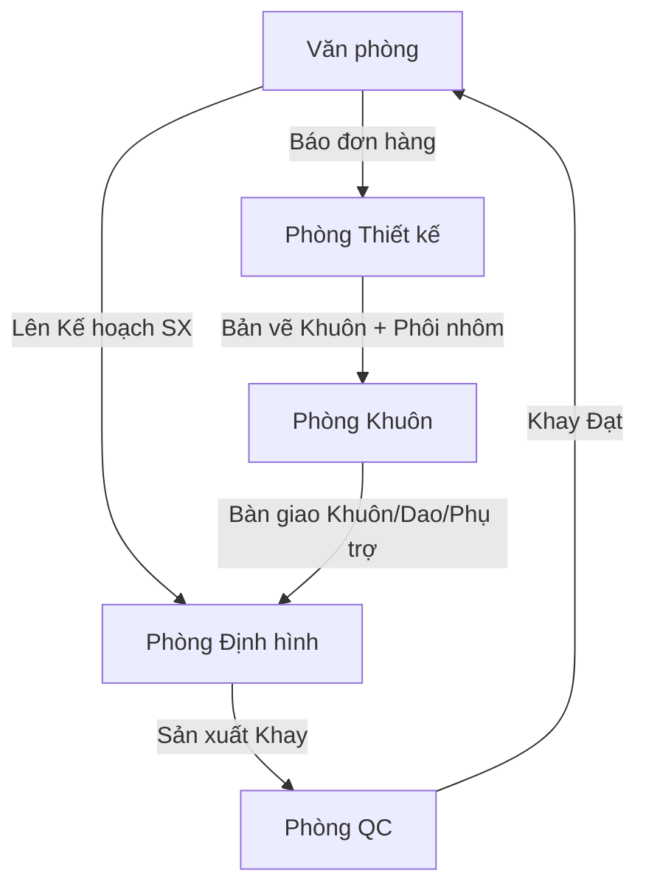

# Kế hoạch Tái cấu trúc Hệ thống YSDMS (Bản cập nhật YSD-Customized)

Dựa trên cấu trúc tổ chức thực tế của YSD, chúng ta sẽ tối ưu hóa mô hình ERP lớn (Department-based Workspaces) cho **vừa vặn hoàn hảo với 5 phòng ban thực tế** của công ty. 

Việc này giúp hệ thống cực kỳ chuyên nghiệp nhưng không bị cồng kềnh, nhân sự phòng nào chỉ cần tập trung vào Workspace của phòng đó.

## Proposed Changes: Cấu trúc 5 Phòng ban (Sidebar Workspaces)

### 1. 🏢 Văn phòng (Tổng hợp / Back Office)
Nơi tập trung các nghiệp vụ điều phối, kinh doanh và dữ liệu chung toàn công ty.
*   **Tổng quan Văn phòng (Office Dashboard)**
*   **Kinh doanh:** Báo giá, Đơn hàng, Xuất hàng.
*   **Kế hoạch:** Kế hoạch SX, MRP, Lệnh SX.
*   **Kho vật tư:** Tồn kho nhựa, màng, nhập xuất.
*   **Master Data:** Khách hàng, Nhân viên, Máy móc.

### 2. 📐 Phòng Thiết kế (Engineering / Design Dept)
Chịu trách nhiệm về "Định nghĩa" và "Tính toán". Mọi thứ liên quan đến kích thước, bản vẽ đều nằm ở đây.
*   **Tổng quan Thiết kế (Design Dashboard)**
*   **Sản phẩm (Khay):** Master data của khay (Điểm khởi đầu).
*   **Khuôn Master:** Cây phả hệ khuôn.
*   **Thiết kế (Revisions):** Thiết kế khuôn và **Thiết bị phụ trợ**.
*   **Phôi Nhôm (Aluminum Blanks):** Chỉ định kích thước phôi. (Hệ thống sẽ có ràng buộc: *Phải có phôi nhôm thì Phòng Khuôn mới bắt đầu gia công được*).

### 3. 🛠️ Phòng Khuôn (Tooling & Equipment Dept)
Quản lý toàn bộ vòng đời "Vật lý" của tài sản và quá trình gia công tạo ra chúng.
*   **Tổng quan Phòng Khuôn (Tooling Dashboard):** Theo dõi tiến độ gia công.
*   **Tiến độ Gia công (Gantt):** Lịch trình gia công khuôn & thiết bị phụ trợ (có liên kết chờ Phôi nhôm từ phòng Thiết kế).
*   **Quản lý Thiết bị Vật lý:**
    *   Khuôn ép (Physical Molds)
    *   Dao cắt (Cutters)
    *   Thiết bị phụ trợ (Frames, Pneumatic bases, Cooling bases, Stacking...)
*   **Nghiệp vụ Toàn xưởng:**
    *   Gia công ngoài (Teflon, CNC...)
    *   Bảo dưỡng & Mài dao
    *   Kiểm kê & Quản lý kệ chứa.

### 4. 🏭 Phòng Định hình (Thermoforming Dept)
Nơi trực tiếp làm ra sản phẩm khay.
*   **Tổng quan Xưởng (Shop Floor Dashboard)**
*   **Kanban:** Trực quan hóa lệnh sản xuất tại máy.
*   **Nhập thực tế:** Báo cáo sản lượng, hao phí.

### 5. ✅ Phòng Quản lý Chất lượng (QC Dept)
*   **Tổng quan Chất lượng (Quality Dashboard)**
*   **Kiểm tra KCS:** Đầu vào, đầu ra.
*   **Báo cáo Lỗi (Defects).**

---

## Luồng công việc liên phòng ban (Cross-Department Flow)

## Lộ trình Triển khai (Execution Plan)

1.  **Cập nhật Sidebar:** Tổ chức lại `Sidebar.tsx` theo đúng 5 phòng ban này. Tên menu sẽ hiển thị là `Văn phòng`, `Phòng Thiết kế`, `Phòng Khuôn`, `Phòng Định hình`, `Phòng QC`.
2.  **Tạo 5 Dashboards:** Xây dựng 5 trang tổng quan riêng biệt cho 5 phòng.
3.  **Tích hợp Thiết bị Phụ trợ:** Cập nhật DB và UI để phòng Khuôn có thể quản lý đầy đủ (Khuôn, Dao, Frame, Đế...).
4.  **Luồng Phôi Nhôm:** Bổ sung logic liên kết "Yêu cầu Phôi nhôm" giữa Phòng Thiết kế và Phòng Khuôn trong Gantt Chart.

## User Review Required

> [!IMPORTANT]
> Đây là cấu trúc phản ánh 100% tổ chức của YSD nhưng mang tầm vóc của một ERP chuyên nghiệp. Xin xác nhận nếu bạn đồng ý với cấu trúc 5 Workspace này để tôi tiến hành code lại `Sidebar.tsx`.
