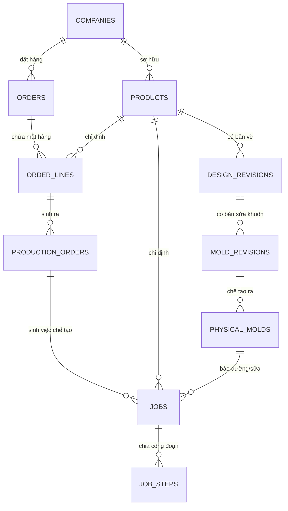

# Kế hoạch Thiết kế: Kiến trúc Đa bộ phận & Tính nhất quán của Luồng dữ liệu (Sản phẩm ↔ Chỉ thị ↔ Job)

Tài liệu này bổ sung phân tích kiến trúc về tính liên thông dữ liệu giữa các bộ phận (Văn phòng, Thiết kế, Xưởng Khuôn, Xưởng Ép, QC, Kho vận) để đảm bảo hệ thống khoa học, không chồng chéo và ứng biến tốt nhất.

---

## 1. Bản đồ Liên kết Thực thể (Database Entity-Relationship Model)

Để tránh chồng chéo dữ liệu và đảm bảo tính nhất quán (Single Source of Truth), mối quan hệ giữa các thực thể chính trong YSDMS được phân rã rành mạch như sau:

### Phân tích tính tối ưu của liên kết:
1. **Liên kết Chỉ thị (`production_orders`) ↔ Bản vẽ (`design_revisions`):** Chỉ thị sản xuất trỏ tới Dòng đơn hàng (`order_lines`), thông qua đó trỏ tới Sản phẩm Master (`products`), và tự động kế thừa phiên bản bản vẽ đang hoạt động (`design_revisions`) của sản phẩm đó.
2. **Luồng Công việc (Workflow) rõ ràng, không chồng chéo:**
   - **Khuôn mới (New Mold):** Đơn hàng -> Chỉ thị sản xuất -> Job gia công khuôn (`NEW_MOLD` trỏ tới `production_order_id`). Khi khuôn hoàn thành, hệ thống sinh ra bản ghi khuôn vật lý (`physical_molds`).
   - **Sửa khuôn (Repair):** Khuôn vật lý phát sinh lỗi -> Xưởng tạo Job sửa khuôn (`REPAIR_MOLD` trỏ tới `physical_mold_id` và `product_id`). Luồng này **không cần** thông qua Chỉ thị của văn phòng.

---

## 2. Thảo luận Kiến trúc Đa bộ phận (Multi-Department Architecture)

**Câu hỏi đặt ra:** *Các bộ phận sản xuất định hình khay, xuất hàng, kiểm tra QC... thì nên theo dõi tiến độ và ghi nhật ký như thế nào? Có nên dùng chung bảng `jobs` hay tách riêng?*

### 💡 Khuyến nghị Thiết kế: Tách biệt bảng theo Nghiệp vụ đặc thù (Recommended)
Việc ép tất cả hoạt động của các bộ phận vào chung một bảng `jobs` sẽ gây phình to cấu trúc, dư thừa trường dữ liệu (NULL) và làm giao diện cực kỳ phức tạp vì nghiệp vụ của mỗi bộ phận là hoàn toàn khác nhau.

Chúng ta sẽ duy trì các bảng riêng biệt đã được thiết kế tối ưu cho từng bộ phận, kết nối chúng qua **Mã neo chung** là **Sản phẩm (Product ID)** và **Chỉ thị sản xuất (Production Order ID)**:

### A. Bộ phận Sản xuất Định hình Khay (Molding/Thermoforming)
- **Đặc thù:** Sản xuất lặp lại, chạy máy định hình hàng loạt theo Ca (Shift), đo bằng sản lượng tấm/khay đúc ra và số mét nhựa tiêu thụ.
- **Bảng dữ liệu riêng (Đang áp dụng):** 
  - `production_schedules` (Lập kế hoạch chạy máy: máy nào, ca nào, sản lượng dự kiến).
  - `production_logs` (Nhật ký vận hành máy: số lượng đạt, số lượng phế phẩm, mã cuộn nhựa...).
- **Lý do tách:** Việc đúc khay không phải là dự án CNC (milling, polishing) nên dùng bảng kế hoạch máy riêng giúp chạy màn hình Kanban Board máy định hình cực kỳ tối ưu.

### B. Bộ phận Kiểm tra Chất lượng (Quality Control)
- **Đặc thù:** Kiểm tra kích thước khay mẫu, kiểm tra ngoại quan và ra quyết định Đạt/Không đạt.
- **Bảng dữ liệu riêng (Đang áp dụng):**
  - `tray_inspections` (Lưu thông số đo đạc thực tế so với dung sai bản vẽ).
  - `defect_reports` (Báo cáo sự cố chất lượng khi đúc hàng loạt).

### C. Bộ phận Kho vận & Xuất hàng (Logistics/Shipping)
- **Đặc thù:** Bagging, đóng thùng, tạo phiếu giao hàng (Delivery Note) và cập nhật số theo dõi đơn vị vận chuyển (Tracking No).
- **Bảng dữ liệu riêng (Đang áp dụng):**
  - `shipments` (Quản lý các đợt xuất kho giao hàng).
  - `sample_submissions` (Theo dõi đợt gửi mẫu duyệt riêng).

### D. Bộ phận Văn phòng & Xay nhựa rác
- **Đặc thù:** Quản lý hành chính và tái chế nhựa dư.
- **Bảng dữ liệu riêng:** `plastic_lots` (quản lý phôi cuộn nhựa) và `inventory_transactions`.

---

## 3. Bản đồ quy trình phối hợp liên thông

Mặc dù các bộ phận sử dụng các bảng nghiệp vụ khác nhau, tiến độ tổng thể của một dự án khuôn được liên thông tự động thông qua việc cập nhật trạng thái các bảng:

1. **Văn phòng:** Tạo Chỉ thị sản xuất (`production_orders`) trạng thái `PLANNED`.
2. **Thiết kế:** Hoàn thiện bản vẽ (`design_revisions` trạng thái `APPROVED`).
3. **Cơ khí:** Tạo Job khuôn (`jobs` trỏ tới chỉ thị). Xếp lịch trên Gantt. Khi Endo hoàn thành tất cả công đoạn CNC (`job_status = 'COMPLETED'`), hệ thống tự động sinh khuôn vật lý (`physical_molds`) trạng thái `READY_FOR_TRIAL`.
4. **Định hình:** Kohirumaki xếp lịch chạy thử máy trên màn hình kế hoạch máy (`production_schedules`). Nhân viên chạy máy ghi nhật ký ép mẫu (`production_logs`).
5. **QC:** Nakamura thực hiện đo đạc và phê duyệt mẫu thử (`tray_inspections` trạng thái `PASS`).
6. **Kho vận:** Đóng túi đóng thùng và xuất kho giao mẫu (`sample_submissions` trỏ tới ngày giao thực tế).
7. **Khách hàng phê duyệt mẫu:** Chuyển trạng thái sang `APPROVED`, mở khóa Chỉ thị sản xuất cho phép ép chạy hàng loạt.

---

## 📂 Các File thay đổi dự kiến (Proposed Changes)

#### [MODIFY] [page.tsx](file:///d:/AntiGravity_Workspace/apps/ysdms-nextgen/src/app/production/instructions/page.tsx)
- Cập nhật Modal "Tạo mới chỉ thị" để hỗ trợ:
  - Chọn dòng Đơn hàng có sẵn (Tab 1).
  - Tạo từ Sản phẩm + sinh Đơn hàng nháp tự động (Tab 2).
- Thêm thanh điều hướng nhanh (Workflow Links) liên kết chéo tới trang Sản phẩm master, Đơn hàng, và Gantt Job.

---

## 🧪 Kế hoạch Kiểm tra (Verification Plan)

- Chạy kiểm tra TypeScript `npx tsc --noEmit` để đảm bảo luồng liên thông đa bảng biên dịch thành công.
- Kiểm tra tính độc lập và liên kết: Tạo một Job sửa khuôn (trỏ tới `physical_mold_id`) và xác nhận nó không làm phát sinh hay đòi hỏi Chỉ thị sản xuất của văn phòng.
