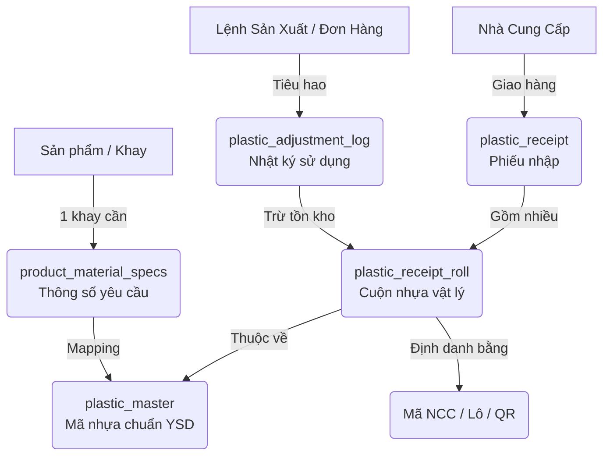

# Kế hoạch: Xây dựng Module Quản lý Nhựa (Plastics WMS) Chuyên Sâu

> [!NOTE]
> Kế hoạch này được cập nhật theo định hướng mới: Xây dựng một module quản lý nhựa hiện đại, chi tiết (quản lý mã NCC, lô, hao hụt, cảnh báo) **trước khi** hoàn thiện quy trình in đơn hàng.

## 1. Bài toán và Kiến trúc Dữ liệu

Vấn đề cốt lõi: 
- Chỉ thị sản xuất ghi chung chung (VD: `PS 黒 0.8mm [520] 導電練り込み`).
- Thực tế nhà cung cấp giao các cuộn (Rolls) với mã vạch, mã lô, nhà sản xuất (Maker) khác nhau.
- Cần quản lý từng cuộn nhựa vật lý thay vì chỉ số lượng tổng, để truy xuất nguồn gốc (traceability) và tính hao hụt (scrap) chính xác.

### Sơ đồ Thực thể (ERD)

## 2. Các Phân Hệ (Modules) Cần Xây Dựng

### 2.1. Phân hệ Master Data (Chuẩn hóa Mã Nhựa)
- **Giao diện Quản lý Danh mục Nhựa (Plastic Master)**: Cho phép tạo mã nhựa nội bộ YSD, với các thuộc tính: Loại (PS/PP/PET...), Độ dày, Chiều rộng, Xử lý bề mặt (chống tĩnh điện, silicone), Màu sắc.
- **Từ điển Mapping (Supplier Dictionary)**: Giao diện mapping giữa mã của nhà cung cấp (VD: `SK-PS-BLK-08-520`) với mã chuẩn YSD, để khi quét mã QR lúc nhập kho, hệ thống tự động nhận diện.

### 2.2. Phân hệ Quản lý Kho (Inventory WMS)
- **Nhập kho (Inbound)**: Quét mã vạch/nhập tay thông tin từ nhà cung cấp → tự động tách thành từng dòng cuộn (Roll) với trọng lượng ban đầu, số lô (Lot No).
- **Kiểm kê & Báo cáo (Dashboard)**: Bảng điều khiển xem tồn kho theo từng loại nhựa chuẩn YSD, drill-down xuống từng cuộn vật lý đang ở kho nào (hoặc đang gắn trên máy nào).

### 2.3. Phân hệ Tính Toán và Cảnh Báo (Planning & Execution)
- **Định mức tiêu hao (BOM)**: Dựa vào thông số khay (Chiều dài x Chiều rộng bước cắt x Độ dày x Tỷ trọng nhựa) → tính ra trọng lượng nhựa cần cho 1 khay.
- **Dự báo (Forecasting)**: Khi có đơn hàng (Order) → Lên lịch sản xuất → Tính tổng lượng nhựa cần thiết.
- **Cảnh báo (Alerts)**: So sánh lượng nhựa cần thiết với tồn kho thực tế. Nếu `Tồn kho < Cần thiết + Buffer hao hụt` → Báo động đỏ yêu cầu đặt hàng.
- **Ghi nhận Hao hụt (Scrap)**: Khi xuất kho cắt cuộn, ghi nhận phần "đầu cuộn", "biên", "khung xương" để tính tỷ lệ hao hụt thực tế so với định mức.

## 3. Thứ tự Triển khai (Roadmap)

| Giai đoạn | Mô tả | Công việc chính |
|-----------|-------|-----------------|
| **Phase 1** | Chuẩn hóa Data | 1. Regenerate TypeScript types cho các bảng `plastic_wms` đã có trong DB. 2. Viết script import dữ liệu từ Excel tồn kho vào DB. |
| **Phase 2** | Giao diện Core | 1. Xây dựng trang `/master/plastics` (CRUD Plastic Master). 2. Xây dựng trang nhập kho `/equipment/plastics/receipts`. 3. Dashboard tồn kho hiện tại. |
| **Phase 3** | Tích hợp Sản xuất | 1. Thuật toán tính định mức nhựa dựa trên thông số thiết kế (design_revisions). 2. Giao diện cảnh báo thiếu hụt tại trang Đơn hàng (Order) & Lịch sản xuất (Planning). |

## 4. Trả lời Câu hỏi của User về Trang In

> **User:** "Chọn phương án B, sử dụng các ghi chú dạng chip, gợi ý từ bảng thiết kế, tùy biến cho người làm phiếu đặt để ghi chú nhắc nhở."

**Xác nhận:** Tôi sẽ cập nhật form `OrderForm.tsx` ở phần `order_type` (1面取 / 別抜き / 袋詰め) thành component nhập liệu dạng Tags/Chips. Nó sẽ đọc metadata từ `design_revisions` và `products` để hiện "Suggestions" (Gợi ý), người dùng bấm vào chip để add, hoặc tự gõ thêm chip mới. Những chip này sẽ được lưu thành array string trong DB. Việc này sẽ được thực hiện *sau khi* xong nền tảng Nhựa, hoặc làm song song.

## 5. Câu hỏi mở (Open Questions)

> [!WARNING]
> 1. **Data Migration**: Dữ liệu trong 480 file Excel `材料在庫(...)` và `toanysdmail.CSV` rất lớn. Anh/chị muốn tôi viết script tự động quy nạp toàn bộ lịch sử này vào DB (sẽ mất nhiều thời gian chạy), hay chỉ lấy file mới nhất để làm mốc tồn kho đầu kỳ?
> 2. **Kiến trúc App**: Hệ thống Nhựa này nên nằm trong thư mục `/master/plastics/` (cho danh mục) và `/equipment/plastics/` (cho tồn kho/nhập xuất), anh/chị có đồng ý với định tuyến này không?

---
*Đang đợi Subagent (Plastics Domain Expert) trả về báo cáo phân tích chi tiết từ source code cũ và CSV để hoàn thiện cấu trúc Database.*
