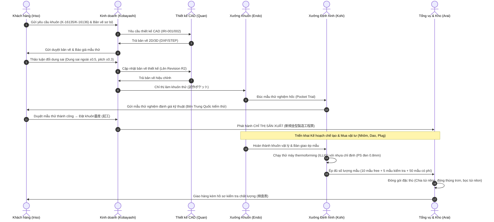

# Phân tích Nghiệp vụ & Kế hoạch Nhập thông tin Chỉ thị Sản xuất (新規金型製造工程票)

Hồ sơ này cung cấp phân tích nghiệp vụ chi tiết dựa trên ảnh chụp chỉ thị sản xuất thực tế (新規金型製造工程票) và chuỗi email trao đổi thương mại với khách hàng Iriso Electronics. Đồng thời đánh giá mức độ đáp ứng của Database hiện tại và đề xuất thiết kế giao diện/luồng dữ liệu để giải quyết triệt để các yêu cầu đặc thù.

---

## 1. Sơ đồ Luồng Nghiệp vụ Tổng thể (Business Flow)

Dựa trên chuỗi email và chỉ thị, quy trình từ khi nhận yêu cầu khuôn mới cho đến khi bàn giao mẫu sản phẩm được vận hành qua các giai đoạn sau:



---

## 2. Phân tích Dữ liệu từ Chỉ thị Sản xuất & Trao đổi Email

Để lưu trữ toàn vẹn thông tin từ Chỉ thị Sản xuất thực tế và các tình huống phát sinh trong email, hệ thống cần đáp ứng các nhóm trường dữ liệu sau:

### A. Thông tin Hành chính & Kế hoạch (Từ Chỉ thị)
- **Mã khuôn (型番):** `IRI-001` (Mã quản lý nội bộ YSD).
- **Tên khay (品名):** `K-16135T-01-01 400x360 size 72 pocket` (Mã khay phía khách hàng và quy cách).
- **Vật liệu nhựa (材質):** `PS黒 0.8㎜ 【520】 導電練り込み` (Chủng loại nhựa, độ dày, mã cuộn nhựa, tính năng chống tĩnh điện/dẫn điện).
- **Hạn xuất hàng (出荷納期):** `7/13 (月)` (Chỉ thị ghi `7/13`, email cập nhật đổi sang `7/14`).
- **Phụ trách (担当者):** Yoshida (Mua vật tư), Endo (Chế tạo khuôn), Kohirumaki (Định hình/Molding).
- **Phương thức cắt (別抜き/インライン):** Chọn `別抜き` (Cắt bằng máy press riêng biệt) để đáp ứng dung sai khắt khe.

### B. Thông số Kỹ thuật & Dung sai chế tạo (Từ Chỉ thị & Email)
- **Kích thước khuôn (型寸法):** `470 x 400` mm.
- **Kích thước khay (製品寸法):** `400 x 360` mm.
- **Dung sai kích thước ngoài (寸法公差):** `X: 400 (±0.5)`, `Y: 360 (±0.5)` (Khách yêu cầu hạ dung sai từ ±1.0 xuống ±0.5).
- **Dung sai bước hốc (Pocket Pitch Tolerance):** `±0.3` (Sửa đổi đặc thù theo email ngày 16/6).
- **Quy cách bộ khuôn phụ trợ:** Có Plug hỗ trợ (`プラグ: 有`), Dao cắt làm mới (`カッター: 新規`), Tấm làm mát dùng lại khung cũ (`水冷盤: 既存`), Khung gá khuôn dùng lại khung cũ (`枠: 既存`).

### C. Quy tắc Phân bổ Mẫu & Đóng gói Phức tạp (Từ Email)
- **Cơ cấu mẫu đa dạng:**
  - **Mẫu miễn phí (无偿サンプル):** 10 tấm.
  - **Mẫu kiểm tra chất lượng đầu vào (金型検定用/入検用):** 5 tấm.
  - **Mẫu chạy thử điều chỉnh thiết bị (設備調整用/有償):** 50 tấm (Đặt hàng có phí, thanh toán riêng qua UGM hoặc Iriso).
  - **Mẫu lưu văn phòng (事務所用):** 2 tấm.
- **Quy tắc đóng gói phụ:** 
  - Phải chia túi riêng (袋分け) cho tệp 10 tấm mẫu free và tệp 5 tấm mẫu kiểm tra đầu vào, sau đó đóng gói chung vào một thùng giao hàng (同梱納入).
  - Loại thùng đóng gói: Thùng không in chữ (無地箱).
  - Có yêu cầu bọc túi nilon bảo vệ (袋詰め: 要).

### D. Các Vấn đề Phát sinh & Phương án Đối ứng (Exceptions)
- **Thay đổi thiết kế đột xuất:** Khách hàng yêu cầu sửa dung sai pitch từ ±0.5 sang ±0.3 khi đang làm khuôn thử. Hệ thống phải ghi nhận được lịch sử yêu cầu đổi dung sai, liên kết tới bản vẽ CAD sửa đổi và ghi chú lý do sửa khuôn.
- **Thanh lý tồn kho cũ:** Khi làm lại khuôn cải tiến, cần xác nhận:
  - Có tiêu hủy khay cũ trong kho không? (`旧トレイ在庫廃棄確認: 無`).
  - Có thay thế bản vẽ cũ trong phòng kiểm tra không? (`検査室旧図面差し替え確認: 無`).
- **Chi phí phát sinh:** Phí xuất file 3D CAD (`10,000 JPY/khay`) cần được ghi nhận vào báo giá/đơn hàng.

---

## 3. Đánh giá Mức độ Đáp ứng của Database ysdms Hiện tại

Sau khi đối chiếu DDL thực tế của Supabase với các trường dữ liệu trên:

### 👍 Các điểm đã đáp ứng tốt (DB đã có sẵn bảng/cột)
1. **Thông tin Nhựa chi tiết:** Bảng `product_material_specs` lưu đầy đủ loại nhựa (`material_type`), mã nhựa (`material_grade`), độ dày (`thickness_mm`), bề rộng cuộn (`sheet_width_mm`), đặc tính tĩnh điện (`static_charge`), silicon (`silicone`).
2. **Thông số kỹ thuật hình học:** Bảng `design_revisions` chứa đầy đủ kích thước khuôn (`design_length`, `design_width`, `design_height`, `design_depth`), số hốc khay (`pocket_numbers`), số mặt khuôn (`cavity_count`), pitch hốc (`pitch_mm`), góc thoát (`draft_angle`), bo góc (`corner_r`), plug (`has_plug`), dao cắt rời (`has_separate_cutter` đại diện cho `別抜き`).
3. **Cấu trúc bộ khuôn phụ trợ:** Bảng `plugs` và `cutters` được liên kết chặt chẽ tới `design_revisions` để theo dõi Plug và Dao cắt chế tạo mới hay dùng lại bản vẽ cũ.
4. **Cơ cấu mẫu chi tiết:** Bảng `sample_submissions` có sẵn các trường đong đếm mẫu: `sample_quantity` (mẫu có phí), `free_quantity` (mẫu miễn phí), `office_quantity` (mẫu văn phòng), và lưu thông tin vật liệu mẫu qua `materials_json`.

### ⚠️ Các điểm thiếu sót trong Database (Inadequacies - Cần bổ sung)
1. **Dung sai hình học (Tolerances):** Bảng `design_revisions` thiếu các trường lưu trữ dung sai cụ thể như dung sai ngoài (`tolerance_x`, `tolerance_y`), dung sai pitch (`tolerance_pitch`). Hiện tại chỉ có kích thước thô (numeric) không có dung sai riêng biệt.
2. **Quy cách đóng gói & chỉ thị giao hàng:** Bảng `sample_submissions` và `order_lines` chưa có cột ghi nhận loại thùng (`box_type`: plain/printed), yêu cầu bọc túi nilon (`bagging_required`), và quy tắc phân túi đóng gói chung (`packaging_instructions`).
3. **Xử lý cải tiến & tái chế khuôn (Exceptions):** Chưa có bảng/cột lưu thông tin khảo sát khi tái chế khuôn (Hủy tồn kho cũ `discard_old_stock`, Đổi bản vẽ QC `replace_qc_drawing`).

---

## 4. Kế hoạch Thiết kế & Phát triển Hệ thống (Implementation Plan)

### Giai đoạn 1: Bổ sung Schema Database (Supabase Migration)
Chúng ta sẽ viết một migration mới để bổ sung các cột còn thiếu vào `design_revisions` và `sample_submissions`:

```sql
-- Thêm các trường dung sai và kiểm tra cải tiến vào design_revisions
ALTER TABLE design_revisions ADD COLUMN IF NOT EXISTS tolerance_x TEXT DEFAULT '±0.5';
ALTER TABLE design_revisions ADD COLUMN IF NOT EXISTS tolerance_y TEXT DEFAULT '±0.5';
ALTER TABLE design_revisions ADD COLUMN IF NOT EXISTS tolerance_pitch TEXT DEFAULT '±0.3';
ALTER TABLE design_revisions ADD COLUMN IF NOT EXISTS discard_old_stock_on_remake BOOLEAN DEFAULT false;
ALTER TABLE design_revisions ADD COLUMN IF NOT EXISTS replace_qc_drawing_on_remake BOOLEAN DEFAULT false;
ALTER TABLE design_revisions ADD COLUMN IF NOT EXISTS water_cooling_plate_spec TEXT DEFAULT 'EXISTING'; -- NEW, EXISTING
ALTER TABLE design_revisions ADD COLUMN IF NOT EXISTS frame_spec TEXT DEFAULT 'EXISTING'; -- NEW, EXISTING

-- Thêm quy cách đóng gói mẫu vào sample_submissions
ALTER TABLE sample_submissions ADD COLUMN IF NOT EXISTS box_type TEXT DEFAULT 'PLAIN'; -- PLAIN, PRINTED
ALTER TABLE sample_submissions ADD COLUMN IF NOT EXISTS bagging_required BOOLEAN DEFAULT true;
ALTER TABLE sample_submissions ADD COLUMN IF NOT EXISTS packaging_instructions TEXT; -- Lưu ví dụ: "10枚と5枚は袋分けして同梱納入してください"
```

### Giai đoạn 2: Thiết kế Giao diện Xử lý (UI/UX)
Để số hóa toàn bộ luồng nghiệp vụ trên, chúng ta cần phát triển các màn hình sau:

#### Màn hình 1: Giao diện Khởi tạo Chỉ thị Sản xuất (Production Instruction Form)
- **Thiết kế:** Dạng form nhập liệu số hóa cấu trúc y hệt tờ "新規金型製造工程票".
- **Chức năng:**
  - Tự động lấy thông tin từ Đơn hàng (`orders`) và Bản vẽ thiết kế đã duyệt (`design_revisions`) gồm: Mã khuôn, Khách hàng, Nhựa thiết kế, Kích thước khay/khuôn.
  - Chọn máy định hình (`ILLIG`...), phương pháp cắt (`別抜き`...).
  - Thiết lập trạng thái bộ khuôn gá (`Plug`: Cần làm/Có sẵn; `Cutter`: Làm mới/Dùng lại...).
  - Phân công người phụ trách và ấn định hạn hoàn thành khuôn (`本型納期`), hạn đúc mẫu (`出荷納期`).
  - Nút xuất file PDF Chỉ thị sản xuất chuẩn ISO để in ấn dán tại xưởng.

#### Màn hình 2: Form Quản lý Mẫu & Đóng gói (Sample Submission Management)
- **Thiết kế:** Giao diện chia lưới nhập liệu số lượng mẫu trực quan.
- **Chức năng:**
  - Nhập số lượng mẫu tách biệt: Mẫu miễn phí, Mẫu kiểm định QC, Mẫu chạy thử (có phí), Mẫu lưu kho YSD.
  - Tích chọn "Yêu cầu bọc túi nilon", "Thùng trơn không in".
  - Ô nhập ghi chú đóng gói đặc biệt (ví dụ hướng dẫn chia túi đóng chung).
  - Ghi nhận trạng thái duyệt mẫu của khách hàng (`PENDING` -> `APPROVED` / `REJECTED`) kèm ngày nhận phản hồi để tự động mở khóa trạng thái đơn hàng sang Chạy sản xuất hàng loạt (`mass_production_released`).

#### Màn hình 3: Màn hình Theo dõi Sự cố & Nhật ký Cải tiến (Engineering Change Log)
- **Thiết kế:** Bảng danh sách liên kết trực tiếp dưới dòng thông tin của từng Product/Design.
- **Chức năng:**
  - Ghi chú các yêu cầu hiệu chỉnh đặc thù từ chuỗi email (ví dụ: "KH yêu cầu đổi dung sai pitch về ±0.3 ngày 16/06").
  - Lưu trữ vết thay đổi: Lý do đổi bản vẽ, người yêu cầu, phiên bản bản vẽ CAD tương ứng được sinh ra (R1 -> R2).

---

## 5. Kết luận đánh giá tính sẵn sàng

1. **Về Database:** Cấu trúc bảng hiện tại của YSDMS đã đạt **~85%** độ bao phủ nghiệp vụ nhờ việc phân tách sẵn các thông số nhựa (`product_material_specs`) và phân cấp khối lượng mẫu thử (`sample_submissions`). Chỉ cần chạy thêm 1 script SQL ngắn để bổ sung các cột dung sai và đóng gói.
2. **Về Giao diện:** Giao diện hiện tại mới chỉ tập trung vào Master Data và biểu đồ Gantt kế hoạch. Cần bổ sung thêm Module **Production Orders (Chỉ thị sản xuất)** và **Sample Feedback (Đánh giá mẫu)** theo thiết kế đề xuất ở trên để số hóa hoàn toàn quy trình kinh doanh.
