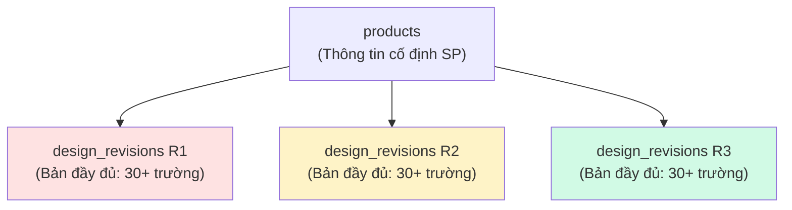

# Phân tích & Đánh giá: Quản lý Phiên bản Thiết kế + Quy trình Job

> Tổng hợp nhận định khách quan dựa trên phân tích codebase, schema DB, và ảnh chụp giao diện hệ thống cũ (Access) vs mới (NextGen).

---

## 📊 Tóm tắt Hiện trạng

### A. Trang sản phẩm (`/master/products/[id]`)

| Khía cạnh | Hiện trạng |
|---|---|
| **Layout** | Grid 3 cột: 2 cột trái (thông tin SP) + 1 cột phải (sidebar danh sách thiết kế) |
| **Thiết bị (khuôn, dao cắt)** | ❌ **CHƯA hiển thị** trực tiếp trên trang SP — phải nhấp link qua `/engineering/designs/revisions/[id]` |
| **Chọn phiên bản thiết kế** | ❌ **CHƯA CÓ** UI chọn phiên bản chủ đạo — chỉ liệt kê danh sách, nhấp → qua trang khác |
| **Thông tin thiết kế cố định** | ❌ KHÔNG hiển thị bất kỳ thông số kỹ thuật nào của thiết kế (kích thước, cavity, pitch...) trên trang SP |

### B. Hệ thống Job (`/equipment/jobs`)

| Khía cạnh | Hiện trạng |
|---|---|
| **Phân loại Job** | ✅ Đã có `job_category`: `MOLD_NEW`, `MOLD_MODIFY`, `CUTTER_NEW`, `EQUIPMENT_NEW`, `EQUIPMENT_REPAIR`, `INTERNAL_OPS` |
| **Job Steps = Component Tracks** | ✅ Đã tách riêng thành parallel tracks: MOLD, PLUG, CUTTER, WATER_BASE, PRESSURE_BASE, STAKING, FRAME |
| **Quick Create** | ✅ Có form 1 trang tạo nhanh toàn bộ (Product → Design → Mold Revision → Physical Mold → Job → Steps) |
| **Mold Modify riêng Job** | ✅ `MOLD_MODIFY` tạo Job riêng, **KHÔNG** kéo dài Job cũ |

---

## 🔍 Phân tích Chi tiết 3 Vấn đề Anh Thoan nêu

---

### VẤN ĐỀ 1: Hiển thị thiết kế trên trang sản phẩm

#### Phương án 1 (Đã loại): Bấm thiết bị → hiển thị thiết kế liên kết
> Anh đã nhận định đúng: *"các thiết bị này vẫn chỉ liên kết với phiên bản thiết kế đã chỉ định nên cũng không khác trước nhiều"*.

**Đánh giá:** ❌ Không giải quyết vấn đề gốc. Chỉ đổi trigger hiển thị, không đổi logic.

#### Phương án 2+ (Đã chọn): Cột danh sách phiên bản + hiển thị nội dung tương ứng

**Đánh giá:** ✅ **Đúng hướng** nhưng cần cẩn thận triển khai.

```
┌──────────────────────────────────────────────────────────────────────┐
│ Trang Chi tiết Sản phẩm (/master/products/[id])                    │
├──────────┬───────────────────────────────────┬───────────────────────┤
│ Sidebar  │ Thông tin Sản phẩm (cố định)      │ Thông tin kỹ thuật   │
│ Phiên bản│ ─ Mã SP, Tên SP, KH              │ (thay đổi theo rev)  │
│          │ ─ Pocket, Đóng gói               │ ─ Kích thước khuôn   │
│ ▶ R3 ●  │                                   │ ─ Cavity, Pitch      │
│   R2     │ Thiết bị liên kết (rev-specific)  │ ─ Plug, Cutter spec  │
│   R1     │ ─ Khuôn vật lý → link            │ ─ Vật liệu nhựa     │
│          │ ─ Dao cắt → link                 │                      │
│          │ ─ WB, PB, Frame                  │                      │
└──────────┴───────────────────────────────────┴───────────────────────┘
```

> [!IMPORTANT]
> **Rủi ro cần kiểm soát:** Hiện tại thay đổi **chỉ ở mã nguồn front-end**, schema DB vẫn giữ nguyên. Điều này có nghĩa:
> - ✅ **Ưu điểm:** Không ảnh hưởng data, rollback dễ dàng
> - ⚠️ **Rủi ro:** Nếu code mới query sai FK chain (ví dụ `design_revision → mold_revisions → physical_molds` mà bỏ qua `mold_revisions`), sẽ hiển thị sai hoặc thiếu thiết bị
> - ⚠️ **Rủi ro:** Code mới cần handle trường hợp 1 thiết bị vật lý được dùng chung cho nhiều phiên bản thiết kế (shared equipment)

---

### VẤN ĐỀ 2: Cấu trúc "Thiết kế chung" vs "Thay đổi theo phiên bản" (Delta Design)

Anh đặt câu hỏi: *"Có nên xử lý theo hướng 1 SP có thông tin thiết kế cố định chung → mỗi phiên bản chỉ ghi nội dung thay đổi?"*

#### Phân tích thực tế từ schema hiện tại:



**Mỗi `design_revisions` hiện tại lưu ĐẦY ĐỦ 30+ trường** (kích thước, cavity, pitch, plug type, cutter spec, vật liệu...). Khi tạo revision mới, phải nhập lại toàn bộ dù chỉ thay đổi 1-2 giá trị.

#### Đánh giá 3 mô hình khả thi:

| Mô hình | Ưu điểm | Nhược điểm | Khả thi? |
|---|---|---|---|
| **A. Giữ nguyên (Full Copy mỗi revision)** | Đơn giản, mỗi revision hoàn chỉnh, dễ audit | Nhập liệu lặp lại, khó thấy điểm khác biệt | ✅ Hiện tại |
| **B. Delta Model (chỉ lưu thay đổi)** | Giảm nhập liệu, rõ ràng thấy gì thay đổi | Phức tạp code, cần "merge" base + delta khi hiển thị, rủi ro data integrity | ⚠️ Phức tạp |
| **C. Full Copy + Auto-fill từ revision trước + Diff Highlight** | Nhập liệu nhanh (copy từ rev cũ), rõ ràng điểm khác biệt, mỗi revision vẫn hoàn chỉnh | Vẫn lưu trùng data nhưng storage không đáng lo | ✅ **KHUYẾN NGHỊ** |

> [!TIP]
> **Khuyến nghị Mô hình C: "Full Copy + Smart Clone + Diff Highlight"**
> 
> Lý do:
> 1. **Không cần thay đổi schema DB** — giữ nguyên cấu trúc `design_revisions`
> 2. **UX cải thiện đáng kể:** Khi tạo revision mới → auto-clone từ revision cũ → người dùng chỉ sửa trường cần thay đổi
> 3. **Diff Highlight:** Khi xem revision, highlight các trường khác biệt so với revision trước (background vàng nhạt)
> 4. **Truy vết lịch sử:** Trường `change_summary` (đã có trong schema) ghi rõ "Mở rộng pocket ra 0.2mm", "Đổi nhựa PET → PVC"
> 5. **Mỗi revision hoàn chỉnh:** Không cần "merge" logic phức tạp, giảm rủi ro bug

#### Về câu hỏi "Phiên bản chỉnh sửa rất nhiều thì sao?"

→ **Mô hình C xử lý tốt:** Dù chỉnh sửa 1 trường hay 30 trường, mỗi revision đều chứa đầy đủ data. Clone từ bản cũ → sửa thoải mái → `change_summary` ghi tóm tắt. Không có vấn đề gì.

---

### VẤN ĐỀ 3: Quy trình tạo Job — So sánh Hệ thống Cũ vs Mới

#### Hệ thống cũ (Access) — Vấn đề anh mô tả:

```
金型 (Khuôn) → Job (1 Job kéo dài) → 工程 items:
  ├── MOLD (lần 1: chế tạo mới)
  ├── PLUG
  ├── WB
  └── MOLD (lần 2: cải tiến sau 2 năm ← BỊ GHÉP VÀO CÙNG JOB!)
```

> [!WARNING]
> **Vấn đề hệ thống cũ:** 
> - 1 Job bị kéo dài vô hạn (thêm mục MOLD mới vào 工程 mỗi khi cải tiến)
> - Đối tượng "MOLD" trong 工程 bị lặp với chính Khuôn (header)
> - Không phân biệt rõ: đây là Job chế tạo mới hay Job sửa chữa

#### Hệ thống mới (NextGen) — Đã xử lý tốt:

```
✅ Mỗi lần cải tiến = Job MỚI riêng biệt:

Job-001 (MOLD_NEW):     Job-002 (MOLD_MODIFY):     Job-003 (CUTTER_NEW):
├── Step: MOLD           ├── Step: MOLD (cải tiến)   ├── Step: CUTTER
├── Step: PLUG           └── Step: PLUG (nếu cần)    └── (đơn giản)
├── Step: CUTTER
└── Step: WB

Mỗi Job có:
- job_category: MOLD_NEW / MOLD_MODIFY / CUTTER_NEW / ...
- design_revision_id: link đến phiên bản thiết kế cụ thể
- physical_mold_id: link đến khuôn vật lý cụ thể
- Riêng biệt, không kéo dài
```

**Đánh giá:** ✅ **Hệ thống mới đã giải quyết đúng vấn đề Job kéo dài.**
- `MOLD_MODIFY` tạo Job riêng, có `design_revision_id` mới, deadline riêng
- Không có hiện tượng "thêm mục MOLD vào Job cũ"

#### Về câu hỏi "Chọn Đối tượng trước → rồi tạo Job":

```
Hệ thống cũ:  Khuôn → Job → 工程 (MOLD, PLUG, WB, STAKING...)
                              ↑ đối tượng "MOLD" lặp với header

Hệ thống mới:  Job Category (MOLD_NEW, CUTTER_NEW, EQUIPMENT_NEW...)
                    ↓
                Job Header (link product, design, physical_mold)
                    ↓
                Job Steps (parallel component tracks: MOLD, PLUG, CUTTER...)
```

> [!IMPORTANT]
> **Đánh giá:** Hệ thống mới **đã chọn đối tượng/nhóm sự việc trước** thông qua `job_category`:
> - Chọn `MOLD_NEW` → auto-generate steps: MOLD + PLUG + CUTTER
> - Chọn `CUTTER_NEW` → auto-generate steps: CUTTER only
> - Chọn `EQUIPMENT_NEW` → tùy loại equipment (WB, PB, FRAME)
> 
> **Đúng hướng** nhưng cần verify thêm: liệu Quick Create form có **ẩn/hiện fields phù hợp** theo từng `job_category` chưa (ví dụ: chọn CUTTER_NEW thì không cần nhập thông tin khuôn).

#### Về liên kết Thiết bị phụ trợ — Bảng `equipment_assignments`:

```sql
-- Schema đã có bảng equipment_assignments (N:N):
equipment_assignments:
  - parent_equipment_id → equipment(equipment_id)  -- Khuôn chính
  - child_equipment_id  → equipment(equipment_id)  -- WB, PB, Frame...
  - assignment_type: 'DIRECT' | 'SHARED'
  - is_active: boolean
```

**✅ Đã giải quyết câu hỏi:**
- Thiết bị nào liên kết **trực tiếp** (`DIRECT`) → chỉ dùng cho sản phẩm này
- Thiết bị nào **dùng chung** (`SHARED`) → dùng chung với sản phẩm khác
- Truy vết được qua `equipment_history` khi nào gắn/tháo

---

## 🎯 Kế hoạch Đề xuất (3 Phase)

### Phase 1: Cải thiện Trang Sản phẩm (UI Only — Không đổi DB)

> [!NOTE]
> **Scope:** Chỉ thay đổi front-end, không migration DB mới.

#### 1.1 Thêm Design Revision Viewer vào trang Product Detail

**Thay đổi tab `概要 (Overview)`** từ layout hiện tại:
```
[Thông tin SP] [Sidebar: danh sách thiết kế (chỉ link)]
```
Thành:
```
[Sidebar nhỏ:       [Thông tin SP cố định]        [Thông tin kỹ thuật 
 Danh sách Rev       + Quy cách đóng gói           từ revision đang chọn]
 ▶ R3 (selected)                                    + Kích thước khuôn
   R2                [Thiết bị liên kết Rev này]    + Cavity, Pitch
   R1]               + Khuôn vật lý cards           + Plug spec, Cutter spec
                     + Dao cắt cards                + Vật liệu nhựa
                     + WB, PB, Frame cards
```

**Files cần thay đổi:**
- `src/app/master/products/[id]/tabs/OverviewTab.tsx` — Thêm state `selectedRevisionId`, fetch chi tiết revision + equipment
- `src/app/master/products/[id]/page.tsx` — Mở rộng query fetch thêm `mold_revisions`, `physical_molds`, `cutters`, `equipment`

#### 1.2 Thêm Diff Highlight khi so sánh Revision

- Khi chọn revision → hiển thị badge "🔄 2 trường thay đổi" so với revision trước
- Các trường khác biệt highlight nền vàng nhạt

#### 1.3 Shared Equipment Indicator

- Thiết bị dùng chung hiển thị badge `共有 (SHARED)` + tooltip "Dùng chung với: SP-XXX, SP-YYY"
- Thiết bị trực tiếp hiển thị badge `専用 (DIRECT)`

---

### Phase 2: Smart Clone cho Design Revision

#### 2.1 Clone Revision Form
- Khi tạo revision mới → dropdown "Clone từ revision nào?" → auto-fill toàn bộ trường
- Người dùng chỉ sửa trường cần thay đổi
- `change_summary` bắt buộc nhập (ghi tóm tắt thay đổi)

#### 2.2 Revision Timeline View
- Trên trang `/engineering/designs/[productId]` — thêm timeline view
- Hiển thị dòng thời gian: R1 → R2 → R3 với `change_summary` mỗi bước
- Click vào bất kỳ revision → xem chi tiết + diff với revision trước

---

### Phase 3: Hoàn thiện Equipment ↔ Design ↔ Job Integration

#### 3.1 Quick Create conditional sections
- Khi chọn `job_category = CUTTER_NEW` → ẩn section khuôn vật lý
- Khi chọn `EQUIPMENT_NEW` → hiện dropdown chọn loại equipment

#### 3.2 Data migration `physical_molds` → `equipment`
- Migrate dữ liệu khuôn vật lý sang bảng `equipment` thống nhất
- Update tất cả FK references

---

## ✅ Tổng kết Đánh giá

| Câu hỏi của Anh Thoan | Đánh giá |
|---|---|
| Phương án 2+ cho trang SP? | ✅ **Đúng hướng.** Schema không cần đổi, chỉ cần cải thiện UI |
| "Thiết kế chung + Delta" có nên? | ⚠️ **Không khuyến nghị Delta model** — nên dùng "Full Copy + Smart Clone + Diff Highlight" (Mô hình C) |
| Hệ thống mới xử lý Job kéo dài? | ✅ **Đã xử lý tốt.** Mỗi cải tiến = Job riêng biệt (`MOLD_MODIFY`) |
| Chọn đối tượng trước → tạo Job? | ✅ **Đã xử lý.** `job_category` quyết định preset steps, nhưng cần verify UX conditional fields |
| Thiết bị dùng chung/trực tiếp? | ✅ **Schema đã có `equipment_assignments`** với `assignment_type: DIRECT/SHARED` |
| Code mới chỉ sửa FE, có rủi ro? | ⚠️ **Rủi ro trung bình.** Cần review FK chain kỹ, thêm unit test cho query logic |

> [!CAUTION]
> **Ưu tiên ngay:** Trước khi triển khai Phase 1, cần verify rằng code hiện tại trên trang Product Detail **không bị lỗi query** khi có sản phẩm có 2+ revision đều APPROVED. Nên viết test case cụ thể cho trường hợp này.
