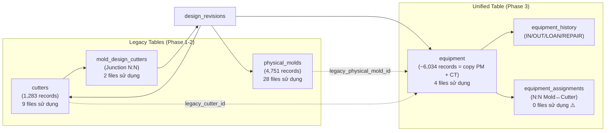

# 📊 Phân Tích Toàn Diện: Kiến Trúc Dữ Liệu Thiết Bị (Khuôn / Dao cắt / Equipment)

> Phân tích nguyên nhân gốc rễ của sự trùng lặp dữ liệu và 3 phương án kiến trúc để giải quyết triệt để.

---

## 1. Bản Đồ Quan Hệ Hiện Tại — 3 Nguồn Dữ Liệu Song Song



### 🔴 Vấn Đề Gốc Rễ

Migration `20260731070000` đã **copy toàn bộ** 4,751 `physical_molds` + 1,283 `cutters` → bảng `equipment`, nhưng **KHÔNG xóa** dữ liệu gốc, và **KHÔNG chuyển** 37 file UI sang query bảng `equipment`. Kết quả:

| Bảng gốc | Bảng equipment | Trạng thái |
|-----------|---------------|------------|
| `physical_molds` (K-0123) | `equipment` (K-0123, type=MOLD) | **DỮ LIỆU TRÙNG** — cùng system_code |
| `cutters` (JAE MW42) | `equipment` (CT-JAE MW42, type=CUTTER_SEPARATE) | **DỮ LIỆU TRÙNG** — chỉ thêm prefix CT- |

👉 Khi UI query cả 3 bảng (physical_molds + cutters + equipment) để hiển thị "Thiết bị liên quan", mỗi thiết bị hiện ra **2 lần**.

---

## 2. So Sánh Cách Tổ Chức: Access MS vs YSDMS NextGen

### 🅰️ Hệ Thống Access (Gốc)

```
molddesign.csv (Bản vẽ thiết kế — trung tâm)
  ├── molds.csv (Khuôn vật lý, FK → molddesign)
  ├── cutters.csv (Dao cắt, FK trực tiếp → molddesign ban đầu)
  └── moldcutters.csv (Junction: 1 cutter → N molddesign — dùng chung)
```

**Đặc điểm:** Dao cắt luôn liên kết trực tiếp với **1 bản vẽ gốc** (thiết kế nào tạo ra nó), nhưng có thể **dùng chung** cho nhiều bản vẽ khác qua `moldcutters`.

### 🅱️ YSDMS NextGen — Hiện Tại (3 bảng song song)

```
design_revisions (= molddesign)
  ├── physical_molds (FK: mold_revision_id → mold_revisions → design_revision)
  ├── cutters (FK trực tiếp: design_revision_id)
  │   └── mold_design_cutters (Junction: cutter_id ↔ mold_design_id — dùng chung)
  └── equipment (chứa BẢN SAO của physical_molds + cutters + thiết bị phụ trợ)
      └── equipment_assignments (N:N: mold↔cutter — chưa có UI sử dụng!)
```

---

## 3. Ba Phương Án Kiến Trúc

### Phương Án A: "Ẩn Trùng" (Hiện tại — Workaround) ❌

| | |
|---|---|
| **Mô tả** | Query cả 3 bảng, filter trùng bằng code matching ở client-side |
| **Ưu điểm** | Nhanh, không cần migration, không phá code hiện tại |
| **Nhược điểm** | Dữ liệu vẫn trùng trong DB. Logic filter dễ vỡ khi naming convention thay đổi. Không giải quyết được vấn đề ghi (INSERT/UPDATE) — phải ghi 2 nơi |
| **Đánh giá** | ❌ **Không bền vững** — chỉ là băng dán tạm |

---

### Phương Án B: "Thống Nhất Equipment" — Chỉ Dùng Bảng `equipment` ✅ (Khuyến Nghị)

| | |
|---|---|
| **Mô tả** | Dần chuyển **toàn bộ** 37 file UI từ query `physical_molds` / `cutters` → query `equipment` theo `equipment_type`. Sau đó DROP hoặc DEPRECATE bảng legacy |
| **Ưu điểm** | **1 nguồn sự thật duy nhất** cho mọi thiết bị. `equipment_assignments` (N:N) thay thế hoàn toàn `mold_design_cutters`. `equipment_history` cung cấp audit trail. Mọi loại thiết bị ngang hàng, dễ mở rộng (thêm STACKING, FRAME, PLUG...) |
| **Nhược điểm** | Cần refactor **28 files** (physical_molds) + **9 files** (cutters) = **37 files**. Cần verify dữ liệu đã backfill đầy đủ & chính xác. Một số cột chuyên biệt của `cutters` (cutline_length, corner_r, chamfer_c...) cần map sang `legacy_specs` JSONB hoặc thêm cột mới |

**Chi tiết Migration:**

```
Phase B1: Cutters → Equipment (9 files, ~2-3 ngày)
  ├── src/app/actions/cutter.ts
  ├── src/app/actions/dashboard.ts (cutter count)
  ├── src/app/equipment/cutting-dies/actions.ts
  ├── src/app/equipment/cutting-dies/page.tsx
  ├── src/app/master/cutters/page.tsx
  ├── src/app/product-center/[id]/_components/TabOverview.tsx
  ├── src/app/production/mold-orders/page.tsx
  ├── src/components/layout/Topbar.tsx
  └── src/lib/actions/searchActions.ts

Phase B2: Physical Molds → Equipment (28 files, ~5-7 ngày)
  ├── Mold CRUD actions (6 files)
  ├── Equipment molds pages (4 files)
  ├── Product Center views (3 files)
  ├── Production views (5 files)
  ├── Equipment components (5 files)
  ├── Dashboard & search (3 files)
  └── Engineering designs (2 files)

Phase B3: Cleanup
  ├── DROP mold_design_cutters (thay bằng equipment_assignments)
  ├── DEPRECATE physical_molds, cutters (giữ read-only backup)
  └── Update SCHEMA_REFERENCE.md
```

**Đánh giá:** ✅ **Giải pháp triệt để nhất**, phù hợp với thiết kế Phase 3 đã có sẵn trong DB.

---

### Phương Án C: "Hybrid" — Equipment Cho Mới, Legacy Cho Cũ ⚠️

| | |
|---|---|
| **Mô tả** | Giữ nguyên `physical_molds` / `cutters` cho dữ liệu lịch sử. Mọi thiết bị **mới** chỉ INSERT vào `equipment`. UI cũ vẫn query bảng cũ, UI mới query `equipment` |
| **Ưu điểm** | Không cần refactor 37 files ngay. Không rủi ro phá code production |
| **Nhược điểm** | Dữ liệu bị chia 2 nơi **vĩnh viễn**. Mọi feature mới (search, report, dashboard) phải UNION 2 nguồn. Tăng complexity theo thời gian |
| **Đánh giá** | ⚠️ **Tạm chấp nhận được** nhưng tạo nợ kỹ thuật lớn |

---

## 4. So Sánh Tổng Hợp

| Tiêu chí | A: Ẩn Trùng | B: Thống Nhất Equipment ✅ | C: Hybrid |
|----------|-------------|--------------------------|-----------|
| Độ tin cậy dữ liệu | ❌ Trùng lặp | ✅ 1 nguồn duy nhất | ⚠️ 2 nguồn |
| Effort refactor | Thấp (1 file) | Cao (37 files) | Thấp-Trung |
| Mở rộng thiết bị mới | ⚠️ Khó | ✅ Dễ dàng | ⚠️ Phức tạp |
| N:N Mold↔Cutter | ❌ Vẫn dùng junction cũ | ✅ `equipment_assignments` | ⚠️ 2 cơ chế |
| Audit trail (IN/OUT) | ❌ Không có | ✅ `equipment_history` | ⚠️ Chỉ cho mới |
| Rủi ro khi deploy | Thấp | Trung bình (cần test kỹ) | Thấp |
| Nợ kỹ thuật tương lai | ❌ Tăng | ✅ Giảm | ❌ Tăng |

---

## 5. Khuyến Nghị

> [!IMPORTANT]
> **Phương Án B (Thống Nhất Equipment)** là lựa chọn tối ưu vì:
> 1. DB đã có sẵn bảng `equipment` với đầy đủ dữ liệu backfill + cột `legacy_*_id` để truy ngược.
> 2. `equipment_assignments` (N:N) đã có sẵn — thay thế hoàn toàn `mold_design_cutters`.
> 3. `equipment_history` cung cấp audit trail — feature mà bảng legacy không có.
> 4. Mọi loại thiết bị (khuôn, dao cắt, đế nước, đế khí, khung, stacking, plug) được quản lý **ngang hàng** trong 1 bảng duy nhất.

> [!WARNING]
> **Cần xác nhận trước khi thực hiện:**
> 1. Dữ liệu trong `equipment` đã backfill **đầy đủ & chính xác** chưa? (so sánh count + spot-check)
> 2. Các cột chuyên biệt của `cutters` (cutline_length, corner_r, chamfer_c, pitch_mm...) đã được lưu trong `legacy_specs` JSONB hay cần thêm cột riêng vào `equipment`?
> 3. Trang `/equipment/cutting-dies` và `/equipment/molds` có cần merge thành 1 trang `/equipment/unified` hay giữ riêng + filter theo `equipment_type`?

---

## 6. Kế Hoạch Thực Hiện Nếu Chọn Phương Án B

```
Tuần 1: Cutters Migration (9 files)
  Day 1: Verify data integrity (count, spot-check legacy_cutter_id mapping)
  Day 2-3: Refactor 9 cutter files → query equipment WHERE type IN ('CUTTER_SEPARATE','CUTTER_INLINE')
  Day 4: Test & fix edge cases

Tuần 2-3: Physical Molds Migration (28 files)
  Day 1: Verify data integrity (count, spot-check legacy_physical_mold_id mapping)
  Day 2-5: Refactor actions (6 files) → equipment
  Day 6-8: Refactor UI pages (22 files) → equipment
  Day 9-10: Test & fix edge cases

Tuần 4: Cleanup & Documentation
  Day 1: Deprecate mold_design_cutters → equipment_assignments
  Day 2: Update SCHEMA_REFERENCE.md, AGENTS.md
  Day 3: Final regression test
```
