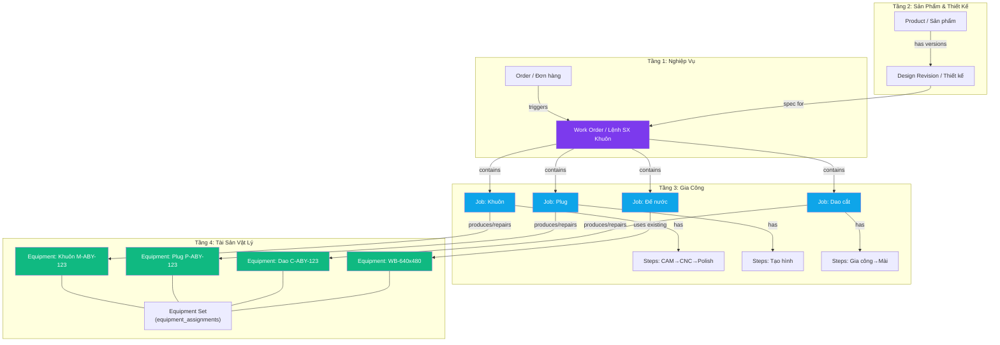

# Phân Tích Sâu: Mô Hình Tối Ưu Cho Job ↔ Equipment

## Câu Hỏi 1: Sửa Chữa Thiết Bị Riêng Hiển Thị Thế Nào?

### Trong Option A (Self-ref FK)

Tất cả các kịch bản đều dùng `jobs.equipment_id` để liên kết:

| Kịch bản | `parent_job_id` | `equipment_id` | `job_category` |
|-----------|----------------|----------------|----------------|
| Chế tạo Full Set | = WO cha | = Equipment cụ thể | `MOLD_NEW` / `PLUG_NEW` |
| Sửa chữa riêng | = NULL | = Equipment cụ thể | `MOLD_REPAIR` |
| Gia công lại (Remake) | = WO cha (nếu remake nhiều thiết bị) | = Equipment cụ thể | `MOLD_REMAKE` |

### Hiển thị trên Product Center (Equipment Detail)

```
┌─────────────────────────────────────────────────────────────────┐
│ 🔧 Equipment: Khuôn nhôm M-ABY-123                             │
│    Trạng thái: ACTIVE | Vị trí: Kệ A-3-2                       │
├─────────────────────────────────────────────────────────────────┤
│ 📋 Lịch Sử Gia Công (3 Jobs)                                   │
│                                                                  │
│ ┌─ Job 1: JOB-2026-0042-M  ✅ Hoàn thành  2026/06/01~06/10     │
│ │  Loại: Chế tạo mới (MOLD_NEW)                                │
│ │  Thuộc WO: WO-2026-0042 [ABY-123 Full Set]  ← Link           │
│ │  Steps: CAM 3D → CNC Milling → Polish → Test                 │
│ │                                                                │
│ ├─ Job 2: JOB-2026-0089    ✅ Hoàn thành  2026/07/15~07/17     │
│ │  Loại: Sửa chữa (MOLD_REPAIR) ← Standalone, không có WO     │
│ │  Steps: Mài lại → Kiểm tra kích thước                        │
│ │                                                                │
│ └─ Job 3: JOB-2026-0112-M  🔄 Đang làm  2026/08/01~           │
│    Loại: Gia công lại (MOLD_REMAKE)                              │
│    Thuộc WO: WO-2026-0078 [ABY-123 R2 Remake]  ← Link          │
│    Steps: CNC sửa cavity → Polish → Test mẫu                   │
└─────────────────────────────────────────────────────────────────┘
```

**Logic:** Query `jobs WHERE equipment_id = this_equipment ORDER BY created_at DESC`
→ Mọi job (dù Full Set hay Sửa chữa) đều hiện tại cùng 1 chỗ.

### Hiển thị trên Schedule Board

```
📋 WO-2026-0042 [ABY-123 Full Set] [Hạn: 06/15] ✅ 完了
├── 🔧 Job: Khuôn M-ABY-123    ──▓▓▓▓▓▓▓▓▓▓──────────
├── 🪵 Job: Plug P-ABY-123     ──▓▓▓▓────────────────── 
├── ✂️ Job: Dao C-ABY-123      ──────────▓▓▓▓▓▓▓▓──────
└── 🧊 Job: WB-640x480         ─▓▓──────────────────────

📋 JOB-2026-0089 [Sửa khuôn M-ABY-123] [Hạn: 07/20] ✅ 完了    ← Standalone
├── Step: Mài lại              ──▓▓▓──
└── Step: Kiểm tra             ────▓──

📋 WO-2026-0078 [ABY-123 R2 Remake] [Hạn: 08/15] 🔄 進行中
├── 🔧 Job: Khuôn M-ABY-123    ──────▓▓▓▓▓░░░░──────── 
└── ✂️ Job: Dao C-ABY-123      ──────────▓▓▓░░──────────
```

> [!NOTE]
> Option A xử lý được CẢ HAI kịch bản. Nhưng câu hỏi thật sự là: **Đây có phải mô hình tối ưu nhất không?**

---

## Câu Hỏi 2: Mô Hình Tối Ưu Toàn Diện Nhất

### Vấn Đề Cốt Lõi Cần Giải Quyết

Hiện tại `job_steps` đang **trộn lẫn 2 khái niệm** khác nhau:

| Khái niệm | Ví dụ | Bản chất |
|-----------|-------|----------|
| **Loại thiết bị** (Equipment Component) | MOLD, PLUG, CUTTER, FRAME | "Sản phẩm đầu ra" — vật thể vật lý |
| **Công đoạn gia công** (Process Step) | CAM 3D, CNC Milling, Polish, Test | "Quá trình" — hoạt động sản xuất |

Trên Schedule Board hiện tại, cả hai đều hiện trong `job_steps`:
```
Job: ABY-123
├── MOLD (đây là Equipment Component)
│   ├── CAM 3D (đây là Process Step)
│   ├── CNC Milling (Process Step)
│   └── Polish (Process Step)
├── PLUG (Equipment Component)
│   └── Tạo hình (Process Step)
└── CUTTER (Equipment Component)
    └── Ngoại gia công (Process Step)
```

> [!CAUTION]
> **Đây chính là nguồn gốc xung đột**: MOLD/PLUG/CUTTER vừa là "Track" trên Gantt, vừa là `step` trong DB, vừa là `equipment` vật lý. Ba vai trò trộn lẫn trong 1 bảng.

---

### Option C: Mô Hình Tối Ưu — Tách Rõ 4 Tầng



### Schema Option C

```sql
-- ═══════════════════════════════════════════════
-- BẢNG MỚI: work_orders (Lệnh SX Khuôn / Chỉ thị gia công)
-- ═══════════════════════════════════════════════
CREATE TABLE work_orders (
  wo_id         UUID PRIMARY KEY DEFAULT gen_random_uuid(),
  wo_code       TEXT UNIQUE NOT NULL,        -- WO-2026-0001
  wo_name       TEXT NOT NULL,               -- "Chế tạo bộ khuôn ABY-123"
  
  -- Context links
  product_id            UUID REFERENCES products(product_id),
  design_revision_id    UUID REFERENCES design_revisions(revision_id),
  order_id              UUID REFERENCES orders(order_id),
  company_id            UUID REFERENCES companies(company_id),
  case_id               UUID REFERENCES business_cases(id),
  
  -- Classification
  wo_type       TEXT NOT NULL,               -- 'NEW_SET' | 'REPAIR' | 'REMAKE' | 'MODIFICATION'
  wo_status     TEXT DEFAULT 'PLANNED',      -- 'PLANNED' | 'IN_PROGRESS' | 'COMPLETED' | 'CANCELLED'
  
  -- Schedule
  start_date    TIMESTAMPTZ,
  deadline      TIMESTAMPTZ,
  completed_at  TIMESTAMPTZ,
  
  -- Metadata
  responsible_id UUID REFERENCES employees(employee_id),
  priority      INTEGER DEFAULT 5,
  notes         TEXT,
  created_at    TIMESTAMPTZ DEFAULT now(),
  updated_at    TIMESTAMPTZ DEFAULT now()
);

-- ═══════════════════════════════════════════════
-- CẬP NHẬT: jobs (Thêm work_order_id)
-- ═══════════════════════════════════════════════
ALTER TABLE jobs ADD COLUMN work_order_id UUID REFERENCES work_orders(wo_id);

-- ═══════════════════════════════════════════════
-- QUAN HỆ DỮ LIỆU RÕ RÀNG
-- ═══════════════════════════════════════════════
-- work_orders 1 ──→ N jobs         (1 WO chứa nhiều Jobs)
-- jobs        N ──→ 1 equipment    (1 Job gắn với 1 Equipment)
-- jobs        1 ──→ N job_steps    (1 Job có nhiều Steps công đoạn)
-- job_steps   1 ──→ N work_logs    (1 Step có nhiều Work Logs)
-- equipment   N ──→ N equipment    (via equipment_assignments — Set membership)
```

### So Sánh 3 Options Hoàn Chỉnh

| Tiêu chí | Option A: Self-ref FK | Option B: Bảng WO mới | Option C: WO mới + tách sạch ⭐ |
|----------|----------------------|----------------------|-------------------------------|
| **Tách biệt khái niệm** | ⚠️ Job vừa là WO vừa là Job | ✅ WO riêng, Job riêng | ✅ WO riêng, Job = 1 Equipment, Step = công đoạn |
| **Schema change** | 1 cột | 1 bảng + 1 cột | 1 bảng + 1 cột |
| **Trùng lặp ý nghĩa** | ⚠️ Job cha ≠ Job con về bản chất | ✅ Không trùng | ✅ Không trùng |
| **Query phức tạp** | ⚠️ Self-join | ✅ JOIN đơn giản | ✅ JOIN đơn giản |
| **Backward compat** | ✅ Tốt | ✅ Tốt (WO = NULL) | ✅ Tốt (WO = NULL) |
| **Rõ ràng ngữ nghĩa** | ❌ "Job" có 2 nghĩa | ✅ Rõ | ✅ Rõ nhất |
| **Scale tương lai** | ⚠️ Khó mở rộng | ✅ Tốt | ✅ Tốt nhất |

---

## Tại Sao Option C Là Tối Ưu Nhất?

### 1. Mỗi Entity Có 1 Vai Trò Duy Nhất

| Entity | Vai trò | Không phải |
|--------|---------|-----------|
| **Work Order** | Lệnh/chỉ thị gia công — nhóm các job | ≠ Job, ≠ Equipment |
| **Job** | Gia công/sửa chữa **1 thiết bị cụ thể** | ≠ Work Order, ≠ Equipment component |
| **Job Step** | **Công đoạn** gia công (CAM, CNC, Polish) | ≠ Loại equipment (MOLD, PLUG, CUTTER) |
| **Equipment** | Thiết bị **vật lý** | ≠ Job step, ≠ Track |
| **Equipment Assignment** | Nhóm equipment thành **bộ (Set)** | ≠ Work Order |

### 2. Giải Quyết Mọi Kịch Bản

#### Kịch bản A: Chế tạo bộ mới
```
Work Order: WO-2026-0042 (wo_type='NEW_SET')
├── Job 1: equipment_id → Khuôn M-ABY-123 (tạo mới)
│   ├── Step: CAM 3D
│   ├── Step: CNC Roughing
│   ├── Step: CNC Finishing
│   └── Step: Polish
├── Job 2: equipment_id → Plug P-ABY-123 (tạo mới)
│   └── Step: Tạo hình gỗ
├── Job 3: equipment_id → Dao C-ABY-123 (tạo mới)
│   ├── Step: Gia công ngoại
│   └── Step: Kiểm tra
└── Job 4: equipment_id → WB-640x480 (dùng có sẵn)
    └── Step: Chuẩn bị / Kiểm tra
```

#### Kịch bản B: Sửa chữa 1 thiết bị
```
Job (standalone): work_order_id = NULL
├── equipment_id → Dao C-XYZ-456
├── job_category = 'CUTTER_REPAIR'
└── Steps: Mài lại → Test cut
```

#### Kịch bản C: Remake nhiều thiết bị (Design R2)
```
Work Order: WO-2026-0078 (wo_type='REMAKE')
├── Job 1: equipment_id → Khuôn M-ABY-123 (sửa cavity)
│   └── Steps: CNC sửa → Polish → Test
└── Job 2: equipment_id → Dao C-ABY-123 (làm lại)
    └── Steps: Gia công mới → Kiểm tra
```

#### Kịch bản D: Sản xuất khay (dùng khuôn có sẵn)
```
Production Instruction: PI-2026-0001
├── product_id → ABY-123
├── design_revision_id → Rev R2
└── Tự động tìm Equipment Set qua equipment_assignments
    → Khuôn M-ABY-123 + Dao C-ABY-123 + WB-640x480
```

### 3. Hiển Thị UI Nhất Quán

#### Product Center → Equipment Detail
```
┌──────────────────────────────────────────────────────────┐
│ 🔧 Khuôn M-ABY-123  |  ACTIVE  |  Kệ A-3-2            │
├──────────────────────────────────────────────────────────┤
│ Tab: 概要 | 技術 | 設備 | ★ 加工履歴 | 生産 | 書類      │
├──────────────────────────────────────────────────────────┤
│                                                          │
│ 加工履歴 / Lịch sử gia công (3 entries):                 │
│                                                          │
│ ● 2026/06 — Chế tạo mới (MOLD_NEW) ✅ 完了              │
│   WO: WO-2026-0042 [Full Set]                ← Link WO  │
│   Steps: CAM(8h) → CNC(16h) → Polish(4h)               │
│   Tổng: 28h thực tế / 24h dự kiến                       │
│                                                          │
│ ● 2026/07 — Sửa chữa (MOLD_REPAIR) ✅ 完了              │
│   Job đơn (không thuộc WO)                               │
│   Steps: Mài lại(2h) → Kiểm tra(1h)                    │
│                                                          │
│ ● 2026/08 — Gia công lại R2 (MOLD_REMAKE) 🔄 進行中     │
│   WO: WO-2026-0078 [R2 Remake]               ← Link WO  │
│   Steps: CNC sửa(░░░) → Polish(—) → Test(—)            │
│                                                          │
└──────────────────────────────────────────────────────────┘
```

#### Schedule Board → Gantt 3-Level
```
Level 1: Work Order (collapsible)
├── Level 2: Job (per equipment, collapsible)
│   └── Level 3: Job Steps (process steps)

Cụ thể:

📋 WO-2026-0042 [ABY-123 Full Set]     06/01 ─────────────── 06/15
├── 🔧 Khuôn M-ABY-123                  06/01 ─▓▓▓▓▓▓▓▓▓── 06/10
│   ├── CAM 3D                           06/01 ─▓▓───────────────
│   ├── CNC Milling                      06/03 ────▓▓▓▓▓────────
│   └── Polish                           06/08 ─────────▓▓──────
├── 🪵 Plug P-ABY-123                    06/02 ──▓▓▓───────── 06/04
│   └── Tạo hình                         06/02 ──▓▓▓────────────
├── ✂️ Dao C-ABY-123                     06/05 ─────▓▓▓▓▓── 06/12
│   └── Ngoại gia công                   06/05 ─────▓▓▓▓▓───────
└── 🧊 WB-640x480                        06/01 ─▓────────────── 
    └── Chuẩn bị                          06/01 ─▓───────────────

🔧 JOB-2026-0089 [Sửa dao C-XYZ-456]   07/15 ─▓▓▓── 07/17
├── Mài lại                               07/15 ─▓▓───
└── Test cut                              07/17 ───▓──
```

---

## Tóm Tắt: Sự Khác Biệt Giữa `job_steps` Hiện Tại vs Mô Hình Mới

### Hiện tại (Trộn lẫn)
```
job_steps chứa CẢ:
├── MOLD (equipment type) ← Track trên Gantt
│   ├── CAM 3D (process step) ← Task trên Gantt
│   └── CNC (process step)
├── PLUG (equipment type) ← Track trên Gantt
│   └── Tạo hình (process step)
└── CUTTER (equipment type) ← Track trên Gantt
    └── Gia công (process step)
```

### Option C (Tách sạch)
```
work_order → chứa nhiều jobs
├── Job 1 (equipment_id = Khuôn) ← "Track" cũ → nay là Job riêng
│   └── job_steps: CHỈ process steps
│       ├── CAM 3D
│       ├── CNC Roughing
│       └── Polish
├── Job 2 (equipment_id = Plug) ← "Track" cũ → nay là Job riêng
│   └── job_steps: CHỈ process steps
│       └── Tạo hình gỗ
└── Job 3 (equipment_id = Dao) ← "Track" cũ → nay là Job riêng  
    └── job_steps: CHỈ process steps
        └── Gia công ngoại
```

---

## Quyết Định Cần Xác Nhận

> [!IMPORTANT]
> ### 1. Chọn mô hình nào?
> | | Option A | Option C ⭐ |
> |---|---------|-----------|
> | Effort | Nhỏ (1 cột) | Vừa (1 bảng + refactor wizard + schedule) |
> | Clarity | Trung bình | Cao nhất |
> | Tương lai | Hạn chế | Mở rộng tốt |
> | **Đề xuất** | Quick win | **Đầu tư đúng từ đầu** |
>
> ### 2. Migration dữ liệu cũ (1,183 jobs)?
> - (a) Giữ nguyên: `work_order_id = NULL` cho tất cả jobs cũ
> - (b) Tạo WO tự động cho các jobs cũ có `job_steps` chứa nhiều track types  
> - **Đề xuất: (a)** — Jobs cũ hoạt động bình thường, tạo WO cho data mới
>
> ### 3. `job_steps` hiện tại xử lý thế nào?
> - Steps có `type_code = MOLD/PLUG/CUTTER` (equipment component) → Chuyển thành Job riêng trong WO
> - Steps có `type_code = CAM/CNC/POLISH` (process) → Giữ nguyên là `job_steps`
> - **Đề xuất:** Khi tạo mới → dùng mô hình mới. Dữ liệu cũ → giữ cấu trúc cũ, hiển thị bằng logic fallback
