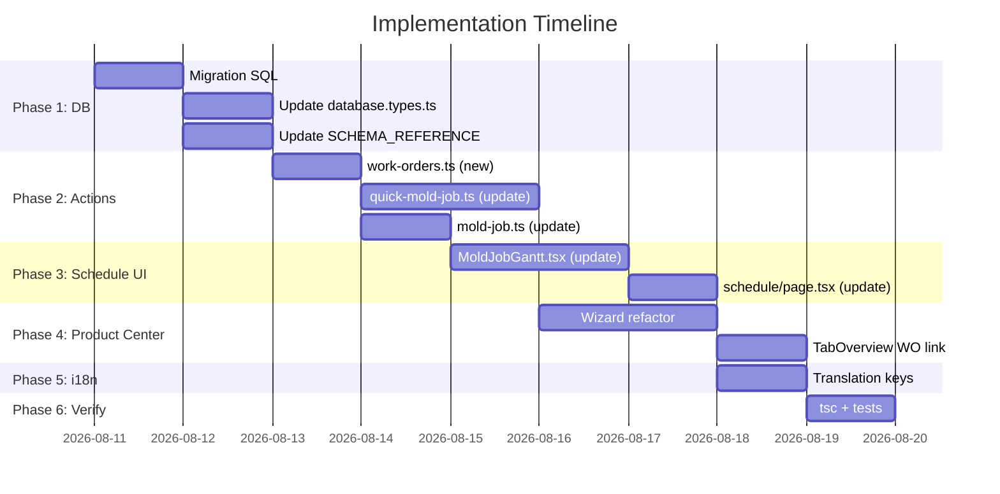

# KẾ HOẠCH TRIỂN KHAI OPTION C — WORK ORDER MODEL

> **Tài liệu tham khảo kiến trúc:** [`architecture_work_order_model_v1.md`](file:///D:/AntiGravity_Workspace/.agents/mempalace/knowledge/architecture_work_order_model_v1.md)
> **Ngày tạo:** 2026-08-10 | **Trạng thái:** Chờ phê duyệt

---

## ⛔ QUY TẮC BẮT BUỘC CHO AI AGENT THỰC THI

> [!CAUTION]
> ### Mọi AI agent (Gemini, Claude, bất kỳ model nào) PHẢI tuân thủ:
>
> 1. **KHÔNG TỰ PHÁN ĐOÁN SCHEMA**: Trước khi viết bất kỳ query nào, PHẢI đọc `SCHEMA_REFERENCE.md` và `database.types.ts` để verify tên cột, FK, kiểu dữ liệu.
> 2. **KHÔNG BỎ QUA BACKWARD COMPAT**: Jobs cũ (1,183 records) có `work_order_id = NULL` — PHẢI hoạt động bình thường.
> 3. **KHÔNG THAY ĐỔI CẤU TRÚC CỦ nếu chưa được chỉ định**: Schedule board hiện tại vẫn phải hiển thị đúng jobs cũ (3-level: Job → Track → Step).
> 4. **KHÔNG HARDCODE DỮ LIỆU**: Mọi thông tin hiển thị phải từ DB query thực tế.
> 5. **PHẢI CHẠY `npx tsc --noEmit`** sau mỗi giai đoạn và sửa hết lỗi trước khi chuyển sang giai đoạn tiếp.
> 6. **PHẢI ĐỌC FILE THỰC TẾ** trước khi sửa — không dùng "trí nhớ" từ phiên trước.
> 7. **KHÔNG TẠO BẢNG MỚI** ngoài `work_orders` trừ khi được chỉ định rõ ràng.
> 8. **GIỮ NGUYÊN bảng `mold_work_orders`** (legacy) — không drop, không merge. Bảng mới `work_orders` là entity riêng biệt.

---

## PHÁT HIỆN QUAN TRỌNG: Bảng `mold_work_orders` Đã Tồn Tại

Hệ thống đã có bảng `mold_work_orders` (legacy) với:
- **Schema**: 40+ cột chuyên biệt (phê duyệt đa bộ phận, thông số kỹ thuật chi tiết)
- **UI**: `/production/mold-orders/page.tsx` (1,426 dòng)
- **FK**: `jobs.mold_work_order_id` → `mold_work_orders.mwo_id`

**Quyết định:** Bảng `mold_work_orders` là hệ thống phê duyệt phức tạp (approval workflow). Bảng `work_orders` mới là **grouping/scheduling entity** đơn giản hơn. Hai bảng phục vụ mục đích khác nhau → giữ cả hai.

| | `mold_work_orders` (legacy) | `work_orders` (MỚI) |
|---|---|---|
| Mục đích | Phê duyệt đa bộ phận | Nhóm jobs thành lệnh sản xuất |
| Complexity | Cao (40+ cột, 5 approvers) | Thấp (~20 cột) |
| Quan hệ | 1 MWO → 1 Job | 1 WO → N Jobs |
| Giữ lại? | ✅ Giữ nguyên | ✅ Tạo mới |

---

## PHASE 1: Database Migration (Schema)

### 1.1 Tạo bảng `work_orders`

**File:** `supabase/migrations/20260811_create_work_orders.sql`

```sql
-- ═══════════════════════════════════════════════════════
-- PHASE 1.1: Tạo bảng work_orders
-- ═══════════════════════════════════════════════════════

CREATE TABLE IF NOT EXISTS work_orders (
  wo_id              UUID PRIMARY KEY DEFAULT gen_random_uuid(),
  wo_code            TEXT UNIQUE NOT NULL,          -- 'WO-2026-000001'
  wo_name            TEXT NOT NULL,                  -- 'Chế tạo bộ khuôn ABY-123'
  
  -- Context links
  product_id         UUID REFERENCES products(product_id),
  design_revision_id UUID REFERENCES design_revisions(revision_id),
  order_id           UUID REFERENCES orders(order_id),
  company_id         UUID REFERENCES companies(company_id),
  case_id            UUID REFERENCES business_cases(id),
  
  -- Classification
  wo_type            TEXT NOT NULL DEFAULT 'NEW_SET',  
  -- Enum values: 'NEW_SET' | 'REPAIR' | 'REMAKE' | 'MODIFICATION' | 'OTHER'
  
  wo_status          TEXT NOT NULL DEFAULT 'PLANNED',
  -- Enum values: 'PLANNED' | 'IN_PROGRESS' | 'COMPLETED' | 'CANCELLED'
  
  -- Schedule
  start_date         TIMESTAMPTZ,
  deadline           TIMESTAMPTZ,
  completed_at       TIMESTAMPTZ,
  
  -- Assignment
  responsible_id     UUID REFERENCES employees(employee_id),
  priority           INTEGER DEFAULT 5 CHECK (priority BETWEEN 1 AND 10),
  
  -- Metadata
  notes              TEXT,
  created_at         TIMESTAMPTZ DEFAULT now(),
  updated_at         TIMESTAMPTZ DEFAULT now(),
  created_by         UUID REFERENCES employees(employee_id)
);

-- Index cho query performance
CREATE INDEX idx_work_orders_status ON work_orders(wo_status);
CREATE INDEX idx_work_orders_deadline ON work_orders(deadline);
CREATE INDEX idx_work_orders_product ON work_orders(product_id);
CREATE INDEX idx_work_orders_company ON work_orders(company_id);

-- ═══════════════════════════════════════════════════════
-- PHASE 1.2: Thêm work_order_id vào jobs
-- ═══════════════════════════════════════════════════════

ALTER TABLE jobs ADD COLUMN IF NOT EXISTS work_order_id UUID REFERENCES work_orders(wo_id);
CREATE INDEX idx_jobs_work_order ON jobs(work_order_id);

-- ═══════════════════════════════════════════════════════
-- PHASE 1.3: Trigger tự động cập nhật updated_at
-- ═══════════════════════════════════════════════════════

CREATE OR REPLACE FUNCTION update_work_orders_updated_at()
RETURNS TRIGGER AS $$
BEGIN
  NEW.updated_at = now();
  RETURN NEW;
END;
$$ LANGUAGE plpgsql;

CREATE TRIGGER trg_work_orders_updated_at
  BEFORE UPDATE ON work_orders
  FOR EACH ROW
  EXECUTE FUNCTION update_work_orders_updated_at();

-- ═══════════════════════════════════════════════════════
-- PHASE 1.4: Function tự sinh mã WO
-- ═══════════════════════════════════════════════════════

CREATE OR REPLACE FUNCTION generate_wo_code()
RETURNS TEXT AS $$
DECLARE
  current_year INTEGER := EXTRACT(YEAR FROM now());
  next_seq INTEGER;
  new_code TEXT;
BEGIN
  SELECT COALESCE(MAX(
    CAST(SUBSTRING(wo_code FROM 'WO-\d{4}-(\d+)') AS INTEGER)
  ), 0) + 1
  INTO next_seq
  FROM work_orders
  WHERE wo_code LIKE 'WO-' || current_year || '-%';
  
  new_code := 'WO-' || current_year || '-' || LPAD(next_seq::TEXT, 6, '0');
  RETURN new_code;
END;
$$ LANGUAGE plpgsql;
```

### 1.2 Cập nhật `database.types.ts`

**File:** `src/types/database.types.ts`
**Hành động:** Thêm type definition cho `work_orders` và thêm `work_order_id` vào `jobs` type.

> [!IMPORTANT]
> **AI Agent:** KHÔNG generate lại toàn bộ file. Chỉ thêm block `work_orders` vào đúng vị trí alphabetical và thêm `work_order_id` vào `jobs` Row/Insert/Update.

### 1.3 Cập nhật `SCHEMA_REFERENCE.md`

Thêm section mô tả bảng `work_orders` với đầy đủ cột, FK, constraints.

---

## PHASE 2: Server Actions

### 2.1 Tạo file `src/app/actions/work-orders.ts`

**Các function cần tạo:**

```typescript
// ═══════════════════════════════════════════════════════
// FILE: src/app/actions/work-orders.ts
// ═══════════════════════════════════════════════════════

// --- Types ---
export type CreateWorkOrderInput = {
  wo_name: string
  product_id?: string | null
  design_revision_id?: string | null
  order_id?: string | null
  company_id?: string | null
  case_id?: string | null
  wo_type: 'NEW_SET' | 'REPAIR' | 'REMAKE' | 'MODIFICATION' | 'OTHER'
  start_date?: string | null
  deadline?: string | null
  responsible_id?: string | null
  priority?: number
  notes?: string | null
}

export type WorkOrderWithJobs = {
  // ... work_order fields + joined jobs array
}

// --- Functions ---

// 1. Tạo Work Order mới
export async function createWorkOrder(input: CreateWorkOrderInput): Promise<{
  success: boolean; wo_id: string; wo_code: string
}>

// 2. Lấy danh sách WO (có filter, pagination)
export async function getWorkOrders(params: {
  search?: string
  status?: string
  fromDate?: string
  toDate?: string
  page?: number
  pageSize?: number
}): Promise<{ data: WorkOrderWithJobs[]; count: number }>

// 3. Lấy WO kèm jobs cho Gantt chart
export async function getWorkOrdersForGantt(params: {
  search?: string
  fromDate?: string
  toDate?: string
  page?: number
  pageSize?: number
}): Promise<{ data: WorkOrderWithJobs[]; count: number }>

// 4. Cập nhật trạng thái WO (auto-compute từ jobs)
export async function updateWorkOrderStatus(wo_id: string): Promise<{ success: boolean }>

// 5. Gắn job vào WO
export async function linkJobToWorkOrder(job_id: string, wo_id: string): Promise<{ success: boolean }>
```

> [!WARNING]
> **AI Agent quy tắc query:**
> - SELECT từ `work_orders` phải dùng column names chính xác từ schema
> - JOIN `jobs` qua `jobs.work_order_id = work_orders.wo_id`
> - KHÔNG giả sử cột tồn tại — verify bằng schema trước

### 2.2 Cập nhật `src/app/actions/quick-mold-job.ts`

**Function `createQuickMoldJobWorkflow` cần thay đổi:**

Luồng hiện tại (5 bước):
```
1. Product (tìm/tạo) → 2. Design Revision → 3. Physical Mold → 4. Job → 5. Job Steps
```

Luồng mới (7 bước):
```
1. Product (tìm/tạo)
2. Design Revision
3. Work Order (TẠO MỚI)
4. Equipment Khuôn (tìm/tạo từ equipment, KHÔNG PHẢI physical_molds)
5. Job Khuôn (work_order_id = WO, equipment_id = khuôn)
6. Equipment Phụ (Plug, Cutter...) — tạo nếu cần
7. Jobs Phụ (mỗi equipment phụ = 1 job, work_order_id = WO)
8. Job Steps cho mỗi Job (CHỈ là công đoạn gia công)
```

> [!IMPORTANT]
> **AI Agent:** 
> - `QuickMoldJobInput` cần thêm `wo_type?: string` và cấu trúc `steps` cần refactor
> - Equipment tạo vào bảng `equipment` (SSOT), KHÔNG PHẢI `physical_molds` (deprecated)
> - Mỗi Job con chỉ gắn 1 `equipment_id`
> - Steps trong mỗi Job chỉ là công đoạn (CAM, CNC, Polish...), KHÔNG PHẢI equipment type

### 2.3 Cập nhật `src/app/actions/mold-job.ts`

**Function `getJobsForGantt` cần thay đổi:**

```typescript
// HIỆN TẠI: Query all jobs flat
// MỚI: Query theo 2 nhóm

export async function getJobsForGantt(params): Promise<{
  workOrders: WorkOrderWithJobs[]   // Jobs có work_order_id (nhóm theo WO)
  standaloneJobs: JobForGantt[]     // Jobs có work_order_id = NULL
  count: number
}>
```

**Logic:**
1. Query `work_orders` có deadline trong date range, JOIN `jobs` + `job_steps` + `work_logs`
2. Query `jobs` WHERE `work_order_id IS NULL` AND deadline trong date range
3. Merge 2 kết quả, trả về cho Gantt component

> [!IMPORTANT]
> **AI Agent:** PHẢI giữ backward compatible — jobs cũ không có `work_order_id` phải hiển thị đúng như hiện tại (3-level: Job → Track → Step).

---

## PHASE 3: Schedule Board UI

### 3.1 Cập nhật `src/components/equipment/MoldJobGantt.tsx`

**Thay đổi Props:**
```typescript
interface Props {
  workOrders: WorkOrderWithJobs[]  // THÊM
  jobs: JobForGantt[]              // GIỮ (standalone jobs + legacy jobs)
  employees?: any[]
  machines?: any[]
  initialFromDate?: string
  initialToDate?: string
}
```

**Thay đổi Tree Building (`useMemo<ExtendedTask[]>`):**

```
// ═══════════════════════════════════════════════
// CẤU TRÚC CÂY MỚI (hybrid 2 nguồn)
// ═══════════════════════════════════════════════

// NHÓM 1: Work Orders (jobs mới có WO)
for (wo of workOrders) {
  // Level 1: Work Order row (type: 'project')
  push WO node { id: wo.wo_id, name: wo.wo_code + wo.wo_name }
  
  for (job of wo.jobs) {
    // Level 2: Job row (type: 'task', project: wo.wo_id)
    // Hiển thị: equipment_type icon + equipment code
    push Job node { id: job.job_id, project: wo.wo_id }
    
    for (step of job.job_steps) {
      // Level 3: Step row (type: 'task', project: job.job_id)
      push Step node { id: step.step_id, project: job.job_id }
    }
  }
}

// NHÓM 2: Standalone jobs + Legacy jobs (work_order_id = NULL)
for (job of standaloneJobs) {
  // Level 1: Job row (type: 'project') — GIỮ NGUYÊN logic cũ
  push Job node { id: job.job_id }
  
  // Level 2: Track headers (MOLD, PLUG, CUTTER...) — GIỮ NGUYÊN
  // Level 3: Steps — GIỮ NGUYÊN
}
```

> [!CAUTION]
> **AI Agent:** Phần "NHÓM 2" PHẢI GIỮ NGUYÊN 100% logic hiện tại (3-level: Job → Track → Step). Chỉ thêm code cho NHÓM 1. Không được refactor code cũ.

### 3.2 Cập nhật `src/app/equipment/schedule/page.tsx`

- Thay đổi data fetching: gọi `getWorkOrdersForGantt()` + `getJobsForGantt()` (standalone)
- Pass cả 2 props xuống `MoldJobGantt`

### 3.3 UI Hiển Thị Work Order Row

| Element | Style |
|---------|-------|
| Icon | 📋 (hoặc `FileText` từ lucide-react) |
| Mã WO | `wo_code` — monospace, accent color, clickable |
| Tên | `wo_name` — truncate 30 chars |
| Khách hàng | `companies.company_code` — badge |
| Trạng thái | Badge: PLANNED=info, IN_PROGRESS=warning, COMPLETED=success |
| Hạn | `deadline` — format ngày, highlight nếu quá hạn |
| Thanh Gantt | Aggregate từ min(job.start) → max(job.end), progress = avg(jobs progress) |

---

## PHASE 4: Product Center Integration

### 4.1 `CenteredQuickJobWizardModal.tsx` — Refactor Wizard

**File:** `src/app/product-center/[id]/_components/CenteredQuickJobWizardModal.tsx`

**Thay đổi luồng:**
- Step 1 (Product Info): Giữ nguyên
- Step 2 (Design Specs): Giữ nguyên  
- Step 3 (Equipment & Steps): **THAY ĐỔI** — Tạo N equipment entities + N jobs
- Step 4 (Confirm): **THAY ĐỔI** — Hiển thị WO preview với N jobs

**Payload submit mới:**
```typescript
// Thay vì 1 job + N steps trộn lẫn
// → Tạo 1 WO + N jobs (mỗi job = 1 equipment)
const payload = {
  // Work Order info
  wo_type: 'NEW_SET',
  deadline: moldDeadline,
  
  // Product & Design (giữ nguyên)
  product_code, product_name, company_id,
  design_code, design_specs...,
  
  // Equipment list (MỚI)
  equipment_items: [
    { type: 'MOLD', code: 'M-ABY-123', steps: ['CAM 3D', 'CNC Roughing', 'CNC Finishing', 'Polish'] },
    { type: 'PLUG', code: 'P-ABY-123', steps: ['Tạo hình'] },
    { type: 'CUTTER_SEPARATE', code: 'C-ABY-123', steps: ['Gia công ngoại'] },
  ]
}
```

> [!WARNING]
> **AI Agent:** PHẢI đọc schema bảng `equipment` để biết `equipment_type` enum values chính xác. KHÔNG tự bịa.

### 4.2 Equipment Detail — Hiển thị Work Order link

**File:** `src/app/product-center/[id]/_components/TabOverview.tsx` hoặc `TabDesignsEquipment.tsx`

Khi hiển thị jobs của 1 equipment, thêm cột/badge "Thuộc WO" nếu `work_order_id != NULL`:
```tsx
{job.work_order_id && (
  <Link href={`/equipment/work-orders/${job.work_order_id}`}>
    <span className="badge badge--info">{job.work_orders?.wo_code}</span>
  </Link>
)}
```

---

## PHASE 5: i18n & Translation

### 5.1 Thêm keys vào `messages/ja.json` và `messages/vi.json`

```json
// Namespace: WorkOrders
{
  "pageTitle": "製作指示一覧",        // "Danh sách Lệnh gia công"
  "woCode": "指示コード",             // "Mã WO"
  "woName": "指示名",                 // "Tên WO"
  "woType": "種類",                   // "Loại"
  "woStatus": "状態",                 // "Trạng thái"
  "newSet": "新規製作",               // "Chế tạo mới"
  "repair": "修理",                   // "Sửa chữa"
  "remake": "改修",                   // "Gia công lại"
  "modification": "変更",             // "Cải tiến"
  "planned": "計画済",                // "Đã lên kế hoạch"
  "inProgress": "進行中",             // "Đang thực hiện"
  "completed": "完了",                // "Hoàn thành"
  "cancelled": "キャンセル",           // "Đã hủy"
  "jobCount": "ジョブ数",             // "Số job"
  "belongsToWo": "所属指示"           // "Thuộc WO"
}
```

> [!IMPORTANT]
> **AI Agent:** Sau khi thêm keys, PHẢI chạy `node scripts/check_translations.mjs` để verify.

---

## PHASE 6: Verification & Testing

### 6.1 TypeScript Check
```bash
npx tsc --noEmit
# Phải 0 errors
```

### 6.2 Translation Check
```bash
node scripts/check_translations.mjs
node scripts/find_hardcoded_bilingual.mjs
```

### 6.3 Functional Test Scenarios

| # | Scenario | Expected |
|---|----------|----------|
| T1 | Tạo WO mới qua Wizard (Full Set) | WO + 3-4 Jobs + Equipment entities created |
| T2 | Schedule Board hiển thị WO mới | WO ở Level 1, Jobs ở Level 2, Steps ở Level 3 |
| T3 | Schedule Board hiển thị jobs cũ | Hiển thị như cũ (Job → Track → Step) |
| T4 | Product Center → Equipment Detail | Hiển thị tất cả jobs (cả WO và standalone) |
| T5 | Tạo job sửa chữa (standalone) | Job tạo không có WO, hiển thị Level 1 trên Gantt |
| T6 | Pagination + search trên Schedule | WO + standalone jobs đều searchable |

### 6.4 Backward Compatibility Check

```sql
-- Verify jobs cũ vẫn có work_order_id = NULL
SELECT COUNT(*) FROM jobs WHERE work_order_id IS NULL;
-- Expected: 1183 (toàn bộ jobs cũ)

-- Verify schedule query vẫn trả về jobs cũ
SELECT * FROM jobs 
WHERE work_order_id IS NULL 
AND job_status != 'CANCELLED'
ORDER BY mold_deadline;
```

---

## THỨ TỰ THỰC HIỆN



**Ước tính tổng:** ~8-10 ngày làm việc, có thể song song Phase 3 + Phase 4.

---

## FILES AFFECTED (Tóm tắt)

| Action | File |
|--------|------|
| **[NEW]** | `supabase/migrations/20260811_create_work_orders.sql` |
| **[NEW]** | `src/app/actions/work-orders.ts` |
| **[MODIFY]** | `src/types/database.types.ts` — thêm `work_orders` type, thêm `work_order_id` vào `jobs` |
| **[MODIFY]** | `SCHEMA_REFERENCE.md` — thêm section `work_orders` |
| **[MODIFY]** | `src/app/actions/quick-mold-job.ts` — refactor workflow 5→7 bước |
| **[MODIFY]** | `src/app/actions/mold-job.ts` — cập nhật `getJobsForGantt` return type |
| **[MODIFY]** | `src/components/equipment/MoldJobGantt.tsx` — thêm WO level vào tree |
| **[MODIFY]** | `src/app/equipment/schedule/page.tsx` — thêm data fetching WO |
| **[MODIFY]** | `src/app/product-center/[id]/_components/CenteredQuickJobWizardModal.tsx` — refactor |
| **[MODIFY]** | `src/app/product-center/[id]/_components/TabOverview.tsx` — thêm WO link |
| **[MODIFY]** | `messages/ja.json` + `messages/vi.json` — thêm namespace WorkOrders |
