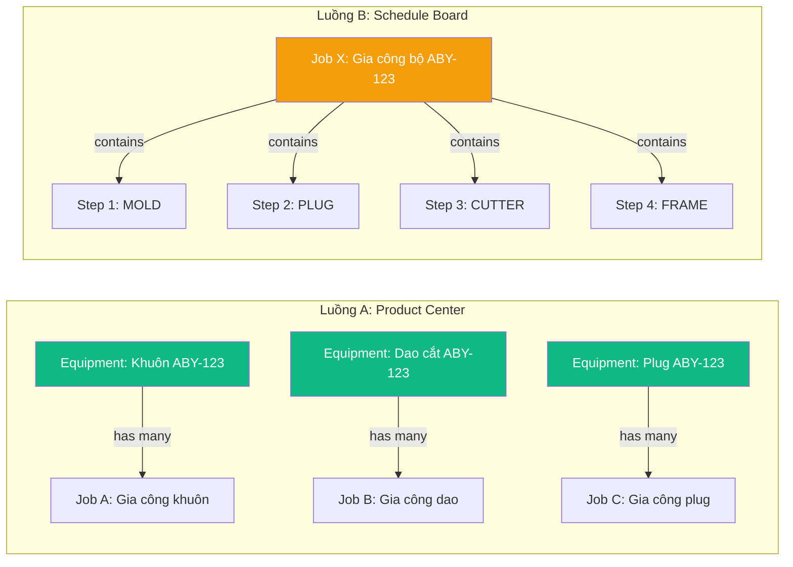
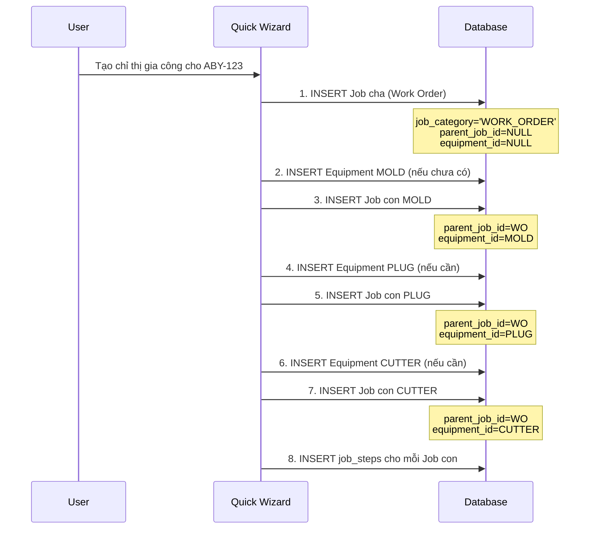

# Phân Tích Xung Đột Luồng Dữ Liệu: Product Center ↔ Bảng Kế Hoạch Khuôn

## 1. Hiện Trạng — Hai Mô Hình Xung Đột

### 1.1 Luồng A: Product Center (Bottom-Up)
```
Product → Design Revision → Equipment (N cái: Mold, Cutter, WB, PB, Frame...) 
                                ↓ (mỗi equipment)
                              Job(s) → Work Logs
```
**Quan hệ:** `jobs.equipment_id` FK → `equipment.equipment_id` (1 Job thuộc 1 Equipment)

### 1.2 Luồng B: Schedule Board / Gantt (Top-Down)  
```
Job (1 lệnh sản xuất) → job_steps (N đối tượng: MOLD, PLUG, CUTTER, FRAME...)
                              ↓ (mỗi step)
                            Work Logs → Gantt bars
```
**Quan hệ:** `job_steps.job_id` FK → `jobs.job_id` (1 Job chứa N Steps/Components)

### 1.3 Bản Chất Xung Đột



> [!CAUTION]
> **Xung đột cốt lõi:** Luồng A coi Equipment là **cha** của Job (1 Equipment → N Jobs). Luồng B coi Job là **cha** của Equipment/Steps (1 Job → N Steps/Components). Hai hướng ngược nhau → dữ liệu trùng lặp, không đồng bộ.

---

## 2. Phân Tích Schema Hiện Tại

### 2.1 Bảng `jobs` — Quan hệ FK hiện tại

| Cột FK | Trỏ tới | Ý nghĩa |
|--------|---------|---------|
| `equipment_id` | `equipment` | Thiết bị **chính** mà job gia công (thêm 2026-07-31) |
| `physical_mold_id` | `physical_molds` | Legacy FK khuôn vật lý (deprecated fallback) |
| `design_revision_id` | `design_revisions` | Phiên bản thiết kế (context) |
| `product_id` | `products` | Sản phẩm (context) |
| `case_id` | `business_cases` | Sự vụ kinh doanh (context) |

### 2.2 Bảng `job_steps` — Con của Job

| Cột quan trọng | Ý nghĩa |
|----------------|---------|
| `job_id` FK → `jobs` | Job cha |
| `type_code` / `item_type_id` | Loại component: `MOLD`, `PLUG`, `CUTTER`, `WATER_BASE`, `FRAME`... |
| `track` | Nhóm hiển thị trên Gantt |
| `planned_start/end` | Lịch trình |
| ⚠️ **Không có `equipment_id`** | Step KHÔNG liên kết trực tiếp với `equipment` |

### 2.3 Bảng 5 Vấn Đề Cụ Thể

| # | Vấn đề | Hậu quả |
|---|--------|---------|
| P1 | `job_steps` không có FK → `equipment` | Không thể truy vết step → thiết bị vật lý cụ thể |
| P2 | 1 Job có `equipment_id` = 1 Equipment, nhưng `job_steps` chứa nhiều loại thiết bị | Job gắn với Khuôn nhưng steps có cả Plug, Cutter → mâu thuẫn |
| P3 | Quick Job Wizard tạo 1 Job + N steps (MOLD, PLUG, CUTTER...) | Nhưng `equipment_id` = 1 Khuôn → Plug, Cutter không có entity equipment riêng |
| P4 | Schedule board hiển thị steps theo track MOLD/PLUG/CUTTER | Nhưng không biết step nào → equipment nào |
| P5 | Khi sửa chữa 1 dao cắt riêng → không thể tạo job riêng cho dao đó | Vì dao cắt chỉ là step con, không phải entity chính của job |

---

## 3. Mô Hình Thực Tế Trong Sản Xuất Khuôn

### 3.1 Thực Tế Nghiệp Vụ Phòng Khuôn YSD

Khi nhận đơn hàng sản phẩm mới, phòng khuôn cần gia công **BỘ THIẾT BỊ** gồm:

```
Đơn hàng mới: Sản phẩm ABY-123
  ├── Khuôn nhôm (MOLD) ← CNC milling 3 ngày
  ├── Plug gỗ (PLUG) ← Tạo hình 1 ngày  
  ├── Dao cắt (CUTTER) ← Gia công ngoại 5 ngày
  ├── Đế nước (WATER_BASE) ← Có sẵn / Chế tạo mới
  ├── Khung (FRAME) ← Có sẵn / Chế tạo mới
  └── Stacking (STACKING) ← Tùy sản phẩm
```

### 3.2 Hai Kịch Bản Thực Tế

| Kịch bản | Mô tả | Hiện tại |
|-----------|-------|---------|
| **Full Set mới** | Gia công toàn bộ bộ khuôn + phụ kiện | 1 Job chứa N steps → ✅ Schedule đúng, ❌ Product Center sai |
| **Sửa chữa riêng** | Chỉ sửa 1 thiết bị cụ thể (dao mòn, khuôn hỏng) | Tạo job mới cho 1 equipment → ✅ Product Center đúng, ❌ Schedule thiếu context |

---

## 4. Đề Xuất Giải Pháp

### 4.1 Option A: Self-Referencing FK — "Work Order là Job cha" ⭐ RECOMMENDED

**Ý tưởng:** Sử dụng lại bảng `jobs` nhưng thêm quan hệ cha-con:

```sql
-- Thêm 1 cột duy nhất
ALTER TABLE jobs ADD COLUMN parent_job_id UUID REFERENCES jobs(job_id);
-- parent_job_id = NULL → Job đứng một mình HOẶC là Work Order (cha)
-- parent_job_id = <id> → Job con thuộc Work Order

-- Thêm equipment_id vào job_steps (tùy chọn, cho truy vết chi tiết)
ALTER TABLE job_steps ADD COLUMN equipment_id UUID REFERENCES equipment(equipment_id);
```

**Cấu trúc dữ liệu mới:**

```
📋 Job cha (Work Order): WO-2026-0042 
   ├── job_category = 'WORK_ORDER'
   ├── equipment_id = NULL (không gắn 1 equipment cụ thể)
   ├── product_id → ABY-123
   └── design_revision_id → Rev R1
       │
       ├── 🔧 Job con: Khuôn nhôm ABY-123
       │   ├── parent_job_id = WO-2026-0042
       │   ├── equipment_id → Equipment MOLD
       │   ├── job_steps: CAM, CNC, Polish
       │   └── work_logs → giờ thực tế
       │
       ├── 🪵 Job con: Plug gỗ ABY-123
       │   ├── parent_job_id = WO-2026-0042
       │   ├── equipment_id → Equipment PLUG
       │   └── job_steps: Tạo hình
       │
       └── ✂️ Job con: Dao cắt ABY-123
           ├── parent_job_id = WO-2026-0042
           ├── equipment_id → Equipment CUTTER
           └── job_steps: Gia công, Kiểm tra

📋 Job đơn (Standalone): Sửa dao cắt C-XYZ-456
   ├── parent_job_id = NULL
   ├── equipment_id → Equipment CUTTER cụ thể
   └── job_steps: Mài lại, Test
```

### 4.2 Option B: Tạo bảng `work_orders` riêng (Clean nhưng phá vỡ nhiều)

```sql
CREATE TABLE work_orders (
  wo_id UUID PRIMARY KEY DEFAULT gen_random_uuid(),
  wo_code TEXT UNIQUE NOT NULL,
  product_id UUID REFERENCES products(product_id),
  design_revision_id UUID REFERENCES design_revisions(revision_id),
  company_id UUID REFERENCES companies(company_id),
  wo_status TEXT DEFAULT 'PLANNED',
  deadline TIMESTAMPTZ,
  created_at TIMESTAMPTZ DEFAULT now()
);

ALTER TABLE jobs ADD COLUMN work_order_id UUID REFERENCES work_orders(wo_id);
```

### 4.3 So Sánh

| Tiêu chí | Option A (Self-ref FK) ⭐ | Option B (Bảng mới) |
|----------|----------------------|---------------------|
| Schema thay đổi | 1 cột (`parent_job_id`) | 1 bảng mới + 1 cột |
| Code thay đổi | Ít — query thêm `.is('parent_job_id', null)` | Nhiều — tạo UI mới cho WO |
| Schedule board | Level 1 = Job cha, Level 2 = Job con | Cần refactor hiển thị |
| Product Center | Equipment → Job con → Job cha (chain) | Equipment → Job → WO |
| Backward compat | ✅ Jobs cũ có `parent_job_id = NULL` | ⚠️ Cần migration link |
| Rõ ràng | Hơi trick (self-ref) | Rõ ràng hơn |

---

## 5. Luồng Nghiệp Vụ Sau Khi Thống Nhất (Option A)

### 5.1 Kịch Bản 1: Tạo Mới Full Set



### 5.2 Kịch Bản 2: Sửa Chữa Riêng Lẻ

```
User → Chọn Equipment cụ thể → Tạo Job → parent_job_id = NULL
→ Job gắn trực tiếp với 1 equipment → Steps là công đoạn sửa chữa
```

### 5.3 Schedule Board — Cấu Trúc Cây Mới (4-Level)

```
📋 Work Order: WO-2026-0042 [ABY-123 Full Set]     ← Level 1 (Project)
├── 🔧 Job: Khuôn nhôm ABY-123 [M-ABY-123]         ← Level 2 (Sub-project)
│   ├── Step: CAM 3D                                 ← Level 3 (Task)
│   ├── Step: CNC Milling                            ← Level 3
│   └── Step: Polish                                  ← Level 3
├── 🪵 Job: Plug gỗ ABY-123 [P-ABY-123]             ← Level 2
│   └── Step: Tạo hình                               ← Level 3
├── ✂️ Job: Dao cắt ABY-123 [C-ABY-123]             ← Level 2
│   ├── Step: Ngoại gia công                          ← Level 3
│   └── Step: Kiểm tra                                ← Level 3
└── 🧊 Job: Đế nước [WB-640x480]                    ← Level 2
    └── Step: Chuẩn bị                                ← Level 3

📋 Job (Standalone): Sửa dao cắt C-XYZ-456          ← Level 1
├── Step: Mài lại                                     ← Level 2
└── Step: Test cut                                    ← Level 2
```

---

## 6. Impact Trên Code Hiện Tại

### 6.1 Schedule Board (`getJobsForGantt`)
- **Hiện tại:** Query tất cả jobs + job_steps, build tree Job→Track→Step
- **Sau:** Query jobs WHERE `parent_job_id IS NULL` OR `job_category = 'WORK_ORDER'` ở Level 1, rồi load child jobs
- **Track header (MOLD/PLUG/CUTTER)** → chuyển thành Job con thay vì track grouping

### 6.2 Quick Wizard (`createQuickMoldJobWorkflow`)
- **Hiện tại:** Tạo 1 Job + N job_steps
- **Sau:** Tạo 1 Job cha (Work Order) + N Job con (mỗi cái gắn 1 equipment) + job_steps cho mỗi Job con

### 6.3 Product Center 
- **Hiện tại:** Equipment → Jobs (query `equipment_id = equipId`)
- **Sau:** Không thay đổi — vẫn query `jobs.equipment_id = equipId`, chỉ thêm hiển thị Work Order cha nếu có

### 6.4 Backward Compatibility
- Jobs cũ (1,183 records): `parent_job_id = NULL` → hiển thị như standalone
- **Không cần migration dữ liệu cũ** — cấu trúc cũ vẫn hoạt động

---

## 7. Tổng Kết Quyết Định Cần Xác Nhận

> [!IMPORTANT]
> ### Anh cần xác nhận các điểm sau:
>
> 1. **Chọn Option A (self-ref FK `parent_job_id`) hay Option B (bảng `work_orders` mới)?**
>    - Đề xuất: **Option A** — ít phá vỡ nhất, backward compatible
>
> 2. **Schedule Board muốn hiển thị theo cấu trúc nào?**
>    - (a) Giữ 3-level: Job → Track → Step (như hiện tại)
>    - (b) Chuyển 4-level: Work Order → Job (per equipment) → Step
>    - Đề xuất: **(b)** — nhất quán với mô hình dữ liệu mới
>
> 3. **Quick Wizard có nên tạo Equipment entity cho Plug/Cutter không?**
>    - (a) Chỉ tạo Equipment cho MOLD, còn Plug/Cutter chỉ là job_steps
>    - (b) Tạo Equipment cho TẤT CẢ (MOLD, PLUG, CUTTER, WB, PB...)
>    - Đề xuất: **(b)** — SSOT cho mọi thiết bị vật lý
>
> 4. **`job_steps.type_code`** hiện đóng vai trò phân loại equipment (MOLD/PLUG/CUTTER) hay phân loại công đoạn (CAM/CNC/Polish)?
>    - Nếu chuyển sang mô hình mới, `type_code` sẽ chỉ là **công đoạn gia công**, không còn là loại equipment
