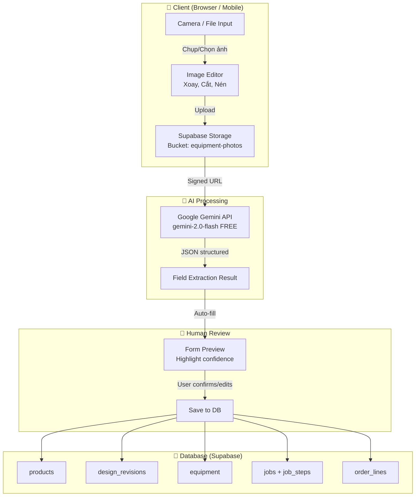
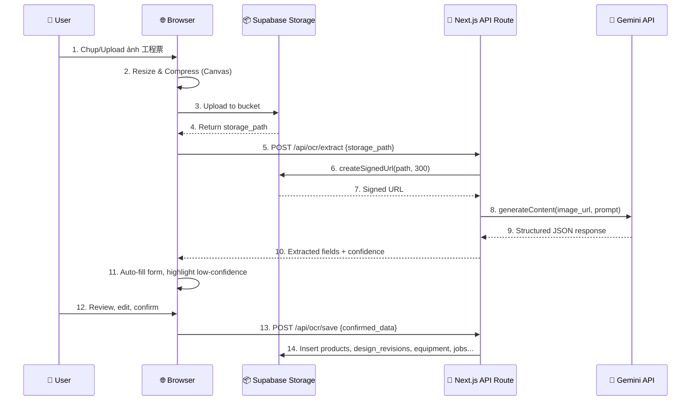

# Phân Tích & Kế Hoạch: Product Center Workflow + AI Photo OCR Module

## Tổng quan

Bản phân tích này trả lời 2 câu hỏi chính:
1. Product Center đã đủ tính năng cho full business workflow chưa?
2. Kế hoạch xây dựng module Upload ảnh + AI trích xuất dữ liệu từ 新規金型製造工程票

---

## PHẦN 1: ĐÁNH GIÁ TÍNH NĂNG PRODUCT CENTER

### ✅ Tính năng ĐÃ CÓ (hoạt động tốt)

| Tính năng | Cơ chế | Đánh giá |
|-----------|--------|----------|
| Xem thông tin sản phẩm đầy đủ | 5 Tabs: Overview, Orders, Designs&Equipment, Jobs, Related | ✅ Hoàn thiện |
| Xem thông số kỹ thuật (Paper Style) | Từ `design_revisions` + revision switching | ✅ Hoàn thiện |
| Cập nhật trạng thái Revision | Dropdown status trong TabOverview | ✅ Hoàn thiện |
| Tạo thiết bị mới (Mold, Cutter, Plug...) | `CenteredQuickJobWizardModal` | ✅ Hoàn thiện |
| Tạo Job gia công mới (inline) | `CenteredQuickJobWizardModal` + `job_steps` | ✅ Hoàn thiện |
| Nhập/Sửa Work Logs | Modal + Drawer (`EquipmentJobDrawer`) | ✅ Hoàn thiện |
| Context Menu thiết bị | Check-in, Scrap, Đổi vị trí, Tạo Job | ✅ Hoàn thiện |
| Xem lịch sử đơn hàng | `TabOrders` join `order_lines` → `orders` | ✅ Hoàn thiện |
| Tìm kiếm & Lọc sản phẩm | Fuzzy search + Filter Drawer + Sort | ✅ Hoàn thiện |

### ❌ Tính năng THIẾU / BỊ ĐỨT GÃY (cần khắc phục)

| # | Vấn đề | Ảnh hưởng | Mức độ |
|---|--------|-----------|--------|
| **G1** | **Tạo Sản phẩm mới**: Không có nút tạo trực tiếp tại Product Center, phải chuyển sang `/master/products` | Đứt gãy workflow: User phải rời khỏi Product Center | 🟡 Trung bình |
| **G2** | **Tạo Design Revision mới**: Không có form inline, phải chuyển sang `/engineering/designs/[id]` | Đứt gãy workflow | 🟡 Trung bình |
| **G3** | **Quick Create Job không đọc `product_id`**: Nút `+ Thêm Job` dẫn tới `/equipment/jobs/quick-create?product_id=...` nhưng trang đó **KHÔNG đọc param `product_id`** → form trắng trống | ⚠️ **BUG nghiêm trọng** | 🔴 Cao |
| **G4** | **Tạo Đơn hàng không link sản phẩm**: `/orders/create` không đọc `?product_id=...` → không tự điền sản phẩm | Đứt gãy workflow | 🟡 Trung bình |
| **G5** | **Tạo Đơn hàng từ danh sách**: `/orders/page.tsx` không lọc theo `?product_id=...` từ Product Center | Đứt gãy workflow | 🟢 Thấp |

### 📋 Kết luận Phần 1

> **Product Center đã có ~75% tính năng cần thiết** cho full workflow. Tuy nhiên có **3 điểm đứt gãy quan trọng** (G1, G3, G4) khiến luồng tạo mới không liền mạch. Đặc biệt **G3 là BUG** cần fix ngay.

### Đề xuất sửa (ưu tiên)

1. **[P0] Fix G3**: Cập nhật `/equipment/jobs/quick-create` đọc `searchParams.product_id` → auto-populate sản phẩm, khách hàng, revision
2. **[P1] Fix G4**: Cập nhật `/orders/create` đọc `searchParams.product_id` → auto-add order line
3. **[P1] Fix G1**: Thêm nút `+ Tạo sản phẩm mới` tại `/product-center` mở modal tạo nhanh
4. **[P2] Fix G2**: Thêm nút `+ Tạo Revision mới` inline tại TabDesignsEquipment

---

## PHẦN 2: AI PHOTO OCR MODULE — Trích Xuất Dữ Liệu Từ Ảnh

### 2.0 Bối cảnh & Vấn đề "Ngược Quy Trình"

> [!IMPORTANT]
> **Anh Thoan đã nêu đúng**: Việc scan giấy → nhập vào hệ thống là **ngược quy trình chuẩn** (chuẩn: tạo trên app → in ra giấy).
> Tuy nhiên, đây là **chiến lược chuyển đổi số thực tế (Digital Transformation Bridge)**:

```
Hiện tại (過渡期):  Giấy 工程票 → [AI OCR] → DB (nhập song song)
                     ↓
Tương lai (本番):    App tạo 工程票 → DB → Print PDF (xuất giấy nếu cần)
```

**Giá trị của module OCR ngay cả sau khi chuyển sang quy trình chuẩn:**
- **Nhập dữ liệu lịch sử**: Scan hàng trăm 工程票 cũ từ hồ sơ giấy → số hóa toàn bộ
- **Kiểm tra chéo**: Đối chiếu giấy với dữ liệu đã có trên hệ thống
- **Backup / Audit trail**: Lưu ảnh gốc làm bằng chứng pháp lý
- **Mobile-first**: Nhân viên xưởng chụp nhanh bằng điện thoại → dữ liệu tự cập nhật

### 2.1 Kiến trúc Tổng thể



### 2.2 Phân tích MoldCutterSearch Photo Module — Tái sử dụng

#### Hai dự án Supabase TÁCH BIỆT

| | MoldCutterSearch | ysdms-nextgen |
|---|---|---|
| **Supabase URL** | `bgpnhvhouplvekaaheqy.supabase.co` | `iirezrszalmecsslbruo.supabase.co` |
| **Bucket** | `mold-photos` | *(chưa có)* |
| **DB Table** | `device_photos` (flat) | *(chưa có, cần tạo `equipment_photos`)* |
| **Kiến trúc** | Vanilla JS SPA | Next.js 14+ React |

#### Kết luận: KHÔNG dùng chung bucket, nhưng tái sử dụng LOGIC

> [!WARNING]
> **KHÔNG NÊN dùng chung Supabase project** giữa 2 ứng dụng vì:
> - Schema DB hoàn toàn khác nhau (flat vs normalized V3)
> - RLS policies sẽ xung đột
> - Nếu hủy MoldCutterSearch, ảnh trên bucket `bgpnhvhouplvekaaheqy` sẽ bị mất

> [!TIP]
> **KHUYẾN NGHỊ**: Tạo bucket MỚI `equipment-photos` trên Supabase project của ysdms-nextgen (`iirezrszalmecsslbruo`). Nếu cần di chuyển ảnh cũ từ MoldCutterSearch → viết script migration 1 lần.

#### Tái sử dụng được từ MoldCutterSearch

| Module gốc (Vanilla JS) | Tái sử dụng | Chuyển đổi sang |
|---|---|---|
| `photo-upload.js` — Camera stream, xoay/lật/cắt/nén | ✅ Logic + thuật toán | React Hook `usePhotoCapture()` |
| `device-photo-store.js` — Upload SDK, thumbnail, batch | ✅ Logic | `lib/supabase/equipmentPhotoStore.ts` |
| `photo-manager.js` — Gallery, Lightbox, Grid | ✅ UI pattern | React Component `<PhotoGallery />` |
| Signed URL caching (TTL 20min) | ✅ Strategy | Custom hook `useSignedUrls()` |
| GPS tagging | ⚠️ Optional | Có thể bổ sung sau |
| QR Scanner | ❌ Không cần | Module riêng biệt |

### 2.3 Mapping Chi Tiết: 新規金型製造工程票 → Database

Dưới đây là mapping CHÍNH XÁC từng trường trên phiếu giấy vào DB schema hiện tại:

#### Nhóm A — Thông tin Sản phẩm (`products` + `design_revisions`)

| Trường trên giấy | Ví dụ từ ảnh | DB Table.Column | Ghi chú |
|---|---|---|---|
| 型番 (Mã khuôn) | `TOW-009` | `products.product_code` / `product_name_internal` | Parse: bỏ gạch ngang → `TOW009` cho `product_code`, giữ `TOW-009` cho `product_name_internal` |
| 品名 (Tên SP) | VARANUS向け梱包トレイ 321×254 10個入 | `products.product_name` | Tên chính thức khách hàng |
| 記入者 (Người ghi) | 小林一弘 | *(Audit log)* | Metadata, không cần cột riêng |
| 記載日 (Ngày ghi) | 2026.08.06 | *(Audit log)* | Ngày tạo phiếu |
| 材質 (Vật liệu) | PP7.5, 0.6mm [640] 帯電防止付 シリコン無 | `design_revisions.plastic_type_designed` | **SSOT** — RULE-DATA-01 |
| 製品寸法 (Kích thước SP) | 321 × 254 | `design_revisions.cutline_length` = 321, `.cutline_width` = 254 | **SSOT** — KHÔNG fallback |
| 型寸法 (Kích thước khuôn) | 590 × 350 | `equipment.actual_length_mm` = 590, `.actual_width_mm` = 350 | Khuôn vật lý |
| 取数 (Số cavity) | 2 | `design_revisions.pocket_count` = 2 | |
| 寸法公差 X | 321 (±1.0) | `design_revisions.notes` hoặc custom field | Tolerance |
| 寸法公差 Y | 254 (±1.0) | `design_revisions.notes` hoặc custom field | Tolerance |

#### Nhóm B — Thiết bị (`equipment`)

| Trường trên giấy | Giá trị | DB Table.Column | Logic |
|---|---|---|---|
| プラグ 有/無 | 有 | Tạo record `equipment` type `PLUG` | `equipment_type = 'PLUG'` |
| カッター 新規/既存 | 新規 | Tạo record `equipment` type `CUTTER_SEPARATE` hoặc `CUTTER_INLINE` | Mặc định `CUTTER_SEPARATE` |
| 水冷盤 新規/既存 | 既存 | Link `equipment` type `WATER_BASE` đã có | Tìm existing hoặc bỏ qua |
| 枠 新規/既存 | 既存 | Link `equipment` type `FRAME` đã có | Tìm existing hoặc bỏ qua |

#### Nhóm C — Job & Job Steps (`jobs` + `job_steps`)

| Trường trên giấy | Giá trị | DB Table.Column | Logic |
|---|---|---|---|
| 手配アルミ材 要/不要 + 納期 | 要, 8/6(木) | `job_steps` → track `MOLD`, `material_spec`, `deadline` | `arrangement = 'REQUIRED'` |
| 手配プラグ 要/不要 + 納期 | 要, 8/26(水) | `job_steps` → track `PLUG`, `deadline` | |
| 手配カッター 要/不要 + 納期 | 要, 8/26(水) | `job_steps` → track `CUTTER`, `deadline` | |
| 手配水冷盤材 要/不要 | 不要 | Không tạo step hoặc `arrangement = 'NOT_REQUIRED'` | |
| 手配枠 要/不要 | 不要 | Không tạo step | |
| 金型製造担当 | 遠藤 | `jobs.responsible_id` → lookup `employees` by name | |
| 本型納期 | 8/26 (水) | `jobs.deadline` | Deadline hoàn thành khuôn |
| 成形出荷納期 | 8/28 (金) | `order_lines.ship_date` hoặc `jobs.ship_date` | Deadline giao hàng |

#### Nhóm D — Thông tin bổ sung

| Trường trên giấy | Giá trị | Xử lý |
|---|---|---|
| 出荷サンプル数 | メール通り | Ghi vào notes |
| 送り先 | メール通り | Ghi vào notes hoặc `delivery_sites` |
| 別抜き 有/無 | 無 | Flag boolean |
| 箱の種類 | 44.1 | Packaging info |
| 袋詰め 要/否 | 要 | Flag boolean |
| 無地/印刷 | 印刷 | Packaging type |
| 見積添付 | ✓ | Quotation attached flag |

### 2.4 AI OCR: Gemini API Integration

#### Tại sao chọn Google Gemini Free?

| Tiêu chí | Gemini 2.0 Flash | Tesseract OCR | Cloud Vision |
|---|---|---|---|
| **Giá** | ✅ FREE (15 RPM) | ✅ Free | ❌ Trả phí |
| **Nhận dạng chữ Nhật viết tay** | ✅ Xuất sắc | ❌ Rất kém | ✅ Tốt |
| **Structured output (JSON)** | ✅ Native | ❌ Không có | ⚠️ Cần post-processing |
| **Hiểu ngữ cảnh form** | ✅ Hiểu layout form | ❌ Chỉ OCR text | ⚠️ Hạn chế |
| **Rate limit** | 15 req/min (free) | Unlimited | Pay-per-use |

#### Prompt Engineering cho Gemini

```typescript
const EXTRACTION_PROMPT = `
あなたは金型製造の工程票（新規金型製造工程票）を読み取るAIアシスタントです。
以下の画像から、各フィールドの値を正確に抽出してJSON形式で返してください。

出力フォーマット:
{
  "confidence": 0.0-1.0,  // 全体の読み取り信頼度
  "product": {
    "model_number": "型番",
    "product_name": "品名",
    "material": "材質（全文そのまま）",
    "product_dimensions": { "length": number, "width": number },
    "mold_dimensions": { "length": number, "width": number },
    "cavity_count": number,
    "author": "記入者",
    "date": "YYYY-MM-DD"
  },
  "equipment": {
    "plug": { "exists": boolean, "is_new": boolean },
    "cutter": { "exists": true, "is_new": boolean },
    "water_base": { "exists": true, "is_new": boolean },
    "frame": { "exists": true, "is_new": boolean }
  },
  "arrangements": [
    {
      "item": "アルミ材|プラグ|カッター|水冷盤材|枠",
      "required": boolean,
      "deadline": "MM/DD or null",
      "deadline_day": "月|火|水|木|金|土|日 or null"
    }
  ],
  "mold_manufacturing": {
    "responsible_person": "担当者名",
    "location": "社内|外注",
    "mold_deadline": "MM/DD",
    "inspection": "string or null"
  },
  "forming": {
    "responsible_person": "担当者名",
    "location": "社内|外注",
    "ship_deadline": "MM/DD",
    "ship_quantity": "string or null",
    "visual_inspection": "string or null"
  },
  "tolerances": {
    "x": { "nominal": number, "tolerance": "±number" },
    "y": { "nominal": number, "tolerance": "±number" }
  },
  "extras": {
    "sample_shipping": "string",
    "destination": "string",
    "separate_cutting": boolean,
    "box_type": "string",
    "bagging_required": boolean,
    "label_type": "無地|印刷",
    "quotation_attached": boolean
  },
  "notes": "その他手書きメモ"
}

注意事項:
- 手書き文字も含めて正確に読み取ること
- 読み取れない場合はnullを返す
- 丸印（○）で囲まれた選択肢を正しく判定すること
- 数値は必ずnumber型で返すこと
`;
```

#### API Call Architecture



> [!IMPORTANT]
> **Gemini API Key quản lý ở Server-side** (Next.js API Route hoặc Supabase Edge Function).
> Không bao giờ expose API key ở client. Dùng biến môi trường `GOOGLE_GEMINI_API_KEY`.

### 2.5 Mobile & Webcam Support

#### Phương án A: Progressive Web App (PWA) — KHUYẾN NGHỊ

```
Ưu điểm:
✅ Không cần cài app store
✅ Dùng camera điện thoại native qua <input type="file" capture="environment">
✅ Hoạt động offline (cache ảnh → sync khi có mạng)
✅ Cùng 1 codebase Next.js

Nhược điểm:
⚠️ iOS Safari giới hạn camera API
⚠️ Cần HTTPS (Supabase đã có)
```

#### Phương án B: Webcam rời trên PC

```typescript
// Sử dụng getUserMedia API (giống MoldCutterSearch)
const stream = await navigator.mediaDevices.getUserMedia({
  video: {
    facingMode: 'environment',  // Camera sau (mobile) hoặc webcam mặc định (PC)
    width: { ideal: 4096 },
    height: { ideal: 3072 }
  }
});
```

#### Phương án C: QR Code Bridge (Mobile → PC)

```
1. PC hiển thị QR code chứa URL upload:
   https://ysdms.app/upload?session=abc123&product_id=xxx
2. Nhân viên xưởng quét QR bằng điện thoại
3. Mở trang upload trên mobile → chụp ảnh → upload
4. PC tự động nhận kết quả OCR qua Supabase Realtime
```

> [!TIP]
> **Khuyến nghị kết hợp A + C**: PWA cho mobile chụp trực tiếp, QR Bridge cho trường hợp đang ngồi trước PC nhưng cần chụp bằng điện thoại.

### 2.6 Supabase Storage Setup — Kế hoạch tạo Bucket

#### Bước 1: Tạo bucket trên ysdms-nextgen project

```sql
-- Migration: create storage bucket
INSERT INTO storage.buckets (id, name, public, file_size_limit, allowed_mime_types)
VALUES (
  'equipment-photos',
  'equipment-photos',
  false,  -- Private bucket, dùng Signed URLs
  10485760,  -- 10MB max
  ARRAY['image/jpeg', 'image/png', 'image/webp']
);

-- RLS Policy: Authenticated users can upload
CREATE POLICY "Authenticated users can upload photos"
ON storage.objects FOR INSERT
TO authenticated
WITH CHECK (bucket_id = 'equipment-photos');

-- RLS Policy: Authenticated users can read
CREATE POLICY "Authenticated users can read photos"
ON storage.objects FOR SELECT
TO authenticated
USING (bucket_id = 'equipment-photos');
```

#### Bước 2: Tạo bảng metadata

```sql
CREATE TABLE equipment_photos (
  id UUID PRIMARY KEY DEFAULT gen_random_uuid(),
  -- Links
  equipment_id UUID REFERENCES equipment(equipment_id),
  product_id UUID REFERENCES products(product_id),
  design_revision_id UUID REFERENCES design_revisions(revision_id),
  job_id UUID REFERENCES jobs(job_id),
  -- Photo classification
  photo_type TEXT NOT NULL DEFAULT 'general',
    -- 'manufacturing_sheet' (工程票), 'equipment_photo', 'product_photo', 'inspection'
  -- Storage
  bucket_id TEXT NOT NULL DEFAULT 'equipment-photos',
  storage_path TEXT NOT NULL,
  thumb_storage_path TEXT,
  original_filename TEXT,
  file_size BIGINT,
  -- OCR
  ocr_status TEXT DEFAULT 'none',
    -- 'none', 'processing', 'completed', 'failed'
  ocr_result JSONB,  -- Full Gemini response
  ocr_confidence NUMERIC(3,2),
  -- Metadata
  state TEXT NOT NULL DEFAULT 'active',  -- 'active', 'trash', 'purged'
  is_thumbnail BOOLEAN DEFAULT false,
  employee_id UUID REFERENCES employees(employee_id),
  notes TEXT,
  created_at TIMESTAMPTZ DEFAULT NOW(),
  updated_at TIMESTAMPTZ DEFAULT NOW()
);

CREATE INDEX idx_equipment_photos_product ON equipment_photos(product_id);
CREATE INDEX idx_equipment_photos_equipment ON equipment_photos(equipment_id);
CREATE INDEX idx_equipment_photos_type ON equipment_photos(photo_type);
```

---

## PHẦN 3: KẾ HOẠCH TRIỂN KHAI (PHÂN GIAI ĐOẠN)

### Phase 1: Fix Workflow Gaps (1-2 ngày) — ƯU TIÊN CAO NHẤT

> [!CAUTION]
> Phải fix các điểm đứt gãy workflow TRƯỚC khi xây module mới.

- **[G3]** Fix `/equipment/jobs/quick-create` đọc `product_id` từ URL → auto-populate
- **[G4]** Fix `/orders/create` đọc `product_id` từ URL → auto-add order line
- **[G1]** Thêm nút `+ Tạo sản phẩm` tại `/product-center` (mở modal)
- **[G2]** Thêm nút `+ Tạo Revision` inline tại TabDesignsEquipment

### Phase 2: Supabase Storage & Photo Upload (2-3 ngày)

1. Tạo bucket `equipment-photos` + RLS policies (migration)
2. Tạo bảng `equipment_photos` (migration)
3. Tạo `lib/supabase/equipmentPhotoStore.ts` — Upload/Download/Signed URL SDK
4. Tạo React hook `usePhotoCapture()` — Camera stream + Canvas editor
5. Tạo component `<PhotoUploadZone />` — Drag & drop + Camera + File input
6. Tạo component `<PhotoGallery />` — Grid view + Lightbox
7. Tích hợp vào Product Center TabOverview hoặc Tab mới "Photos"

### Phase 3: AI OCR Integration (2-3 ngày)

1. Tạo API route `app/api/ocr/extract/route.ts` — Gemini API call
2. Tạo API route `app/api/ocr/save/route.ts` — Multi-table insert
3. Tạo component `<ManufacturingSheetOCR />`:
   - Upload/Capture ảnh 工程票
   - Gọi API extract
   - Hiển thị form preview với confidence highlighting
   - Cho phép user chỉnh sửa
   - Xác nhận → tạo records vào nhiều bảng
4. Tạo prompt template & test với nhiều mẫu 工程票 khác nhau

### Phase 4: Mobile & QR Bridge (1-2 ngày)

1. PWA manifest + Service Worker cho offline support
2. QR Code generation component
3. Supabase Realtime subscription cho live sync
4. Responsive UI cho mobile upload flow

---

## Open Questions — Cần Xác Nhận Từ Anh Thoan

> [!IMPORTANT]
> Các câu hỏi sau cần được trả lời trước khi triển khai:

### Q1: Gemini API Key
- Anh đã có Google AI Studio API key chưa? (Free tier: 15 requests/phút, 1500/ngày)
- Hay cần tạo mới tại https://aistudio.google.com/apikey?

### Q2: Bucket Strategy  
- **Phương án A (Khuyến nghị)**: Tạo bucket MỚI `equipment-photos` trên project ysdms-nextgen → hoàn toàn độc lập
- **Phương án B**: Di chuyển (migrate) ảnh từ bucket MoldCutterSearch sang ysdms-nextgen
- **Phương án C**: Dùng chung bucket MoldCutterSearch (KHÔNG khuyến nghị)
- Anh chọn phương án nào?

### Q3: Phạm vi OCR ban đầu
- Chỉ hỗ trợ form **新規金型製造工程票** (1 loại form) trước?
- Hay cần hỗ trợ thêm các loại giấy tờ khác ngay từ đầu?

### Q4: Ưu tiên Phase nào trước?
- Phase 1 (Fix workflow gaps) → Phase 2 (Photo upload) → Phase 3 (AI OCR)?
- Hay nhảy thẳng Phase 3 (AI OCR) vì cấp bách hơn?

### Q5: MoldCutterSearch tương lai
- Có kế hoạch chuyển toàn bộ MoldCutterSearch sang ysdms-nextgen không?
- Nếu có → cần migration plan cho ảnh từ bucket cũ sang mới
- Nếu không → 2 hệ thống chạy song song, bucket riêng

### Q6: Mobile deployment
- Nhân viên xưởng dùng điện thoại gì? (Android/iPhone)
- Có WiFi ổn định tại xưởng không?
- Cần offline mode không?

---

## Tham khảo: Ảnh mẫu 新規金型製造工程票 đã phân tích

Từ ảnh anh gửi (TOW-009), AI sẽ cần extract:

```json
{
  "confidence": 0.92,
  "product": {
    "model_number": "TOW-009",
    "product_name": "VARANUS向け梱包トレイ 321×254 10個入",
    "material": "PP7.5, 0.6mm [640] 帯電防止付 シリコン無",
    "product_dimensions": { "length": 321, "width": 254 },
    "mold_dimensions": { "length": 590, "width": 350 },
    "cavity_count": 2,
    "author": "小林一弘",
    "date": "2026-08-06"
  },
  "equipment": {
    "plug": { "exists": true, "is_new": true },
    "cutter": { "exists": true, "is_new": true },
    "water_base": { "exists": true, "is_new": false },
    "frame": { "exists": true, "is_new": false }
  },
  "arrangements": [
    { "item": "アルミ材", "required": true, "deadline": "08/06" },
    { "item": "プラグ", "required": true, "deadline": "08/26" },
    { "item": "カッター", "required": true, "deadline": "08/26" },
    { "item": "水冷盤材", "required": false, "deadline": null },
    { "item": "枠", "required": false, "deadline": null }
  ],
  "mold_manufacturing": {
    "responsible_person": "遠藤",
    "location": "社内",
    "mold_deadline": "08/26"
  },
  "forming": {
    "responsible_person": "小比類巻",
    "location": "社内",
    "ship_deadline": "08/28"
  },
  "tolerances": {
    "x": { "nominal": 321, "tolerance": "±1.0" },
    "y": { "nominal": 254, "tolerance": "±1.0" }
  }
}
```
