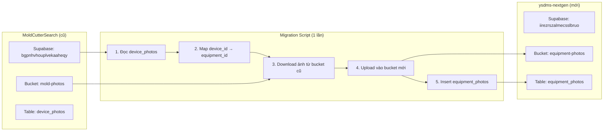
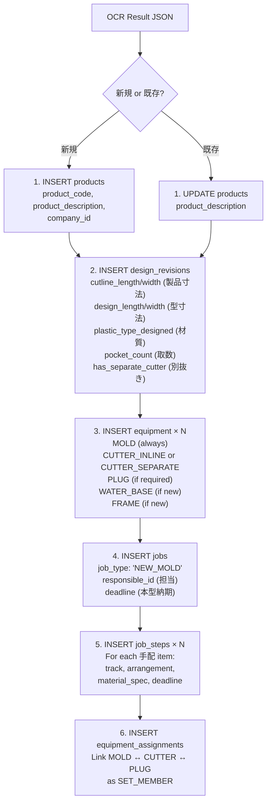
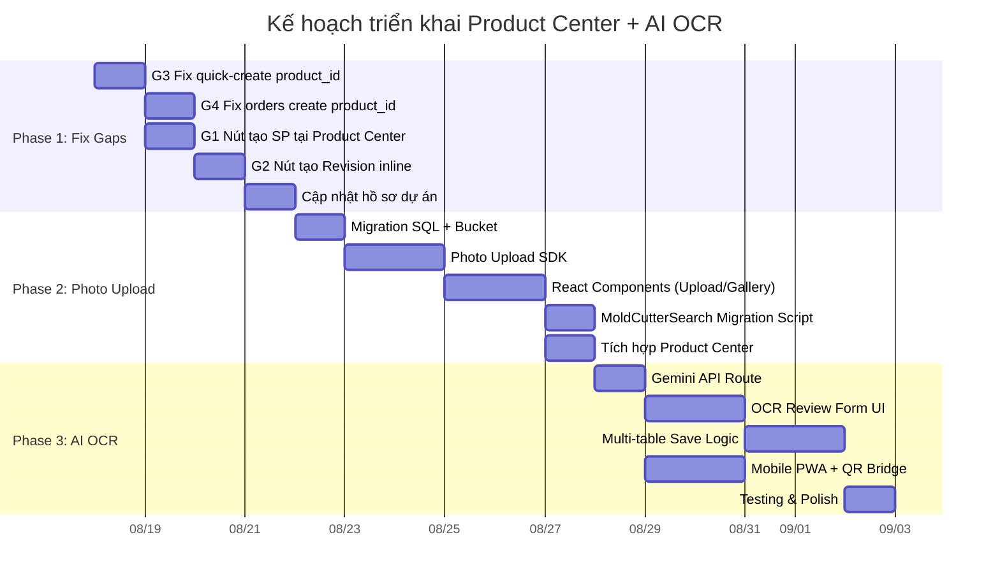

# Kế Hoạch Triển Khai Chi Tiết — Product Center + AI Photo OCR
## (Phiên bản 2 — Đã cập nhật theo feedback)

> [!NOTE]
> Bản kế hoạch này đã tích hợp toàn bộ corrections từ anh Thoan:
> - ✅ Loại dao cắt mặc định: `CUTTER_INLINE` (không phải SEPARATE)
> - ✅ Kích thước khuôn trên form → `design_revisions` (không fallback equipment)
> - ✅ 品名 → `product_description` (mô tả làm việc), không phải `product_name` chính thức
> - ✅ Bucket strategy: Tạo mới + Migrate ảnh cũ
> - ✅ Gemini API key đã có
> - ✅ Thứ tự: Phase 1 → 2 → 3
> - ✅ Mobile: iPhone/Android, WiFi ổn, cần offline mode

---

## 📌 QUY TẮC NGHIỆP VỤ MỚI — Đã xác nhận & cần cập nhật vào hồ sơ dự án

### RULE-BIZ-CUTTER: Xác định loại dao cắt (BẮT BUỘC)

```
┌─────────────────────────────────────────────────────┐
│ Phiếu 工程票: 別抜き (有 / 無)                        │
│                                                     │
│   別抜き = 無 (Mặc định)                              │
│   → equipment_type = 'CUTTER_INLINE'                │
│   → Dao cắt tích hợp trên máy định hình (ILLIG)    │
│   → design_revisions.has_separate_cutter = FALSE    │
│                                                     │
│   別抜き = 有                                         │
│   → equipment_type = 'CUTTER_SEPARATE'              │
│   → Dao cắt dập rời trên máy Press riêng            │
│   → design_revisions.has_separate_cutter = TRUE     │
│   → Cần thêm công đoạn: プレス → 別抜き検査          │
└─────────────────────────────────────────────────────┘
```

| Loại | equipment_type | Máy sử dụng | Khi nào dùng |
|------|---------------|-------------|-------------|
| **Inline (mặc định)** | `CUTTER_INLINE` | Máy định hình ILLIG/Asano | Khay tiêu chuẩn, dung sai thông thường |
| **Separate (別抜き)** | `CUTTER_SEPARATE` | Máy dập thủy lực (Press) | Biên dạng phức tạp, dung sai khắt khe |

### RULE-BIZ-NAME: Phân biệt các trường tên sản phẩm

| Trường DB | Mục đích | Nguồn dữ liệu | Thường có dữ liệu? |
|-----------|----------|----------------|---------------------|
| `product_description` | Mô tả làm việc / tên tạm do KD đặt trong quá trình thương thảo | Nhân viên KD nhập khi tạo sản phẩm | ✅ Luôn có |
| `product_name` | Tên chính thức trên chứng từ (hóa đơn, hợp đồng) | Từ chứng từ khách hàng, bổ sung sau | ❌ Thường trống ban đầu |
| `product_name_internal` | Mã nội bộ YSD có gạch ngang (ADY-071) | Hệ thống auto-gen | ✅ Luôn có |
| `product_code` | Mã nội bộ YSD compact (ADY071) | Hệ thống auto-gen | ✅ Luôn có |
| `customer_product_name` | Tên/mã part khách hàng gọi hàng ngày | Từ KH hoặc bản vẽ | ⚠️ Tùy trường hợp |

> [!IMPORTANT]
> **品名 trên phiếu 工程票** → Map vào `product_description` (mô tả sản phẩm)
> Đây là tên do nhân viên KD tự xác định, **KHÔNG phải** tên chính thức trên chứng từ.
> `product_name` (tên chính thức) sẽ được bổ sung sau khi nhận chứng từ từ KH.

---

## PHASE 1: Fix Workflow Gaps (Ưu tiên cao nhất — 2-3 ngày)

### Task 1.1: [G3/BUG] Fix Quick Create Job đọc `product_id` từ URL

**Vấn đề đã xác nhận:**
- [SectionJobs.tsx](file:///d:/AntiGravity_Workspace/apps/ysdms-nextgen/src/app/product-center/[id]/_components/SectionJobs.tsx) và [TabJobs.tsx](file:///d:/AntiGravity_Workspace/apps/ysdms-nextgen/src/app/product-center/[id]/_components/TabJobs.tsx) truyền `?product_id=xxx`
- [quick-create/page.tsx](file:///d:/AntiGravity_Workspace/apps/ysdms-nextgen/src/app/equipment/jobs/quick-create/page.tsx) chỉ đọc `editJobId`, **bỏ qua `product_id`**

**Sửa cần làm:**
```typescript
// Trong quick-create/page.tsx
const searchParams = useSearchParams()
const editJobIdParam = searchParams.get('editJobId')
const productIdParam = searchParams.get('product_id')  // ← THÊM MỚI

// Khi có productIdParam → auto-fetch product info
useEffect(() => {
  if (productIdParam && !editJobIdParam) {
    // Fetch product + company + latest design_revision
    // Auto-populate: companyId, productCode, productName, revision specs
  }
}, [productIdParam])
```

**Kết quả mong đợi:** Từ Product Center bấm `+ Thêm Job` → trang quick-create tự điền sẵn:
- Khách hàng (Company)
- Mã sản phẩm + Tên mô tả
- Thông số thiết kế từ revision mới nhất
- User chỉ cần nhập thông tin Job (loại, deadline, phụ trách)

---

### Task 1.2: [G4] Fix Orders Create đọc `product_id`

**Sửa:** Cập nhật `/orders/create` đọc `?product_id=...` → auto-add 1 order line với product đã chọn.

---

### Task 1.3: [G1] Thêm nút Tạo Sản phẩm tại Product Center

**Sửa:** Thêm nút `+ 新規製品` trên header `/product-center/page.tsx` → mở modal tạo nhanh (reuse logic từ `/master/products`).

---

### Task 1.4: [G2] Thêm nút Tạo Revision inline

**Sửa:** Thêm nút `+ 新規リビジョン` trong `TabDesignsEquipment.tsx` → mở modal tạo revision với `product_id` đã biết.

---

### Task 1.5: [G5] Fix Orders list đọc `product_id` filter

**Sửa:** `/orders/page.tsx` đọc `?product_id=...` từ URL → auto-filter danh sách.

---

### Task 1.6: Cập nhật Hồ sơ Dự án

Ghi RULE-BIZ-CUTTER và RULE-BIZ-NAME vào:
- `SCHEMA_REFERENCE.md` — Bổ sung `customer_product_name` vào bảng products
- `AI_SYSTEM_RULES.md` — Thêm RULE-BIZ-CUTTER
- `docs/technical/01_business_process.md` — Bổ sung logic xác định loại dao cắt
- Sổ cái dự án `ysdms-nextgen_MASTER.md`

---

## PHASE 2: Supabase Storage + Photo Upload (3-4 ngày)

### Task 2.1: Tạo Storage Bucket trên Supabase

```sql
-- Migration file: YYYYMMDD_xxx_create_equipment_photos.sql

-- 1. Tạo bucket (chạy qua Supabase Dashboard hoặc API)
-- Bucket: equipment-photos, Private, 10MB max, JPEG/PNG/WebP only

-- 2. Tạo bảng metadata
CREATE TABLE IF NOT EXISTS equipment_photos (
  id UUID PRIMARY KEY DEFAULT gen_random_uuid(),

  -- Links (tất cả nullable vì ảnh có thể chưa link)
  equipment_id UUID REFERENCES equipment(equipment_id) ON DELETE SET NULL,
  product_id UUID REFERENCES products(product_id) ON DELETE SET NULL,
  design_revision_id UUID REFERENCES design_revisions(revision_id) ON DELETE SET NULL,
  job_id UUID REFERENCES jobs(job_id) ON DELETE SET NULL,

  -- Photo classification
  photo_type TEXT NOT NULL DEFAULT 'general',
    -- 'manufacturing_sheet' (工程票)
    -- 'equipment_photo' (ảnh thiết bị)
    -- 'product_photo' (ảnh sản phẩm/khay)
    -- 'inspection' (ảnh kiểm tra)
    -- 'general'

  -- Storage paths
  bucket_id TEXT NOT NULL DEFAULT 'equipment-photos',
  storage_path TEXT NOT NULL,
  thumb_storage_path TEXT,
  original_filename TEXT,
  file_size BIGINT,
  mime_type TEXT,

  -- OCR specific
  ocr_status TEXT DEFAULT 'none',
    -- 'none', 'processing', 'completed', 'failed'
  ocr_result JSONB,       -- Full Gemini structured response
  ocr_confidence NUMERIC(3,2),  -- 0.00 - 1.00

  -- Lifecycle
  state TEXT NOT NULL DEFAULT 'active',
    -- 'active', 'inbox' (chưa gắn mã), 'trash', 'purged'
  is_thumbnail BOOLEAN DEFAULT false,

  -- Audit
  uploaded_by UUID REFERENCES employees(employee_id),
  batch_id TEXT,           -- Mã lô upload
  notes TEXT,

  -- Timestamps
  created_at TIMESTAMPTZ DEFAULT NOW(),
  updated_at TIMESTAMPTZ DEFAULT NOW(),
  deleted_at TIMESTAMPTZ,

  -- Migration tracking
  migrated_from TEXT       -- 'moldcuttersearch' nếu migrate từ project cũ
);

-- Indexes
CREATE INDEX idx_eq_photos_product ON equipment_photos(product_id);
CREATE INDEX idx_eq_photos_equipment ON equipment_photos(equipment_id);
CREATE INDEX idx_eq_photos_type ON equipment_photos(photo_type);
CREATE INDEX idx_eq_photos_state ON equipment_photos(state) WHERE state = 'active';
CREATE INDEX idx_eq_photos_ocr ON equipment_photos(ocr_status) WHERE ocr_status != 'none';

-- RLS
ALTER TABLE equipment_photos ENABLE ROW LEVEL SECURITY;
CREATE POLICY "Authenticated read" ON equipment_photos FOR SELECT TO authenticated USING (true);
CREATE POLICY "Authenticated insert" ON equipment_photos FOR INSERT TO authenticated WITH CHECK (true);
CREATE POLICY "Authenticated update" ON equipment_photos FOR UPDATE TO authenticated USING (true);
CREATE POLICY "Authenticated delete" ON equipment_photos FOR DELETE TO authenticated USING (true);
```

---

### Task 2.2: Photo Upload SDK — `lib/supabase/equipmentPhotoStore.ts`

Tái sử dụng logic từ MoldCutterSearch `device-photo-store.js`:

```typescript
// Các function chính cần implement:
export class EquipmentPhotoStore {
  // Upload
  async uploadPhotos(files: File[], options: UploadOptions): Promise<PhotoRecord[]>
  async makeSmallThumbnail(file: File, maxSize: number): Promise<Blob>

  // Read
  async getPhotosByEquipment(equipmentId: string): Promise<PhotoRecord[]>
  async getPhotosByProduct(productId: string): Promise<PhotoRecord[]>
  async createSignedUrls(paths: string[], expiresIn: number): Promise<SignedUrl[]>

  // Manage
  async setThumbnail(photoId: string): Promise<void>
  async moveToTrash(photoId: string): Promise<void>
  async transferPhotos(photoIds: string[], targetEquipmentId: string): Promise<void>
}
```

---

### Task 2.3: React Components — Photo Upload & Gallery

| Component | Mô tả | Tái sử dụng từ MCS |
|-----------|--------|---------------------|
| `usePhotoCapture()` | Hook: camera stream, canvas editor, resize/compress | `photo-upload.js` camera logic |
| `<PhotoUploadZone />` | Drag & drop + Camera + File input | `photo-upload.js` UI |
| `<PhotoEditor />` | Xoay, lật, cắt ảnh (Canvas-based) | `photo-upload.js` editor |
| `<PhotoGallery />` | Grid view + Lightbox + Thumbnail select | `photo-manager.js` |
| `useSignedUrls()` | Hook: Cache signed URLs với TTL 20 phút | `device-photo-store.js` caching |

---

### Task 2.4: Migration ảnh từ MoldCutterSearch



**Mapping `device_type` → `equipment_type`:**
| MCS `device_type` | YSDMS `equipment_type` |
|---|---|
| `mold` | `MOLD` |
| `cutter` | `CUTTER_INLINE` hoặc `CUTTER_SEPARATE` (check `has_separate_cutter`) |
| `tray` | Link to `products` thay vì equipment |
| `rack` | Không migrate (metadata riêng) |

---

### Task 2.5: Tích hợp vào Product Center

Thêm section "📷 Photos" vào `TabOverview.tsx` hoặc Tab mới:
- Upload ảnh thiết bị / sản phẩm
- Xem gallery ảnh đã có
- Nút "📄 Upload 工程票" → trigger Phase 3 OCR flow

---

## PHASE 3: AI OCR — Gemini Integration (3-4 ngày)

### Task 3.1: Cấu hình Gemini API Key

```bash
# File: .env.local (đã có sẵn)
# Thêm dòng này:
GOOGLE_GEMINI_API_KEY=your_api_key_here
```

> [!TIP]
> Anh chỉ cần thêm API key vào file `.env.local` tại thư mục gốc dự án. Key sẽ chỉ được dùng server-side (API Route), không bao giờ expose ra client.

---

### Task 3.2: API Route — OCR Extract

#### File: `src/app/api/ocr/extract/route.ts`

```typescript
import { GoogleGenerativeAI } from '@google/generative-ai'
import { createClient } from '@/lib/supabase/server'

export async function POST(request: Request) {
  const { storagePath } = await request.json()

  // 1. Tạo signed URL cho ảnh
  const supabase = await createClient()
  const { data: signedUrl } = await supabase.storage
    .from('equipment-photos')
    .createSignedUrl(storagePath, 300)

  // 2. Download ảnh → base64
  const imageResponse = await fetch(signedUrl.signedUrl)
  const imageBuffer = await imageResponse.arrayBuffer()
  const base64Image = Buffer.from(imageBuffer).toString('base64')

  // 3. Gọi Gemini
  const genAI = new GoogleGenerativeAI(process.env.GOOGLE_GEMINI_API_KEY!)
  const model = genAI.getGenerativeModel({ model: 'gemini-2.0-flash' })

  const result = await model.generateContent([
    { text: EXTRACTION_PROMPT },  // Prompt chi tiết bên dưới
    { inlineData: { mimeType: 'image/jpeg', data: base64Image } }
  ])

  const extracted = JSON.parse(result.response.text())

  // 4. Cập nhật OCR status trong DB
  await supabase.from('equipment_photos')
    .update({ ocr_status: 'completed', ocr_result: extracted, ocr_confidence: extracted.confidence })
    .eq('storage_path', storagePath)

  return Response.json(extracted)
}
```

---

### Task 3.3: Gemini Prompt — Đã cập nhật theo business rules

```typescript
const EXTRACTION_PROMPT = `
あなたは金型製造の工程票（新規金型製造工程票）を読み取るAIです。
画像から各フィールドを正確に抽出し、以下のJSON形式で返してください。

重要な業務ルール:
1. 「カッター」のデフォルトは「CUTTER_INLINE」（インライン抜型）
2. 「別抜き」欄が「有」の場合のみ「CUTTER_SEPARATE」（別抜型）
3. 型寸法は設計仕様（design spec）であり、物理的な寸法ではない
4. 品名は作業用の説明名であり、正式な製品名ではない

出力JSON:
{
  "confidence": 0.0-1.0,
  "product": {
    "model_number": "型番 (例: TOW-009)",
    "description": "品名 — 作業用の製品説明",
    "material_full": "材質の全文そのまま",
    "product_dimensions": { "length_mm": number, "width_mm": number },
    "mold_dimensions": { "length_mm": number, "width_mm": number },
    "cavity_count": number,
    "author": "記入者",
    "date": "YYYY-MM-DD",
    "shipping_sample_count": "出荷サンプル数のテキスト"
  },
  "equipment": {
    "plug": { "required": boolean },
    "cutter": {
      "required": true,
      "type": "CUTTER_INLINE or CUTTER_SEPARATE",
      "is_new": boolean
    },
    "water_base": { "required": true, "is_new": boolean },
    "frame": { "required": true, "is_new": boolean }
  },
  "separate_cutting": {
    "enabled": boolean,
    "comment": "別抜きの有無。有ならCUTTER_SEPARATE"
  },
  "arrangements": [
    {
      "item": "アルミ材|プラグ|カッター|水冷盤材|枠",
      "required": boolean,
      "deadline": "YYYY-MM-DD or null",
      "deadline_day_of_week": "月|火|水|木|金|土|日 or null"
    }
  ],
  "mold_manufacturing": {
    "responsible_person": "担当者名",
    "location": "社内 or 外注",
    "deadline": "YYYY-MM-DD or null"
  },
  "forming": {
    "responsible_person": "担当者名",
    "location": "社内 or 外注",
    "ship_deadline": "YYYY-MM-DD or null",
    "ship_quantity": "string or null"
  },
  "tolerances": {
    "x": { "nominal_mm": number, "tolerance": "±number" },
    "y": { "nominal_mm": number, "tolerance": "±number" }
  },
  "packaging": {
    "destination": "送り先テキスト",
    "separate_cutting_flag": boolean,
    "box_type": "string or null",
    "bagging_required": boolean,
    "label_type": "無地 or 印刷",
    "quotation_attached": boolean,
    "pieces_per_box": number_or_null
  },
  "handwritten_notes": "その他手書きメモやコメント"
}

注意:
- 手書き文字を正確に読み取ること
- 丸印（○）で囲まれた選択肢を検出し、選ばれた方を返すこと
- 判読できない場合はnullを返すこと
- 数値は必ずnumber型にすること
- 日付は記載年度を推定し YYYY-MM-DD形式にすること
`;
```

---

### Task 3.4: OCR → DB Mapping (Multi-table Insert)



**Mapping chi tiết OCR fields → DB columns:**

| OCR Field | DB Insert | Table.Column |
|-----------|-----------|--------------|
| `product.model_number` | Parse: bỏ `-` → `product_code`, giữ `-` → `product_name_internal` | `products` |
| `product.description` (品名) | → `product_description` | `products` |
| `product.material_full` | → `plastic_type_designed` | `design_revisions` |
| `product.product_dimensions.length_mm` | → `cutline_length` | `design_revisions` |
| `product.product_dimensions.width_mm` | → `cutline_width` | `design_revisions` |
| `product.mold_dimensions.length_mm` | → `design_length` | `design_revisions` |
| `product.mold_dimensions.width_mm` | → `design_width` | `design_revisions` |
| `product.cavity_count` | → `pocket_count` | `design_revisions` |
| `separate_cutting.enabled` | → `has_separate_cutter` | `design_revisions` |
| `equipment.cutter.type` | → `equipment_type` (`CUTTER_INLINE` / `CUTTER_SEPARATE`) | `equipment` |
| `mold_manufacturing.responsible_person` | → lookup `employees` → `responsible_id` | `jobs` |
| `mold_manufacturing.deadline` | → `deadline` | `jobs` |
| `forming.ship_deadline` | → `ship_date` (hoặc tạo `order_lines`) | `jobs` / `order_lines` |
| `arrangements[].required` | → `arrangement` ('REQUIRED'/'NOT_REQUIRED') | `job_steps` |
| `arrangements[].deadline` | → `deadline` | `job_steps` |
| `tolerances.x/y` | → `notes` (hoặc custom tolerance fields) | `design_revisions` |

---

### Task 3.5: UI Component — Manufacturing Sheet OCR Review Form

```
┌──────────────────────────────────────────────────────────────┐
│ 📄 工程票 AI読取 — Manufacturing Sheet OCR                     │
├──────────────────────────────────────────────────────────────┤
│                                                              │
│  ┌─────────────────┐  ┌──────────────────────────────────┐  │
│  │                 │  │ 📊 抽出結果 (Confidence: 92%)     │  │
│  │   [ảnh 工程票]   │  │                                  │  │
│  │   (zoom/pan)    │  │ 型番:   [TOW-009        ] ✅      │  │
│  │                 │  │ 品名:   [VARANUS向け... ] ✅      │  │
│  │                 │  │ 材質:   [PP7.5 0.6mm...] ✅      │  │
│  │                 │  │ 製品寸法: [321] × [254  ] ✅      │  │
│  │                 │  │ 型寸法:   [590] × [350  ] ✅      │  │
│  │                 │  │ 取数:   [2            ] ✅       │  │
│  │                 │  │                                  │  │
│  │                 │  │ ── 設備 ──                        │  │
│  │                 │  │ プラグ:   [有 ▼] ✅               │  │
│  │                 │  │ カッター: [INLINE ▼] ✅            │  │
│  │                 │  │ 別抜き:   [無 ▼] ✅               │  │
│  │                 │  │ 水冷盤:   [既存 ▼] ✅              │  │
│  │                 │  │ 枠:      [既存 ▼] ✅              │  │
│  │                 │  │                                  │  │
│  │                 │  │ ── 手配 ──                        │  │
│  │                 │  │ アルミ材: [要] 納期[08/06] ✅      │  │
│  │                 │  │ プラグ:   [要] 納期[08/26] ✅      │  │
│  │                 │  │ カッター: [要] 納期[08/26] ✅      │  │
│  │                 │  │                                  │  │
│  │                 │  │ ── 金型製造 ──                     │  │
│  │                 │  │ 担当: [遠藤 ▼]  納期[08/26] ⚠️   │  │
│  │                 │  │                                  │  │
│  │                 │  │ ── 成形 ──                        │  │
│  │                 │  │ 出荷納期: [08/28] ✅               │  │
│  └─────────────────┘  │                                  │  │
│                        │ [✅ 確認して保存] [🔄 再読取]     │  │
│                        └──────────────────────────────────┘  │
└──────────────────────────────────────────────────────────────┘

Legend: ✅ High confidence  ⚠️ Low confidence (cần kiểm tra)  ❌ Không đọc được
```

**Tính năng form:**
- Side-by-side: Ảnh gốc (trái, zoom/pan) + Form extracted (phải)
- Highlight confidence: Xanh (>0.8), Vàng (0.5-0.8), Đỏ (<0.5)
- Mỗi trường editable — user chỉnh sửa trước khi save
- Nút "再読取" (Re-extract) nếu kết quả sai
- Nút "確認して保存" → trigger multi-table insert (Task 3.4)

---

### Task 3.6: Mobile & PWA Support

#### PWA Configuration
```json
// public/manifest.json
{
  "name": "YSDMS NextGen",
  "short_name": "YSDMS",
  "start_url": "/product-center",
  "display": "standalone",
  "orientation": "portrait",
  "theme_color": "#0D9488",
  "icons": [...]
}
```

#### Camera Input (Mobile-first)
```html
<!-- Tự động mở camera trên mobile -->
<input type="file" accept="image/*" capture="environment" />

<!-- Hoặc dùng getUserMedia cho webcam rời trên PC -->
<video id="camera-preview" autoplay playsinline />
```

#### QR Bridge (PC → Mobile)
```
PC hiển thị QR code → Mobile quét → Mở trang upload trên mobile
→ Chụp ảnh → Upload → PC nhận kết quả real-time qua Supabase Realtime
```

#### Offline Support (Service Worker)
- Cache ảnh đã chụp khi offline
- Queue upload requests
- Sync khi có mạng trở lại
- Dùng Workbox (thư viện PWA của Google)

---

## Tổng Hợp Timeline



**Tổng thời gian ước tính: ~12-15 ngày làm việc**

---

## Checklist xác nhận trước khi bắt đầu

- [x] Gemini API Key: Đã có → thêm vào `.env.local`
- [x] Bucket strategy: Tạo mới `equipment-photos` + migrate ảnh cũ
- [x] OCR scope: Bắt đầu với 新規金型製造工程票
- [x] Phase order: 1 → 2 → 3
- [x] Cutter rule: INLINE mặc định, SEPARATE khi 別抜き=有
- [x] Mobile: iPhone/Android, WiFi ổn, cần offline mode
- [ ] **Cần anh xác nhận**: Kế hoạch tổng thể này OK để bắt đầu Phase 1?
