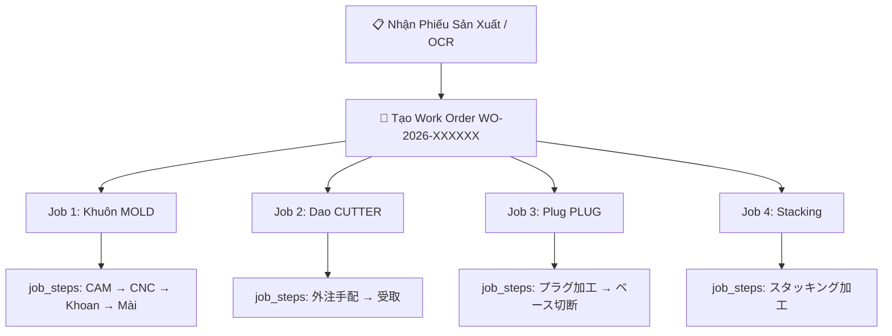

# 📋 Phân Tích Kiến Trúc: Quản lý Job / Equipment / Work Order & Vấn đề Lọc Lịch Sản Xuất

> **Ngày phân tích:** 2026-08-18
> **Người yêu cầu:** Anh Thoan
> **Trạng thái:** Chờ phê duyệt

---

## 1. VẤN ĐỀ GỐC: Job OOT-046 không hiển thị khi thêm hạng mục スタッキング (deadline 8/17)

### 🔍 Nguyên nhân kỹ thuật (Root Cause)

Trang **Lịch sản xuất** (`/equipment/schedule`) hiện tại sử dụng bộ lọc ngày **CHỈ dựa trên 4 trường của bảng `jobs`**:

```typescript
// src/app/actions/mold-job.ts (dòng 407-410)
req = req.or(`
  and(mold_deadline.gte.${fromDate},mold_deadline.lte.${toDateEnd}),
  and(deadline.gte.${fromDate},deadline.lte.${toDateEnd}),
  and(start_date.gte.${fromDate},start_date.lte.${toDateEnd}),
  and(ship_date.gte.${fromDate},ship_date.lte.${toDateEnd})
`)
```

**Vấn đề:** Khi job OOT-046 được tạo từ lâu, các trường `mold_deadline`, `deadline`, `start_date`, `ship_date` **của Job** đều nằm ngoài phạm vi lọc hiện tại (tuần 18/8). Dù bạn vừa thêm hạng mục スタッキング với `job_steps.deadline = 2026-08-17`, hệ thống **KHÔNG kiểm tra `job_steps.deadline`** khi lọc — do đó job bị ẩn.

> [!IMPORTANT]
> Đây là một lỗ hổng trong logic filter: Khi thêm công đoạn mới với deadline gần cho một job cũ, job đó "biến mất" khỏi lịch sản xuất hiện tại.

---

## 2. GIẢI PHÁP CHO BỘ LỌC LỊCH SẢN XUẤT

### Phương án đề xuất: Mở rộng bộ lọc để bao gồm `job_steps.deadline`

> [!TIP]
> **Khuyến nghị:** Hiển thị job nếu **BẤT KỲ hạng mục nào** (`job_steps.deadline`) nằm trong phạm vi lọc. Đây là cách tự nhiên nhất vì người dùng cần biết "tuần này có công đoạn nào cần làm?"

**Cách triển khai (2-Pass Query — Không cần migration DB):**

```typescript
// Bước 1: Lấy job_ids có step.deadline trong phạm vi
const { data: stepJobIds } = await supabase
  .from('job_steps')
  .select('job_id')
  .gte('deadline', fromDate)
  .lte('deadline', toDateEnd)

// Bước 2: Merge vào filter OR chính
const extraJobIds = [...new Set(stepJobIds?.map(s => s.job_id) || [])]
if (extraJobIds.length > 0) {
  req = req.or(`job_id.in.(${extraJobIds.join(',')}),and(mold_deadline.gte...`)
}
```

Ngoài ra, khi thêm/sửa `job_steps`, tự động cập nhật `jobs.deadline = MAX(job_steps.deadline)` để đảm bảo tương thích.

---

## 3. PHÂN TÍCH: TẠO JOB MỚI TÁCH RỜI HAY THÊM STEP VÀO JOB CŨ?

### Câu hỏi cốt lõi từ Anh Thoan:
> *"Nếu tạo một job riêng tách rời job cũ, tức là tương đương với tạo một chỉ thị mới thì có phù hợp không?"*

### Nguyên tắc kiến trúc đã phê duyệt (Option C — 2026-08-10):

```
1 Job = 1 Thiết bị vật lý (equipment)
1 Work Order = N Jobs (cho N thiết bị khác nhau)
```

| Tình huống | Cách xử lý chuẩn |
|---|---|
| **Chế tạo thiết bị MỚI** (VD: スタッキング mới cho sản phẩm X) | Tạo bản ghi `equipment` mới → Tạo `job` mới → Gắn vào Work Order hiện có hoặc tạo WO mới |
| **Sửa chữa / Cải tạo thiết bị ĐÃ CÓ** | Dùng lại `equipment` cũ → Tạo `job` mới (category `MOLD_MODIFY`) → Có thể gắn vào WO mới |
| **Thêm công đoạn gia công cho job đang chạy** | Thêm `job_steps` mới vào job hiện tại (cùng thiết bị) |

### Phân tích cụ thể cho tình huống OOT-046 + スタッキング:

**Job OOT-046** hiện tại gắn với **1 khuôn vật lý** (equipment_type = `MOLD`). Nhưng bên trong nó có các step cho nhiều loại thiết bị khác: 金型, プラグ, 切り, スタッキング.

Đây là **cấu trúc dữ liệu cũ (Legacy)** — trước khi áp dụng mô hình Option C, mọi thiết bị liên quan đều được nhồi vào 1 job duy nhất.

---

### 3 Kịch bản xử lý chuẩn mực:

### Kịch bản A: Tạo mới thiết bị theo Chỉ thị mới (新規製作)



- Mỗi thiết bị = 1 Job riêng biệt với `jobs.equipment_id` trỏ đúng.
- Tất cả jobs gom nhóm dưới 1 Work Order.
- **Không xung đột** với luồng nghiệp vụ hiện tại.

---

### Kịch bản B: Sửa chữa / Bổ sung thiết bị cho Chỉ thị cũ (追加・修理)

- Thêm Job mới vào Work Order đã tồn tại.
- Job mới có `work_order_id` trỏ về WO cũ → hiển thị gom nhóm trên Gantt.
- **Không ảnh hưởng** các jobs khác trong WO.

---

### Kịch bản C: Xử lý Job Legacy (dữ liệu cũ chưa có Work Order)

> [!WARNING]
> Đây là tình huống phức tạp nhất — job OOT-046 thuộc dạng này.

**Thực trạng:** ~1,183 jobs cũ có `work_order_id = NULL`, mỗi job chứa **nhiều loại thiết bị** trong `job_steps` (MOLD + PLUG + CUTTER + STACKING gộp chung).

**2 lựa chọn:**

#### Lựa chọn C1 — Giữ nguyên Job cũ, chỉ sửa Filter (Khuyến nghị ngắn hạn) ⭐
- **KHÔNG tách Job cũ** — quá rủi ro mất dữ liệu nhật ký đã gắn.
- **Sửa bộ lọc** để bao gồm `job_steps.deadline` → Job OOT-046 tự động hiển thị khi スタッキング có deadline trong phạm vi.
- **Khi thêm hạng mục mới** vào Job cũ → cập nhật `jobs.deadline = MAX(job_steps.deadline)` tự động.
- **Ưu điểm:** An toàn, không ảnh hưởng dữ liệu, triển khai nhanh.
- **Nhược điểm:** Không tuân thủ 100% mô hình "1 Job = 1 Equipment".

#### Lựa chọn C2 — Tạo Job mới tách rời (Chuẩn mực dài hạn)
- Tạo 1 Job mới cho スタッキング với `equipment_id` trỏ đúng thiết bị Stacking.
- Job mới có `work_order_id = NULL` (standalone) hoặc tạo WO mới.
- **Ưu điểm:** Tuân thủ 100% kiến trúc Option C.
- **Nhược điểm:** スタッキング tách rời khỏi OOT-046, người dùng có thể bối rối khi 2 job cùng sản phẩm nhưng hiển thị riêng biệt.

---

## 4. MA TRẬN TƯƠNG THÍCH CŨ - MỚI

| Dữ liệu | Đặc điểm | Xử lý trên Schedule Board |
|---|---|---|
| **Job Legacy** (`work_order_id = NULL`, multi-equipment steps) | ~1,183 jobs cũ từ Access CSV | Hiển thị như Level 1 độc lập, steps gom theo Track (MOLD/PLUG/CUTTER...) |
| **Job Standalone mới** (`work_order_id = NULL`, single equipment) | Job tạo thủ công, chưa gắn WO | Hiển thị như Level 1 độc lập |
| **Job trong Work Order** (`work_order_id != NULL`) | Job theo mô hình Option C | Hiển thị gom nhóm dưới Work Order (Level 1 = WO, Level 2 = Job) |

> [!NOTE]
> Hệ thống đã xử lý tốt backward compatibility: `jobs.work_order_id` là **NULLABLE**. Cả 3 loại job đều hiển thị đúng trên Gantt chart nhờ logic phân nhánh trong `MoldJobGantt.tsx`.

---

## 5. KHUYẾN NGHỊ HÀNH ĐỘNG

### Ưu tiên 1 (Ngắn hạn — Sửa ngay):
- [ ] **Sửa bộ lọc `getJobsForGantt()`**: Thêm điều kiện lọc theo `job_steps.deadline` (2-Pass Query).
- [ ] **Tự động cập nhật `jobs.deadline`**: Khi thêm/sửa `job_steps`, tự động set `jobs.deadline = MAX(job_steps.deadline)`.

### Ưu tiên 2 (Trung hạn):
- [ ] **Khi tạo thiết bị MỚI** (từ Quick Create hoặc OCR): Luôn tạo Job riêng biệt cho từng equipment, gom vào Work Order.
- [ ] **Khi thêm hạng mục cho Job cũ**: Cho phép thêm step bình thường (giữ tương thích), nhưng hiển thị cảnh báo khuyến khích tạo Job mới nếu thiết bị khác loại.

### Ưu tiên 3 (Dài hạn — Phase 2):
- [ ] Migration script: Tách các Job Legacy multi-equipment thành nhiều Jobs đơn lẻ, mỗi Job gắn 1 equipment. Cần backup + verify nhật ký (`work_logs`) không bị mất.

---

## 6. CÂU HỎI CHỜ PHÊ DUYỆT

> [!IMPORTANT]
> **Q1:** Anh Thoan đồng ý phương án nào cho vấn đề OOT-046?
> - **(A)** Sửa bộ lọc + giữ nguyên Job cũ (nhanh, an toàn) ⭐
> - **(B)** Tạo Job mới tách rời cho スタッキング (chuẩn kiến trúc)
> - **(C)** Cả hai: Sửa filter (A) ngay + Tạo Job mới (B) cho các trường hợp mới từ bây giờ

> [!IMPORTANT]
> **Q2:** Khi thêm hạng mục mới vào Job cũ, có nên tự động cập nhật `jobs.deadline = MAX(job_steps.deadline)` không?
> - **(A)** Có — tự động cập nhật luôn
> - **(B)** Không — giữ deadline Job gốc, chỉ sửa filter
