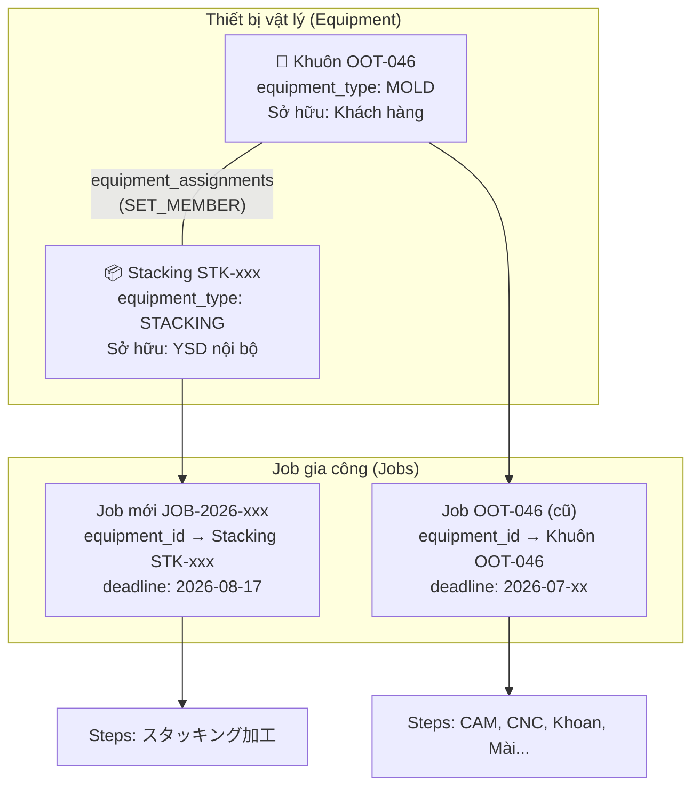

# 📋 Kế Hoạch Triển Khai: Sửa Filter Lịch Sản Xuất & Tạo Job Tách Rời Cho Thiết Bị Mới

> **Ngày:** 2026-08-18  
> **Quyết định:** Anh Thoan chọn **C2** — Tạo Job mới tách rời + Sửa bộ lọc tương thích dữ liệu cũ  
> **Trạng thái:** Chờ phê duyệt kế hoạch chi tiết

---

## 1. LÀM RÕ QUAN HỆ DỮ LIỆU: Tại sao cần tách Job?

### ❌ Mô hình Legacy hiện tại (SAI — nhưng vẫn tồn tại trong dữ liệu cũ):
```
Equipment: Khuôn OOT-046 (equipment_type = MOLD)
  └── Job OOT-046 (equipment_id → Khuôn OOT-046)
        ├── Step: 金型 (track: MOLD) — gia công khuôn
        ├── Step: プラグ (track: PLUG) — gia công plug
        ├── Step: 切り (track: CUTTER) — đặt dao cắt
        └── Step: スタッキング (track: ???) — gia công stacking  ← ⚠️ Nhồi nhét!
```

**Vấn đề:** 1 Job gắn với 1 Khuôn nhưng chứa công đoạn cho 4 loại thiết bị khác nhau. スタッキング không phải là một phần của khuôn OOT-046 — nó là một thiết bị vật lý hoàn toàn riêng biệt.

---

### ✅ Mô hình chuẩn Option C (ĐÚNG):

```
Equipment: Khuôn OOT-046 (equipment_type = MOLD, company_id = Khách hàng)
Equipment: Stacking STK-xxx (equipment_type = STACKING, company_id = YSD nội bộ)
  ↕
equipment_assignments: OOT-046 (primary) ↔ STK-xxx (related), type = SET_MEMBER

Job cũ: OOT-046 (equipment_id → Khuôn OOT-046)
  ├── Step: 裏面プログラム
  ├── Step: 裏面加工
  └── ... (chỉ chứa các công đoạn gia công KHUÔN)

Job mới: JOB-2026-XXXXXX (equipment_id → Stacking STK-xxx)  ← ĐÂY!
  └── Step: スタッキング加工 (deadline: 2026-08-17)
```

> [!IMPORTANT]
> **Điểm mấu chốt:** Stacking **KHÔNG PHẢI** là OOT-046. Stacking là một thiết bị riêng biệt (STK-xxx) thuộc sở hữu nội bộ YSD. Job mới gắn với **thiết bị Stacking**, không phải với khuôn OOT-046.
> 
> Quan hệ giữa khuôn OOT-046 và Stacking STK-xxx được quản lý qua bảng `equipment_assignments` (bộ gá lắp SET_MEMBER) — cho biết "khuôn này dùng thiết bị stacking này khi chạy sản xuất."

### Cây quan hệ chuẩn mực:



---

## 2. KẾ HOẠCH TRIỂN KHAI

### Phase A: Sửa bộ lọc lịch sản xuất (Ưu tiên cao nhất)

#### [MODIFY] [`mold-job.ts`](file:///D:/AntiGravity_Workspace/apps/ysdms-nextgen/src/app/actions/mold-job.ts)

**Thay đổi:** Trong hàm `getJobsForGantt()`, thêm 2-Pass Query để bao gồm các Job có `job_steps.deadline` nằm trong phạm vi lọc.

```typescript
// TRƯỚC (chỉ lọc theo jobs.deadline/mold_deadline/start_date/ship_date)
} else if (fromDate && toDate) {
    const toDateEnd = toDate + ' 23:59:59'
    req = req.or(`and(mold_deadline.gte...),and(deadline.gte...),...`)
}

// SAU (bổ sung lọc theo job_steps.deadline)
} else if (fromDate && toDate) {
    const toDateEnd = toDate + ' 23:59:59'

    // Pass 1: Tìm job_ids có step deadline trong phạm vi
    const { data: stepHits } = await supabase
      .from('job_steps')
      .select('job_id')
      .gte('deadline', fromDate)
      .lte('deadline', toDateEnd)

    const stepJobIds = [...new Set(stepHits?.map(s => s.job_id) || [])]

    // Pass 2: OR giữa filter cũ + job_ids từ step deadlines
    const conditions = [
      `and(mold_deadline.gte.${fromDate},mold_deadline.lte.${toDateEnd})`,
      `and(deadline.gte.${fromDate},deadline.lte.${toDateEnd})`,
      `and(start_date.gte.${fromDate},start_date.lte.${toDateEnd})`,
      `and(ship_date.gte.${fromDate},ship_date.lte.${toDateEnd})`,
    ]
    if (stepJobIds.length > 0) {
      conditions.push(`job_id.in.(${stepJobIds.join(',')})`)
    }
    req = req.or(conditions.join(','))
}
```

**Lưu ý:** KHÔNG thay đổi `jobs.deadline` — giữ nguyên deadline gốc của job.

---

### Phase B: Hỗ trợ tạo Job mới tách rời cho thiết bị khác loại

Khi người dùng muốn thêm "スタッキング" cho khuôn OOT-046, thay vì thêm step vào Job cũ, hệ thống sẽ:

1. **Tìm hoặc tạo Equipment Stacking** (trong bảng `equipment`):
   - Nếu đã có Stacking phù hợp (dùng chung theo kích thước) → liên kết.
   - Nếu chưa có → tạo mới `equipment` với `equipment_type = 'STACKING'`.

2. **Tạo Job mới** gắn với Equipment Stacking đó:
   - `equipment_id` → Stacking mới/đã có.
   - `product_id` → Cùng sản phẩm với Job cũ OOT-046.
   - `job_category` = `'EQUIPMENT_NEW'`.
   - `deadline` = Kỳ hạn do người dùng nhập (VD: 2026-08-17).

3. **Tạo `equipment_assignments`** liên kết Khuôn OOT-046 ↔ Stacking STK-xxx (`SET_MEMBER`).

4. **Tạo `job_steps`** cho Job mới (VD: `スタッキング加工`).

#### Các file cần thay đổi:

#### [MODIFY] [`EditStepModal.tsx`](file:///D:/AntiGravity_Workspace/apps/ysdms-nextgen/src/app/equipment/jobs/%5Bid%5D/tabs/EditStepModal.tsx)
- Khi bấm "+ Thêm công đoạn" trên Job Legacy, nếu track/type là STACKING, PLUG, CUTTER, WATER_BASE... → hiển thị dialog hỏi:
  - *"スタッキング là thiết bị riêng biệt. Bạn muốn:"*
  - **(A)** Tạo Job mới cho thiết bị Stacking (Khuyến nghị) ← Mở form tạo nhanh
  - **(B)** Thêm như hạng mục phụ vào Job này (Giữ tương thích cũ)

#### [MODIFY] [`MoldJobGantt.tsx`](file:///D:/AntiGravity_Workspace/apps/ysdms-nextgen/src/components/equipment/MoldJobGantt.tsx)
- Trong phần "+ 工程追加 (Thêm công đoạn cho job này)", bổ sung lựa chọn tương tự.

#### [NEW] `src/app/actions/equipment-job.ts` (hoặc mở rộng `mold-job.ts`)
- Hàm `createEquipmentJob()`:
  - Input: `{ parentEquipmentId, equipmentType, productId, stepName, deadline, estimatedHours }`
  - Logic: Tạo equipment → Job → Step → Assignment.

---

### Phase C: Không thay đổi (Giữ nguyên)

- **KHÔNG cập nhật `jobs.deadline`** khi thêm step mới — theo đúng yêu cầu.
- **KHÔNG tách các Job Legacy đã có** — quá rủi ro, giữ nguyên để tương thích.
- **Dữ liệu cũ vẫn hiển thị bình thường** trên Gantt nhờ logic phân nhánh đã có.

---

## 3. MA TRẬN TÌNH HUỐNG & CÁCH XỬ LÝ

| Tình huống | Hành động | Kết quả |
|---|---|---|
| **Tạo bộ khuôn hoàn toàn mới** (từ OCR/Quick Create) | Tạo WO → N Jobs (mỗi Job = 1 Equipment) | ✅ Tuân thủ Option C |
| **Thêm thiết bị mới cho Job cũ** (VD: thêm Stacking cho OOT-046) | Tạo Job mới tách rời + Equipment mới/dùng chung + Assignment | ✅ Tuân thủ Option C |
| **Thêm công đoạn gia công cho Job hiện tại** (VD: thêm bước Đánh bóng cho khuôn đang gia công) | Thêm `job_steps` vào Job hiện có | ✅ Cùng thiết bị → OK |
| **Sửa chữa thiết bị đã có** | Tạo Job mới (category = MOLD_MODIFY) gắn equipment cũ | ✅ Equipment giữ nguyên |
| **Job Legacy có multi-equipment steps** | Giữ nguyên, sửa filter để hiển thị đúng | ✅ Tương thích ngược |

---

## 4. VERIFICATION PLAN

### Automated Tests:
```bash
npx tsc --noEmit
node scripts/check_translations.mjs
```

### Manual Verification:
1. Truy cập `/equipment/schedule` → Verify Job OOT-046 hiển thị khi step スタッキング deadline 8/17 nằm trong phạm vi.
2. Tạo Job mới tách rời cho Stacking → Verify hiển thị trên Gantt riêng biệt.
3. Verify các Job cũ (Legacy) vẫn hiển thị đúng, không bị ảnh hưởng.

---

## 5. CÂU HỎI BỔ SUNG

> [!IMPORTANT]
> **Q1:** Đối với Stacking/Plug/Water Base... (thiết bị nội bộ YSD, dùng chung), khi tạo Job mới tách rời — Anh Thoan muốn:
> - **(A)** Hệ thống tự động gợi ý thiết bị dùng chung đã có (theo kích thước), người dùng chọn hoặc tạo mới.
> - **(B)** Luôn tạo thiết bị mới, gán quan hệ dùng chung sau.

> [!IMPORTANT]
> **Q2:** Phase A (sửa filter) có thể triển khai ngay hôm nay. Phase B (UI tạo Job tách rời) cần thêm thời gian thiết kế form. Anh Thoan muốn ưu tiên Phase A trước không?
