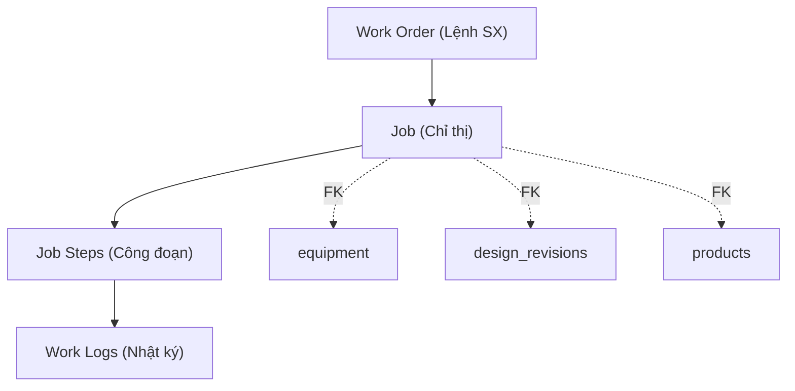
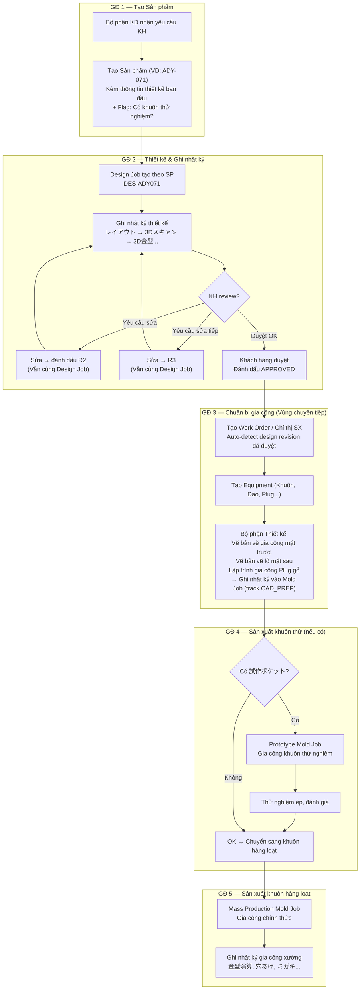

# Phân tích Toàn diện V2: Hệ thống Ghi Nhật ký Đa Bộ phận — Cập nhật theo Feedback

> **Mục tiêu**: Phân tích và đề xuất giải pháp cho hệ thống ghi nhật ký (日報/Work Logging) mở rộng từ xưởng gia công ra bộ phận thiết kế và các nghiệp vụ phát sinh khác.
> 
> **V2 — Cập nhật theo feedback Anh Thoan**: Đính chính Design Job gắn theo **sản phẩm** (không phải revision), thêm vùng chuyển tiếp thiết kế↔gia công, lọc processing codes theo bộ phận.

---

## 1. HIỆN TRẠNG & VẤN ĐỀ (Giữ nguyên từ V1)

### 1.1 Kiến trúc 3 tầng hiện tại



- `work_logs.job_id` = NOT NULL → mọi nhật ký **phải** gắn vào 1 Job
- `work_logs.job_step_id` = NULLABLE (nhưng UI yêu cầu chọn)
- Processing codes có **45 mã** trên Supabase, chưa có 8 mã chi tiết thiết kế (1-8)
- Mã `30 (設計)` đã có category `DESIGN` nhưng quá tổng hợp

### 1.2 Các vấn đề cần giải quyết (8 vấn đề — bổ sung từ V1)

| # | Vấn đề | Mức độ |
|---|--------|--------|
| 1 | Nhật ký thiết kế gắn theo **sản phẩm**, không theo revision hay equipment | 🔴 Cốt lõi |
| 2 | Vùng chuyển tiếp: Bản vẽ gia công (CAM) do thiết kế làm nhưng gắn vào khuôn vật lý | 🔴 Cốt lõi |
| 3 | Cần giao diện tạo Sản phẩm + Thiết kế trước khi có chỉ thị SX | 🟡 Quan trọng |
| 4 | 8 processing codes thiết kế chưa migrate vào Supabase | 🟡 Quan trọng |
| 5 | Dropdown 45+ codes hiển thị tất cả, gây rối — cần lọc theo bộ phận | 🟡 Quan trọng |
| 6 | Cần form quản lý processing codes (CRUD admin) | 🟢 Mới |
| 7 | Flag khuôn thử nghiệm (試作ポケット) khi tạo sản phẩm | 🟡 Quan trọng |
| 8 | Job không phát sinh từ thiết kế — xử lý linh hoạt | 🟢 Đã giải quyết |

---

## 2. LUỒNG NGHIỆP VỤ THỰC TẾ (Đính chính từ Anh Thoan)

> [!IMPORTANT]
> **Nguyên tắc cốt lõi**: Nhật ký thiết kế ghi theo **SẢN PHẨM** (để tính lương nhân công), không phải theo từng phiên bản revision. Revision chỉ là cột mốc lịch sử.

### 2.1 Quy trình thực tế 5 giai đoạn



### 2.2 Ví dụ cụ thể: Sản phẩm ADY-071

```
📦 Sản phẩm: ADY-071 (product_id = "xxx")
│
├── 🎨 Design Job: DES-ADY071 (job_category = 'DESIGN')
│   ├── Step: レイアウト                → ✅ done (nhật ký: 2026-08-01)
│   ├── Step: 3Dスキャン図面作成        → ✅ done (nhật ký: 2026-08-03)
│   ├── Step: 3D金型図面作成            → ✅ done (nhật ký: 2026-08-05)
│   │   └── note: "R1 gửi KH → KH yêu cầu sửa → R2 → KH duyệt R2"
│   ├── Step: 3Dメンテ図面作成          → ✅ done (nhật ký: 2026-08-10)
│   ├── Step: 3Dスタッキング図面作成    → ✅ done (nhật ký: 2026-08-11)
│   ├── Step: 3D試作金型作成            → ⬜ không cần (skip)
│   ├── Step: 展開図工作成              → 🔄 chờ duyệt thiết kế
│   └── Step: 表プログラム作成          → 🔄 chờ duyệt thiết kế
│
├── 📐 Design Revisions (lịch sử phiên bản):
│   ├── R1 (2026-08-05): Bản đầu tiên → KH yêu cầu sửa
│   ├── R2 (2026-08-08): Sửa theo yêu cầu → KH duyệt ✅
│   └── (R2 = phiên bản dùng sản xuất)
│
├── 🔧 Prototype Mold Job: JOB-ADY071-PROTO
│   ├── Track CAD_PREP (Thiết kế thực hiện):
│   │   ├── Step: 表プログラム作成（試作）  → nhật ký: 2026-08-15
│   │   └── Step: 裏穴図面作成（試作）      → nhật ký: 2026-08-16
│   └── Track MOLD (Xưởng thực hiện):
│       ├── Step: 試作金型演算＆加工        → nhật ký + giờ làm
│       ├── Step: 試作穴あけ                → nhật ký + giờ làm
│       └── Step: 試作ミガキ                → nhật ký + giờ làm
│
└── 🏭 Mass Mold Job: JOB-ADY071-MASS
    ├── Track CAD_PREP (Thiết kế thực hiện):
    │   ├── Step: 表プログラム作成          → nhật ký: 2026-08-20
    │   ├── Step: 裏穴図面作成              → nhật ký: 2026-08-21
    │   └── Step: プラグ木型プログラム      → nhật ký: 2026-08-22
    ├── Track MOLD (Xưởng thực hiện):
    │   ├── Step: 金型演算＆加工            → nhật ký + giờ làm
    │   ├── Step: 本型穴あけ                → nhật ký + giờ làm
    │   └── Step: 本型ミガキ                → nhật ký + giờ làm
    ├── Track PLUG:
    │   └── Step: プラグ演算＆加工          → nhật ký + giờ làm
    └── Track FINISH:
        └── Step: 金型仕上加工              → nhật ký + giờ làm
```

---

## 3. GIẢI PHÁP CHI TIẾT — PHƯƠNG ÁN A CẢI TIẾN (Recommended ✅)

### 3.1 Nguyên tắc thiết kế

| # | Nguyên tắc | Chi tiết |
|---|-----------|----------|
| 1 | **Design Job = 1 per Product** | Mỗi sản phẩm có đúng 1 Design Job, tồn tại suốt vòng đời thiết kế |
| 2 | **Revision = Cột mốc, không phải Job** | Design Revisions ghi lại lịch sử phiên bản, work_log có field tham chiếu revision nào |
| 3 | **Vùng chuyển tiếp qua Track** | Các hạng mục CAM/bản vẽ gia công nằm trong Mold Job (track `CAD_PREP`), do bộ phận thiết kế thực hiện |
| 4 | **Processing codes lọc theo bộ phận** | Dropdown lọc theo `department_code` → chỉ hiển thị codes liên quan |
| 5 | **Khuôn thử nghiệm là flag** | `requires_prototype_mold = true/false` trên sản phẩm/design revision |

### 3.2 Giải pháp cho Vùng chuyển tiếp (Vấn đề 2 — Bản vẽ gia công)

> [!IMPORTANT]
> **Bản chất vấn đề**: Sau khi thiết kế được duyệt, bộ phận thiết kế vẫn phải làm thêm:
> - Lập chương trình gia công mặt trước (表プログラム)
> - Vẽ bản vẽ lỗ gia công mặt sau (裏穴図面)
> - Lập chương trình & gia công khuôn gỗ Plug (プラグ木型プログラム)
>
> Những công việc này **gắn vào thiết bị khuôn vật lý cụ thể** (mỗi khuôn prototype/mass có bản vẽ riêng), nhưng **do bộ phận thiết kế thực hiện**.

**Giải pháp: Track `CAD_PREP` trong Mold Job**

```
Mold Job (JOB-ADY071-MASS)
├── Track: CAD_PREP  ← 🎨 Bộ phận THIẾT KẾ thực hiện
│   ├── Step: 表プログラム作成      (processing_code = 7)
│   ├── Step: 裏穴図面作成          (processing_code = 6)
│   └── Step: プラグ木型プログラム  (processing_code = 新)
│
├── Track: MOLD      ← 🔧 Bộ phận GIA CÔNG thực hiện
│   ├── Step: 金型演算＆加工
│   └── ...
├── Track: PLUG
└── Track: FINISH
```

**Ưu điểm**:
- Nhật ký gắn đúng vào khuôn vật lý (thiết bị) cần gia công
- Phân biệt rõ ai làm (bộ phận thiết kế) trên thiết bị nào
- Tái sử dụng hoàn toàn cấu trúc Job → Step → Work Log
- Gantt/Timeline hiển thị đúng → CAD_PREP phải hoàn thành trước khi MOLD bắt đầu

**Khi tạo Mold Job qua Work Order**: Hệ thống tự sinh thêm các steps `CAD_PREP` bên cạnh `MOLD`, `PLUG`, `FINISH` từ `standard_process_times`.

### 3.3 Giải pháp lọc Processing Codes theo Bộ phận (Vấn đề 5 — MỚI)

#### 3.3.1 Thêm cột `department_code` vào `processing_codes`

```sql
ALTER TABLE processing_codes ADD COLUMN department_code TEXT;

-- Phân loại theo bộ phận thực hiện
UPDATE processing_codes SET department_code = 'DESIGN' 
  WHERE processing_code_id IN (1,2,3,4,5,6,7,8,30);   -- Thiết kế

UPDATE processing_codes SET department_code = 'MOLD_SHOP' 
  WHERE category IN ('MOLD','PLUG','CUTTER','EQUIPMENT','MACHINING'); -- Xưởng khuôn

UPDATE processing_codes SET department_code = 'PRODUCTION' 
  WHERE category IN ('PRODUCTION','SHIPPING');           -- Sản xuất

UPDATE processing_codes SET department_code = 'OFFICE' 
  WHERE category IN ('OFFICE','MEETING','MANAGEMENT');   -- Văn phòng

UPDATE processing_codes SET department_code = 'GENERAL' 
  WHERE department_code IS NULL;                         -- Chung
```

#### 3.3.2 UI: Dropdown lọc 2 cấp trong Work Log form

```
┌─────────────────────────────────────────────────────────┐
│ 📋 加工コード・作業内容                                  │
│                                                         │
│ [部門フィルター ▾]  ← Dropdown mới: Lọc theo bộ phận    │
│  ┌──────────────┐                                       │
│  │ すべて        │  ← Tất cả (mặc định)                 │
│  │ 設計部        │  ← Thiết kế (8 codes)                │
│  │ 金型工場      │  ← Xưởng khuôn (~20 codes)           │
│  │ 生産部        │  ← Sản xuất                          │
│  │ 事務          │  ← Văn phòng                         │
│  └──────────────┘                                       │
│                                                         │
│ [コードまたは作業名で検索... ▾]  ← SearchableSelect      │
│  ┌──────────────────────────────┐                       │
│  │ [1] レイアウト                │ ← Chỉ hiển thị codes │
│  │ [2] 3Dスキャン図面作成        │   thuộc bộ phận đã   │
│  │ [3] 3D金型図面作成            │   chọn ở trên        │
│  │ [4] 3Dメンテ図面作成          │                       │
│  │ [5] 3Dスタッキング図面作成    │  10-15 dòng hiển thị │
│  │ [6] 展開図工作成              │                       │
│  │ [7] 表プログラム作成          │                       │
│  │ [8] 3D試作金型作成            │                       │
│  │ [30] 設計                     │                       │
│  └──────────────────────────────┘                       │
└─────────────────────────────────────────────────────────┘
```

**Hành vi thông minh**:
- Khi Job có `job_category = 'DESIGN'` → tự động filter `department_code = 'DESIGN'`
- Khi Job step có `track = 'MOLD'` → tự động filter `department_code = 'MOLD_SHOP'`
- Khi Job step có `track = 'CAD_PREP'` → tự động filter `department_code = 'DESIGN'`
- Luôn cho phép chuyển sang "すべて" (tất cả) nếu cần

### 3.4 Form Quản lý Processing Codes (Vấn đề 6 — MỚI)

#### Route: `/master/processing-codes`

```
┌──────────────────────────────────────────────────────────┐
│ 📋 加工コード管理 (Quản lý mã công việc)                  │
│                                                          │
│ [＋ 新規追加]  [部門: ▾ すべて]  [🔍 検索...]            │
├──────────────────────────────────────────────────────────┤
│ ID │ コード名            │ 部門     │ カテゴリ │ 有効 │ ✏️│
│  1 │ レイアウト           │ 設計     │ DESIGN  │  ✅  │ ✏️│
│  2 │ 3Dスキャン図面作成   │ 設計     │ DESIGN  │  ✅  │ ✏️│
│  3 │ 3D金型図面作成       │ 設計     │ DESIGN  │  ✅  │ ✏️│
│ ...                                                      │
│ 10 │ 金型演算＆加工       │ 金型工場 │ MOLD    │  ✅  │ ✏️│
│ 11 │ 本型穴あけ           │ 金型工場 │ MOLD    │  ✅  │ ✏️│
│ ...                                                      │
│ 50 │ 5S                  │ 共通     │ GENERAL │  ✅  │ ✏️│
└──────────────────────────────────────────────────────────┘
```

**Tính năng**:
- CRUD processing codes (thêm/sửa/vô hiệu hóa — không xóa vĩnh viễn)
- Phân loại theo bộ phận (`department_code`) và category
- Toggle `is_active` để ẩn codes không dùng
- Sắp xếp thứ tự hiển thị (`sort_note`)

### 3.5 Kịch bản: Sửa đổi thiết kế SAU KHI đã sản xuất (POST-PRODUCTION REVISION)

> [!CAUTION]
> **Kịch bản quan trọng**: Thiết kế R2 đã duyệt → Khuôn R2 đã chế tạo xong → Khách hàng yêu cầu sửa lại → R3.
> 
> Nhân viên thiết kế **đã hoàn thành toàn bộ công việc cho R2** (layout, 3D, CAM...), nên khi làm R3 phải **tính như thiết kế mới** để tính chi phí nhân công chính xác.

#### 3.5.1 Phân loại 2 kiểu Revision

| Kiểu | Điều kiện | Design Job | Ví dụ |
|------|-----------|------------|-------|
| **PRE-APPROVAL** (trước duyệt) | Parent revision chưa APPROVED hoặc chưa có khuôn | Cùng 1 Design Job | R1→R2→R3 (KH chỉnh sửa liên tục trước khi duyệt) |
| **POST-PRODUCTION** (sau SX) | Parent revision đã APPROVED **VÀ** đã có khuôn/Equipment | **Design Job MỚI** | R4 (KH yêu cầu sửa sau khi đã dùng khuôn R3) |

**Quy tắc tự động**: Khi tạo revision mới, hệ thống kiểm tra:
1. Parent revision có `status = 'APPROVED'`?
2. Có `equipment` nào trỏ `design_revision_id` về parent?
3. Nếu cả 2 đều CÓ → đánh dấu POST-PRODUCTION → tạo Design Job mới

#### 3.5.2 Ví dụ đầy đủ vòng đời: Sản phẩm ADY-071

```
📦 Product: ADY-071
│
│ ═══════════════════════════════════════════════════
│ ▶ Giai đoạn 1: Thiết kế ban đầu (2026-08)
│ ═══════════════════════════════════════════════════
│
├── 📐 R1 (REJECTED) → R2 (APPROVED ✅)
│   └── R2.parent_design_id = R1
│
├── 🎨 Design Job #1: DES-ADY071 (Initial)
│   ├── product_id: ADY-071
│   ├── design_revision_id: R2 (revision cuối)
│   └── Steps: 8/8 hoàn thành ✅
│
├── 🔧 WO #1: wo_type='NEW_SET', revision=R2
│   ├── Prototype Job → EQ-PROTO-001 → ✅ xong
│   └── Mass Job → EQ-MASS-001 → ✅ xong
│
│ ═══════════════════════════════════════════════════
│ ▶ Giai đoạn 2: Sửa đổi sau SX (2026-11)
│ ═══════════════════════════════════════════════════
│
├── 📐 R3 (POST-PRODUCTION → APPROVED ✅)
│   └── R3.parent_design_id = R2
│   └── change_summary: "KH thêm logo + đổi depth"
│
├── 🎨 Design Job #2: DES-ADY071-MOD1 (NEW Job!)
│   ├── product_id: ADY-071 (cùng SP)
│   ├── design_revision_id: R3
│   ├── Steps: Chỉ làm hạng mục cần thiết
│   │   レイアウト ✅, 3D金型 ✅, 展開図 ✅...
│   │   3Dメンテ ⬜ skip, 3Dスタッキング ⬜ skip
│   └── Chi phí tính RIÊNG (không gộp với GĐ1)
│
└── 🔧 WO #2: wo_type='MODIFICATION', revision=R3
    └── Mold Modify Job → EQ-MASS-001 (sửa khuôn cũ)
        hoặc → EQ-MASS-002 (tạo khuôn mới nếu thay đổi lớn)
```

#### 3.5.3 Ba kịch bản khi sửa đổi sau SX

| Kịch bản | WO type | Khuôn vật lý | Ví dụ |
|-----------|---------|-------------|-------|
| **A. Sửa nhỏ** | `MODIFICATION` | Sửa trên khuôn cũ (EQ-MASS-001) | Thêm logo, chỉnh sâu |
| **B. Làm lại** | `REMAKE` | Tạo khuôn mới, giữ cũ tham khảo | Đổi kích thước pocket |
| **C. Thay đổi lớn** | `NEW_SET` | Bộ khuôn mới hoàn toàn | Thay đổi vật liệu, shape |

#### 3.5.4 Mối liên kết dữ liệu — Tận dụng schema hiện tại

| Thông tin | Cột DB đã có | Cách dùng |
|-----------|-------------|-----------|
| R3 → R2 (chain) | `design_revisions.parent_design_id` | R3.parent_design_id = R2.revision_id |
| Design Job gắn SP | `jobs.product_id` | Mọi Design Job cùng product_id |
| Design Job gắn revision | `jobs.design_revision_id` | Revision đang làm |
| WO loại sửa đổi | `work_orders.wo_type` | `'MODIFICATION'` / `'REMAKE'` |
| Khuôn gắn revision | `equipment.design_revision_id` | Trỏ về revision tương ứng |

> [!NOTE]
> Không cần thêm cột DB mới — `parent_design_id` + `wo_type` + logic runtime đủ phân biệt.

#### 3.5.5 Hiển thị trên Product Center — Tab 設計

```
┌── 📐 設計履歴 (Lịch sử Thiết kế) ────────────────────────────┐
│                                                                │
│ ▼ 設計変更 #1 (2026-11)  🔴 設計変更 (POST-PRODUCTION)        │
│   ├── R3 ✅ APPROVED │ 変更: ロゴ追加、深さ変更                │
│   ├── Design Job: DES-ADY071-MOD1 │ 進捗: 5/8 完了            │
│   └── 関連WO: WO-ADY071-MOD1 (金型修正) → EQ-MASS-001        │
│                                                                │
│ ▼ 初回設計 (2026-08)  🟢 初回 (INITIAL)                       │
│   ├── R1 ❌ REJECTED → R2 ✅ APPROVED                         │
│   ├── Design Job: DES-ADY071 │ 進捗: 8/8 完了 ✅              │
│   └── 関連WO: WO-ADY071 (新規) → EQ-MASS-001, EQ-PROTO-001   │
│                                                                │
└── Thứ tự: MỚI NHẤT TRÊN CÙNG ──────────────────────────────┘
```

#### 3.5.6 Quy tắc Design Job lifecycle (Cập nhật)

```
1 Product có thể có NHIỀU Design Job:

Design Job #1 (Initial)     → covers R1 → R2 (pre-approval)
Design Job #2 (Modify #1)   → covers R3 (post-production)
Design Job #3 (Modify #2)   → covers R4 (another post-prod change)

Quy tắc tạo Design Job mới:
✅ Sản phẩm mới → tự tạo Design Job #1
✅ Revision mới mà parent đã APPROVED + đã có Equipment → Design Job mới
❌ Revision mới mà parent chưa duyệt → cùng Design Job hiện tại
```

---

### 4.1 Migration: Processing codes thiết kế + department filter

```sql
-- ============================================================
-- 1. Thêm 8 mã thiết kế chi tiết (từ Access DB)
-- ============================================================
INSERT INTO processing_codes (processing_code_id, processing_name, sort_note, category, is_active) VALUES
(1, 'レイアウト', 1, 'DESIGN', true),
(2, '3Dスキャン図面作成', 2, 'DESIGN', true),
(3, '3D金型図面作成', 3, 'DESIGN', true),
(4, '3Dメンテ図面作成', 4, 'DESIGN', true),
(5, '3Dスタッキング図面作成', 5, 'DESIGN', true),
(6, '展開図工作成', 6, 'DESIGN', true),
(7, '表プログラム作成', 7, 'DESIGN', true),
(8, '3D試作金型作成', 8, 'DESIGN', true)
ON CONFLICT (processing_code_id) DO UPDATE SET
  processing_name = EXCLUDED.processing_name,
  sort_note = EXCLUDED.sort_note,
  category = EXCLUDED.category,
  is_active = true;

-- ============================================================
-- 2. Thêm mã cho CAD_PREP track (thiết kế làm nhưng gắn khuôn)
-- ============================================================
INSERT INTO processing_codes (processing_code_id, processing_name, sort_note, category, is_active) VALUES
(9, '裏穴図面作成', 9, 'DESIGN', true),          -- Bản vẽ lỗ mặt sau
(35, 'プラグ木型プログラム', 35, 'DESIGN', true)  -- Chương trình plug gỗ
ON CONFLICT (processing_code_id) DO UPDATE SET
  processing_name = EXCLUDED.processing_name,
  category = EXCLUDED.category,
  is_active = true;

-- ============================================================
-- 3. Thêm cột department_code để lọc theo bộ phận
-- ============================================================
ALTER TABLE processing_codes ADD COLUMN IF NOT EXISTS department_code TEXT;

UPDATE processing_codes SET department_code = 'DESIGN' 
  WHERE processing_code_id IN (1,2,3,4,5,6,7,8,9,30,35);

UPDATE processing_codes SET department_code = 'MOLD_SHOP' 
  WHERE category IN ('MOLD','PLUG','CUTTER','EQUIPMENT','MACHINING')
    AND department_code IS NULL;

UPDATE processing_codes SET department_code = 'PRODUCTION' 
  WHERE category IN ('PRODUCTION','SHIPPING')
    AND department_code IS NULL;

UPDATE processing_codes SET department_code = 'QUALITY' 
  WHERE category = 'QUALITY'
    AND department_code IS NULL;

UPDATE processing_codes SET department_code = 'OFFICE' 
  WHERE category IN ('OFFICE','MEETING','MANAGEMENT','TRAINING')
    AND department_code IS NULL;

UPDATE processing_codes SET department_code = 'GENERAL' 
  WHERE department_code IS NULL;
```

### 4.2 Thêm Track `CAD_PREP` vào `standard_process_times`

```sql
-- Steps cho CAD_PREP track (thiết kế thực hiện, gắn vào Mold Job)
INSERT INTO standard_process_times (process_code, process_name_ja, default_hours, track, sort_order, is_active) VALUES
('CAD_FRONT', '表プログラム作成', NULL, 'CAD_PREP', 1, true),
('CAD_BACK', '裏穴図面作成', NULL, 'CAD_PREP', 2, true),
('CAD_PLUG', 'プラグ木型プログラム', NULL, 'CAD_PREP', 3, true);
```

### 4.3 Cho phép track revision context trong work_logs

```sql
-- work_logs cần biết nhật ký này thuộc revision nào (cho báo cáo lịch sử)
-- ĐÃ CÓ: jobs.design_revision_id → join qua job
-- Hoặc thêm optional field trên work_logs:
ALTER TABLE work_logs ADD COLUMN IF NOT EXISTS 
  design_revision_context TEXT;  -- Ghi chú revision (VD: "R2", "R3") — informational only
```

### 4.4 Flag khuôn thử nghiệm trên design_revisions

```sql
-- Kiểm tra: design_revisions đã có design_category = 'PROTO' | 'MASS'
-- Thêm flag rõ ràng hơn cho UX:
-- ⚠️ CẦN XÁC NHẬN: Có cần cột mới hay dùng design_category đã có?
```

---

## 5. KẾ HOẠCH TRIỂN KHAI 4 PHASE

### Phase 1: Hạ tầng dữ liệu (0.5 ngày)
- [ ] Migration: Thêm 8 processing codes thiết kế (1-8) + 2 mã CAD_PREP (9, 35)
- [ ] Migration: Thêm cột `department_code` vào `processing_codes`
- [ ] Migration: Thêm `CAD_PREP` track vào `standard_process_times`
- [ ] Update `database.types.ts` (safe diff)

### Phase 2: Giao diện Sản phẩm & Thiết kế (2-3 ngày)
- [ ] Product Center: Form tạo sản phẩm + thông tin thiết kế ban đầu
- [ ] Product Center: Quản lý Design Revisions (tạo/sửa/đánh dấu R2, R3...)
- [ ] Tự động tạo Design Job (1 per product) khi sản phẩm mới
- [ ] Flag 試作ポケット (khuôn thử nghiệm) trên form tạo sản phẩm

### Phase 3: Nhật ký & Processing Codes (2-3 ngày)
- [ ] WorklogFormShared.tsx: Thêm dropdown lọc theo bộ phận trước SearchableSelect
- [ ] WorklogFormShared.tsx: Design mode (ẩn giờ, checklist)
- [ ] SearchableSelect: Tăng dropdown hiển thị 10-15 dòng
- [ ] Form quản lý Processing Codes: `/master/processing-codes`
- [ ] Tự động filter codes theo `job_category` và `track`

### Phase 4: Chỉ thị sản xuất liên kết (1-2 ngày)
- [ ] Work Order: Auto-detect sản phẩm + design revision đã duyệt
- [ ] createMoldJobAction: Tự sinh `CAD_PREP` steps bên cạnh MOLD/PLUG/FINISH
- [ ] Khi có 試作ポケット: Tạo 2 Mold Job (Prototype + Mass)
- [ ] Liên kết Design Job → Mold Jobs qua product_id

---

## 6. BẢNG TÓM TẮT: AI GHI NHẬT KÝ VÀO ĐÂU?

| Ai làm | Nội dung | Ghi vào Job nào | Track | Processing Code |
|--------|----------|-----------------|-------|-----------------|
| 🎨 Thiết kế | Layout sản phẩm | **Design Job** (DES-xxx) | DESIGN | 1: レイアウト |
| 🎨 Thiết kế | Vẽ 3D scan | **Design Job** | DESIGN | 2: 3Dスキャン |
| 🎨 Thiết kế | Vẽ 3D khuôn | **Design Job** | DESIGN | 3: 3D金型図面 |
| 🎨 Thiết kế | Vẽ 3D bảo trì | **Design Job** | DESIGN | 4: 3Dメンテ |
| 🎨 Thiết kế | Vẽ 3D stacking | **Design Job** | DESIGN | 5: 3Dスタッキング |
| 🎨 Thiết kế | Vẽ 3D khuôn thử | **Design Job** | DESIGN | 8: 3D試作金型 |
| 🎨 Thiết kế | Lập trình gia công mặt trước | **Mold Job** (JOB-xxx) | CAD_PREP | 7: 表プログラム |
| 🎨 Thiết kế | Vẽ bản vẽ lỗ mặt sau | **Mold Job** | CAD_PREP | 6 hoặc 9: 裏穴図面 |
| 🎨 Thiết kế | Lập trình plug gỗ | **Mold Job** | CAD_PREP | 35: プラグ木型 |
| 🔧 Xưởng | Gia công khuôn CNC | **Mold Job** | MOLD | 10-17 |
| 🔧 Xưởng | Gia công plug | **Mold Job** | PLUG | 31-34 |
| 🔧 Xưởng | Hoàn thiện | **Mold Job** | FINISH | 16-17 |
| 👔 Nội bộ | 5S, bảo trì, họp | **Internal Job** | — | 50, 54, 999 |

---

## 7. SO SÁNH VỚI V1

| Thay đổi | V1 (cũ) | V2 (mới) |
|----------|---------|----------|
| Design Job | 1 per **revision** | 1 per **product** ✅ |
| Revision tracking | Job riêng biệt | work_log.notes/context trong cùng Job |
| Bản vẽ gia công | Thuộc Design Job | Thuộc **Mold Job** (track CAD_PREP) ✅ |
| Processing codes filter | Không có | Lọc theo bộ phận (`department_code`) ✅ |
| Processing codes admin | Không có | Form CRUD `/master/processing-codes` ✅ |
| Khuôn thử nghiệm | Không đề cập | Flag `requires_prototype_mold` ✅ |
| Sửa đổi sau sản xuất | Không quy định | Tách Job mới, tính chi phí riêng ✅ |

---

## 8. OPEN QUESTIONS — Cần xác nhận từ Anh Thoan

> [!IMPORTANT]
> ### Q1: Design Job tạo khi nào?
> - **Option A**: Tự động khi tạo sản phẩm mới → ✅ Khuyến nghị
> - **Option B**: Người dùng bấm nút "Bắt đầu thiết kế" thủ công
>
> ### Q2: 8 processing codes thiết kế đúng tên chưa?
> Từ ảnh Access DB, tôi ghi nhận 8 mã (1-8). Xin xác nhận:
> - Thứ tự đúng là gì? (Anh nói thứ tự chưa đúng)
> - Tên chính xác tiếng Nhật? (VD: mã 7 là `品プログラム作成` hay `表プログラム作成`?)
> - Mã 30 (設計) dùng cho trường hợp nào? Bỏ hay giữ?
> - Có cần thêm mã `裏穴図面作成` (bản vẽ lỗ) và `プラグ木型プログラム` không?
>
> ### Q3: Nhật ký thiết kế có cần ghi thời lượng (giờ)?
> Theo yêu cầu: "không ghi thời lượng, chỉ tính hoàn thành" → Xác nhận?
>
> ### Q4: CAD_PREP track — Bộ phận thiết kế ghi nhật ký vào Mold Job?
> Khi thiết kế vẽ bản vẽ gia công cho khuôn cụ thể → ghi nhật ký vào Mold Job (track CAD_PREP). Có đúng quy trình không?
>
> ### Q5: Khuôn thử nghiệm (試作ポケット)
> - Flag ở đâu? Trên `products` hay `design_revisions`?
> - Khi có flag → tạo 2 Mold Job (Prototype + Mass) hay 1 Job chung?
>
> ### Q6: Phương án A cải tiến có phù hợp không?
> Giữ nguyên cấu trúc Job → Step → Work Log, mở rộng bằng track CAD_PREP.
>
> ### Q7: Form quản lý Processing Codes cần ở đâu?
> - `/master/processing-codes` → Menu Master Data? → ✅ Khuyến nghị
> - Hay popup nhỏ trên form ghi nhật ký?
>
> ### Q8: Lọc department tự động hay thủ công?
> - Tự động theo job_category/track → ✅ Khuyến nghị (+ cho phép chuyển "すべて")
> - Hoàn toàn thủ công (luôn chọn bộ phận trước)?
>
> ### Q9: Phân loại POST-PRODUCTION revision — tự động hay thủ công?
> Khi tạo revision mới cho sản phẩm đã có khuôn:
> - **Option A**: Hệ thống tự động detect (parent APPROVED + có Equipment) → tạo Design Job mới
> - **Option B**: Người dùng tự chọn "đây là sửa đổi sau sản xuất" khi tạo revision
> - **Option C**: Kết hợp: tự động detect + cho phép override
> → ✅ Khuyến nghị Option C
>
> ### Q10: Khi sửa khuôn sau SX — sửa khuôn cũ hay làm khuôn mới?
> - Ai quyết định? (Trưởng phòng Thiết kế? Bộ phận Gia công?)
> - Có quy tắc nào phân biệt khi nào sửa vs. khi nào làm mới không?
> - Hệ thống cần hỗ trợ cả 2 luồng (MODIFICATION + REMAKE)?

---

## 9. VERIFICATION PLAN

### Automated Tests
```bash
npx tsc --noEmit
node scripts/check_translations.mjs
```

### Manual Verification
- [ ] Tạo sản phẩm → Design Job tự tạo với 8 steps
- [ ] Ghi nhật ký thiết kế (checklist mode, không giờ) → Đánh dấu R2 trong notes
- [ ] Duyệt thiết kế → Tạo Work Order → Mold Job có CAD_PREP steps
- [ ] Bộ phận thiết kế ghi nhật ký vào Mold Job (track CAD_PREP)
- [ ] Processing codes dropdown lọc theo bộ phận (6-9 codes thay vì 45+)
- [ ] Form CRUD processing codes hoạt động
- [ ] Sản phẩm có 試作ポケット → tạo 2 Mold Job (prototype + mass)
