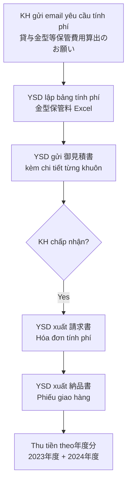

# BÁO CÁO DEEP SCAN — Source Data Part 1
## Dự án YSDMS NextGen — Yoshida Package (ヨシダパッケージ)
**Ngày phân tích:** 2026-07-15  
**Analyst:** AN (PE Agent)  
**Phạm vi:** 4 thư mục source_data — 見積書, 金型保管料, Form lien quan, ISO(2026見直し済み）

---

## MỤC LỤC

1. [TỔNG QUAN SỐ LIỆU](#1-tổng-quan-số-liệu)
2. [見積書 — QUY TRÌNH BÁO GIÁ](#2-見積書--quy-trình-báo-giá)
3. [金型保管料 — PHÍ BẢO QUẢN KHUÔN](#3-金型保管料--phí-bảo-quản-khuôn)
4. [FORM LIÊN QUAN — CÁC BIỂU MẪU NGHIỆP VỤ](#4-form-liên-quan--các-biểu-mẫu-nghiệp-vụ)
5. [ISO QMS — HỆ THỐNG QUẢN LÝ CHẤT LƯỢNG](#5-iso-qms--hệ-thống-quản-lý-chất-lượng)
6. [TỔNG HỢP: MỌI QUY TRÌNH NGHIỆP VỤ ĐÃ PHÁT HIỆN](#6-tổng-hợp-mọi-quy-trình-nghiệp-vụ-đã-phát-hiện)
7. [CÁC TRƯỜNG HỢP EDGE CASE / HIẾM GẶP](#7-các-trường-hợp-edge-case--hiếm-gặp)

---

## 1. TỔNG QUAN SỐ LIỆU

| Thư mục | Số file | Subdirs | Tổng dung lượng ước tính |
|---------|---------|---------|--------------------------|
| `見積書/` | 33 files | 0 | ~3.5 MB |
| `金型保管料(20250704)/` | 4 files | 0 | ~470 KB |
| `Form lien quan/` | 53 files | 3 subdirs | ~530 MB (1 file 494MB) |
| `ISO(2026見直し済み）/` | 25 files + 13 subdirs | ~500+ files tổng cộng | ~50 MB |

---

## 2. 見積書 — QUY TRÌNH BÁO GIÁ

### 2.1 Phân loại file báo giá

Tổng cộng **33 file** trong thư mục gốc, chia thành các loại:

#### A. Báo giá sản phẩm quy cách (規格トレイ御見積書) — **22 file**

Đây là loại phổ biến nhất. Tên file theo pattern:
```
(会社名) 担当者名 YY-MM-DD 規格トレイ（型番 材料/厚み）御見積書.docx
```

**Danh sách khách hàng phát hiện được:**

| Khách hàng | Người phụ trách | Số báo giá |
|------------|----------------|------------|
| メディックス | 橋本様 | 3 (PS0.6, PS0.6, PS0.4) |
| ミズサワセミコンダクタ | 千葉/吉田/村上様 | 6 báo giá |
| マックエイト | 小野様 | 3 (nhiều mã tray trong 1 báo giá) |
| マキノ | 豊田様 | 1 (PP0.4) |
| ミコマ技研 | 近藤様 | 1 (PP0.8) |
| ミズキ | 常盤様 | 1 (PS0.4) |
| MARUWA | 秋元様 | 2 (nhiều mã tray) |
| メイケン品質検査協会 | - | 1 (2 mã tray) |
| ホクシン | 酒井様 | 1 |
| メデイコスヒラタ | 池田様 | 1 |
| モトエプロダクツ | 本江様 | 1 |
| 明王化成 | 坂井/佐藤様 | 2 |

**Thông tin trích xuất từ tên file:**
- **Mã sản phẩm (型番):** A-012-2, A-020-1, A-020-2, A-024-1, A-032-1, A-036-1, D-030-1, E-050-2, F-150-1, G-025-3, G-030-2, G-060-1, H-004-1, H-010-1, H-010-2, H-015-2, H-020-1, Z-050-1, Z-060-1, YPC-007
- **Vật liệu:** PS (Polystyrene), PP (Polypropylene), PS黒 (PS đen)
- **Độ dày:** 0.4mm, 0.5mm, 0.6mm, 0.8mm
- **Đặc biệt:** Một số có thêm "帯電防止" (antistatic)

#### B. Báo giá sản phẩm đặc chủng / Custom — **5 file**

| File | Loại sản phẩm | Đặc điểm |
|------|---------------|-----------|
| 名優 向後様 - クラムシェルブリスタ | Clamshell blister | Kích thước triển khai 388×82mm, Otovent blister |
| 明王化成 佐藤様 - 新規240×220 5ポケット | Tray mới 5 pocket | Thiết kế hoàn toàn mới |
| ミヤカワ 山崎様 - MLB209用トレイ 340×246 4個入 | Tray cho model cụ thể | LOT追加 (thêm lot) |
| ミヤカワ 山崎様 - 420X297 4個入トレイ | Tray kích thước lớn | - |
| Rapidus㈱ - RPD-005/006 ウエハー分析用トレイ | Tray phân tích wafer | BOTTOM & TOP, high-tech customer |

#### C. Báo giá đặc biệt — Edge Cases — **4 file**

| File | Quy trình đặc biệt |
|------|-------------------|
| `Rapidus㈱：26-06-01 価格改定 御見積書.pdf` | **価格改定 (Price Revision)** — Gửi báo giá mới cho sản phẩm đã có |
| `㈱小林スプリング：26-06-01 LOT追加 御見積書.xlsx` | **LOT追加** — Thêm mức lot mới vào giá |
| `固定資産借用書 (W40×40×2.035解析Wafer用トレイ金型).docx` | **固定資産借用書** — Giấy mượn tài sản cố định (khuôn) |
| `固定資産借用書 YSD2026.01.07.pdf` | Bản PDF có ngày, đã ký |

### 2.2 Cấu trúc file báo giá (từ template Excel)

Đọc từ `見積り　原紙（エクセル）.xlsx`:

```
Header: 御　見　積　書
Fields:
  - DATE (ngày)
  - 宛先 (khách hàng) + 御中
  - 株式会社　ヨシダパッケージ (công ty phát hành)
  - 担当 桜井 麻子 (người phụ trách)
  - "毎度格別のお引き立てを賜り..." (lời chào)
  - "この御見積り価格には消費税は含まれておりません" (không bao gồm thuế)

Table columns:
  - 品名 (tên sản phẩm)
  - 数量 (số lượng)  
  - 単価 (đơn giá)
  - 金額 (thành tiền)
```

### 2.3 Cấu trúc LOT追加 quotation

Đọc từ file `㈱小林スプリング KSP-163 LOT追加`:

| Số lượng LOT | Đơn giá (¥) | Thành tiền (¥) |
|-------------|------------|----------------|
| 10 | 1,691.9 | 16,919 |
| 50 | 373.9 | 18,695 |
| 100 | 208.9 | 20,890 |
| 500 | 88.9 | 44,450 |
| 550 | 85.9 | 47,245 |
| 620 | 84.9 | 52,638 |
| 1,000 | 66.0 | 66,000 |
| 1,500 | 64.0 | 96,000 |
| 2,000 | 61.0 | 122,000 |

> **Insight:** Giá giảm mạnh theo volume — từ ¥1,691.9/cái (10 cái) xuống ¥61/cái (2000 cái). Mức giảm **96.4%** cho đặt hàng lớn. Đây là cấu trúc giá LOT tiêu biểu cho sản phẩm tray nhựa.

### 2.4 Cấu trúc 固定資産借用書 (Giấy mượn tài sản cố định)

Đọc từ file `固定資産借用書(W40×40×2.035解析Wafer用トレイ金型) YSD2026.01.07.docx`:

```
Tiêu đề: 固定資産借用書

Thông tin chính:
  - 作成日: 2026年1月7日
  - 貸与者（会社名）: Rapidus株式会社
  - 部署名: 品質保証部
  - 担当者: 大平 光庄
  - 借用者（会社名）: 株式会社ヨシダパッケージ
  - 所属部署: 営業部
  - 借用者（氏名）: 小林 一弘

Điều khoản (7 điều):
  第1条（目的）: Mục đích mượn
  第2条（貸与物件）:
    - 資産名称: W40×40×2.035解析Wafer用トレイ金型
    - 資産管理番号: R004666
    - 型式/仕様: W40×40×2.035B
    - 数量: 1
    - 資産価額: ¥150,000
  第3条（貸与期間）: 2026/01/07 ～ 2028/01/07 (2 năm)
  第4条（使用条件）: 3 điều kiện sử dụng
  第5条（返却）: Điều kiện trả lại
  第6条（損害・紛失）: Xử lý hư hỏng/mất
  第7条（その他）: Điều khoản khác
```

> **Edge Case quan trọng:** Khách hàng (Rapidus) SỞ HỮU khuôn nhưng GỬI cho YSD bảo quản và sử dụng. YSD phải ký giấy mượn chính thức. Đây là dạng "customer-owned tooling" rất phổ biến trong ngành.

---

## 3. 金型保管料 — PHÍ BẢO QUẢN KHUÔN

### 3.1 Tổng quan

4 file liên quan đến quy trình thu phí bảo quản khuôn từ khách hàng **フジクラ (Fujikura)**:

| File | Mô tả |
|------|--------|
| `RE_ 貸与金型等保管費用算出のお願い.msg` | Email từ khách hàng yêu cầu tính phí bảo quản |
| `フジクラ 金型保管料(20250612).xlsx` | Bảng tính chi tiết phí bảo quản |
| `フジクラ 金型保管料 請求書(20250704).pdf` | **請求書 (Hóa đơn)** gửi khách hàng |
| `フジクラ 金型保管料 納品書(20250704).pdf` | **納品書 (Phiếu giao hàng)** — 2023年度 & 2024年度分 |

### 3.2 Cấu trúc bảng tính phí bảo quản

Đọc từ `フジクラ 金型保管料(20250612).xlsx`:

```
Header: 御　見　積　書
  宛先: 株式会社 フジクラ
  担当: 上野山 様
  発行: 株式会社 ヨシダパッケージ
  担当: 桜井 麻子
  
Items:
  FJK-001: 金型保管料 (phí bảo quản khuôn chung)
  FJK-002: 6面 × ¥307.5/面 = ¥1,845
  FJK-003: 005A006A収納ケース用 (case lưu trữ cho 005A/006A)
  FJK-004: FJK-001/FJK-002/FJK-003
  FJK-005: TRAY FOR Fujikura Mr.Hayashi 2nd Mould
  FJK-006: FJK-004/FJK-005
  (tiếp): TRAY FOR Fujikura Mr.Kuboki, FJK-006
```

### 3.3 Quy trình phí bảo quản khuôn (Business Flow)



> **Insight quan trọng:**
> - Phí bảo quản tính theo **MẶT khuôn (面)** — ¥307.5/面/期
> - Có thể gom nhiều năm tài chính (年度) vào 1 hóa đơn
> - Mỗi khuôn có mã riêng (FJK-001, FJK-002...) trong hệ thống
> - Phí bảo quản cũng cần **見積書 → 請求書 → 納品書** flow đầy đủ

---

## 4. FORM LIÊN QUAN — CÁC BIỂU MẪU NGHIỆP VỤ

### 4.1 Tổng quan: 53 file + 3 thư mục con

#### Phân loại theo nghiệp vụ:

### 4.2 日報記録書 — BÁO CÁO HÀNG NGÀY (4 loại)

#### A. プレス＆検査部門日報 (Press & Inspection Daily Report) — 2 file

Cấu trúc form (từ `F プレス＆検査部門日報記録書 - ベトナム語含む.xls`):

| Field JA | Field VI | Mô tả |
|----------|----------|--------|
| 日報記録書 プレス&検査部門 | - | Tiêu đề |
| 作業日 | Ngày làm việc | Năm/Tháng/Ngày |
| 作業者 | Người làm | Tên nhân viên |
| 労働時間 | Thời gian làm việc | Giờ |
| 型番 | Mã hàng | Mã khuôn/sản phẩm |
| 作業内容/ショット数 | - | Nội dung/số shot |
| 備考 | - | Ghi chú chi tiết |
| 作業時間 | - | Thời gian làm |
| 付加価値（額） | - | Giá trị gia tăng (tiền) |
| 確認印 | - | Con dấu xác nhận |

> **Bilingual form:** Form có cả tiếng Nhật và tiếng Việt — phản ánh nhân viên Việt Nam trong nhà máy.

#### B. 設計＆金型部門日報 (Design & Mold Department Daily Report) — 1 file

Cấu trúc tương tự nhưng cho bộ phận thiết kế/khuôn:

| Field | Mô tả |
|-------|--------|
| 作業日 | Năm/Tháng/Ngày |
| 作業者 | VD: ダオ チ ジェン (Đào Chí Diên - nhân viên VN) |
| 労働時間 | Giờ làm việc |
| 型番 | VD: JAE-*** |
| 作業内容 | VD: プレス応援 (hỗ trợ press), 500ショット |
| 作業時間 | VD: 3 giờ |
| 付加価値（額） | VD: ¥5,000 |

> **Insight:** Mỗi task có **giá trị gia tăng bằng tiền** — cho thấy hệ thống quản lý năng suất theo giá trị sản xuất.

#### C. プレス日報兼不適合製品記録書 (Press Daily Report + Nonconforming Product Record) — 1 file

**Form kết hợp 3 sheet:**

Sheet 1: Hướng dẫn vận hành máy press (14 bước)

Sheet 2: Form chính (Song ngữ JP-VN):

| Field JA | Field VI | Chi tiết |
|----------|----------|----------|
| プレスナンバー | Máy dập số | Số hiệu máy |
| 作業者 | Người thao tác | - |
| 型番 | Mã hàng | Mã khuôn |
| 数量 | Số lượng | Sản lượng |
| 不適合製品 有・無 | Sản phẩm không phù hợp | Có/Không |
| 異常分類 | Phân loại lỗi | Chi tiết bên dưới |
| 処置 | Xử lý | - |
| 長手×短手（実測値） | Chiều dài × Chiều rộng (thực đo) | Kích thước đo |
| カッター形状確認 | Xác nhận hình dạng dao cắt | - |
| 5枚チェック | Kiểm tra 5 tấm | 5 tấm đầu |
| 100枚毎にチェック | Kiểm tra mỗi 100 tấm | - |
| 汚れ | Bẩn | Cleaning record |

> **Quy trình kiểm soát chất lượng inline:**
> - Kiểm tra 5 tấm đầu tiên
> - Sau đó kiểm tra mỗi 100 tấm
> - Đóng dấu xác nhận sau kiểm tra cuối cùng
> - Ghi nhận mỗi lần vệ sinh (○)

#### D. 検査作業日報兼日常点検 KSE専用 (Inspection Daily Report + Daily Check) — 1 file

**3 phiên bản sheet: YSD2, YSD, IBARAKI** (3 nhà máy!)

| Field | Chi tiết |
|-------|----------|
| 型番 | Mã sản phẩm |
| 成形日 | Ngày thành hình |
| 検査数量 | Số lượng kiểm tra |
| 作業者 | Người kiểm tra |
| 不合数量 | Số lượng lỗi |

**Phân loại lỗi (異常分類):**

| Sheet YSD2/IBARAKI | Sheet YSD |
|-------------------|-----------|
| 白化・割れ・潰れ (bạc hóa/nứt/méo) | 成形不良 (lỗi thành hình) |
| バリ・ヒゲ (ba-via) | 抜きズレ (lệch cắt) |
| 傷 (xước) | シート不良 (lỗi tấm) |
| 汚れ (bẩn) | 汚れ (bẩn) |
| ブリスター発生 (phồng rộp) | 黒点 (chấm đen) |
| 異物付着 (bám dị vật) | 異物付着 (bám dị vật) |
| シート不良 (lỗi tấm) | その他 (khác) |
| 変形・その他 (biến dạng/khác) | - |

**Phần kiểm tra hàng ngày (点検項目):**
- 作業台の清掃 (vệ sinh bàn làm việc)
- 室内、床清掃 (vệ sinh sàn phòng)
- モップ掛け (lau nhà)

### 4.3 機械点検報告書 — BÁO CÁO KIỂM TRA MÁY MÓC (3 file)

#### A. 機械点検報告書（金型）— Kiểm tra máy CNC cho bộ phận khuôn

Đọc từ `F 機械点検報告書（金型）2023.xlsx` — **Nhiều sheet, mỗi sheet 1 máy:**

| Máy | Sheet |
|-----|-------|
| DuraVertical 5080 | DuraVertical Maintain |
| CMX 800V | CMX800V Maintain |

**Cấu trúc kiểm tra cho mỗi máy:**

| Hạng mục | Chi tiết |
|----------|----------|
| 機械NO | Số hiệu máy |
| 作業者 | VD: グエン ダン トアン (Nguyễn Đăng Toàn) |
| 給油履歴 | Lịch sử bôi trơn (loại dầu cụ thể) |
| 機械切削油オイル交換 | Thay dầu cắt gọt + ngày |
| 切削油タンクフィルター清掃 | Vệ sinh filter bể dầu + ngày |
| 切削油ポンプフィルター | Filter bơm dầu |
| クーラーボックスフィルター清掃 | Vệ sinh filter tủ lạnh |
| ルブリケータ内オイル補充 | Bổ sung dầu bôi trơn |
| 機械稼動時異音確認 | Kiểm tra tiếng ồn bất thường |
| コンプレッサー点検、給油 | Kiểm tra máy nén khí |
| ドライヤー異音確認 | Kiểm tra tiếng ồn dryer |

> Mỗi dòng có: Ngày, Mức còn lại (残量レベル), Lượng bổ sung (ml)

#### B. 機械加工部門.xlsx — **494MB (!)**

File khổng lồ chứa toàn bộ dữ liệu bộ phận gia công cơ khí. Không đọc được do quá lớn — có thể chứa lịch sử hàng chục năm.

### 4.4 借用書 — GIẤY MƯỢN KHUÔN/DỤNG CỤ (1 file)

Đọc từ `治具金型借用書_OL-HE_ヨシダパッケージ様 YSD2025.09.24.xlsx`:

```
Tiêu đề: 冶具・金型借用書
Phát hành: 2025/09/22
Gửi: 株式会社ビーエス 御中

Nội dung:
  "下記治具・金型を、無償にて借用致しました"
  (Đã mượn miễn phí dụng cụ/khuôn sau)

  管理者/管理会社:
    第一管理者: エーシア株式会社
      〒611-0031 京都府宇治市庄町西裏7-1
      TEL: 0774-41-3777 / FAX: 0774-44-6575

  借用内容:
    1. 借用品名: [金型]SA23_表示器(AZ-434)_輸送トレー金型
    2. 借用開始日: 2025/09/22
    3. 借用品仕様:
       - 重量: 5.9 kg
       - 寸法: 385mm × 290mm × 37.5mm (縦×横×高さ)
    
  第二管理者: (trống)
```

> **Quy trình:** Khi khách hàng (ビーエス) gửi khuôn cho YSD gia công, YSD ký giấy mượn chính thức ghi rõ: tên khuôn, ngày mượn, kích thước, trọng lượng. Có thể có **nhiều cấp quản lý** (第一管理者, 第二管理者).

### 4.5 見積り関連 — CÁC FILE LIÊN QUAN BÁO GIÁ

#### A. Template báo giá (7 file template)

| File | Format | Mô tả |
|------|--------|--------|
| `見積り原紙.doc` | Word | Template gốc |
| `見積り原紙.docx` | Word | Template gốc mới |
| `見積り原紙 社印あり.doc` | Word | Template có con dấu công ty |
| `見積り原紙 社印あり-1.docx` | Word | Phiên bản khác có dấu |
| `見積り　原紙（エクセル）.xlsx` | Excel | Template Excel |
| `汎用トレイ見積もり原紙.docx` | Word | Template tray đa năng |
| `汎用トレイ見積りフォーマット.doc` | Word | Format tray đa năng |
| `ysd見積原紙.xls` | Excel | Template YSD gốc |

#### B. Công thức tính giá (8 file)

| File | Nội dung |
|------|----------|
| `見積り計算式.xls` / `.xlsm` | Công thức tính giá (VBA) |
| `見積り計算書 2.xls` / `.xlsx` | Bảng tính giá v2 |
| `見積り計算書(新）.xls` / `.xlsx` | Bảng tính giá MỚI |
| `見積原価計算書フォーマットver6.xls` / `.xlsx` | **Quan trọng nhất** — Format tính giá gốc v6 |

#### C. 見積原価計算書 v6 — Cấu trúc tính giá chi tiết

Đọc từ file — Format của **Fujitsu** (khách hàng lớn yêu cầu format riêng):

**2 sheet:** Lot 300,000 và Lot 500

**Các thành phần giá:**

```
╔══════════════════════════════════════════════╗
║  見積原価計算書 (Bảng tính giá gốc)          ║
╠══════════════════════════════════════════════╣
║                                              ║
║  Thông tin sản phẩm:                        ║
║  - 品番 (Part number)                        ║
║  - 品名 (Product name)                       ║
║  - 機種 (Model)                              ║
║  - 企画台数: 300,000                         ║
║  - 月最大: 10,000                            ║
║  - 重量 (素材): 85g                          ║
║  - 重量 (製品): 22g                          ║
║  - 歩留: 90%                                ║
║  - 金型所有: 起工                            ║
║  - 面数: 1                                   ║
║                                              ║
║  ① 加工費 (Processing cost):                ║
║  ├── 真空成形: H¥12,000 × 500個/H = ¥24/個  ║
║  ├── 抜き加工: H¥3,000 × 200個/H = ¥15/個   ║
║  ├── 検査: H¥2,000 × 250個/H = ¥8/個        ║
║  └── 小計 ①: ¥47                            ║
║                                              ║
║  ② 材料費 (Material cost):                   ║
║  ├── A-PET 帯電防止剤練り込み                ║
║  ├── 所要量: 95g × 単価¥260/kg              ║
║  └── 小計 ②: ¥24.7                          ║
║                                              ║
║  ③ 一般管理費: ①×3%+②×3% = ¥2.35           ║
║  ④ 材料管理費: ②×5% = ¥1.235               ║
║  ⑤ 利益率: (①+③+④)×5% = ¥2.53             ║
║  ⑥ その他: ¥0                               ║
║  ⑦ 仕損費: ¥0                               ║
║  ⑧ 小計: ¥77.81 (or ¥81.66 for lot 500)     ║
║                                              ║
║  ⑨ 梱包費: ¥0.65                             ║
║  ⑩ 物流費: ¥3.2                              ║
║  ⑪ 小計 (⑨+⑩): ¥3.85                       ║
║                                              ║
║  ⑫ 金型費(起工型時): ¥0.5                    ║
║  ⑬ 治具: ¥0                                 ║
║  ⑭ 小計: ¥0.5                               ║
║                                              ║
║  製品単価 = ⑧+⑪ = ¥81.66                    ║
║  償却費  = ⑭ = ¥0.5                          ║
║  納入価格 = ¥82.16                           ║
╚══════════════════════════════════════════════╝
```

> **Critical insight:** Đây là cấu trúc tính giá chuẩn công nghiệp Nhật Bản. Cần hỗ trợ trong YSDMS: Tính giá tự động dựa trên parameters đầu vào.

### 4.6 金型見積もり基準 — BẢNG GIÁ CHUẨN CHO KHUÔN

Đọc từ `金型見積もり基準.xls`:

| Hạng mục | 天フランジ汎用 新 | 天フランジ汎用 既 | スカート付き汎用 新 | スカート付き汎用 既 |
|----------|-----------------|-----------------|-------------------|-------------------|
| 設計 | ¥30,000 | ¥30,000 | ¥30,000 | ¥30,000 |
| 試作 | ¥20,000 | ¥20,000 | ¥20,000 | ¥20,000 |
| キャビ | ¥70,000 | ¥70,000 | ¥100,000 | ¥100,000 |
| プラグ | ¥30,000 | ¥30,000 | ¥30,000 | ¥30,000 |
| ミガキ | ¥10,000 | ¥10,000 | ¥10,000 | ¥10,000 |
| 穴あけ | ¥10,000 | ¥10,000 | ¥10,000 | ¥10,000 |
| 抜型 | ¥30,000 | - | ¥30,000 | - |
| スタッキング | ¥20,000 | - | ¥20,000 | - |
| **合計** | **¥220,000** | **¥170,000** | **¥250,000** | **¥200,000** |

**Chuyên dụng (専用):**

| Hạng mục | 天フランジ専用 新 | 天フランジ専用 既 | スカート付き専用 新 | スカート付き専用 既 |
|----------|-----------------|-----------------|-------------------|-------------------|
| 設計 | ¥40,000 | ¥40,000 | ¥40,000 | ¥40,000 |
| 試作 | ¥20,000 | ¥20,000 | ¥20,000 | ¥20,000 |
| キャビ | ¥120,000 | ¥120,000 | ¥150,000 | ¥150,000 |
| プラグ | ¥30,000 | ¥30,000 | ¥30,000 | ¥30,000 |

> **Ghi chú:** "外注加工使用不可（外注費¥110,000）" — Không thể dùng gia công ngoài (phí gia công ngoài ¥110,000)

### 4.7 価格改定 — QUY TRÌNH ĐIỀU CHỈNH GIÁ

#### A. 価格改定計算用 — Bảng tính điều chỉnh giá

Đọc từ `価格改定計算用2024.1.1.xlsx`:

**Cấu trúc bảng tính:**

| Cột | Nội dung |
|-----|----------|
| A | 型番 (mã khuôn): A-020-1, MZT-073, Z-100-1, MZT-007, SSM-034, SKK-002... |
| B | 材料 (vật liệu): PSN, PET, PP, PVC, PS透明, PETG |
| C | 金型サイズ: 499×347, 470×300, 355×240, 460×330, 470×347 |
| D | ロス (loss rate): 1.05 |
| E | 比重 (tỉ trọng): 1.05, 1.34, 0.91, 1.4 |
| F | 厚み (độ dày): 0.4-1.0mm |
| G | 巾 (chiều rộng) |
| H | 送り (feed): (型寸法+20mm) |
| I | 面数 (number of cavities): 1-8 |
| J-AF | **Giá qua các đợt điều chỉnh:** |

**Lịch sử các đợt điều chỉnh giá:**

| Thời điểm | Cột giá | Cột tăng |
|-----------|---------|----------|
| 2022.4まで | J (上代価格) | K (増加分) |
| 2022.5以降 | M | N |
| 2022.6調整 | P | Q |
| 2022.7以降 | S | T |
| 2022.10以降 | V | W |
| 2022.12以降 | Y | Z |
| 2023.2以降 | AB | AC |
| 2024.1以降 | AE | AF |

> **Insight:** Giá được điều chỉnh **7-8 lần** từ 2022-2024, phản ánh biến động chi phí nguyên liệu/nhân công. Mỗi lần có "増加分" (phần tăng thêm) ghi rõ.

#### B. 価格改定案内 送付状況 — Theo dõi gửi thông báo điều chỉnh giá

Đọc từ `★2026.5 価格改定案内（2026.4.7付）送付状況.xlsx`:

**Cấu trúc:**

| Cột | Nội dung |
|-----|----------|
| A | Nhóm あ行/か行/さ行/た行... (theo bảng chữ cái) |
| B | 顧客名 (tên khách hàng) |
| C | 担当者 (người phụ trách bên KH) |
| D | 案内方法 (phương pháp: メール/FAX) |
| E | 案内日 (ngày gửi: 2026.4.7) |
| F | 備考 (ghi chú) |

**Một số khách hàng trong danh sách:**
- オートスプライス㈱ → メール
- ㈱青野工業　本社 → メール + FAX
- ㈱青野工業　茨城 → FAX
- ㈱アルプス物流 → メール
- ㈱香田製作所 → FAX
- 神田工業㈱熊本事業所 → メール
- ㈱相模樹脂工業 → メール
- ㈱シャルマン → メール
- 中央工機㈱ → メール + FAX (cho chi nhánh khác nhau)
- ㈱TANAX 関東/関西支店 → メール

> **Quy trình:** YSD gửi thông báo điều chỉnh giá đồng loạt cho TẤT CẢ khách hàng, theo dõi trạng thái gửi (đã gửi/chưa gửi, phương thức gửi). Ngày thống nhất: 2026.4.7.

### 4.8 KDS — Dữ liệu xác nhận khuôn

File `KDS - 金型確認20240614.xlsx` — Xác nhận tình trạng khuôn.

### 4.9 YAC — Thực tích giao hàng

File `YAC 20230401-20240411 納品実績あり.xlsx` — Danh sách có thực tích giao hàng.

### 4.10 井澤さん見積り — Tài liệu tính giá nội bộ

Thư mục con chứa 5 file:
- `見積もり依頼.xlsx` — Yêu cầu báo giá (từ KH)
- `お見積もり計算.docx` — Bảng tính nội bộ
- `金型2面の場合.docx` — Tính giá khuôn 2 mặt
- `金型4面の場合.docx` — Tính giá khuôn 4 mặt
- `Copy of 吉田パッケージ様質問事項.xlsx` — Câu hỏi từ KH

### 4.11 計算 — Thư mục tính toán (12 file quan trọng)

| File | Nội dung |
|------|----------|
| `1型番別詳細情報.xlsx` | **Chi tiết theo từng mã sản phẩm** |
| `YSD内部資料 CD交渉 TRAY購入実績（1904～）吉田社長計算.xls` | Thực tích mua tray từ 2019/04, dùng để đàm phán CD (Cost Down) |
| `価格改定計算用2024.6.26.xlsx` | Tính toán điều chỉnh giá (phiên bản June 2024) |
| `価格改定計算用2024.8.16.xlsx` | Tính toán điều chỉnh giá (phiên bản Aug 2024) |
| `冨士発條 計算資料(3点).pdf` | Tài liệu tính cho Fuji Spring (3 item) |
| `概算価格計算資料.pdf` | Tài liệu tính giá ước tính |
| `見積原価計算書フォーマットver6.xls` | Format tính giá gốc v6 (bản backup) |
| `見積計算メモ.pdf` | Ghi chú tính toán |
| `金型見積計算書.xlsx` | Bảng tính báo giá khuôn |
| `鴻野山工場 出荷品リスト.xlsx` | Danh sách hàng xuất kho — **Nhà máy Kounoyama** |
| `鴻野山工場 家賃・電気代.xlsx` | Tiền thuê + điện — Nhà máy Kounoyama |
| `鴻野山工場 材料・出荷.xlsx` | Nguyên liệu + xuất hàng — Nhà máy Kounoyama |

> **Phát hiện:** YSD có ít nhất 2 nhà máy — Nhà máy chính (川崎) và **鴻野山工場 (Kounoyama)**. Dữ liệu cho thấy quản lý riêng chi phí thuê, điện, nguyên liệu, xuất hàng.

### 4.12 Các file khác

| File | Mô tả |
|------|--------|
| `(株)ヨシダパッケージ ロゴ(20180517).docx` | Logo công ty |
| `BC625外形寸法図.dwg` × 2 | Bản vẽ CAD (AutoCAD DWG) |
| `DSvattu.xlsx` | Danh sách vật tư (tiếng Việt) |
| `Excel VBA.xlsx` | Tài liệu VBA |
| `Tu vung trong xuong - Tiếng Việt.xlsx` | Từ vựng tiếng Nhật trong xưởng |
| `Huong dan kham SK.xlsx` | Hướng dẫn khám sức khỏe |
| `K-10120S-12-06_離型対策追加.STEP` | File 3D STEP (27MB) — đối sách giải phóng khuôn |
| `yoshida packaging map.bmp` | Bản đồ nhà máy (2.1MB) |
| `Form xuat bao cao khuon MoldCutterSearch.docx` | Form xuất báo cáo khuôn (tiếng Việt) |
| `計算データ.pdf` | Dữ liệu tính toán |
| `No.1766 タイコエレクトロニクス 新規トレイ.pdf` | Báo giá tray mới cho TE Connectivity |

---

## 5. ISO QMS — HỆ THỐNG QUẢN LÝ CHẤT LƯỢNG

### 5.1 Tổng quan: Hệ thống IMS (Integrated Management System)

YSD duy trì hệ thống quản lý tích hợp **ISO 9001 + ISO 14001**, reviewed cho năm 2026.

### 5.2 Cấu trúc tài liệu cấp cao (Root level)

| File | Quy trình nghiệp vụ |
|------|-------------------|
| `品質方針 掲示用 A3.docx` | **Chính sách chất lượng** (niêm yết) |
| `品質環境方針（最新）.doc` | **Chính sách chất lượng + Môi trường** (mới nhất) |
| `マネジメントシステム体系図.xls` | **Sơ đồ hệ thống quản lý** |
| `設計・開発フローチャート.xls` | **Flowchart thiết kế & phát triển** |
| `全体作業規定.doc` | **Quy định tác nghiệp toàn thể** |
| `職務分掌表2025.4.doc` | **Bảng phân công chức vụ** |
| `責任分担表2025.4.doc` | **Bảng phân chia trách nhiệm** |
| `支援業務一覧表.doc` | **Danh sách nghiệp vụ hỗ trợ** |
| `設備一覧表.doc` | **Danh sách thiết bị** |
| `従業員名簿2026.1.xls` | **Danh sách nhân viên** (Jan 2026) |
| `内部監査員認定者リスト2025.4.doc` | **DS auditor nội bộ được chứng nhận** |
| `派遣社員向け方針.doc` | **Chính sách cho nhân viên phái cử** |
| `YSD周辺図.xls` | **Sơ đồ khu vực xung quanh nhà máy** |
| `NG品 保管場所 掲示用.xlsx` | **Nơi bảo quản hàng NG** (niêm yết) |
| `金型台帳060926.xls` | **Sổ khuôn** (764KB — dữ liệu lớn) |

### 5.3 Lịch trình ISO & Compliance

| File | Nội dung |
|------|----------|
| `ISO年間スケジュールカレンダー2025.xls` | Lịch ISO năm 2025 |
| `ISO年間スケジュールカレンダー2026.xls` | Lịch ISO năm 2026 |
| `文書チェックリスト2025.3.xls` | Checklist tài liệu |
| `文書・記録管理リスト2025.3.xls` | DS quản lý tài liệu/hồ sơ |
| `文書体系表2015版.xls` | Bảng hệ thống tài liệu |
| `外部文書リスト2025.3.xls` | DS tài liệu bên ngoài |

### 5.4 Quản lý nhà cung cấp (供給者管理)

| File | Nội dung |
|------|----------|
| `供給者一覧2025.3.xls` | Danh sách nhà cung cấp 2025 |
| `供給者一覧2026.3.xls` | Danh sách nhà cung cấp 2026 |
| `購買製品区分別分類表兼供給者評価表2025.3.xls` | **Phân loại sản phẩm mua + Đánh giá NCC 2025** |
| `購買製品区分別分類表兼供給者評価表2026.3.xls` | **Phân loại sản phẩm mua + Đánh giá NCC 2026** |
| `供給者不適合指導履歴.xls` | **Lịch sử hướng dẫn xử lý lỗi NCC** |

### 5.5 YSD マネジメントマニュアル (Management Manual)

**10 tài liệu quy định cốt lõi:**

| # | File | Quy trình |
|---|------|----------|
| 統合 | `統合マネジメントマニュアル 26-01版` | **Manual tích hợp chính** |
| ① | `文書記録管理規定 17-01版` | Quản lý tài liệu & hồ sơ |
| ② | `教育訓練規定 17-01版` | Đào tạo huấn luyện |
| ③ | `内部監査規定 17-01版` | Đánh giá nội bộ |
| ④ | `不適合製品管理規定 17-01版` | Quản lý sản phẩm không phù hợp |
| ⑤ | `是正・予防処置規定 17-01版` | Hành động khắc phục & phòng ngừa |
| ⑥ | `環境影響評価規定 17-01版` | Đánh giá tác động môi trường |
| ⑦ | `法的要求事項管理規定 17-01版` | Quản lý yêu cầu pháp lý |
| ⑧ | `目的・目標規定 17-01版` | Quy định mục tiêu |
| 4M | `4M変更管理規定 15-08-27` | **Quản lý thay đổi 4M** (Man, Machine, Material, Method) |

> Tất cả đều có suffix `(2026確認済)` — đã xác nhận cho 2026.

### 5.6 ISO 9001 — Tài liệu chất lượng chi tiết

#### A. Tài liệu gốc (Root)

| File | Quy trình |
|------|----------|
| `FMEA-YSDトレイ.xls` | **FMEA** (Failure Mode Effects Analysis) cho sản phẩm tray |
| `QC工程表 標準.xlsx` / `.pdf` | **QC Process Chart** — Tiêu chuẩn |
| `QC工程表 【標準＋全数検査】.pdf` | QC Chart — Tiêu chuẩn + Toàn số kiểm tra |
| `QC工程表 ３分割.xls` | QC Chart — 3 phân đoạn |
| `不具合発生時対応処理フロー図.xls` | **Flowchart xử lý khi phát sinh lỗi** |
| `異常管理規定 17-02-24.xls` | Quy định quản lý bất thường |
| `異常管理規定 22-04-24(TE向).xls` | Quy định bất thường (cho TE Connectivity) |
| `異常の定義について.xls` | Định nghĩa "bất thường" |
| `異常発生時報告フロー.xls` | Flow báo cáo khi bất thường |
| `JAE-135 反り指導記録.xlsx` | Ghi nhận hướng dẫn cong vênh JAE-135 |
| `教育訓練プログラム フォーマット.xlsx` | Format chương trình đào tạo |
| `測定工具定期検査修講者リスト.doc` | DS người dự khóa kiểm tra dụng cụ đo |

#### B. 手順書 (Procedure Manuals) — **50+ tài liệu**

**Thành hình (成形) — 30+ file:**

| Nhóm | Tài liệu chính |
|------|----------------|
| **Nhận hàng** | ①受入検査 手順書 |
| **Xuất nhập kho** | ②出入庫 手順書 |
| **Thành hình & Kiểm tra** | ③成形・検査 手順書 (4 phiên bản cập nhật) |
| **Điểm kiểm hàng ngày** | 3-1.日常点検・清掃 手順書 兼 記録書 |
| **Vệ sinh máy** | 3-2.機械清掃 手順書 |
| **Lắp khuôn** | 4-1.上金型／下金型設定 手順書 (2 ver) |
| | 4-2.金型設定 手順書(機械側) |
| **Lắp dao cắt** | 5-1.抜型設定 手順書 |
| **Xếp chồng** | 6-1.スタッキング 設定 手順書 |
| **Ghi bảng điều kiện** | 7-1.条件表記入 手順書 |
| **Tiêu chuẩn quản lý SP** | 8-1.製品管理基準書 (2 ver) |
| **Set nguyên liệu** | 8-2.材料セット及び材料差替え手順書 |
| **Kiểm tra trong quy trình** | 9-2.工程内検査手順書 |
| **Máy đếm** | 10-1.計数器取扱い 手順書 |
| **Ép (Press)** | 10-3.プレス作業 手順書 |
| **Kiểm tra xuất hàng** | 11.出荷検査 手順書 |
| **Vệ sinh vải lau** | 13.1.ウエス作業規定 |
| **Phòng kiểm tra** | 13.検査室 作業手順書 |
| **Quản lý ban đầu** | 初期流動管理手順 |
| **Flowchart thành hình** | 成形フローチャート (3 loại: 一般, TE全数, 抜加工全数) |
| **Xác nhận công đoạn quan trọng** | 成形作業重要工程確認表 |
| **Manual setup máy** | 成形機セットマニュアル (送り条件 + 給油) |
| **Sử dụng vật liệu mùa đông** | 材料使用(冬季)手順書 |
| **Quản lý hàng dở** | 端数品管理作業手順書 |
| **Xử lý sản phẩm dập** | プレス抜き製品 取扱い手順書 |
| **Máy seal blister** | ブリスターシーラー機手順書 |
| **Máy gấp 3 phía** | 三方折曲機作業手順書 |
| **Dán nhãn** | ラベル貼付手順書 成形・梱包 |

**Khuôn (金型) — 12 file:**

| Tài liệu | Nội dung |
|-----------|----------|
| NC468V操作手順書 | Hướng dẫn vận hành NC468V |
| NCプログラムの流れ（表加工/裏加工） | Quy trình chương trình NC (gia công mặt trước/sau) |
| NC加工開始前手順書 | Chuẩn bị trước khi gia công NC |
| NC加工開始前手順書工具セット | Setup dụng cụ |
| NC材料発注マニュアル | Manual đặt vật tư NC |
| エンドミルマニュアル | Manual dao phay |
| シンナー取扱手順書 | Xử lý dung môi |
| プラグ作成手順書（手作業） | Làm plug thủ công |
| 廃油処理手順書 | Xử lý dầu thải |
| 新規金型製造工程票 取説 | Hướng dẫn phiếu quy trình SX khuôn mới |
| 金型裏加工手順書 | Gia công mặt sau khuôn |

**Khác:**

| Tài liệu | Nội dung |
|-----------|----------|
| 総務 受注処理手順書（対策後） | **Quy trình xử lý đơn hàng** (phòng tổng vụ, sau đối sách) |
| 協力会社管理手順書 | Quản lý công ty hợp tác |
| 人体、建物への緊急事態手順書 | Xử lý khẩn cấp (người, tòa nhà) |
| 火災発生対応手順書 | Xử lý hỏa hoạn |
| 緊急時連絡網 | Mạng liên lạc khẩn cấp |
| 廃棄物・リサイクル品・ゴミ分別手順書 | Phân loại rác & tái chế |

### 5.7 ISO 14001 — Tài liệu môi trường

| Nhóm | Tài liệu |
|------|----------|
| **Đánh giá môi trường** | 環境側面特定表 (2022-2026, mỗi năm 1 file) |
| | 環境影響評価表 |
| | NC環境側面一覧 |
| **Tuân thủ pháp lý** | 順守状況確認表 (2007-2025, mỗi năm 1 file) |
| | 2024年度 順守状況確認（構内パトロール表）|
| **Thiết bị refrigerant** | コンプレッサー＆チラー簡易点検 (7+ file) |
| | フロン破壊処理証明書 |
| **Giảm tải môi trường** | 環境負荷低減提案書 (7+ file) |
| **Thông báo môi trường** | 環境に関してのお願い (gửi NCC) |
| **Chất thải** | 産業廃棄物管理票 |
| **Tiếng ồn/Rung** | 騒音監視測定記録書 |
| | 振動監視測定記録書 |
| | 消防・市役所関係 (12 file) |

### 5.8 YSD環境規定 — Quản lý chất có hại

Thư mục `YSD環境規定/` chứa:

- **PROP65物質リスト** — Danh sách chất theo California Prop 65
- **YSD環境規定回答入手2025.03/** — Thu thập phản hồi từ NCC về quy định môi trường
  - PROP65 2025.04/ — 10+ phản hồi từ NCC
  - RP東プラ 回答/ — Phản hồi từ RP Topla (NCC nhựa chính)
    - ICP test reports cho các loại nhựa
    - SDS (Safety Data Sheet)
    - YSD環境規定 conformity response
  - スプリングラボ 回答/ — Phản hồi từ Spring Lab

> **Insight:** YSD phải tuân thủ PROP65 California — cho thấy sản phẩm xuất khẩu hoặc KH có yêu cầu quốc tế.

### 5.9 Tổ chức & Nhân sự

**組織図 (Sơ đồ tổ chức):** 19 phiên bản từ 2017-2026, cập nhật thường xuyên khi có thay đổi nhân sự.

**部門目標 (Mục tiêu bộ phận):** Dữ liệu từ 2008-2025, chia theo:
- 成形部門 (Thành hình) — No.01 + No.02 mỗi năm
- 金型部門 (Khuôn)
- 紙器部門 (Giấy/Bao bì) — chỉ đến 2015
- 総務部門 (Tổng vụ) — chỉ một số năm

> **Insight:** 紙器部門 (bộ phận bao bì giấy) ngừng hoạt động sau 2015.

**年度教育訓練計画書:** Kế hoạch đào tạo cá nhân cho TỪNG NHÂN VIÊN, có cả nhân viên Nhật và Việt Nam.

### 5.10 売上推移表 — Doanh thu theo năm

20 file từ 2006-2025, cho thấy YSD theo dõi doanh thu hàng năm liên tục 20 năm.

### 5.11 ISO だより — Bản tin ISO nội bộ

84 file bản tin ISO, phát hành hàng tháng từ 2006-2026. Bao gồm cả tài liệu 5S từ khách hàng TE.

### 5.12 消防訓練 — Huấn luyện PCCC

42 file ghi nhận huấn luyện PCCC, bao gồm ảnh chụp, báo cáo, kế hoạch.

---

## 6. TỔNG HỢP: MỌI QUY TRÌNH NGHIỆP VỤ ĐÃ PHÁT HIỆN

### 6.1 Quy trình Kinh doanh & Bán hàng (営業)

| # | Quy trình JA | Quy trình VI | File nguồn |
|---|-------------|-------------|------------|
| S01 | 見積書作成 | Lập báo giá | 見積書/ (33 file) |
| S02 | 規格トレイ見積り | Báo giá tray quy cách | 22 file báo giá |
| S03 | 新規トレイ見積り | Báo giá tray mới (custom) | 5 file báo giá đặc chủng |
| S04 | LOT追加見積り | Báo giá thêm mức LOT | KSP-163 file |
| S05 | 価格改定 | Điều chỉnh giá | 価格改定計算用, 改定案内 |
| S06 | 価格改定案内送付 | Gửi thông báo điều chỉnh giá | ★2026.5 送付状況 |
| S07 | 見積原価計算 | Tính giá gốc | 見積原価計算書 v6 |
| S08 | 金型見積り | Báo giá khuôn | 金型見積もり基準 |
| S09 | 受注処理 | Xử lý đơn hàng | 受注処理手順書 |
| S10 | 金型保管料請求 | Thu phí bảo quản khuôn | 金型保管料/ |
| S11 | 固定資産借用書 | Giấy mượn tài sản cố định | 固定資産借用書 |
| S12 | 治具金型借用書 | Giấy mượn khuôn/dụng cụ | 治具金型借用書 |
| S13 | 納品書発行 | Phát hành phiếu giao | 金型保管料 納品書 |
| S14 | 請求書発行 | Phát hành hóa đơn | 金型保管料 請求書 |
| S15 | CD交渉 | Đàm phán giảm giá (Cost Down) | YSD内部資料 CD交渉 |

### 6.2 Quy trình Sản xuất (製造)

| # | Quy trình JA | Quy trình VI | File nguồn |
|---|-------------|-------------|------------|
| M01 | 受入検査 | Kiểm tra nhận hàng | 手順書 ① |
| M02 | 出入庫管理 | Quản lý xuất nhập kho | 手順書 ② |
| M03 | 真空成形 | Thành hình chân không | 成形・検査手順書 |
| M04 | 抜き加工 | Gia công cắt | プレス作業手順書 |
| M05 | 検査 | Kiểm tra | 検査手順書 + 日報 |
| M06 | 日常点検・清掃 | Kiểm tra/vệ sinh hàng ngày | 3-1 手順書 |
| M07 | 金型設定 | Lắp đặt khuôn | 4-1, 4-2 手順書 |
| M08 | 抜型設定 | Lắp đặt dao cắt | 5-1 手順書 |
| M09 | スタッキング | Xếp chồng sản phẩm | 6-1 手順書 |
| M10 | 条件表記入 | Ghi bảng điều kiện | 7-1 手順書 |
| M11 | 材料セット/差替え | Set/đổi nguyên liệu | 8-2 手順書 |
| M12 | 工程内検査 | Kiểm tra trong quy trình | 9-2 手順書 |
| M13 | 出荷検査 | Kiểm tra xuất hàng | 11 手順書 |
| M14 | 初期流動管理 | Quản lý sản xuất ban đầu | 初期流動管理手順 |
| M15 | ラベル貼付 | Dán nhãn | ラベル貼付手順書 |
| M16 | ブリスターシーラー | Máy seal blister | ブリスター手順書 |
| M17 | 三方折曲 | Gấp 3 phía | 三方折曲機手順書 |
| M18 | 端数品管理 | Quản lý hàng dở dang | 端数品管理手順書 |
| M19 | 材料使用(冬季) | Sử dụng vật liệu mùa đông | 材料使用手順書 |

### 6.3 Quy trình Khuôn & Thiết kế (設計・金型)

| # | Quy trình JA | Quy trình VI | File nguồn |
|---|-------------|-------------|------------|
| D01 | 設計・開発 | Thiết kế & phát triển | 設計・開発フローチャート |
| D02 | NC加工 | Gia công CNC | NC操作手順書 (6 file) |
| D03 | プラグ作成 | Làm plug | プラグ作成手順書 |
| D04 | 新規金型製造 | Sản xuất khuôn mới | 新規金型製造工程票 |
| D05 | 金型台帳管理 | Quản lý sổ khuôn | 金型台帳 |
| D06 | 4M変更管理 | Quản lý thay đổi 4M | 4M変更管理規定 |

### 6.4 Quy trình Chất lượng (品質)

| # | Quy trình JA | Quy trình VI | File nguồn |
|---|-------------|-------------|------------|
| Q01 | FMEA | Phân tích mode & tác động lỗi | FMEA-YSDトレイ |
| Q02 | QC工程管理 | Quản lý QC Process | QC工程表 (3 loại) |
| Q03 | 不適合製品管理 | Quản lý SP không phù hợp | 不適合製品管理規定 |
| Q04 | 是正・予防処置 | Khắc phục & phòng ngừa | 是正・予防処置規定 |
| Q05 | 異常管理 | Quản lý bất thường | 異常管理規定 (2 ver) |
| Q06 | 不具合発生対応 | Xử lý phát sinh lỗi | 不具合発生時対応フロー |
| Q07 | 内部監査 | Đánh giá nội bộ | 内部監査規定 |
| Q08 | 供給者評価 | Đánh giá nhà cung cấp | 供給者評価表 |
| Q09 | 供給者不適合指導 | Hướng dẫn xử lý lỗi NCC | 供給者不適合指導履歴 |
| Q10 | 測定工具定期検査 | Kiểm tra dụng cụ đo định kỳ | 測定工具定期検査リスト |

### 6.5 Quy trình Quản lý Nhân sự & Đào tạo

| # | Quy trình JA | Quy trình VI | File nguồn |
|---|-------------|-------------|------------|
| H01 | 教育訓練 | Đào tạo huấn luyện | 教育訓練規定 + 年度計画 |
| H02 | 従業員名簿管理 | Quản lý danh sách NV | 従業員名簿 |
| H03 | 組織図更新 | Cập nhật sơ đồ tổ chức | 組織図 (19 phiên bản) |
| H04 | 派遣社員管理 | Quản lý NV phái cử | 派遣社員向け方針 |
| H05 | 部門目標管理 | Quản lý mục tiêu bộ phận | 部門目標 (2008-2025) |

### 6.6 Quy trình Bảo trì & Thiết bị

| # | Quy trình JA | Quy trình VI | File nguồn |
|---|-------------|-------------|------------|
| E01 | 機械点検 | Kiểm tra máy móc | 機械点検報告書 |
| E02 | 給油管理 | Quản lý bôi trơn | Sheets trong 機械点検報告書 |
| E03 | コンプレッサー点検 | Kiểm tra máy nén khí | コンプレッサー簡易点検 |
| E04 | 消火器管理 | Quản lý bình chữa cháy | 消火器操作 (2018-2026) |
| E05 | 設備一覧管理 | Quản lý danh sách thiết bị | 設備一覧表 |

### 6.7 Quy trình Môi trường & An toàn

| # | Quy trình JA | Quy trình VI | File nguồn |
|---|-------------|-------------|------------|
| EV01 | 環境影響評価 | Đánh giá tác động MT | 環境影響評価表 |
| EV02 | 環境側面特定 | Xác định khía cạnh MT | 環境側面特定表 |
| EV03 | 順守評価 | Đánh giá tuân thủ | 順守評価確認表 |
| EV04 | PROP65対応 | Đối ứng PROP65 | YSD環境規定 |
| EV05 | 廃棄物管理 | Quản lý chất thải | 廃棄物手順書 |
| EV06 | 騒音・振動監視 | Giám sát tiếng ồn/rung | 騒音/振動記録書 |
| EV07 | 消防訓練 | Huấn luyện PCCC | 消防訓練 (42 file) |
| EV08 | 火災報知器管理 | Quản lý báo cháy | 火災報知器設置場所 |

### 6.8 Quy trình Hành chính & Tài liệu

| # | Quy trình JA | Quy trình VI | File nguồn |
|---|-------------|-------------|------------|
| A01 | 文書管理 | Quản lý tài liệu | 文書記録管理規定 |
| A02 | 外部文書管理 | Quản lý tài liệu bên ngoài | 外部文書リスト |
| A03 | 売上推移管理 | Theo dõi doanh thu | 売上推移表 (2006-2025) |
| A04 | ISOだより発行 | Phát hành bản tin ISO | ISOだより (84 file) |
| A05 | 法的要求事項管理 | Quản lý yêu cầu pháp lý | 法的要求事項管理規定 |

### 6.9 Báo cáo hàng ngày (日報)

| # | Loại | Bộ phận | Song ngữ? |
|---|------|---------|-----------|
| R01 | プレス＆検査部門日報 | Press & Inspection | ✅ JP-VN |
| R02 | 設計＆金型部門日報 | Design & Mold | ❌ JP only |
| R03 | プレス日報兼不適合記録書 | Press + Nonconformity | ✅ JP-VN |
| R04 | 検査作業日報兼日常点検 | Inspection + Daily Check | ❌ JP only |

---

## 7. CÁC TRƯỜNG HỢP EDGE CASE / HIẾM GẶP

### 7.1 Quy trình đặc biệt đã xác nhận

| # | Edge Case | Mô tả | Tần suất |
|---|-----------|--------|----------|
| EC01 | **固定資産借用書** | Giấy mượn tài sản cố định — KH sở hữu khuôn, gửi YSD bảo quản+sử dụng. Hợp đồng 7 điều khoản, thời hạn 2 năm. | Hiếm — chỉ 1 KH (Rapidus) |
| EC02 | **金型保管料請求** | Thu phí bảo quản khuôn của KH — tính theo面 (mặt khuôn), gom nhiều年度. Flow: email→Excel→見積書→請求書→納品書 | Không thường xuyên |
| EC03 | **LOT追加見積り** | Báo giá bổ sung mức LOT — cùng sản phẩm nhưng thêm các mức số lượng mới | Trung bình |
| EC04 | **価格改定** | Điều chỉnh giá — thay đổi giá sản phẩm hiện hữu, gửi thông báo cho TẤT CẢ KH. 7-8 lần điều chỉnh từ 2022-2024. | Định kỳ (1-2 lần/năm) |
| EC05 | **治具金型借用書** | YSD mượn khuôn từ KH/bên thứ 3 — có hệ thống nhiều cấp quản lý (第一管理者, 第二管理者) | Trung bình |
| EC06 | **クラムシェルブリスタ見積り** | Báo giá sản phẩm blister clamshell — khác hoàn toàn tray thông thường | Hiếm |
| EC07 | **TE向異常管理** | Quy định bất thường riêng cho khách hàng TE Connectivity — tiêu chuẩn cao hơn thông thường | Đặc biệt |
| EC08 | **鴻野山工場管理** | Quản lý riêng nhà máy vệ tinh — chi phí thuê, điện, nguyên liệu, xuất hàng | Liên tục |
| EC09 | **材料使用(冬季)** | Quy trình đặc biệt cho mùa đông — vật liệu nhựa cần xử lý khác khi nhiệt độ thấp | Theo mùa |
| EC10 | **PROP65対応** | Đối ứng quy định California Prop 65 — thu thập phản hồi từ NCC về chất có hại | Định kỳ |
| EC11 | **多言語対応** | Biểu mẫu song ngữ JP-VN cho nhân viên Việt Nam | Liên tục |
| EC12 | **3拠点検査** | Kiểm tra tại 3 nhà máy (YSD, YSD2, IBARAKI) — mỗi nơi có phân loại lỗi khác nhau | Liên tục |
| EC13 | **紙器部門廃止** | Bộ phận bao bì giấy đã ngừng hoạt động sau 2015 | Lịch sử |
| EC14 | **付加価値管理** | Quản lý giá trị gia tăng bằng tiền cho mỗi task trong ngày — dùng để đánh giá năng suất | Hàng ngày |
| EC15 | **成形フロー分岐** | 3 loại flowchart thành hình: 一般(thông thường), TE全数(toàn kiểm cho TE), 抜加工全数(toàn kiểm gia công cắt) | Theo sản phẩm |
| EC16 | **HAE様提出用組織図** | Sơ đồ tổ chức riêng cho khách hàng HAE — KH lớn yêu cầu format riêng | Đặc biệt |

### 7.2 Phát hiện quan trọng cho YSDMS

1. **Multi-site management:** YSD có ít nhất 3 site — YSD chính (川崎), YSD2, IBARAKI, và nhà máy 鴻野山
2. **Customer-specific processes:** Một số KH lớn (TE, Fujitsu, HAE) có quy trình riêng
3. **Tooling ownership model phức tạp:**
   - Khuôn do YSD sở hữu → tính vào giá sản phẩm (償却費)
   - Khuôn do KH sở hữu, gửi YSD → 固定資産借用書
   - Khuôn do bên thứ 3 quản lý → 治具金型借用書 (多段管理)
   - Phí bảo quản khuôn → 金型保管料
4. **Pricing complexity:**
   - Volume-based pricing (LOT pricing)
   - Material-based calculation (tỉ trọng, độ dày, kích thước khuôn, số面)
   - Periodic price revision (7-8 lần trong 2 năm)
   - Customer-specific formats (Fujitsu format riêng)
5. **Quality system đầy đủ:** FMEA, QC Process Chart, CAPA, Internal Audit, Supplier Evaluation
6. **Bilingual operations:** Nhiều form song ngữ JP-VN cho nhân viên Việt Nam

---

## 8. GỢI Ý CHO YSDMS NEXTGEN

Dựa trên phân tích trên, các module ưu tiên:

| Priority | Module | Quy trình covered |
|----------|--------|-------------------|
| P0 | 見積書管理 | S01-S08, EC03, EC04, EC06 |
| P0 | 借用書管理 | EC01, EC05, S11, S12 |
| P1 | 金型保管料 | S10, EC02 |
| P1 | 日報システム | R01-R04, EC14 |
| P1 | 価格改定管理 | S05, S06, EC04 |
| P2 | 品質管理 | Q01-Q10 |
| P2 | 機械点検 | E01-E05 |
| P3 | ISO文書管理 | A01-A05 |
| P3 | 教育訓練 | H01-H05 |

---

*Báo cáo này được tạo tự động bằng cách quét trực tiếp các file nguồn trong source_data/. Mọi thông tin đều có nguồn từ file thực tế.*
