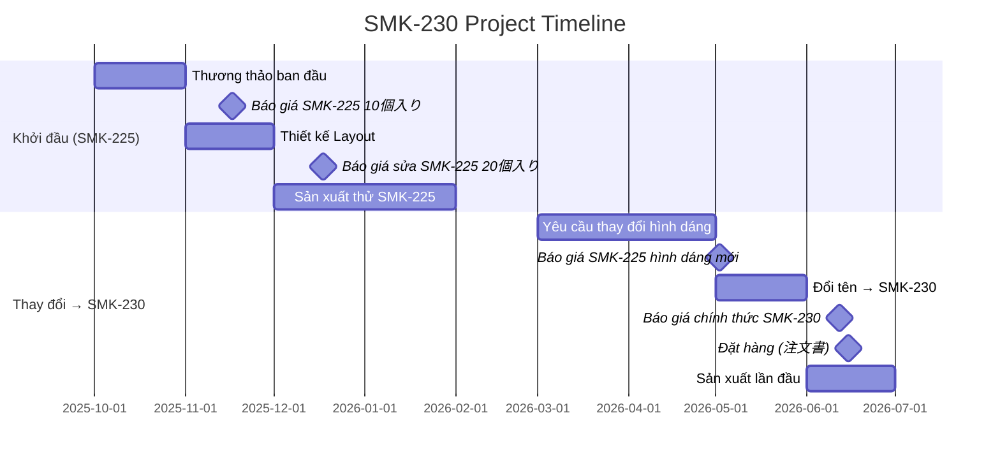
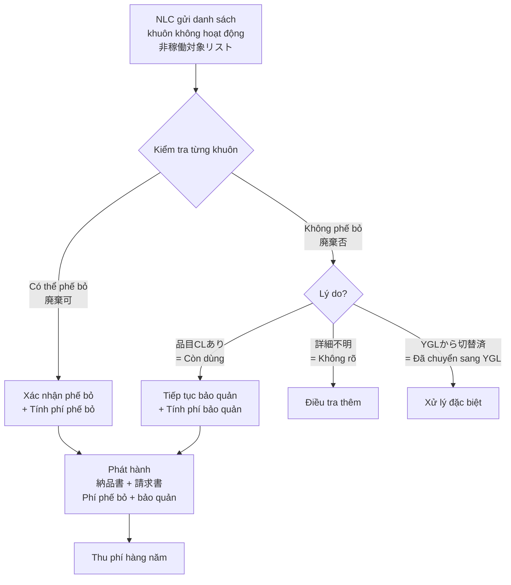
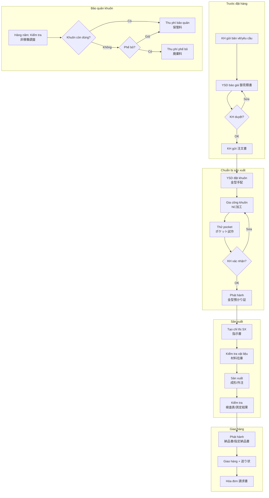

# BÁO CÁO PHÂN TÍCH SÂU — PHẦN 2
## Quy trình Nghiệp vụ Công ty Yoshida Package (ヨシダパッケージ)
### Phân tích từ thư mục `source_data/` — Phiếu giao hàng, Chỉ thị sản xuất, Tồn kho vật liệu

**Ngày phân tích:** 2026-07-15  
**Phạm vi:** 5 thư mục chính + file gốc root

---

## MỤC LỤC

1. [Tổng quan cấu trúc dữ liệu](#1-tổng-quan-cấu-trúc-dữ-liệu)
2. [Quy trình Phiếu giao hàng & Đơn hàng (納品書_注文)](#2-phiếu-giao-hàng--đơn-hàng)
3. [Quy trình Chỉ thị sản xuất (生産指示書)](#3-chỉ-thị-sản-xuất)
4. [Quản lý Tồn kho Nguyên liệu (材料在庫)](#4-tồn-kho-nguyên-liệu)
5. [Case Study: SMK-230 — Quy trình đầy đủ từ A-Z](#5-case-study-smk-230)
6. [Dữ liệu Đơn hàng nội bộ (Root files)](#6-dữ-liệu-đơn-hàng-nội-bộ)
7. [Phát hiện quan trọng: Quy trình Phế bỏ & Bảo quản khuôn (NLC)](#7-phế-bỏ--bảo-quản-khuôn)
8. [Yêu cầu riêng từng khách hàng (Customer-Specific)](#8-yêu-cầu-riêng-từng-khách-hàng)
9. [Ma trận Loại tài liệu nghiệp vụ](#9-ma-trận-loại-tài-liệu)
10. [Edge Cases & Vấn đề Đặc biệt](#10-edge-cases--vấn-đề-đặc-biệt)
11. [Đề xuất cho YSDMS NextGen](#11-đề-xuất-cho-ysdms-nextgen)

---

## 1. TỔNG QUAN CẤU TRÚC DỮ LIỆU

### 1.1 Thư mục `納品書_注文/` — 7 khách hàng

| Thư mục | Khách hàng | Số file | Loại tài liệu chính |
|---------|-----------|---------|---------------------|
| `IRI` | イリソ電子工業㈱ (Iriso Electronics) | 8 | Bản vẽ, PO, Báo giá, Phiếu giao hàng |
| `JAE-365` | 日本航空電子 / ニッコー・ロジスティクス | 31 | Báo giá (nhiều lần sửa), Pra-dan sheet, Layout |
| `KYD` | 高陽電商 (Koyo Densho) / 三菱電機鎌倉 | 10 | Đơn hàng, Phiếu giao chỉ định, Biên bản cho mượn |
| `MCT` | ミネベアコネクト (MinebeaConnect) | 21 | Đơn hàng khuôn, Thử nghiệm pocket, Bảng kiểm |
| `NLC 金型廃棄＆保管リスト` | NLC (ニッコー・ロジスティクス) | 4 | **DS Khuôn không hoạt động, Hóa đơn phí bảo quản** |
| `SJI` | ㈱最上インクス (Saijo Inx) | 14 | Yêu cầu phế bỏ khuôn, Ảnh khuôn, Bản vẽ |
| `SMK` | SMK株式会社 | 18 (+4 subdir) | Báo giá, Đơn hàng, **Phiếu giao chỉ định SMK** |

### 1.2 Thư mục `生産指示書/` — 4 file master + 5 thư mục khách hàng

| File/Thư mục | Mô tả | Kích thước/Số file |
|--------------|-------|-------------------|
| `A. 納入先一覧表.xlsx` | Danh sách địa chỉ giao hàng | ~1,180 dòng |
| `B. トレイデータ一覧表.xlsx` | Dữ liệu tray (master data) | ~7,094 dòng, 110 cột |
| `C. 指示書作成シート(成形）.xlsx` | Template tạo chỉ thị sản xuất | Form 58 dòng |
| `納入先一覧表.xlsx` | Bản copy/backup | 1.1MB |
| `新HAE/` | Mẫu chỉ thị cho HAE (日本航空電子系) | 1 file |
| `新NLC/` | Mẫu chỉ thị cho NLC | 1 file |
| `新SMK/` | Mẫu chỉ thị cho SMK | 1 file |
| `新YAE/` | Mẫu chỉ thị cho YAE (山形航空電子) | 1 file |
| `新一般/` | Mẫu chỉ thị chung (General) | 1 file |

### 1.3 Thư mục `材料在庫/` — 482 file snapshot hàng ngày

- **Phạm vi:** Từ 2024/03/18 → 2026/07/10 (liên tục ~2.5 năm)
- **Tần suất:** Mỗi ngày làm việc 1 file (khoảng 200+ ngày/năm)
- **Tên file pattern:** `材料在庫(YY-MM-DD)指示書連動.xlsx`
- **Kết nối:** File tồn kho **LIÊN ĐỘNG** với chỉ thị sản xuất (指示書連動)

### 1.4 Thư mục `SMK-230/` — Case study khách hàng lớn

- 35 file + 1 thư mục con `SMK-225/` (33 file)
- Email đàm phán (.msg), Báo giá (.pdf/.doc), Đơn hàng, Ảnh khuôn
- **Đây là case đầy đủ nhất:** từ tư vấn → báo giá → thử nghiệm → đặt khuôn → sản xuất

---

## 2. PHIẾU GIAO HÀNG & ĐƠN HÀNG (納品書_注文)

### 2.1 Quy trình chuẩn — Phiếu giao hàng


### 2.2 Phiếu giao hàng SMK (格式 chỉ định)

**⚠️ ĐẶC BIỆT QUAN TRỌNG:** SMK có format phiếu giao hàng riêng (SMK指定納品書) với yêu cầu đặc thù:

**Cấu trúc 3 sheet trong 1 file Excel:**
1. **`使用方法`** — Hướng dẫn sử dụng form
2. **`入力用`** — Sheet nhập liệu (YSD điền vào)
3. **`印刷用(SMK提出)`** — Sheet in ra nộp cho SMK
4. **`納品書控`** — Bản lưu (copy giữ lại)

**Các trường dữ liệu trên phiếu giao SMK:**

| Nhóm | Trường | Mô tả |
|------|--------|-------|
| Header | 出荷日 | Ngày giao hàng |
| | 取引先コード | Mã nhà cung cấp (của YSD tại SMK) |
| | 社名 | Tên công ty (ヨシダパッケージ) |
| Thân | 注文NO. | Số đơn hàng SMK |
| | 図番 | Số bản vẽ |
| | 納入数 | Số lượng giao |
| | LOT NO. | Số lô sản xuất |
| | 納入場所 | Địa điểm giao |
| | 金型No.(号型) | Số khuôn (号型) |
| | 単価(税抜) | Đơn giá (trước thuế) |
| | 材料名 | Tên vật liệu |
| | 金額(税抜) | Thành tiền (trước thuế) |
| | 備考 | Ghi chú |
| | 荷姿 | Hình thức đóng gói |

**⚠️ FORMAT THAY ĐỔI (2025/04):**
- File `SMK指定納品書改定のご案内` → SMK đã gửi thông báo đổi format phiếu giao hàng
- File so sánh `SMK指定納品書_新旧フォーム比較.pdf` tồn tại → khách hàng thay đổi mẫu biểu

### 2.3 IRI — Quy trình đặt hàng mới

File IRI cho thấy luồng đặt hàng mới hoàn chỉnh:
1. **金型手配依頼書** (Yêu cầu chuẩn bị khuôn) — `社外用_金型手配依頼書_25-380_610010_K-16135T-01-01.pdf`
2. **Bản vẽ sản phẩm** — `K-16135T-01-01図面.pdf`
3. **Bản vẽ + Work** — `K-16135T-01-01図面、ワーク.pdf`
4. **Báo giá** — `御見積書.pdf` (ngày 26-03-03)
5. **PO (Purchase Order)** — `PO.pdf`
6. **Báo giá phản hồi** — `見積回答_QURQ-...pdf`
7. **Email ưu tiên** — Đàm phán ưu tiên sản xuất

### 2.4 KYD — Tài liệu đặc biệt

- **指定納品書.pdf** — Phiếu giao hàng theo format KYD chỉ định
- **貸与資料覚書.pdf** — **Biên bản cho mượn tài liệu/mẫu** (quan trọng!)
- **試験成績書 見本書式.pdf** — Mẫu báo cáo thử nghiệm
- **送り状.pdf** — Phiếu gửi hàng (waybill)
- **量産検査表フォーマット** — Form kiểm tra hàng loạt

### 2.5 MCT — Quy trình thử nghiệm Pocket

MCT (MinebeaConnect) có quy trình thử nghiệm pocket (túi chứa linh kiện trên tray) rất chi tiết:

1. **Đơn hàng khuôn** — `XSD0P0-0030金型注文書.pdf`
2. **Phiếu giao khuôn** — `XSD0P0-0030金型納品書.pdf`
3. **Thử nghiệm pocket lần 2** — `ポケット試作2回目注文書(XSD00P0-0030).pdf`
4. **Phiếu giao thử nghiệm lần 2** — `ポケット試作2回目納品書(XSD00P0-0030).pdf`
5. **Đơn hàng thử nghiệm lần 3** — `3回目ポケット試作注文書.pdf`
6. **So sánh với hiện hành** — `ポケット試作品 現行品との比較確認について.msg`

**→ Pocket thử nghiệm có thể lặp lại nhiều lần (ít nhất 3 lần) trước khi duyệt sản xuất hàng loạt.**

### 2.6 SJI — Quy trình phế bỏ khuôn

SJI (最上インクス) có tài liệu liên quan đến **phế bỏ khuôn**:
- `金型廃棄依頼250303.msg` — Email yêu cầu phế bỏ khuôn
- `SJI-021 2025.03.07 廃棄.jpg` — Ảnh chụp khuôn trước khi phế bỏ (bằng chứng)
- `SJI-021金型写真(2021.12.15).xlsx` / `(20210215).xlsx` — Ảnh khuôn quá khứ

**→ Quy trình phế bỏ khuôn cần: yêu cầu → chụp ảnh → xác nhận → phế bỏ.**

---

## 3. CHỈ THỊ SẢN XUẤT (生産指示書)

### 3.1 Cấu trúc file Master — `C. 指示書作成シート(成形）.xlsx`

File này là **hệ thống tạo chỉ thị sản xuất**, chứa 4 sheet chính:

| Sheet | Chức năng | Chi tiết |
|-------|-----------|---------|
| `指示書作成シート(成形）` | Template chỉ thị — **Thành hình** | Form in 58 dòng × 22 cột |
| `指示書作成シート（外注）` | Template chỉ thị — **Gia công ngoài** | Form in 51 dòng × 22 cột |
| `トレイデータ一覧表` | Master data tray | 7,094 dòng × 110 cột |
| `納入先一覧表` | Danh sách nơi giao | 1,180+ dòng |

### 3.2 Chỉ thị sản xuất — Nội dung (成形 = Thành hình)

Trường dữ liệu chính trên chỉ thị sản xuất:

```
┌─────────────────────────────────────────────────────┐
│ 注 文 書  ／  納 入 指 示 書  (  成 形  ）          │
│                                                     │
│ 株式会社 ヨシダパッケージ                            │
│ 伝票 / LOT No.:  264635                             │
│ 発注 / 手配日:   2026.6.15                           │
│                                                     │
│ [Thông tin sản phẩm — tra từ トレイデータ一覧表]      │
│ [Thông tin giao hàng — tra từ 納入先一覧表]           │
└─────────────────────────────────────────────────────┘
```

**→ Đây chính là hệ thống chỉ thị sản xuất hiện tại (Excel VBA/Lookup):**
- Nhập mã tray → Tự động tra bảng `トレイデータ一覧表` → Điền thông tin vật liệu, kích thước
- Nhập mã nơi giao → Tự động tra bảng `納入先一覧表` → Điền thông tin địa chỉ

### 3.3 Master Data Tray — Bảng `トレイデータ一覧表`

**7,094 dòng × 110 cột** — Đây là nguồn dữ liệu gốc lớn nhất

Các cột chính (Row 5 = Header):

| Cột | Tên JP | Ý nghĩa | Ví dụ |
|-----|--------|---------|-------|
| C1 | P/N | Part Number (Mã tray) | `AMP-010`, `SMK-220`, `JAE-172` |
| C2 | 型番 | Số hiệu khuôn | `AMP-010 10P`, `912018-1` |
| C3 | 材質 | Vật liệu | `PS(N)`, `PP(N)`, `PVC(CL)`, `PS(CL)`, `A-PET(CL)`, `PS(茶)`, `PS(W)`, `PS(B)` |
| C4 | 厚み | Độ dày (mm) | `0.38`, `0.4`, `0.5`, `0.6`, `0.8`, `1.0` |
| C5 | ｼｰﾄ巾 | Chiều rộng tấm (mm) | `405`, `435`, `460`, `520`, `640` |
| C6 | 帯電 | Chống tĩnh điện | `有`/`無`/`-`/`導電印刷` |
| C7 | ｼﾘｺﾝ | Silicon (chống dính) | `有`/`無`/`-` |
| C8 | 塗布 | Phủ bề mặt | `有`/`無`/`-` |
| C9 | 入数 | Số lượng/chồng | `120`~`4000` |
| C10-C16 | (Kích thước) | Các kích thước pocket | `470×300`, `385*265` |
| C18 | 長手（交差上限） | Dung sai dài (+) | `±0.3`, `±0.5`, `±1.0`, `MAX` |
| C19 | 長手（交差下限） | Dung sai dài (−) | `-`, `−1`, `−2` |
| C20 | 短手（交差上限） | Dung sai ngắn (+) | `±0.3`, `±0.5`, `±1.0`, `MAX` |
| C21 | 短手（交差下限） | Dung sai ngắn (−) | |
| C22 | 長手 | Kích thước dài (mm) | |
| C23 | 短手 | Kích thước ngắn (mm) | |
| C24 | 有・無 | Có/Không (gì?) | `○` |

### 3.4 Danh sách Nơi giao hàng — `納入先一覧表`

**1,180+ → 1,864 dòng** (tăng theo thời gian, bản mới nhất trong SMK-230 có 1,864 dòng)

| Cột | Tên JP | Ý nghĩa | Ví dụ |
|-----|--------|---------|-------|
| No. | Mã nơi giao | Mã viết tắt | `11`, `A3C`, `AAK`, `AAT` |
| 送り先 | Nơi nhận | Tên công ty | `ＳＭＫ（株）ひたち` |
| 住所 | Địa chỉ | Toàn bộ | |
| 依頼元(依頼主) | Người đặt hàng | Mã + tên | `SMK（株）崎村` |
| サブ | Phụ trách | Người liên hệ | `FC生産技術部 田辺` |
| 電話番号 | Điện thoại | | `0293-20-2140` |
| FAX | Fax | | |

**Mã đặc biệt:**
- `888` = Placeholder (chưa xác định)
- `999` = `後日確認` (Xác nhận sau)
- `11` = SMK ひたち (nhà máy Hitachi)
- `111` = SMK 本社 (trụ sở chính)

### 3.5 Chỉ thị sản xuất theo khách hàng

Mỗi khách hàng lớn có **template chỉ thị riêng** (thư mục `新XXX`):

| Thư mục | File mẫu | Đặc điểm |
|---------|---------|----------|
| 新HAE | `JAE-172 025-52846PET(20250716)第3ヤード受入係様 青森成形 ラベル.xlsx` | Có ラベル (nhãn dán), ghi rõ nơi sản xuất (青森成形) |
| 新NLC | `JAE-351 025-60249(20250610)JAE三橋様 初回.xlsx` | 初回 = Lần đầu |
| 新SMK | `SMK146 161CSC-125-00Fひたち(20250708).xlsx` | Ghi rõ nhà máy giao (ひたち) |
| 新YAE | `JAE-131 025-55206(20250626)ﾗﾍﾞﾙ表示ｱﾘYAE管理部物流G様 坂田精文堂成形-3.xlsx` | Nhãn dán, nơi sx (坂田精文堂), phiên bản `-3` |
| 新一般 | `OWG MTY-001-PP(20250715).xlsx` | Khách hàng chung |

**Cấu trúc tên file chỉ thị sản xuất:**
```
[Mã tray] [Mã bản vẽ](YYYYMMDD)[Nơi giao/Người nhận] [Nơi sản xuất] [Ghi chú].xlsx
```

---

## 4. TỒN KHO NGUYÊN LIỆU (材料在庫)

### 4.1 Cấu trúc file

**482 file snapshot** — mỗi file là trạng thái tồn kho vào 1 ngày cụ thể.

File `材料在庫(26-7-10)指示書連動.xlsx` (mới nhất):
- Sheet1: 325 dòng × 114 cột
- Ngày: `2026-07-10`

### 4.2 Cấu trúc dữ liệu tồn kho

| Cột | Tên | Ý nghĩa | Ví dụ |
|-----|-----|---------|-------|
| A | Mô tả vật liệu | `材質+厚み+幅×長さ` | `PS(N)0.38t×640×500m` |
| B | Nhà máy | Nơi lưu trữ | `青森`, `本社`, `茨城` |
| C | SI | Chỉ thị đặc biệt | `○` |
| D-E | 帯電 | Chống tĩnh điện | `×` |
| F | NP | Nhà cung cấp NP | |
| G | RP東プラ | Nhà cung cấp RP Topla | |
| H | 相模原倉庫 | Kho Sagamihara | |
| I | レグルス他 | Nhà cung cấp Regulus etc. | Số lượng đang đặt |
| J | 納入数量 | SL nhập dự kiến | |
| K | 納期 | Ngày giao hàng vật liệu | `7/21頃` |
| L | 本社工場 | Tồn kho nhà máy chính | `700` |
| M | 青森工場 | Tồn kho nhà máy Aomori | `5575` |
| N | 茨城工場 | Tồn kho nhà máy Ibaraki | `1030` |
| O | 坂田工場 | Tồn kho nhà máy Sakata | `321` |
| Q | 合計 | Tổng tồn kho | `5575` |
| S | 残数 | Số còn lại (sau khi trừ đơn hàng) | `5242` |

### 4.3 Điểm quan trọng

1. **Multi-factory:** 4 nhà máy (本社, 青森, 茨城, 坂田) — mỗi nhà máy có tồn kho riêng
2. **Multi-supplier:** Nhiều nhà cung cấp nguyên liệu (NP, RP東プラ, 相模原倉庫, レグルス)
3. **Liên động chỉ thị:** File tồn kho **tự động trừ** khi có chỉ thị sản xuất mới (指示書連動)
4. **Tracking hàng đang về:** Cột "納入数量" + "納期" theo dõi vật liệu đang trên đường
5. **残数 (Số còn lại):** = Tồn kho hiện tại − Số lượng đã cấp cho chỉ thị sản xuất

### 4.4 Loại vật liệu nhựa

Từ dữ liệu, phân loại vật liệu:

| Ký hiệu | Vật liệu | Đặc tính |
|----------|----------|----------|
| PS(N) | Polystyrene Natural | Trong suốt tự nhiên |
| PS(CL) | Polystyrene Clear | Trong suốt |
| PS(茶) | Polystyrene Brown | Màu nâu |
| PS(W) | Polystyrene White | Màu trắng |
| PS(B) | Polystyrene Black | Màu đen |
| PP(N) | Polypropylene Natural | |
| PVC(CL) | PVC Clear | |
| PVC | PVC | |
| A-PET(CL) | A-PET Clear | |
| PET | PET | |

Thông số sheet: Độ dày `0.38`~`1.0mm`, Chiều rộng `405`~`640mm`

---

## 5. CASE STUDY: SMK-230 — Quy trình đầy đủ A→Z

### 5.1 Timeline dự án SMK-230

Đây là case study hoàn chỉnh nhất, cho thấy toàn bộ quy trình từ **tư vấn → sản xuất**:



### 5.2 Tài liệu trong SMK-230

| Loại | File | Ý nghĩa |
|------|------|---------|
| **Email (14 file .msg)** | `RE 【ご相談】新規トレイ起工⇒注文書送付1~14.msg` | Đàm phán liên tục 14+ vòng |
| **Báo giá (3 file)** | `御見積書.pdf` / `.doc` | Báo giá ban đầu + sửa đổi |
| **Đơn hàng** | `注文書_SMK-230 485×325サイズ 20個入り...pdf` | Đơn hàng chính thức |
| **Chỉ thị SX** | `SMK-230 40WE(F)3200000(R/L)(20260615)...xlsx` | Chỉ thị sản xuất kèm data |
| **Ảnh khuôn** | `SMK-230 20260615.jpg` | Ảnh chụp khuôn thực |
| **Bảng khuôn** | `1 SMK金型写真看板.xlsx` | Kanban ảnh khuôn |
| **Giấy nhận khuôn** | `金型預かり証(20260615).pdf` | **Giấy nhận bảo quản khuôn** |
| **Yêu cầu thay đổi** | `トレイ_SMK-225の変更のお願い-2/-3.pdf` | Yêu cầu sửa thiết kế |
| **Extracted data** | `extracted_content.md` (6MB!) | Dữ liệu trích xuất |

### 5.3 Chi tiết sản phẩm SMK-230

```
Sản phẩm: SMK-230
Kích thước: 485×325 (tray ngoài)
Số linh kiện/tray: 20 cái (20個入り)
Kiểu: L・R兼用 (dùng cho cả trái/phải)
Vật liệu: PP ナチュラル 0.8mm 帯電防止付 シリコン無
Mã bản vẽ KH: 40WE(F)3200000(R/L)
Giao cho: 富山 尾山様
```

### 5.4 Giấy nhận bảo quản khuôn (金型預かり証)

**→ Quy trình mới phát hiện:**
- `SMK 本馬様 40WE(F)3200000 金型預かり証(20260615).pdf`
- `SMK-225トレイの形状変更品_金型預かり証.pdf`

YSD giữ khuôn của khách hàng → phát hành **Giấy nhận bảo quản khuôn** (金型預かり証):
- Khuôn là tài sản của khách hàng
- YSD có trách nhiệm bảo quản
- Khi có thay đổi, cần phát hành giấy mới

### 5.5 Lịch sử SMK-225 (tiền thân)

Thư mục `SMK-225/` chứa 33 file cho thấy:
- **Quy trình NC gia công:** `SMK-225 NC 加工プロセス.xlsx` — Chi tiết quy trình CNC
- **8+ vòng email đàm phán** (RE 【ご相談】新規トレイ起工 1~8.msg)
- **5+ vòng báo giá** tại các thời điểm khác nhau
- **Layout thay đổi 3 lần:** 2025.11.14 → 2025.11.19 → 2025.12.17
- **Đơn hàng khuôn:** `注文書_設備・金型サイズ 499×347 1面取り 金型一式 初回サンプル10枚含む.pdf`
- **QA Sheet:** `QASheet_20251015購買案件.pdf`

---

## 6. DỮ LIỆU ĐƠN HÀNG NỘI BỘ (Root Files)

### 6.1 `2025年 社内トレー受注.xlsx` — Đơn hàng nội bộ theo ngày

**Cấu trúc: 12 sheet (1 sheet/tháng), mỗi sheet ~40 dòng**

| Cột | Nội dung |
|-----|---------|
| 日付 | Ngày (serial date) |
| AMP | Số lượng đơn hàng AMP (TE Connectivity) |
| AMP関連 | Liên quan AMP |
| SMK | Số lượng đơn hàng SMK |
| 旺電舎 | Ouddensha |
| 小林ｽﾌﾟﾘﾝｸﾞ | Kobayashi Spring |
| JAE | Japan Aviation Electronics |
| 水谷製作所 | Mizutani Seisakusho |
| ワイエーシーガーター | YAC Garter |
| 大宝工業 | Taiho Kogyo |
| ADY | ADY |
| その他 | Khác |
| 合計 | Tổng ngày |
| 予想総数 | Dự kiến tổng tháng |

**→ Đây là bảng theo dõi sản lượng hàng ngày**, phân theo khách hàng chính.

### 6.2 `YSDトレー受注一覧（改2）4-22.xlsx` — Danh sách đơn hàng chi tiết

**2,735 dòng × 27 cột** — Bảng lập kế hoạch sản xuất theo ngày

Cấu trúc: Mỗi ngày → liệt kê các mã tray + số lượng cần sản xuất
```
4/1(火)  | JAE-047 2000青 | JAE-172 2240青 | JAE-005 1000青 | ...
         | DIC-018 2000   | BSP-002 25初回 | KDS-062 2500S  | ...
         | SSM-033 2880S  | TNX-009 1400   | F-200-1 1000   | ...
```

**Đặc điểm:**
- Ghi rõ nơi sản xuất: `青` = Aomori, `S` = Sakata
- Ghi rõ `初回` = Lần đầu (cần kiểm tra đặc biệt)
- Có cột `別抜き検査` = Kiểm tra phân loại riêng

---

## 7. PHẾ BỎ & BẢO QUẢN KHUÔN (金型廃棄＆保管) — NLC

### 7.1 ĐÂY LÀ QUY TRÌNH CHƯA ĐƯỢC TÀI LIỆU HÓA!

Thư mục `NLC 金型廃棄＆保管リスト` chứa 4 file quan trọng:

| File | Loại | Nội dung |
|------|------|---------|
| `【YSD様見積用リスト】非稼働対象リスト （2022年度）.xlsx` | Danh sách | DS khuôn không hoạt động |
| `2022年度金型廃棄料・保管料 納品書.pdf` | Phiếu giao | Phiếu giao cho dịch vụ phế bỏ/bảo quản |
| `2022年度金型廃棄料・保管料 請求書.pdf` | Hóa đơn | Hóa đơn thu phí phế bỏ + bảo quản |
| `RE 2022非稼働金型の処置についてのお願い（見積依頼）.msg` | Email | Yêu cầu báo giá xử lý khuôn |

### 7.2 Cấu trúc Danh sách Khuôn Không Hoạt Động

**Sheet: YSD** (25 dòng × 17 cột)

| Cột | Tên JP | Ý nghĩa |
|-----|--------|---------|
| A | 事業部 | Bộ phận (VD: `C` = Connector) |
| B | (YSD) | Đơn vị quản lý |
| C | 取得日 | Ngày nhận khuôn (VD: `2014/07`) |
| D | 設備番号 | Mã thiết bị (VD: `9913-00170`) |
| E | 名称 | Tên khuôn (VD: `MX汎用部品30升ﾄﾚｰ`) |
| F | 図番 | Số bản vẽ (VD: `025-53798`) |
| G | 備考 | Ghi chú (VD: `可⇒否（YGLから切替済）`) |
| H | **廃棄可否** | **Có thể phế bỏ hay không** (`可`/`否`) |
| I | 否の理由 | Lý do không phế bỏ (VD: `品目CLあり`, `詳細不明`) |
| J | 担当 | Người phụ trách (VD: `長田`, `何`) |
| K | 管理職 | Quản lý (VD: `吉田`, `小町SE`, `神田SM`, `長沼`) |
| L | 非稼働調査 対象 | Đối tượng điều tra | `●` |
| M | 非稼働調査 御社調査 | Kết quả điều tra KH | Ngày cuối sử dụng |
| N | 貸出書有無 | Có giấy cho mượn hay không | `○`/`×` |

### 7.3 Quy trình phế bỏ/bảo quản khuôn (phát hiện mới!)



### 7.4 Điểm nghiệp vụ quan trọng

1. **Phí bảo quản khuôn (保管料):** YSD thu phí hàng năm cho việc lưu trữ khuôn của NLC
2. **Phí phế bỏ khuôn (廃棄料):** YSD thu phí cho việc phá hủy khuôn cũ
3. **Kiểm tra giấy cho mượn (貸出書有無):** Trước khi phế bỏ, phải xác nhận có giấy cho mượn hay không
4. **Nhiều bên liên quan:** Người phụ trách (担当) + Quản lý (管理職) phải xác nhận
5. **Điều tra sử dụng (非稼働調査):** Ghi lại ngày cuối cùng khuôn được sử dụng
6. **Lý do giữ lại:** Có thể do còn đơn hàng, không rõ lịch sử, hoặc đã chuyển cho đơn vị khác

---

## 8. YÊU CẦU RIÊNG TỪNG KHÁCH HÀNG

### 8.1 Ma trận yêu cầu đặc biệt

| Khách hàng | Phiếu giao riêng | Bảng kiểm riêng | Giấy mượn | Nhãn dán | Gia công nhiều lần | Phí khuôn |
|------------|:-:|:-:|:-:|:-:|:-:|:-:|
| **SMK** | ✅ (Excel form chỉ định) | ✅ (32-100_FMT) | ✅ (金型預かり証) | ❌ | ✅ (SMK-225→230) | ✅ |
| **JAE/HAE/YAE/NLC** | ❌ (dùng form YSD) | ✅ (検査表) | ❌ | ✅ (ラベル) | ✅ (Layout nhiều lần) | ❌ |
| **KYD** | ✅ (指定納品書) | ✅ (量産検査表) | ✅ (貸与資料覚書) | ❌ | ❌ | ❌ |
| **MCT** | ❌ | ✅ (YSD作成 + 貴社作成) | ❌ | ❌ | ✅ (3回 pocket試作) | ✅ (金型注文書) |
| **IRI** | ❌ | ❌ | ❌ | ❌ | ❌ | ✅ (金型手配依頼書) |
| **SJI** | ❌ | ❌ | ❌ | ❌ | ❌ | ✅ (金型廃棄) |
| **NLC** | ❌ | ❌ | ✅ (貸出書) | ❌ | ❌ | ✅ (廃棄料+保管料) |

### 8.2 SMK — Bảng kiểm tra kích thước (寸法測定結果表)

SMK yêu cầu bảng đo kích thước rất chi tiết (format `32-100_FMTver.2.0`):

| Trường | Nội dung |
|--------|---------|
| 発注先名 | Tên nhà cung cấp = ヨシダパッケージ |
| 起工先名 | Tên nhà gia công = ヨシダパッケージ |
| 製造日 / 測定日 | Ngày SX / Ngày đo |
| 材料名 + Lot | PS（ナチュラル）0.8ｔ 帯電防止 + Lot No. |
| 粉砕材含有率 | % nhựa tái chế (VD: 0%) |
| 金型情報 | 号型 (số khuôn), 取数 (cavity), Cav.No. |
| 設備名 | Tên máy (VD: 53B) |
| 測定器 | Dụng cụ đo (ノギス=Thước kẹp, デプス=Thước đo sâu) |
| Kết quả | **Đo từng mẫu**, so với quy cách → OK/NG |
| Người ký | 承認者, 確認者, 担当者, 測定者 (4 cấp) |

→ **4 cấp ký duyệt** trên bảng kiểm: Phê duyệt → Xác nhận → Phụ trách → Đo lường

### 8.3 JAE — Hệ thống phức tạp nhiều bên

JAE-365 cho thấy hệ thống đặt hàng phức tạp:
- **Khách hàng cuối:** 日本航空電子 (JAE)
- **Trung gian:** ニッコー・ロジスティクス (NLC = logistics partner)
- **Nhà sản xuất tray:** 株式会社ヨシダパッケージ (YSD)
- **Nhà sản xuất khác:** 山形航空電子 (YAE = nhà máy khác của JAE)

**Báo giá gửi cho nhiều đối tượng khác nhau:**
- NLC 飯野様 — Cho chi phí trung gian
- NLC 淀川様 — Cho chi phí trung gian (khác)
- YAE — Cho nhà máy sản xuất linh kiện
- Phí thiết kế + 3D data riêng

### 8.4 MCT — Bảng kiểm 2 bên

MCT có 2 loại bảng kiểm:
1. `MCT-001.貴社トレイの検査表.xls` — Bảng kiểm do **MCT** lập (cho tray của MCT)
2. `MCT-001YSDトレイの検査表.xls` — Bảng kiểm do **YSD** lập (cho tray của YSD)

→ **Cả 2 bên đều kiểm tra và có bảng kiểm riêng** cho cùng 1 sản phẩm.

---

## 9. MA TRẬN LOẠI TÀI LIỆU NGHIỆP VỤ

### 9.1 Tất cả loại tài liệu phát hiện

| # | Loại JP | Loại VI | Người tạo | Người nhận | Giai đoạn |
|---|--------|---------|-----------|-----------|-----------|
| 1 | **御見積書** | Báo giá | YSD | Khách hàng | Trước đặt hàng |
| 2 | **注文書** | Đơn đặt hàng | Khách hàng | YSD | Đặt hàng |
| 3 | **金型手配依頼書** | Yêu cầu chuẩn bị khuôn | Khách hàng | YSD | Đặt hàng |
| 4 | **金型注文書** | Đơn đặt khuôn | Khách hàng | YSD | Đặt khuôn |
| 5 | **金型納品書** | Phiếu giao khuôn | YSD | Khách hàng | Giao khuôn |
| 6 | **金型預かり証** | Giấy nhận bảo quản khuôn | YSD | Khách hàng | Bảo quản |
| 7 | **金型使用開始証明書** | Chứng nhận bắt đầu sử dụng khuôn | YSD | Khách hàng | Bắt đầu SX |
| 8 | **指示書 (成形)** | Chỉ thị sản xuất (thành hình) | YSD nội bộ | Nhà máy YSD | Sản xuất |
| 9 | **指示書 (外注)** | Chỉ thị gia công ngoài | YSD | Nhà gia công | Sản xuất |
| 10 | **納品書** (YSD標準) | Phiếu giao hàng (form YSD) | YSD | Khách hàng | Giao hàng |
| 11 | **指定納品書** (KH format) | Phiếu giao chỉ định (form KH) | YSD | SMK, KYD | Giao hàng |
| 12 | **検査表** / **量産検査表** | Bảng kiểm tra | YSD | Khách hàng | QC |
| 13 | **寸法測定結果表** | Kết quả đo kích thước | YSD | SMK | QC |
| 14 | **試験成績書** | Báo cáo thử nghiệm | YSD | KYD | QC |
| 15 | **請求書** | Hóa đơn | YSD | Khách hàng | Thanh toán |
| 16 | **貸与資料覚書** | Biên bản cho mượn tài liệu | YSD ↔ KH | Cả 2 bên | Quản lý TS |
| 17 | **金型廃棄依頼** | Yêu cầu phế bỏ khuôn | Khách hàng | YSD | Phế bỏ |
| 18 | **非稼働対象リスト** | DS khuôn không hoạt động | NLC | YSD | Phế bỏ |
| 19 | **送り状** | Phiếu gửi hàng (waybill) | YSD | Vận chuyển | Giao hàng |
| 20 | **注文書兼納品書** | Đơn hàng kiêm phiếu giao | SJI | YSD | Đặt+Giao |
| 21 | **QASheet** | Phiếu QA mua hàng | SMK | YSD | QC |
| 22 | **見積回答** | Phản hồi báo giá | YSD | Khách hàng | Báo giá |
| 23 | **でんさい** | Thanh toán điện tử (Densai) | MCT | YSD | Thanh toán |

### 9.2 Sơ đồ luồng tài liệu tổng thể



---

## 10. EDGE CASES & VẤN ĐỀ ĐẶC BIỆT

### 10.1 Thay đổi mã sản phẩm giữa chừng
- **SMK-225 → SMK-230:** Sản phẩm thay đổi hình dáng, đổi mã hoàn toàn
- Khuôn cũ SMK-225 vẫn tồn tại → cần quản lý 2 khuôn
- Giấy nhận bảo quản cần phát hành lại

### 10.2 Phiếu giao hàng thay đổi format
- **SMK (2025/04):** Thay đổi format phiếu giao → YSD phải cập nhật hệ thống
- File so sánh format cũ/mới tồn tại → cần hỗ trợ version control

### 10.3 Multi-factory production
- Cùng 1 đơn hàng có thể sản xuất tại nhiều nhà máy (本社, 青森, 茨城, 坂田)
- Mã tray theo dõi bằng suffix: `青` = Aomori, `S` = Sakata

### 10.4 Gia công ngoài (外注)
- Có template chỉ thị riêng cho gia công ngoài
- Nhà gia công ngoài: `坂田精文堂`, `青森成形` (được ghi trong tên file chỉ thị)

### 10.5 Sản phẩm phụ — Pra-dan
- JAE-365 có đặt thêm **プラダンシート** (tấm nhựa corrugated) — không phải tray
- Pra-dan cũng cần báo giá, bản vẽ, đặt hàng riêng

### 10.6 Đàm phán ưu tiên
- `RE 新規トレイお見積り依頼の優先度について.msg` — Email đàm phán **ưu tiên** sản xuất
- → Cần hệ thống priority cho đơn hàng

### 10.7 Sử dụng vật liệu đặc biệt
- `導電印刷` — In dẫn điện (thay vì chống tĩnh điện thông thường)
- `粉砕材` — Nhựa tái chế (% phải ghi trên bảng kiểm)
- Cần tracking: material property ↔ customer requirement

### 10.8 Nhiều vòng báo giá
- SMK-230: Ít nhất **14 vòng email** + **5+ báo giá**
- MCT: **3 vòng** thử nghiệm pocket
- JAE-365: **6+ báo giá** với giá khác nhau theo thời điểm

### 10.9 Thanh toán đặc biệt
- MCT sử dụng **でんさい** (Densai = hệ thống thanh toán điện tử Nhật Bản)
- → Cần hỗ trợ nhiều phương thức thanh toán

### 10.10 Phí riêng — Thiết kế + 3D Data
- `設計費＋3Dデータ作成費` — Phí thiết kế + tạo dữ liệu 3D
- `設備費` — Phí thiết bị (khuôn)
- → Cần phân loại chi phí: Sản phẩm vs. Thiết kế vs. Khuôn vs. 3D

---

## 11. ĐỀ XUẤT CHO YSDMS NEXTGEN

### 11.1 Modules cần xây dựng

| # | Module | Ưu tiên | Mô tả |
|---|--------|---------|-------|
| 1 | **Delivery Note Management** | P0 | Phiếu giao hàng — hỗ trợ nhiều format (YSD standard + KH custom) |
| 2 | **Production Instruction** | P0 | Chỉ thị sản xuất — thay thế Excel VBA lookup hiện tại |
| 3 | **Material Inventory** | P1 | Tồn kho nguyên liệu — multi-factory, liên động chỉ thị SX |
| 4 | **Mold Lifecycle Management** | P1 | Quản lý vòng đời khuôn: nhận → bảo quản → phế bỏ |
| 5 | **Inspection Management** | P1 | Bảng kiểm tra — nhiều format theo KH |
| 6 | **Customer-specific Config** | P1 | Cấu hình yêu cầu riêng từng KH |
| 7 | **Quotation Versioning** | P2 | Quản lý phiên bản báo giá (nhiều vòng) |

### 11.2 Data cần migrate

| Data source | Số dòng | Bảng DB | Ghi chú |
|------------|---------|---------|---------|
| トレイデータ一覧表 | 7,094 | `products` | Master data tray |
| 納入先一覧表 | 1,864 | `delivery_sites` / `company_contacts` | Danh sách nơi giao |
| 材料在庫 | ~325/file × 482 files | `material_inventory` | Cần thiết kế schema mới |
| 非稼働対象リスト | ~25 | `mold_lifecycle_events` | Sự kiện vòng đời khuôn |
| 社内トレー受注 | ~365 × 12 KH | `daily_orders` | Theo dõi sản lượng hàng ngày |

### 11.3 Schema mới đề xuất

```sql
-- Quản lý phiếu giao hàng
CREATE TABLE delivery_notes (
  id UUID PRIMARY KEY,
  delivery_note_no TEXT, -- 伝票No.
  order_id UUID REFERENCES orders,
  shipment_date DATE,
  delivery_site_id UUID REFERENCES delivery_sites,
  lot_no TEXT,
  format_type TEXT, -- 'ysd_standard', 'smk_designated', 'kyd_designated'
  ...
);

-- Quản lý vòng đời khuôn
CREATE TABLE mold_lifecycle_events (
  id UUID PRIMARY KEY,
  product_id UUID REFERENCES products,
  event_type TEXT, -- 'received', 'in_use', 'inactive', 'disposal_requested', 'disposed', 'stored'
  event_date DATE,
  custody_certificate_url TEXT, -- 金型預かり証
  disposal_fee DECIMAL,
  storage_fee DECIMAL,
  approved_by TEXT,
  ...
);

-- Tồn kho vật liệu
CREATE TABLE material_inventory (
  id UUID PRIMARY KEY,
  material_spec TEXT, -- 'PS(N)0.58t×640×350m'
  factory TEXT, -- '本社', '青森', '茨城', '坂田'
  quantity INTEGER,
  snapshot_date DATE,
  linked_instruction_id UUID,
  ...
);
```

---

## PHỤ LỤC: Tóm tắt phát hiện chính

### 🔴 Critical — Chưa có trong hệ thống

1. **Quản lý phế bỏ/bảo quản khuôn (NLC process)** — Thu phí hàng năm
2. **Phiếu giao hàng format khách hàng** — SMK, KYD mỗi nơi 1 format
3. **Tồn kho nguyên liệu multi-factory** — 4 nhà máy, liên động chỉ thị SX
4. **Giấy nhận bảo quản khuôn (金型預かり証)** — Tài liệu pháp lý
5. **Chứng nhận sử dụng khuôn (金型使用開始証明書)** — Tài liệu pháp lý

### 🟡 Important — Đã có nhưng chưa đầy đủ

6. **Bảng kiểm tra (検査表)** — Mỗi KH yêu cầu format khác nhau
7. **Chỉ thị sản xuất** — Template riêng cho 5 nhóm KH
8. **Quản lý báo giá nhiều phiên bản** — 5-14 vòng đàm phán

### 🟢 Nice to have

9. **Tracking sản lượng hàng ngày** — Phân theo KH
10. **Quản lý nhà cung cấp vật liệu** — Nhiều nguồn cho cùng 1 loại nhựa
11. **Pra-dan sheet** — Sản phẩm phụ (không phải tray)

---

*Báo cáo tạo bởi AI Business Analyst — 2026-07-15*
*Nguồn dữ liệu: `source_data/` directory — Yoshida Package*
