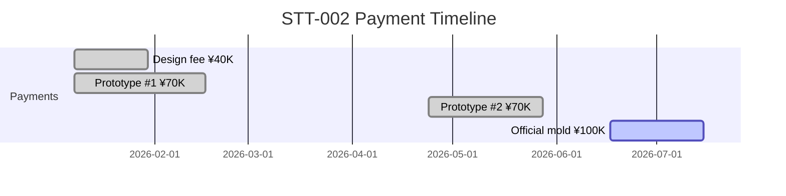
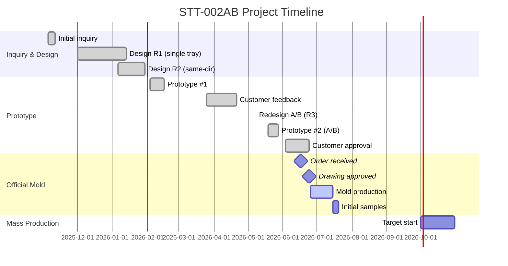

# 📋 Bảng Thông tin Đầy đủ — STT-002AB

> Nguồn dữ liệu: Email liên lạc (toanysdmail.CSV), hồ sơ kỹ thuật, naming standard V3
> Cập nhật: 2026-07-10
> Mục đích: Dùng để nhập liệu kiểm thử vào hệ thống YSDMS NextGen

---

## 1. KHÁCH HÀNG & LIÊN HỆ — `companies` + `company_contacts` + `delivery_sites`

### 1.1 Bảng `companies`

| Trường DB | Khách cuối (End Customer) | Trung gian (Intermediary) |
|-----------|--------------------------|---------------------------|
| `company_code` | `RBC` | `STT` |
| `company_name` | `ルビコン㈱` | `㈱サンテック東北` |
| `company_type` | `['CUSTOMER']` | `['CUSTOMER', 'AGENT']` |
| Ghi chú | Người dùng cuối sản phẩm | Đặt hàng và thanh toán cho YSD |

### 1.2 Bảng `company_contacts`

| Trường DB | Liên hệ 1 | Liên hệ 2 | Liên hệ 3 |
|-----------|-----------|-----------|-----------|
| `company_id` | → ルビコン | → ルビコン | → サンテック東北 |
| `contact_name` | `原 正憲` | `唐澤` | `阿部 健太郎` |
| `department` | `購買部` | `PML技術課` | — |
| `position` | — | — | `係長` |
| `role` | Mua hàng | Kỹ thuật | Kinh doanh |
| `email` | `mhara@rubycon.co.jp` | — | `ken.abe@santec-tohoku.co.jp` |

### 1.3 Bảng `delivery_sites`

| Trường DB | Site 1 — Rubycon Matsukawa | Site 2 — Santec Tohoku |
|-----------|---------------------------|------------------------|
| `company_id` | → ルビコン | → サンテック東北 |
| `site_name` | `松川事業所` | `本社` |
| `address` | `〒399-3303 長野県下伊那郡松川町元大島2932` | `〒981-3401 宮城県黒川郡大和町落合三ケ内字北沢54-8` |
| `phone` | `0265-36-3311` | `022-344-2420` |

---

## 2. SẢN PHẨM — `products`

| Trường DB | Giá trị | Ghi chú |
|-----------|---------|---------|
| `product_code` | `STT002AB` | Mã compact YSD (bỏ gạch ngang) |
| `product_name_internal` | `STT-002AB` | Tên hiển thị nội bộ |
| `product_name` | `TR-S24-A/B` | Tên chính thức KH (cho hóa đơn) |
| `company_id` | → `㈱サンテック東北` | Khách đặt hàng trực tiếp |
| `product_status` | `ACTIVE` | |
| `pocket_count` | `35` | 35 pocket mỗi khay |
| `pieces_per_box` | — | ⚠️ CẦN XÁC NHẬN |
| `box_spec` | — | ⚠️ CẦN XÁC NHẬN |
| **product_set_type** | `SET` | A/B sản xuất đồng thời |
| **set_component_names** | `{"A": "TR-S24-A", "B": "TR-S24-B"}` | Tên từng khay trong set |
| **stacking_type** | `SAME_DIRECTION` | 同方向 (cùng chiều) |
| **stacking_layers** | `4` | 4 tầng |
| **stacking_height_mm** | `177` | 43mm×3 + 48mm ≈ 177mm |
| **external_length_mm** | `330` | ±1.0mm |
| **external_width_mm** | `270` | ±1.0mm |
| **primary_plastic_code** | `640` | Mã nhựa chính |
| **primary_plastic_spec** | `PS黒1.0mm 導電練り込み` | Nhựa dẫn điện đen |
| **customer_product_specs** | `{"capacitor_size": "31×26mm", "capacitor_height": "35mm", "lead_wire": "5mm", "weight": "40.7g", "draft_angle": "5°", "engraving": "Rubycon, リサイクルマーク, TR-S24, A/B"}` | Thông số linh kiện KH |
| `notes` | `導電性トレー。高圧PMLCAP用。ILLIG成形。インラインカット。` | |

---

## 3. THIẾT KẾ — `design_revisions`

### 3.1 Lịch sử phiên bản thiết kế

| Trường DB | Rev 1 | Rev 2 | Rev 3 (AB) — Hiện hành |
|-----------|-------|-------|------------------------|
| `product_id` | → STT002AB | → STT002AB | → STT002AB |
| `design_code` | `STT-002P(Q)R1` | `STT-002P(Q)R2` | `STT-002P(Q)R3_AB` |
| `revision_number` | `1` | `2` | `3` |
| `status` | `SUPERSEDED` | `SUPERSEDED` | `APPROVED` |
| `designer` | `Quan` | `Quan` | `Quan` |
| `design_date` | `2026-01-13` | `2026-01-30` | `2026-05-08` |
| `approved_date` | — | `2026-01-30` | `2026-06-24` |
| `design_length` | `330` | `330` | `330` |
| `design_width` | `270` | `270` | `270` |
| `cavity_count` | `35` | `35` | `35` |
| `draft_angle` | `5°` | `5°` | `5°` |
| `plug_type` | `OWNED` | `OWNED` | `OWNED` |
| `has_separate_cutter` | `true` | `true` | `true` |
| `customer_tray_name` | `TR-S24` | `TR-S24` | `TR-S24-A/B` |
| `plastic_type_designed` | `PS黒1.0mm 導電練り込み【640】` | `PS黒1.0mm 導電練り込み【640】` | `PS黒1.0mm 導電練り込み【640】` |
| **alt_plastic_type** | — | — | `PS透明1.0mm 帯電防止付シリコン付` |
| **alt_plastic_code** | — | — | `440` |
| `setup_type` | — | — | `セット取り` |
| `orientation` | — | `同方向` | `同方向` |
| Ghi chú | Thiết kế ban đầu (1 khay) | Sửa xếp chồng cùng chiều | Tách riêng A/B, khuôn gộp |

### 3.2 Bản vẽ khuôn — `mold_revisions`

| Trường DB | Giá trị |
|-----------|---------|
| `revision_code` | `STT-002M(Q)R2` |
| `revision_name` | `STT-002 Mold Drawing Rev.2` |
| `mold_master_id` | → mold_masters(STT-002) |
| `design_revision_id` | → Rev 3 (AB) |

> [!NOTE]
> **Quy tắc đặt tên bản vẽ:**
> - `P` = Product (bản vẽ khay) → `design_revisions.design_code`
> - `M` = Mold (bản vẽ khuôn) → `mold_revisions.revision_code`
> - `(Q)` = Người thiết kế (Quan)
> - `R{n}` = Phiên bản

---

## 4. KHUÔN VẬT LÝ — `physical_molds`

| Trường DB | Giá trị | Ghi chú |
|-----------|---------|---------|
| `system_code` | `STT-002AB` | Theo V3: B1=STT, B2a=002, B2b=AB |
| `display_name` | `STT-002AB` | Tên hiển thị |
| `physical_stamp` | `STT-002AB` | Khắc trên khuôn |
| `mold_type` | `セット取り` | A/B đồng thời |
| `copy_number` | `1` | Bản duy nhất |
| `piece_count` | `1` | |
| `device_status` | `NORMAL` | |
| `usage_status` | `ACTIVE` | |
| `actual_length_mm` | `590` | Kích thước khuôn |
| `actual_width_mm` | `350` | |
| `manufacturing_date` | `2026-07-15` | ⚠️ Dự kiến, cần xác nhận |
| `mold_revision_id` | → STT-002M(Q)R2 | |

---

## 5. DAO CẮT — `cutters`

| Trường DB | Giá trị | Ghi chú |
|-----------|---------|---------|
| `cutter_code` | `STT-002AB-C1` | Mã dao cắt |
| `cutter_type` | `INLINE` | インラインカット |
| `linked_mold_id` | → physical_molds(STT-002AB) | |
| `design_revision_id` | → Rev 3 (AB) | |
| `status` | `ACTIVE` | |
| Bản vẽ | `STT-002C(Q)` | Bản vẽ dao cắt bởi Quan (2026-07-04) |

---

## 6. ĐƠN HÀNG — `orders` + `order_lines`

### 6.1 Đơn thanh toán khuôn — `orders`

| Trường DB | Giá trị |
|-----------|---------|
| `order_no` | `ORD-STT002-001` |
| `company_id` | → ㈱サンテック東北 |
| `order_date` | `2026-06-17` |
| `requested_delivery` | `2026-07-15` |
| `order_status` | `CONFIRMED` |
| `order_type` | `MOLD` |
| `notes` | `金型注文。既に¥180,000前金受取済み。残金¥100,000。` |

### 6.2 Chi tiết đơn hàng — `order_lines`

| Trường DB | Line 1 (Khuôn chính thức) |
|-----------|--------------------------|
| `product_id` | → STT002AB |
| `quantity` | `1` |
| `unit` | `SET` |
| `line_status` | `CONFIRMED` |

### 6.3 Đơn mẫu ban đầu (Initial Sample) — sẽ tạo riêng

| Trường DB | Giá trị |
|-----------|---------|
| `order_no` | `ORD-STT002-002` |
| `company_id` | → ㈱サンテック東北 |
| `order_date` | `2026-06-25` |
| `order_status` | `IN_PRODUCTION` |
| `notes` | `初回サンプル：ルビコン10セット(無償)+サンテック1セット(無償)+社内2セット` |

| Line | Số lượng | Nơi giao | is_free_sample | charge_type |
|------|---------|---------|---------------|-------------|
| 1 | 10 sets | → Rubycon 松川事業所 | `true` | `FREE` |
| 2 | 1 set | → Santec 東北 本社 | `true` | `FREE` |
| 3 | 2 sets | (Internal) | `true` | `OFFICE_SAMPLE` |

---

## 7. BÁO GIÁ — Dữ liệu tham chiếu (Module chưa có)

> [!WARNING]
> Module Báo giá (見積書) chưa được xây dựng. Dữ liệu dưới đây lưu tạm để tham chiếu.

### 7.1 Báo giá lần 1 (Khay đơn, xếp 180°)

| Hạng mục | Giá (¥) | Trạng thái |
|----------|---------|------------|
| 設計費 (Phí thiết kế) | ¥40,000 | ✅ Đã thanh toán (2026-01-30) |
| 試作金型 (Khuôn thử lần 1) | ¥70,000 | ✅ Đã thanh toán (2026-01-08) |
| **Tổng đã nhận trước** | **¥110,000** | |

### 7.2 Báo giá lần 2 (Thiết kế lại A/B)

| Hạng mục | Giá (¥) | Trạng thái |
|----------|---------|------------|
| 試作金型×2 (Thử A/B) | ¥140,000 | ⚠️ Sửa lại từ ¥70,000 (FAX 2026-05-07) |
| 本型 A/B合体 (Khuôn chính thức gộp) | ¥280,000 | |
| **Tổng báo giá** | **¥420,000** | |
| **Đã thanh toán** | **¥180,000** | (¥40K + ¥70K + ¥70K) |
| **Còn lại** | **¥100,000** | ⚠️ Giá cuối = ¥280K − ¥180K |

### 7.3 Dòng thời gian thanh toán

---

## 8. JOB & JOB STEPS — `jobs` + `job_steps`

### 8.1 Job chính

| Trường DB | Giá trị |
|-----------|---------|
| `job_code` | `JOB-STT002AB-001` |
| `job_name` | `STT-002AB 本型製作` |
| `job_type_id` | `1` (新規金型 / Khuôn mới) |
| `mold_master_id` | → mold_masters(STT-002) |
| `design_revision_id` | → Rev 3 (AB) |
| `company_id` | → ㈱サンテック東北 |
| `start_date` | `2026-06-25` |
| `ship_date` | `2026-07-15` |
| `mold_deadline` | `2026-07-13` |
| `job_status` | `IN_PROGRESS` |

### 8.2 Job Steps — 11 công đoạn

| step_no | track | item_type | step_name | processing_code | est_hours | deadline | outsource | 担当 (Phụ trách) |
|---------|-------|-----------|-----------|-----------------|-----------|----------|-----------|------------------|
| 1 | MOLD | MOLD (2) | アルミ材手配 | — | — | 2026-06-29 | — | 吉田 (Yoshida) |
| 2 | MOLD | MOLD (2) | 裏面プログラム | 本型演算＆加工 (10) | 3h | 2026-06-27 | — | 遠藤 (Endo) |
| 3 | MOLD | MOLD (2) | 裏面加工 | 本型演算＆加工 (10) | 5h | 2026-06-28 | — | 遠藤 (Endo) |
| 4 | MOLD | MOLD (2) | 表面プログラム | 本型演算＆加工 (10) | 2h | 2026-06-28 | — | 遠藤 (Endo) |
| 5 | MOLD | MOLD (2) | 表面加工 | 本型演算＆加工 (10) | 120h | 2026-07-08 | — | 遠藤 (Endo) |
| 6 | MOLD | MOLD (2) | 金型穴あけ | 本型穴あけ (11) | 4h | 2026-07-09 | — | 遠藤 (Endo) |
| 7 | MOLD | MOLD (2) | 磨き・仕上げ | 磨き・仕上げ (12) | 4h | 2026-07-10 | — | 遠藤 (Endo) |
| 8 | MOLD | MOLD (2) | 洗浄・刻印 | 洗浄・刻印 (13) | 2h | 2026-07-11 | — | 遠藤 (Endo) |
| 9 | PLUG | PLUG (3) | プラグ加工 | プラグ演算＆加工 (31) | 5h | 2026-07-05 | — | 遠藤 (Endo) |
| 10 | PLUG | PLUG (3) | ベース切断・ネル貼り | 本型手造りプラグ (33) | 4h | 2026-07-10 | — | 吉田 (Yoshida) |
| 11 | CUTTER | CUTTER (4) | 外注手配 | カッター治具 (43) | 0h | 2026-07-05 | ✅ 外注 | 吉田 (Yoshida) |
| 12 | CUTTER | CUTTER (4) | 抜型受取 | カッター治具 (43) | 1h | 2026-07-13 | — | 吉田 (Yoshida) |
| 13 | OTHER | OTHER (10) | 成形 (Forming) | 成形補助 (640) | — | 2026-07-15 | — | 小比類巻 (Kohiruimaki) |

> [!TIP]
> **Track MOLD** = critical path (140h total)
> **Track PLUG** = song song với MOLD (9h)
> **Track CUTTER** = outsource, giao ~7-10 ngày sau khi đặt

---

## 9. VẬT LIỆU NHỰA — `plastics`

| Trường DB | Nhựa chính (量産) | Nhựa prototype | Nhựa thay thế |
|-----------|-----------------|----------------|---------------|
| `plastic_code` | `640` | `405` | `440` |
| Mô tả | `PS黒1.0mm 導電練り込み` | `PS黒1.0mm 導電練り込み` | `PS透明1.0mm 帯電防止付シリコン付` |
| Loại | Dẫn điện (導電) | Dẫn điện (導電) | Chống tĩnh điện (帯電防止) |
| Màu | Đen (黒) | Đen (黒) | Trong suốt (透明) |
| Độ dày | 1.0mm | 1.0mm | 1.0mm |
| Sử dụng | Sản xuất chính thức | Prototype #2 (2026-05) | Prototype #2 bổ sung |

> [!NOTE]
> Mã 【405】dùng trong prototype #2 (mail 2026-05-19) nghĩa là khổ nhựa kích thước 405mm (thử nghiệm trên máy nhỏ hoặc khuôn nhỏ). Mã 【640】dùng cho production chính thức (mail 2026-07-03) nghĩa là khổ nhựa 640mm. Cả hai đều là nhựa `PS黒1.0mm 導電練り込み`.

---

## 10. TIMELINE TỔNG QUAN

---

## 11. TỔNG HỢP — Ánh xạ Naming Convention

| Ngữ cảnh | Giá trị | Trường DB | Quy tắc |
|-----------|---------|-----------|---------|
| Mã SP compact | `STT002AB` | `products.product_code` | Bỏ gạch ngang |
| Tên SP nội bộ | `STT-002AB` | `products.product_name_internal` | Giữ gạch ngang |
| Tên SP khách hàng | `TR-S24-A/B` | `products.product_name` | Từ KH |
| Bản vẽ khay Rev 3 | `STT-002P(Q)R3_AB` | `design_revisions.design_code` | P=Product, (Q)=Quan |
| Bản vẽ khuôn | `STT-002M(Q)R2` | `mold_revisions.revision_code` | M=Mold, (Q)=Quan |
| Bản vẽ dao cắt | `STT-002C(Q)` | (tham chiếu) | C=Cutter |
| Khuôn vật lý | `STT-002AB` | `physical_molds.system_code` | B1=STT, B2a=002, B2b=AB |
| Khuôn stamp | `STT-002AB` | `physical_molds.physical_stamp` | Khắc trên khuôn |

> [!NOTE]
> **STT** = mã khách hàng nội bộ YSD cho Santec Tohoku, KHÔNG phải Stanley Electric.
> Theo V3 naming: `STT` = Block B1 (Customer Code), `002` = Block B2a (Core Number), `AB` = Block B2b (Qualifier).

---

## 12. GHI CHÚ KINH DOANH QUAN TRỌNG & ĐÓNG GÓI

| Mục | Giá trị | Ghi chú |
|-----|---------|---------|
| Sản lượng dự kiến | 1,000 sheets/month | |
| Lô sản xuất | 500 sets/lot | |
| Lead time lặp lại | 1-2 tuần | |
| Bắt đầu sản xuất hàng loạt | Tháng 10/2026 | |
| Máy thành hình | ILLIG | |
| Phương pháp cắt | Inline (インラインカット) | |
| Khắc khuôn | Rubycon logo, リサイクルマーク, TR-S24, A/B | |
| Dung sai kích thước | X: 330 (±1.0), Y: 270 (±1.0) | Từ chỉ thị sản xuất |
| Thùng carton (box_spec) | 印刷 (Thùng có in) | Từ chỉ thị sản xuất |
| Đóng túi (Bagging) | 要 (Cần đóng túi) | Từ chỉ thị sản xuất |
| Ghi chú thêm | ポケット試作済 | Đã hoàn thành khuôn thử nghiệm pocket |

> [!TIP]
> Từ chỉ thị sản xuất khuôn (新規金型製造工程票), ta có thêm các thông tin về cơ sở vật chất:
> - **Khuôn (型)**: Có yêu cầu (A/B set lấy 2 mặt).
> - **Plug (プラグ)**: Có (納期 7/10).
> - **Dao cắt (カッター)**: Làm mới (納期 7/13).
> - **Bàn làm mát (水冷盤)**: Dùng lại cái có sẵn (既存).
> - **Khung (枠)**: Dùng lại cái có sẵn (既存).
