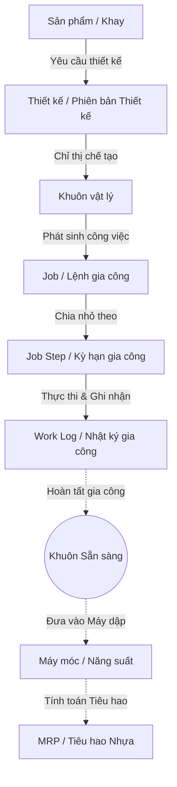
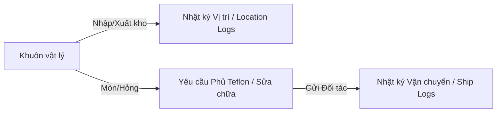

# YSDMS NextGen — Báo cáo Đánh giá Hệ thống Toàn diện

## Tóm tắt Tổng quan
Báo cáo này phân tích lịch sử dự án YSDMS-NextGen, sự tiến hóa của cấu trúc cơ sở dữ liệu (schema) và các luồng nghiệp vụ thực tế dựa trên nội dung trao đổi (transcripts) từ Checkpoint 1, `SCHEMA_REFERENCE.md`, `ysdms-nextgen_MASTER.md` và các truy vấn trực tiếp vào PostgreSQL. Bản phân tích làm rõ những điểm bất nhất giữa luồng nghiệp vụ thực tế và schema hiện tại, đặc biệt nhấn mạnh vào việc thiếu hụt các bảng và trường dữ liệu cho quy trình phủ Teflon và vòng đời khuôn. Đồng thời, báo cáo cũng ghi nhận lại chiến dịch sửa lỗi dữ liệu Công ty quan trọng diễn ra vào ngày 29 tháng 06 năm 2026.

---

## 1. Phân tích Lịch sử Dự án & Transcript Chuyên sâu

### 1.1 Quyết định Kiến trúc & Các Giai đoạn Migration DB
Sự chuyển đổi của YSDMS-NextGen từ hệ thống MS Access cũ (MoldCutterSearch) sang kiến trúc hiện đại Next.js App Router và Supabase được đánh dấu qua các giai đoạn quan trọng sau:
1. **Giai đoạn 1: Đặt Nền móng (Tháng 4 - Tháng 5/2026)**:
   - Khởi tạo các màn hình CRUD cho các thực thể chính: `plastic_master`, `mold_base`, `cutter`, `product_master`, `machine`, `customers`.
2. **Giai đoạn 2: Vòng đời & Mở rộng (Tháng 5/2026)**:
   - *Migration 051 (mold_work_center_foundation)*: Giới thiệu các bảng để quản lý việc nhập/xuất khuôn vật lý, nhật ký Teflon, thay đổi vị trí, và nhật ký vận chuyển ra ngoài.
   - *Migration 055*: Mở rộng các trường dữ liệu cho thiết kế và sản phẩm.
3. **Giai đoạn 3: Hợp nhất Schema V3 (12/06/2026 — Migration 067)**:
   - Trong nỗ lực tối ưu lớn, cấu trúc DB đã được tinh giản từ 6 bảng tooling phức tạp xuống còn 4 bảng cốt lõi: `mold_masters` -> `design_revisions` -> `mold_revisions` -> `physical_molds`.
   - Các bảng `design_masters` và `design_projects` bị xóa bỏ (DROP).
   - Đổi tên các cột kỹ thuật cốt lõi (VD: `product_name_ja` thành `product_name`, `cutline_x_mm` thành `cutline_length`, `piece_count` thành `cavity_count`, `design_length_mm` thành `design_length`).
   - Thêm mã gia công tiêu chuẩn (37 mã từ Access) và sự phụ thuộc giữa các bước công việc (Migration ngày 20/06/2026).
4. **Giai đoạn 4: Tối ưu Lịch trình & Gantt (24 - 29/06/2026 — Từ Migration 073 trở đi)**:
   - Cải tiến `work_logs` (Task Level 3) để lưu trữ `planned_hours`, `planned_date`, và `machine_id` phục vụ cho việc lập kế hoạch Gantt chi tiết.
   - Thêm các trigger cập nhật trạng thái tự động (`auto_status_triggers.sql`) để đồng bộ trạng thái từ Level 3 (work logs) lên Level 2 (job steps) và Level 1 (jobs).

### 1.2 Sự cố Dữ liệu Waitoco (WJD) & Quá trình Sửa lỗi ngày 29/06
* **Phát hiện**: Trong các Step 6090 và 6316, nhóm phát hiện script tạo dữ liệu cũ (`generate_seed_v3.py`) đã bỏ qua hoàn toàn file danh mục sản phẩm `tray.csv` và chỉ tạo sản phẩm bằng `molddesign.csv`. Nó đã map trực tiếp `CustomerID` (thực chất chỉ là ID cục bộ trong `molddesign.csv`) vào cột `companies.company_id`.
* **Hậu quả**: Do lỗi ánh xạ này, khoảng **12,709 liên kết dữ liệu** (trải dài trên các bảng `products`, `mold_masters`, và `design_revisions`) đã bị gắn nhầm cho một công ty duy nhất có ID là `244` (`WJD` - Waitoco of Jupiter Dentsu / ウイトコオブジュピター電通). Điều này khiến gần như toàn bộ khuôn và sản phẩm hiển thị trên UI đều thuộc sở hữu của Waitoco.
* **Giải quyết**: Vào ngày 29/06/2026, nhóm đã chạy script `repair_company_links.py` để đối chiếu chéo các CustomerID cũ từ `customers.csv` và `tray.csv` với tên công ty thực tế. Kết quả đã bổ sung 253 công ty còn thiếu và sửa lại 12,709 liên kết sai trên DB. Một script tiếp nối đã copy `company_id` chuẩn từ `mold_masters` sang `products` để đảm bảo chuỗi hiển thị trên UI hoàn toàn chính xác. V4 Master Seed sau đó đã được cập nhật để ngăn ngừa lỗi này tái diễn.

---

## 2. Tổng hợp Luồng Nghiệp vụ Cốt lõi

Qua rà soát các thảo luận trước đây (đặc biệt trong các phiên "Optimizing YSDMS System Workflow" và "Architecture And Workflow"), luồng nghiệp vụ thực tế đã được thống nhất ĐƠN GIẢN HÓA và đi thẳng vào cốt lõi thực tế sản xuất, bỏ qua các bước trung gian của Database khi nhìn từ góc độ người dùng. 

Luồng cốt lõi xuyên suốt từ Sản phẩm đến khi Gia công hoàn thiện Khuôn được định nghĩa như sau:

### Luồng Chế tạo và Theo dõi Gia công Khuôn (Core Tooling & Job Flow)
Đây là xương sống của hệ thống, nối liền từ phòng Văn phòng -> Thiết kế -> Khuôn -> Sản xuất:

**Sự phù hợp với Cấu trúc Supabase:**
Mặc dù trên DB (Schema V3) có tồn tại các bảng trung gian như `mold_masters` (để gộp chung các phiên bản) và `mold_revisions` (để map vật lý), nhưng quy trình UI và luồng công việc của người dùng tuân thủ đúng trình tự:
1. **Sản phẩm (Product):** Điểm khởi đầu.
2. **Thiết kế (Design Revision):** Được tạo ra và liên kết chặt chẽ với Sản phẩm.
3. **Khuôn vật lý (Physical Mold):** Khởi tạo từ bản Thiết kế đã duyệt.
4. **Job:** Nơi quản lý tổng thể tiến độ chế tạo/sửa chữa của chính Khuôn vật lý đó.
5. **Job Step:** Chia nhỏ Job thành các công đoạn (Phay, Tiện, Đánh bóng...).
6. **Work Log:** Công nhân quét mã vạch và ghi nhận giờ làm, số lượng vật tư tiêu hao vào từng Step.

### Luồng Vòng đời Khuôn và Outsourcing (Teflon)
Sau khi khuôn vật lý hình thành, nó có vòng đời lưu trữ và bảo dưỡng riêng biệt:

---

## 3. Đối chiếu Schema và Thực tế (Lỗ hổng & Điểm bất nhất)

Việc so sánh giữa cấu trúc PostgreSQL đang chạy (được kiểm tra qua Supabase vào ngày 30/06/2026) và các yêu cầu nghiệp vụ vật lý thực tế đã phơi bày một số lỗ hổng nghiêm trọng:

| Lỗ hổng / Bất nhất | Bảng/Cột DB Hiện tại | Yêu cầu Luồng Nghiệp vụ | Mức độ & Tác động |
| :--- | :--- | :--- | :--- |
| **Thiếu Bảng Teflon** | Bảng `mold_teflon_logs` KHÔNG tồn tại trên DB. | Việc phủ Teflon cần một máy trạng thái 4 bước (Yêu cầu, Duyệt, Gửi đi, Nhận về) để theo dõi đối tác gia công ngoài. | **CAO**: Tính năng theo dõi Teflon bị vô hiệu hóa hoàn toàn trên UI; Tab "Teflon" bị ẩn (`enabled: false`), và file `/production/molds/page.tsx` đang gán cứng (hardcode) `teflon_count: 0` và `last_teflon_date: null`. |
| **Thiếu Bảng Vòng đời Khuôn** | Các bảng `mold_status_logs`, `mold_location_logs`, `mold_ship_logs`, và `mold_comments` đều bị thiếu. | Cần có Audit log để ghi lại thay đổi vị trí khuôn, nhật ký gửi đi sửa chữa và ghi chú mỗi lần nhập/xuất kho. | **TRUNG BÌNH**: Không thể lưu nhật ký nhập/xuất. Thiếu nhật ký vị trí dẫn đến việc lịch sử di chuyển không được lưu lại. |
| **Thiếu Cột Teflon trên Khuôn Vật lý** | Bảng `physical_molds` không có cột `teflon_count` hoặc `last_teflon_date`. | Khuôn vật lý phải hiển thị lịch sử Teflon trực tiếp để cảnh báo thợ máy khi khuôn cần được phủ lại. | **CAO**: Không thể tính toán ngưỡng cần phủ lại trên DB; UI đang phải dựa vào các số 0 gán cứng. |
| **Lỗ hổng Theo dõi MRP theo Mét** | Bảng `material_inventory` và `material_transactions` có theo dõi cuộn nhựa gốc, nhưng bảng `machines` lại thiếu cột tiêu chuẩn `feed_length_mm`. | Để tính được mức tiêu hao tấm nhựa chính xác (theo mét) cho mỗi job dập định hình thì bắt buộc phải biết chiều dài nạp nhựa của máy. | **THẤP/TRUNG BÌNH**: Tính năng MRP theo mét (đang đánh dấu `IN_PROGRESS`) cần lưu chiều dài nạp nhựa vào chuỗi JSON `legacy_specs` hoặc tạo thêm cột. |
| **Dư thừa Bảng Plugs (Chày cối)** | Bảng `plugs` có tồn tại trong Schema DB, nhưng lại không được UI sử dụng đến. | Trạng thái của Plug (chày cối) đang được theo dõi trực tiếp thông qua cột `jobs.plug_track_status` và `job_steps.track` (PLUG). | **THẤP**: Cấu trúc bảng dư thừa trên database và đang bị mã nguồn ngó lơ. |

---

## 4. Xác minh & Trích dẫn
* **Xác minh Bảng Teflon**: Đã xác nhận qua truy vấn trực tiếp vào DB bằng Supabase client. Lệnh query vào `mold_teflon_logs` trả về lỗi `PGRST205` ("Could not find the table in schema cache").
* **Trích dẫn Hardcode Khuôn**: Đã xác minh trong file `src/app/production/molds/page.tsx` dòng 120-121, nơi `teflon_count: 0` và `last_teflon_date: null` bị gán cứng bằng tay.
* **Trích dẫn Sửa lỗi Waitoco**: Được ghi nhận trong file `scratch/repair_company_links.py` và Sổ cái `ysdms-nextgen_MASTER.md` Phần 8, Mục 11 (ngày 29/06/2026). Đã sửa thành công 12,709 liên kết sai lệch.
