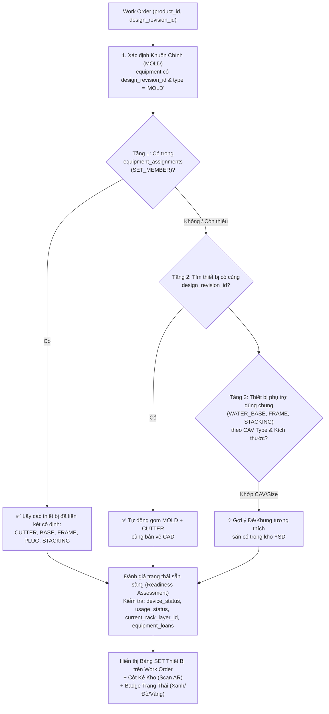

# ADR-010: Work Order UI & Thermoforming Equipment SET Resolution (Chỉ thị Sản xuất Khay & Bộ Thiết bị SET)

**Trạng thái:** PROPOSED (Dự thảo — Chờ PE phê duyệt)  
**Ngày dự thảo:** 2026-09-08  
**Tác giả:** AN (Antigravity Architect)  
**Người quyết định:** Anh Thoan (Product Owner), PE (Perplexity Engineer)  
**Chỉ thị căn cứ:** Chỉ thị #027 (Milestone 19: Work Orders UI & Equipment SET Resolution)  

---

## 1. Bối Cảnh Thực Tế & Vấn Đề Sản Xuất Tại Xưởng YSD

### 1.1 Thực tế sản xuất dập khay định hình (Thermoforming Reality)
Tại xưởng sản xuất YSD, khi có đơn hàng khay từ khách hàng (`orders` $\rightarrow$ `order_lines`), văn phòng hoặc quản đốc phát lệnh sản xuất (`work_orders`). Tuy nhiên, trong thực tế vận hành máy dập định hình khay nhựa, **một chiếc khay không bao giờ được sản xuất chỉ bằng 1 chiếc khuôn đơn lẻ**.

Để một máy định hình (như dòng Rv53B, Rv74C, Rv74D) có thể dập ra sản phẩm khay đạt chuẩn, công nhân vận hành khi nhận phiếu chỉ thị sản xuất (`工程指示票`) bắt buộc phải tập hợp được **đủ một BỘ THIẾT BỊ GÁ LẮP (Tooling SET gồm từ 3 đến 6 món)**:

| STT | Loại thiết bị (`equipment_type`) | Tên tiếng Nhật | Tên tiếng Việt | Vai trò trong quá trình dập khay | Sở hữu & Lưu trữ |
|---|---|---|---|---|---|
| **1** | `MOLD` | 金型 | **Khuôn dập chính** | Khuôn nhôm mang biên dạng lòng khay (Cavity/Core), hút chân không định hình nhựa | Khách hàng sở hữu / Lưu kho kệ YSD |
| **2** | `CUTTER_INLINE` / `CUTTER_SEPARATE` | 抜型 | **Dao cắt viền khay** | Dao dập đứt mép khay rời khỏi cuộn nhựa (cắt dập inline trên máy hoặc máy cắt rời) | Khách hàng sở hữu / Lưu kho kệ YSD |
| **3** | `WATER_BASE` / `PRESSURE_BASE` | 水冷ベース / 圧空ベース | **Đế làm mát / Đế khí** | Gá đỡ khuôn nhôm, lưu thông nước làm nguội nhanh khay hoặc buồng ép khí nén | YSD sở hữu / Dùng chung theo cỡ CAV |
| **4** | `FRAME` (Upper / Lower) | フレーム (上/下) | **Khung kẹp phôi** | Khung kẹp giữ chặt mép màng nhựa khi gia nhiệt và hút định hình | YSD sở hữu / Dùng chung theo cỡ máy |
| **5** | `PLUG` | プラグ | **Chày ép trợ lực** | Chày dập phụ trợ kéo giãn màng nhựa vào sâu trong lòng khay đáy sâu | Khách hàng hoặc YSD sở hữu |
| **6** | `STACKING` | スタッキング | **Gá xếp chồng khay** | Dưỡng xếp dẫn hướng giúp khay sau cắt tự động lồng khít vào nhau | YSD sở hữu / Chế tạo theo mã khay |

---

### 1.2 Nỗi đau vận hành hiện tại (Current Operational Pain Points)
Theo chia sẻ và chỉ đạo trực tiếp từ Anh Thoan:
> *"Khi có chỉ thị sản xuất -> nhân viên nhận chỉ thị -> kiểm tra các nội dung về lịch, thiết bị liên quan, các yêu cầu khác để sản xuất. => quan trọng là mỗi chỉ thị sản xuất (khay) cần phải thể hiện hoặc hướng dẫn được các thiết bị thành set để người dùng tìm được nhanh chóng."*

Hiện tại, hệ thống gặp các hạn chế sau:
1. **Tra cứu phân mảnh:** Phiếu lệnh chỉ có mã khay, công nhân phải tự mở Access CSV cũ hoặc hỏi nhau để tìm xem dao cắt đi kèm là mã gì (khuôn `ADY-071` thì dao cắt là `C-ADY-071` hay mượn dao của `ADY-065`?).
2. **Không biết vị trí lưu kho:** Không biết dao cắt, đế nước, chày ép đang nằm ở tầng kệ nào (`MR-01-L2` hay `CS-02-L1`), mất 30–45 phút đi lùng sục khắp kho xưởng.
3. **Thiếu cảnh báo xung đột tài nguyên:** Không biết thiết bị có đang bị đem đi mài dao ngoài (`OUTSOURCE_PROCESSING`), hay đang bị khách hàng mượn lại (`equipment_loans`), hay đang lắp dở trên máy khác chạy đơn khác. Đến khi gá khuôn lên máy mới phát hiện thiếu dao, gây lãng phí thời gian căn chỉnh máy (setup downtime).

---

## 2. Quyết Định Kiến Trúc (Architectural Decisions)

### Quyết định 1: Thuật toán 3 Tầng Phân Giải SET Thiết Bị (3-Tier SET Resolution Logic)
Khi một `work_order` được tạo cho một sản phẩm (`product_id`) với bản vẽ thiết kế (`design_revision_id`), hệ thống tự động phân giải (resolve) bộ SET thiết bị theo thuật toán 3 tầng ưu tiên:



1. **Tầng 1 (Explicit N:N - Gán cố định):**
   - Tìm các bản ghi trong `equipment_assignments` có `primary_equipment_id = MOLD.equipment_id` và `relationship_type = 'SET_MEMBER'`.
   - Lấy chính xác các thiết bị liên kết (`related_equipment_id`).
2. **Tầng 2 (CAD Revision Matching - Cùng bản vẽ):**
   - Nếu Tầng 1 chưa có dao cắt hoặc phụ trợ, hệ thống quét bảng `equipment` tìm các bản ghi có cùng `design_revision_id` với MOLD (thường dao cắt được kỹ thuật tạo cùng revision với khuôn).
3. **Tầng 3 (Compatible Shared Auxiliary - Tương thích cỡ CAV/máy):**
   - Với `WATER_BASE`, `PRESSURE_BASE`, `FRAME`: Dựa vào `cav_type_id` hoặc kích thước cutline (`cutline_length_mm × cutline_width_mm`) từ `design_revisions` để đề xuất các bộ Base/Khung dùng chung sẵn có của YSD.

---

### Quyết định 2: Ma Trận Đánh Giá Trạng Thái Sẵn Sàng (Readiness Assessment Matrix)
Mỗi thiết bị trong SET sau khi phân giải sẽ được hệ thống gán 1 trạng thái sẵn sàng trực quan:

| Trạng thái Readiness | Biểu tượng & Màu | Điều kiện kỹ thuật | Ý nghĩa với xưởng sản xuất |
|---|---|---|---|
| **`READY`** | 🟢 **Sẵn sàng** | `device_status = 'ACTIVE'`<br>AND `usage_status = 'IN_STOCK'`<br>AND `current_rack_layer_id IS NOT NULL`<br>AND `keeper_company_id = YSD`<br>AND không có phiếu mượn đang active | Đang nằm đúng vị trí kệ kho, đầy đủ điều kiện lấy ra lắp máy dập ngay. |
| **`IN_USE`** | 🔵 **Đang trên máy** | `usage_status = 'IN_USE'` | Thiết bị đang được gá trên máy dập cho một lệnh sản xuất khác. |
| **`MAINTENANCE`** | 🟡 **Đang bảo dưỡng** | `device_status = 'MAINTENANCE'`<br>OR `shots >= maintenance_shot_threshold` | Đang trong xưởng khuôn để sửa, làm sạch, mài dao hoặc vượt ngưỡng shot quy định. |
| **`LOANED_OUT`** | 🟠 **Đang ở ngoài** | Có phiếu trong `equipment_loans` đang `APPROVED` hoặc `IN_TRANSIT`<br>OR `keeper_company_id <> YSD` | Khuôn/dao đang gửi ngoài (khách mượn lại hoặc gửi đi mài/phủ teflon). |
| **`MISSING_RACK`** | ⚪ **Chưa gán kệ** | `current_rack_layer_id IS NULL` | Thiết bị đang ở kho YSD nhưng chưa quét QR định vị tầng kệ (cần rà soát kho). |
| **`MISSING`** | 🔴 **Chưa có thiết bị** | Không tìm thấy thiết bị tương ứng trong DB | Chưa có dao cắt hoặc chưa đăng ký thiết bị (cần tạo mới hoặc gán liên kết). |

---

### Quyết định 3: Khái Niệm `WO Equipment Checklist` & Cổng Phê Duyệt Sản Xuất (Gatekeeper)
1. Trên trang chi tiết Work Order `/production/work-orders/[id]`, thiết kế **Panel riêng biệt: `SET 設備チェックリスト` (Equipment SET Checklist)**.
2. Panel này hiển thị:
   - Danh sách toàn bộ các thành phần trong SET (Khuôn, Dao, Đế nước, Khung kẹp, Chày, Gá xếp).
   - Mã thiết bị, tên hiển thị, kích thước.
   - **Vị trí kệ kho chi tiết** (ví dụ: `MR-01-L2` kèm nút bấm `🔍 Tìm bằng Camera AR` mở trực tiếp M17 AR Scanner với param `?find=CODE`).
   - Badge trạng thái Readiness (Xanh / Đỏ / Vàng).
3. **Cổng kiểm soát (Gatekeeper):**
   - Khi Work Order ở trạng thái `PLANNED` (Chờ sản xuất), hệ thống kiểm tra SET thiết bị.
   - Chỉ khi toàn bộ các thiết bị bắt buộc (`MOLD`, `CUTTER`) đạt trạng thái `READY` (hoặc quản đốc xác nhận "Đã chuẩn bị đủ thiết bị ngoại lệ"), nút chuyển trạng thái `PLANNED → IN_PROGRESS` mới được kích hoạt. Tránh tuyệt đối tình trạng phát lệnh dập khi thiết bị chưa sẵn sàng.

---

### Quyết định 4: Cơ Chế Gợi Ý Sinh Job (Job Auto/Suggest Generation theo ADR-002 & ADR-003)
- Tuân thủ nguyên tắc cốt lõi của ADR-002 và ADR-003: **1 Job = 1 Equipment**.
- Khi một Work Order sản xuất khay chuyển sang `IN_PROGRESS`:
  - Hệ thống cung cấp tùy chọn: `Tạo Jobs chuẩn bị theo SET` (Suggest / Generate Jobs).
  - Tự động sinh danh sách jobs con tương ứng cho từng equipment trong SET (ví dụ: 1 Job gá khuôn `MOLD`, 1 Job kiểm tra lắp dao `CUTTER`, 1 Job chuẩn bị `WATER_BASE`).
  - Mỗi Job có `equipment_id` trỏ đúng vào thiết bị trong SET và `work_order_id` trỏ về WO cha.

---

### Quyết định 5: Phiếu Chỉ Thị Sản Xuất Khay `工程指示票` (PDF Engine Khổ A4 Portrait)
- Xây dựng engine xuất file PDF `工程指示票` (Production Instruction Sheet) chuẩn định dạng nhà máy Nhật Bản:
  - **Khối 1 (Header chỉ thị):** Số phiếu `WO-YYYYMMDD-NNN`, ngày phát lệnh, ngày giao hàng (`出荷納期`), người lập, khách hàng.
  - **Khối 2 (Quy cách sản phẩm):** Mã khay, tên khay, loại nhựa (`plastic_type_designed`), độ dày (`thickness_mm`), số lượng khay cần dập, quy cách đóng gói.
  - **Khối 3 (Bảng SET Thiết Bị — Trọng tâm):**
    - Liệt kê đầy đủ 3–6 thiết bị trong SET.
    - Ghi rõ mã thiết bị, tên thiết bị, kích thước và **Vị trí tầng kệ kho (`棚番: MR-01-L2`)**.
    - In kèm **Mã QR thiết bị** để công nhân xưởng cầm giấy chỉ thị, dùng tablet/điện thoại quét mã đi thẳng đến vị trí kệ kho (liên kết hệ thống M16/M17).
  - **Khối 4 (Xác nhận nghiệm thu & Ký duyệt):** 3 ô con dấu `承認` (Quản đốc), `確認` (Kỹ thuật), `作業者` (Công nhân vận hành dập khay).

---

## 3. Thiết Kế Cơ Sở Dữ Liệu Dự Kiến (Migration 099 Preview)

### 3.1 View `v_work_order_equipment_set`
View SQL tổng hợp mối quan hệ giữa Work Order và toàn bộ thiết bị trong SET:
```sql
CREATE OR REPLACE VIEW public.v_work_order_equipment_set AS
SELECT
  wo.wo_id,
  wo.wo_code,
  wo.wo_name,
  wo.wo_status,
  wo.product_id,
  wo.design_revision_id,
  -- Thiết bị trong SET
  eq.equipment_id,
  eq.equipment_code,
  eq.display_name AS equipment_name,
  eq.equipment_type,
  eq.device_status,
  eq.usage_status,
  eq.keeper_company_id,
  eq.company_id AS owner_company_id,
  eq.current_rack_layer_id,
  -- Vị trí kệ
  rl.layer_code,
  r.rack_code_new AS rack_code,
  r.zone_code,
  -- Phân loại quan hệ SET
  COALESCE(ea.relationship_type, 
    CASE WHEN eq.equipment_id = mold.equipment_id THEN 'PRIMARY_MOLD' ELSE 'DERIVED_SET' END
  ) AS assignment_type,
  -- Đánh giá trạng thái sẵn sàng (Readiness)
  CASE
    WHEN loan.loan_id IS NOT NULL OR eq.keeper_company_id <> ysd.company_id THEN 'LOANED_OUT'
    WHEN eq.device_status = 'MAINTENANCE' THEN 'MAINTENANCE'
    WHEN eq.usage_status = 'IN_USE' THEN 'IN_USE'
    WHEN eq.device_status = 'ACTIVE' AND eq.usage_status = 'IN_STOCK' AND eq.current_rack_layer_id IS NOT NULL THEN 'READY'
    WHEN eq.current_rack_layer_id IS NULL THEN 'MISSING_RACK'
    ELSE 'NOT_READY'
  END AS readiness_status
FROM public.work_orders wo
-- Join tìm MOLD chính
LEFT JOIN public.equipment mold 
  ON mold.design_revision_id = wo.design_revision_id AND mold.equipment_type = 'MOLD'
-- Join qua equipment_assignments (Tầng 1) hoặc fallback cùng design_revision_id (Tầng 2)
LEFT JOIN public.equipment_assignments ea 
  ON ea.primary_equipment_id = mold.equipment_id AND ea.relationship_type = 'SET_MEMBER'
LEFT JOIN public.equipment eq 
  ON eq.equipment_id = COALESCE(ea.related_equipment_id, mold.equipment_id)
LEFT JOIN public.rack_layers rl ON rl.id = eq.current_rack_layer_id
LEFT JOIN public.racks r ON r.id = rl.rack_id
LEFT JOIN public.companies ysd ON ysd.company_code = 'YSD'
-- Kiểm tra có đang cho mượn không
LEFT JOIN public.equipment_loans loan 
  ON loan.equipment_id = eq.equipment_id AND loan.status IN ('APPROVED', 'IN_TRANSIT');
```

### 3.2 Hàm RPC `fn_get_wo_equipment_set(p_wo_id UUID)`
Hàm trả về cấu trúc JSON phân cấp hoàn chỉnh cho giao diện:
- `primary_mold`: Thông tin khuôn dập chính.
- `set_members`: Mảng các thiết bị thành viên (Cutter, Water Base, Pressure Base, Frame, Stacking, Plug).
- `summary`: Số lượng thiết bị yêu cầu, số lượng đã sẵn sàng (`ready_count / total_required`), cờ `is_all_ready` (boolean).

---

## 4. Thiết Kế Giao Diện (UI Architecture)

### 4.1 Danh sách Chỉ Thị Sản Xuất (`/production/work-orders`)
- **Page Anatomy chuẩn:**
  - PageHeader: Icon `ClipboardList`, tiêu đề `Chỉ thị Sản xuất (工程指示票)`, nút `+ Tạo Chỉ thị mới`.
  - 4 KPI Cards:
    - 1. Đang sản xuất (`IN_PROGRESS`)
    - 2. Chờ chuẩn bị (`PLANNED`)
    - 3. Quá hạn deadline (`is_overdue`)
    - 4. Hoàn thành trong tháng (`COMPLETED`)
  - FilterBar: Tabs trạng thái (`Tất cả`, `Chờ chuẩn bị`, `Đang chạy`, `Hoàn tất`), ô tìm kiếm (mã WO, mã khay, khách hàng), bộ lọc ngày deadline.
  - Table: Mã WO (hyperlink), Mã khay & Tên khay, Khách hàng, Sản lượng, **Cột Tóm Tắt SET (Badge hiển thị x/y thiết bị sẵn sàng)**, Hạn xuất hàng, Trạng thái, Thao tác.

### 4.2 Trang Chi Tiết Chỉ Thị Sản Xuất (`/production/work-orders/[id]`)
- **Detail Header Compact:** Nút `← 戻る` và `↑ 一覧`, mã WO, badge trạng thái, nút In PDF `工程指示票`.
- **4 Tab Chuyên Biệt:**
  - **Tab 1: 概要・仕様 (Thông số & Chỉ thị):** Thông tin đơn hàng, số lượng khay, loại màng nhựa (`plastic_type_designed`), độ dày, nhiệt độ dập, quy cách đóng gói.
  - **Tab 2: SET 設備一覧 (Equipment SET Checklist — TRỌNG TÂM):**
    - Hiển thị danh thiếp từng thiết bị trong SET (Khuôn, Dao, Đế, Khung...).
    - Vị trí kệ kho nổi bật kèm nút mở AR Scanner tìm kiếm tức thì.
    - Trạng thái Readiness từng món.
    - Nút `Gán / Đổi thiết bị trong SET` (linh hoạt đổi dao dùng chung hoặc chọn đế nước tương thích).
    - Nút xác nhận `✅ Xác nhận đã chuẩn bị đủ SET`.
  - **Tab 3: ジョブ・工程進捗 (Jobs & Tiến độ):** Danh sách các jobs liên quan đến từng thiết bị trong SET, tiến độ % tổng thể.
  - **Tab 4: 日報・成形実績 (Work Logs & Nhật ký):** Danh sách nhật ký dập khay, số shot đã dập, sản lượng thực tế, số phế phẩm.

---

## 5. Tương Thích Ngược & An Toàn Dữ Liệu

1. **Dữ liệu hiện hữu:** 1,203 `work_orders` hiện có trong database hoàn toàn tương thích, các liên kết `design_revision_id` và `product_id` giữ nguyên.
2. **Kế thừa kiến trúc:**
   - Kế thừa cấu trúc Unified Equipment từ **ADR-001**.
   - Kế thừa mô hình phân tầng 4 cấp từ **ADR-002** (WO $\rightarrow$ Jobs $\rightarrow$ Job Steps $\rightarrow$ Work Logs).
   - Kế thừa nguyên tắc 1 Job = 1 Equipment từ **ADR-003**.
   - Tận dụng quy ước vị trí kệ kho từ **ADR-008** và công nghệ Camera AR Locator từ **Milestone 17**.
   - Liên kết chặt chẽ với kiểm tra trạng thái mượn/trả khuôn từ **ADR-009** (`equipment_loans`).

---

## 6. Lộ Trình Triển Khai (Implementation Roadmap)

| Giai đoạn | Hạng mục | Đầu ra |
|---|---|---|
| **Phase A** | **ADR-010 & Thảo luận phê duyệt** | Bản ADR-010 được PE và Anh Thoan phê duyệt chính thức. |
| **Phase B1** | **Database Migration 099 & Types** | `099_work_order_equipment_set.sql`: View `v_work_order_equipment_set`, RPC `fn_get_wo_equipment_set`, cập nhật TypeScript types. |
| **Phase B2** | **Server Actions & Backend Engine** | `actions.ts`: `getWorkOrders`, `getWorkOrderDetail`, `getWorkOrderEquipmentSet`, `assignEquipmentToSet`, `updateWorkOrderStatus`. |
| **Phase B3** | **PDF Engine `工程指示票`** | Component `@react-pdf/renderer` khổ A4 Portrait, hiển thị bảng SET thiết bị, vị trí kệ và mã QR định vị. |
| **Phase B4** | **UI Dashboard & Detail Page** | Xây dựng route `/production/work-orders` và `/production/work-orders/[id]` với Panel SET Checklist. |
| **Phase B5** | **Quality Gates & Nghiệm thu** | TypeScript 0 errors, i18n đầy đủ tiếng Nhật & tiếng Việt, kiểm thử E2E luồng tạo WO $\rightarrow$ resolve SET $\rightarrow$ xuất PDF. |

---

*Hết bản dự thảo ADR-010. Kính trình PE và Anh Thoan xem xét phê duyệt.*
