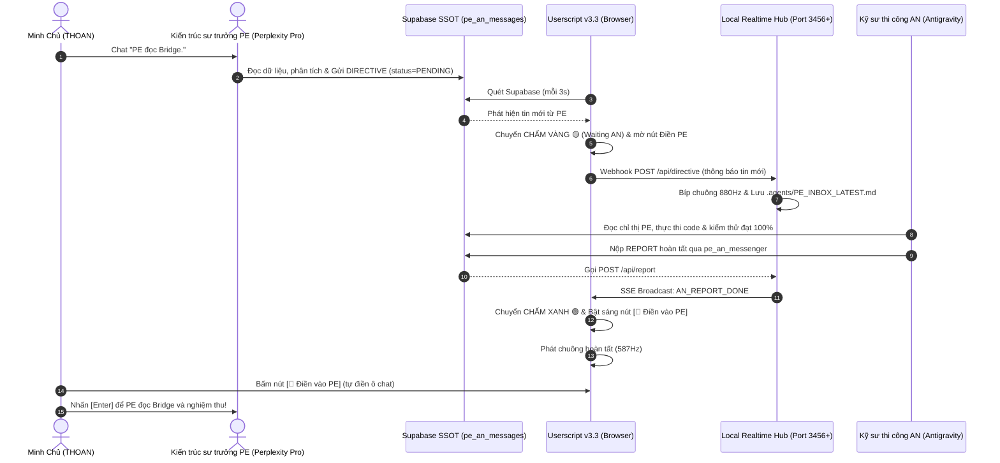

# Đặc Tả Kiến Trúc Kỹ Thuật (PE-AN Realtime Bridge v3.3)

> **Mã tài liệu:** `ARCH-REALTIME-BRIDGE-002`  
> **Cơ chế:** State Machine (Supabase SSOT + Local SSE)

---

## 1. Sơ Đồ Tuần Tự (Sequence Diagram)

---

## 2. Các Trạng Thái Vòng Đời Dữ Liệu (State Machine)

1. **`IDLE` (Xám):** Không có hoạt động hoặc đang tạm dừng.
2. **`WAITING_AN` (Vàng):** Tin nhắn gần nhất trên Supabase là của `PE`. AN đang thi công, nút `[Điền vào PE]` bị khóa.
3. **`READY_PE` (Xanh):** Tin nhắn gần nhất trên Supabase là `REPORT` của `AN`. Nút `[Điền vào PE]` phát sáng xanh ngọc, sẵn sàng để THOAN kích hoạt.
