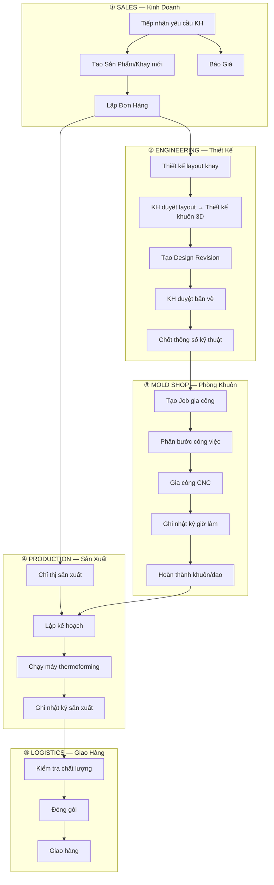
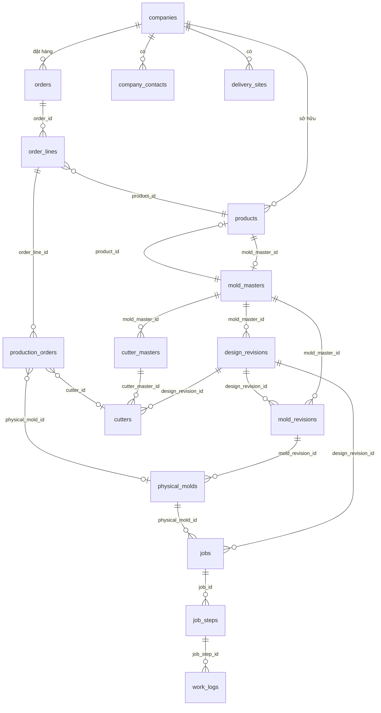
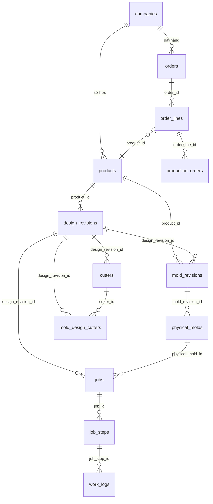

# 01 — LUỒNG NGHIỆP VỤ & MÔ HÌNH DỮ LIỆU (Business Process & Data Model)

> **Phiên bản:** 1.1  
> **Ngày tạo:** 2026-07-02  
> **Cập nhật:** 2026-07-02 (v1.1 — sửa theo feedback user)  
> **Trạng thái:** DRAFT — Chờ User Review  
> **Phạm vi:** Toàn bộ quy trình kinh doanh ヨシダパッケージ (YSD)

---

## MỤC LỤC

1. [Tổng Quan Doanh Nghiệp](#1-tổng-quan-doanh-nghiệp)
2. [Các Bộ Phận & Vai Trò](#2-các-bộ-phận--vai-trò)
3. [Luồng Nghiệp Vụ Tổng Thể](#3-luồng-nghiệp-vụ-tổng-thể)
4. [Chi Tiết Từng Luồng](#4-chi-tiết-từng-luồng)
5. [Quy Tắc Đặt Tên Khuôn (金型命名規則)](#5-quy-tắc-đặt-tên-khuôn-金型命名規則)
6. [Mô Hình Dữ Liệu — Hiện Tại (AS-IS)](#6-mô-hình-dữ-liệu--hiện-tại-as-is)
7. [Mô Hình Dữ Liệu — Mục Tiêu (TO-BE)](#7-mô-hình-dữ-liệu--mục-tiêu-to-be)
8. [Quy Tắc Nghiệp Vụ](#8-quy-tắc-nghiệp-vụ)
9. [Thuật Ngữ (Glossary)](#9-thuật-ngữ-glossary)
10. [Nhật Ký Thay Đổi](#10-nhật-ký-thay-đổi)

---

## 1. Tổng Quan Doanh Nghiệp

### 1.1 Giới Thiệu

**ヨシダパッケージ (Yoshida Package)** là công ty chuyên sản xuất khay nhựa (plastic tray) bằng phương pháp **nhiệt định hình (thermoforming)**.

| Thông tin | Chi tiết |
|-----------|----------|
| **Tên công ty** | ヨシダパッケージ (Yoshida Package) |
| **Website** | http://www.ysd-pack.co.jp/ |
| **Địa chỉ** | 〒212-0055 神奈川県川崎市幸区南加瀬5-36-6 |
| **Viết tắt hệ thống** | YSD |

Sản phẩm chính là các khay nhựa dùng để chứa, bảo vệ và vận chuyển linh kiện điện tử, ô tô, và thiết bị công nghiệp.

### 1.2 Chuỗi Giá Trị

```
Khách hàng yêu cầu → Thiết kế khay → Chế tạo khuôn → Sản xuất khay → Giao hàng
     (Sales)         (Engineering)    (Mold Shop)     (Production)    (Logistics)
```

### 1.3 Sản Phẩm & Công Cụ Chính

| Sản phẩm/Công cụ | Mô tả | Ví dụ mã | Ghi chú |
|-----------|--------|----------|----------|
| **Khay nhựa (Tray/トレイ)** | Sản phẩm cuối, giao cho khách hàng | JAE-036, SMK-167 | Mã nội bộ YSD. Tên sản phẩm theo KH lưu ở `company_pn` |
| **Khuôn nhôm (Mold/金型)** | Khuôn nhôm CNC dùng để ép khay, là tài sản cốt lõi | JAE-036 R2 | Mã/tên phiên bản khuôn — từ đây tra được mọi thông tin liên quan |
| **Dao cắt (Cutter/抜型)** | Dao thép cắt khay nhựa ra khỏi tấm sau khi ép | C-JAE-036-R2 | Tên hiển thị giữ nguyên như phiên bản thiết kế. Mã hệ thống thêm tiền tố `C-` để phân biệt |
| **Plug (プラグ)** | Dụng cụ gỗ hỗ trợ ép tấm nhựa xuống sát mặt pocket của khuôn | - | Thông thường 1 bộ = khuôn nhôm + plug gỗ. Khuôn mỏng có thể không cần plug |

### 1.4 Hệ Thống YSDMS NextGen

**YSDMS** (YSD Manufacturing System) là hệ thống quản lý sản xuất kinh doanh toàn diện, bao gồm:

| Module | Phạm vi |
|--------|---------|
| **Master Data** | Khách hàng, sản phẩm, nhân viên, máy móc, vật liệu |
| **Engineering** | Thiết kế khay/khuôn, phiên bản, thông số kỹ thuật |
| **Equipment** | Quản lý khuôn vật lý, dao cắt, vòng đời thiết bị |
| **Job Management** | Kế hoạch gia công, bước công việc, nhật ký giờ làm |
| **Orders & Sales** | Đơn hàng, báo giá, giao hàng |
| **Production** | Chỉ thị sản xuất, lịch sản xuất, Kanban |
| **Material & Inventory** | Quản lý vật liệu nhựa, xuất nhập kho, tồn kho, cảnh báo, tính toán tự động |
| **Quality** | Kiểm tra chất lượng, báo cáo lỗi |
| **Reports** | Báo cáo năng suất, thống kê |

---

## 2. Các Bộ Phận & Vai Trò (Theo Chuẩn ISO)

Cơ cấu tổ chức bao gồm 7 bộ phận chính và Ban Giám đốc, được thiết kế để chuẩn hóa dữ liệu cho bảng `departments`:

### 2.0 Ban Giám Đốc (CEO / 代表取締役社長)
- **Nhân sự chính:** Ông Yoshida
- Phê duyệt các quyết định quan trọng, định hướng chiến lược.

### 2.1 Kinh Doanh (Sales / 営業部)
- **Nhân sự chính:** Ông Kobayashi, Chị Arai, Chị Sakurai
- Tiếp nhận yêu cầu khách hàng, xử lý Đơn hàng (Order), Báo giá (Quotation).
- Theo dõi tiến độ giao hàng và chăm sóc khách hàng.
- (Arai, Sakurai phụ trách thêm mảng Sales Admin / Nghiệp vụ).

### 2.2 Kỹ Thuật Thiết Kế (Engineering / 設計部)
- **Nhân sự chính:** Anh Quan (3D/Mold), Anh Toản (Hỗ trợ)
- Thiết kế layout khay theo yêu cầu KH → gửi KH duyệt.
- Thiết kế khuôn 3D (CAD), tạo Design Revision và chốt thông số kỹ thuật.

### 2.3 Phòng Khuôn (Mold Shop / 金型部)
- Chế tạo khuôn vật lý (CNC), gia công dao cắt, làm plug (gỗ).
- Quản lý Job gia công (tạo job, phân bước, ghi nhật ký WorkLog).
- Bảo dưỡng và sửa chữa khuôn định kỳ.

### 2.4 Sản Xuất - Định Hình (Forming / 成形部)
- **Nhân sự chính:** Anh Taniguchi, Anh Yamaguchi
- Lên kế hoạch sản xuất và chạy máy ép nhiệt (thermoforming).
- Ghi nhật ký sản xuất (production log) và quản lý năng suất (OEE).

### 2.5 Quản Lý Chất Lượng (QC / 品質管理)
- **Nhân sự chính:** Anh Nakamura
- Kiểm tra chất lượng sản phẩm (Đầu vào, Trong quá trình, Xuất hàng).
- Xử lý hàng NG (phế phẩm) và báo cáo lỗi.

### 2.6 Tổng Vụ & Kho (General Affairs / 総務部)
- Quản lý xuất nhập kho nguyên vật liệu nhựa.
- Quản lý kệ chứa (racks), kho bãi, và logistics giao hàng.
- Hành chính nhân sự chung.

### 2.7 Nhà Máy Aomori (Aomori Factory / 青森工場)
- Chi nhánh sản xuất và lưu trữ tồn kho tại Aomori.

---

## 3. Luồng Nghiệp Vụ Tổng Thể

### 3.1 Sơ Đồ Tổng Quan



### 3.2 Hai Luồng Song Song

Trong thực tế, có **2 luồng song song** từ đơn hàng:

| Luồng | Mô tả | Trigger |
|-------|--------|---------|
| **Luồng Chế Tạo Khuôn (金型製作)** | Thiết kế → Gia công khuôn nhôm + plug gỗ + dao cắt → Hoàn thành | Đơn hàng mới (sản phẩm chưa có khuôn) |
| **Luồng Sản Xuất Khay (成形)** | Chỉ thị SX → Chuẩn bị vật liệu nhựa → Lên lịch máy → Chạy máy thermoforming → Giao hàng | Đơn hàng (sản phẩm đã có khuôn sẵn) |

Luồng Chế Tạo Khuôn phải **hoàn thành trước** khi Luồng Sản Xuất Khay có thể bắt đầu (khuôn phải sẵn sàng).

---

## 4. Chi Tiết Từng Luồng

### 4.1 Luồng Sản Phẩm & Khách Hàng (Master Data)

```
[Khách hàng mới]
  → Tạo company (type: CUSTOMER)
  → Thêm company_contacts (người liên hệ)
  → Thêm delivery_sites (địa chỉ giao hàng)

[Sản phẩm mới]
  → Tạo product: product_code = "JAE-036", product_name = "JAE-036"
  → company_id = khách hàng sở hữu
  → product_status = "ACTIVE"
```

> **QUY TẮC QUAN TRỌNG:** Sản phẩm (Product/Tray) chính là thực thể gốc (Master Entity) đại diện cho cả khay và khuôn. Mã sản phẩm nội bộ YSD (VD: JAE-036) đồng thời là Master Mold Code. Tên sản phẩm, mã sản phẩm từ khách hàng được lưu riêng ở `company_pn`.

### 4.2 Luồng Thiết Kế (Engineering)

```
[Thiết kế phiên bản mới cho sản phẩm JAE-036]

Bước 1: Tạo Design Revision
  → design_code = "JAE036"           (phiên bản gốc, không có R)
  → hoặc "JAE036R1", "JAE036R2"     (phiên bản sửa đổi)
  → mold_master_id = FK đến mold_masters (hiện tại)
  → company_id = khách hàng
  → Nhập thông số kỹ thuật:
    • design_length, design_width, design_height, design_depth (mm)
    • cutline_length, cutline_width (kích thước cắt)
    • cavity_count (số mặt trên 1 khuôn)
    • pocket_numbers (số pocket trên 1 khay)
    • corner_r, chamfer_c, draft_angle
    • undercut_spec, under_depth
    • orientation (普通/逆型), setup_type (上型/下型)
    • has_plug, has_separate_cutter
    • plastic_type_designed (loại nhựa thiết kế)
    • cav_type_id → CAV type (quy cách khung khuôn YSD)

Bước 2: Upload file
  → drawing_pdf_path, step_3d_path, cad_folder_path

Bước 3: Khách hàng duyệt
  → status: DRAFT → SUBMITTED → APPROVED / REJECTED
  → approved_date = ngày duyệt
```

> **Nguồn:** Confirmed từ VBA `btnMoldDesignCreate_Click` trong Access. Khi tạo MoldDesign, Access tự động tạo Tray (Product) nếu chưa có.

### 4.3 Luồng Khuôn Vật Lý (Physical Mold)

```
[Sau khi Design Revision được APPROVED]

Bước 1: Tạo Mold Revision (phiên bản gia công)
  → mold_master_id = FK
  → design_revision_id = bản thiết kế đã duyệt
  → revision_code = "JAE-036 R2"
  → revision_reason = "初回製作" (chế tạo lần đầu)
  → is_active = true

Bước 2: Tạo Physical Mold (khuôn vật lý)
  → system_code = "JAE036R2" (bỏ dấu cách/gạch)
  → display_name = "JAE-036 R2"
  → mold_revision_id = FK đến revision vừa tạo
  → keeper_company_id = YSD (mặc định)
  → current_rack_layer_id = kệ chứa ban đầu
    • Khuôn test (có "D"): rack_layer = 711
    • Khuôn thường: rack_layer = 700
  → device_status, usage_status
```

> **Nguồn:** VBA `btnMoldCreate_Click`. Tên khuôn = tên phiên bản thiết kế.

### 4.4 Luồng Dao Cắt (Cutter / 抜型)

```
[Dao cắt được tạo theo phiên bản thiết kế]

  → cutter_name = "JAE-036" (tên dao)
  → cutter_no = số hiệu được ghi thủ công từ nhân viên xưởng khi dao mới về
    ⚠️ Hiện tại có trùng lặp do nhập tay. Hệ thống mới sẽ xử lý tự động.
  → design_revision_id = FK đến design revision
  → company_id = khách hàng sở hữu
  → Thông số: cutter_length/width/height_mm, cutline_length/width
  → cutter_type: "別抜き" (riêng), "別抜き+In-Line" (kết hợp)
  → keeper_company_id, current_rack_layer_id (vị trí lưu trữ)
```

> **Mối quan hệ nhiều-nhiều:** Một dao cắt có thể dùng cho nhiều design (qua bảng `mold_design_cutters`). Một design có thể dùng nhiều dao cắt.

### 4.5 Luồng Job Gia Công (Mold Shop)

```
[Khi cần gia công khuôn/dao mới hoặc sửa chữa]

Bước 1: Tạo Job
  → job_name = tên khuôn (VD: "JAE-036 R2")
  → job_code = "JAE036R2" (bỏ dấu)
  → design_revision_id = bản thiết kế
  → physical_mold_id = khuôn vật lý (nếu có)
  → job_type_id = loại job (金型新規, 金型修正, カッター...)
  → responsible_id = người phụ trách
  → company_id = khách gia công ngoài (hoặc 社内 = in-house)
  → deadline = hạn giao
  → start_date = ngày bắt đầu
  → year_period, month_period = năm/tháng kế hoạch

  Phân loại tự động & Định nghĩa CAV (đã cập nhật 2026-08-05):
  → Nếu tên khuôn có "D" (như TDW001DR2, TDW001DR3): Phân loại là `試作ポケット` (Khuôn/Bản vẽ thử nghiệm Pocket 1 túi).
  → Nếu khuôn sản xuất chính: Phân loại là `正規金型` (Khuôn chính sản xuất hàng loạt).
  → 📌 **ĐỊNH NGHĨA CAV:** `CAV` là Mã khổ Kích thước ngoài của Khuôn (`actual_length_mm` × `actual_width_mm`) theo tiêu chuẩn YSD (Khổ A: 470x300, Khổ ZD: 470x347...). **KHÔNG PHẢI Pocket Count / Cavity nhỏ!**
  → MachiningCustomerID mặc định = 2 (社内/In-house)

Bước 2: Tạo Job Steps (Bước công việc / ProcessingDeadline)
  → Mỗi job có 1-N steps, phân theo item_type:
    • ItemType 2 = MOLD (bước gia công khuôn)
    • ItemType 3 = PLUG (bước làm plug)
  → Mỗi step có:
    • processing_status_id: 
        1=未確認, 2=プログラム, 3=機械加工, 4=穴あけ, 
        5=ミガキ, 6=プラグ作成, 7=ネル貼り, F=完了, N=進行中
    • deadline = job.deadline - 3 ngày làm việc
    • assigned_to = nhân viên phụ trách
    • machine_id = máy CNC sử dụng

Bước 3: Ghi Nhật Ký Giờ Làm (Work Log)
  → Hàng ngày, nhân viên ghi:
    • job_step_id = bước nào
    • employee_id = ai làm
    • processing_code_id = nội dung công việc
        (10=金型演算＆加工, 11=本型穴あけ, 12=本型ミガキ, 
         13=本型ネル貼り, 30=設計, 31=プラグ演算＆加工...)
    • hours_spent = số giờ (VD: 2.5h)
    • work_date = ngày làm
    • is_finished = hoàn thành chưa
```

> **Nguồn:** VBA `btnJOBcreate_Click`, `btnCreateProcessingMold_Click`. Xác nhận mapping `tblProcessingDeadline → job_steps`, `tblWorkLog → work_logs`.

### 4.6 Luồng Đơn Hàng & Sản Xuất (Orders & Production)

```
[Khách hàng đặt hàng]

Bước 1: Tạo Order
  → order_no = mã đơn hàng
  → company_id = khách hàng
  → order_type: design_tray / design_mold / prototype / mass_production
  → customer_order_no = mã PO của khách

Bước 2: Tạo Order Lines
  → product_id = sản phẩm nào
  → quantity = số lượng
  → material_spec_id = thông số nhựa
  → due_date = hạn giao

Bước 3: Chỉ Thị Sản Xuất (Production Order)
  → Từ order_line → tạo production_order
  → physical_mold_id = khuôn sử dụng (phải sẵn sàng)
  → cutter_id = dao cắt
  → machine_id = máy thermoforming
  → material_type, material_thickness, material_width

Bước 4: Sản Xuất
  → production_lots → production_logs (nhật ký hàng ngày)
  → Ghi: số lượng OK/NG, thời gian, nhân viên

Bước 5: Giao Hàng
  → Tạo shipment từ order
  → delivery_notes (chứng từ giao hàng)
```

### 4.7 Luồng Vòng Đời Thiết Bị (Equipment Lifecycle)

```
[Quản lý khuôn/dao sau khi sản xuất xong]

Bảo dưỡng: mold_maintenance (loại, chi phí, nhà cung cấp)
Đo lường: mold_measurements (kích thước thực tế, sai lệch)
Ảnh chụp: mold_photos
Di chuyển: mold_location_history (chuyển kệ)
Thay đổi tên: mold_name_history
Kiểm kê: mold_inventory_checks → mold_inventory_items
Cho mượn: mold_loan_certificates
Trả về: mold_return_logs
Hủy bỏ: mold_disposal_logs
QR Label: mold_owner_qr_labels
```

### 4.8 Vòng Đời Sản Phẩm (Product Lifecycle) - 9 Giai Đoạn

Làm cơ sở để thiết lập biến `status` cho toàn bộ quy trình:

1. **Hỏi hàng (Inquiry / 引き合い):** KH gửi yêu cầu, thông số, bản vẽ sơ bộ.
2. **Báo giá (Quote / 見積もり):** Tính toán chi phí khuôn, chi phí sản phẩm (vật liệu, thời gian ép).
3. **Thiết kế (Design / 設計):** Lên bản vẽ layout khay → duyệt → thiết kế khuôn 3D (Design Revision).
4. **Phê duyệt (Approval / 承認):** KH ký duyệt bản vẽ (Status: APPROVED).
5. **Làm khuôn (Mold Making / 金型製作):** Tạo Job, phay CNC khuôn nhôm, làm dao cắt, plug (Physical Mold).
6. **Thử nghiệm (Prototype / 試作):** Ép thử mẫu (thường kèm chữ `D` trong tên khuôn) để kiểm tra pocket.
7. **Lượng sản (Mass Production / 量産):** Bắt đầu nhận PO số lượng lớn, lên kế hoạch chạy máy, đóng gói.
8. **Cải tiến/Sửa đổi (Revision / 修正):** Khách yêu cầu đổi thiết kế → tạo `R2`, sửa khuôn vật lý hoặc làm khuôn mới.
9. **Kết thúc (End of Life / 廃棄):** Vòng đời khuôn kết thúc, chờ thanh lý hoặc tiêu hủy.

---

## 5. Quy Tắc Đặt Tên Khuôn (金型命名規則)

> **Nguồn:** Thảo luận chi tiết ngày 2026-06-03, confirmed bởi dữ liệu Access (moldmaster.csv, moldrevision.csv, cav.csv)

### 5.1 Cấu Trúc Tên Khuôn

```
JAE-001AB-R2-D-N01
─┬── ─┬─ ┬─ ─┬ ┬ ─┬─
 │    │  │   │ │  │
 │    │  │   │ │  └─ Số bản sao (Copy No: N01, N02...)
 │    │  │   │ └──── Loại khuôn (M=chính quy / D=試作ポケット/test)
 │    │  │   └────── Phiên bản (R1, R2, R3... Phiên bản đầu R1 = bỏ qua)
 │    │  └────────── Biến thể (A, B, AB, T, BT, Type1...)
 │    └───────────── Số thứ tự (001~999, liên tục theo KH)
 └────────────────── Mã khách hàng (2~5 ký tự chữ, trùng thì thêm số)
```

### 5.2 Chi Tiết Từng Trường

| Trường | Bắt buộc | Định dạng | Quy tắc | Ví dụ |
|--------|:--------:|-----------|---------|-------|
| **Mã KH** (客先コード) | ✅ | Chữ 2~5 ký tự (+số nếu trùng) | Kinh doanh (営業) quyết định | `JAE`, `MICS`, `MISC2` |
| **Số TT** (連番) | ✅ | 3 chữ số (001~999) | Liên tục trong cùng KH | `001`, `335` |
| **Biến thể** (型式) | △ | Chữ 1~4 ký tự | Bỏ qua nếu không có | `A`, `B`, `AB`, `T`, `BT` |
| **Phiên bản** (版) | △ | R + số | R1 = bỏ qua. Chỉ ghi khi sửa đổi | `R2`, `R3` |
| **Loại** (種別) | △ | M hoặc D | M (chính quy) = mặc định bỏ qua. D (test) = bắt buộc ghi | `D`, `M` |
| **Bản sao** (複製) | △ | N + 2 chữ số | Bỏ qua nếu không có bản sao | `N01`, `N02` |

### 5.3 Ví Dụ Thực Tế

```
=== Cơ bản ===
JAE-001          → KH JAE, số 001, phiên bản đầu, chính quy, đơn chiếc
                   (= JAE-001-R1-M-N00 dạng đầy đủ)

=== Biến thể ===
JAE-001AB        → AB tray (nắp và thân hoặc 2 thiết kế kết hợp)
JAE-001A         → A型 đơn thể
JAE-001T         → Top型
JAE-001BT        → Bottom+Top kết hợp

=== Sửa đổi ===
JAE-001-R2       → Phiên bản sửa đổi lần 2
JAE-001AB-R2     → AB tray, phiên bản sửa đổi lần 2

=== Khuôn test (試作ポケット) ===
JAE-001-D        → Khuôn test (D = 試作, dùng thử/bỏ)
JAE-001-D-R1     → Test khuôn phiên bản sửa đổi (hiếm nhưng có)

=== Khuôn chính quy nhỏ (tránh nhầm với D) ===
JAE-001-M        → Khuôn nhỏ nhưng chính quy, ghi M để phân biệt

=== Bản sao ===
JAE-001-N01      → Bản sao số 1 (cùng thiết kế)
JAE-001AB-R2-N01 → AB tray, phiên bản 2, bản sao 1
```

### 5.4 Ba Tầng Tên (3-Layer Structure)

**Khuôn (Mold):**

| Tầng | Dùng cho | Ví dụ | Ghi chú |
|:----:|----------|-------|---------|
| `system_code` | DB key, QR code | `JAE-001AB-R2-N01` | Dấu gạch, không khoảng trắng |
| `display_name` | Hiển thị màn hình, biểu mẫu | `JAE-001 AB R2 N01` | Khoảng trắng, dễ đọc |
| `physical_stamp` | Khắc/dán trên khuôn vật lý | `JAE-001AB R2` | Có thể bỏ N01 khi khắc |

**Dao cắt (Cutter) — Tiền tố `C-`:**

| Tầng | Dùng cho | Ví dụ | Ghi chú |
|:----:|----------|-------|---------|
| `system_code` | DB key, QR/Barcode | `C-JAE-036-R2` | Tiền tố `C-` + mã thiết kế. Barcode-compatible |
| `display_name` | Hiển thị màn hình | `JAE-036 R2` | Giữ nguyên như phiên bản thiết kế |
| `physical_stamp` | Dán/khắc trên dao | `C-JAE-036 R2` | Tiền tố C- để phân biệt với khuôn |

> **Quy tắc khắc vật lý:** Khi sửa đổi khuôn, chỉ khắc thêm R2 bên phải. Phần bên trái (KH+số+biến thể) không thay đổi.

### 5.5 CAV Type (Quy Cách Khung Khuôn)

CAV Type là hệ thống phân loại nội bộ YSD cho kích thước khung khuôn/đế nước lạnh:

| CAV | Kích thước (mm) | CAV | Kích thước (mm) |
|:---:|:---------------:|:---:|:---------------:|
| A | 470×300 | N | 478×192 |
| B | 335×265 | O | 420×220 |
| C | 499×347 | P | 443×246 |
| D | 354×300 | Q | 310×210 |
| E | 430×260 | R | 310×240 |
| F | 340×285 | S | 385×265 |
| G | 320×195 | T | 390×330 |
| H | 300×246 | U | 498×245 |
| I | 405×300 | V | 355×240 |
| J | 338×175 | W | 492×270 |
| K | 503×273 | Y | 435×312 |
| L | 416×336 | Z | 355×260 |
| M | 500×330 | ZA~ZE | các kích thước đặc biệt |

**Phân biệt D trong tên khuôn vs CAV Type D:**
- `JAE-001-D` = khuôn test (ký tự D sau dấu gạch)
- `JAE-001[D]` = CAV Type D kích thước 354×300 (dùng ngoặc vuông)

> CAV Type KHÔNG nằm trong `system_code`. Lưu riêng ở cột `cav_type_id` trong DB.

### 5.6 Dữ Liệu Thực Tế Từ Access

| Nguồn | Ví dụ | Giải đọc |
|-------|-------|----------|
| moldmaster.csv | `ADY-078` | Khuôn đầu, KH ADY |
| moldmaster.csv | `ADY-078B` | Biến thể B (Body) |
| moldmaster.csv | `ADY-078T` | Biến thể T (Top) |
| moldrevision.csv | `CHG-004D R1` | Test khuôn D, phiên bản R1 |
| moldrevision.csv | `TE-6-161-1 R2` | KH TE, mã đặc biệt, R2 |
| moldrevision.csv | `JAE-363D` | Test khuôn (D cuối, R1 bỏ qua) |
| moldrevision.csv | `JAE-036 ZF` | Biến thể ZF |

### 5.7 QR Code System (Thiết kế)

| Mục | Thông số |
|-----|----------|
| **Định dạng** | QR Code Model 2 |
| **Nội dung** | `https://ysdms.app/m/{UUID}` → quét = mở thẳng trang chi tiết |
| **Kích thước** | 30mm × 30mm |
| **Vật liệu** | Tấm kim loại chịu nhiệt hoặc nhãn ceramic |
| **Vị trí** | Mặt không thành hình (cạnh/đáy) |
| **Backup** | Barcode Code128 (phòng QR hỏng) |

---

## 6. Mô Hình Dữ Liệu — Hiện Tại (AS-IS)

### 6.1 Sơ Đồ Quan Hệ Thực Thể (ERD)



### 6.2 Chuỗi Dữ Liệu Sản Phẩm-Khuôn (Chi Tiết)

```
companies (Khách hàng)
  └→ products (Sản phẩm/Khay)
      └→ mold_masters (Master khuôn — ⚠️ TRÙNG LẶP VỚI products)
          ├→ design_revisions (Phiên bản thiết kế)
          │   ├→ [thông số: 46 cột bao gồm kích thước, cutline, cavity, undercut...]
          │   ├→ cutters (Dao cắt — link trực tiếp)
          │   ├→ mold_design_cutters (Junction: design ↔ cutter, many-to-many)
          │   └→ jobs (Job gia công)
          │
          ├→ mold_revisions (Phiên bản gia công)
          │   └→ physical_molds (Khuôn vật lý trên kệ)
          │       ├→ mold_maintenance, mold_measurements, mold_photos
          │       ├→ mold_location_history, mold_name_history
          │       ├→ mold_disposal_logs, mold_return_logs
          │       └→ mold_inventory_items → mold_inventory_checks
          │
          └→ cutter_masters (Master dao cắt — ⚠️ CÓ THỂ THỪA)
              └→ cutters (Dao cắt vật lý)
```

### 6.3 Vấn Đề Với Mô Hình Hiện Tại

| Vấn đề | Mô tả | Ảnh hưởng |
|---------|--------|-----------|
| **products ↔ mold_masters trùng lặp** | Cả 2 bảng đều đại diện cho cùng 1 thực thể (sản phẩm/khay gốc). FK vòng tròn: `products.mold_master_id → mold_masters` VÀ `mold_masters.product_id → products` | Dữ liệu trùng, khó bảo trì |
| **cutter_masters có thể thừa** | Vai trò giống mold_masters — nhóm dao cắt theo sản phẩm. Cutters đã có FK trực tiếp đến `design_revisions` | 1 tầng trung gian không cần thiết |
| **mold_design_cutters FK hỏng** | Cột `mold_design_id` không có FK constraint đến `design_revisions` (lỗi từ khi DROP `mold_designs`) | Junction table không hoạt động |

---

## 7. Mô Hình Dữ Liệu — Mục Tiêu (TO-BE)

### 7.1 Thay Đổi Chính

| # | Thay đổi | Lý do | Trạng thái |
|---|----------|-------|------------|
| 1 | **Merge `mold_masters` vào `products`** | products = master entity cho cả khay và khuôn. Loại bỏ FK vòng tròn | APPROVED by user |
| 2 | **Loại bỏ `cutter_masters`** | Cutters link trực tiếp qua `design_revisions`. cutter_masters chỉ là layer trung gian không cần thiết | APPROVED by user |
| 3 | **Fix FK `mold_design_cutters`** | Thêm FK constraint `mold_design_id → design_revisions.revision_id` | APPROVED by user |
| 4 | **Giữ nguyên tên `physical_molds`** | Đúng ngữ pháp tiếng Anh. Chi phí đổi tên >> lợi ích | APPROVED by user |
| 5 | **Bổ sung các chứng từ (Báo giá, Đặt hàng, Hóa đơn, Giao hàng)** | Sẽ bổ sung ở Phase sau. Hệ thống sẽ tự động tạo các phiếu/chứng từ theo mẫu có sẵn từ dữ liệu nhập | APPROVED by user |

### 7.2 ERD Mục Tiêu (Sau Merge)



### 7.3 Chuỗi Dữ Liệu Mục Tiêu

```
companies (Khách hàng)
  └→ products (Sản phẩm = Master Entity)
      │   ← absorbs mold_masters: thêm cột designer_id, cad_folder_path, 
      │     mold_class, mold_source, mold_master_code → product_code
      │
      ├→ design_revisions (Phiên bản thiết kế — 46 cột)
      │   ├→ cutters (Dao cắt — link trực tiếp, KHÔNG qua cutter_masters)
      │   ├→ mold_design_cutters (Junction: design ↔ cutter)
      │   └→ jobs (Job gia công)
      │       └→ job_steps (Bước công việc)
      │           └→ work_logs (Nhật ký giờ làm)
      │
      └→ mold_revisions (Phiên bản gia công)
          └→ physical_molds (Khuôn vật lý)
              └→ [lifecycle tables: maintenance, photos, disposal...]
```

### 7.4 Chi Tiết Migration Plan (products absorbs mold_masters)

```sql
-- BƯỚC 1: Thêm cột mới vào products
ALTER TABLE products ADD COLUMN designer_id UUID REFERENCES employees(employee_id);
ALTER TABLE products ADD COLUMN cad_folder_path TEXT;
ALTER TABLE products ADD COLUMN mold_class TEXT DEFAULT 'STD';
ALTER TABLE products ADD COLUMN mold_source TEXT DEFAULT 'INTERNAL';

-- BƯỚC 2: Copy dữ liệu từ mold_masters → products
UPDATE products p SET
  designer_id = mm.designer_id,
  cad_folder_path = mm.cad_folder_path,
  mold_class = mm.mold_class,
  mold_source = mm.mold_source
FROM mold_masters mm WHERE p.mold_master_id = mm.mold_master_id;

-- BƯỚC 3: Đổi FK references
ALTER TABLE design_revisions 
  ADD COLUMN product_id UUID REFERENCES products(product_id);
UPDATE design_revisions dr SET product_id = mm.product_id 
  FROM mold_masters mm WHERE dr.mold_master_id = mm.mold_master_id;
-- Tương tự cho mold_revisions, jobs...

-- BƯỚC 4: Drop old FKs and mold_masters table
-- (Chỉ thực hiện sau khi xác nhận 100% dữ liệu đúng)

-- BƯỚC 5: Drop cutter_masters
-- Chuyển cutters.cutter_master_id → NULL (cutters đã có design_revision_id)
ALTER TABLE cutters DROP CONSTRAINT cutters_cutter_master_id_fkey;
ALTER TABLE cutters DROP COLUMN cutter_master_id;
DROP TABLE cutter_masters;
```

> ⚠️ **LƯU Ý:** Migration plan này CẦN USER APPROVAL trước khi thực hiện. Hiện tại chỉ là TÀI LIỆU, chưa phải action.

---

## 8. Quy Tắc Nghiệp Vụ

> Quy tắc đặt tên khuôn chi tiết xem [Section 5: Quy Tắc Đặt Tên Khuôn](#5-quy-tắc-đặt-tên-khuôn-金型命名規則)

### 8.1 Quy Tắc Đặt Tên — Tóm Tắt

| Entity | Pattern | Ví dụ | Ghi chú |
|--------|---------|-------|---------|
| **Product/Master Mold** | `{Customer}-{Number}` | JAE-036, SMK-167 | Mã nội bộ YSD. Tên theo KH lưu ở `company_pn` |
| **Design Revision** | `{Customer}-{Number} {Version}` | JAE-036 R2 | Space trước version |
| **Design Code** | `{bỏ dấu cách & gạch}` | JAE036R2 | Dùng cho system_code |
| **Physical Mold** | = Design Revision name | JAE-036 R2 | Cùng tên với design |
| **Mold Copy** | `{Name}-N{n}` | JAE-036 R2-N1 | Bản sao khuôn |
| **Job** | = Mold name | JAE-036 R2 | Job đặt tên theo khuôn |
| **Cutter system_code** | `C-{Design Code}` | C-JAE-036-R2 | Tiền tố `C-` + mã thiết kế, barcode-compatible |
| **Cutter display_name** | = Design Revision name | JAE-036 R2 | Giữ nguyên tên thiết kế, không thêm tiền tố |

### 8.2 Quy Tắc Phân Loại Khuôn Test

> Quy tắc này nằm trong hệ thống đặt tên khuôn. Xem chi tiết tại [Section 5](#5-quy-tắc-đặt-tên-khuôn-金型命名規則).

Khuôn test (試作ポケット / Pocket Mold) được nhận diện qua ký tự **D** trong tên khuôn:
- `JAE-001-D` → Khuôn test (ký tự D sau dấu gạch)
- `CHG-004D R1` → Khuôn test phiên bản R1 (D trước R)
- `JAE-363D` → Khuôn test (D cuối, không có R = R1)

**Lưu ý phân biệt D và CAV Type D:**
- `JAE-001-D` = khuôn test (ハイフン区切り)
- `JAE-001[D]` = CAV Type D 354×300 (角括弧で囲む)

Khi tạo Job cho khuôn test: `processing_item_id = 2` (試作ポケット)

### 8.3 Quy Tắc Deadline

- **Job Deadline** = `DeliveryDeadline` (từ đơn hàng hoặc nhập tay)
- **Job Step Deadline** = `Job Deadline - 3 ngày làm việc` (tự động tính, bỏ qua T7/CN)

### 8.4 Quy Tắc Trạng Thái

**Design Revision Status:**
```
DRAFT → SUBMITTED → APPROVED / REJECTED
```

**Job Status:**
```
PENDING → IN_PROGRESS → COMPLETED / CANCELLED
```

**Processing Status (Job Step):**
```
1.未確認 → 2.プログラム → 3.機械加工 → 4.穴あけ → 5.ミガキ → 6.プラグ作成 → 7.ネル貼り → F.完了
                                                                                    ↕
                                                                               N.進行中
特殊: ZF.材料有, ZN.材料待ち, ZR.材料Request, R.REQUEST
```

**Mold Usage Status:**
```
ACTIVE → MAINTENANCE → BROKEN → DISPOSED
```

### 8.5 Quy Tắc MachiningCustomer (Nơi Gia Công)

| ID | Tên | Mô tả |
|----|-----|-------|
| 1 | 茨城 | Nhà máy gia công Ibaraki (Maruda Co.) |
| 2 | **社内** | **In-house (mặc định cho hầu hết job)** |
| 3 | 坂田精文堂 | Sakata Seibundo (outsource) |
| 4 | 日三化成 | Nissan Kasei (outsource) |
| 5 | 青森工場 | Nhà máy Aomori |

### 8.6 Quy Tắc Về `omni_*` Tables

> **CẤM TUYỆT ĐỐI:** Các bảng `omni_*` (omni_custom_cards, omni_fsrs_cards, omni_master_grammar, omni_master_kanji, omni_master_shadowing, omni_master_vocab, omni_profiles, omni_streaks) thuộc **ứng dụng học tiếng Nhật riêng biệt** chạy chung tài khoản Supabase. **KHÔNG ĐƯỢC ĐỌC, SỬA, XÓA** bất kỳ bảng `omni_*` nào.

---

## 9. Thuật Ngữ (Glossary)

> Toàn bộ Từ điển Dữ liệu và Thuật ngữ chi tiết (Single Source of Truth) đã được di chuyển sang tài liệu riêng biệt để quản lý tập trung.

👉 **Vui lòng xem chi tiết tại:** [`08_data_dictionary.md`](file:///d:/AntiGravity_Workspace/apps/ysdms-nextgen/docs/technical/08_data_dictionary.md)

---

## 10. Nhật Ký Thay Đổi

| Ngày | Phiên bản | Nội dung | Phê duyệt |
|------|-----------|----------|------------|
| 2026-07-02 | 1.0 | Tạo mới — Tổng hợp từ VBA analysis, architecture V3, business flow handover, schema audit | DRAFT |
| 2026-07-02 | 1.1 | Sửa: tên công ty → ヨシダパッケージ, thêm module Material & Inventory, sửa luồng Engineering (layout trước → khuôn sau), thêm quy tắc đặt tên khuôn (Section 5), sửa Plug = gỗ hỗ trợ, sửa cutter_no = thủ công, bỏ "Tooling" cho dao cắt/thiết bị | Review |
| 2026-07-02 | 1.2 | Cập nhật 7 bộ phận chuẩn ISO, bổ sung 9 giai đoạn vòng đời, di dời Glossary sang 08_data_dictionary.md, chốt phương án cho chứng từ ở Phase sau | APPROVED |
| 2026-08-06 | 1.3 | Cập nhật Quy trình Sở hữu Khuôn, Luồng Check-in/Check-out chi tiết, Trả khuôn, Vận chuyển, Hủy khuôn, Kiểm kê và Quy trình mạ Teflon 4 bước tự động | APPROVED |

---

## 11. Quy Trình Quản Lý Vòng Đời & Luồng Tương Tác Thiết Bị (Check-in/out, Return, Transfer, Scrap, Audit & Teflon)

### 11.1 Sở Hữu & Quy Tắc Mã Khuôn
- **Khuôn thuộc sở hữu Khách hàng (Customer-Owned Molds):**
  - Khách hàng cho YSD mượn khuôn để sản xuất khay nhựa. Khi có đơn hàng khuôn/khay mới, YSD thiết kế & chế tạo khuôn $\rightarrow$ Khách hàng thanh toán tiền khuôn $\rightarrow$ YSD lưu trữ, quản lý và cấp Giấy chứng nhận mượn/gửi khuôn (借用書 / 保管証明書).
  - **Quy tắc mã khuôn:** Mã khuôn bắt đầu bằng tên viết tắt của Công ty Khách hàng (VD: `KSP-216` cho Kokusai Printing, `ADY-071` cho Adokawa, `JAE-352` cho JAE, `SSM-032` cho Sasama...).
  - **Công ty lưu giữ ban đầu (`keeper_company_id`):** Mặc định YSD (`社内` - YSD HQ / Chi nhánh).

- **Khuôn thuộc sở hữu YSD (YSD-Owned Molds):**
  - Khuôn do chính YSD thiết kế và làm chủ sở hữu. Thường có hình dáng tiêu chuẩn, đơn giản, phục vụ các loại khay phổ thông tái sử dụng cho nhiều khách hàng.
  - **Công ty lưu giữ (`keeper_company_id`):** YSD (`社内`).

---

### 11.2 Các Kịch Bản Xuất Kho (OUT) & Luồng Tương Tác
Khuôn được lưu trữ tại tầng kệ (`RackLayerID`). Khi khuôn rời khỏi vị trí kệ, trạng thái chuyển thành `OUT`. Trạng thái công ty lưu giữ và nhật ký ghi nhận phụ thuộc vào lý do xuất kho:

| Hành động | Mục đích / Lý do | Công ty lưu giữ (`keeper_company_id`) | Trạng thái (`usage_status`) | Ghi nhật ký hệ thống |
|-----------|------------------|----------------------------------------|-----------------------------|-----------------------|
| **1. Check-out Nội Bộ (Tạm thời)** | Ép khay định hình (Máy 6...), phòng chụp ảnh, sửa khuôn | YSD (`社内`) | `OUT` | `equipment_movements` (MovementType: `CHECK_OUT`, `destination_id`, `employee_id`) |
| **2. Gửi Mạ Teflon** | Xuất khuôn sang nhà mạ Teflon | Nhà cung cấp Teflon (VD: TEFLON Supplier) | `OUT` | `equipment_movements` (MovementType: `TEFLON_OUT`), `equipment_history`, `jobs` |
| **3. Trả Khuôn (Return)** | Trả khuôn về cho Công ty khách hàng sở hữu khuôn | Công ty Khách hàng (`company_id`) | `OUT` | `equipment_movements` (MovementType: `RETURN`), `equipment_history`, `shiplog` |
| **4. Vận Chuyển Chi Nhánh (Transfer)** | Luân chuyển khuôn giữa các nhà máy / chi nhánh / HQ YSD | Chi nhánh / Công ty YSD tiếp nhận | `OUT` | `equipment_movements` (MovementType: `TRANSFER`), `shiplog` |
| **5. Hủy Khuôn (Scrap/Disposal)** | Thanh lý, hủy khuôn do hỏng/mòn/đổi thiết kế | Công ty Hủy (`DISPOSED`) | `DISPOSED` | `equipment_movements` (MovementType: `SCRAP`), `equipment_history` |

---

### 11.3 Luồng Nhập Kho (IN), Thay Đổi Vị Trí (Relocate) & Kiểm Kê (Audit)

1. **Check-in (Nhập kho):**
   - Đưa khuôn trở lại giá kệ $\rightarrow$ Bấm nút **IN (Nhập kho)** $\rightarrow$ Chọn nhân viên thực hiện $\rightarrow$ Trạng thái chuyển thành `IN`, cập nhật `current_rack_layer_id`, công ty giữ = YSD.

2. **Thay Đổi Vị Trí (Relocate):**
   - Áp dụng khi trả khuôn về kệ nhưng vị trí cũ đã đầy, hoặc muốn đổi sang vị trí kệ mới.
   - Cho phép chọn vị trí `RackLayerID` mới $\rightarrow$ Có checkbox **Tự động Check-in** (khi tick chọn, tự động đổi trạng thái `IN` và gán vị trí mới).

3. **Kiểm Kê Tại Vị Trí (Audit - 棚印):**
   - Xác nhận khuôn vẫn nằm trên giá kệ mà không cần lấy ra hay di chuyển.
   - Bấm nút **Kiểm kê (棚印)** $\rightarrow$ Chọn nhân viên thực hiện $\rightarrow$ Cập nhật cờ `on_checklist = true`, lưu ngày xác nhận `last_audit_date`, trạng thái giữ nguyên hoặc đặt là `AUDIT`.

---

### 11.4 Quy Trình Mạ Teflon (Teflon Coating 4-Step Flow)
Mô-đun quản lý quy trình mạ Teflon được tự động nhận diện và cập nhật trạng thái theo 4 bước liên hoàn (hỗ trợ cả thao tác trong cùng 1 ngày hoặc rời rạc qua nhiều ngày):

```
┌───────────────────────────┐      ┌───────────────────────────┐
│  Bước 1: REQUEST          │ ────►│  Bước 2: APPROVED         │
│  処理依頼 (Yêu cầu mạ)    │      │  承認済 (Đã duyệt chờ mạ) │
└───────────────────────────┘      └───────────────────────────┘
 (NVKD / KTV lập yêu cầu)           (Khách hàng / Quản lý duyệt)
              │                                  │
              ▼                                  ▼
┌───────────────────────────┐      ┌───────────────────────────┐
│  Bước 3: SENT             │ ────►│  Bước 4: COMPLETED        │
│  加工中 (Đã gửi / Đang mạ)│      │  完了 (Đã nhận về/Hoàn tất│
└───────────────────────────┘      └───────────────────────────┘
 (Xuất khuôn cho nhà mạ)            (Nghiệm thu & trả về YSD)
```

- **Cơ chế tự nhận diện bước tiếp theo (Auto-State Progression):**
  - Khi mở popup mạ Teflon cho một khuôn, hệ thống tự động kiểm tra bản ghi mạ gần nhất (`teflon_log` / `jobs`).
  - Nếu trạng thái trước đó là `REQUESTED`, hệ thống đề xuất ngay Bước 2 (`APPROVED`).
  - Nếu đã `APPROVED`, đề xuất Bước 3 (`SENT` - tự động kích hoạt Check-out & đổi `keeper_company_id` sang nhà mạ).
  - Nếu đang `SENT`, đề xuất Bước 4 (`COMPLETED` - cập nhật `is_teflon = true`, nhận khuôn về kho YSD).

