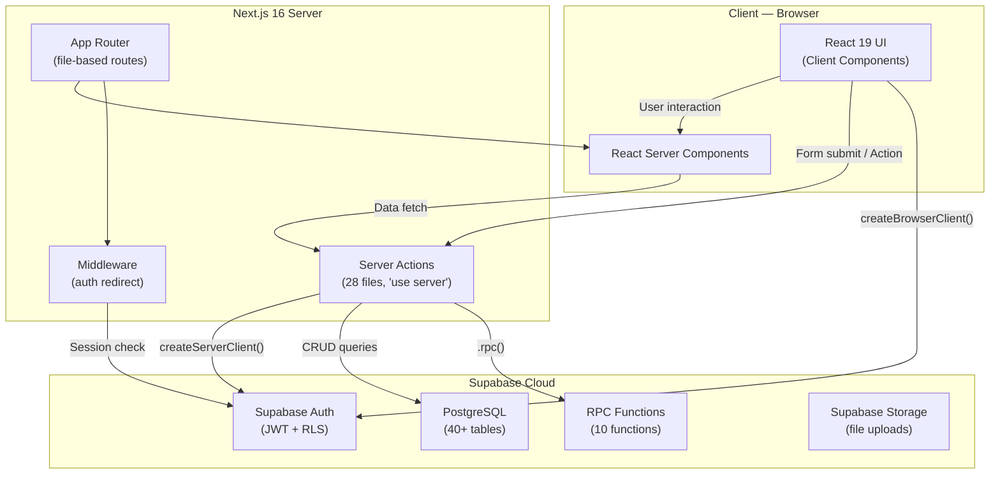
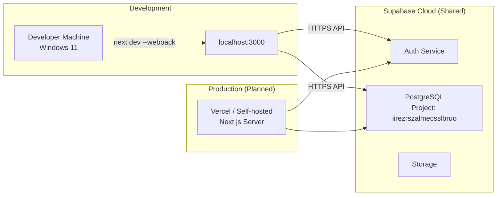
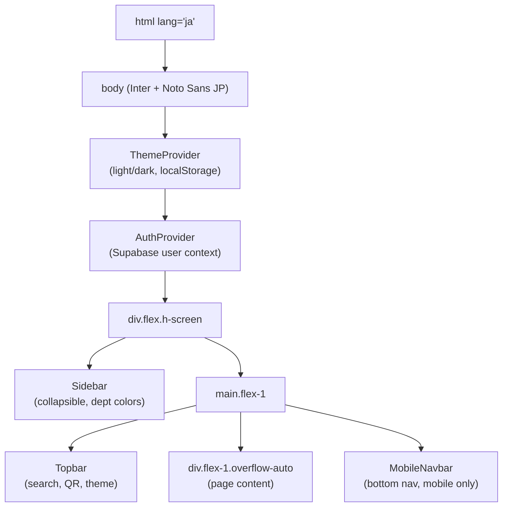
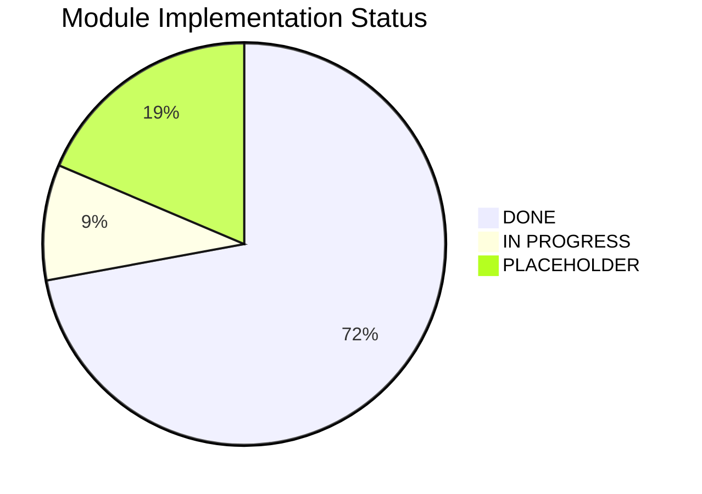
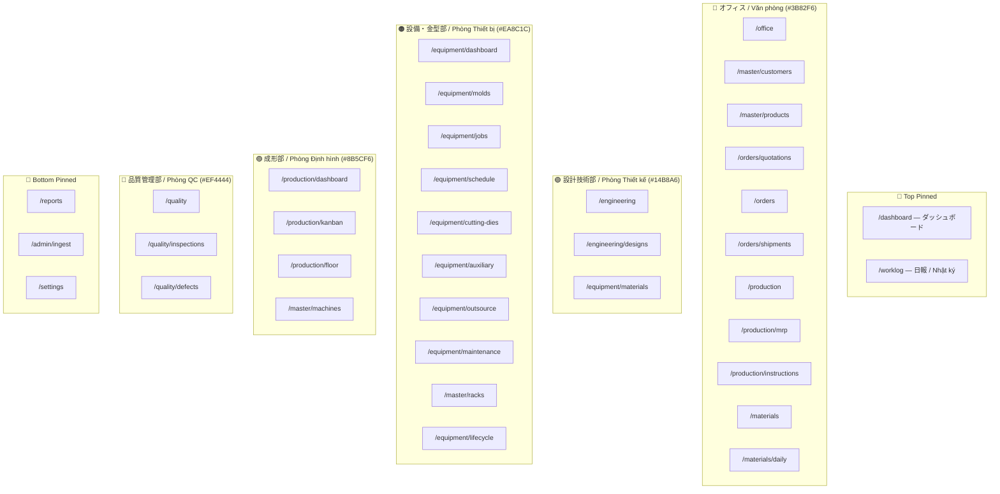
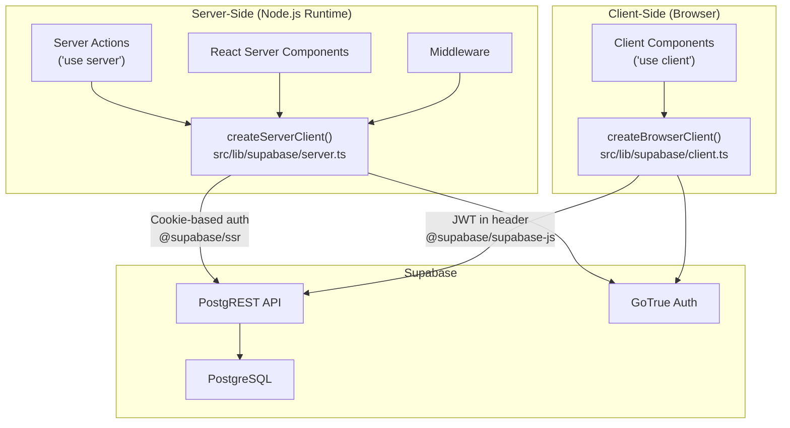
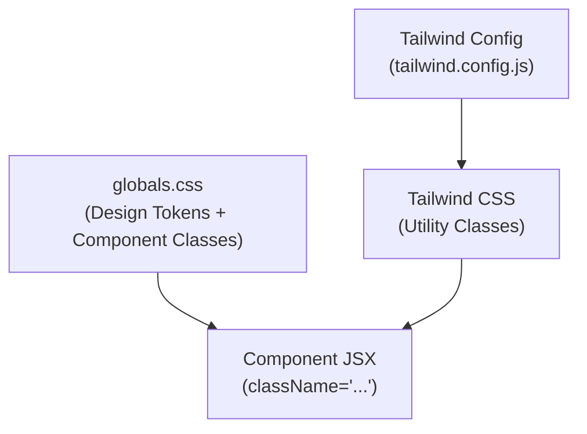
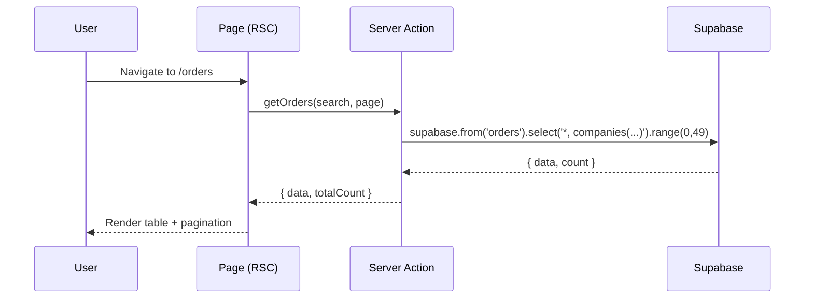
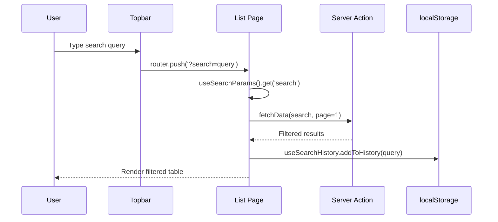

# 04 — システムアーキテクチャ / Kiến Trúc Hệ Thống / System Architecture

> **YSDMS NextGen** — Enterprise Manufacturing & Warehouse Management System  
> **Version:** 0.1.9 &nbsp;|&nbsp; **Updated:** 2026-07-02 &nbsp;|&nbsp; **Status:** Active Development

---

## Table of Contents

1. [Technology Stack](#1-technology-stack)
2. [High-Level Architecture](#2-high-level-architecture)
3. [Deployment Topology](#3-deployment-topology)
4. [Application Layer — Root Layout](#4-application-layer--root-layout)
5. [Application Directory Structure](#5-application-directory-structure)
6. [Module Inventory & Status](#6-module-inventory--status)
7. [Sidebar Navigation Map](#7-sidebar-navigation-map)
8. [Component Library](#8-component-library)
9. [Server Actions Layer](#9-server-actions-layer)
10. [Database Connectivity](#10-database-connectivity)
11. [Design System](#11-design-system)
12. [Key Architectural Patterns](#12-key-architectural-patterns)
13. [Change Log](#13-change-log)

---

## 1. Technology Stack

### 1.1 Core Framework

| Layer | Technology | Version | Purpose |
|-------|-----------|---------|---------|
| **Framework** | Next.js (App Router) | 16.2.3 | SSR/SSG, file-based routing, React Server Components |
| **UI Library** | React | 19.2.4 | Component-based UI with Server & Client Components |
| **Language** | TypeScript | ^5 | Static type safety across the codebase |
| **Database** | Supabase (PostgreSQL) | — | Managed Postgres, Auth, Row-Level Security (RLS) |
| **Styling** | Tailwind CSS + Custom CSS | 3.4.19 | Utility-first styling + `globals.css` design tokens |
| **Testing** | Playwright | ^1.60.0 | End-to-end browser testing |

### 1.2 Key Dependencies

| Package | Version | Purpose |
|---------|---------|---------|
| `@supabase/ssr` | ^0.10.2 | Server-side Supabase client (cookie-based auth) |
| `@supabase/supabase-js` | ^2.103.0 | Supabase JS SDK |
| `lucide-react` | ^1.17.0 | Icon system |
| `recharts` | ^3.8.1 | Charts & data visualization |
| `gantt-task-react` | ^0.3.9 | Gantt chart for mold job scheduling |
| `react-hook-form` + `zod` | ^7.73.1 / ^3.23.8 | Form handling + schema validation |
| `@dnd-kit/core` | ^6.3.1 | Drag-and-drop (Kanban, sorting) |
| `date-fns` | ^4.1.0 | Date utilities (JP locale support) |
| `jspdf` + `html2canvas` | ^4.2.1 / ^1.4.1 | PDF export |
| `csv-parse` | ^6.2.1 | CSV import parsing |
| `xlsx` | ^0.18.5 | Excel import/export (dev tool) |
| `uuid` | ^14.0.0 | UUID generation for record IDs |
| `pg` | ^8.22.0 | Direct PostgreSQL connection (seed/migration scripts) |

### 1.3 Fonts

| Font | Usage | Weights |
|------|-------|---------|
| **Inter** | Primary body text, numbers, UI elements | 400, 500, 600, 700 |
| **Noto Sans JP** | Japanese labels (日本語), CJK text | 400, 600, 700 |

Both fonts are loaded via `next/font/google` with `subsets: ['latin']` for optimal performance.

---

## 2. High-Level Architecture



### Architecture Principles

| Principle | Implementation |
|-----------|---------------|
| **Server-First** | Data fetching in Server Components & Server Actions; minimal client-side state |
| **Type Safety** | Auto-generated `database.types.ts` (179KB, 5283 lines) from Supabase schema |
| **Bilingual UI** | All labels display JP primary + VI secondary (hardcoded, no i18n library) |
| **Department Color-Coded** | Each department has a distinct accent color in navigation |
| **Progressive Enhancement** | Core CRUD works without JS; interactive features (Gantt, DnD) require JS |

---

## 3. Deployment Topology



### Environment Variables

| Variable | Scope | Description |
|----------|-------|-------------|
| `NEXT_PUBLIC_SUPABASE_URL` | Public | Supabase project URL |
| `NEXT_PUBLIC_SUPABASE_ANON_KEY` | Public | Supabase anonymous (public) API key |
| *(Additional keys)* | Server-only | Service role key, direct DB connection (scripts only) |

---

## 4. Application Layer — Root Layout

The root `layout.tsx` establishes the provider hierarchy and shell structure:



### Provider Details

| Provider | File | Type | Responsibility |
|----------|------|------|---------------|
| **ThemeProvider** | `src/components/ThemeProvider.tsx` | Client Component | Light/Dark mode toggle via `data-theme` attribute on `<html>`. Persists to `localStorage('ysdms-theme')`. |
| **AuthProvider** | `src/components/AuthProvider.tsx` | Client Component | Supabase auth session listener. Exposes `user`, `loading`, `signOut()` via `useAuth()` hook. |

### Shell Components

| Component | File | Size | Key Features |
|-----------|------|------|-------------|
| **Sidebar** | `src/components/layout/Sidebar.tsx` | 16.6 KB | Collapsible (icon-only mode), 5 department sections with color coding, bilingual JP/VI labels, active route highlighting |
| **Topbar** | `src/components/layout/Topbar.tsx` | 6.8 KB | Global search with route dispatch (`?search=`), QR code scanner trigger, theme toggle button, user avatar |
| **MobileNavbar** | `src/components/layout/MobileNavbar.tsx` | 2.0 KB | Bottom navigation bar for mobile viewports (`md:hidden`), quick access to key routes |
| **HeaderAuth** | `src/components/layout/HeaderAuth.tsx` | 1.7 KB | Auth-aware header showing user email and sign-out button |

---

## 5. Application Directory Structure

```
src/
├── app/                          # Next.js App Router (file-based routes)
│   ├── page.tsx                  # Dashboard (home)
│   ├── layout.tsx                # Root layout (providers + shell)
│   ├── login/                    # Authentication
│   ├── master/                   # Master Data module
│   ├── engineering/              # Engineering module
│   ├── equipment/                # Equipment & Tooling module
│   ├── orders/                   # Orders module
│   ├── production/               # Production module
│   ├── reports/                  # Reports module
│   ├── quality/                  # Quality Control module
│   ├── actions/                  # Server Actions (21 files)
│   └── (other routes...)         # dashboard/, materials/, settings/, etc.
│
├── components/
│   ├── layout/                   # Shell: Sidebar, Topbar, MobileNavbar, HeaderAuth
│   ├── ui/                       # Shared UI library (12 components)
│   ├── equipment/                # Domain: Gantt, Job modals, Worklog
│   ├── order/                    # Domain: Order form, Items grid
│   ├── master/                   # Domain: Company form modal
│   ├── search/                   # Domain: SmartSearchBox
│   ├── dashboard/                # Domain: Dashboard widgets
│   ├── inventory/                # Domain: Inventory components
│   ├── reports/                  # Domain: Report components
│   ├── ThemeProvider.tsx          # Theme context provider
│   └── AuthProvider.tsx           # Auth context provider
│
├── hooks/
│   └── useSearchHistory.ts       # localStorage search history (max 10)
│
├── lib/
│   ├── supabase/
│   │   ├── client.ts             # createBrowserClient<Database>()
│   │   └── server.ts             # createServerClient<Database>() (async, cookie-based)
│   ├── actions/
│   │   └── searchActions.ts      # Global search server actions
│   ├── scheduling/               # Scheduling utility functions
│   ├── utils/                    # General utilities
│   └── validations/              # Zod schemas
│
├── types/
│   ├── database.types.ts         # Auto-generated (179KB, 5283 lines)
│   ├── orders.ts                 # Order-specific type definitions
│   ├── dashboard.ts              # Dashboard-specific types
│   ├── inventory.ts              # Inventory-specific types
│   └── loading-board.ts          # Loading board types
│
└── middleware.ts                  # Auth redirect middleware
```

---

## 6. Module Inventory & Status

### 6.1 Master Data — マスターデータ / Dữ Liệu Chủ

| Route | Page | Status | Size | Notes |
|-------|------|--------|------|-------|
| `/master` | Companies list | ✅ DONE | — | Master dashboard with cards |
| `/master/customers` | Customer list | ✅ DONE | — | Search, pagination, company_contacts |
| `/master/customers/[id]` | Customer detail | ✅ DONE | — | Tabs: info, contacts, delivery sites |
| `/master/customers/new` | New customer | ✅ DONE | — | CompanyFormModal |
| `/master/products` | Product list | ✅ DONE | 44 KB | Full CRUD, search, sorting |
| `/master/products/[id]` | Product detail | ✅ DONE | — | Product info with company link |
| `/master/molds` | Mold Masters list | ✅ DONE | — | List + search |
| `/master/molds/[id]` | Mold Master detail | ✅ DONE | — | Detail view |
| `/master/molds/new` | New Mold Master | ✅ DONE | — | Create form |
| `/master/machines` | Machine list | ✅ DONE | 35 KB | Full CRUD |
| `/master/plastics` | Plastic materials | ✅ DONE | — | List + create |
| `/master/plastics/new` | New plastic | ✅ DONE | — | Create form |
| `/master/racks` | Rack management | ✅ DONE | 29 KB | Rack grid layout |
| `/master/cutters` | Cutter Masters | ✅ DONE | — | List + create |
| `/master/cutters/new` | New cutter | ✅ DONE | — | Create form |
| `/master/employees` | Employee list | 🔲 PLACEHOLDER | — | Not implemented |

### 6.2 Engineering — 設計技術 / Kỹ Thuật Thiết Kế

| Route | Page | Status | Size | Notes |
|-------|------|--------|------|-------|
| `/engineering` | Engineering dashboard | ✅ DONE | — | Overview cards |
| `/engineering/designs` | Design revisions list | ✅ DONE | — | List all design revisions |
| `/engineering/designs/[moldMasterId]` | Design detail | ✅ DONE | 60 KB | Complex multi-tab view |

### 6.3 Equipment & Tooling — 設備・金型 / Thiết Bị & Khuôn

| Route | Page | Status | Size | Notes |
|-------|------|--------|------|-------|
| `/equipment/dashboard` | Equipment overview | ✅ DONE | — | Dashboard cards |
| `/equipment/molds` | Physical molds list | ✅ DONE | 32 KB | List + search + filter |
| `/equipment/molds/[id]` | Physical mold detail | ✅ DONE | — | Multi-tab: info, jobs, history |
| `/equipment/jobs` | Job management | ✅ DONE | 19 KB | Job list with status filters |
| `/equipment/jobs/[id]` | Job detail | ✅ DONE | — | Multi-tab: info, worklog, timeline |
| `/equipment/cutting-dies` | Cutters list | ✅ DONE | — | List + server actions |
| `/equipment/schedule` | Gantt/Schedule view | 🔧 IN_PROGRESS | — | MoldJobGantt (100KB component) |
| `/equipment/auxiliary` | Auxiliary equipment | 🔧 IN_PROGRESS | — | Plugs, fixtures |
| `/equipment/aluminum` | Aluminum blanks | ✅ DONE | 18 KB | Blank inventory tracking |
| `/equipment/lifecycle` | Inventory check | 🔲 PLACEHOLDER | — | Periodic equipment audit |

### 6.4 Orders — 受注管理 / Quản Lý Đơn Hàng

| Route | Page | Status | Size | Notes |
|-------|------|--------|------|-------|
| `/orders` | Orders list | ✅ DONE | 22 KB | Pagination, SearchSuggestions, sorting |
| `/orders/[id]` | Order detail | ✅ DONE | — | Multi-tab: items, shipments, history |
| `/orders/shipments` | Shipments list | ✅ DONE | 24 KB | Shipment tracking |
| `/orders/quotations` | Quotations | 🔲 PLACEHOLDER | — | Not implemented |

### 6.5 Production — 成形・生産 / Sản Xuất

| Route | Page | Status | Size | Notes |
|-------|------|--------|------|-------|
| `/production` | Planning calendar | ✅ DONE | 10 KB | Calendar view |
| `/production/dashboard` | Production dashboard | 🔲 PLACEHOLDER | — | Not implemented |
| `/production/kanban` | Kanban board | 🔲 PLACEHOLDER | — | Not implemented |
| `/production/planning` | Complex planning | 🔧 IN_PROGRESS | — | Advanced planning view |
| `/production/floor` | Factory floor | 🔲 PLACEHOLDER | — | Not implemented |
| `/production/inventory` | Production inventory | ✅ DONE | 5 KB | Stock tracking |
| `/production/worklog` | Work log list | ✅ DONE | 15 KB | Daily production logs |
| `/production/mrp` | MRP | 🔲 PLACEHOLDER | — | Material Requirements Planning |

### 6.6 Reports — レポート / Báo Cáo

| Route | Page | Status | Size | Notes |
|-------|------|--------|------|-------|
| `/reports/alerts` | Alert reports | ✅ DONE | 16 KB | System alerts & notifications |
| `/reports/inventory` | Inventory reports | ✅ DONE | 12 KB | Stock level reports |
| `/reports/orders` | Order reports | ✅ DONE | 15 KB | Order analytics |
| `/reports/production` | Production reports | 🔧 IN_PROGRESS | — | Production metrics |

### 6.7 Quality Control — 品質管理 / Quản Lý Chất Lượng

| Route | Page | Status | Size | Notes |
|-------|------|--------|------|-------|
| `/quality/inspections` | Quality inspections | ✅ DONE | 11 KB | Inspection records |
| `/quality/defects` | Defect tracking | 🔲 PLACEHOLDER | — | Not implemented |

### 6.8 Status Summary



| Status | Count | Percentage |
|--------|-------|-----------|
| ✅ DONE | 31 | 72% |
| 🔧 IN_PROGRESS | 4 | 9% |
| 🔲 PLACEHOLDER | 8 | 19% |
| **Total Pages** | **43** | **100%** |

---

## 7. Sidebar Navigation Map

The sidebar is divided into **5 department sections** plus pinned items at top and bottom. Each section has a distinct brand color.

### 7.1 Navigation Structure



### 7.2 Department Color Palette

| # | Department (JA) | Department (VI) | Color | Hex Code | CSS Variable |
|---|----------------|-----------------|-------|----------|-------------|
| 1 | オフィス | Văn phòng | 🔵 Blue | `#3B82F6` | — |
| 2 | 設計技術部 | Phòng Thiết kế | 🟢 Teal | `#14B8A6` | — |
| 3 | 設備・金型部 | Phòng Thiết bị & Khuôn | 🟠 Orange | `#EA8C1C` | — |
| 4 | 成形部 | Phòng Định hình | 🟣 Purple | `#8B5CF6` | — |
| 5 | 品質管理部 | Phòng QC | 🔴 Red | `#EF4444` | — |

---

## 8. Component Library

### 8.1 Layout Components (4 files)

| Component | File | Size | Description |
|-----------|------|------|-------------|
| `Sidebar` | `src/components/layout/Sidebar.tsx` | 16.6 KB | Collapsible sidebar with department-colored sections, bilingual JP/VI labels, active route highlighting, icon-only collapse mode |
| `Topbar` | `src/components/layout/Topbar.tsx` | 6.8 KB | Global search bar dispatching `?search=` to current route, QR scan button, theme toggle, user info |
| `MobileNavbar` | `src/components/layout/MobileNavbar.tsx` | 2.0 KB | Fixed bottom navigation for mobile (`md:hidden`), 5 quick-access icons |
| `HeaderAuth` | `src/components/layout/HeaderAuth.tsx` | 1.7 KB | User email display + sign-out button |

### 8.2 Shared UI Components (12 files)

| Component | File | Size | Props / Key Features |
|-----------|------|------|---------------------|
| `Pagination` | `ui/Pagination.tsx` | 4.5 KB | `page`, `totalPages`, `onPageChange` — standard prev/next/number buttons, 50 rows/page default |
| `SearchSuggestions` | `ui/SearchSuggestions.tsx` | 3.3 KB | Dropdown showing recent search history from `useSearchHistory`, click-to-fill |
| `SearchBox` | `ui/SearchBox.tsx` | 3.6 KB | Debounced search input (300ms) with `form-input form-input-search` styling |
| `AsyncSearchableSelect` | `ui/AsyncSearchableSelect.tsx` | 7.7 KB | Server-side async search select with loading state |
| `SearchableSelect` | `ui/SearchableSelect.tsx` | 3.8 KB | Client-side filterable dropdown select |
| `MultiSelectDropdown` | `ui/MultiSelectDropdown.tsx` | 2.6 KB | Multi-select with checkboxes and tag display |
| `BilingualLabel` | `ui/BilingualLabel.tsx` | 0.5 KB | `<span>` with JP (12px) + VI (10px) stacked label |
| `BilingualTitle` | `ui/BilingualTitle.tsx` | 0.6 KB | Page/section title with JP primary + VI secondary |
| `Button` | `ui/Button.tsx` | 1.4 KB | Wrapper for `btn btn-primary / btn-secondary` classes |
| `Input` | `ui/Input.tsx` | 1.2 KB | Wrapper for `form-input` class |
| `Select` | `ui/Select.tsx` | 1.6 KB | Wrapper for `form-input` applied to `<select>` |
| `PageHeader` | `ui/PageHeader.tsx` | 0.7 KB | Standardized page header with bilingual title + action buttons slot |

### 8.3 Domain Components

#### Equipment / Tooling (7 files)

| Component | File | Size | Description |
|-----------|------|------|-------------|
| `MoldJobGantt` | `equipment/MoldJobGantt.tsx` | 100 KB | Interactive Gantt chart for mold job scheduling. Uses `gantt-task-react`. Supports drag-resize, dependency lines, custom tooltips, status color coding. The largest single component in the codebase. |
| `MoldJobGanttV3` | `equipment/MoldJobGanttV3.tsx` | — | Next-generation Gantt (experimental) |
| `JobQuickViewDrawer` | `equipment/JobQuickViewDrawer.tsx` | 25 KB | Slide-in drawer for job quick view without full navigation. Shows job info, worklog entries, timeline. |
| `CreateJobModal` | `equipment/CreateJobModal.tsx` | 17 KB | Modal form for creating new mold processing jobs. Multi-step: select mold → set dates → assign. |
| `WorklogModal` | `equipment/WorklogModal.tsx` | 14 KB | Modal for recording daily work log entries against a job. |
| `WorklogEditModal` | `equipment/WorklogEditModal.tsx` | 12 KB | Edit mode for existing worklog entries. |
| `DesignJobsList` | `equipment/DesignJobsList.tsx` | 4.5 KB | List of design-related jobs within equipment context. |

#### Orders (2 files)

| Component | File | Size | Description |
|-----------|------|------|-------------|
| `OrderFormClient` | `order/OrderFormClient.tsx` | 12 KB | Client-side order creation/edit form with company selection and product lookup |
| `OrderItemsGrid` | `order/OrderItemsGrid.tsx` | 15 KB | Editable grid for order line items with inline add/remove |

#### Master Data (1 file)

| Component | File | Size | Description |
|-----------|------|------|-------------|
| `CompanyFormModal` | `master/CompanyFormModal.tsx` | 24 KB | Complex modal for company CRUD: basic info, contacts, delivery sites (multi-tab within modal) |

#### Search (1 file)

| Component | File | Size | Description |
|-----------|------|------|-------------|
| `SmartSearchBox` | `search/SmartSearchBox.tsx` | 7 KB | Enhanced search with entity-type detection and route-aware result navigation |

### 8.4 Custom Hooks

| Hook | File | Size | Description |
|------|------|------|-------------|
| `useSearchHistory` | `src/hooks/useSearchHistory.ts` | 1.9 KB | Manages per-page search history in `localStorage`. Max 10 items per key. Returns `{ history, addToHistory, clearHistory }`. Used by all list pages with search. |

---

## 9. Server Actions Layer

All server actions use `'use server'` directive and call Supabase via `createServerClient()`.

### 9.1 Main Actions — `src/app/actions/`

| File | Size | Domain | Key Functions |
|------|------|--------|--------------|
| `auth.ts` | 1.2 KB | Authentication | Sign in, sign out, session check |
| `customer.ts` | 5.7 KB | Customers | CRUD companies, contacts, delivery sites |
| `cutter.ts` | 0.9 KB | Cutters | CRUD cutter masters |
| `dashboard.ts` | 3.5 KB | Dashboard | Aggregate stats, KPIs, recent activity |
| `engineering.ts` | 3.0 KB | Engineering | Design revision queries, status updates |
| `inventory.ts` | 7.8 KB | Inventory | Stock queries, adjustments, dashboard KPIs |
| `machine.ts` | 4.5 KB | Machines | CRUD machines, status tracking |
| `maintenance.ts` | 3.5 KB | Maintenance | Maintenance records, scheduling |
| `master-dashboard.ts` | 2.5 KB | Master Overview | Aggregate counts for master dashboard cards |
| `mold-job.ts` | 23 KB | Mold Jobs | **Largest action file** — Job CRUD, status transitions, Gantt data, worklog entries, schedule queries |
| `mold-revise.ts` | 2.4 KB | Mold Revisions | Revision history tracking |
| `mold.ts` | 11 KB | Molds | Physical mold CRUD, mold master links |
| `mrp.ts` | 4.5 KB | MRP | Material requirements queries |
| `order.ts` | 8.3 KB | Orders | Order CRUD, order items, status flow |
| `plastic.ts` | 1.3 KB | Plastics | Plastic material CRUD |
| `product.ts` | 1.7 KB | Products | Product queries and updates |
| `production.ts` | 29 KB | Production | **Second largest** — Production logs, scheduling, planning calendar, floor data |
| `production_logs.ts` | 1.8 KB | Production Logs | Daily production log entries |
| `quality.ts` | 1.8 KB | Quality | Inspection records, defect tracking |
| `reports.ts` | 12 KB | Reports | Alert queries, inventory reports, order analytics |
| `tags.ts` | 0.7 KB | Tags | Tag system for cross-entity labeling |

### 9.2 Additional Action Files

| File | Size | Purpose |
|------|------|---------|
| `src/actions/reports.ts` | — | Legacy/alternate reports actions |
| `src/lib/actions/searchActions.ts` | 3.7 KB | Global search across multiple entities |
| `src/app/equipment/cutting-dies/actions.ts` | — | Cutting-die specific actions (co-located) |
| `src/app/production/molds/actions.ts` | — | Production mold actions (co-located) |
| `src/app/production/products/upsert-actions.ts` | — | Product upsert from production context |

### 9.3 Server Action Pattern

```typescript
// Standard pattern used across all action files
'use server'

import { createClient } from '@/lib/supabase/server'

export async function getItems(search?: string, page: number = 1) {
  const supabase = await createClient()
  const pageSize = 50
  const from = (page - 1) * pageSize
  const to = from + pageSize - 1

  let query = supabase
    .from('table_name')
    .select('*, related_table(col1, col2)', { count: 'exact' })
    .order('created_at', { ascending: false })
    .range(from, to)

  if (search) {
    query = query.ilike('name', `%${search}%`)
  }

  const { data, error, count } = await query
  return { data: data ?? [], error, totalCount: count ?? 0 }
}
```

---

## 10. Database Connectivity

### 10.1 Supabase Client Architecture



### 10.2 Client Implementation

**Server Client** — `src/lib/supabase/server.ts`:
```typescript
import { createServerClient } from '@supabase/ssr'
import { cookies } from 'next/headers'
import type { Database } from '@/types/database.types'

export async function createClient() {
  const cookieStore = await cookies()
  return createServerClient<Database>(
    process.env.NEXT_PUBLIC_SUPABASE_URL!,
    process.env.NEXT_PUBLIC_SUPABASE_ANON_KEY!,
    {
      cookies: {
        getAll() { return cookieStore.getAll() },
        setAll(cookiesToSet) {
          try {
            cookiesToSet.forEach(({ name, value, options }) =>
              cookieStore.set(name, value, options)
            )
          } catch { /* Server Component context — safe to ignore */ }
        },
      },
    }
  )
}
```

**Browser Client** — `src/lib/supabase/client.ts`:
```typescript
import { createBrowserClient } from '@supabase/ssr'
import type { Database } from '@/types/database.types'

export function createClient() {
  return createBrowserClient<Database>(
    process.env.NEXT_PUBLIC_SUPABASE_URL!,
    process.env.NEXT_PUBLIC_SUPABASE_ANON_KEY!
  )
}
```

### 10.3 Type Generation

```bash
# Generate TypeScript types from live Supabase schema
npx supabase gen types typescript \
  --project-id iirezrszalmecsslbruo \
  --schema public \
  > src/types/database.types.ts
```

**Output:** `database.types.ts` — 179 KB, 5,283 lines covering all tables, views, functions, and enums.

### 10.4 RPC Functions (10)

| Function | Purpose | Called From |
|----------|---------|------------|
| `get_dashboard_stats` | Aggregate dashboard KPIs (order count, revenue, production) | `dashboard.ts` |
| `get_inventory_dashboard_kpis` | Inventory-specific KPIs (stock levels, alerts) | `inventory.ts` |
| `get_my_role` | Current user's role from auth context | `auth.ts` |
| `create_order_with_items` | Transactional order + line items creation | `order.ts` |
| `ship_order_items` | Mark order items as shipped, update quantities | `order.ts` |
| `auto_deduct_plastic_on_production` | Auto-deduct raw material stock on production log | `production.ts` |
| `rpc_deduct_plastic_for_order` | Deduct plastic material for specific order | `order.ts` |
| `record_maintenance_and_reset` | Log maintenance event + reset shot counter | `maintenance.ts` |
| `record_tray_out_safe` | Safe tray-out recording with concurrency check | `production.ts` |
| `exec_sql` | Admin-only: Execute raw SQL (development/migration tool) | `admin` |

> [!WARNING]
> `exec_sql` is an administrative function restricted by RLS policies. It should NOT be used in production application code.

---

## 11. Design System

### 11.1 CSS Architecture

The design system is defined in `src/app/globals.css` using CSS custom properties (variables) with Tailwind CSS as the utility layer.



### 11.2 Theme Variables

| Category | Variable | Light Value | Dark Value |
|----------|----------|-------------|------------|
| **Accent** | `--accent` | Teal | Teal |
| **Background** | `--bg-page` | Light gray | Dark gray |
| **Background** | `--bg-topbar` | White | Dark surface |
| **Border** | `--border-default` | Light border | Dark border |
| **Text** | `--text-primary` | Dark text | Light text |

Theme switching is handled by the `data-theme` attribute on `<html>`, toggled by `ThemeProvider`.

### 11.3 Typography Scale

| Element | Font Size | Font Family | Weight |
|---------|-----------|-------------|--------|
| Body text | 14px | Inter | 400 |
| Form input | 13px | Inter | 400 |
| Table cell | 13px | Inter | 400 |
| Label (JA / 日本語) | 12px | Noto Sans JP | 400 |
| Label (VI / Tiếng Việt) | 10px | Inter | 400 |
| Table header column (primary) | 13px | monospace | 700 |

### 11.4 Component Class Reference

| Element | CSS Class | Usage |
|---------|-----------|-------|
| **Data Table** | `data-table` | All list page tables |
| **Form Input** | `form-input` | Text inputs, selects |
| **Search Input** | `form-input form-input-search` | Search fields (padded for icon) |
| **Textarea** | `form-textarea` | Multi-line text |
| **Button (Primary)** | `btn btn-primary` | Main action buttons |
| **Button (Secondary)** | `btn btn-secondary` | Cancel, alternative actions |
| **Card** | `card` or `card-flat` | Content containers |
| **Form Grid (4-col)** | `form-grid-4` | 4-column responsive form layout |
| **Form Grid (2-col)** | `form-grid-2` | 2-column responsive form layout |
| **Badge (Info)** | `badge badge--info` | Informational status |
| **Badge (Success)** | `badge badge--success` | Success / active status |
| **Badge (Warning)** | `badge badge--warning` | Warning / pending status |
| **Badge (Error)** | `badge badge--error` | Error / critical status |
| **Badge (Neutral)** | `badge badge--neutral` | Inactive / default status |

### 11.5 Primary Column Pattern (Table Hyperlinks)

Every data table **MUST** have a primary column rendered as a `<Link>`:

```tsx
// ✅ CORRECT — Primary column as hyperlink
<Link
  href={`/master/customers/${row.id}`}
  style={{
    color: 'var(--accent)',
    fontWeight: 700,
    fontFamily: 'monospace',
    fontSize: 13
  }}
>
  {row.company_code}
</Link>

// ❌ WRONG — Plain text primary column
<span>{row.company_code}</span>
```

---

## 12. Key Architectural Patterns

### 12.1 Data Flow Pattern



### 12.2 Search Pattern



### 12.3 Pagination Rules

| Rule | Value |
|------|-------|
| Page size | 50 rows |
| API method | `.range(from, to)` with `{ count: 'exact' }` |
| Search | Server-side `.ilike()` — never client-side filter |
| Debounce | 300–500ms before API call |
| Component | `<Pagination page={page} totalPages={totalPages} onPageChange={...} />` |

### 12.4 Navigation Rules

**Back / Up Pattern** (mandatory for all detail pages):

| Button | Behavior | Implementation |
|--------|----------|---------------|
| ← 戻る (Back) | `router.back()` — preserves search state | Client component with `useRouter()` |
| ↑ 一覧 (Up) | Fixed link to parent list page | `<Link href="/parent/list">` |

**URL Search Sync** (mandatory for all list pages):
- Read `?search=` from URL via `useSearchParams()`
- Sync with local search state on mount
- Global search (Topbar) pushes `?search=` into URL → page responds

### 12.5 Detail Page Header — Compact Layout

```
┌────────────────────────────────────────────────┐
│ ← 戻る  ↑ 一覧  │ 🔧 MOLD-001 金型名       │  ← Max 25% viewport height
│                   │ 関連: [Customer] [Design]  │
├────────────────────────────────────────────────┤
│ [Tab 1] [Tab 2] [Tab 3]                        │
├────────────────────────────────────────────────┤
│                                                │
│              Tab Content Area                  │  ← 75%+ viewport height
│              (scrollable)                      │
│                                                │
└────────────────────────────────────────────────┘
```

Rules:
- Header padding: `12px 16px`
- Icon size: `20px`
- Title font: `18px`
- Back/Up buttons on **same row** as header (not a separate line)
- Related links (`関連 / Liên kết`) inline — **not** a separate block

### 12.6 Table Sorting

All data tables must support column sorting:

| Feature | Requirement |
|---------|------------|
| Click header | Cycle: Ascending → Descending → Default |
| Sort indicator | `ArrowUp`, `ArrowDown`, or `ArrowUpDown` icon |
| Sort scope | Client-side (current page) or Server-side (`?sort=col&dir=asc`) |

---

## 13. Change Log

| Date | Author | Changes |
|------|--------|---------|
| 2026-07-02 | AI Agent (Claude) | Initial document creation — full architecture, components, navigation, patterns |

---

*Document ID: `04_system_architecture.md`*  
*Parent: [Technical Documentation Index](README.md)*  
*Cập nhật lần cuối / Last Updated: 2026-07-02*
