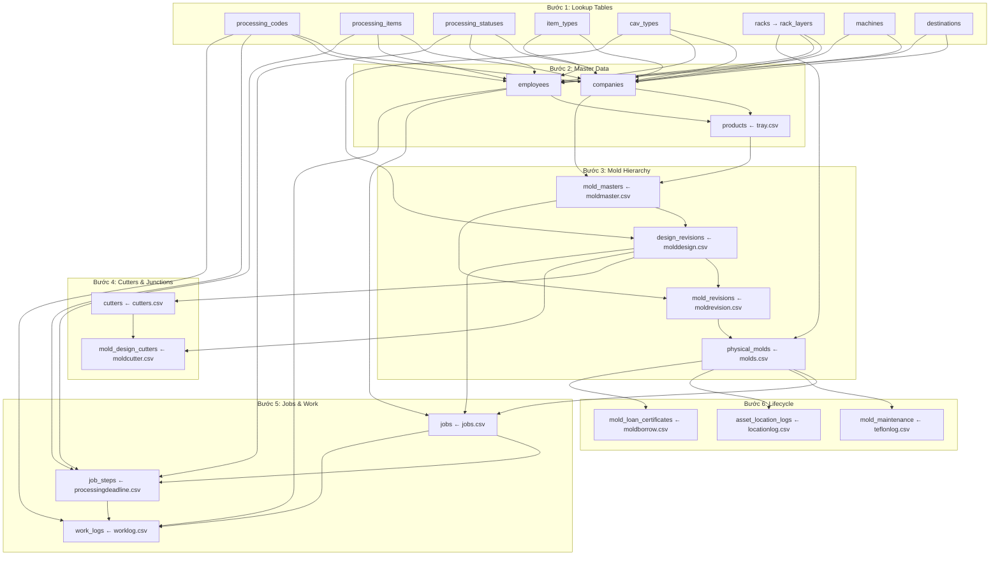

# 06 — DATA MIGRATION: Access → Supabase

> **Phiên bản:** 1.0  
> **Ngày tạo:** 2026-07-02  
> **Nguồn dữ liệu:** `source_data/csv-access-data/` (68 files, 612MB Access DB)

---

## 1. Tổng Quan

### 1.1 Nguồn Dữ Liệu

| Nguồn | Mô tả | Kích thước |
|-------|-------|------------|
| `YSD MoldCutterSearch_base.accdb` | Access DB gốc | 612 MB |
| 68 CSV files | Export từ Access | ~4.5 MB tổng |

### 1.2 Thống Kê Dữ Liệu Chính

| CSV | Records (ước tính) | Kích thước | Bảng đích Supabase |
|-----|:-------------------:|------------|---------------------|
| `companies.csv` | ~1,726 | 210 KB | `companies` |
| `moldmaster.csv` | ~4,500+ | 544 KB | `products` + `mold_masters` |
| `designmaster.csv` | ~4,589 | 488 KB | *(legacy, merged vào molddesign)* |
| `molddesign.csv` | ~4,500+ | 503 KB | `design_revisions` |
| `moldrevision.csv` | ~4,500+ | 535 KB | `mold_revisions` |
| `molds.csv` | ~3,500+ | 347 KB | `physical_molds` |
| `cuttermaster.csv` | ~1,500+ | 173 KB | *(sẽ DROP — xem 02_data_model)* |
| `cutters.csv` | ~2,000+ | 203 KB | `cutters` |
| `moldcutter.csv` | ~1,000+ | 76 KB | `mold_design_cutters` |
| `jobs.csv` | ~2,000+ | 209 KB | `jobs` |
| `processingdeadline.csv` | ~2,000+ | 126 KB | `job_steps` |
| `worklog.csv` | ~5,000+ | 347 KB | `work_logs` |
| `tray.csv` | ~2,000+ | 140 KB | `products` (merge) |
| `traycustomer.csv` | ~2,000+ | 148 KB | `products.company_id` mapping |
| `teflonlog.csv` | ~3,000+ | 251 KB | `mold_maintenance` |
| `locationlog.csv` | ~1,000+ | 63 KB | `mold_location_history` |
| `employees.csv` | ~20 | 1.3 KB | `employees` |
| `customers.csv` | ~100 | 13 KB | `companies` (type=CUSTOMER) |

---

## 2. Mapping Chi Tiết: CSV → Supabase

### 2.1 Lookup Tables (Import Đầu Tiên — Không FK Dependencies)

```
processingcode.csv    → processing_codes     (45 records)
processingitems.csv   → processing_items     (21 records)
processingstatus.csv  → processing_statuses  (13 records)
itemtype.csv          → item_types           (records)
machine.csv           → machines             (7-10 records)
machiningcustomer.csv → companies (type=OUTSOURCE)  (5 records)
cav.csv               → cav_types            (29 records)
racks.csv             → racks                (records)
racklayers.csv        → rack_layers          (records)
destinations.csv      → destinations         (records)
employees.csv         → employees            (20 records)
plasticmaterial.csv   → (plastic materials lookup)
plasticcolor.csv      → (plastic colors lookup)
plasticcompany.csv    → (plastic suppliers)
plasticthickness.csv  → (plastic thickness)
plasticwidth.csv      → (plastic width)
plasticlength.csv     → (plastic length)
plasticgroup.csv      → (plastic groups)
```

### 2.2 Master Data (Import Thứ 2 — Cần Lookup Tables)

```
companies.csv         → companies
  Mapping:
    CompanyID        → legacy_id
    CompanyCode      → company_code
    CompanyName      → company_name
    CompanyNameRomaji → company_name_romaji
    Address          → address
    Tel              → tel
    Fax              → fax
    
customers.csv         → companies (WHERE company_type INCLUDES 'CUSTOMER')
  Mapping:
    CustomerID       → legacy_id
    CustomerCode     → company_code
    CustomerName     → company_name

tray.csv              → products
  Mapping:
    TrayID           → legacy_id
    TrayCode         → product_code
    TrayName         → product_name
    CustomerID       → company_id (lookup companies.legacy_id)
    Pocket           → pocket_count
    PiecesPerBox     → pieces_per_box

traycustomer.csv      → products.company_id mapping (supplementary)
```

### 2.3 Mold Hierarchy (Import Thứ 3 — Cần companies + products)

```
moldmaster.csv        → mold_masters (tạm thời) → sau merge vào products
  Mapping:
    MoldMasterID     → legacy_id
    MoldMasterCode   → mold_master_code
    MoldMasterName   → mold_master_name
    CompanyID        → company_id (lookup)
    TrayID           → product_id (lookup products.legacy_id)
    DesignerID       → designer_id (lookup employees)
    CADFolderPath    → cad_folder_path

molddesign.csv        → design_revisions
  Mapping:
    MoldDesignID     → legacy_id
    DesignCode       → design_code
    MoldMasterID     → mold_master_id (lookup)
    CompanyID        → company_id (lookup)
    CAVID            → cav_type_id (lookup cav_types)
    DesignLength     → design_length
    DesignWidth      → design_width
    DesignHeight     → design_height
    DesignDepth      → design_depth
    CutlineLength    → cutline_length
    CutlineWidth     → cutline_width
    CavityCount      → cavity_count
    PocketNumbers    → pocket_numbers
    PitchMM          → pitch_mm
    CornerR          → corner_r
    ChamferC         → chamfer_c
    DraftAngle       → draft_angle
    UndercutSpec     → undercut_spec
    UnderDepth       → under_depth
    Orientation      → orientation
    SetupType        → setup_type
    HasPlug          → has_plug
    HasSeparateCutter → has_separate_cutter
    PlasticType      → plastic_type_designed
    CustomerTrayName → customer_tray_name
    CustomerDrawingNo → customer_drawing_no
    CADFolderPath    → cad_folder_path
    DrawingPDFPath   → drawing_pdf_path
    DesignDate       → design_date
    Status           → status

moldrevision.csv      → mold_revisions
  Mapping:
    MoldRevisionID   → legacy_id
    MoldMasterID     → mold_master_id (lookup)
    MoldDesignID     → design_revision_id (lookup design_revisions.legacy_id)
    RevisionCode     → revision_code
    RevisionName     → revision_name
    EffectiveDate    → effective_date
    RevisionReason   → revision_reason
    IsActive         → is_active

molds.csv             → physical_molds
  Mapping:
    MoldID           → legacy_id
    SystemCode       → system_code
    DisplayName      → display_name
    MoldRevisionID   → mold_revision_id (lookup)
    CAVID            → cav_type_id (lookup)
    KeeperCompanyID  → keeper_company_id (lookup)
    RackLayerID      → current_rack_layer_id (lookup)
    ActualLength     → actual_length_mm
    ActualWidth      → actual_width_mm
    ActualHeight     → actual_height_mm
    ActualWeight     → actual_weight
    PieceCount       → piece_count
    DeviceStatus     → device_status
    UsageStatus      → usage_status
    MoldType         → mold_type
    CopyNumber       → copy_number
    PhysicalStamp    → physical_stamp
    QR_UUID          → qr_uuid
    EntryDate        → mold_entry_date
```

### 2.4 Cutters (Import Thứ 4 — Cần design_revisions)

```
cutters.csv           → cutters
  Mapping:
    CutterID         → legacy_id
    CutterNo         → cutter_no
    CutterName       → cutter_name
    MoldDesignID     → design_revision_id (lookup design_revisions.legacy_id)
    CompanyID        → company_id (lookup)
    KeeperCompanyID  → keeper_company_id (lookup)
    RackLayerID      → current_rack_layer_id (lookup)
    CutterLength     → cutter_length_mm
    CutterWidth      → cutter_width_mm
    CutterHeight     → cutter_height_mm
    CutlineLength    → cutline_length
    CutlineWidth     → cutline_width
    CutterType       → cutter_type
    BaseType         → base_type
    UsageStatus      → usage_status

moldcutter.csv        → mold_design_cutters (junction table)
  Mapping:
    MoldCutterID     → legacy_id
    MoldDesignID     → mold_design_id (→ design_revisions.revision_id)
    CutterID         → cutter_id (lookup)
```

### 2.5 Jobs & Work (Import Thứ 5 — Cần design_revisions + physical_molds)

```
jobs.csv              → jobs
  Mapping:
    JobID            → legacy_id
    JobCode          → job_code
    JobName          → job_name
    JobTypeID        → job_type_id (lookup)
    MoldDesignID     → design_revision_id (lookup)
    MoldID           → physical_mold_id (lookup physical_molds.legacy_id)
    MoldMasterID     → mold_master_id (lookup)
    CompanyID        → company_id (lookup)
    ResponsibleID    → responsible_id (lookup employees)
    StartDate        → start_date
    Deadline         → deadline
    CompletedDate    → completed_date
    JobStatus        → job_status
    Priority         → priority
    YearPeriod       → year_period
    MonthPeriod      → month_period

processingdeadline.csv → job_steps
  Mapping:
    ProcessingDeadlineID → legacy_id
    JobID            → job_id (lookup jobs.legacy_id)
    StepNo           → step_no
    ProcessingItemID → processing_item_id
    ProcessingStatusID → processing_status_id
    Deadline         → deadline
    MachineID        → machine_id (lookup)
    EmployeeID       → assigned_to (lookup)
    Track            → track

worklog.csv           → work_logs
  Mapping:
    WorkLogID        → legacy_id
    JobID            → job_id (lookup)
    JobStepID        → job_step_id (lookup job_steps.legacy_id)
    EmployeeID       → employee_id (lookup)
    ProcessingCodeID → processing_code_id
    ProcessingStatusID → processing_status_id
    HoursSpent       → hours_spent
    WorkDate         → work_date
    IsFinished       → is_finished
    Description      → description
```

### 2.6 Lifecycle Data (Import Thứ 6 — Cần physical_molds)

```
teflonlog.csv         → mold_maintenance
locationlog.csv       → mold_location_history (→ asset_location_logs)
moldborrow.csv        → mold_loan_certificates
statuslogs.csv        → (audit trail)
shiplog.csv           → shipments
cutterlog.csv         → (cutter maintenance log)
moldlog.csv           → (mold changelog)
```

### 2.7 Không Import (Bỏ Qua)

```
designmaster.csv      → ĐÃ MERGE vào molddesign.csv ở V3
cuttermaster.csv      → SẼ DROP (cutters link trực tiếp qua design_revision_id)
molddesignlog.csv     → Chỉ 1 record, không đáng
moldtaskplan.csv      → Thay bằng job_steps
paste errors.csv      → Lỗi import Access
job_exporterrors.csv   → Lỗi export
calendar.csv          → System calendar, có thể import sau
cnc_schedule.csv      → Placeholder (trống)
productionlog.csv     → Placeholder
productionplan.csv    → Placeholder
productionresult.csv  → Placeholder
scraplog.csv          → Placeholder
stakings.csv          → Stacking data (nhỏ)
formedtray.csv        → Placeholder
forming.csv           → Placeholder
case.csv              → Placeholder
orderhead.csv         → Placeholder (sẽ dùng UI để nhập)
orderline.csv         → Placeholder
trayorder.csv         → Placeholder
dathangvttbl.csv      → Đặt hàng vật tư (Vietnamese app cũ)
vattusdtbl.csv        → Vật tư sử dụng (Vietnamese app cũ)
vattutbl.csv          → Vật tư (Vietnamese app cũ)
plasticforforming.csv → Nhựa cho sản xuất (sẽ import riêng)
plasticstaticcharge.csv → Tĩnh điện nhựa
responsibleperson.csv → Đã merge vào employees
employee_old.csv      → Đã thay bằng employees.csv
_DatabaseRelationships_short.csv → Metadata
```

---

## 3. Thứ Tự Import (FK Dependencies)



---

## 4. Vấn Đề Đã Biết

| # | Vấn đề | Ảnh hưởng | Giải pháp |
|---|--------|-----------|-----------|
| 1 | `mold_design_cutters` thiếu FK constraint | Junction table không hoạt động | ALTER TABLE ADD CONSTRAINT |
| 2 | `cutter_no` trùng lặp (nhập tay) | Dữ liệu không unique | Hệ thống mới auto-generate |
| 3 | `designmaster.csv` đã merge vào `molddesign.csv` | 2 file trùng dữ liệu | Chỉ import `molddesign.csv` |
| 4 | Vietnamese app tables (`dathang*`, `vattu*`) | Dữ liệu cũ, format khác | Bỏ qua hoặc import riêng |
| 5 | Dữ liệu hiện tại trong DB có thể sai (V4 migration) | Cần clean trước import | Clear & re-import |

---

## 5. V5 Seed Script — Thiết Kế

### 5.1 Công Nghệ

```
Language: Python 3.x (uv)
Library:  supabase-py (Supabase Python client)
Input:    CSV files từ source_data/csv-access-data/
Output:   Supabase DB (direct insert via API)
```

### 5.2 Cấu Trúc Script

```
scripts/
├── seed_v5/
│   ├── main.py              ← Entry point, orchestrator
│   ├── config.py            ← Supabase credentials, file paths
│   ├── csv_reader.py        ← Generic CSV reader with encoding handling
│   ├── id_mapper.py         ← legacy_id → UUID mapping registry
│   ├── importers/
│   │   ├── 01_lookups.py    ← processing_codes, items, statuses, cav, racks
│   │   ├── 02_master.py     ← companies, employees, products
│   │   ├── 03_mold.py       ← mold_masters, design_revisions, mold_revisions, physical_molds
│   │   ├── 04_cutter.py     ← cutters, mold_design_cutters
│   │   ├── 05_job.py        ← jobs, job_steps, work_logs
│   │   └── 06_lifecycle.py  ← maintenance, location, loans
│   └── validators/
│       ├── fk_check.py      ← Verify FK integrity after import
│       └── count_check.py   ← Compare CSV rows vs DB rows
```

### 5.3 Quy Trình

```
1. Clear existing data (truncate tables in reverse FK order)
2. Import Bước 1-6 tuần tự
3. Validate: FK integrity, row counts, sample spot checks
4. Report: success/fail/skipped per table
```

---

*Cập nhật lần cuối: 2026-07-02*
