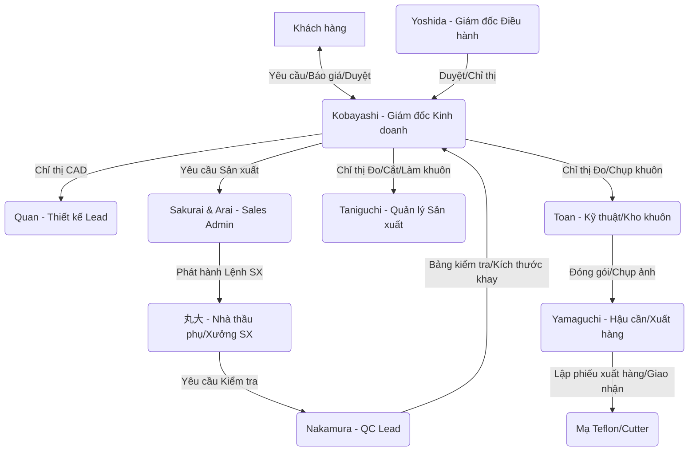

# 09 — BÁO CÁO HỒ SƠ NGHIỆP VỤ DOANH NGHIỆP TOÀN DIỆN (Comprehensive Business Flows & Specifications)

> **Phiên bản:** 1.0  
> **Ngày tạo:** 2026-07-09  
> **Trạng thái:** ACTIVE (Lưu trữ lâu dài - Không ghi đè)  
> **Nguồn phân tích:** Outlook YSD nội bộ (3,620 email Inbox + 754 email Sent) và chỉ thị sản xuất thực tế (新規金型製造工程票)  
> **Mục đích:** Tài liệu hóa toàn bộ luồng nghiệp vụ cốt lõi, vai trò nhân sự và các phát sinh thực tế làm cơ sở mở rộng Schema Database và thiết kế UI/UX cho hệ thống YSDMS NextGen.

---

## MỤC LỤC

1. [Tổng Quan Vai Trò & Cơ Cấu Nhân Sự Thực Tế](#1-tổng-quan-vai-trò--cơ-cấu-nhân-sự-thực-tế)
2. [Chi Tiết Nghiệp Vụ 1: Xử Lý Đơn Hàng & Báo Giá](#2-chi-tiết-nghiệp-vụ-1-xử-lý-đơn-hàng--báo-giá)
3. [Chi Tiết Nghiệp Vụ 2: Thiết Kế & Bản Vẽ (2D, 3D, Layout)](#3-chi-tiết-nghiệp-vụ-2-thiết-kế--bản-vẽ-2d-3d-layout)
4. [Chi Tiết Nghiệp Vụ 3: Sản Xuất & Chỉ Thị Định Hình](#4-chi-tiết-nghiệp-vụ-3-sản-xuất--chỉ-thị-định-hình)
5. [Chi Tiết Nghiệp Vụ 4: Kiểm Tra Mẫu & Cơ Cấu Phân Bổ Mẫu](#5-chi-tiết-nghiệp-vụ-4-kiểm-tra-mẫu--cơ-cấu-phân-bổ-mẫu)
6. [Chi Tiết Nghiệp Vụ 5: Mạ Khuôn (Teflon)](#6-chi-tiết-nghiệp-vụ-5-mạ-khuôn-teflon)
7. [Chi Tiết Nghiệp Vụ 6: Sửa Khuôn, Hủy Khuôn & Trả Khuôn](#7-chi-tiết-nghiệp-vụ-6-sửa-khuôn-hủy-khuôn--trả-khuôn)
8. [Chi Tiết Nghiệp Vụ 7: Chụp Ảnh Khuôn, Nhãn Dán & 看板](#8-chi-tiết-nghiệp-vụ-7-chụp-ảnh-khuôn-nhãn-dán--看板)
9. [Chi Tiết Nghiệp Vụ 8: Kiểm Kê Tài Sản & SACT (Panasonic)](#9-chi-tiết-nghiệp-vụ-8-kiểm-kê-tài-sản--sact-panasonic)
10. [Chi Tiết Nghiệp Vụ 9: Chứng Nhận Cho Mượn Thiết Bị (設備貸出書)](#10-chi-tiết-nghiệp-vụ-9-chứng-nhận-cho-mượn-thiết-bị-設備貸出書)
11. [Các Trường Hợp Phát Sinh & Luồng Ngoại Lệ Thực Tế](#11-các-trường-hợp-phát-sinh--luồng-ngoại-le-thực-tế)
12. [Đề Xuất Mở Rộng Schema Database & Giao Diện UI/UX Phù Hợp](#12-đề-xuất-mở-rộng-schema-database--giao-diện-uiux-phù-hợp)

---

## 1. Tổng Quan Vai Trò & Cơ Cấu Nhân Sự Thực Tế

Phân tích lịch sử thư tín cho thấy luồng công việc của YSD xoay quanh các vai trò nhân sự cụ thể với nhiệm vụ chuyên môn hóa rõ rệt:



| Nhân sự | Vai trò thực tế | Nhiệm vụ nghiệp vụ chính | Liên kết Database |
|:---|:---|:---|:---|
| **小林 (Kobayashi)** | Giám đốc Kinh doanh | Tiếp nhận RFQ, báo giá, thương lượng dung sai, gửi bản vẽ duyệt, giải quyết khiếu nại (khay kẹt, lẫn dị vật), đặt dao cắt ngoài, chỉ thị toàn bộ phòng ban. | `orders.created_by`, `quotations.created_by` |
| **クアン (Quan)** | Thiết kế Kỹ thuật | Thiết kế 3D/2D khay và khuôn, thiết kế Plug, lập bản vẽ dao cắt (PP/PS), gia công base nhôm CNC, dịch tài liệu ISO sang tiếng Việt. | `design_revisions.designer_id`, `jobs.assigned_to` |
| **桜井 (Sakurai)** | Trợ lý Kinh doanh (Admin) | Quản lý kiểm kê SACT (Panasonic), xử lý giấy tờ trả thiết bị, phát hành hóa đơn và chứng nhận `納品書兼検査票` gửi khách hàng. | `orders.processed_by`, `mold_disposal_logs.registered_by` |
| **新井 (Arai)** | Trợ lý Kinh doanh (Admin) | Soạn thảo lệnh sản xuất bổ sung từ mega-email của Kobayashi, tạo giấy mượn thiết bị `設備貸出書`, phối hợp chụp ảnh khuôn. | `production_instructions.created_by`, `mold_loan_certificates.created_by` |
| **中村 (Nakamura)** | QC / Kiểm soát chất lượng | Đo đạc kích thước khay thành phẩm, lập phiếu kiểm tra chất lượng `検査表`, hỗ trợ đo khuôn và giải quyết tương thích dao/khuôn. | `tray_inspections.inspected_by` |
| **トアン (Toan)** | Kỹ thuật viên / Kho khuôn | Đo đạc kích thước và khối lượng khuôn vật lý, chụp ảnh mã khắc/nhãn khuôn, dán nhãn QR SACT, đóng gói khuôn gửi mạ Teflon. | `mold_measurements.measured_by`, `mold_photos.taken_by` |
| **山口 (Yamaguchi)** | Hậu cần / Vận chuyển | Lập phiếu xuất hàng (送り状), đóng gói sản phẩm/thiết bị gửi đi gia công ngoài (Teflon), kiểm tra tương thích khuôn/dao. | `shipping_slips.created_by`, `teflon_logs.shipped_by` |
| **谷口 (Taniguchi)** | Quản lý Sản xuất | Xác nhận tính tương thích và sử dụng lại dao cắt cũ, soạn thảo báo cáo khắc phục (Corrective Action Report) đối với sự cố xưởng (quên khóa van). | `defect_reports.reported_by` |
| **吉田 (Yoshida)** | Giám đốc Điều hành | Phê duyệt thiết kế và gia công base nhôm di động, chỉ thị trực tiếp viết báo cáo khắc phục ISO cho các sự cố kỹ thuật. | `approvals.approved_by` |

---

## 2. Chi Tiết Nghiệp Vụ 1: Xử Lý Đơn Hàng & Báo Giá

Luồng tiền sản xuất bắt đầu bằng việc xử lý báo giá và các loại đơn đặt hàng phong phú từ phía đối tác.

### 2.1 Tiếp nhận Yêu cầu & Tạo Báo giá (見積書)
- **Tiếp nhận:** Kobayashi nhận yêu cầu báo giá (`見積依頼`) hoặc yêu cầu xem xét thiết kế (`設計検討`) từ khách hàng kèm theo bản vẽ sơ bộ hoặc mẫu sản phẩm vật lý cần đóng gói.
- **Cơ cấu Báo giá:** Báo giá của YSD không chỉ chứa đơn giá khay sản xuất, mà cấu thành từ 3 phần chi phí chính:
  1. **Chi phí khuôn mới hoặc cải tạo khuôn (金型費 / 金型改造費):** Chi phí thiết kế và CNC khuôn nhôm.
  2. **Chi phí chế tạo mẫu thử (試作費):** Chi phí chạy máy thermoforming thử nghiệm, nguyên liệu tấm nhựa chạy thử.
  3. **Đơn giá khay hàng loạt (トレイ単価):** Tính theo số lượng đặt hàng tối thiểu (MOQ).
  4. **Chi phí thiết kế CAD phát sinh (3D CADデータ作成費):** Cố định khoảng `10,000 JPY` cho mỗi lần khách hàng yêu cầu xuất/chuyển đổi định dạng file CAD 3D.

### 2.2 Tiếp nhận Đơn đặt hàng (注文書)
- **Mã đơn hàng:** Khách hàng gửi đơn hàng chính thức (`注文書送付`) kèm file PDF. Tiêu đề email thường chứa mã đơn hàng 5 chữ số cố định của khách hàng (Ví dụ: `注文書送付のご連絡(15322)`).
- **Phân loại đơn đặt hàng (PO Type):** Hệ thống cần phân tách rõ ràng các loại đơn hàng để ghi nhận doanh thu chính xác:
  - `ORDER_TRAY` (Đơn hàng khay thương mại thông thường).
  - `ORDER_MOLD_NEW` (Đơn hàng chế tạo khuôn mới).
  - `ORDER_MOLD_REPAIR` (Đơn hàng sửa chữa/cải tạo khuôn cũ theo yêu cầu).
  - `ORDER_TRIAL` (Đơn hàng chạy thử nghiệm vật liệu/độ dày mới).

---

## 3. Chi Tiết Nghiệp Vụ 2: Thiết Kế & Bản Vẽ (2D, 3D, Layout)

Thiết kế kỹ thuật là cầu nối giữa ý tưởng của khách hàng và khuôn nhôm CNC thực tế.

```
[Khách hàng gửi yêu cầu] 
       │
       ▼
[Quan thiết kế Layout Pocket (2D)] ──> [Gửi KH duyệt] ──> [KH duyệt OK (承認)]
                                                               │
                                                               ▼
[Quan thiết kế 3D khuôn nhôm, Plug gỗ, Dao cắt] <──────────────┘
```

### 3.1 Giai đoạn 1: Bản vẽ thiết kế khay (Layout Pocket / 確認用図面)
- Quan thực hiện thiết kế 2D bố cục các hốc chứa sản phẩm trên khay (Layout / Pocket Design).
- Xuất bản vẽ PDF gửi khách hàng duyệt gọi là **Bản vẽ xác nhận (確認用図面)**.
- Khách hàng xem xét kích thước, dung sai và phản hồi. Quy trình này lặp lại cho đến khi khách hàng gửi email xác nhận **Phê duyệt (承認)**.

### 3.2 Giai đoạn 2: Thiết kế khuôn & Công cụ hỗ trợ
Sau khi bản vẽ khay được duyệt, Kobayashi chỉ thị Quan thiết kế chi tiết bộ khuôn và công cụ:
- **Bản vẽ khuôn (金型図):** Bản vẽ 3D khối nhôm CNC. Kích thước khuôn (`型寸法`) phải phù hợp với máy định hình (Ví dụ: `503 x 273` mm hoặc `469 x 299` mm).
- **Thiết kế Plug (プラグ):** Plug gỗ được thiết kế tương thích với các hốc khay để hỗ trợ ép tấm nhựa xuống sâu.
- **Bản vẽ dao cắt (抜型図):** Bản vẽ lưỡi dao thép để cắt rời khay khỏi cuộn nhựa. Bản vẽ dao cắt phụ thuộc chặt chẽ vào vật liệu nhựa (Dao cắt cho PP có góc cắt và khe hở khác dao cắt cho PS do độ co ngót và độ dẻo của PP lớn hơn).

### 3.3 Quản lý phiên bản CAD (Design Revision Control)
- Phiên bản bản vẽ CAD được theo dõi chặt chẽ (`R1`, `R2`, `R3`...).
- Mỗi lần thay đổi thiết kế đột xuất từ email (Ví dụ: Thay đổi dung sai pitch từ `±0.5` sang `±0.3` do khách hàng phản hồi), Quan phải nâng cấp Revision bản vẽ và ghi nhận nhật ký lý do sửa đổi.

---

## 4. Chi Tiết Nghiệp Vụ 3: Sản Xuất & Chỉ Thị Định Hình

Khi bản vẽ khuôn và công cụ đã sẵn sàng, quy trình sản xuất được khởi động thông qua Lệnh sản xuất chi tiết.

### 4.1 Chỉ thị Sản xuất (Mega-Email / 生産指示)
Kobayashi phát hành chỉ thị sản xuất dưới dạng một email tổng hợp gửi cho Sakurai, Arai, Taniguchi và nhà thầu phụ (丸大 - Maruda). Chỉ thị này chứa các thông tin tối quan trọng sau:
- **Mã sản phẩm (Internal ID):** Ví dụ: `DIC-162`.
- **Hạn giao hàng (出荷日 / 納期):** Ngày hoàn thành sản xuất và ngày khách nhận.
- **Thông số cuộn nhựa (材料):** Quy định rõ ràng loại nhựa, màu sắc, độ dày, bề rộng cuộn và mã cuộn (Ví dụ: `PS黒1.0㎜【640】導電練り込み` hoặc `PPナチュラル0.8㎜【520】帯電防止付シリコン無`).
- **Máy định hình chỉ định (成形機):** Chỉ định máy sản xuất (Ví dụ: máy định hình nhiệt tự động `ILLIG` hoặc máy `浅野`).
- **Phương thức cắt khay (抜き):**
  - `インライン` (Cắt trực tiếp trên máy định hình).
  - `別抜き` (Cắt rời bằng máy dập thủy lực riêng biệt - dùng cho khay yêu cầu dung sai ngoài khắt khe).
- **Quy cách bộ khuôn phụ trợ:** Plug mới hay cũ, Dao cắt mới hay dùng lại bản vẽ cũ (`抜き型はXXX-NNNと同じ`).
- **Phân bổ địa điểm giao hàng:** Cho phép giao đến nhiều nơi khác nhau trong cùng một chỉ thị sản xuất (Ví dụ: 15 khay giao đến Iriso Bản sở, 2 khay giao đến YAC Garter).

---

## 5. Chi Tiết Nghiệp Vụ 4: Kiểm Tra Mẫu & Cơ Cấu Phân Bổ Mẫu

Trước khi chạy sản xuất hàng loạt, khâu sản xuất và đánh giá mẫu thử là bắt buộc để tránh rủi ro hỏng hàng loạt.

### 5.1 Các Giai đoạn Ép mẫu thử
1. **Thử nghiệm hốc đơn (Pocket Trial / ポケット試作):** Đúc thử một vài hốc khuôn nhôm đơn lẻ để kiểm tra độ khít của sản phẩm thực tế vào hốc khay.
2. **Mẫu thử lần đầu (First Sample / 初回サンプル):** Ép thử nguyên tấm khay hoàn chỉnh sau khi hoàn thành toàn bộ khuôn nhôm và dao cắt.

### 5.2 Cơ cấu Phân bổ Mẫu đặc thù (Sample Allocation Rules)
Theo chỉ thị thực tế từ email, số lượng khay ép mẫu được chia thành 4 nhóm với mục đích sử dụng khác nhau:
- **Mẫu miễn phí (無償サンプル):** Thường từ 5 - 10 khay gửi cho khách hàng duyệt thử nghiệm lắp ráp.
- **Mẫu kiểm định chất lượng (金型検定用/入検用):** Khoảng 5 khay gửi phòng QC của khách hàng để đo đạc dung sai kỹ thuật.
- **Mẫu chạy thử điều chỉnh thiết bị (設備調整用):** Thường từ 30 - 50 khay. Đây là nhóm khay **có tính phí (有償)**, khách hàng dùng để chạy test dây chuyền tự động.
- **Mẫu lưu văn phòng YSD (事務所用):** Cố định 2 khay lưu lại川崎 (Kawasaki) để làm mẫu đối chứng kỹ thuật khi có khiếu nại.

### 5.3 Quy tắc Đóng gói mẫu phức tạp
- Mẫu miễn phí và mẫu kiểm định phải được **chia túi nilon riêng biệt (袋分け)**, ghi nhãn rõ ràng, sau đó **đóng gói chung (同梱納入)** vào một thùng carton trơn không in chữ (無地箱) để chuyển giao.

---

## 6. Chi Tiết Nghiệp Vụ 5: Mạ Khuôn (Teflon)

Mạ Teflon là công đoạn gia công ngoài (outsource) đặc thù nhưng ảnh hưởng lớn đến tiến độ sản xuất.

```
[Sản xuất mẫu thử thành công]
            │
            ▼
[Phát hiện dính khuôn / Khó tách khay nhựa]
            │
            ▼
[Kobayashi xin ý kiến KH duyệt mạ Teflon]
            │
            ▼
[Toan đóng gói khuôn] ──> [Yamaguchi làm phiếu gửi hàng] ──> [Outsource: サンフロロ]
                                                                  │
                                                                  ▼
[Mass Production] <── [Nhận lại khuôn đã mạ Teflon (đáp ứng ETA)] ┘
```

- **Mục đích:** Khi định hình các khay nhựa có pocket sâu hoặc phức tạp, nhựa nóng dễ bị bám dính vào khuôn nhôm làm biến dạng khay khi đẩy ra. Giải pháp là mạ một lớp chống dính Teflon lên mặt khuôn.
- **Luồng xin duyệt:** Sau khi gửi mẫu thử lần đầu, nếu phát hiện dính khuôn, Kobayashi sẽ liên hệ khách hàng giải thích kỹ thuật và xin duyệt chi phí mạ Teflon.
- **Outsource gia công:** Khi khách hàng đồng ý, Toan đóng gói khuôn vật lý, Yamaguchi lập phiếu xuất hàng (`送り状`) gửi khuôn đến nhà cung cấp mạ Teflon chuyên dụng (**サンフロロ**).
- **Kiểm soát tiến độ:** Hệ thống cần theo dõi trạng thái khuôn gửi đi mạ (`OUT_FOR_PLATING`) và ngày hẹn trả lại (`Plating ETA`) để đảm bảo không làm trễ lịch chạy sản xuất hàng loạt đã lên trên Gantt chart.

---

## 7. Chi Tiết Nghiệp Vụ 6: Sửa Khuôn, Hủy Khuôn & Trả Khuôn

Vòng đời của khuôn vật lý tại YSD được quản lý thông qua các sự cố hiệu chỉnh, quy trình hủy bỏ hoặc hoàn trả tài sản cho chủ sở hữu.

### 7.1 Sửa khuôn (金型改造 - Mold Modification)
- Phát sinh khi khách hàng yêu cầu thay đổi thiết kế sản phẩm hoặc thay đổi vật liệu khay (Ví dụ: Từ PS sang PP).
- Khuôn nhôm cũ được tháo dỡ đưa lên máy CNC để phay lại (chỉnh hốc, sửa góc thoát) theo bản vẽ sửa đổi (`R2`, `R3`...).
- YSD ghi nhận công việc này dưới dạng job sửa khuôn (`JOB_MOLD_REPAIR`) và thu phí cải tạo (`金型改造費`).

### 7.2 Hủy khuôn (金型廃棄 - Mold Disposal)
Khi sản phẩm hết vòng đời hoặc khách hàng yêu cầu hủy khuôn để bảo mật công nghệ, quy trình diễn ra như sau:
1. **Xác minh khuôn:** Kobayashi nhận yêu cầu hủy khuôn từ khách hàng (Ví dụ: đơn hủy từ SMK hoặc Mitsumi). Toan truy tìm khuôn vật lý trong kho, đối chiếu mã khắc.
2. **Chụp ảnh trước khi hủy:** Toan chụp ảnh khuôn vật lý kèm theo phiếu xác nhận nội bộ (`差込用紙`).
3. **Thực hiện hủy:** Có 2 hình thức hủy:
   - **Hủy nội bộ (In-house):** Cắt phá khuôn trực tiếp tại xưởng YSD. Khách hàng không mất phí.
   - **Hủy qua bên thứ 3 (3rd-party):** Chuyển khuôn cho công ty tái chế công nghiệp để nấu chảy nhôm. Khách hàng chịu phí hủy. Bên thứ 3 bắt buộc phải cấp **Giấy chứng nhận hủy (廃棄証明書)** kèm ảnh chụp khuôn đã bị phá hủy.
4. **Đăng ký:** Sakurai đăng ký trạng thái đã hủy (`DISPOSED`) lên phần mềm và lưu file chứng nhận gửi cho khách hàng.

### 7.3 Trả khuôn (設備返却 - Equipment Return)
- Vì nhiều khuôn là tài sản cố định thuộc sở hữu của khách hàng, khi kết thúc hợp đồng, khách hàng yêu cầu trả khuôn.
- **Luồng xử lý:**社長 Yoshida nhận yêu cầu trả khuôn -> chỉ thị Taniguchi và Sakurai chuẩn bị.
- **Đóng gói kèm theo:** Trả khuôn vật lý phải đi kèm đầy đủ:
  - Các linh kiện khuôn phụ trợ (金型部品).
  - Bản vẽ thiết kế bản in (金型図面).
  - Giấy chứng nhận bàn giao/nhận giữ tài sản gốc (預かり書).
- **Vận chuyển:** Khuôn được gửi về địa chỉ khách hàng chỉ định theo hình thức người nhận trả cước (着払い).

---

## 8. Chi Tiết Nghiệp Vụ 7: Chụp Ảnh Khuôn, Nhãn Dán & 看板

Chụp ảnh khuôn không đơn thuần là lưu trữ hình ảnh, mà là quy trình bắt buộc phục vụ nghiệm thu tài sản của khách hàng.

### 8.1 Các Quy cách Chụp ảnh theo yêu cầu Khách hàng (Photo Rules)
Phân tích email cho thấy 4 quy cách chụp ảnh bắt buộc tương ứng với từng tình huống:

| Quy cách chụp | Chi tiết kỹ thuật | Áp dụng | Ví dụ Khách hàng |
|:---|:---|:---|:---|
| **Chụp kèm Phiếu ảnh / 看板** | Đặt phiếu thông tin (do KH cung cấp hoặc YSD in ra) bên cạnh khuôn nhôm rồi chụp chung trong 1 khung hình. | Nghiệm thu khuôn mới | Asahi (アサヒ), JAE |
| **Chụp mã khắc (刻印)** | Chụp cận cảnh phần mã số khuôn được khắc chìm/nổi bằng CNC trên thành khuôn nhôm để chứng minh nguồn gốc tài sản. | Kiểm kê tài sản | NOK, 久喜ロール工業 |
| **Chụp nhãn QR Label** | Chụp cận cảnh nhãn QR của khách hàng dán trên thành khuôn nhôm (phải nhìn thấy rõ mã QR). | Đăng ký hệ thống khách hàng | Panasonic (SACT) |
| **Chụp kèm Phiếu xác nhận YSD** | Chụp khuôn đặt cạnh tờ phiếu xác nhận nội bộ (`差込用紙`) chứa mã số khuôn của YSD. | Hủy khuôn / Cho mượn | YSD nội bộ |

*Lưu ý kỹ thuật:* Ảnh chụp phải ở định dạng **JPEG**, dung lượng vừa phải để gửi qua email hoặc đăng tải lên hệ thống.

---

## 9. Kiểm Kê Tài Sản & SACT (Panasonic)

Hoạt động kiểm kê được thực hiện định kỳ hàng năm để đối chiếu tài sản cố định của khách hàng đang được bảo quản tại YSD hoặc các nhà thầu phụ.

### 9.1 Kiểm kê thông thường (Asset Check)
- **Yêu cầu:** Khách hàng (Ví dụ: A&T, Nemoto, Canon) gửi file Excel danh sách tài sản cố định (Mã tài sản, Tên tài sản, Ngày cấp).
- **Thực hiện:** Kobayashi chỉ thị Toan kiểm tra thực tế khuôn trong kho. Điền cột Có/Không (`有無`), ký tên xác nhận, chụp ảnh minh chứng và gửi trả lại file Excel cho khách hàng.
- **Phát hành Giấy nhận giữ tài sản (資産預かり証):** Đối với Nemoto, hàng năm YSD phải phát hành một chứng nhận pháp lý cam kết đang bảo quản an các khuôn của họ (Ví dụ: `NES-001`, `NES-002`).

### 9.2 Hệ thống kiểm kê SACT của Panasonic
Đây là quy trình kiểm kê số hóa nghiêm ngặt nhất qua email:
- **Chuỗi liên lạc:** Panasonic (End User) -> 東海エレクトロニクス (Tier 1) -> アドバネクス (Tier 2) -> 相和プレス (Tier 3) -> YSD (Nhà sản xuất).
- **Quy trình SACT:**
  1. Nhận nhãn QR SACT vật lý từ khách hàng qua chuyển phát nhanh.
  2. Toan dán nhãn QR mới lên khuôn nhôm (thay nhãn cũ).
  3. Dùng smartphone quét mã QR này để gửi dữ liệu định vị và xác nhận trực tuyến lên hệ thống SACT của Panasonic qua internet.
  4. Sakurai điền thông tin người xác nhận (`確認者`), ngày thực hiện (`棚卸実施日`) vào bảng Excel SACT và gửi trả lại qua chuỗi liên lạc.

---

## 10. Chứng Nhận Cho Mượn Thiết Bị (設備貸出書)

Khi khuôn thuộc sở hữu của khách hàng được YSD chuyển giao cho bên thứ ba (như nhà thầu phụ dập khuôn dập/ép nhựa) sử dụng, khách hàng yêu cầu phải có chứng nhận pháp lý rõ ràng.
- **Luồng xử lý:** Khách hàng (Ví dụ: JAE) gửi yêu cầu giấy cho mượn -> Toan lập phiếu xác nhận nội bộ -> Arai soạn thảo **Giấy cho mượn thiết bị (設備貸出書)**.
- **Yêu cầu đính kèm:** Trên giấy cho mượn phải ghi rõ:
  - Mã số thiết bị của khách hàng và mã YSD.
  - Tên nhà thầu phụ đang mượn khuôn (Ví dụ: **丸大** hoặc **坂田精文堂**).
  - Ảnh chụp thực tế của khuôn có dán nhãn QR/看板 rõ ràng để đối chiếu tài sản.

---

## 11. Các Trường Hợp Phát Sinh & Luồng Ngoại Lệ Thực Tế

Hệ thống YSDMS NextGen phải đủ linh hoạt để xử lý các ngoại lệ nghiệp vụ thường xuyên phát sinh trong email trao đổi:

### 11.1 Thay đổi Vật liệu khay kéo theo Thay đổi Dao cắt (Email ADY-129 / JAE-190)
- **Nghiệp vụ:** Khi khách hàng yêu cầu đổi vật liệu khay từ nhựa PS sang nhựa PP để tăng độ dẻo dai.
- **Phát sinh kỹ thuật:** Nhựa PP có độ co ngót nhiệt và độ đàn hồi lớn hơn PS rất nhiều. Do đó, việc đổi vật liệu buộc phải sửa đổi bản vẽ thiết kế khuôn nhôm để bù co ngót, đồng thời **bắt buộc phải chế tạo một dao cắt (Cutter) mới chuyên dụng cho nhựa PP (PP用)**. Không thể dùng lại dao cắt PS cũ vì sẽ gây bavia hoặc rách mép khay.
- **Yêu cầu hệ thống:** Khi tạo Job sản xuất, hệ thống phải kiểm tra tính tương thích giữa dao cắt dán nhãn vật liệu (`PS/PP`) với cuộn nhựa chỉ định của Lệnh sản xuất.

### 11.2 Khay xếp chồng bị kẹt khi vận chuyển (Email Honda / Minebea)
- **Sự cố:** Khách hàng khiếu nại khay nhựa sau khi xếp chồng lên nhau (stacking) và vận chuyển bị kẹt chặt vào nhau, không thể tách rời bằng tay hoặc bằng robot tự động (Do lực hút chân không hoặc ép chặt khi va đập).
- **Giải pháp kỹ thuật:** Hiệu chỉnh thiết kế khay bằng cách thêm các gờ chống kẹt (Stacking Ribs / 嵌まり込み防止) hoặc tăng góc thoát khuôn (`draft angle`).
- **Yêu cầu hệ thống:** Bản vẽ khay phải lưu trữ ghi chú kỹ thuật về kiểm soát chiều cao xếp chồng (`重ね合わせ時高さ寸法`) và các thông số chống kẹt để phục vụ QC Nakamura đối chiếu khi kiểm tra chất lượng sản phẩm.

### 11.3 Sự cố lẫn dị vật trong lô khay xuất xưởng (Email ATS-020)
- **Sự cố:** Khách hàng phát hiện một chiếc găng tay bảo hộ lao động bị đóng gói lẫn vào trong thùng khay giao hàng. Khách hàng yêu cầu gửi báo cáo khắc phục lỗi.
- **Quy trình xử lý ISO:**
  1. Kobayashi viết báo cáo nguyên nhân và biện pháp khắc phục bằng tiếng Nhật: **不具合是正処置報告書** (Corrective Action Report).
  2. Quan dịch báo cáo này sang tiếng Việt (`translated_language = 'vi'`).
  3. In ra giấy cho công nhân xưởng trực tiếp vận hành máy ép/đóng gói đọc hiểu và **ký tên/đóng dấu xác nhận** đã hiểu quy trình ngăn ngừa.
  4. Gửi bản có chữ ký của công nhân và bản tiếng Nhật cho khách hàng để đóng case khiếu nại.

---

## 12. Đề Xuất Mở Rộng Schema Database & Giao Diện UI/UX Phù Hợp

Để số hóa toàn vẹn các nghiệp vụ trên mà không làm phá vỡ kiến trúc DB V3 hiện tại, dưới đây là các đề xuất mở rộng schema và màn hình UI tương ứng.

### 12.1 Mở rộng Schema Database (Supabase SQL)

Chúng ta cần bổ sung các cột ghi nhận thông số đóng gói, dung sai chế tạo và tạo các bảng mới để quản lý hoạt động kiểm kê, hủy khuôn và mượn thiết bị:

```sql
-- ==========================================
-- 1. BỔ SUNG CỘT DUNG SAI VÀ ĐÓNG GÓI CHI TIẾT
-- ==========================================
ALTER TABLE design_revisions 
    ADD COLUMN IF NOT EXISTS tolerance_x TEXT DEFAULT '±0.5',
    ADD COLUMN IF NOT EXISTS tolerance_y TEXT DEFAULT '±0.5',
    ADD COLUMN IF NOT EXISTS tolerance_pitch TEXT DEFAULT '±0.3',
    ADD COLUMN IF NOT EXISTS mold_source TEXT DEFAULT 'INTERNAL', -- INTERNAL / CUSTOMER_PROVIDED
    ADD COLUMN IF NOT EXISTS discard_old_stock_on_remake BOOLEAN DEFAULT false,
    ADD COLUMN IF NOT EXISTS replace_qc_drawing_on_remake BOOLEAN DEFAULT false;

ALTER TABLE sample_submissions 
    ADD COLUMN IF NOT EXISTS box_type TEXT DEFAULT 'PLAIN',           -- PLAIN (Thùng trơn) / PRINTED (Thùng in chữ)
    ADD COLUMN IF NOT EXISTS bagging_required BOOLEAN DEFAULT true,     -- Cần bọc túi nilon bảo vệ
    ADD COLUMN IF NOT EXISTS packaging_instructions TEXT;              -- Ghi chú đóng gói: "10 khay free và 5 khay QC chia túi riêng đóng chung 1 thùng"

-- ==========================================
-- 2. BẢNG QUẢN LÝ HOẠT ĐỘNG KIỂM KÊ (棚卸)
-- ==========================================
CREATE TABLE IF NOT EXISTS mold_inventory_checks (
    check_id          UUID PRIMARY KEY DEFAULT gen_random_uuid(),
    check_code        TEXT UNIQUE NOT NULL,                       -- Ví dụ: INV-2026-SSM-001
    check_type        TEXT DEFAULT 'INTERNAL',                    -- INTERNAL / SACT / CUSTOMER_REQUEST
    mold_owner_id     UUID REFERENCES companies(company_id),      -- KH sở hữu khuôn
    requested_by      TEXT,                                       -- Người yêu cầu bên KH
    requested_date    DATE NOT NULL,
    deadline          DATE,
    
    total_molds       INTEGER,
    confirmed_count   INTEGER,
    missing_count     INTEGER,
    status            TEXT DEFAULT 'REQUESTED',                   -- REQUESTED / IN_PROGRESS / COMPLETED
    
    completed_by      UUID REFERENCES employees(employee_id),
    completed_date    TIMESTAMPTZ,
    report_file       TEXT,                                       -- Lưu báo cáo PDF/Excel gửi KH
    notes             TEXT,
    created_at        TIMESTAMPTZ DEFAULT now()
);

CREATE TABLE IF NOT EXISTS mold_inventory_items (
    item_id           UUID PRIMARY KEY DEFAULT gen_random_uuid(),
    check_id          UUID NOT NULL REFERENCES mold_inventory_checks(check_id) ON DELETE CASCADE,
    physical_mold_id  UUID REFERENCES physical_molds(physical_mold_id),
    mold_code         TEXT NOT NULL,                              -- Mã khuôn: SSM-006...
    storage_location  TEXT,                                       -- Địa điểm thực tế: YSD / Ibaraki / Sakata
    is_confirmed      BOOLEAN DEFAULT false,
    confirmed_by      TEXT,                                       -- Nhân sự tại chỗ xác nhận
    confirmed_date    TIMESTAMPTZ,
    photo_path        TEXT,                                       -- Đường dẫn ảnh chụp khuôn khi kiểm kê
    notes             TEXT
);

-- ==========================================
-- 3. BẢNG QUẢN LÝ QUY TRÌNH HỦY KHUÔN (金型廃棄)
-- ==========================================
CREATE TABLE IF NOT EXISTS mold_disposal_logs (
    disposal_id       UUID PRIMARY KEY DEFAULT gen_random_uuid(),
    physical_mold_id  UUID NOT NULL REFERENCES physical_molds(physical_mold_id),
    mold_code         TEXT NOT NULL,
    requested_by_company UUID REFERENCES companies(company_id),
    requested_date    TIMESTAMPTZ,
    disposal_no       TEXT,                                       -- Mã yêu cầu hủy từ KH
    
    disposal_type     TEXT DEFAULT 'IN_HOUSE',                    -- IN_HOUSE (Tự hủy) / THIRD_PARTY (Bên thứ 3)
    disposal_fee      NUMERIC(10,2) DEFAULT 0.00,
    disposed_date     TIMESTAMPTZ,
    disposed_by       UUID REFERENCES employees(employee_id),
    
    photo_before      TEXT,                                       -- Đường dẫn ảnh khuôn trước khi hủy (kèm 差込用紙)
    photo_after       TEXT,                                       -- Đường dẫn ảnh khuôn đã hủy/nấu chảy
    certificate_no    TEXT,                                       -- Mã số chứng nhận hủy
    certificate_file  TEXT,                                       -- File đính kèm chứng nhận
    
    registered_by     UUID REFERENCES employees(employee_id),     -- Sakurai đăng ký hệ thống
    registered_date   TIMESTAMPTZ,
    status            TEXT DEFAULT 'REQUESTED',                   -- REQUESTED / DISPOSED / CERTIFIED
    notes             TEXT,
    created_at        TIMESTAMPTZ DEFAULT now()
);

-- ==========================================
-- 4. BẢNG CHỨNG NHẬN CHO MƯỢN THIẾT BỊ (設備貸出書)
-- ==========================================
CREATE TABLE IF NOT EXISTS mold_loan_certificates (
    certificate_id    UUID PRIMARY KEY DEFAULT gen_random_uuid(),
    certificate_no    TEXT UNIQUE NOT NULL,                       -- Ví dụ: LOAN-2026-0001
    mold_owner_id     UUID NOT NULL REFERENCES companies(company_id),
    borrower_id       UUID NOT NULL REFERENCES companies(company_id), -- Nhà thầu phụ mượn (丸大...)
    requested_date    DATE NOT NULL,
    issued_date       DATE,
    issued_by         UUID REFERENCES employees(employee_id),     -- Arai
    prepared_by       UUID REFERENCES employees(employee_id),     -- Toan
    certificate_file  TEXT,                                       -- PDF xuất ra
    status            TEXT DEFAULT 'DRAFT',                       -- DRAFT / ISSUED / RETURNED
    notes             TEXT,
    created_at        TIMESTAMPTZ DEFAULT now()
);

CREATE TABLE IF NOT EXISTS mold_loan_items (
    item_id           UUID PRIMARY KEY DEFAULT gen_random_uuid(),
    certificate_id    UUID NOT NULL REFERENCES mold_loan_certificates(certificate_id) ON DELETE CASCADE,
    physical_mold_id  UUID NOT NULL REFERENCES physical_molds(physical_mold_id),
    mold_code         TEXT NOT NULL,
    photo_path        TEXT,                                       -- Ảnh khuôn kèm QR dán khi cho mượn
    notes             TEXT
);
```

### 12.2 Định hướng Thiết kế Giao diện UI/UX tương ứng

Để hỗ trợ nhân viên vận hành trơn tru các nghiệp vụ đặc thù này, hệ thống cần bổ sung hoặc nâng cấp các module giao diện sau:

#### 1. Màn hình Quản lý Chỉ thị Sản xuất (Production Instructions Form)
- **Layout:** Tái hiện thiết kế tờ lệnh "新規金型製造工程票" dạng lưới.
- **Tính năng:**
  - Tự động điền thông tin từ Đơn hàng và Bản vẽ CAD đã duyệt (Mã nhựa, Độ dày, Số lượng khay có phí/miễn phí, Kích thước khay/khuôn).
  - Chọn máy ép định hình (`ILLIG` / `浅野`), tích chọn phương thức cắt (`インライン` / `別抜き`).
  - Gán trạng thái công cụ phụ trợ (Plug gỗ: Làm mới/Có sẵn; Dao cắt: Làm mới/Dùng lại mã cũ).
  - Cho phép phân rã 1 lệnh sản xuất giao đến nhiều địa điểm giao hàng của khách hàng.

#### 2. Màn hình Quản lý Mẫu thử & Đóng gói (Sample Submission Grid)
- **Layout:** Màn hình nhập số lượng mẫu phân mảnh dạng bảng.
- **Tính năng:**
  - Ô nhập số lượng mẫu chi tiết: Mẫu miễn phí, Mẫu QC kiểm định, Mẫu có phí thiết bị, Mẫu lưu văn phòng YSD.
  - Tích chọn quy cách đóng gói: Thùng carton trơn, bọc túi nilon, ghi chú đóng gói đặc biệt (袋分け).
  - Lưu trữ trạng thái duyệt mẫu của khách hàng (`PENDING` -> `APPROVED` / `REJECTED`). Khi mẫu được duyệt `APPROVED`, hệ thống tự động gửi thông báo và chuyển trạng thái Đơn hàng sang Chạy sản xuất hàng loạt.

#### 3. Module Kiểm kê & SACT (Inventory Checks Module)
- **Layout:** Giao diện tối ưu hóa cho di động (Mobile-friendly layout) để nhân viên quét trực tiếp tại kho.
- **Tính năng:**
  - Toan dùng điện thoại quét mã QR/mã khắc trên khuôn tại xưởng -> Hệ thống tự động đối chiếu định vị kho và cập nhật trạng thái `is_confirmed = true`.
  - Tải lên ảnh chụp thực tế khuôn nhôm kèm nhãn dán QR SACT/看板 ngay tại vị trí kệ chứa.

#### 4. Module Chứng nhận & Tài sản (Asset Certificates Portal)
- **Layout:** Bảng danh mục giấy tờ pháp lý liên kết trực tiếp với thông tin chi tiết của từng Khách hàng/Nhà cung cấp.
- **Tính năng:**
  - Nhấp chuột để tạo nhanh Giấy cho mượn thiết bị (`設備貸出書`) hoặc Giấy nhận giữ tài sản (`資産預かり証`) dưới dạng PDF chuẩn hóa từ dữ liệu có sẵn.
  - Theo dõi danh sách khuôn đang nằm tại nhà thầu phụ (丸大, 坂田精文堂) thông qua liên kết trực quan.
