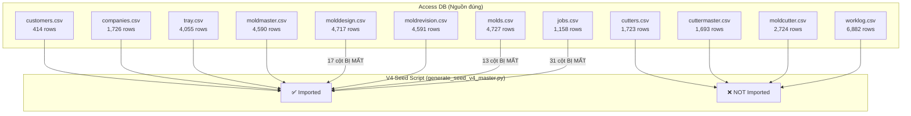

# 🔍 KIỂM TOÁN TOÀN DIỆN — Schema & Dữ Liệu YSDMS NextGen

> **Ngày:** 2026-07-01 | **Phân tích bởi:** Claude Opus 4.6
> **Phạm vi:** 79 bảng DB, 68 file CSV nguồn, V4 seed migration script, front-end code

---

## PHẦN 1 — KIỂM TOÁN CẤU TRÚC BẢNG (79 bảng)

### 1.1 Tổng quan Bảng theo Nhóm

| Nhóm | Số bảng | Đánh giá |
|------|---------|----------|
| Master Data | 10 | ✅ Đúng |
| Mold/Tooling Hierarchy | 20 | ✅ Đúng (1 FK hỏng) |
| Cutter/Cutting Die | 5 | ✅ Đúng (thiếu data) |
| Order/Sales | 4 | ✅ Đúng |
| Production | 7 | ✅ Đúng |
| Jobs/Work Management | 10 | ✅ Đúng |
| Equipment/Logistics | 4 | ✅ Đúng |
| Storage/Racks | 2 | ✅ Đúng |
| Quality/Inspection | 4 | ✅ Đúng |
| System/Support | 3 | ✅ Đúng |
| **`omni_*` (app khác)** | **8** | **🔴 RÁC — cần xóa** |
| Khác (material_change_logs...) | 2 | ✅ Đúng |

### 1.2 🔴 Bảng RÁC — Cần Xóa

8 bảng `omni_*` thuộc **app học tiếng Nhật** hoàn toàn không liên quan:

```
omni_custom_cards, omni_fsrs_cards, omni_master_grammar,
omni_master_kanji, omni_master_shadowing, omni_master_vocab,
omni_profiles, omni_streaks
```

→ Không có FK nào đến bảng YSDMS. Không có code nào trong `src/` reference. **An toàn để DROP.**

### 1.3 ⚠️ Bảng Có Vấn Đề

| Bảng | Vấn đề | Mức độ |
|------|--------|--------|
| `mold_design_cutters` | FK `mold_design_id` tham chiếu `mold_designs` (đã DROP). Không có FK constraint đến `design_revisions`. Không có code nào dùng bảng này. | 🟡 FK hỏng |
| `plugs` | Chỉ dùng ở 1 page (`equipment/auxiliary/page.tsx`). Vẫn hợp lệ cho nghiệp vụ thermoforming. | 🟢 Giữ |
| `destinations` | Lookup table, dùng bởi `equipment_status_logs` | 🟢 Giữ |

### 1.4 Phân Tích Trùng Lặp

| Cặp bảng | Phân tích | Kết luận |
|-----------|-----------|----------|
| `mold_location_history` vs `asset_location_logs` | Bảng đầu chuyên cho mold (FK → physical_molds). Bảng sau dùng enum `asset_type` (MOLD\|CUTTER\|EQUIPMENT...) cho nhiều loại thiết bị. | **Không trùng** — scope khác nhau |
| `equipment_ship_logs` vs `mold_return_logs` | Bảng đầu ghi ship chung cho equipment. Bảng sau chuyên cho trả khuôn về chủ. | **Chấp nhận** — luồng nghiệp vụ khác |
| `inspections` vs `tray_inspections` | Bảng đầu gắn lot/PO. Bảng sau có measurement data cho tray cụ thể. | **Không trùng** — detail level khác |

> [!NOTE]
> **Kết luận:** Không có bảng thừa/trùng lặp nghiêm trọng nào trong tooling hierarchy. Cấu trúc 4 bảng core (`mold_masters → mold_revisions → physical_molds`, `design_revisions`) là ĐÚNG và phù hợp nghiệp vụ.

### 1.5 Về Đổi Tên `physical_molds`

| Phương án | Đánh giá |
|-----------|----------|
| `physical_molds` (hiện tại) | ✅ Đúng ngữ pháp tiếng Anh: adj + noun. Rõ nghĩa: "khuôn vật lý" |
| `mold_physicals` | ❌ "physicals" không phải danh từ tự nhiên trong tiếng Anh |
| `mold_instances` | 🟡 Đúng ngữ pháp nhưng quá chung chung (instance of what?) |
| `mold_units` | 🟡 Khá, nhưng "unit" thường dùng cho sản phẩm, không cho khuôn |

> [!IMPORTANT]
> **Khuyến nghị: GIỮ NGUYÊN `physical_molds`**
> 
> Lý do:
> 1. Tên hiện tại đúng ngữ pháp và rõ nghĩa
> 2. Đổi tên sẽ phải cập nhật: **20+ file front-end**, **database.types.ts**, **tất cả migration**, **RLS policies**, **triggers**, **seed data**
> 3. Quy ước tiền tố `mold_` đã có ở: `mold_masters`, `mold_revisions`, `mold_maintenance`, `mold_photos`... — `physical_molds` là ngoại lệ duy nhất nhưng đã ổn định
> 4. **Chi phí đổi tên >> lợi ích thẩm mỹ**

---

## PHẦN 2 — KIỂM TOÁN DỮ LIỆU (🔴 CỰC KỲ NGHIÊM TRỌNG)

### 2.1 Luồng Dữ Liệu Access → NextGen



### 2.2 🔴 CRITICAL — Dữ Liệu Cutter 100% CHƯA IMPORT

| File CSV | Rows | Bảng đích | Trạng thái |
|----------|------|-----------|------------|
| `cutters.csv` | 1,723 | `cutters` | ❌ **100% CHƯA IMPORT** |
| `cuttermaster.csv` | 1,693 | `cutter_masters` | ❌ **100% CHƯA IMPORT** |
| `moldcutter.csv` | 2,724 | `mold_design_cutters` | ❌ **100% CHƯA IMPORT** |

Script `generate_seed_v4_master.py` **KHÔNG CÓ code** cho cutter. Từ "cutter" chỉ xuất hiện ở `has_separate_cutter` column.

### 2.3 🔴 CRITICAL — Dữ Liệu Work Logs 100% CHƯA IMPORT

| File CSV | Rows | Bảng đích | Trạng thái |
|----------|------|-----------|------------|
| `worklog.csv` | 6,882 | `work_logs` | ❌ **100% CHƯA IMPORT** |
| `processingdeadline.csv` | ? | `job_steps` (tương đương) | ❌ **100% CHƯA IMPORT** |

> [!CAUTION]
> Trong Access, luồng là: `Job → ProcessingDeadline → WorkLog`
> 
> `ProcessingDeadline` chính là **tương đương `job_steps`** trong NextGen. File `processingdeadline.csv` chứa thông tin step/deadline cho từng job nhưng KHÔNG ĐƯỢC IMPORT vào `job_steps`.

### 2.4 🔴 CRITICAL — Mất Cột Design Revisions (17/37 cột)

`molddesign.csv` có 37 cột, nhưng V4 seed chỉ map 19 cột + legacy_id. **17 cột bị mất:**

| Cột CSV | → Cột DB đúng | Trạng thái | Tầm quan trọng |
|---------|--------------|------------|----------------|
| `CutlineX` | `cutline_length` | 🔴 MẤT | **CRITICAL** — kích thước cắt |
| `CutlineY` | `cutline_width` | 🔴 MẤT | **CRITICAL** — kích thước cắt |
| `UnderAngle` | `undercut_spec` | 🔴 MẤT | **HIGH** — thông số kỹ thuật |
| `CAVID` | `cav_type_id` | 🔴 MẤT | **HIGH** — loại cavity |
| `DesignForPlasticType` | `plastic_type_designed` | 🔴 MẤT | **HIGH** — loại nhựa thiết kế |
| `Plug` | `has_plug` | 🔴 MẤT | **MEDIUM** — có plug không |
| `DesignCreatedDate` | `design_date` | 🔴 MẤT | **MEDIUM** — ngày tạo |
| `PocketNumbers` | — | 🔴 MẤT | **LOW** — số pocket |
| `UnderDepth` | — | 🔴 MẤT | **LOW** — depth undercut |
| `MoldDesignName` | — | 🔴 MẤT | Có thể trùng design_code |
| `TrayInfoForMoldDesign` | `tray_info` | 🔴 MẤT | Thông tin tray |
| `TextContent` | — | 🔴 MẤT | Ghi chú |
| `VersionNote` | — | 🔴 MẤT | Ghi chú |
| `TrayID` | — | 🔴 MẤT | FK gián tiếp qua master |
| `DesignMasterID` | — | 🔴 MẤT | Đã bypass qua revision |
| `UpdatedAt` | — | 🔴 MẤT | Metadata |
| `UpdatedBy` | — | 🔴 MẤT | Metadata |

### 2.5 🔴 CRITICAL — Mất Cột Physical Molds (13/26 cột)

| Cột CSV | → Cột DB đúng | Trạng thái | Tầm quan trọng |
|---------|--------------|------------|----------------|
| `CustomerID` | — | 🔴 MẤT | **HIGH** — khách hàng sở hữu |
| `TrayID` | — | 🔴 MẤT | **MEDIUM** — FK qua revision chain |
| `MoldDesignID` | — | 🔴 MẤT | **MEDIUM** — link trực tiếp đến design |
| `ItemTypeID` | `item_type_id` | 🔴 MẤT | **MEDIUM** — phân loại thiết bị |
| `JobID` | — | 🔴 MẤT | **MEDIUM** — job hiện tại |
| `MoldOnCheckList` | — | 🔴 MẤT | **LOW** — flag kiểm kê |
| `MoldReturning` | — | 🔴 MẤT | **LOW** — đang trả |
| `MoldReturnedDate` | — | 🔴 MẤT | **LOW** |
| `MoldDisposing` | — | 🔴 MẤT | **LOW** — đang hủy |
| `MoldDisposedDate` | — | 🔴 MẤT | **LOW** |
| `MoldEntry` | — | 🔴 MẤT | **LOW** — ngày nhập |
| `UpdatedAt` | — | 🔴 MẤT | Metadata |
| `UpdatedBy` | — | 🔴 MẤT | Metadata |

### 2.6 🔴 CRITICAL — Mất Cột Jobs (31/39 cột)

| Nhóm cột bị mất | Cột cụ thể | Tầm quan trọng |
|------------------|-----------|----------------|
| **Ngày tháng** | `JobStartDate`, `DeliveryDeadline`, `ReleasePeriod`, `YearPeriod`, `MonthPeriod` | 🔴 **CRITICAL** — mất lịch deadline |
| **Phân loại** | `ProcessingItemID`, `InstructionID` | 🟡 **HIGH** — mất loại gia công |
| **Khuôn vật lý** | `MoldID` (→ physical_mold_id) | 🟡 **HIGH** — mất link khuôn vật lý |
| **Outsource** | `OutsourcingID`, `NoiGCkhuon`, `FormingLocation` | 🟡 **MEDIUM** |
| **Sản xuất** | `SeparateCutter`, `PocketTEST`, `InventoryCheckUponReProduction`, `DrawingChecUponReProduction` | 🟡 **MEDIUM** |
| **Giao hàng** | `MoldShippingDate`, `AnhKhuonJob`, `QuantitySentToTheOffice` | 🟡 **MEDIUM** |
| **Tài chính** | `PriceQuote`, `UnitPrice`, `LoaiThungDong`, `BaoNilon` | 🟢 **LOW** |
| **Approval** | `Approved`, `PostProductionFeedback` | 🟡 **MEDIUM** |
| **Dung sai** | `ToleranceX`, `ToleranceY` | 🟡 **MEDIUM** |

### 2.7 ⚠️ Semantic Mapping Sai

| Vấn đề | Chi tiết |
|--------|---------|
| **`JobQuantity` → `estimated_hours`** | `JobQuantity` là **số lượng** (khuôn/sản phẩm), KHÔNG phải **giờ làm**. Dữ liệu job toàn bộ `estimated_hours` sai ngữ nghĩa! |
| **`MachiningCustomerID` resolution** | Script tìm trong `comp_map`/`cust_map` nhưng `MachiningCustomerID` reference đến `machiningcustomer.csv` (6 records riêng). File này **KHÔNG ĐƯỢC LOAD** → nhiều `company_id` sẽ NULL hoặc sai. |
| **Jobs `job_status` = 'IN_PROGRESS'** | Tất cả 1,158 jobs đều hardcode `IN_PROGRESS` thay vì map trạng thái thực từ Access |

---

## PHẦN 3 — ACCESS DB RELATIONSHIP (Nguồn Chuẩn)

### 3.1 Luồng Chính trong Access

```
Customer (tblCustomer)
  └→ Tray (tblOrderType)
      └→ DesignMaster (tblDesignMaster)
          ├→ MoldDesign (tblMoldDesign)  ← TRUNG TÂM
          │   ├→ MoldRevision (tblMoldRevision)
          │   │   └→ Mold (tblMold) = physical_molds
          │   ├→ MoldCutter ←→ Cutter (many-to-many)
          │   ├→ Job (tblJOB)
          │   │   └→ ProcessingDeadline (tblKyHanGC)
          │   │       └→ WorkLog (tblThoiLuongGC)
          │   ├→ PlasticForForming
          │   └→ OrderLine
          ├→ MoldMaster (tblMoldMaster)
          │   └→ MoldRevision
          └→ CutterMaster (tblCutterMaster)
              └→ Cutter (tblCutter)
```

### 3.2 Mapping Access → NextGen (Đánh giá)

| Access Table | NextGen Table | Import? | Đánh giá |
|-------------|---------------|---------|----------|
| tblCustomer | `companies` (CUSTOMER) | ✅ | OK |
| tblCompany | `companies` (SUPPLIER) | ✅ | OK |
| tblOrderType (Tray) | `products` | ✅ | OK |
| tblDesignMaster | *(bypassed)* | ⚠️ | Dùng moldrevision bridge thay thế |
| tblMoldDesign | `design_revisions` | ⚠️ | 17 cột bị mất |
| tblMoldMaster | `mold_masters` | ✅ | OK |
| tblMoldRevision | `mold_revisions` | ✅ | OK |
| tblMold | `physical_molds` | ⚠️ | 13 cột bị mất |
| tblJOB | `jobs` | 🔴 | 31 cột bị mất, semantic sai |
| tblCutter | `cutters` | 🔴 | **100% CHƯA IMPORT** |
| tblCutterMaster | `cutter_masters` | 🔴 | **100% CHƯA IMPORT** |
| tblMoldCutter | `mold_design_cutters` | 🔴 | **100% CHƯA IMPORT** |
| tblKyHanGC | `job_steps` | 🔴 | **100% CHƯA IMPORT** |
| tblThoiLuongGC | `work_logs` | 🔴 | **100% CHƯA IMPORT** |
| tblMachiningCustomer | — | 🔴 | **KHÔNG LOAD** → jobs.company_id sai |
| tblProcessingCode | `processing_codes` | ✅ | Import qua migration SQL |
| tblProcessingItem | `processing_items` | ✅ | Import qua base schema |
| tblProcessingStatus | `processing_statuses` | ✅ | Import qua base schema |

---

## PHẦN 4 — KẾ HOẠCH KHẮC PHỤC

### Pha 1: 🔴 Sửa V5 Seed Script (ƯU TIÊN CAO NHẤT)

Viết lại `generate_seed_v5_master.py` bổ sung:

1. **Thêm cột thiếu cho `design_revisions`:**
   - `CutlineX → cutline_length`, `CutlineY → cutline_width`
   - `UnderAngle → undercut_spec`, `CAVID → cav_type_id`
   - `DesignForPlasticType → plastic_type_designed`
   - `Plug → has_plug`, `DesignCreatedDate → design_date`
   - `TrayInfoForMoldDesign → tray_info`

2. **Thêm cột thiếu cho `physical_molds`:**
   - `ItemTypeID → item_type_id` (nếu cột tồn tại)
   - Lưu `CustomerID`, `MoldDesignID`, lifecycle flags vào `legacy_specs`

3. **Thêm cột thiếu cho `jobs`:**
   - `JobStartDate → start_date`, `DeliveryDeadline → deadline`
   - `ProcessingItemID → processing_item_id`
   - `MoldID → physical_mold_id`
   - `YearPeriod → year_period`, `MonthPeriod → month_period`
   - `Approved → approved`
   - **SỬA: `JobQuantity` KHÔNG map vào `estimated_hours`**
   - **SỬA: Load `machiningcustomer.csv` để resolve `MachiningCustomerID` đúng**

4. **Thêm import MỚI:**
   - `cuttermaster.csv → cutter_masters`
   - `cutters.csv → cutters`
   - `moldcutter.csv → mold_design_cutters`
   - `processingdeadline.csv → job_steps`
   - `worklog.csv → work_logs`

### Pha 2: 🟡 Dọn Rác DB

1. DROP 8 bảng `omni_*`
2. Fix FK hỏng trong `mold_design_cutters` (thay `mold_design_id` → FK đến `design_revisions`)
3. Regenerate `database.types.ts`

### Pha 3: 🟢 Cập Nhật Tài Liệu

1. Cập nhật `SCHEMA_REFERENCE.md` — thêm 10+ bảng Job Management
2. Tạo `PROJECT_DOSSIER.md` — hồ sơ chuẩn binding cho mọi model
3. Cập nhật `AGENTS.md` — quy tắc Schema Binding

---

## PHẦN 5 — TÓM TẮT

```
┌──────────────────────────────────────────────────────────────┐
│                    ĐÁNH GIÁ TỔNG THỂ                         │
├──────────────────────────────────────────────────────────────┤
│                                                              │
│  CẤU TRÚC BẢNG (Schema)       ✅ ĐÚNG — 72/79 bảng hợp lệ  │
│  Tooling Hierarchy             ✅ ĐÚNG — không trùng lặp     │
│  Tên physical_molds            ✅ GIỮ NGUYÊN                 │
│  Bảng rác                      ⚠️ 8 bảng omni_* cần DROP    │
│  FK hỏng                       ⚠️ mold_design_cutters       │
│                                                              │
│  DỮ LIỆU IMPORT              🔴🔴🔴 CỰC KỲ NGHIÊM TRỌNG  │
│  ─────────────────────────────────────────────────           │
│  Cutter data                   🔴 100% CHƯA IMPORT          │
│  WorkLog data                  🔴 100% CHƯA IMPORT          │
│  Design revisions              🔴 17 cột bị mất             │
│  Physical molds                🔴 13 cột bị mất             │
│  Jobs                          🔴 31 cột bị mất + sai value │
│  Semantic mapping              🔴 JobQuantity≠estimated_hrs  │
│  MachiningCustomer resolve     🔴 Không load CSV → sai FK    │
│                                                              │
└──────────────────────────────────────────────────────────────┘
```

> [!WARNING]
> **Kết luận:** Cấu trúc bảng DB (schema) về cơ bản ĐÚNG và không có trùng lặp. Tuy nhiên, **dữ liệu import từ Access là SAI NGHIÊM TRỌNG** — V4 seed script thiếu quá nhiều cột và hoàn toàn bỏ qua 5 file CSV quan trọng (cutters, cuttermaster, moldcutter, processingdeadline, worklog).
>
> Đây là lỗi trong `generate_seed_v4_master.py`, KHÔNG phải lỗi schema.

---

## CẦN QUYẾT ĐỊNH TỪ USER

> [!IMPORTANT]
> 1. **Approve Pha 1?** — Viết `generate_seed_v5_master.py` với đầy đủ mapping + import cutter/worklog?
> 2. **Approve Pha 2?** — DROP 8 bảng `omni_*` và fix FK `mold_design_cutters`?
> 3. **`JobQuantity`** — Giá trị này là gì trong nghiệp vụ thực tế? Số lượng khuôn? Số lượng sản phẩm? Cần xác nhận trước khi map lại.
> 4. **Dữ liệu cũ trong DB** — Chạy V5 seed sẽ cần TRUNCATE các bảng trước khi INSERT lại. Dữ liệu mới nhập thủ công (nếu có) sẽ bị mất. OK?
> 5. **Về `physical_molds`** — Giữ nguyên tên hay vẫn muốn đổi?
