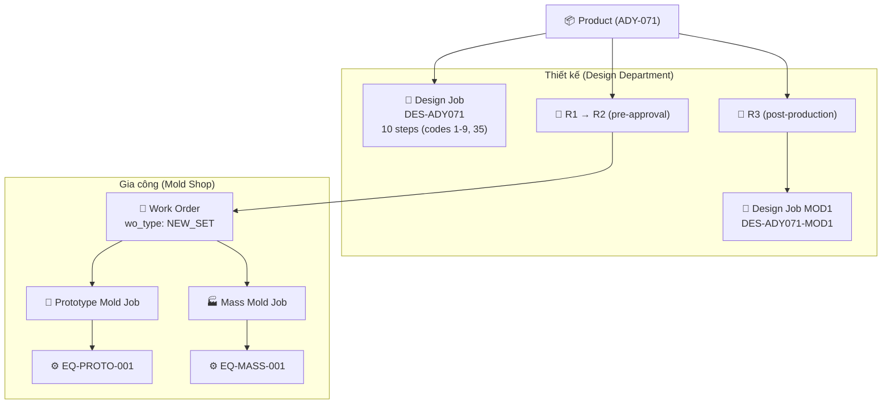
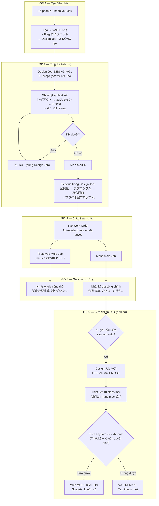

# Kế hoạch Triển khai V3 FINAL: Hệ thống Ghi Nhật ký Đa Bộ phận

> **V3 — Đã tích hợp toàn bộ quyết định từ Anh Thoan (2026-08-19)**
> Sẵn sàng triển khai.

---

## 1. QUYẾT ĐỊNH ĐÃ XÁC NHẬN (10/10)

| # | Quyết định | Nội dung |
|---|-----------|----------|
| Q1 | Design Job tạo khi nào | ✅ **Tự động** khi tạo sản phẩm mới |
| Q2 | Processing codes thiết kế | ✅ Giữ 8 mã (1-8) + thêm 9 (裏穴図面) + 35 (プラグ木型). Mã 7 = `表プログラム作成`. **Bỏ mã 30 (設計)**. Thứ tự tạm không quan trọng |
| Q3 | Giờ làm thiết kế | ✅ **Giữ trường hours_spent** (không ẩn) — để thống kê sau |
| Q4 | CAD_PREP track | ✅ **Bỏ CAD_PREP** trong Mold Job → giữ hạng mục CAM trong **Design Job** (vì thiết kế làm xong TRƯỚC khi xưởng nhận chỉ thị) |
| Q5 | Khuôn thử nghiệm | ✅ Flag trên **`products`**. Tạo **2 Mold Job riêng** (Prototype + Mass) |
| Q6 | Phương án | ✅ Phương án A cải tiến |
| Q7 | Form quản lý codes | ✅ Trên **form nhật ký** (popup/panel, không cần trang master riêng) |
| Q8 | Lọc department | ✅ **Tự động** theo job_category/track + cho phép "すべて" |
| Q9 | POST-PRODUCTION detect | ✅ **Option C**: Tự động detect + cho phép override |
| Q10 | Sửa vs Làm mới khuôn | ✅ **Phòng thiết kế + khuôn** cùng quyết định. Sửa = gia công thêm nếu không thủng. Hỗ trợ cả MODIFICATION + REMAKE |

---

## 2. KIẾN TRÚC TỔNG THỂ (V3 — Đã cập nhật)

### 2.1 Mô hình dữ liệu



### 2.2 Nguyên tắc thiết kế (V3 cập nhật)

| # | Nguyên tắc | Chi tiết |
|---|-----------|----------|
| 1 | **Design Job = per Product** | 1 SP mới = 1 Design Job. Post-production revision = Design Job mới |
| 2 | **TẤT CẢ hạng mục thiết kế trong Design Job** | Kể cả CAM (表プログラム, 裏穴図面, プラグ木型) — ~~KHÔNG~~ dùng CAD_PREP track trong Mold Job |
| 3 | **Giữ hours_spent cho mọi loại nhật ký** | Thiết kế vẫn ghi giờ (optional) để thống kê lương |
| 4 | **Processing codes lọc theo bộ phận** | Auto-filter + cho phép "すべて" |
| 5 | **Flag 試作ポケット trên `products`** | → tự tạo 2 Mold Job riêng khi chỉ thị SX |
| 6 | **Bỏ mã 30 (設計)** | Thay bằng 10 mã chi tiết (1-9 + 35) |

---

## 3. LUỒNG NGHIỆP VỤ (V3 — Đã sửa theo Q4)



### 3.1 Ví dụ cụ thể: ADY-071 (V3)

```
📦 Sản phẩm: ADY-071
│
├── 🎨 Design Job: DES-ADY071 (INITIAL)
│   ├── Step 1: レイアウト              → ✅ done (2026-08-01, 2h)
│   ├── Step 2: 3Dスキャン図面作成      → ✅ done (2026-08-03, 3h)
│   ├── Step 3: 3D金型図面作成          → ✅ done (2026-08-05, 4h)
│   │   └── notes: "R1→R2 sửa theo KH"
│   ├── Step 4: 3Dメンテ図面作成        → ✅ done (2026-08-10, 1.5h)
│   ├── Step 5: 3Dスタッキング図面作成  → ✅ done (2026-08-11, 2h)
│   ├── Step 6: 展開図工作成            → ✅ done (2026-08-14, 3h)
│   ├── Step 7: 表プログラム作成        → ✅ done (2026-08-15, 4h)
│   │   └── notes: "量産用 + 試作用"    ← CAM cho cả prototype & mass
│   ├── Step 8: 3D試作金型作成          → ⬜ skip (không cần)
│   ├── Step 9: 裏穴図面作成            → ✅ done (2026-08-16, 2h)
│   └── Step 10: プラグ木型プログラム   → ✅ done (2026-08-17, 3h)
│   └── TỔNG: 24.5h (tính lương thiết kế cho SP này)
│
├── 📐 Design Revisions:
│   ├── R1 (REJECTED) → parent: null
│   └── R2 (APPROVED ✅) → parent: R1
│
├── 🔧 WO: WO-ADY071 (NEW_SET, revision=R2)
│   ├── 🔨 JOB-ADY071-PROTO → EQ-PROTO-001
│   │   └── Track MOLD: 試作演算→試作穴あけ→試作ミガキ
│   └── 🏭 JOB-ADY071-MASS → EQ-MASS-001
│       ├── Track MOLD: 金型演算→穴あけ→ミガキ
│       ├── Track PLUG: プラグ演算
│       └── Track FINISH: 金型仕上
│
│ ═══ 3 tháng sau, KH yêu cầu sửa ═══
│
├── 🎨 Design Job: DES-ADY071-MOD1 (POST-PRODUCTION)
│   ├── Step 1: レイアウト              → ✅ done (vẽ lại)
│   ├── Step 3: 3D金型図面作成          → ✅ done (sửa 3D)
│   ├── Step 6: 展開図工作成            → ✅ done
│   ├── Step 7: 表プログラム作成        → ✅ done
│   ├── (các step khác → skip)
│   └── TỔNG: 12h (tính CHI PHÍ RIÊNG)
│
├── 📐 R3 (APPROVED ✅) → parent: R2
│
└── 🔧 WO: WO-ADY071-MOD1 (MODIFICATION)
    └── Mold Modify Job → EQ-MASS-001 (sửa khuôn cũ)
```

---

## 4. SCHEMA CHANGES

### 4.1 Migration: Processing codes thiết kế

```sql
-- 1. Thêm 10 mã thiết kế (8 từ Access + 2 mới)
INSERT INTO processing_codes (processing_code_id, processing_name, sort_note, category, is_active) VALUES
(1, 'レイアウト', 1, 'DESIGN', true),
(2, '3Dスキャン図面作成', 2, 'DESIGN', true),
(3, '3D金型図面作成', 3, 'DESIGN', true),
(4, '3Dメンテ図面作成', 4, 'DESIGN', true),
(5, '3Dスタッキング図面作成', 5, 'DESIGN', true),
(6, '展開図工作成', 6, 'DESIGN', true),
(7, '表プログラム作成', 7, 'DESIGN', true),
(8, '3D試作金型作成', 8, 'DESIGN', true),
(9, '裏穴図面作成', 9, 'DESIGN', true),
(35, 'プラグ木型プログラム', 35, 'DESIGN', true)
ON CONFLICT (processing_code_id) DO UPDATE SET
  processing_name = EXCLUDED.processing_name,
  sort_note = EXCLUDED.sort_note,
  category = EXCLUDED.category,
  is_active = true;

-- 2. Bỏ mã 30 (設計) — quá tổng hợp
UPDATE processing_codes SET is_active = false WHERE processing_code_id = 30;

-- 3. Thêm cột department_code
ALTER TABLE processing_codes ADD COLUMN IF NOT EXISTS department_code TEXT;

UPDATE processing_codes SET department_code = 'DESIGN'
  WHERE processing_code_id IN (1,2,3,4,5,6,7,8,9,35);
UPDATE processing_codes SET department_code = 'MOLD_SHOP'
  WHERE category IN ('MOLD','PLUG','CUTTER','EQUIPMENT','MACHINING')
    AND department_code IS NULL;
UPDATE processing_codes SET department_code = 'PRODUCTION'
  WHERE category IN ('PRODUCTION','SHIPPING') AND department_code IS NULL;
UPDATE processing_codes SET department_code = 'QUALITY'
  WHERE category = 'QUALITY' AND department_code IS NULL;
UPDATE processing_codes SET department_code = 'OFFICE'
  WHERE category IN ('OFFICE','MEETING','MANAGEMENT','TRAINING') AND department_code IS NULL;
UPDATE processing_codes SET department_code = 'GENERAL'
  WHERE department_code IS NULL;
```

### 4.2 Flag 試作ポケット trên products

```sql
ALTER TABLE products ADD COLUMN IF NOT EXISTS 
  requires_prototype_mold BOOLEAN DEFAULT false;

COMMENT ON COLUMN products.requires_prototype_mold IS 
  '試作ポケット — Sản phẩm cần khuôn thử nghiệm trước khi sản xuất hàng loạt';
```

### 4.3 ~~CAD_PREP track~~ → KHÔNG CẦN NỮA

> ~~Thêm Track `CAD_PREP` vào `standard_process_times`~~ 
> 
> **BỎ** — Theo Q4, tất cả hạng mục thiết kế (kể cả CAM) nằm trong Design Job, không trong Mold Job.

### 4.4 Optional: revision context trên work_logs

```sql
-- Informational field để biết work_log thuộc revision nào
ALTER TABLE work_logs ADD COLUMN IF NOT EXISTS
  design_revision_context TEXT;  -- VD: "R2", "R3" — chỉ ghi chú
```

---

## 5. KẾ HOẠCH TRIỂN KHAI 4 PHASE

### Phase 1: Hạ tầng dữ liệu (0.5 ngày)
- [ ] Migration: 10 processing codes thiết kế (1-9, 35) + bỏ mã 30
- [ ] Migration: Cột `department_code` trên `processing_codes`
- [ ] Migration: Cột `requires_prototype_mold` trên `products`
- [ ] Update `database.types.ts` (safe diff)

### Phase 2: Giao diện Sản phẩm & Design Job (2-3 ngày)
- [ ] Product Center: Tạo SP + flag 試作ポケット + thông tin thiết kế
- [ ] Tự động tạo Design Job (10 steps) khi tạo SP mới
- [ ] Product Center: Quản lý Design Revisions (R1→R2→R3, APPROVED)
- [ ] Auto-detect POST-PRODUCTION revision (Option C: auto + override)

### Phase 3: Nhật ký & Processing Codes (2-3 ngày)
- [ ] WorklogFormShared: Dropdown lọc theo bộ phận (auto + "すべて")
- [ ] WorklogFormShared: Giữ hours_spent cho Design Job (optional, default 0)
- [ ] SearchableSelect: Tăng dropdown 10-15 dòng
- [ ] Processing Codes: Popup quản lý nhanh từ form nhật ký

### Phase 4: Chỉ thị sản xuất liên kết (1-2 ngày)
- [ ] Work Order: Auto-detect SP + revision đã duyệt
- [ ] Khi 試作ポケット: Tạo 2 Mold Job riêng (Prototype + Mass)
- [ ] Mold Job: CHỈ có track MOLD/PLUG/FINISH (không CAD_PREP)
- [ ] Liên kết Design Job ↔ Mold Jobs qua product_id

---

## 6. BẢNG TÓM TẮT: AI GHI NHẬT KÝ VÀO ĐÂU? (V3)

| Ai làm | Nội dung | Ghi vào | Processing Code |
|--------|----------|---------|-----------------|
| 🎨 Thiết kế | Layout sản phẩm | **Design Job** | 1: レイアウト |
| 🎨 Thiết kế | Vẽ 3D scan | **Design Job** | 2: 3Dスキャン図面作成 |
| 🎨 Thiết kế | Vẽ 3D khuôn | **Design Job** | 3: 3D金型図面作成 |
| 🎨 Thiết kế | Vẽ 3D bảo trì | **Design Job** | 4: 3Dメンテ図面作成 |
| 🎨 Thiết kế | Vẽ 3D stacking | **Design Job** | 5: 3Dスタッキング図面作成 |
| 🎨 Thiết kế | Bản vẽ triển khai | **Design Job** | 6: 展開図工作成 |
| 🎨 Thiết kế | Lập trình gia công mặt trước | **Design Job** | 7: 表プログラム作成 |
| 🎨 Thiết kế | Vẽ 3D khuôn thử | **Design Job** | 8: 3D試作金型作成 |
| 🎨 Thiết kế | Vẽ bản vẽ lỗ mặt sau | **Design Job** | 9: 裏穴図面作成 |
| 🎨 Thiết kế | Lập trình plug gỗ | **Design Job** | 35: プラグ木型プログラム |
| 🔧 Xưởng | Gia công khuôn CNC | **Mold Job** | 10-17 |
| 🔧 Xưởng | Gia công khuôn thử | **Mold Job (Proto)** | 20-24 |
| 🔧 Xưởng | Gia công plug | **Mold Job** | 31-34, 56 |
| 🔧 Xưởng | Hoàn thiện khuôn | **Mold Job** | 16-17 |
| 👔 Nội bộ | 5S, bảo trì, họp... | **Internal Job** | 50, 54, 999... |

---

## 7. POST-PRODUCTION REVISION (Giữ nguyên từ V2)

### Quy tắc Design Job lifecycle

```
1 Product có thể có NHIỀU Design Job:

Design Job #1 (Initial)     → covers R1 → R2 (pre-approval)
Design Job #2 (Modify #1)   → covers R3 (post-production change)
Design Job #3 (Modify #2)   → covers R4 (another change)

Tạo Design Job mới khi:
✅ Sản phẩm mới → tự tạo Design Job #1
✅ Revision mới + parent APPROVED + có Equipment → Design Job mới
❌ Revision mới + parent chưa duyệt → cùng Design Job hiện tại

Sửa khuôn hay làm mới:
- Phòng Thiết kế + Phòng Khuôn cùng đánh giá
- Gia công thêm (phay sâu thêm) mà không thủng → MODIFICATION (改造)
- Không gia công thêm được → REMAKE (作り直し)
- Hệ thống hỗ trợ cả 2 luồng
```

### Hiển thị Product Center — Tab 設計

```
┌── 📐 設計履歴 ────────────────────────────────────┐
│                                                    │
│ ▼ 設計変更 #1 (2026-11)  🔴 POST-PRODUCTION       │
│   R3 ✅ │ ロゴ追加、深さ変更                       │
│   DES-ADY071-MOD1 │ 7/10 完了 │ 12h               │
│   → WO-ADY071-MOD1 (改造) → EQ-MASS-001           │
│                                                    │
│ ▼ 初回設計 (2026-08)  🟢 INITIAL                   │
│   R1 ❌ → R2 ✅                                    │
│   DES-ADY071 │ 10/10 完了 ✅ │ 24.5h              │
│   → WO-ADY071 (新規) → EQ-PROTO-001, EQ-MASS-001 │
│                                                    │
└── MỚI NHẤT TRÊN CÙNG ────────────────────────────┘
```

---

## 8. VERIFICATION PLAN

### Automated Tests
```bash
npx tsc --noEmit
node scripts/check_translations.mjs
```

### Manual Verification
- [ ] Tạo SP → Design Job tự tạo với 10 steps
- [ ] Ghi nhật ký thiết kế (giờ làm tùy chọn)
- [ ] Tạo revision R2 (pre-approval) → cùng Design Job
- [ ] Duyệt R2 → Tạo WO → 2 Mold Job (proto + mass) nếu có flag
- [ ] Sửa đổi sau SX → R3 → Design Job MỚI tự tạo
- [ ] Processing codes: lọc theo bộ phận, 10-15 dòng dropdown
- [ ] Popup quản lý codes từ form nhật ký
- [ ] WO: MODIFICATION (sửa khuôn cũ) + REMAKE (khuôn mới) đều hoạt động
