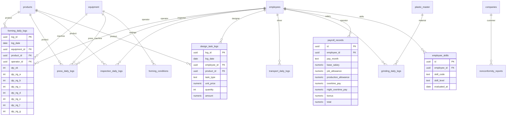

# GĐ 2 — THIẾT KẾ DATABASE: Implementation Plan
# YSDMS-Next V3 — Schema Extension for Daily Operations

> **Ngày:** 2026-08-21  
> **Đầu vào:** Hồ sơ nghiệp vụ hợp nhất (1,949 dòng) + Schema hiện tại (103 bảng)  
> **Mục tiêu:** Mở rộng DB để hỗ trợ nhật ký sản xuất, HR/lương, quản lý phế thải

---

## 1. GAP ANALYSIS — Schema hiện tại vs Yêu cầu mới

### 1A. Bảng ĐÃ TỒN TẠI (Chỉ cần mở rộng/verify)

| Bảng đề xuất | Bảng hiện có | Trạng thái | Hành động |
|-------------|-------------|-----------|----------|
| `forming_conditions` (24 fields) | ✅ `forming_conditions` | Đã tồn tại trong `database.types.ts` | **VERIFY** — so sánh cột hiện có vs 24 cột yêu cầu, thêm cột thiếu |
| `production_instructions` (14 fields) | ✅ `production_instructions` | Đã tồn tại, có tags system | **VERIFY** — kiểm tra cột material specs |
| `material_inventory` (8 fields) | ✅ `material_inventory` | Đã tồn tại | **VERIFY** — kiểm tra multi-site tracking |
| `employees` (mở rộng) | ✅ `employees` | Đã tồn tại (SSOT nhân sự) | **EXTEND** — thêm cột lương, phòng ban |

### 1B. Bảng CẦN TẠO MỚI

| # | Bảng mới | Số trường | Chức năng | FK chính | Ưu tiên |
|---|---------|----------|----------|---------|---------|
| 1 | **`forming_daily_logs`** | 28 | Nhật ký thành hình (thay giấy) | → `equipment`, `products`, `employees` | **P0** |
| 2 | **`press_daily_logs`** | 16 | Nhật ký dập cắt (thay giấy) | → `equipment`, `products`, `employees` | **P0** |
| 3 | **`inspection_daily_logs`** | 14 | Nhật ký kiểm tra (thay giấy) | → `products`, `employees` | **P0** |
| 4 | **`design_task_logs`** | 8 | Nhật ký thiết kế (tính lương) | → `products`, `employees` | **P1** |
| 5 | **`transport_daily_logs`** | 10 | Nhật ký vận chuyển | → `employees` | **P2** |
| 6 | **`nonconformity_reports`** | 14 | Báo cáo không phù hợp (ISO) | → `companies`, `products`, `employees` | **P1** |
| 7 | **`grinding_daily_logs`** | 10 | Nhật ký xay nhựa & phế thải | → `employees`, `plastic_master` | **P2** |
| 8 | **`payroll_records`** | 10 | Lương nhân viên hàng tháng | → `employees` | **P2** |
| 9 | **`employee_skills`** | 5 | Ma trận kỹ năng (△/○/◎) | → `employees` | **P2** |

### 1C. Bảng liên quan ĐÃ CÓ — tận dụng

| Bảng hiện có | Vai trò trong yêu cầu mới | Hành động |
|-------------|--------------------------|----------|
| `work_logs` (13 cột) | Nhật ký công việc chung (thiết kế/khuôn) | Đã có — dùng làm cơ sở cho `design_task_logs` |
| `inspections` | Kiểm tra chất lượng | Đã có — verify vs `inspection_daily_logs` |
| `defect_reports` | Báo cáo lỗi | Đã có — verify vs `nonconformity_reports` |
| `material_stock` | Tồn kho vật liệu | Đã có — verify vs `material_inventory` |
| `material_transactions` | Nhập/xuất kho | Đã có |
| `quotations` + `quotation_lines` | Báo giá | Đã có — verify vs Ch.8 yêu cầu LOT pricing |
| `invoices` + `invoice_lines` + `invoice_payments` | Hóa đơn, công nợ | Đã có (mới tạo R5) |

> [!IMPORTANT]  
> **Phát hiện quan trọng:** Nhiều bảng trong 103 bảng hiện tại đã cover một phần yêu cầu từ GĐ 1.  
> Cần **verify trước khi tạo mới** — tránh duplicate schema!

---

## 2. Đánh giá cần VERIFY trước khi quyết định

Các cặp bảng cần so sánh chi tiết (đọc cả 2 bên để quyết định: mở rộng bảng cũ hay tạo bảng mới):

| Đề xuất mới | Bảng hiện có | Câu hỏi |
|------------|-------------|---------|
| `inspection_daily_logs` | `inspections` + `tray_inspections` | Bảng `inspections` có đủ 8 loại lỗi (WC/BH/SC/DT/BR/FM/SD/OT) chưa? |
| `nonconformity_reports` | `defect_reports` | `defect_reports` có đủ trường cho báo cáo ISO khách hàng chưa? |
| `design_task_logs` | `work_logs` | `work_logs` có trường `task_type` cho 21 hạng mục đơn giá chưa? |
| `material_inventory` mở rộng | `material_stock` + `material_inventory` | 2 bảng hiện có đã cover multi-site chưa? |

> [!WARNING]
> **Cần đọc schema chi tiết của các bảng trên trước khi tạo migration.**  
> Nếu bảng hiện tại đã cover → chỉ ALTER TABLE thêm cột.  
> Nếu khác biệt quá lớn → tạo bảng mới.

---

## 3. ERD — Quan hệ giữa bảng mới và bảng hiện tại



---

## 4. MIGRATION STRATEGY — 3 Phases

### Phase A: Core Daily Logs (P0) — Thay thế giấy/Excel ngay

> **Ước tính:** 1 migration file, ~200 dòng SQL

#### [NEW] Migration: `YYYYMMDD_daily_logs_phase_a.sql`

**Tạo 3 bảng mới:**

1. **`forming_daily_logs`** — 28 cột
   - 7 pre-check boolean fields (heater, mold, cutter, plug, frame, stacking, water_base)
   - 7 defect categories (qty_ng_a through qty_ng_g) 
   - Start/end time, equipment_id, product_id, operator_id
   - Roll barcode (plastic_receipt_roll FK)

2. **`press_daily_logs`** — 16 cột
   - Equipment, product, operator
   - Shot count, OK/NG quantities
   - Bilingual notes (JP/VN)

3. **`inspection_daily_logs`** — 14 cột
   - 8 defect type counts (WC/BH/SC/DT/BR/FM/SD/OT)
   - Lot size, sample size, pass/fail
   - Disposition (廃棄/特別採用/製造中止)

**Extend 1 bảng:**
- `employees` — thêm `department`, `employment_type`, `hourly_rate` nếu chưa có

---

### Phase B: Design Salary + ISO Reports (P1)

> **Ước tính:** 1 migration file, ~150 dòng SQL

#### [NEW] Migration: `YYYYMMDD_daily_logs_phase_b.sql`

**Tạo 2 bảng mới:**

4. **`design_task_logs`** — 8 cột + enum `design_task_type`
   - 21 task types with fixed unit prices
   - Links employee × product × task_type → amount
   - Cơ sở tính lương thiết kế

5. **`nonconformity_reports`** — 14 cột (nếu `defect_reports` không đủ)
   - ISO 9001 compliant format
   - Customer-facing (客先提出用)
   - RCA + corrective action tracking

**Tạo 1 enum:**
```sql
CREATE TYPE design_task_type AS ENUM (
  'DESIGN',           -- 設計 ¥30,000/機種
  'MOLD_CAM',         -- 金型演算＆加工 ¥30,000/機種
  'PLUG_CAM',         -- プラグ演算＆加工 ¥10,000/機種
  'PROTO_PLUG_CAM',   -- 試作プラグ演算＆加工 ¥5,000/機種
  'PROTO_MOLD_CAM',   -- 試作金型演算＆加工 ¥10,000/機種
  'MOLD_DRILLING',    -- 本型穴あけ ¥3,000
  'MOLD_POLISHING',   -- 本型ミガキ ¥3,000
  'PROTO_DRILLING',   -- 試作穴あけ ¥1,500
  'PROTO_POLISHING',  -- 試作ミガキ ¥1,500
  'MOLD_FLANNEL',     -- 本型ネル貼り ¥5,000
  'PROTO_FLANNEL',    -- 試作ネル貼り ¥2,000
  'MOLD_HAND_PLUG',   -- 本型手造りプラグ ¥10,000
  'PROTO_HAND_PLUG',  -- 試作手造りプラグ ¥5,000
  'MATERIAL_DISPATCH',-- 材料出し ¥4,000/回
  'SHIPPING_WORK',    -- 出荷作業 ¥4,000/回
  'SHIPPING_ASSIST',  -- 出荷応援 ¥2,000/回
  'INSPECTION',       -- 検査 ¥3,000/機種
  'FORMING_ASSIST',   -- 成形補助 ¥2,000/時間
  'PRESS_ASSIST',     -- プレス応援 ¥10/ショット
  'DELIVERY',         -- 配送 ¥3,000~5,000/回
  'OTHER'             -- その他
);
```

---

### Phase C: HR/Payroll + Waste Management (P2)

> **Ước tính:** 1 migration file, ~150 dòng SQL

#### [NEW] Migration: `YYYYMMDD_daily_logs_phase_c.sql`

**Tạo 4 bảng mới:**

6. **`transport_daily_logs`** — 10 cột
7. **`grinding_daily_logs`** — 10 cột + enum `waste_source`
8. **`payroll_records`** — 10 cột
9. **`employee_skills`** — 5 cột + enum `skill_level` (TRAINEE/CAPABLE/INSTRUCTOR)

---

## 5. Open Questions — Cần quyết định trước khi tạo migration

> [!IMPORTANT]
> Các câu hỏi dưới đây ảnh hưởng đến thiết kế schema. Cần giám đốc xác nhận.

### Q1. Tận dụng hay tạo mới?

Một số bảng hiện tại có thể đã cover yêu cầu:

| Bảng đề xuất | Bảng hiện có | Lựa chọn |
|-------------|-------------|---------|
| `inspection_daily_logs` | `inspections` (đã có) | **A.** Mở rộng `inspections` thêm 8 defect counts? **B.** Tạo bảng mới riêng? |
| `nonconformity_reports` | `defect_reports` (đã có) | **A.** Mở rộng `defect_reports`? **B.** Tạo bảng mới? |

→ **Đề xuất:** Tôi sẽ đọc chi tiết schema `inspections` và `defect_reports` để quyết định. Nếu khác biệt >50% → tạo mới.

### Q2. Nhật ký thiết kế — dùng `work_logs` hay bảng riêng?

Hệ thống hiện tại đã có `work_logs` (13 cột) ghi nhật ký công việc. Có 2 cách:
- **A.** Mở rộng `work_logs` thêm `task_type`, `unit_price` → tính lương từ work_logs
- **B.** Tạo `design_task_logs` riêng → tách biệt nhật ký sản xuất vs nhật ký tính lương

→ **Đề xuất B** — tách riêng vì mục đích khác nhau (sản xuất vs HR/lương)

### Q3. Payroll — scope đến đâu?

- **A.** Chỉ lưu kết quả lương hàng tháng (import từ Excel) — đơn giản
- **B.** Tính lương tự động trong hệ thống (phức tạp, cần formula engine)

→ **Đề xuất A trước** — import kết quả, tính tự động sau

---

## 6. Verification Plan

### Automated
```bash
# Sau mỗi migration
npx supabase db push --dry-run    # Test migration syntax
npx tsc --noEmit                  # Verify TypeScript types
```

### Manual
1. Chạy migration trên local Supabase
2. Insert sample data vào mỗi bảng mới
3. Verify FK constraints hoạt động
4. Generate lại `database.types.ts` (quy trình an toàn — file tạm trước)
5. Verify UI code compile thành công

---

## 7. Tổng kết

| Phase | Bảng | Ưu tiên | Ước tính |
|-------|------|---------|---------|
| **A** | 3 bảng nhật ký sản xuất + extend employees | P0 | 1 migration |
| **B** | Design task logs + Nonconformity reports | P1 | 1 migration |
| **C** | Transport + Grinding + Payroll + Skills | P2 | 1 migration |
| **Total** | **9 bảng mới + 1 mở rộng + 2 enum** | | **3 migrations** |

> Cần verify 4 cặp bảng (Q1) trước khi bắt đầu Phase A.
