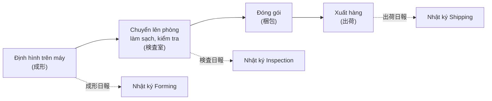
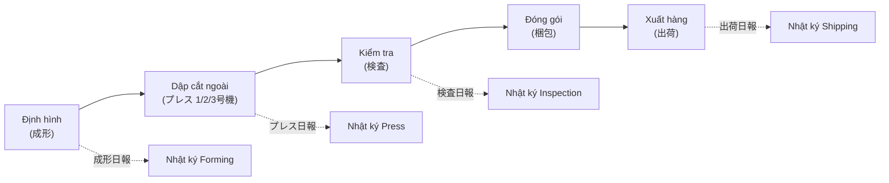
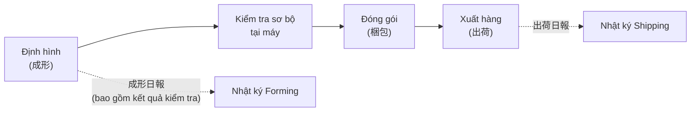
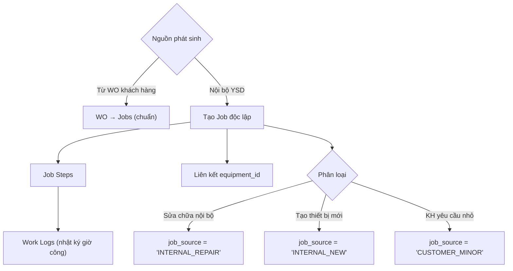
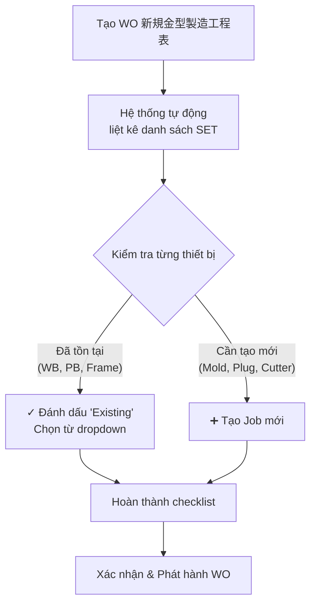

# 📎 PHỤ LỤC BỔ SUNG — HỒ SƠ NGHIỆP VỤ V3
# Cập nhật dựa trên phản hồi Giám đốc + tra cứu thực tế từ \\\\SERVER

> **Ngày cập nhật:** 2026-08-21  
> **Nguồn bổ sung:** Form nhật ký thực tế, file tính lương thiết kế, quy tắc đặt tên từ knowledge base  
> **Cách sử dụng:** Đọc kèm với `ysd_business_process_master_v3.md` — mỗi section dưới đây bổ sung vào chương tương ứng

---

## A. QUY TẮC ĐẶT TÊN KHUÔN / BẢN VẼ / PROTOTYPE

> Bổ sung vào **Chương 2 §2.2, §2.5, §2.6** và **Chương 3 §3.12**  
> Nguồn: `docs/technical/07_equipment_matching_and_naming_rules.md`, `knowledge/thermoforming_equipment_set.md`

### A1. Quy tắc đặt tên KHUÔN (system_code)

Tên khuôn KHÔNG có ký hiệu người thiết kế. Cấu trúc:

```
{Customer}-{Core}{Qualifier}-{CAV}-{Revision}-{Copy}
```

| Thành phần | Mô tả | Ví dụ |
|-----------|-------|-------|
| **Customer (B1)** | 2-5 ký tự viết hoa (mã khách hàng) | `JAE`, `TE`, `SMK`, `YSD` |
| **Core (B2a)** | 3 chữ số hoặc namespace code | `001`, `8-127-6` |
| **Qualifier (B2b)** | Hậu tố đặc biệt | `TB` (Top/Bottom), `AB` (2 parts), `M` (Small), `X` (Zomen), `PP`/`PS` (vật liệu) |
| **CAV (B3)** | Mã kích thước ngoài khuôn | `ZF`, `ZD`, `74C` |
| **Revision (B4)** | Phiên bản sửa đổi | `R1`, `R2` (R0 không đóng dấu vật lý) |
| **Copy (B6)** | Bản sao vật lý | `N1`, `N2` (bỏ qua nếu chỉ có 1 bản) |

**Ví dụ đầy đủ:** `JAE-001TB-ZD-R1-N2` = Khuôn JAE, mã 001 loại Top/Bottom, CAV ZD, sửa đổi lần 1, bản sao thứ 2

### A2. Quy tắc đặt tên BẢN VẼ (khác với tên khuôn!)

Bản vẽ CÓ ký hiệu người thiết kế:
```
{Tên_khuôn}P({Người_thiết_kế}){Revision}
```
**Ví dụ:** `JAE-036P(Q)R1` — Bản vẽ khuôn JAE-036, người thiết kế **Q**uan, revision 1

### A3. Quy tắc đặt tên PROTOTYPE

Prototype được đánh dấu bằng hậu tố **`D`** (Disposable/Test):
```
{Customer}-{Core}D    hoặc    {Customer}-{Core}-D
```
**Ví dụ:** `JAE-036D` = Khuôn prototype test pocket, KHÔNG phải khuôn sản xuất hàng loạt

> [!WARNING]
> **Cẩn thận:** Hậu tố `D` của prototype KHÁC với mã CAV Type `[D]` (354×300mm). Ngữ cảnh xác định ý nghĩa.

### A4. Quy tắc đặt tên THIẾT BỊ PHỤ TRỢ

| Loại thiết bị | Pattern | Ví dụ |
|--------------|---------|-------|
| Water Cooling Base (WB) | `WB-{CAV}` hoặc `WB-{LxW}` | `WB-74CZD`, `WB-530X350` |
| Pressure Base (PB) | `PB-{CAV}` hoặc `PB-{LxW}` | `PB-74CZD` |
| Frame (FR) | `FR-{CAV}-{UP/LO}` | `FR-74CZD-UP`, `FR-74CZD-LO` |
| Stacking Guide (ST) | `ST-{CAV}` | `ST-74CZD` |
| Cutter | Mã số duy nhất (không dùng prefix CT-) | `1042` |

---

## B. THUẬT NGỮ CAV — CHỈNH SỬA QUAN TRỌNG

> Bổ sung vào **Chương 3 §3.12**

> [!CAUTION]
> **CAV ≠ số khoang (pocket/cavity) trên khay!**
> 
> **CAV = tiêu chuẩn kích thước ngoài của khuôn (Actual Length × Actual Width)**

| CAV Type | Kích thước ngoài (mm) | Máy tương thích |
|----------|----------------------|-----------------|
| `A` | 470 × 300 | Rv53B |
| `ZD` | 470 × 347 | Rv53B |
| `ZF` | 495 × 347 | Rv53B |
| `74C` | 600 × 470 | Rv74C |
| `D` | 354 × 300 | Rv53B |

**Nguyên lý dùng chung thiết bị:** Đế làm mát (WB), đế khí nén (PB), khung (Frame) được dùng chung cho **mọi khuôn có cùng kích thước ngoài (CAV) và cùng kiểu trên/dưới**. VD: Tất cả khuôn CAV `ZD` đều dùng chung `WB-74CZD`, `PB-74CZD`, `FR-74CZD-UP/LO`.

**Số pocket (面数)** trên khay được ký hiệu riêng: `--2P`, `--3P` (2 pocket, 3 pocket). Đây KHÔNG liên quan đến CAV.

---

## C. NHẬT KÝ THIẾT KẾ & TÍNH LƯƠNG THEO SẢN PHẨM

> Bổ sung vào **Chương 2** — Section mới **§2.10**  
> **Nguồn xác minh:** `クアン設計集計.xlsx`, `クアン日報.xls`, `鈴木設計作業日報.xlsx` (từ `\\SERVER`)

### C1. Form nhật ký thiết kế hàng ngày

**File template:** `F 設計&金型部門日報記録書.xls`  
**Vị trí:** `source_data/Form lien quan/`

**Cấu trúc form:**

| Dòng | Nội dung | Mô tả |
|------|----------|-------|
| Header | 確認印 (Dấu xác nhận) | Ô ký duyệt của quản lý |
| Row 8 | 作業日：年/月/日 | Ngày làm việc |
| Row 8 | 作業者 | Tên nhân viên thiết kế (VD: クアン — Quan) |
| Row 8 | 労働時間 | Tổng thời gian làm việc trong ngày |
| Row 13+ | 【作業項目】 | Danh sách hạng mục thiết kế đã thực hiện |

**Mỗi dòng hạng mục ghi:**
- Mã sản phẩm/khuôn đang thiết kế (VD: JAE-036)
- Nội dung công việc (VD: Thiết kế layout CAD, Sửa bản vẽ R2)
- Thời gian thực hiện (giờ)

**Mục đích:** Giám đốc dùng nhật ký này để **tính lương theo sản phẩm** — mỗi sản phẩm thiết kế có đơn giá riêng, tổng lương = Σ(sản phẩm × đơn giá).

### C2. 13 HẠNG MỤC THIẾT KẾ PER SẢN PHẨM (Cơ sở tính lương)

> [!IMPORTANT]
> **File thực tế:** `\\SERVER\ysd-folder\社長データ\社長移動時フォルダ\クアン日報チェック\クアン設計集計.xlsx`  
> Đây là file giám đốc dùng để **tổng hợp và tính lương** cho nhân viên thiết kế theo sản phẩm.

**Mỗi sản phẩm thiết kế được tính công theo 13 hạng mục sau:**

| # | Cột | Tên JP | Mô tả | Loại |
|---|-----|--------|-------|------|
| 1 | 年月 | Year/Month | Tháng thực hiện | Metadata |
| 2 | 売上 | Product Code | Mã sản phẩm (VD: OOT-038, MTM-168) | Metadata |
| 3 | **設計** | Design | Thiết kế bản vẽ 2D layout | **Sản xuất** |
| 4 | **型3D** | Mold 3D | Dựng mô hình 3D khuôn | **Sản xuất** |
| 5 | **型演算** | Mold CAM | Lập trình đường chạy dao CNC cho khuôn | **Sản xuất** |
| 6 | **プラグ3D** | Plug 3D | Dựng mô hình 3D plug | **Sản xuất** |
| 7 | **プラグ演算** | Plug CAM | Lập trình CNC cho plug | **Sản xuất** |
| 8 | **型裏穴図** | Back Hole Drawing | Bản vẽ khoan lỗ mặt sau khuôn (làm mát/chân không) | **Sản xuất** |
| 9 | **試作3D** | Proto 3D | 3D mô hình khuôn prototype | **Thử nghiệm** |
| 10 | **試作演算** | Proto CAM | CAM cho khuôn prototype | **Thử nghiệm** |
| 11 | **試作プラグ3D** | Proto Plug 3D | 3D plug prototype | **Thử nghiệm** |
| 12 | **試作プラグ演算** | Proto Plug CAM | CAM plug prototype | **Thử nghiệm** |
| 13 | **試作型裏穴図** | Proto Back Hole | Bản vẽ khoan lỗ khuôn prototype | **Thử nghiệm** |
| 14 | **トレイ3D** | Tray 3D | Mô hình 3D sản phẩm khay | **Bổ trợ** |
| 15 | **プラグ加工** | Plug Machining | Gia công vật lý khuôn gỗ (plug) | **Thủ công** |

**Công thức tính lương thiết kế:**
```
Lương tháng = Σ (Hạng mục hoàn thành × Đơn giá hạng mục)
```

**Ví dụ:** Tháng 1/2022, Quan hoàn thành:
- OOT-038: 設計 + 型3D + 型演算 + プラグ3D + プラグ演算
- OOT-039: 設計 + 型3D
- MTM-168: 試作3D + 試作演算
→ Lương = (5 × đơn giá sản xuất) + (2 × đơn giá sản xuất) + (2 × đơn giá thử nghiệm)

### C3. File tài chính bộ phận thiết kế & khuôn

**File:** `金型&設計部門(2015～).xls` (9.69 MB)  
**Bản sao trên server:** `\\SERVER\ysd-folder\社長データ\...\クアン日報.xls` (6.5 MB)  
**Cấu trúc:** Sheet theo tháng (`2015年1月` → `2023年3月`, 100+ sheets)

**15 cột theo dõi tài chính hàng tháng (P&L bộ phận):**

| Cột | Tên JP | Mô tả |
|-----|--------|-------|
| 1 | 売上 | Doanh thu (bộ phận thiết kế + khuôn) |
| 2 | サカイメタル仕入れ | Mua vật liệu nhôm (Sakai Metal) |
| 3 | 清水屋商事仕入れ | Mua vật liệu (Shimizuya Shoji) |
| 4 | 抜型仕入れ | Mua dao cắt |
| 5 | テフロン加工 | Chi phí mạ Teflon |
| 6 | 木型材料費 | Chi phí vật liệu khuôn gỗ (Plug) |
| 7 | 宮一機工 | Gia công ngoài (Miyaichi Kiko) |
| 8 | パネレン | Gia công ngoài (Paneren) |
| 9 | 外注費 | Tổng chi phí outsource |
| 10 | 人件費（実績/社保1.21） | Chi phí nhân công (thực tế + BHXH ×1.21) |
| 11 | 場所代 | Chi phí mặt bằng |
| 12 | 電気代 | Chi phí điện |
| 13 | 事務所負担分 | Chi phí phân bổ văn phòng |
| 14 | 償却費 | Khấu hao thiết bị |
| 15 | **収支** | **P&L = Doanh thu − Tổng chi phí** |

**Cột bổ sung (từ 8/2015) — So sánh Outsource Việt Nam:**

| Cột | Nội dung |
|-----|----------|
| ベトナム委託 | Loại: 試作 (Prototype) / 本型 (Khuôn chính) |
| 数 | Số lượng |
| 単価 | Đơn giá outsource VN |
| 社内価格 | Giá nội bộ (nếu YSD tự làm) |
| 単価差額 | Chênh lệch = Giá nội bộ − Giá VN |
| 合計 | Tổng tiền tiết kiệm/chi phí |

### C4. File nhật ký thực tế trên Server (đã xác minh)

| File | Vị trí | Nội dung | Size |
|------|--------|---------|------|
| **クアン設計集計.xlsx** | `\\SERVER\社長データ\...\クアン日報チェック\` | 13 hạng mục thiết kế per sản phẩm (2022~) | — |
| **クアン日報.xls** | `\\SERVER\社長データ\...\クアン日報チェック\` | P&L bộ phận hàng tháng (2015~2023) | 6.5 MB |
| **鈴木設計作業日報.xlsx** | `\\SERVER\社長データ\5）金型関連\金型一覧\設計状況\` | Nhật ký thiết kế Suzuki | — |
| **日報(小林).xlsx** | `\\SERVER\社長データ\9）営業関連\小林関連\` | Nhật ký Sales Kobayashi | — |

### C5. Yêu cầu cho hệ thống YSDMS-Next

**Module cần xây dựng:**
1. **Form nhật ký thiết kế điện tử** — nhập 13 hạng mục + mã sản phẩm + giờ làm hàng ngày
2. **Bảng tổng hợp lương thiết kế** — tự tính Σ(hạng mục × đơn giá) = lương tháng
3. **P&L bộ phận** — 15 cột tài chính tự động cập nhật theo tháng
4. **So sánh nội bộ vs outsource VN** — theo dõi chênh lệch chi phí
5. **Chức năng in nhật ký** — in form giấy theo template ISO đã duyệt
6. **Nhật ký per nhân viên** — mỗi NV thiết kế có bảng tổng hợp riêng (như クアン設計集計)

---

## D. 3 LUỒNG SẢN XUẤT THỰC TẾ (Production Flow Variants)

> Thay thế **Chương 4 §4.3** hiện tại

### D1. Trường hợp 1: CUTTER_INLINE (Dao cắt liền)

Sản phẩm không cần dao cắt riêng — cắt trực tiếp trên máy định hình.



**Nhân viên & nhật ký:** Mỗi khâu có nhân viên riêng, ghi nhật ký riêng.

### D2. Trường hợp 2: CUTTER_SEPARATE (Dao cắt rời — 別抜き有)

Sản phẩm cần dao cắt riêng, dập trên máy Press bên ngoài.



**Lưu ý:** Trường hợp này có **4 loại nhật ký** — nhiều hơn 1 bước so với Case 1.

### D3. Trường hợp 3: Không cần kiểm tra từng chiếc

Sản phẩm đơn giản, chỉ kiểm tra sơ bộ tại chỗ.



**Lưu ý:** Kết quả kiểm tra sơ bộ ghi luôn vào 成形日報 (không tạo nhật ký kiểm tra riêng).

---

## E. NHẬT KÝ HÀNG NGÀY THEO BỘ PHẬN (Daily Reports per Department)

> Bổ sung vào **Chương 4 §4.4** và **Chương 7**

### E1. Form nhật ký theo bộ phận (đã xác nhận từ source_data)

| Bộ phận | File template | Cấu trúc | Ngôn ngữ |
|---------|--------------|----------|----------|
| **Thiết kế & Khuôn** | `F 設計&金型部門日報記録書.xls` | 作業日, 作業者, 労働時間, 【作業項目】 | JP |
| **Press & Kiểm tra** | `F プレス＆検査部門日報記録書.xls` | 型番 (Mold No.), 作業内容&ショット数, 備考欄, 作業時間, 付加価値(金額) | JP + VN |
| **Khuôn (ISO format)** | `F 金型部門日報兼不適合製品記録書.xls` | 作業日, 作業者, 【金型加工】+ 不適合記録 | JP |

### E2. Cấu trúc chi tiết Form Press & Inspection (Song ngữ JP/VN)

Đây là form **quan trọng nhất** cho sản xuất — ghi nhận cả press, inspection, và giá trị gia tăng.

| Cột | Tiếng Nhật | Tiếng Việt | Mô tả |
|-----|-----------|-----------|-------|
| 1 | 型番 | Số khuôn | Mã khuôn đang sử dụng |
| 2 | 作業内容＆ショット数 | Nội dung công việc & Số shot | Chi tiết thao tác + số lần dập |
| 3 | 備考欄 | Ghi chú | Báo cáo chi tiết nếu có sự cố |
| 4 | 作業時間 | Thời gian làm việc | Giờ thực hiện |
| 5 | 付加価値（金額）| Giá trị gia tăng (Tiền) | Giá trị sản phẩm tạo ra |

### E3. Yêu cầu cho hệ thống YSDMS-Next

1. **Module Nhật ký sản xuất** phải hỗ trợ **4 loại form** tương ứng 4 bộ phận
2. **Tự động xác định flow variant** dựa trên `equipment.equipment_type` (CUTTER_INLINE vs CUTTER_SEPARATE) → hiển thị form phù hợp
3. **Chức năng in nhật ký** theo template ISO đã duyệt (giữ nguyên format Excel hiện tại)
4. **Song ngữ JP/VN** — form Press đã có sẵn template song ngữ

---

## F. JOB ĐỘC LẬP KHÔNG TỪ WORK ORDER (Standalone Jobs)

> Bổ sung vào **Chương 3 §3.1** — Section mới **§3.1b**

### F1. Các trường hợp phát sinh Job không từ WO khách hàng

| Trường hợp | Mô tả | Ví dụ |
|-----------|-------|-------|
| **Tạo mới thiết bị phụ trợ** | WB, PB, Frame mới khi máy mới hoặc thay đổi CAV | Tạo WB-74CZD mới cho máy 8 |
| **Sửa khuôn do YSD lỗi** | YSD làm hỏng khuôn KH → tự sửa, không tính phí | Khuôn bị mẻ khi gia công |
| **Sửa khuôn do KH yêu cầu (nhỏ)** | KH yêu cầu sửa nhỏ, không phát sinh WO 新規金型製造工程表 | Đánh bóng lại bề mặt |
| **Làm lại dao cắt** | Dao cắt mòn, cần thay thế | Đặt lại dao cho sản phẩm JAE-001 |
| **Tạo Stacking mới** | Khi sản phẩm mới cần Stacking riêng | ST cho sản phẩm có chiều cao khác |

### F2. Luồng xử lý trong hệ thống



### F3. UI/UX Implications

- **Màn hình tạo Job** phải cho phép tạo job **không bắt buộc WO** (WO_ID nullable)
- **Dropdown nguồn phát sinh**: `INTERNAL_REPAIR` | `INTERNAL_NEW` | `CUSTOMER_MINOR` | `FROM_WO` (mặc định)
- **Quản đốc** có quyền tạo job độc lập; nhân viên thường chỉ tạo job từ WO

---

## G. QUY TRÌNH WO CHẾ TẠO KHUÔN MỚI — CHI TIẾT BỔ SUNG

> Cập nhật **Chương 3 §3.1**

### G1. Checklist thiết bị trên Chỉ thị (新規金型製造工程表)

Khi tạo WO chế tạo khuôn mới, chỉ thị bao gồm **danh sách tất cả thiết bị** trong SET, nhưng phần lớn thiết bị phụ trợ **đã tồn tại** và được đánh dấu sẵn:

| Thiết bị | Thường tạo mới? | Lý do |
|----------|-----------------|-------|
| **Khuôn (MOLD)** | ✅ Luôn tạo mới | Mỗi sản phẩm có khuôn riêng |
| **Plug (PLUG)** | ✅ Luôn tạo mới | Khuôn + Plug là **tổ hợp không tách rời** |
| **Dao cắt (CUTTER)** | ⚠️ Thường tạo mới | Khả năng dùng chung kém, hay phải làm mới |
| **Đế làm mát (WB)** | ❌ Đã tồn tại | Số lượng hạn chế, dùng chung theo CAV |
| **Đế khí nén (PB)** | ❌ Đã tồn tại | Số lượng hạn chế, dùng chung theo CAV |
| **Khung (FRAME)** | ❌ Đã tồn tại | Dùng chung theo CAV |
| **Stacking (ST)** | ⚠️ Tùy trường hợp | Tạo mới nếu chiều cao khay khác biệt |

### G2. Luồng xử lý trên UI



### G3. Ngoại lệ: WO sửa chữa do KH chỉ định

Khi KH yêu cầu sửa đổi khuôn (改造) hoặc sửa chữa (修理) → tạo WO mới type `MODIFICATION` / `REPAIR`, **có tính phí cho KH**. Khác với job nội bộ (F1) không tính phí.

---

## BẢNG TÓM TẮT THAY ĐỔI

| # | Vị trí | Nội dung thay đổi | Nguồn xác minh |
|---|--------|-------------------|----------------|
| A | Ch.2 §2.2 | Phân biệt tên bản vẽ (có người thiết kế) vs tên khuôn (không có) | `07_equipment_matching_and_naming_rules.md` |
| A | Ch.2 §2.5 | Quy tắc revision R0/R1/R2, naming convention | Knowledge base |
| A | Ch.2 §2.6 | Prototype naming: hậu tố `D` | Knowledge base |
| B | Ch.3 §3.12 | CAV = kích thước ngoài khuôn, KHÔNG phải số pocket | User feedback + knowledge base |
| C | Ch.2 NEW §2.10 | Nhật ký thiết kế + tính lương theo sản phẩm | `金型&設計部門(2015～).xls`, `F 設計&金型部門日報記録書.xls` |
| D | Ch.4 §4.3 | 3 luồng sản xuất: INLINE / SEPARATE / Quick check | User feedback + production catalog |
| E | Ch.4 §4.4 | 4 form nhật ký theo bộ phận + cấu trúc chi tiết | `F プレス＆検査部門日報記録書.xls` (song ngữ JP/VN) |
| F | Ch.3 NEW §3.1b | Job độc lập không từ WO (sửa nội bộ, tạo thiết bị phụ) | User feedback |
| G | Ch.3 §3.1 | WO checklist: thiết bị đã tồn tại vs cần tạo mới | User feedback + `新規金型製造工程表` |
