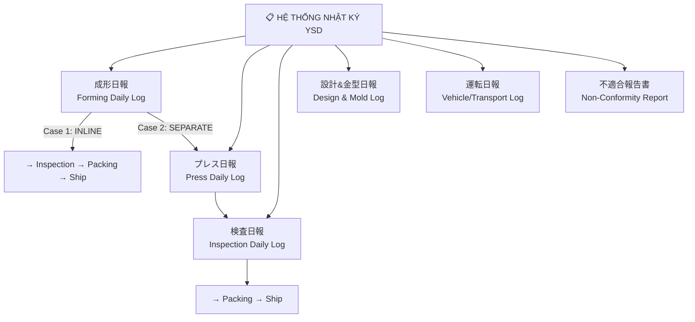
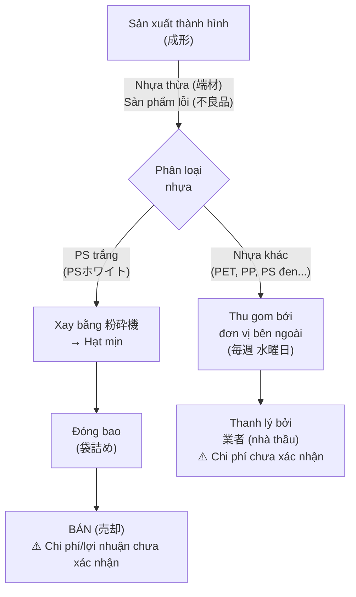
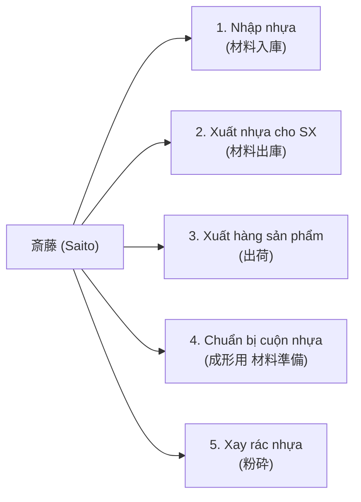
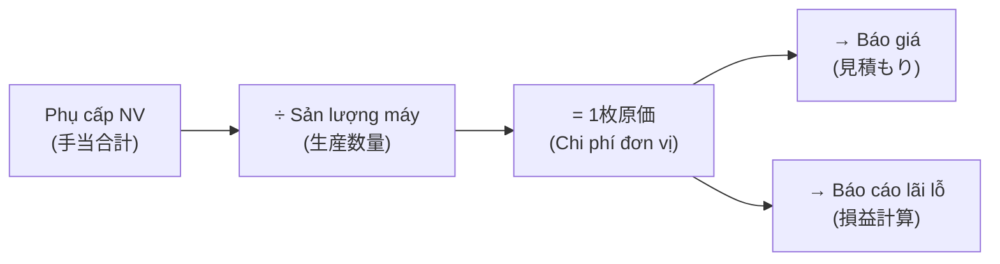

# 📋 ĐẶC TẢ NHẬT KÝ HÀNG NGÀY — TẤT CẢ BỘ PHẬN YSD
# Daily Report (日報) Specification for YSDMS-Next V3

> **Ngày lập:** 2026-08-21  
> **Nguồn:** Parse trực tiếp từ 7 file Excel form thực tế trong `source_data/Form lien quan/`  
> **Mục đích:** Cơ sở xây dựng DB tables và UI/UX form nhập liệu cho hệ thống

---

## TỔNG QUAN HỆ THỐNG NHẬT KÝ YSD



YSD có **6 loại nhật ký chính** + 1 báo cáo không phù hợp, mỗi loại có form riêng đã chuẩn hóa ISO.

---

## 1. NHẬT KÝ THÀNH HÌNH (成形日報)

**File template:** `F 日報兼不適合製品記録書（成形最新版）2-20-4.xls`  
**Phiên bản TE riêng:** `F TE用日報兼不適合製品記録書（成形）.xls`  
**Tên đầy đủ:** 日報兼不適合製品記録書（金型異常連絡書含む）  
**Người tạo/duyệt:** 小比類巻 (tạo) / 吉田 (duyệt — Giám đốc)

### 1A. Header — Thông tin chung

| # | Trường | Tên JP | Mô tả | Kiểu dữ liệu |
|---|--------|--------|-------|---------------|
| 1 | Máy | 機械ナンバー | Số hiệu máy thành hình (3号~9号) | Dropdown |
| 2 | Người thao tác | 作業者 | Tên công nhân đứng máy | Text/Dropdown |
| 3 | Ngày | 作業日 | 年/月/日 | Date |

### 1B. Thông tin sản phẩm & khuôn

| # | Trường | Tên JP | Mô tả | Kiểu |
|---|--------|--------|-------|------|
| 4 | Mã khuôn | 型番 | VD: 2-912020-4 | Text (link equipment) |
| 5 | Sản lượng / Số shot | 生産数量 / ショット数 | Số tấm sản xuất | Number |
| 6 | Kích thước khuôn | 金型サイズ | CAV code (VD: ZD, 74C) | Dropdown |
| 7 | Số khoang | 面数 | Số pocket trên 1 tấm (2P, 3P) | Number |
| 8 | Bước tiến | 送り寸法 | Khoảng cách tiến nhựa (mm) | Number |
| 9 | Số dao cắt | 抜刃番号 | Mã dao cắt đang sử dụng | Text (link equipment) |

### 1C. 7 Hạng mục kiểm tra trước sản xuất (Pre-production Checklist)

> [!IMPORTANT]
> Mỗi hạng mục phải có **dấu xác nhận (担当者印)** của người kiểm tra trước khi chạy máy.

| # | Hạng mục | Tên JP | Nội dung kiểm tra |
|---|----------|--------|-------------------|
| 10 | Vệ sinh máy | 機械汚れ | Kiểm tra cửa vào vật liệu, cửa ra sản phẩm |
| 11 | Hoạt động máy | 成形機動作確認 | Tiếng ồn bất thường, rò rỉ dầu |
| 12 | Khuôn | 金型セット確認 | Xước, hư hỏng Plug |
| 13 | Dao cắt | 抜型セット確認 | Hư hỏng, biến dạng |
| 14 | Stacking | スタッキング確認 | Hư hỏng, bẩn |
| — | *(Riêng TE)* | 材料状況確認 | Kiểm tra nguyên liệu (bẩn, hư hỏng) |
| — | *(Riêng TE)* | 条件入力 | Nhập điều kiện (nhiệt độ phòng, điều kiện mùa) |

### 1D. Thông tin vật liệu

| # | Trường | Tên JP | Mô tả | Kiểu |
|---|--------|--------|-------|------|
| 15 | Vật liệu sử dụng | 使用材料 | Loại nhựa, độ dày, thông số đặc biệt | Text |
| 16 | Nhà sản xuất | 材料メーカー | Tên NCC nhựa | Text |
| 17 | Mã lô | 材料ロット番号 | Lot tracking | Text |
| 18 | Số mét sử dụng | 使用m数 | Chiều dài cuộn nhựa đã dùng | Number (m) |

### 1E. Kiểm tra chất lượng tại máy

| # | Trường | Tên JP | Mô tả | Kiểu |
|---|--------|--------|-------|------|
| 19 | Kích thước bản vẽ | 長手×短手 図面寸法 | L × W theo spec | Number × Number |
| 20 | Kích thước thực đo | 長手×短手 実測値 | L × W đo thực tế | Number × Number |
| 21 | Kiểm tra 20 tấm đầu | 良品検出後20枚全数検査 | OK / NG (sau khi ra sản phẩm tốt đầu tiên) | Boolean |
| 22 | Chu kỳ thành hình | 成形サイクル | Giây/cycle | Number (s) |
| 23 | Tình trạng khung | フレーム状況確認 | OK / NG | Boolean |

### 1F. Phân loại lỗi (7 mã — 異常分類)

| Mã | Tên JP | Mô tả VN |
|----|--------|----------|
| **A** | 成形不良 | Lỗi thành hình (không đủ hình dạng, co ngót) |
| **B** | 抜きズレ不良 | Lỗi lệch cắt (dao cắt không đúng vị trí) |
| **C** | スタッキング不良 | Lỗi xếp chồng (khay không xếp đúng) |
| **D** | シート不良 | Lỗi tấm nhựa (vật liệu đầu vào kém) |
| **E** | 機械異常による不良 | Lỗi do máy bất thường |
| **F** | 金型、抜型異常 | Lỗi do khuôn/dao cắt bất thường |
| **G** | その他 | Lỗi khác |

### 1G. Xử lý sản phẩm lỗi (3 phương án — 処置)

| Mã | Tên JP | Mô tả VN | Ghi chú |
|----|--------|----------|---------|
| **1** | 廃棄 | Tiêu hủy | **Mặc định** — sản phẩm lỗi nguyên tắc phải tiêu hủy |
| **2** | 特別採用 | Chấp nhận đặc biệt | Cần phê duyệt từ KH hoặc quản lý |
| **3** | 製造中止 | Dừng sản xuất | Khi lỗi nghiêm trọng, dừng toàn bộ dây chuyền |

> [!WARNING]
> **Quy tắc:** Khi phát hiện lỗi → kiểm tra **30 tấm trước và sau** lỗi (前後30枚を全数検品)  
> **Quy tắc:** Khi vật liệu hao hụt ≥ 100 tấm → **bắt buộc ghi nhận** (材料100枚分のロス)

### 1H. Mục bổ sung

| # | Trường | Tên JP | Mô tả |
|---|--------|--------|-------|
| 24 | PP board check | 小箱作製用PP板保管確認 | Kiểm tra tấm PP cho hộp nhỏ: OK/NG |
| 25 | Ghi chú đặc biệt | 特記事項 | Free text |
| 26 | Số lượng lỗi | 不適合 数量 | Số tấm lỗi |
| 27 | Dấu hoàn thành | 終了印 | Ký xác nhận cuối ca |
| 28 | *(Riêng TE)* 出荷予定日 | Ngày giao hàng dự kiến | Date |

---

## 2. NHẬT KÝ DẬP CẮT (プレス日報)

**File template:** `F プレス＆検査部門日報記録書 - ベトナム語含む.xls`  
**Đặc điểm:** Song ngữ JP/VN

### 2A. Header

| # | Trường JP | Trường VN | Kiểu |
|---|----------|----------|------|
| 1 | 作業日 (年/月/日) | Ngày làm việc | Date |
| 2 | 作業者 | Người làm | Text/Dropdown |
| 3 | 労働時間 | Thời gian làm việc | Number (h) |

### 2B. Dữ liệu per sản phẩm (mỗi dòng = 1 khuôn)

| # | Trường JP | Trường VN | Mô tả | Kiểu |
|---|----------|----------|-------|------|
| 4 | 型番 | Mã hàng | Mã khuôn/sản phẩm | Text |
| 5 | 作業内容＆ショット数 | Nội dung & số shot | Chi tiết thao tác + số lần dập | Text + Number |
| 6 | 備考欄 | Ghi chú | Báo cáo chi tiết nếu có sự cố | Text |
| 7 | 作業時間 | Thời gian làm việc | Giờ cho hạng mục này | Number (h) |
| 8 | 付加価値（金額）| Giá trị gia tăng | Giá trị sản phẩm tạo ra (¥) | Number (¥) |

### 2C. Kiểm tra chất lượng tại Press

| # | Hạng mục | Tên JP | Mô tả |
|---|----------|--------|-------|
| 9 | Số lượng lỗi | 不適合 製品 | Đếm sản phẩm NG |
| 10 | Phân loại lỗi | 異常 分類 | Mã A~G (giống form thành hình) |
| 11 | Xử lý | 処置 | Mã 1/2/3 |
| 12 | Kích thước thực đo | 長手×短手（実測値） | L × W sau cắt |
| 13 | Kiểm tra hình dạng dao | カッター形状確認 | OK/NG |
| 14 | Kiểm tra 5 tấm đầu | 5枚チェック | Lấy 5 tấm đầu kiểm tra |
| 15 | Kiểm tra mỗi 100 tấm | 100枚毎にチェック | Sampling per 100 sheets |
| 16 | Kiểm tra bẩn | 汚れ | Vết bẩn trên sản phẩm |

---

## 3. NHẬT KÝ KIỂM TRA (検査日報)

**File template:** `F 検査作業日報兼日常点検.xls`  
**Phiên bản KSE:** `検査作業日報兼日常点検(KSE専用）「チェックリスト」－ベトナム語含む.xls`

### 3A. Header

| # | Trường | Tên JP | Kiểu |
|---|--------|--------|------|
| 1 | Ngày | 作業日 | Date |
| 2 | Người kiểm tra | 作業者 | Text |
| 3 | Ngày cập nhật form | 作成/改定年月日 | Date |

### 3B. Dữ liệu per sản phẩm

| # | Trường | Tên JP | Kiểu |
|---|--------|--------|------|
| 4 | Mã khuôn | 型番 | Text |
| 5 | Ngày thành hình | 成形日 | Date |
| 6 | Số lượng kiểm tra | 検査数量 | Number |

### 3C. 8 LOẠI LỖI CHI TIẾT (不具合 phân loại)

> [!IMPORTANT]
> Đây là hệ thống phân loại lỗi chuẩn ISO của YSD — cần implement **chính xác** trong DB.

| # | Mã | Tên JP | Tên VN | Mô tả |
|---|-----|--------|--------|-------|
| 1 | WC | 白化・割れ・潰れ | Bạc hóa / Nứt / Dập | Nhựa bị trắng hoặc gãy |
| 2 | BH | バリ・ヒゲ | Ba-via / Râu | Nhựa thừa ở mép cắt |
| 3 | SC | 傷 | Xước | Vết xước trên bề mặt |
| 4 | DT | 汚れ | Bẩn | Vết bẩn, dấu vân tay |
| 5 | BR | ブリッジ発生 | Bridge | Nhựa dính giữa 2 pocket |
| 6 | FM | 異物付着 | Dị vật | Vật lạ dính trên sản phẩm |
| 7 | SD | シート不良 | Lỗi tấm nhựa | Nguyên liệu đầu vào kém chất lượng |
| 8 | OT | 変形・その他 | Biến dạng / Khác | Sản phẩm méo hoặc lỗi khác |

---

## 4. NHẬT KÝ THIẾT KẾ & KHUÔN (設計＆金型日報)

**File template:** `F 設計&金型部門日報記録書.xls`  
**File ISO:** `F 金型部門日報兼不適合製品記録書.xls`  
**File tổng hợp lương:** `クアン設計集計.xlsx`

### 4A. Header

| # | Trường | Tên JP | Kiểu |
|---|--------|--------|------|
| 1 | Ngày | 作業日 | Date |
| 2 | Người thực hiện | 作業者 | Text |
| 3 | Tổng giờ làm | 労働時間 | Number (h) |

### 4B. Dữ liệu per hạng mục công việc

| # | Trường | Tên JP | Kiểu |
|---|--------|--------|------|
| 4 | Mã khuôn/sản phẩm | 型番 | Text (link equipment) |
| 5 | Nội dung công việc | 作業内容 | Text + Dropdown (13 loại — xem §4C) |
| 6 | Ghi chú (số shot...) | 備考欄 | Text |
| 7 | Thời gian | 作業時間 | Number (h) |
| 8 | **Giá trị gia tăng** | **付加価値（金額）** | **Number (¥)** — dùng tính lương |

### 4C. BẢNG ĐƠN GIÁ TÍNH LƯƠNG — 21 HẠNG MỤC (từ form thực tế)

> [!IMPORTANT]
> **Nguồn:** Form `Nippo_Final_ThoanRpt` (ảnh giám đốc cung cấp) — bảng đơn giá in trên form nhật ký.  
> Đây là bảng đơn giá **chính thức** để tính lương theo sản phẩm/công việc.


**Nhóm 1 — Thiết kế & CAM (設計・演算)**

| # | Hạng mục | Tên JP | Đơn giá | Đơn vị |
|---|----------|--------|---------|--------|
| 1 | Thiết kế bản vẽ | **設計** | **¥30,000** | 1機種 (per model) |
| 2 | Plug CAM & gia công | **プラグ演算＆加工** | **¥10,000** | 1機種 |
| 3 | Proto Plug CAM & gia công | **試作プラグ演算＆加工** | **¥5,000** | 1機種 |
| 4 | Khuôn CAM & gia công | **金型演算＆加工** | **¥30,000** | 1機種 |
| 5 | Proto Khuôn CAM & gia công | **試作金型演算＆加工** | **¥10,000** | 1機種 |

**Nhóm 2 — Gia công khuôn thủ công (金型仕上げ)**

| # | Hạng mục | Tên JP | Đơn giá | Đơn vị |
|---|----------|--------|---------|--------|
| 6 | Khoan lỗ khuôn chính | **本型穴あけ** | **¥3,000** | 1機種 |
| 7 | Đánh bóng khuôn chính | **本型ミガキ** | **¥3,000** | 1機種 |
| 8 | Khoan lỗ khuôn prototype | **試作穴あけ** | **¥1,500** | 1機種 |
| 9 | Đánh bóng khuôn prototype | **試作ミガキ** | **¥1,500** | 1機種 |
| 10 | Dán nỉ khuôn chính | **本型ネル貼り** | **¥5,000** | 1機種 |
| 11 | Dán nỉ khuôn prototype | **試作ネル貼り** | **¥2,000** | 1機種 |

**Nhóm 3 — Plug thủ công (手造りプラグ)**

| # | Hạng mục | Tên JP | Đơn giá | Đơn vị |
|---|----------|--------|---------|--------|
| 12 | Plug thủ công khuôn chính | **本型手造りプラグ** | **¥10,000** | 1機種 |
| 13 | Plug thủ công prototype | **試作手造りプラグ** | **¥5,000** | 1機種 |

**Nhóm 4 — Hỗ trợ liên phòng ban (応援・補助)**

| # | Hạng mục | Tên JP | Đơn giá | Đơn vị |
|---|----------|--------|---------|--------|
| 14 | Chuẩn bị vật liệu | **材料出し** | **¥4,000** | 1回 (per lần) |
| 15 | Xuất hàng | **出荷作業** | **¥4,000** | 1回 |
| 16 | Hỗ trợ xuất hàng | **出荷応援** | **¥2,000** | 1回 |
| 17 | Kiểm tra sản phẩm | **検査** | **¥3,000** | 1機種 |
| 18 | Hỗ trợ thành hình | **成形補助** | **¥2,000** | 時間 (per giờ) |
| 19 | Hỗ trợ Press | **プレス応援** | **¥10** | ショット (per shot) |

**Nhóm 5 — Vận chuyển (配送)**

| # | Hạng mục | Tên JP | Đơn giá | Đơn vị |
|---|----------|--------|---------|--------|
| 20 | Giao hàng | **配送** | **¥3,000~5,000** | 1回 (per chuyến) |

**Công thức tính lương:**
```
Lương tháng = Σ (Hạng mục hoàn thành × Đơn giá × Số lượng)

Ví dụ:
  設計 × 3 model = ¥30,000 × 3 = ¥90,000
  プラグ演算 × 3 = ¥10,000 × 3 = ¥30,000
  本型穴あけ × 3 = ¥3,000 × 3 = ¥9,000
  出荷応援 × 5 lần = ¥2,000 × 5 = ¥10,000
  成形補助 × 8h = ¥2,000 × 8 = ¥16,000
  ─────────────────────────────
  合計 = ¥155,000
```

---

## 5. NHẬT KÝ VẬN CHUYỂN (運転日報)

**File template:** `F 運転日報.xls`

### 5A. Header

| # | Trường | Tên JP | Kiểu |
|---|--------|--------|------|
| 1 | Ngày | 年/月/日 | Date |
| 2 | Thứ | 曜日 | DayOfWeek |
| 3 | Thời tiết | 天候 | Dropdown |
| 4 | Biển số xe | 車番 | Text (VD: 76-70) |
| 5 | Tên tài xế | 運転者名 | Text |

### 5B. Dữ liệu per chuyến (nhiều chuyến/ngày)

| # | Chiều đi (発) | Chiều đến (着) |
|---|-------------|---------------|
| 6 | 発地 (Điểm xuất phát) | 着地 (Điểm đến) |
| 7 | 時間 (Giờ xuất phát) | 時間 (Giờ đến) |
| 8 | 発メーター Km (Odometer xuất phát) | 着メーター Km (Odometer đến) |
| 9 | 実車：空車 (Có hàng / Không hàng) | — |
| 10 | 有料 IC (Trạm thu phí vào) | 有料 IC (Trạm thu phí ra) |

---

## 6. ĐIỀU KIỆN MÁY THÀNH HÌNH (成形条件一覧表)

**File template:** `3号機〜7号機成形条件一覧表.xls`  
**Sheets riêng per máy:** 3号機, 4号機, 5号機, 6号機, 7号機

### 6A. Thông tin sản phẩm & thiết bị

| # | Trường | Tên JP | Mô tả |
|---|--------|--------|-------|
| 1 | Mã P/N | P/N | Mã sản phẩm |
| 2 | Vật liệu | 材料 | Loại nhựa + thông số |
| 3 | Kích thước khuôn | 型寸 | Kích thước ngoài (CAV) |
| 4 | Vị trí khuôn | 型位置 | Vị trí lắp đặt trên máy |

### 6B. Thiết bị SET

| # | Trường | Tên JP | Mô tả |
|---|--------|--------|-------|
| 5 | Plug | プラグ | Mã plug sử dụng |
| 6 | Đế làm mát | 水冷盤 | Mã WB (VD: WB-74CZD) |
| 7 | Khung | 枠 | Mã Frame |
| 8 | Dao cắt | カッター | Mã Cutter |
| 9 | Stacking trên | スタッキング上 | Mã ST phía trên |
| 10 | Stacking dưới | スタッキング下 | Mã ST phía dưới |

### 6C. Thông số Heater (14 zones)

**7 zones Heater TRÊN (上ヒーター):**

| Zone | 01 | 02 | 03 | 04 | 05 | 06 | 07 |
|------|----|----|----|----|----|----|-----|
| Giá trị | °C | °C | °C | °C | °C | °C | °C |

**7 zones Heater DƯỚI (下ヒーター):**

| Zone | A | B | C | D | E | F | G |
|------|---|---|---|---|---|---|---|
| Giá trị | °C | °C | °C | °C | °C | °C | °C |

**Heater dao cắt:** `カッター部ヒーター` (°C)

### 6D. Thông số thời gian (Timing Parameters)

| # | Trường | Tên EN | Đơn vị |
|---|--------|--------|--------|
| 11 | Pre blowing | Thổi sơ bộ | — |
| 12 | Take off time | Thời gian lấy sản phẩm | s |
| 13 | Take off cycle | Chu kỳ lấy | — |
| 14 | Forming time | Thời gian thành hình | s |
| 15 | Demoulding time | Thời gian tháo khuôn | s |
| 16 | Mould table open delayed | Trễ mở bàn khuôn | s |
| 17 | Bottom table up delayed | Trễ nâng bàn dưới | s |
| 18 | Vacuum on | Bật chân không | 0~150mm |
| 19 | Vacuum cross section | Tiết diện chân không | 1~15 |
| 20 | Demoulding air section | Tiết diện khí tháo khuôn | 1~7 |
| 21 | Pre blowing off | Tắt thổi sơ bộ | 0~140mm |
| 22 | Material feeding | Bước tiến vật liệu | mm |
| 23 | Material speed | Tốc độ vật liệu | % |
| 24 | Speed top table up | Tốc độ nâng bàn trên | % |

---

## 7. CHỈ THỊ SẢN XUẤT (注文書兼指示書)

**File template:** `F 一般注文書兼指示書.xls`  
**Sheets:** `直送` (Giao thẳng), có thể có sheet khác per KH

### 7A. Header

| # | Trường | Tên JP | Kiểu |
|---|--------|--------|------|
| 1 | Số đơn | NO. | Text |
| 2 | Khách hàng | 様 (KH name) | Text |
| 3 | Ngày | DATE | Date |

### 7B. Dữ liệu per dòng sản phẩm (nhiều dòng/đơn)

| # | Trường | Tên JP | Mô tả | Kiểu |
|---|--------|--------|-------|------|
| 4 | Số yêu cầu | 要求No. | Mã tracking nội bộ | Text |
| 5 | P/N + Tên sản phẩm | P/N 品名 | Mã và tên sản phẩm | Text |
| 6 | Số lượng | 数量 | Số tấm/thùng cần sản xuất | Number |
| 7 | Ngày giao | 納期 | Hạn giao hàng | Date |
| 8 | Ghi chú | 備考 | Yêu cầu đặc biệt | Text |

### 7C. Thông tin vật liệu (per dòng sản phẩm)

| # | Trường | Tên JP | Ví dụ |
|---|--------|--------|-------|
| 9 | Chất liệu | 材質 | PS, PET, PP |
| 10 | Độ dày | 厚み | 0.50mm, 1.00mm |
| 11 | Chiều rộng | 巾 | 405mm, 640mm |
| 12 | Chống tĩnh điện | 帯電 | Có/Không |
| 13 | Silicon | シリコン | Có/Không |
| 14 | Phủ bề mặt | 塗布 | Có/Không |

---

## 8. BÁO CÁO KHÔNG PHÙ HỢP (不適合是正報告書)

**File template:** `F 不適合(製品)是正報告書(客先提出用）.xls`  
**Mục đích:** Gửi cho khách hàng khi có sự cố chất lượng

### 8A. Thông tin header

| # | Trường | Tên JP | Kiểu |
|---|--------|--------|------|
| 1 | Khách hàng | 殿 (KH name) | Text |
| 2 | Nhà sản xuất | 製造メーカー | Text (= YSD) |
| 3 | Mã khuôn | 型番 | Text |
| 4 | Tên sản phẩm | 品名 | Text |
| 5 | Bộ phận phát hành | 発行部門 | Dropdown |
| 6 | Số phát hành | 発行No. | Auto-increment |
| 7 | Ngày phát hành | 年/月/日 発行 | Date |
| 8 | Lot No. / Số lượng | Lot No. / 数量 | Text + Number |

### 8B. Nội dung báo cáo

| # | Trường | Tên JP | Mô tả |
|---|--------|--------|-------|
| 9 | Nội dung lỗi | 不良内容 | Mô tả chi tiết lỗi (text + ảnh) |
| 10 | Người phát hành | 発行者 | Ký tên |
| 11 | Dấu xác nhận | 確認印 | Quản lý ký duyệt |

### 8C. Phần xử lý (bộ phận chịu trách nhiệm điền)

| # | Trường | Tên JP | Mô tả |
|---|--------|--------|-------|
| 12 | Nguyên nhân | 発生流出原因 | Root Cause Analysis |
| 13 | Hạn trả lời | 年/月/日 迄に | Deadline phản hồi |
| 14 | *(Ghi chú)* | — | Nếu không kịp deadline → phải thông báo bằng văn bản |

---

## 9. XAY RÁC NHỰA & QUẢN LÝ PHẾ THẢI (粉砕・廃棄物管理)

> **Nguồn:** Phản hồi giám đốc + tra cứu mail (1,436 email 廃棄, 48 email 再生, 84 email 斎藤)  
> **Nhân viên phụ trách:** 斎藤 (Saito)  
> **ISO:** Có quy trình phân loại rác `廃棄物・リサイクル品・ゴミ分別手順書` và bảng đánh giá `環境側面特定表`

### 9A. Tổng quan quy trình xay rác nhựa (粉砕)



> [!NOTE]
> **Xác nhận từ giám đốc:** PS trắng sau xay → **chỉ bán**, không tái sử dụng nội bộ.  
> Các loại nhựa khác cũng **thanh lý** (không có thông tin tái sử dụng nội bộ).  
> Chi phí thu gom và lợi nhuận bán nhựa xay → **chưa xác nhận**, đang tìm tài liệu trên server.

### 9B. Quy tắc phân loại nhựa phế thải

| Loại nhựa | Xay được? | Xử lý |
|-----------|----------|-------|
| **PS trắng (PSホワイト)** | ✅ Có | Xay → đóng bao → **bán (売却)** |
| PS đen / PS màu | ❌ Không | Thu gom bên ngoài → thanh lý |
| PET | ❌ Không | Thu gom bên ngoài → thanh lý |
| PP | ❌ Không | Thu gom bên ngoài → thanh lý |
| Nhựa hỗn hợp | ❌ Không | Thu gom bên ngoài → thanh lý |

### 9C. Lưu ý về nhựa tái chế trên đơn hàng KH

> [!CAUTION]
> Mặc dù YSD KHÔNG tái sử dụng nội bộ nhựa xay, **một số KH vẫn ghi yêu cầu cấm nhựa tái chế trên đơn hàng**.  
> Hệ thống cần tracking flag này trên order/product để đảm bảo tuân thủ.

| Yêu cầu KH | Ý nghĩa | Ghi chú |
|------------|---------|---------|
| 再生材は不使用 | Không dùng nhựa tái chế | Đảm bảo 100% virgin |
| 粉砕材含有率 X% | Cho phép tối đa X% | Cần flag trên order |
| バージン/リサイクル/バージン | 3 lớp cấu trúc sandwich | Đặc biệt cho NCC nhựa |

### 9D. Nhật ký xay nhựa (sử dụng form chung với bộ phận khuôn)

| # | Trường | Tên JP đề xuất | Kiểu |
|---|--------|---------------|------|
| 1 | Ngày | 作業日 | Date |
| 2 | Người thực hiện | 作業者 | Text (VD: 斎藤) |
| 3 | Loại nhựa | 材料種類 | Dropdown (PS白) |
| 4 | Nguồn phế thải | 発生源 | Dropdown: 端材(rìa cắt) / 不良品(lỗi) / 試作(prototype) |
| 5 | Mã sản phẩm gốc | 元型番 | Text (link products — biết nhựa từ sản phẩm nào) |
| 6 | Khối lượng đầu vào | 投入量 | Number (kg) |
| 7 | Khối lượng đầu ra | 産出量 | Number (kg) — hạt mịn sau xay |
| 8 | Số bao | 袋数 | Number |
| 9 | Xử lý | 処理先 | Dropdown: 社内再利用(tái sử dụng) / 売却(bán) / 保管(lưu kho) |
| 10 | Ghi chú | 備考 | Text |

### 9E. Thu gom rác nhựa không xay được

| # | Trường | Tên JP đề xuất | Kiểu |
|---|--------|---------------|------|
| 1 | Ngày thu gom | 収集日 | Date (固定: 毎週水曜日 — thứ 4) |
| 2 | Đơn vị thu gom | 収集業者 | Text (tên nhà thầu) |
| 3 | Loại nhựa | 材料種類 | Multi-select (PET, PP, PS黒...) |
| 4 | Khối lượng | 重量 | Number (kg) |
| 5 | Chi phí / Thu nhập | 費用/収入 | Number (¥) — ⚠️ Cần xác nhận |
| 6 | Phiếu thu gom | マニフェスト番号 | Text (số phiếu quản lý chất thải theo luật) |

### 9F. Phế khuôn kim loại (金型廃棄)

> Quy trình riêng — 1,436 email liên quan

| Bước | Mô tả | Người thực hiện |
|------|-------|----------------|
| 1 | KH yêu cầu xử lý khuôn hết đời | 業務 (Operations) |
| 2 | YSD kiểm tra trạng thái khuôn, xác nhận 廃棄可否 | 金型 (Mold dept) |
| 3 | Chuyển khuôn cho NLC / SJI xử lý | 運転 (Transport) |
| 4 | Phát hành 金型廃棄料 cho KH | 業務 (Operations) |
| 5 | Thu hồi giá trị kim loại phế liệu (相殺) | 経理 (Accounting) |

---

## 10. QUẢN LÝ VẬT LIỆU & VAI TRÒ 斎藤 (Material Handling)

> **Nhân viên phụ trách:** 斎藤 (Saito) — thực hiện **đồng thời 5 nghiệp vụ**  
> **Bằng chứng:** 84 email mentions, hàng trăm file `材料在庫(YY-MM-DD)指示書連動.xlsx`

### 10A. 5 Nghiệp vụ do 斎藤 phụ trách



### 10B. Nhật ký vật liệu (hiện tại = Excel hàng ngày)

**File mẫu:** `材料在庫(24-10-1)指示書連動.xlsx`  
**Tần suất:** **Mỗi ngày 1 file** — hàng trăm file tồn tại trên server  
**Vấn đề:** Cực kỳ tốn công, dễ sai sót, không có single source of truth

| # | Trường | Mô tả | Kiểu |
|---|--------|-------|------|
| 1 | Ngày | Ngày kiểm kê | Date |
| 2 | Loại nhựa | VD: PET 0.5t 640mm 帯電防止 | Text |
| 3 | NCC | Nhà cung cấp nhựa | Text |
| 4 | Tồn kho đầu ngày | Số cuộn/kg | Number |
| 5 | Nhập trong ngày | Số cuộn/kg nhận từ NCC | Number |
| 6 | Xuất cho SX | Số cuộn/kg cấp cho thành hình | Number |
| 7 | Tồn kho cuối ngày | = Đầu ngày + Nhập − Xuất | Number (tự tính) |
| 8 | Liên kết chỉ thị | Mã đơn hàng/chỉ thị sử dụng | Text (link orders) |

### 10C. Yêu cầu cho hệ thống YSDMS-Next

1. **Module quản lý kho nhựa** — thay thế hàng trăm file Excel hàng ngày
2. **Tracking nhựa tái chế** — tỷ lệ 粉砕材含有率 per sản phẩm/đơn hàng
3. **Liên kết chỉ thị → vật liệu** — biết đơn nào dùng nhựa gì, bao nhiêu
4. **Dashboard vật liệu** — tồn kho realtime, cảnh báo hết hàng
5. **Nhật ký xay nhựa** — tracking khối lượng xay, đóng bao, xử lý
6. **Lịch thu gom** — nhắc nhở thứ 4 hàng tuần, tracking phiếu manifesto

---

## 11. NHÂN SỰ, LƯƠNG & MA TRẬN KỸ NĂNG (人事・給与・スキルマップ)

> **Nguồn:** `従業員名簿2026.1.xls`, `給与＆損益資料` trên server, `教育訓練2026年度.xls`  
> **Quy mô:** ~14 nhân viên chính thức (bao gồm nhân sự người Việt)

### 11A. Cấu trúc lương nhân viên — LƯƠNG THÁNG (給与構造)

> [!NOTE]
> **Xác nhận từ giám đốc:** Tất cả bộ phận đều nhận **lương theo tháng** (月給制).  
> Bảng đơn giá 21 hạng mục (§4C) **CHỈ áp dụng cho bộ phận Thiết kế** — các bộ phận khác chỉ dùng tham khảo.

**File thực tế:** `\\SERVER\ysd-folder\社長データ\2）個人ファイル\給与＆損益資料\給与・賞与\2019.01.給与.xlsx`  
**Lịch sử:** Có dữ liệu từ **2008 đến 2024**, tổ chức theo tháng

| # | Hạng mục | Tên JP | Mô tả | Kiểu |
|---|----------|--------|-------|------|
| 1 | Lương cơ bản | **基本給** | Mức lương cố định hàng tháng | Number (¥) |
| 2 | Phụ cấp chức vụ | **職務手当** | Phụ cấp theo vai trò/trách nhiệm | Number (¥) |
| 3 | **Phụ cấp sản xuất** | **生産手当** | Bộ phận thành hình — xem §11B₂ bên dưới | Number (¥) |
| 4 | Giờ làm thêm | **残業時間** | Số giờ OT trong tháng | Number (h) |
| 5 | Phụ cấp làm thêm | **残業代** | = Giờ OT × 残業単価 (per NV) | Number (¥) |
| 6 | Giờ OT đêm | **深夜残業時間** | Số giờ OT ca đêm (22:00~5:00) | Number (h) |
| 7 | Phụ cấp OT đêm | **深夜残業代** | = Giờ OT đêm × 深夜残業単価 (per NV) | Number (¥) |
| 8 | **Tổng lương tháng** | **総額** | = 基本給 + 各手当 + 残業代 + 深夜残業代 | Number (¥) |
| 9 | Thưởng | **賞与** | Bonus (thường 2 lần/năm: 夏・冬) | Number (¥) |
| 10 | **Tổng thu nhập năm** | **所得総額** | = Tổng 12 tháng lương + Thưởng | Number (¥) |

### 11B₁. Lương theo sản phẩm — CHỈ bộ phận Thiết kế (設計部門のみ)

> [!IMPORTANT]
> **CHỈ bộ phận Thiết kế & Khuôn** dùng hệ thống tính lương theo sản phẩm (21 hạng mục — xem §4C).  
> Các bộ phận khác (成形, プレス, 検査, 出荷) nhận **lương tháng cố định**.  
> Bảng đơn giá ở §4C vẫn được ghi trên form nhật ký các bộ phận khác, nhưng chỉ để **tham khảo giá trị gia tăng**, không dùng tính lương.

```
Bộ phận Thiết kế:
  Lương = 基本給 + 職務手当 + Σ(21 hạng mục × Đơn giá) + 残業代

Bộ phận khác (成形, プレス, 検査, 出荷, 粉砕...):
  Lương = 基本給 + 職務手当 + 生産手当 + 残業代
```

### 11B₂. Phụ cấp bộ phận Thành hình (成形部門手当)

> [!WARNING]
> **PHÁT HIỆN QUAN TRỌNG:** File `成形部門手当一覧.xls` cho thấy phụ cấp thành hình  
> được dùng trực tiếp để tính **chi phí đơn vị sản phẩm (1枚原価)** — liên kết HR ↔ Sản xuất ↔ Kế toán.

**File:** `\\SERVER\ysd-folder\社長データ\6）成形関連\成形ロス表\成形部門手当一覧.xls`  
**Sheet:** `時間外手当一覧` (Bảng phụ cấp ngoài giờ)

**Cấu trúc per nhân viên × per máy:**

| # | Trường | Tên JP | Mô tả |
|---|--------|--------|-------|
| 1 | Máy phân công | 機番 | 3号機, 4号機, 5号機, 6号機, 7号機 |
| 2 | Tên nhân viên | 作業者 | VD: 李, 谷口, 岩崎 |
| 3 | Tổng giờ làm | 労働時間 | Tổng giờ trong tháng |
| 4 | Giờ OT | 残業時間 | Số giờ làm thêm |
| 5 | Giờ OT đêm | 深夜残業時間 | Số giờ ca đêm |
| 6 | Đơn giá OT | 残業単価 | ¥/giờ OT — **per nhân viên** |
| 7 | Đơn giá OT đêm | 深夜残業単価 | ¥/giờ OT đêm — **per nhân viên** |
| 8 | Phụ cấp sản xuất | 生産手当 | Phụ cấp sản lượng theo máy |
| 9 | **Tổng phụ cấp** | **手当合計** | = 残業代 + 深夜残業代 + 生産手当 |
| 10 | Thù lao theo giờ | 時間当報酬 | = 手当合計 ÷ 労働時間 |
| 11 | **Chi phí đơn vị** | **1枚原価** | = Chi phí nhân công cho 1 tấm sản phẩm |

**Luồng tính toán:**



> **Ý nghĩa:** Hệ thống YSDMS-Next cần liên kết module HR (phụ cấp) + module Sản xuất (sản lượng máy) + module Kế toán (chi phí đơn vị) để tự động tính `1枚原価` thay vì Excel thủ công.

### 11C. Danh sách nhân viên (従業員名簿)

**File:** `従業員名簿2026.1.xls` (~14 NV)

| # | Trường | Tên JP | Mô tả | Bảo mật |
|---|--------|--------|-------|---------|
| 1 | Họ tên | 氏名 | Tên đầy đủ | 🔒 PII |
| 2 | Địa chỉ | 住所 | Địa chỉ cư trú | 🔒 PII |
| 3 | Điện thoại | 電話 | Số điện thoại | 🔒 PII |
| 4 | Ngày sinh | 生年月日 | Format: H + năm | 🔒 PII |
| 5 | Ngày vào công ty | 入社月日 | Ngày bắt đầu làm việc | — |
| 6 | Mã văn phòng | 事業所記号 | VD: 6008 | — |
| 7 | Số thẻ bảo hiểm | 保険証番号 | Mã BHYT | 🔒 PII |
| 8 | MyNumber | マイナンバー | Số CCCD Nhật Bản (12 chữ số) | 🔒🔒 Tối mật |

> [!CAUTION]
> **MyNumber (マイナンバー)** là dữ liệu **cực kỳ nhạy cảm** theo luật Nhật Bản.  
> Hệ thống PHẢI mã hóa, hạn chế truy cập, và ghi log mọi lần xem.

### 11D. Ma trận kỹ năng (スキルマップ / 教育訓練計画書)

**File:** `教育訓練2026年度.xls`  
**Đánh giá 20+ NV × 15+ kỹ năng:**

| Ký hiệu | Mức độ | Ý nghĩa |
|---------|--------|---------|
| **△** | Đang đào tạo | Chưa thể tự thực hiện |
| **○** | Thành thạo | Có thể tự thực hiện |
| **◎** | Hướng dẫn viên | Có thể đào tạo người khác |

**Danh sách kỹ năng theo bộ phận:**

| Bộ phận | Kỹ năng | Tên JP |
|---------|---------|--------|
| **Tổng vụ (総務)** | Tiếp điện thoại | 電話応対 |
| | Tiếp khách | 接客 |
| | Nhận đơn hàng | 受注業務 |
| | Báo giá | 見積もり |
| **Khuôn (金型)** | Dán nỉ | ネル張り |
| | Gia công mặt trước | 表加工 |
| | Gia công mặt sau | 裏加工 |
| | Khoan lỗ | 穴あけ |
| | Đánh bóng | 磨き |
| **Thành hình (成形)** | Thành hình chân không | 真空成形 |
| | Thành hình chân không + khí nén | 真空圧空成形 |
| | Kiểm tra sản phẩm | 検査 |
| | Vận hành máy Press | プレス機 |
| | Xuất hàng | 出荷作業 |
| | **Xay rác nhựa** | **粉砕作業** |
| | Nhận vật liệu | 材料受け入れ |
| **Khác** | Thiết kế | 設計 |
| | CAD | CAD |
| | Giao hàng | 配送業務 |
| | Quản lý công đoạn | 工程管理 |

### 11E. Chi phí xử lý rác thải (産業廃棄物)

**File:** `産業廃棄物管理票交付等状況報告書21.06.22.xls`

| Hạng mục | Giá trị |
|----------|---------|
| Loại rác | 廃プラスチック類木くず (Nhựa + gỗ phế thải) |
| Khối lượng | **6 tấn / năm** |
| Đơn vị xử lý | **日本ダスト株式会社** (Nippon Dust Co., Ltd.) |
| Địa điểm xử lý | Kawasaki City |
| Báo cáo cho | Kanagawa, Yokohama, Kawasaki (cơ quan địa phương) |
| Đơn vị xử lý khác | **鶴見油化** (Tsurumi Yuka) — có chứng nhận xử lý |
| Tần suất báo cáo | **Hàng năm** (tháng 6 cho năm tài chính trước) |

### 11F. Yêu cầu cho hệ thống YSDMS-Next

1. **Module HR** — quản lý NV, bảo mật MyNumber, phân quyền truy cập PII
2. **Module lương** — 基本給 + 職務手当 + OT + lương theo sản phẩm (§4C)
3. **Skill Matrix online** — gán NV vào ca/máy dựa trên trình độ (△/○/◎)
4. **Training tracker** — theo dõi lộ trình đào tạo per NV per kỹ năng
5. **Báo cáo rác thải** — tự tính khối lượng từ nhật ký xay + thu gom → xuất báo cáo 産業廃棄物管理票

---

## BẢNG TỔNG HỢP — MAPPING FORM → DB TABLE

| Form | DB Table đề xuất | Số trường | Liên kết |
|------|------------------|-----------|---------|
| 成形日報 | `forming_daily_logs` | 28 | → `equipment`, `products`, `employees` |
| プレス日報 | `press_daily_logs` | 16 | → `equipment`, `products`, `employees` |
| 検査日報 | `inspection_daily_logs` | 14 | → `products`, `employees` |
| 設計&金型日報 | `design_mold_daily_logs` | 8 | → `products`, `employees`, `design_task_types` |
| 運転日報 | `transport_daily_logs` | 10 | → `employees`, `vehicles` |
| 成形条件 | `forming_conditions` | 24 | → `equipment`, `products`, `machines` |
| 注文書兼指示書 | `production_instructions` | 14 | → `orders`, `products`, `plastic_master` |
| 不適合報告書 | `nonconformity_reports` | 14 | → `companies`, `products`, `employees` |
| **粉砕日報** | **`grinding_daily_logs`** | **10** | → `products`, `employees`, `plastic_master` |
| **材料在庫** | **`material_inventory`** | **8** | → `orders`, `plastic_master`, `employees` |
| **従業員名簿** | **`employees`** (既存) | **8** | → `departments`, `skills` |
| **給与明細** | **`payroll`** | **9** | → `employees`, `design_task_logs` |
| **スキルマップ** | **`employee_skills`** | **3** | → `employees`, `skill_types` |

### Enum: Defect Types (共通)

```typescript
enum DefectType {
  FORMING_DEFECT = 'A',        // 成形不良
  CUTTING_MISALIGN = 'B',      // 抜きズレ不良
  STACKING_DEFECT = 'C',       // スタッキング不良
  SHEET_DEFECT = 'D',          // シート不良
  MACHINE_ABNORMAL = 'E',      // 機械異常による不良
  MOLD_CUTTER_ABNORMAL = 'F',  // 金型、抜型異常
  OTHER = 'G',                 // その他
}
```

### Enum: Inspection Defect Types (検査専用)

```typescript
enum InspectionDefectType {
  WHITENING_CRACK_CRUSH = 'WC',  // 白化・割れ・潰れ
  BURR_WHISKER = 'BH',           // バリ・ヒゲ
  SCRATCH = 'SC',                // 傷
  DIRT = 'DT',                   // 汚れ
  BRIDGE = 'BR',                 // ブリッジ発生
  FOREIGN_MATTER = 'FM',         // 異物付着
  SHEET_DEFECT = 'SD',           // シート不良
  DEFORM_OTHER = 'OT',           // 変形・その他
}
```

### Enum: Disposition Types (処置)

```typescript
enum DispositionType {
  DISCARD = '1',          // 廃棄 (mặc định)
  SPECIAL_ACCEPT = '2',  // 特別採用 (cần phê duyệt)
  STOP_PRODUCTION = '3', // 製造中止
}
```

### Enum: Waste Source (粉砕 発生源)

```typescript
enum WasteSource {
  EDGE_SCRAP = 'EDGE',       // 端材 — rìa cắt từ thành hình
  DEFECTIVE = 'DEFECTIVE',   // 不良品 — sản phẩm lỗi
  PROTOTYPE = 'PROTOTYPE',   // 試作 — prototype test
  OBSOLETE = 'OBSOLETE',     // 旧品 — sản phẩm cũ không dùng
}
```

### Enum: Plastic Recyclability (再利用可否)

```typescript
enum PlasticRecyclability {
  GRINDABLE_PS_WHITE = 'PS_WHITE',  // PS trắng — xay được
  NOT_GRINDABLE = 'OTHER',          // Nhựa khác — thu gom bên ngoài
}
```
