# 🌳 BẢN ĐỒ CẤU TRÚC DOANH NGHIỆP YSD — CÂY RỄ TOÀN DIỆN

> **Ngày tổng hợp:** 2026-08-21  
> **Phương pháp:** Phân tích 3 nguồn thực tế bằng 3 subagent song song  
> **Nguồn dữ liệu:**
> - 📧 190MB mail nghiệp vụ (toanysdmail.CSV + toanysdmail2.csv) — ~37,000+ email
> - 📚 14+ file tài liệu nghiệp vụ + 10 thư mục source_data
> - 🖥️ `\\SERVER` file server (227,799 files trên 2 shares: ysd-folder + ysd-cad)

---

## TỔNG QUAN DOANH NGHIỆP

**Yoshida Package (YSD)** — Doanh nghiệp sản xuất khay nhựa thermoforming phục vụ ngành điện tử, ô tô, thực phẩm. Hoạt động bao gồm: thiết kế sản phẩm, chế tạo khuôn/thiết bị, sản xuất hàng loạt, giao hàng, và dịch vụ quản lý tài sản khuôn cho khách hàng.

**Quy mô dữ liệu thực tế:**
- ~1,800 tài khoản khách hàng (từ `新一般注文書` trên server)
- 59,511 file đơn hàng đang hoạt động + 49,961 file đã archive
- 30,066 file bản vẽ CAD + 22,903 file dữ liệu khuôn + 14,279 file plug
- 483+ file Excel kiểm kê vật liệu thủ công (cập nhật hàng ngày)
- 14,651 email liên quan báo giá, 7,344 email liên quan khuôn, 3,659 email liên quan bản vẽ

---

## CÂY CẤU TRÚC DOANH NGHIỆP (Enterprise Root Tree)

```mermaid
graph TD
    YSD["🏭 YOSHIDA PACKAGE<br/>(Doanh nghiệp)"]

    YSD --> S["📊 SALES<br/>営業・受注"]
    YSD --> E["✏️ ENGINEERING<br/>設計・開発"]
    YSD --> M["🔧 MOLD & EQUIPMENT<br/>金型・設備"]
    YSD --> P["🏭 PRODUCTION<br/>成形・製造"]
    YSD --> MAT["📦 MATERIAL<br/>材料・在庫"]
    YSD --> QC["🔍 QUALITY<br/>品質・検査"]
    YSD --> L["🚚 LOGISTICS<br/>出荷・納品"]
    YSD --> F["💰 FINANCE<br/>経理・請求"]
    YSD --> A["📋 ADMIN / HR / ISO<br/>管理・人事"]

    S --> S1["案件管理 Business Cases"]
    S --> S2["見積 Quotation"]
    S --> S3["受注 Order Management"]
    S --> S4["顧客管理 Customer Mgmt"]
    S --> S5["価格改定 Price Revision"]

    E --> E1["製品設計 Product Design"]
    E --> E2["設計版管理 Design Revisions"]
    E --> E3["図面承認 Drawing Approval"]
    E --> E4["CADファイル管理 CAD Files"]

    M --> M1["金型製作 Mold Fabrication"]
    M --> M2["設備ライフサイクル Equipment Lifecycle"]
    M --> M3["金型貸出 Mold Loan"]
    M --> M4["金型棚卸 Inventory Check"]
    M --> M5["金型保管料 Storage Fee"]
    M --> M6["金型廃棄 Disposal"]

    P --> P1["生産計画 Production Planning"]
    P --> P2["生産指示書 Production Instructions"]
    P --> P3["成形実行 Thermoforming Exec"]
    P --> P4["日報・工数 Work Logs"]

    MAT --> MAT1["材料調達 Procurement"]
    MAT --> MAT2["在庫管理 Stock Control"]
    MAT --> MAT3["材料消費 Consumption"]

    QC --> QC1["検査 Inspection"]
    QC --> QC2["不具合・クレーム Claims"]
    QC --> QC3["検査表 Inspection Sheets"]

    L --> L1["出荷 Shipping"]
    L --> L2["納品書 Delivery Notes"]
    L --> L3["配送管理 Transport"]

    F --> F1["請求書 Invoicing"]
    F --> F2["売上管理 Sales Tracking"]
    F --> F3["公債管理 Debt Mgmt"]
    F --> F4["金型保管料請求 Storage Billing"]

    A --> A1["ISO管理 ISO Compliance"]
    A --> A2["人事・勤怠 HR & Attendance"]
    A --> A3["教育訓練 Training"]
    A --> A4["目標管理 Goal Mgmt"]
```

---

## 詳細 — 9 NHÁNH CHÍNH

### 🌿 NHÁNH 1: SALES — 営業・受注 (Kinh doanh & Đơn hàng)

**Tần suất mail:** 見積 14,651 | 受注 219 | 打合せ 546

| Cấp | Nghiệp vụ | Chi tiết | Bảng DB hiện tại | Trạng thái |
|-----|-----------|---------|-------------------|------------|
| L2 | **案件管理 Business Cases** | Tiếp nhận yêu cầu từ khách, theo dõi cơ hội kinh doanh | `business_cases` | ✅ Có |
| L3 | → Tiếp nhận RFQ | Email/điện thoại từ khách → ghi nhận yêu cầu | — | ⚠️ Chỉ qua mail |
| L3 | → Tư vấn vật liệu & quy cách | Thảo luận PET/PP/PS, kích thước, pocket, stacking | — | ⚠️ Chỉ qua mail |
| L3 | → Theo dõi tiến độ case | Từ inquiry → quotation → order → closed | `business_cases.status` | ✅ Có |
| L2 | **見積 Quotation** | Báo giá khuôn + báo giá sản xuất khay | — | ❌ **GAP-1** |
| L3 | → Báo giá khuôn mới | Tính theo loại khuôn, vật liệu, cavity, máy CNC | — | ❌ Chưa có |
| L3 | → Báo giá sản xuất khay | Giá/cái, giá/thùng, điều kiện thanh toán | — | ❌ Chưa có |
| L3 | → Phiên bản báo giá (Rev 1/2/3) | Thương lượng nhiều lần → tạo revision | — | ❌ Chưa có |
| L3 | → Công thức tính giá | `見積り計算式.xlsm` trên server | — | ⚠️ Excel only |
| L2 | **受注 Order Management** | Nhận PO từ khách → tạo đơn hàng | `orders`, `order_lines` | ✅ Có |
| L3 | → Đơn hàng sản xuất khay | PO type production | `orders.order_type` | ✅ Có |
| L3 | → Đơn hàng thiết kế khuôn | PO type design_tray | `orders.order_type` | ✅ Có |
| L3 | → Đơn hàng nội bộ | 社内受注 (sản xuất cho dùng nội bộ) | — | ⚠️ Chưa rõ type |
| L2 | **顧客管理 Customer Mgmt** | ~1,800 khách hàng, nhiều địa chỉ giao hàng | `companies`, `company_contacts`, `delivery_sites` | ✅ Có |
| L3 | → Key Account (5 KH lớn) | SMK, AMP/TE, HAE, NLC, YAE — thư mục riêng trên server | `companies` | ✅ Có |
| L3 | → General Customer (~1,800) | Phân loại theo 50-on syllabary trên server | `companies` | ✅ Có |
| L3 | → Customer-specific config | Mỗi KH có format riêng (nhãn, phiếu giao, form kiểm tra) | — | ❌ **GAP-8** |
| L2 | **価格改定 Price Revision** | Thay đổi giá hàng năm theo nguyên liệu | — | ❌ **GAP-9** |
| L3 | → Thông báo tăng giá | 366 thư mục KH trên server, 2,683 files | — | ❌ Chưa có |

---

### 🌿 NHÁNH 2: ENGINEERING — 設計・開発 (Thiết kế)

**Tần suất mail:** 設計 3,142 | 図面 3,659 | 承認 661 | 試作 1,835

| Cấp | Nghiệp vụ | Chi tiết | Bảng DB | Trạng thái |
|-----|-----------|---------|---------|------------|
| L2 | **製品設計 Product Design** | Thiết kế khay thermoforming | `products`, `design_revisions` | ✅ Có |
| L3 | → Tạo layout khay | Bố trí cavity, cutline, draft angle, undercut | `design_revisions` (46 thông số) | ✅ Có |
| L3 | → Thiết kế 3D (STEP/DXF) | CAD files lưu trên `\\SERVER\ysd-cad\AUTOCAD` (30,066 files) | `design_revisions.cad_file_path` | ✅ Có |
| L3 | → Prototype/試作 | Khuôn thử nghiệm trước khi làm hàng loạt | `design_revisions.design_category` | ⚠️ Cần thêm status |
| L2 | **設計版管理 Design Revisions** | Quản lý phiên bản R1, R2, R3... | `design_revisions` | ✅ Có |
| L3 | → Ghi nhận thay đổi | `change_summary` cho mỗi revision | `design_revisions.change_summary` | ✅ Có |
| L3 | → Vòng đời prototype | DRAFT → SAMPLE_SENT → SAMPLE_APPROVED → APPROVED | `design_revisions.status` | ⚠️ **GAP-6** Thiếu status |
| L2 | **図面承認 Drawing Approval** | Gửi PDF cho KH duyệt → nhận phản hồi | — | ⚠️ Qua mail |
| L3 | → Gửi bản vẽ chờ duyệt | `【承認図面送付の件】` — 661 email | — | ⚠️ Không track trong DB |
| L3 | → KH ký xác nhận | KH gửi ngược PDF có chữ ký | — | ⚠️ Không track trong DB |
| L2 | **Set/Combo Product** | Khay A+B dập chung 1 khuôn, xếp xen kẽ (+5 yên phí) | — | ❌ **GAP-10** |

---

### 🌿 NHÁNH 3: MOLD & EQUIPMENT — 金型・設備 (Khuôn & Thiết bị)

**Tần suất mail:** 金型 7,344 | 改造 4,141 | 修理 (trong 改造) | 借用 120 | 返却 53 | 廃棄 94 | 保管 127 | 棚卸 238

| Cấp | Nghiệp vụ | Chi tiết | Bảng DB | Trạng thái |
|-----|-----------|---------|---------|------------|
| L2 | **金型製作 Mold Fabrication** | Gia công khuôn CNC/CAM (8-240h) | `work_orders`, `jobs`, `job_steps`, `work_logs` | ✅ Có |
| L3 | → Work Order tạo SET mới | WO type NEW_SET | `work_orders.wo_type` | ✅ Có |
| L3 | → Job per equipment (ADR-003) | Mỗi thiết bị 1 job riêng | `jobs` | ✅ Có |
| L3 | → Ghi nhật ký gia công | Giờ công, máy, thao tác, vật liệu | `work_logs` | ✅ Có |
| L3 | → Outsource gia công ngoài | Giao cho công ty ngoài (ソディック, 三晶技研...) | `job_steps.outsource_company` | ✅ Có |
| L2 | **Equipment Lifecycle** | Vòng đời thiết bị từ tạo → thanh lý | `equipment` | ✅ Có |
| L3 | → Nhập kho (Entry) | `entry_date`, vị trí kệ `rack_layers` | `equipment`, `rack_layers` | ✅ Có |
| L3 | → QR Code truy xuất | `qr_uuid` quét nhanh | `equipment.qr_uuid` | ✅ Có |
| L3 | → Chụp ảnh thiết bị | Photos sau chế tạo | `equipment_photos` | ✅ Có |
| L3 | → Lịch sử thay đổi trạng thái | Theo dõi AI/ML/LOAN/REPAIRING... | `equipment_history` | ✅ Có |
| L2 | **金型貸出 Mold Loan** | KH mượn khuôn về nhà máy họ | — | ❌ **GAP-2** |
| L3 | → Biên bản mượn (預かり証) | Lập biên bản → KH ký → theo dõi hạn trả | — | ❌ Chưa có bảng |
| L3 | → Theo dõi hạn trả | Expected return date → actual return | — | ❌ Chưa có |
| L3 | → Tình trạng khi trả | condition_before / condition_after | — | ❌ Chưa có |
| L2 | **金型棚卸 Inventory Check** | Kiểm kê định kỳ, xác nhận tồn tại | `equipment.on_checklist` | ⚠️ Flag only |
| L3 | → KH xác nhận danh sách | Gửi danh sách cho KH → KH phản hồi giữ/bỏ (Canon, Panasonic) | — | ⚠️ Qua mail |
| L2 | **金型保管料 Storage Fee** | Tính phí lưu kho khuôn cho KH | — | ❌ **GAP-11** |
| L3 | → Tính phí theo tháng | Phí/khuôn/tháng × số khuôn lưu kho | — | ❌ Chưa có |
| L3 | → Xuất hóa đơn phí bảo quản | Cho Fujikura, Canon, etc. | — | ❌ Chưa có |
| L2 | **金型廃棄 Disposal** | Thanh lý khuôn cũ (4 cấp phê duyệt) | `equipment.disposed_date` | ⚠️ Chỉ có date |
| L3 | → Quy trình phê duyệt | 担当→管理職→事業部長→社長 | — | ❌ **GAP-12** Thiếu workflow |
| L2 | **改造 Modification** | Sửa đổi khuôn/dao cắt hiện có | `work_orders.wo_type = 'MODIFICATION'` | ✅ Có |
| L2 | **修理 Repair** | Sửa chữa khuôn hỏng | `work_orders.wo_type = 'REPAIR'` | ✅ Có |
| L2 | **Teflon Coating** | Mạ Teflon 7 bước cho khuôn | `job_steps` | ✅ Có |
| L2 | **SET Assembly** | Gá lắp khuôn + dao + base + plug + frame | `equipment_assignments` | ✅ Có |
| L3 | → Shared equipment (SHARED) | Plug dùng chung cho nhiều sản phẩm | `equipment_assignments.relationship_type` | ✅ Có |
| L3 | → Copy number | Khuôn bản 1, bản 2 | `equipment.copy_number` | ✅ Có |

---

### 🌿 NHÁNH 4: PRODUCTION — 成形・製造 (Sản xuất)

**Tần suất mail:** 指示 (in mail subjects) | 出荷 686

| Cấp | Nghiệp vụ | Chi tiết | Bảng DB | Trạng thái |
|-----|-----------|---------|---------|------------|
| L2 | **生産計画 Production Planning** | Phân bổ máy, khuôn, ca sản xuất | `company_calendar`, `jobs` | ⚠️ Cơ bản |
| L3 | → Machine allocation | ILLIG Rv53B, Rv74C, Taiwan machines | `machines` | ✅ Có |
| L3 | → Tooling SET matching | Ghép mold + plug + frame + base theo CAV type | `equipment_assignments` | ✅ Có |
| L3 | → Gantt chart scheduling | Lịch sản xuất trên Gantt (ADR-003 filter) | UI built | ✅ Có |
| L2 | **生産指示書 Production Instructions** | Phiếu chỉ thị sản xuất | — | ⚠️ **GAP-4** Thiếu WO type |
| L3 | → Tạo phiếu chỉ thị | Macro Excel hiện tại (`指示書作成シート(成形）.xlsx`) | — | ⚠️ Excel only |
| L3 | → Liên kết tự động vật liệu | Trừ tồn kho khi tạo phiếu (指示書連動) | — | ❌ Chưa tự động |
| L2 | **成形実行 Thermoforming Execution** | Chạy máy sản xuất khay | `jobs`, `work_logs` | ✅ Có |
| L3 | → Ghi OK/NG/Sample | Kanban status, số lượng thực tế | `work_logs` | ✅ Có |
| L3 | → Sản phẩm mẫu (4 loại) | Free, QC Inspect, Machine Adjust, Office | — | ⚠️ Chưa phân loại |
| L2 | **Multi-site Production** | Sản xuất tại nhiều nhà máy | — | ⚠️ Cần tracking |
| L3 | → 青森工場 (Aomori Plant) | ☆ marker trên thư mục server | — | ⚠️ Chỉ ghi trên file name |
| L3 | → 茨城工場 (Ibaraki Plant) | Riêng server có thư mục | — | ⚠️ |
| L3 | → 丸大鴻野山成形 (Subcontractor) | ★ marker trên thư mục server | — | ⚠️ |

---

### 🌿 NHÁNH 5: MATERIAL — 材料・在庫 (Vật tư & Tồn kho)

**Tần suất mail:** 材料 1,141 | 在庫 518

| Cấp | Nghiệp vụ | Chi tiết | Bảng DB | Trạng thái |
|-----|-----------|---------|---------|------------|
| L2 | **材料調達 Procurement** | Mua nhựa tấm (PS, PP, PVC, PET) | `plastic_master` | ✅ Có |
| L3 | → PO nhựa nguyên liệu | Theo dõi đặt hàng | `plastic_receipt_roll` | ✅ Có |
| L3 | → Vật liệu đặc biệt | Conductive printing (1 tháng lead time) | `plastic_master` | ✅ Có |
| L2 | **在庫管理 Stock Control** | Kiểm kê hàng ngày — **483 file Excel thủ công** | `plastic_adjustment_log` | ⚠️ **GAP-13** Critical |
| L3 | → Kiểm kê đa site | Aomori, Saitama, Ibaraki, Sakata | — | ❌ Chưa multi-site |
| L3 | → Cuộn nhựa (Roll mgmt) | Quản lý từng cuộn, tiêu hao | `plastic_receipt_roll` | ✅ Có |
| L2 | **材料消費 Consumption** | Tự động trừ kho khi sản xuất | — | ❌ **GAP-14** |
| L3 | → BOM-linked deduction | Từ chỉ thị sản xuất → trừ tồn kho tự động | — | ❌ Chưa tự động |
| L3 | → Kanban alerts | OK → Low → Waiting Supply → Request Purchase | — | ❌ Chưa có |
| L2 | **PPWR Compliance** | EU Packaging Waste Regulation tracking | — | ❌ Mới |

---

### 🌿 NHÁNH 6: QUALITY — 品質・検査 (Chất lượng)

**Tần suất mail:** 評価 185 | 検査 19 | クレーム (within 品質)

| Cấp | Nghiệp vụ | Chi tiết | Bảng DB | Trạng thái |
|-----|-----------|---------|---------|------------|
| L2 | **検査 Inspection** | Kiểm tra sau sản xuất | — | ❌ **GAP-3** |
| L3 | → Kích thước (±0.3~1.0mm) | Đo và so sánh với spec | — | ❌ Chưa có bảng |
| L3 | → Ngoại quan | Visual check, defect count | — | ❌ Chưa có |
| L3 | → Form kiểm tra per KH | SMK dùng `32-100_FMT`, KYD dùng `量産検査表` | — | ❌ Chưa có |
| L2 | **不具合・クレーム Claims** | Xử lý khiếu nại chất lượng | — | ❌ **GAP-15** |
| L3 | → Root cause analysis | Phân tích nguyên nhân, ảnh bằng chứng | Server: `遠藤データ\クレーム` | ❌ Chưa có |
| L3 | → Countermeasure report | Báo cáo biện pháp khắc phục gửi KH | Server: `社長データ\13）不具合対策` | ❌ Chưa có |
| L2 | **検査表 Inspection Sheets** | Biểu mẫu kiểm tra chuẩn | — | ❌ |

---

### 🌿 NHÁNH 7: LOGISTICS — 出荷・納品 (Giao hàng)

**Tần suất mail:** 出荷 686 | 納品 508

| Cấp | Nghiệp vụ | Chi tiết | Bảng DB | Trạng thái |
|-----|-----------|---------|---------|------------|
| L2 | **出荷 Shipping** | Đóng gói → xuất kho → vận chuyển | `shipments` | ✅ Có |
| L3 | → Packing & Labeling | Nhãn riêng theo KH (SMK yêu cầu mã khuôn trên nhãn) | — | ⚠️ Chưa config per KH |
| L3 | → Giao một phần (Partial) | 1 đơn hàng giao nhiều lần | `shipments` | ✅ Có |
| L3 | → Charter vehicle (>5 pallet) | Cần xe thuê riêng | — | ⚠️ Manual |
| L2 | **納品書 Delivery Notes** | Phiếu giao hàng (伝票) | `shipments` | ✅ Có |
| L3 | → Multi-format per KH | Mỗi KH có format riêng | — | ⚠️ Template chưa quản lý |
| L2 | **配送管理 Transport** | Quản lý lộ trình, carrier | — | ⚠️ Cơ bản |

---

### 🌿 NHÁNH 8: FINANCE — 経理・請求 (Tài chính)

**Tần suất mail:** 請求 100

| Cấp | Nghiệp vụ | Chi tiết | Bảng DB | Trạng thái |
|-----|-----------|---------|---------|------------|
| L2 | **請求書 Invoicing** | Xuất hóa đơn cho KH | `invoices`, `invoice_lines` | ✅ Có |
| L2 | **売上管理 Sales Tracking** | Theo dõi doanh thu theo tháng/KH | Server: `月末-トレイ受注一覧＆売上実績` | ⚠️ Excel only |
| L2 | **公債管理 Debt Management** | Theo dõi công nợ KH | `v_customer_debt_summary` | ✅ Có (view) |
| L3 | → Ghi nhận thanh toán | Thanh toán từng phần/toàn bộ | `invoice_payments` | ✅ Có |
| L2 | **金型保管料請求 Storage Fee Billing** | Tính phí bảo quản khuôn cho KH | — | ❌ **GAP-11** |
| L2 | **原価管理 Cost Management** | Tính giá thành sản xuất | — | ❌ **GAP-16** |
| L3 | → Chi phí vật liệu | Nhựa, vật tư phụ | — | ❌ Chưa có |
| L3 | → Chi phí nhân công | Giờ công × đơn giá | `work_logs` (có giờ) | ⚠️ Có giờ, chưa có đơn giá |
| L3 | → Chi phí máy | Giờ chạy máy × chi phí/giờ | — | ❌ Chưa có |

---

### 🌿 NHÁNH 9: ADMIN / HR / ISO — 管理・人事 (Quản trị)

| Cấp | Nghiệp vụ | Chi tiết | Bảng DB | Trạng thái |
|-----|-----------|---------|---------|------------|
| L2 | **ISO 9001/14001 Compliance** | Quản lý tài liệu ISO, audit | Server: `ISOファイル` (42 dirs) | ⚠️ File server only |
| L3 | → Document Control | Master list tài liệu, phiên bản | — | ❌ Chưa số hóa |
| L3 | → Supplier Evaluation | Đánh giá nhà cung cấp định kỳ | Server: `供給者評価` | ❌ Chưa số hóa |
| L3 | → Audit Schedule | Kế hoạch audit nội/ngoại bộ | — | ❌ |
| L2 | **人事・勤怠 HR & Attendance** | Quản lý nhân sự, chấm công | `employees` | ⚠️ Cơ bản |
| L3 | → Chấm công (タイムカード) | Server: `タイムカード` | — | ❌ Chưa số hóa |
| L3 | → Đánh giá hiệu suất | Đánh giá định kỳ nhân viên | — | ❌ Chưa có |
| L3 | → Tính lương | Dựa trên giờ công + OT | — | ❌ Chưa có |
| L2 | **教育訓練 Training** | Đào tạo nội bộ, OJT | — | ❌ Chưa có |
| L2 | **目標管理 Goal Management** | Mục tiêu phòng ban, KPI | Server: `目的、目標` | ❌ Chưa số hóa |
| L3 | → Tỷ lệ giao hàng đúng hạn | `納期遵守率確認表.xlsx` trên server | — | ❌ Excel only |
| L2 | **5S Standards** | Quản lý 5S tại xưởng | Server: `ISOファイル` | ❌ |
| L2 | **安全 Safety** | Quản lý an toàn lao động | — | ❌ |

---

## TỔNG HỢP GAP ANALYSIS

| # | GAP | Mô tả | Ưu tiên | Khối lượng dữ liệu thực tế |
|---|-----|-------|---------|----------------------------|
| **GAP-1** | Quotation (見積) | Không có bảng `quotations` | 🔴 P0 | 14,651 email + 28,803 files trên server |
| **GAP-2** | Equipment Loan (金型貸出) | Không track mượn/trả khuôn | 🔴 P1 | 120 email + 預かり証 forms |
| **GAP-3** | QC Inspection (検査) | Không có bảng `qc_inspections` | 🟡 P1 | 19 email + forms per KH |
| **GAP-4** | WO type MASS_PRODUCTION | `wo_type` thiếu sản xuất khay | 🟡 P1 | — |
| **GAP-5** | Order→WO linkage | `work_orders.order_id` nullable | 🟢 P2 | — |
| **GAP-6** | Prototype status flow | Thiếu SAMPLE_SENT, SAMPLE_APPROVED | 🟡 P1 | 1,835 email 試作 |
| **GAP-7** | Communication Log | Không track trao đổi KH | 🟢 P2 | 37,000+ email |
| **GAP-8** | Customer-specific Config | Mỗi KH cần format riêng (nhãn, form QC, delivery note) | 🟡 P1 | 5 Key Accounts |
| **GAP-9** | Price Revision (価格改定) | Không track thay đổi giá hàng năm | 🟡 P1 | 2,683 files / 366 KH dirs |
| **GAP-10** | Set/Combo Products | Khay A+B dập chung khuôn, xếp xen kẽ | 🟡 P1 | — |
| **GAP-11** | Storage Fee Billing (保管料) | Tính phí lưu kho khuôn cho KH | 🟡 P1 | 127 email + 4 files |
| **GAP-12** | Disposal Approval Workflow | Phê duyệt thanh lý 4 cấp | 🟢 P2 | 94 email |
| **GAP-13** | Material Inventory Digital | 483 file Excel thủ công → DB | 🔴 P0 | 483+ Excel files |
| **GAP-14** | Auto Consumption Deduction | Trừ tồn kho tự động khi sản xuất | 🔴 P0 | — |
| **GAP-15** | Claims & Defect Tracking | Xử lý khiếu nại chất lượng | 🟡 P1 | Server: クレーム, 不具合対策 |
| **GAP-16** | Cost Management (原価) | Tính giá thành sản xuất | 🟢 P2 | — |

---

## ĐỀ XUẤT ROADMAP

### Phase R6 (Sprint tiếp theo — Ưu tiên cao nhất)
1. **ADR-004:** `quotations` + `quotation_lines` — Số hóa 14K+ email báo giá
2. **ADR-005:** `equipment_loans` — Quản lý mượn/trả khuôn (120 email + forms)
3. Bổ sung `wo_type`: `MASS_PRODUCTION`, `SAMPLE_PRODUCTION`
4. Chuẩn hóa `design_revisions.status`: thêm `SAMPLE_SENT`, `SAMPLE_APPROVED`

### Phase R7 (Chuyển đổi dữ liệu thủ công → DB)
5. **Material Inventory Migration:** 483 Excel files → `plastic_adjustment_log` + auto BOM deduction
6. **QC Module:** `qc_inspections` + customer-specific inspection templates
7. **Claims/Defect Module:** `defect_reports` + countermeasure tracking

### Phase R8 (Nâng cao)
8. **Customer-specific Config:** Template nhãn, format giao hàng, form QC per KH
9. **Price Revision Management:** Theo dõi lịch sử thay đổi giá
10. **Storage Fee Billing:** Tự động tính phí bảo quản khuôn/tháng
11. **Set/Combo Product** support
12. **Communication Log:** Số hóa lịch sử trao đổi

### Phase R9 (Enterprise)
13. **Cost Management (原価):** Tính giá thành = vật liệu + nhân công + máy
14. **ISO Document Control:** Số hóa hệ thống tài liệu ISO
15. **HR Module:** Chấm công, đánh giá, training log
16. **Multi-site Production Tracking:** Aomori, Ibaraki, subcontractor

---

## DỮ LIỆU SERVER CÓ SẴN CHO MIGRATION

| Nguồn trên Server | Khối lượng | Mục đích cho YSDMS |
|-------------------|-----------|---------------------|
| `\\SERVER\ysd-folder\新*注文書` | 59,511 files | Import đơn hàng lịch sử |
| `\\SERVER\ysd-cad\AUTOCAD` | 30,066 files | Link CAD files cho design_revisions |
| `\\SERVER\ysd-cad\金型データー` | 22,903 files | Link CAM data cho equipment |
| `\\SERVER\ysd-cad\見積案件` | 12,694 files | Import lịch sử báo giá |
| `\\SERVER\ysd-folder\YSD見積書` | 13,426 files | Import báo giá chính thức |
| `\\SERVER\ysd-cad\プラグDATA` | 14,279 files | Link plug design data |
| `\\SERVER\ysd-folder\遠藤データ\ISOファイル` | 42 dirs | ISO document management |
| `\\SERVER\ysd-folder\タイムカード` | — | HR/attendance data |
| `\\SERVER\ysd-folder\価格改定のお願い` | 2,683 files | Price revision history |

> [!IMPORTANT]
> Tổng cộng **227,799 files** trên server đang chờ được tham chiếu hoặc migrate vào hệ thống YSDMS-Next. Đây là cơ sở dữ liệu thực sự của doanh nghiệp — hiện đang sống hoàn toàn trên file server, không có DB.
