# 📖 HỒ SƠ NGHIỆP VỤ TOÀN DIỆN — YOSHIDA PACKAGE (YSD)
# YSDMS-Next V3 — Unified Business Process Document

> **Phiên bản:** 3.1 (Unified)  
> **Ngày hợp nhất:** 2026-08-21  
> **Nguồn:** Master Doc + Supplement + Daily Log Spec  
> **Tổng cộng:** ~70 trang A4 | 9 chương nghiệp vụ + 11 section đặc tả nhật ký

---

## MỤC LỤC

**PHẦN I: HỒ SƠ NGHIỆP VỤ**
- Chương 1: Sales & Quotation
- Chương 2: Engineering & Design
- Chương 3: Mold & Equipment Management
- Chương 4: Production
- Chương 5: Material & Inventory
- Chương 6: Logistics & Delivery
- Chương 7: Quality Control
- Chương 8: Finance & Accounting
- Chương 9: Admin / HR / ISO

**PHẦN II: ĐẶC TẢ NHẬT KÝ & BIỂU MẪU**
- 1. NHẬT KÝ THÀNH HÌNH (成形日報)
- 2. NHẬT KÝ DẬP CẮT (プレス日報)
- 3. NHẬT KÝ KIỂM TRA (検査日報)
- 4. NHẬT KÝ THIẾT KẾ & KHUÔN (設計＆金型日報)
- 5. NHẬT KÝ VẬN CHUYỂN (運転日報)
- 6. ĐIỀU KIỆN MÁY THÀNH HÌNH (成形条件一覧表)
- 7. CHỈ THỊ SẢN XUẤT (注文書兼指示書)
- 8. BÁO CÁO KHÔNG PHÙ HỢP (不適合是正報告書)
- 9. XAY RÁC NHỰA & QUẢN LÝ PHẾ THẢI (粉砕・廃棄物管理)
- 10. QUẢN LÝ VẬT LIỆU & VAI TRÒ 斎藤 (Material Handling)
- 11. NHÂN SỰ, LƯƠNG & MA TRẬN KỸ NĂNG (人事・給与・スキルマップ)

**PHẦN III: PHỤ LỤC**
- DB Mapping Table & Enums

---

# PHẦN I: HỒ SƠ NGHIỆP VỤ

# CHƯƠNG 1: SALES & QUOTATION (営業・見積・受注)

## 1.1 Tiếp nhận yêu cầu từ khách hàng (案件受付)

**Tổng quan:** Tiếp nhận yêu cầu ban đầu (Inquiry) từ khách hàng về việc gia công khay mới hoặc đặt hàng định kỳ.

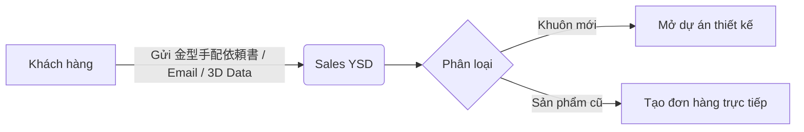

**Các bước chi tiết:**

| Bước | Input | Output | Chỉ thị phát sinh |
|------|-------|--------|-------------------|
| 1. KH gửi yêu cầu | 金型手配依頼書, PDF bản vẽ | Case/Thread trao đổi | Nếu cần file 3D → Sales yêu cầu KH gửi STEP file |
| 2. Sales phân loại | Thông tin KH, sản phẩm | Quyết định: Mới/Lặp lại | Nếu mới → chuyển Engineering. Nếu cũ → tạo Order |
| 3. Lập hồ sơ KH | Tên, mã P/N, liên hệ | Record trong `companies` | Kiểm tra KH đã tồn tại chưa |

**Vai trò:** Khách hàng, Sales (Phòng Kinh Doanh — Kobayashi, Arai, Sakurai)  
**Biểu mẫu:** 金型手配依頼書 (Yêu cầu làm khuôn), PDF bản vẽ  
**Dữ liệu nhập liệu (UI/UX):** Tên KH, Mã P/N khách hàng, Ngày mong muốn giao hàng (希望納期)  
**Ví dụ thực tế:** IRI-003 — KH (IRI) gửi PDF bản vẽ, Sales (Kobayashi) yêu cầu file 3D STEP, KH gửi qua ZIP

---

## 1.2 Tư vấn & thảo luận quy cách sản phẩm

**Tổng quan:** Trao đổi đi lại giữa Sales, Thiết kế và Khách hàng để chốt thông số kỹ thuật khay.

**Các bước:**
1. Phân tích yêu cầu đóng gói (số lượng/khay, độ an toàn)
2. Đề xuất vật liệu (PET, PS, PP, tính chống tĩnh điện)
3. Xác nhận khả năng gia công với bộ phận Kỹ thuật

**Chỉ thị phát sinh:** Request sang Engineering để xem xét khả năng gia công  
**Ngoại lệ:** Yêu cầu test mẫu nhiều lần, 14+ vòng email (case SMK-230)

---

## 1.3 Quy trình báo giá (見積)

**Tổng quan:** Lập báo giá khay và khuôn cho KH. **Nghiệp vụ có tần suất cao nhất:** 14,651 email + 28,803 files trên server.

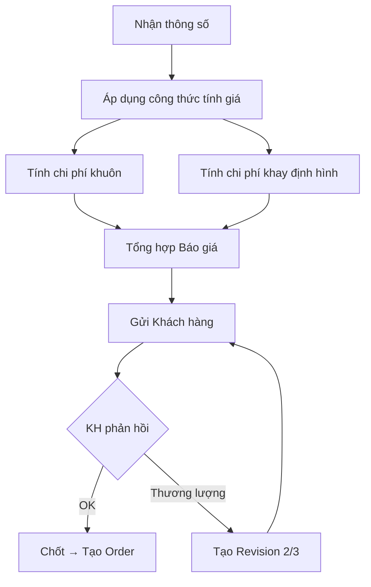

**Hai loại báo giá riêng biệt:**

| Loại | Nội dung | Người tính | Template |
|------|----------|-----------|---------|
| Báo giá khuôn | Chi phí gia công CNC, vật liệu nhôm, dao cắt | Engineering | 見積り計算式.xlsm (VBA macro) |
| Báo giá sản xuất khay | Giá/cái, giá/thùng, điều kiện thanh toán | Sales | 見積り原紙.xls |

**Dữ liệu nhập liệu:** Vật liệu, số lượng (Lot), kích thước, chi phí quản lý  
**Biểu mẫu:** 御見積書 (PDF gửi KH)

---

## 1.4 Thương lượng giá & phiên bản báo giá

**Tổng quan:** KH yêu cầu giảm giá → tạo báo giá revision 2, 3.  
**Xử lý đặc biệt:** Báo giá song song 3 mốc số lượng (20/50/100 tấm). Đàm phán miễn phí pocket test để giữ KH (case CHG).

---

## 1.5 Xác nhận đơn hàng (受注確認)

KH chốt báo giá → phát hành PO (注文書) → Sales đối chiếu với báo giá đã chốt.

---

## 1.6 Tạo đơn hàng trong hệ thống

**Dữ liệu nhập liệu (UI/UX):**
- P/N sản phẩm, Số lượng, Ngày giao, Loại vật liệu
- Địa điểm giao hàng (Delivery Site — 1 KH có nhiều địa điểm)
- Loại đơn: Sản xuất / Thiết kế / Nội bộ

---

## 1.7 Cập nhật giá hàng năm (価格改定)

**Tổng quan:** Điều chỉnh giá theo biến động giá nhựa nguyên liệu. 366 thư mục KH, 2,683 files trên server.  
**Luồng:** Lập bảng so sánh giá cũ/mới → Gửi thông báo (価格改定のお願い) → KH xác nhận hoặc đàm phán lại.

---

## 1.8 Đơn hàng nội bộ (社内受注)

Đơn hàng nội bộ (mẫu Free/Office) — tách dòng order_line trên cùng đơn.  
**Ví dụ:** CHG_order có 2 tấm cho văn phòng — 事務所用.

---

# CHƯƠNG 2: ENGINEERING & DESIGN (設計・開発)

## 2.1 Nhận yêu cầu thiết kế từ Sales

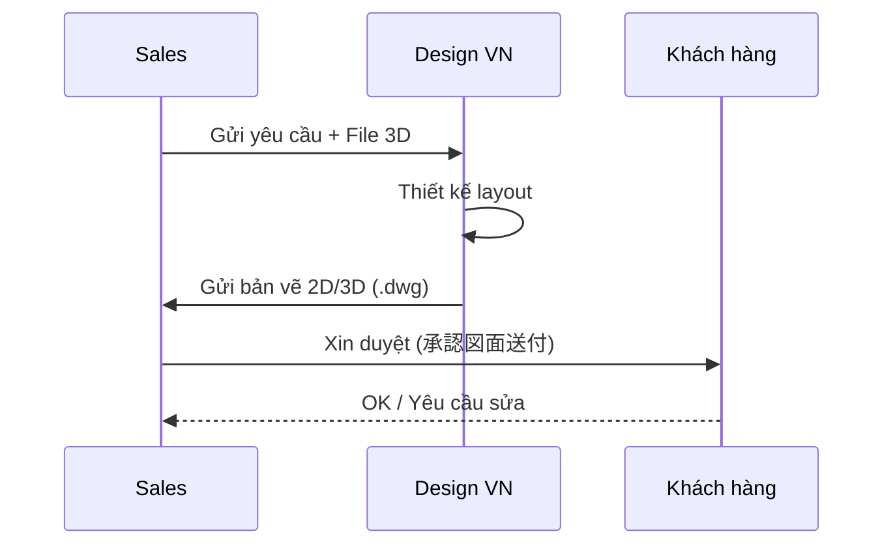

---

## 2.2 Thiết kế layout khay (CAD)

 Quy tắc đặt tên KHUÔN (system_code)

Tên khuôn KHÔNG có ký hiệu người thiết kế. Cấu trúc:

```
{Customer}-{Core}{Qualifier}-{CAV}-{Revision}-{Copy}
```

| Thành phần | Mô tả | Ví dụ |
|-----------|-------|-------|
| **Customer (B1)** | 2-5 ký tự viết hoa (mã khách hàng) | `JAE`, `TE`, `SMK`, `YSD` |
| **Core (B2a)** | 3 chữ số hoặc namespace code | `001`, `8-127-6` |
| **Qualifier (B2b)** | Hậu tố đặc biệt | `TB` (Top/Bottom), `AB` (2 parts), `M` (Small), `X` (Zomen), `PP`/`PS` (vật liệu) |
| **CAV (B3)** | Mã kích thước ngoài khuôn | `ZF`, `ZD`, `74C` |
| **Revision (B4)** | Phiên bản sửa đổi | `R1`, `R2` (R0 không đóng dấu vật lý) |
| **Copy (B6)** | Bản sao vật lý | `N1`, `N2` (bỏ qua nếu chỉ có 1 bản) |

**Ví dụ đầy đủ:** `JAE-001TB-ZD-R1-N2` = Khuôn JAE, mã 001 loại Top/Bottom, CAV ZD, sửa đổi lần 1, bản sao thứ 2


### 2.2.1 Quy tắc đặt tên Bản vẽ
 Quy tắc đặt tên BẢN VẼ (khác với tên khuôn!)

Bản vẽ CÓ ký hiệu người thiết kế:
```
{Tên_khuôn}P({Người_thiết_kế}){Revision}
```
**Ví dụ:** `JAE-036P(Q)R1` — Bản vẽ khuôn JAE-036, người thiết kế **Q**uan, revision 1


**Quy tắc đặt tên:** `Tên_khuônP(Q)R1` (Q = tên người thiết kế — Quan)  
**Output:** Bản vẽ `.dwg` lưu trên `\\SERVER\ysd-cad\AUTOCAD\[KH]\` (30,066 files)

---

## 2.3 Xác định thông số kỹ thuật

**46 thông số trong `design_revisions`:**
- Cutline (đường cắt): `cutline_length`, `cutline_width`
- Cavity: `cavity_count`, `cavity_layout`
- Draft angle, Undercut specifications
- Vật liệu: `plastic_type_designed` (VD: "PET 透明 1mm [640] 帯電防止付")
- Stacking type, corner R, chamfer C

---

## 2.4 Quy trình duyệt thiết kế (Design Approval Workflow)

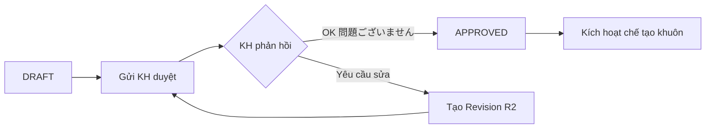

**Ví dụ:** IRI-003 — KH (Kamada) phản hồi "問題ございません" qua email.

---

## 2.5 Quản lý phiên bản thiết kế

### 2.5.1 Quy tắc đặt tên KHUÔN (system_code)
 Quy tắc đặt tên KHUÔN (system_code)

Tên khuôn KHÔNG có ký hiệu người thiết kế. Cấu trúc:

```
{Customer}-{Core}{Qualifier}-{CAV}-{Revision}-{Copy}
```

| Thành phần | Mô tả | Ví dụ |
|-----------|-------|-------|
| **Customer (B1)** | 2-5 ký tự viết hoa (mã khách hàng) | `JAE`, `TE`, `SMK`, `YSD` |
| **Core (B2a)** | 3 chữ số hoặc namespace code | `001`, `8-127-6` |
| **Qualifier (B2b)** | Hậu tố đặc biệt | `TB` (Top/Bottom), `AB` (2 parts), `M` (Small), `X` (Zomen), `PP`/`PS` (vật liệu) |
| **CAV (B3)** | Mã kích thước ngoài khuôn | `ZF`, `ZD`, `74C` |
| **Revision (B4)** | Phiên bản sửa đổi | `R1`, `R2` (R0 không đóng dấu vật lý) |
| **Copy (B6)** | Bản sao vật lý | `N1`, `N2` (bỏ qua nếu chỉ có 1 bản) |

**Ví dụ đầy đủ:** `JAE-001TB-ZD-R1-N2` = Khuôn JAE, mã 001 loại Top/Bottom, CAV ZD, sửa đổi lần 1, bản sao thứ 2


**Quy tắc Revision:** Không có R0. Bản gốc = `JAE-001`. Sửa lần 1 = `JAE-001-R1`.  
Sửa đổi hình dáng → phiên bản mới. Mỗi revision ghi `change_summary`.

---

## 2.6 Thiết kế sản phẩm thử nghiệm (Prototype / 試作)

### 2.6.1 Quy tắc đặt tên PROTOTYPE
 Quy tắc đặt tên PROTOTYPE

Prototype được đánh dấu bằng hậu tố **`D`** (Disposable/Test):
```
{Customer}-{Core}D    hoặc    {Customer}-{Core}-D
```
**Ví dụ:** `JAE-036D` = Khuôn prototype test pocket, KHÔNG phải khuôn sản xuất hàng loạt

> [!WARNING]
> **Cẩn thận:** Hậu tố `D` của prototype KHÁC với mã CAV Type `[D]` (354×300mm). Ngữ cảnh xác định ý nghĩa.


**1,835 email liên quan** — nghiệp vụ thường xuyên.  
**Ví dụ:** CHG-002, dùng PET xanh 0.7mm thay PET đen (lead time 1 tháng).

**Luồng cần bổ sung status:**
`DRAFT → PENDING_REVIEW → SAMPLE_SENT → SAMPLE_APPROVED → APPROVED (Mass Production)`

---

## 2.7 Chuyển từ prototype sang sản xuất hàng loạt

Sau KH duyệt mẫu → chuyển thiết kế sang `design_category = 'MASS_PRODUCTION'` → phát hành 生産指示書.

---

## 2.8 Sản phẩm Set/Combo (A+B tray dập chung)

1 khuôn dập đồng thời Khay A và Khay B. Mã sản phẩm: STT-002AB.  
Giao hàng xen kẽ A-B-A-B (+5 yen/tấm phí thao tác — case CHG).

---

## 2.9 Quản lý file CAD trên server

Lưu trữ tại `\\SERVER\ysd-cad\`:
- `AUTOCAD\` — 30,066 files bản vẽ
- `金型データー\` — 22,903 files dữ liệu khuôn CAM/NC
- `プラグDATA\` — 14,279 files plug

---

## 2.10 Nhật ký thiết kế & Tính lương theo sản phẩm

→ xem Phần II §4C

# CHƯƠNG 3: MOLD & EQUIPMENT MANAGEMENT (金型・設備管理)

> [!IMPORTANT]
> **Khuôn = tài sản của KH.** YSD ký giấy mượn khuôn (金型預かり証) từ KH để lưu giữ và sản xuất.

## 3.1 Quy trình chế tạo khuôn mới (WO → Job → Job Steps → Work Logs)

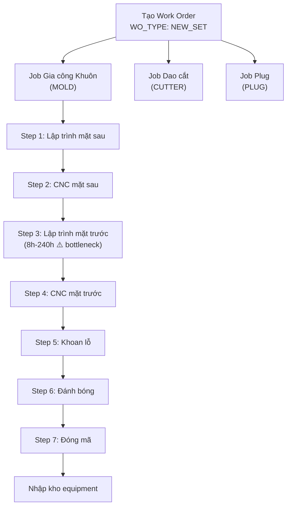

**Mỗi thiết bị 1 job riêng** (ADR-003). Work logs ghi nhật ký giờ công hàng ngày.

---

## 3.1b Job độc lập không từ Work Order (Standalone Jobs)

> Bổ sung vào **Chương 3 §3.1** — Section mới **§3.1b**

### F1. Các trường hợp phát sinh Job không từ WO khách hàng

| Trường hợp | Mô tả | Ví dụ |
|-----------|-------|-------|
| **Tạo mới thiết bị phụ trợ** | WB, PB, Frame mới khi máy mới hoặc thay đổi CAV | Tạo WB-74CZD mới cho máy 8 |
| **Sửa khuôn do YSD lỗi** | YSD làm hỏng khuôn KH → tự sửa, không tính phí | Khuôn bị mẻ khi gia công |
| **Sửa khuôn do KH yêu cầu (nhỏ)** | KH yêu cầu sửa nhỏ, không phát sinh WO 新規金型製造工程表 | Đánh bóng lại bề mặt |
| **Làm lại dao cắt** | Dao cắt mòn, cần thay thế | Đặt lại dao cho sản phẩm JAE-001 |
| **Tạo Stacking mới** | Khi sản phẩm mới cần Stacking riêng | ST cho sản phẩm có chiều cao khác |

### F2. Luồng xử lý trong hệ thống

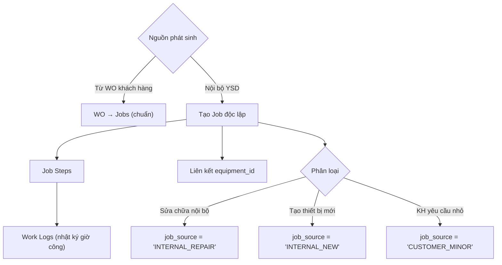

### F3. UI/UX Implications

- **Màn hình tạo Job** phải cho phép tạo job **không bắt buộc WO** (WO_ID nullable)
- **Dropdown nguồn phát sinh**: `INTERNAL_REPAIR` | `INTERNAL_NEW` | `CUSTOMER_MINOR` | `FROM_WO` (mặc định)
- **Quản đốc** có quyền tạo job độc lập; nhân viên thường chỉ tạo job từ WO

---


### Chi tiết bổ sung: Quy trình WO chế tạo khuôn mới

> Cập nhật **Chương 3 §3.1**

### G1. Checklist thiết bị trên Chỉ thị (新規金型製造工程表)

Khi tạo WO chế tạo khuôn mới, chỉ thị bao gồm **danh sách tất cả thiết bị** trong SET, nhưng phần lớn thiết bị phụ trợ **đã tồn tại** và được đánh dấu sẵn:

| Thiết bị | Thường tạo mới? | Lý do |
|----------|-----------------|-------|
| **Khuôn (MOLD)** | ✅ Luôn tạo mới | Mỗi sản phẩm có khuôn riêng |
| **Plug (PLUG)** | ✅ Luôn tạo mới | Khuôn + Plug là **tổ hợp không tách rời** |
| **Dao cắt (CUTTER)** | ⚠️ Thường tạo mới | Khả năng dùng chung kém, hay phải làm mới |
| **Đế làm mát (WB)** | ❌ Đã tồn tại | Số lượng hạn chế, dùng chung theo CAV |
| **Đế khí nén (PB)** | ❌ Đã tồn tại | Số lượng hạn chế, dùng chung theo CAV |
| **Khung (FRAME)** | ❌ Đã tồn tại | Dùng chung theo CAV |
| **Stacking (ST)** | ⚠️ Tùy trường hợp | Tạo mới nếu chiều cao khay khác biệt |

### G2. Luồng xử lý trên UI

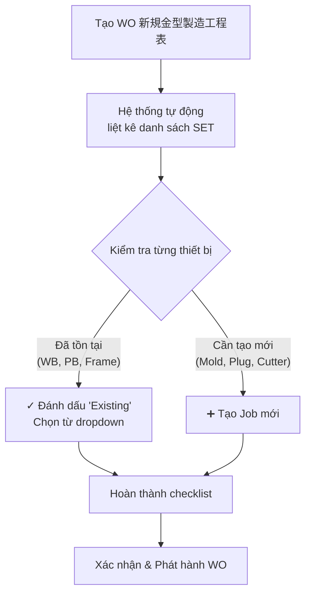

### G3. Ngoại lệ: WO sửa chữa do KH chỉ định

Khi KH yêu cầu sửa đổi khuôn (改造) hoặc sửa chữa (修理) → tạo WO mới type `MODIFICATION` / `REPAIR`, **có tính phí cho KH**. Khác với job nội bộ (F1) không tính phí.

---


## 3.2 Chế tạo dao cắt (Cutter)

Thường **outsource** (đặt gia công ngoài). YSD thiết kế bản vẽ → gửi đi → nhận về kiểm tra.  
**Phân loại:** In-line (CUTTER_INLINE, mặc định) vs Separate (CUTTER_SEPARATE, 別抜き=有).

---

## 3.3 Chế tạo thiết bị phụ trợ (Plug, Base, Frame)

- **Plug (khuôn gỗ):** Gia công tại YSD
- **Frame, Base:** Sản xuất theo kích thước CAV để dùng chung
- **Mã nhận dạng:** VD: `WB-74CZD` (Water Base cho CAV 74C-ZD)

---

## 3.4 Gá lắp SET (Assembly of tooling set)

Để chạy máy, cần lắp đủ SET: **Khuôn + Dao cắt + Plug + Khung trên/dưới + Đế làm mát + Đế áp suất + Stacking**

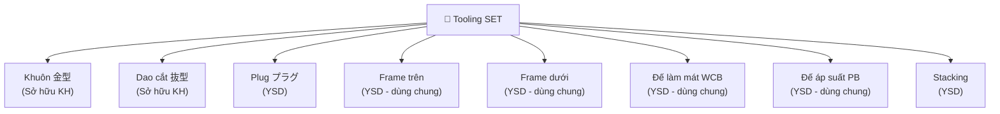

---

## 3.5 Quy trình mượn khuôn từ KH (金型預かり証)

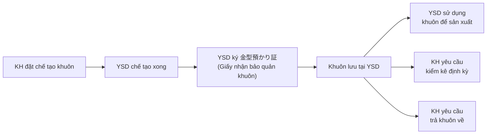

**Lưu ý:** Khi có thay đổi thiết kế (revision), phải phát hành lại giấy mượn.

---

## 3.6 Kiểm kê khuôn định kỳ (棚卸)

**238 email liên quan** — KH (Canon, Panasonic, NLC) định kỳ yêu cầu kiểm kê.

**Quy trình:**
1. KH gửi danh sách khuôn cần kiểm kê
2. YSD kiểm tra thực tế tại kho → chụp ảnh khuôn có gắn nhãn mác (金型写真看板)
3. Lập báo cáo kiểm kê kèm ảnh → gửi KH xác nhận
4. KH phản hồi: giữ / bỏ / trả về

**Dữ liệu UI/UX:** Chức năng chụp ảnh khuôn kèm nhãn trên tablet, gắn vào record equipment.

---

## 3.7 Phí bảo quản khuôn (金型保管料)

Khuôn non-active → tính phí lưu kho hàng năm cho KH.  
**Ví dụ:** `フジクラ 上野山様 金型保管料(20250612).xlsx`

---

## 3.8 Sửa chữa & cải tạo (修理・改造)

**4,141 email liên quan** — nghiệp vụ cực kỳ thường xuyên.  
Tạo WO type `REPAIR` hoặc `MODIFICATION`. Phiên bản khuôn thay đổi → dập thêm mã R1.

---

## 3.9 Mạ Teflon (7 bước)

Gửi khuôn đi phủ Teflon → module theo dõi chuyên biệt (teflonlog) → chi phí riêng.

---

## 3.10 Thanh lý khuôn (廃棄)

**Quy trình phê duyệt 4 cấp:**
```
担当 (Nhân viên) → 管理職 (Quản lý) → 事業部 (Khối KD) → 社長 (Giám đốc)
```

KH gửi danh sách khuôn non-active → YSD kiểm tra 貸出書 (Giấy mượn) → Phê duyệt → Thanh lý.

---

## 3.11 Quản lý vị trí lưu kho (Rack/Shelf)

30 kệ × 5 tầng. QR code gắn lên hông khuôn nhôm → scan bằng hệ thống.

---

## 3.12 Thiết bị dùng chung (SHARED) & bản sao (Copy number)

### A4. Quy tắc đặt tên THIẾT BỊ PHỤ TRỢ
 Quy tắc đặt tên THIẾT BỊ PHỤ TRỢ

| Loại thiết bị | Pattern | Ví dụ |
|--------------|---------|-------|
| Water Cooling Base (WB) | `WB-{CAV}` hoặc `WB-{LxW}` | `WB-74CZD`, `WB-530X350` |
| Pressure Base (PB) | `PB-{CAV}` hoặc `PB-{LxW}` | `PB-74CZD` |
| Frame (FR) | `FR-{CAV}-{UP/LO}` | `FR-74CZD-UP`, `FR-74CZD-LO` |
| Stacking Guide (ST) | `ST-{CAV}` | `ST-74CZD` |
| Cutter | Mã số duy nhất (không dùng prefix CT-) | `1042` |

---


> Bổ sung vào **Chương 3 §3.12**

> [!CAUTION]
> **CAV ≠ số khoang (pocket/cavity) trên khay!**
> 
> **CAV = tiêu chuẩn kích thước ngoài của khuôn (Actual Length × Actual Width)**

| CAV Type | Kích thước ngoài (mm) | Máy tương thích |
|----------|----------------------|-----------------|
| `A` | 470 × 300 | Rv53B |
| `ZD` | 470 × 347 | Rv53B |
| `ZF` | 495 × 347 | Rv53B |
| `74C` | 600 × 470 | Rv74C |
| `D` | 354 × 300 | Rv53B |

**Nguyên lý dùng chung thiết bị:** Đế làm mát (WB), đế khí nén (PB), khung (Frame) được dùng chung cho **mọi khuôn có cùng kích thước ngoài (CAV) và cùng kiểu trên/dưới**. VD: Tất cả khuôn CAV `ZD` đều dùng chung `WB-74CZD`, `PB-74CZD`, `FR-74CZD-UP/LO`.

**Số pocket (面数)** trên khay được ký hiệu riêng: `--2P`, `--3P` (2 pocket, 3 pocket). Đây KHÔNG liên quan đến CAV.

---


- **SHARED:** Base, Frame phân theo kích thước CAV → dùng chung nhiều sản phẩm
- **Copy number:** Khuôn bản sao: `-N1`, `-N2` (VD: JAE-001-N1)
- **Số khoang:** `--2P`, `--3P` (số pocket/cavity)

---

# CHƯƠNG 4: PRODUCTION (成形・製造)

## 4.1 Lập kế hoạch sản xuất (生産計画)

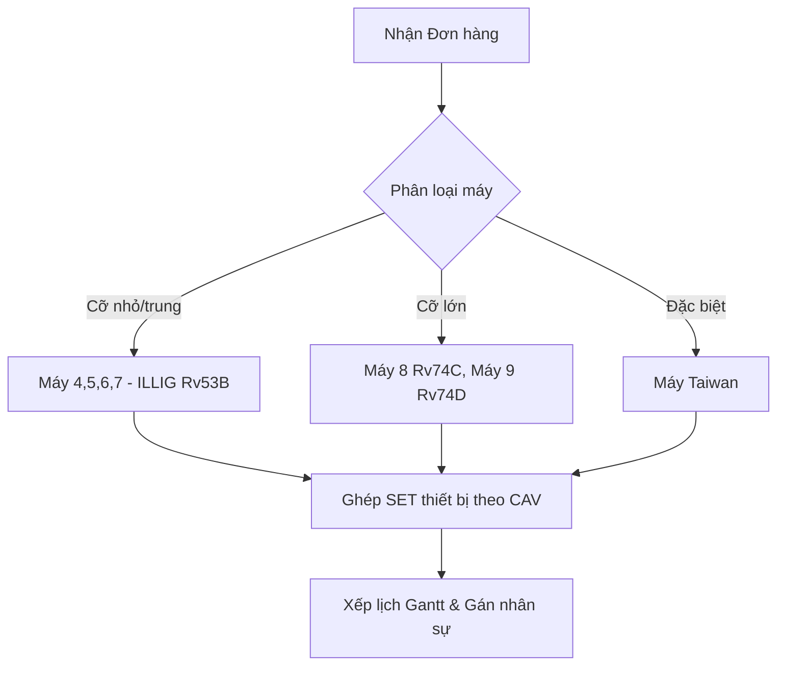

**Edge case:** Khuôn xong nhưng máy bận (Bottleneck) → cần re-schedule. Thiết bị dùng chung (WB-74CZD) cần kiểm tra conflict.

---

## 4.2 Tạo phiếu chỉ thị sản xuất (生産指示書)

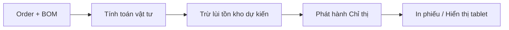

**Input:** P/N, Số lượng, Đóng gói (荷姿), Ngày giao (納期)  
**Output:** Phiếu chỉ thị in ra hoặc hiển thị tablet  
**Liên kết tự động:** Khi tạo phiếu → trừ tồn kho vật liệu dự kiến (指示書連動)

---

## 4.3 Thực hiện sản xuất (成形実行) - 3 Luồng sản xuất

> Thay thế **Chương 4 §4.3** hiện tại

### D1. Trường hợp 1: CUTTER_INLINE (Dao cắt liền)

Sản phẩm không cần dao cắt riêng — cắt trực tiếp trên máy định hình.

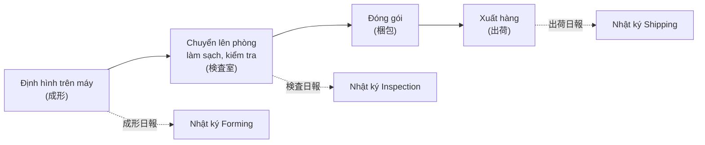

**Nhân viên & nhật ký:** Mỗi khâu có nhân viên riêng, ghi nhật ký riêng.

### D2. Trường hợp 2: CUTTER_SEPARATE (Dao cắt rời — 別抜き有)

Sản phẩm cần dao cắt riêng, dập trên máy Press bên ngoài.

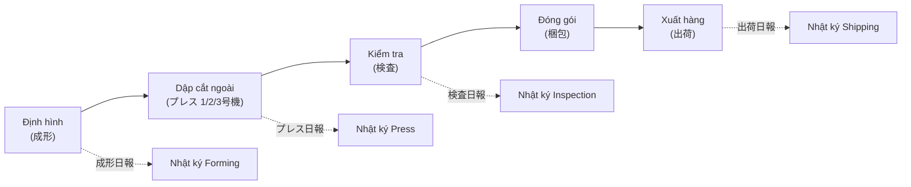

**Lưu ý:** Trường hợp này có **4 loại nhật ký** — nhiều hơn 1 bước so với Case 1.

### D3. Trường hợp 3: Không cần kiểm tra từng chiếc

Sản phẩm đơn giản, chỉ kiểm tra sơ bộ tại chỗ.

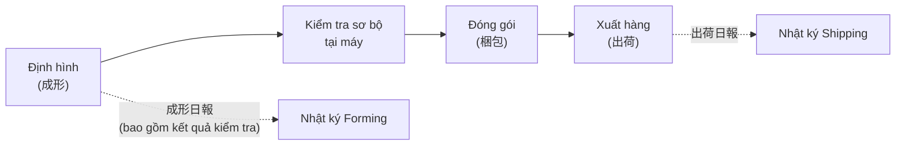

**Lưu ý:** Kết quả kiểm tra sơ bộ ghi luôn vào 成形日報 (không tạo nhật ký kiểm tra riêng).

---


## 4.4 Nhật ký sản xuất (日報 / Work Logs)

→ xem Phần II

**Dữ liệu ghi nhận hàng ngày:**
- Thời gian Start/End
- Mã cuộn nhựa sử dụng (quét QR)
- Sản lượng: OK / NG (5 loại NG category)
- Thao tác viên

---

## 4.5 Sản xuất đa site (Multi-site)

| Site | Ký hiệu | Đặc điểm |
|------|---------|-----------|
| 本社 Saitama | — | Nhà máy chính |
| 青森 Aomori | ☆ | Sở hữu Máy 9 ILLIG RV-74d |
| 茨城 Ibaraki | — | Nhà máy vệ tinh |
| 坂田精文堂 Sakata | ★ | Đối tác gia công ngoài |

---

## 4.6 Kanban status flow

`PENDING → IN_PROGRESS → PAUSED (thiếu nhựa/chỉnh máy) → COMPLETED`

---

# CHƯƠNG 5: MATERIAL & INVENTORY (材料・在庫)

> **Cập nhật:** 2026-08-21 — Bổ sung từ tra cứu 483+ file Excel + 71 NCC + 259 email + 6 site  
> **Người phụ trách chính:** 斎藤 (Saito) — nhập kho, xuất kho, chuẩn bị cuộn, xay nhựa  
> **Server path:** `\\SERVER\ysd-folder\社長データ\6）成形関連\成形工程表\材料在庫\` — **vẫn cập nhật hàng ngày** (file mới nhất: `材料在庫(26-8-21)` lúc 9:42)

## 5.1 Quản lý danh mục vật liệu nhựa (Plastic Master)

| Thuộc tính | Giá trị | Ví dụ |
|-----------|---------|-------|
| Loại nhựa | PS, PP, PVC, PET | PET 透明 1mm |
| Biến thể | Natural(N), Clear(CL), Brown(茶), White(W), Black(B) | PS Brown |
| Độ dày | 0.38 - 1.2mm | 0.50mm |
| Chiều rộng | 405 - 640mm | [640] |
| Đặc biệt | 帯電防止 (Chống tĩnh điện), 塗布 (Phủ), 導電印刷 (In dẫn điện) | 帯電防止付 |
| SI (シリコン) | シリコン無 (không silicone), シリコン付 | シリコン無 |

> [!WARNING]
> Vật liệu 導電印刷 (In dẫn điện) có lead time lên tới **1 tháng**.

---

## 5.2 Kiểm kê tồn kho hàng ngày (在庫管理)

> [!CAUTION]
> **GAP NGHIÊM TRỌNG:** Hiện tại kiểm kê bằng **483+ file Excel thủ công**, cập nhật hàng ngày, chia theo **6 site**. Đây là P0 cần số hóa ngay.

**File mẫu:** `材料在庫(24-10-1)指示書連動.xlsx` (~100+ dòng × 100+ cột/file)

**6 Site quản lý:**

| Site | Tên JP | Vai trò |
|------|--------|---------|
| 本社工場 | Headquarters (Saitama) | Sản xuất chính |
| 青森工場 | Aomori Factory | Sản xuất phụ |
| 茨城工場 | Ibaraki Factory | Sản xuất phụ |
| 坂田工場 | Sakata Factory | Sản xuất phụ |
| 相模原倉庫 | Sagamihara Warehouse | Kho trung chuyển |
| レグルス他 | Regulus etc. | NCC / Đối tác |

**Cấu trúc cột file tồn kho thực tế:**

| Cột | Nội dung | Mô tả |
|-----|---------|-------|
| A | Mã vật liệu | VD: `PS(N)0.38t×640×500m` |
| B | SI | Silicone status |
| C | 帯電 | Antistatic flag |
| D | NP | Thuộc tính |
| E | RP東プラ | Nhà cung cấp RP Topla |
| F | 相模原倉庫 | Tồn tại Sagamihara |
| G | レグルス他 | Tồn tại Regulus |
| H | 納入数量 | Số lượng nhập |
| I | 納期 | Ngày giao hàng |
| J~N | 本社/青森/茨城/坂田/合計 | Tồn kho per site |
| O | 残数 | Tồn kho còn lại |
| P | 社内残 | Tồn nội bộ |
| Q | 使用総数 | Tổng sử dụng |
| R+ | [Dates...] | Cột ghi theo ngày |

---

## 5.3 Nhập kho vật liệu (材料入庫)


**Giải pháp NextGen:** Quản lý theo Cuộn (Roll receipt) — mỗi cuộn có mã QR, quét nhập kho tự động.

---

## 5.4 Xuất kho & Chuẩn bị cho sản xuất (材料出庫)

**Luồng:** Khi có chỉ thị sản xuất → 斎藤 chuẩn bị cuộn nhựa đúng chủng loại → đưa lên máy thành hình.

**Liên kết chỉ thị (指示書連動):** File tồn kho tự động trừ lùi khi phiếu chỉ thị được tạo (macro Excel).

---

## 5.5 Phát đơn mua vật liệu (材料発注)

**SOP:** `NC材料発注マニュアル.xls` (tác giả: 東, 吉田)

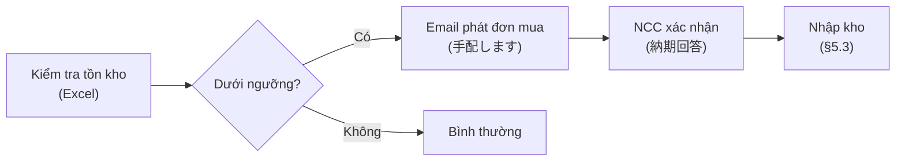

> **Thực tế từ mail:** Phát đơn mua qua email ad-hoc — *"すぐに材料発注の手配します"* (259 lần nhắc `材料在庫` trong 190K email)

---

## 5.6 Quản lý nhà cung cấp (供給者管理)

**File:** `購買製品区分別分類表兼供給者評価表2025.3.xls` (71 NCC)

**Đánh giá hàng năm (tháng 3) theo 4 tiêu chí:**

| Tiêu chí | Tên JP | Thang điểm |
|----------|--------|-----------|
| Chất lượng | 品質 (Q) | A (No Problem) / B (Problem) |
| Giao hàng | 納期 | A / B |
| Giá cả | 価格 (P) | A / B |
| Hợp tác | 協力度 | A / B |

**NCC chính:** (株)サワエ, (株)五明紙器製作所, 立山製紙(株), SPPC (Công ty cùng tập đoàn), (株)阪本商店, サトー(株), (株)アトム包装

---

## 5.7 Tiêu hao vật liệu & BOM (Material Consumption)

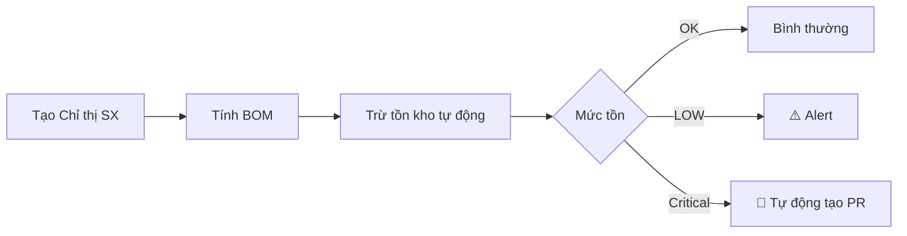

**Tracking tổn hao (ロス率):** `材料ロス` = 6 lần nhắc trong mail, gắn với `成形ロス表` trên server.

---

## 5.8 PPWR Compliance & Nhựa tái chế

- Lưu trữ % nhựa tái chế (粉砕材含有率) per sản phẩm/đơn hàng
- **Xác nhận:** YSD KHÔNG tái sử dụng nhựa xay nội bộ — PS trắng sau xay → bán
- SMK yêu cầu ghi rõ trên Bảng kiểm tra
- Chi tiết xay rác → xem Daily Log Spec §9

**Email frequency:**

| Keyword | Hits | Ý nghĩa |
|---------|------|---------|
| 材料在庫 | 259 | Kiểm kê hàng ngày |
| 材料費 | 70 | Đàm phán chi phí NCC |
| 仕入 | 37 | Mua hàng |
| 在庫切れ | 36 | Hết hàng — cần đặt gấp |
| 材料ロス | 6 | Tổn hao vật liệu |

---

# CHƯƠNG 6: LOGISTICS & DELIVERY (出荷・納品)

## 6.1 Chuẩn bị giao hàng

- Đóng gói theo quy cách KH (VD: 200 tấm × 2 hộp)
- **Nhãn (Labels):** Format riêng per KH — SMK yêu cầu mã khuôn trên nhãn

---

## 6.2 Lập phiếu giao hàng (納品書)

> [!IMPORTANT]
> Không thể dùng chung 1 form. Cần **Module Customer Config** lưu template in ấn per KH.

| KH | Format | Đặc điểm |
|----|--------|----------|
| SMK | Excel 3-4 sheet | Đổi format 04/2025 |
| KYD | 指定納品書 | Form giao hàng chỉ định |
| JAE/HAE | Form YSD + 検査表 | Kèm bảng kiểm đặc thù |
| Standard | Form YSD chuẩn | — |

---

## 6.3-6.4 Vận chuyển & Giao hàng một phần

- Hàng ngày: vận chuyển thường
- **>5 pallets/ngày:** Hệ thống cảnh báo chuyển sang Charter (xe nguyên chuyến)
- **Partial Delivery:** 1 đơn → giao nhiều đợt (VD: JAE đặt 5 đợt/ngày)

---

## 6.5-6.6 Xác nhận giao & Quản lý địa điểm

**Luồng:** `SHIPPED → DELIVERED` | Hàng lỗi → `RETURNED` → Claim  
**Delivery Sites:** Master list từ `納入先一覧表.xlsx` (1,069 dòng). 1 KH có nhiều điểm giao.

---

# CHƯƠNG 7: QUALITY CONTROL (品質・検査)

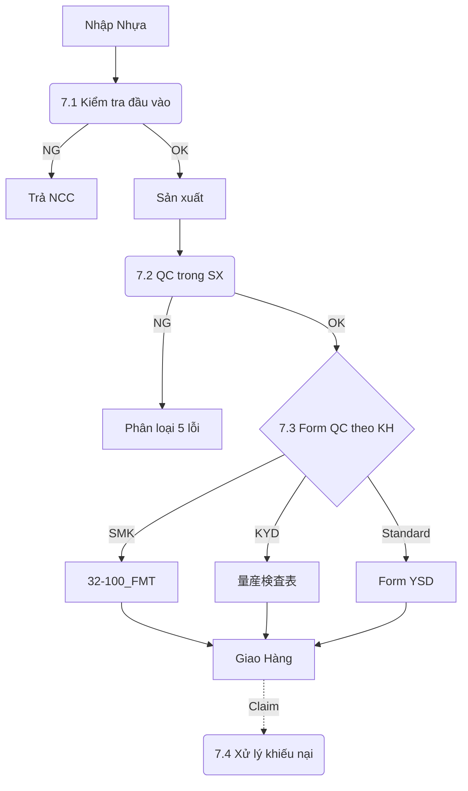

---

## 7.1 Kiểm tra đầu vào (入検)

Kiểm tra chứng nhận SDS/RoHS, đo chiều dày nhựa theo lô.

---

## 7.2 QC trong sản xuất (工程内検査)

- Đo kích thước (dung sai ±0.3, ±0.5, ±1.0mm)
- Kiểm tra ngoại quan
- Phân loại OK/NG (5 danh mục NG)

---

## 7.3 Biểu mẫu QC theo KH

**Cần Module Customer Config** — mỗi KH có format riêng.  
SMK yêu cầu 4 cấp ký duyệt + ghi % nhựa tái chế.

---

## 7.4 Xử lý khiếu nại (クレーム)

Tiếp nhận → Phân tích RCA → Báo cáo biện pháp khắc phục → Theo dõi Kaizen.

---

## 7.5 Đánh giá nhà cung cấp (供給者評価)

Đánh giá định kỳ hàng năm. File: `供給者一覧2025.3.xls`, `購買製品区分別分類表兼供給者評価表2025.3.xls`.

---

# CHƯƠNG 8: FINANCE & ACCOUNTING (経理・会計)

> **Cập nhật:** 2026-08-21 — Bổ sung từ tra cứu template ver6, 34K email 見積, 売上推移表  
> **Nguồn:** `見積原価計算書フォーマットver6.xls`, `売上推移表2006~2025`, `金型保管料` billing files

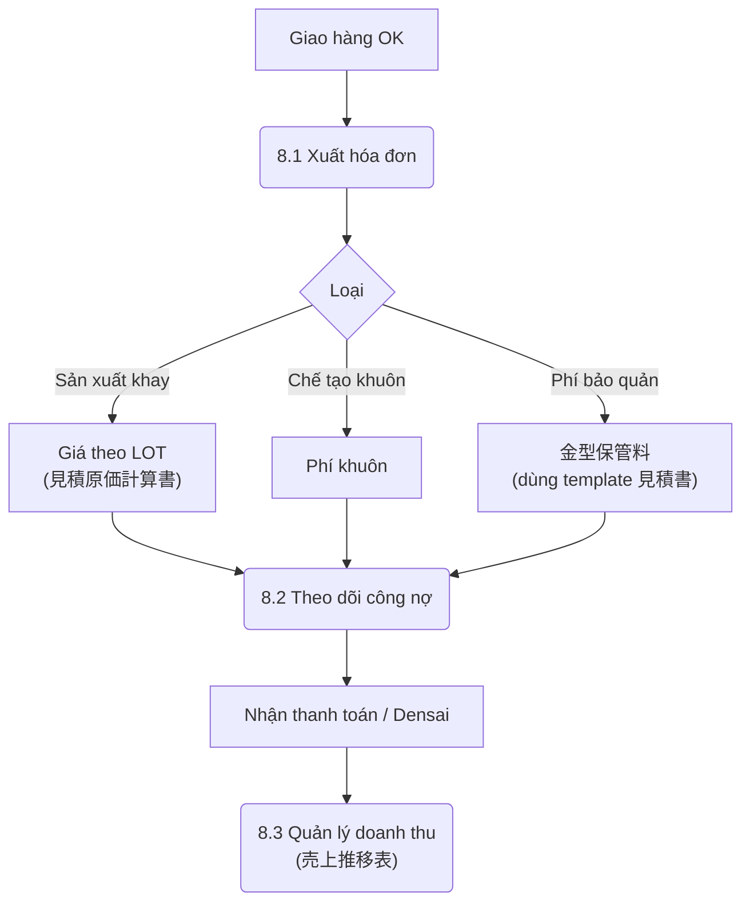

---

## 8.1 Báo giá (見積書)

> [!IMPORTANT]
> **34,692 email mentions 見積** — đây là nghiệp vụ trung tâm của YSD.

**Template chính:** `見積原価計算書フォーマットver6.xls`

**Đặc điểm báo giá YSD:**

| Đặc điểm | Mô tả |
|----------|-------|
| **Giá theo LOT** | Đơn giá thay đổi theo số lượng đặt (VD: 10 units → ¥1,691.9, 50 units → ¥373.9) |
| **Yếu tố tính giá** | Vật liệu (loại, dày, chống tĩnh điện), setup máy, nhân công, đóng gói |
| **Thuế** | Tính riêng, hiển thị 税抜 (chưa thuế) |
| **Nhân viên KD** | 小林 (Kobayashi), 桜井 (Sakurai) |

**Email frequency:**

| Keyword | Hits | Ý nghĩa |
|---------|------|---------|
| 見積 | 34,692 | Quy trình core hàng ngày |
| 単価 | 1,050 | Thảo luận đơn giá |
| 請求書 | 475 | Chu kỳ thanh toán |
| 値上げ | 117 | Điều chỉnh giá (nguyên liệu tăng) |
| 価格改定 | 18 | Sửa đổi giá chính thức |

---

## 8.2 Hóa đơn & Công nợ (請求・売掛)

- Phát hành hóa đơn (請求書) theo chu kỳ tháng
- Theo dõi công nợ (売掛金管理) — `未収金有` tracking
- Thanh toán: Chuyển khoản hoặc Densai (電子記録債権)
- **Web invoice:** `Web請求書案内回答状況.xlsx` — theo dõi phản hồi hóa đơn điện tử
- **Doanh thu thực tế:** `2026年7月売上実績.xlsx` — tracking hàng tháng

---

## 8.3 Quản lý doanh thu (売上管理)

**File:** `売上推移表` — quản lý dưới thư mục ISO 9001, theo dõi từ **2006 đến 2025** (20 năm liên tục).

---

## 8.4 Quản lý chi phí & giá thành (原価管理)

**14 thành phần tính giá:**
1. Chi phí vật liệu (BOM cost)
2. Chi phí nhân công (work_logs hours × Rate)
3. Chi phí máy (machine hours × Rate)
4. Chi phí gia công ngoài (outsource)
5. Quản lý, Đóng gói, Vận chuyển, Khấu hao...

**Liên kết HR → Cost:** `1枚原価` (chi phí/tấm) = phụ cấp NV ÷ sản lượng máy (từ `成形部門手当一覧.xls` — xem Daily Log §11B₂)

---

## 8.5 Phí bảo quản khuôn (金型保管料)

YSD giữ 4,700+ bộ khuôn (tài sản KH). Khuôn non-active → tính phí bảo quản.

**Phương thức billing đặc biệt:**
- Dùng **template 見積書 (Quotation)** để tính phí — KHÔNG có form hóa đơn riêng
- **Đơn vị:** 円/月 (Yen/tháng) per khuôn
- **Ví dụ:** FJK-001/002/003 × 6 tháng × ¥307.5/tháng = ¥1,845
- **213 email** mentions 保管料 — nghiệp vụ thường xuyên
- **Tracking:** `非稼働対象リスト` (danh sách khuôn không hoạt động)

---

## 8.6 Giá cải đổi & Thanh lý (価格改定・廃棄)

- **値上げ (tăng giá):** Phát sinh khi nguyên liệu tăng (117 email)
- **廃棄料 (phí thanh lý khuôn):** Bù trừ bằng giá trị sắt vụn

---

# CHƯƠNG 9: ADMINISTRATION, HR & ISO (管理・人事・ISO)

> **Cập nhật:** 2026-08-21 — Bổ sung từ tra cứu ISO folder + 文書管理リスト + 教育訓練 + 部門目標  
> **Chứng nhận:** ISO 9001 (品質) + ISO 14001 (環境) — hệ thống tích hợp

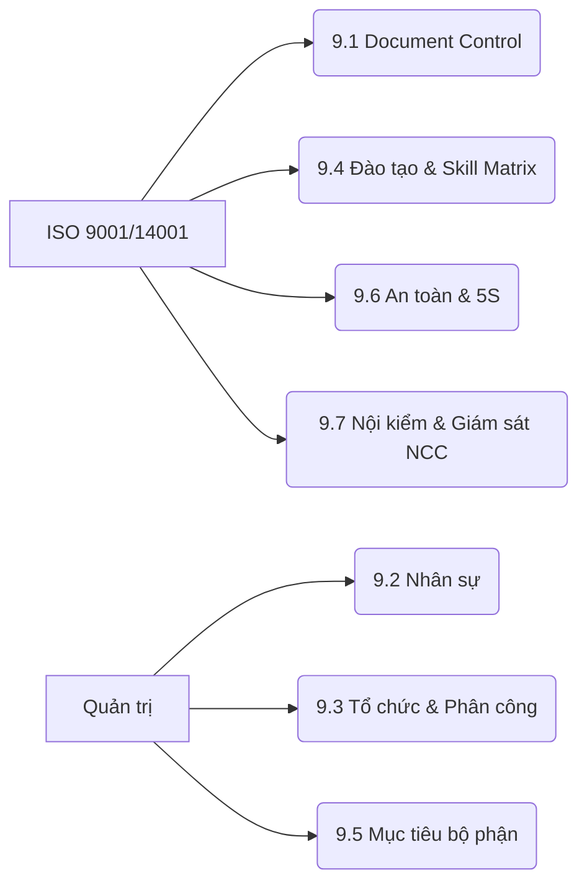

---

## 9.1 Quản lý tài liệu ISO (文書管理)

**Hệ thống tài liệu:**

| File | Nội dung | Cập nhật |
|------|---------|---------|
| `文書体系表2015版.xls` | Kiến trúc toàn bộ QMS/EMS | 2015~ |
| `文書・記録管理リスト2025.3.xls` | Danh mục tài liệu + bản ghi | Hàng năm (tháng 3) |
| `外部文書リスト2025.3.xls` | Tài liệu bên ngoài | Hàng năm |
| `品質環境方針（最新）.doc` | Chính sách chất lượng & môi trường | Tích hợp QMS+EMS |

**KPI:** Tỷ lệ giao hàng đúng hạn (納期遵守率), Tỷ lệ lỗi sản xuất.

**Truyền thông nội bộ:** `ISOだより` (bản tin ISO) — phát hành định kỳ (99+ số), ví dụ:
- `ISOだより-71回 組織図.xls` — thông báo sơ đồ tổ chức
- `ISOだより-85回 ベトナム工場＆YSD人員配置.xls` — bố trí nhân sự
- `ISOだより-99回 端材管理のお願い.xls` — quản lý phế liệu

---

## 9.2 Quản lý nhân sự (人事管理)

- **Hồ sơ NV:** `従業員名簿2026.1.xls` (~14 NV, bao gồm MyNumber)
- **Chấm công:** タイムカード — hiện trên server, chưa số hóa
- **Lịch làm việc:** 730 ngày (ngày nghỉ/làm) → tính capacity và deadline
- **Nhân viên tạm thời:** Có chính sách riêng `派遣社員向け方針.doc`
- **Lương & Phụ cấp:** Xem Daily Log Spec §11 (基本給, 職務手当, 生産手当, 残業代, 賞与)

---

## 9.3 Tổ chức & Phân công (組織体制)

**File:** `会社組織図 xx-xx-xx.xls` — cập nhật nhiều lần/năm (VD: 26-03-31, 26-04-17)

**Đặc điểm:**
- Sơ đồ tổ chức thay đổi thường xuyên (nhân sự luân chuyển)
- Bao gồm cả nhà máy Việt Nam (SPPC)
- `職務分掌表`, `責任分担表` — phân công trách nhiệm

---

## 9.4 Đào tạo & Ma trận kỹ năng (教育訓練・スキルマップ)

**File:** `教育訓練2026年度.xls` + `教育訓練プログラム フォーマット 日常管理(新R) 22.05.24.xlsx`

**Ma trận kỹ năng:** 20+ NV × 15+ kỹ năng — xem Daily Log Spec §11D

| Ký hiệu | Mức độ | Ý nghĩa |
|---------|--------|---------|
| △ | Đang đào tạo | Chưa thể tự thực hiện |
| ○ | Thành thạo | Có thể tự thực hiện |
| ◎ | Hướng dẫn viên | Có thể đào tạo người khác |

---

## 9.5 Mục tiêu bộ phận (部門目標)

**Theo dõi từ 2006 đến nay** — mỗi bộ phận có file mục tiêu riêng:

| Bộ phận | File mẫu |
|---------|---------|
| 成形 (Thành hình) | `成形2025年度 部門目標Ｎo.01.xls` |
| 総務 (Tổng vụ) | `総務2025年度 部門目標.xlsx` |
| 金型 (Khuôn) | `金型2025年度 部門目標.xls` |

---

## 9.6 An toàn & 5S

- **An toàn:** `全体作業規定`, PCCC (`消防訓練`)
- **5S:** Bảng biểu trực quan, khu vực NG品, sơ đồ nhà máy

---

## 9.7 Nội kiểm & Giám sát (内部監査)

| Hạng mục | File | Tần suất |
|---------|------|---------|
| Nội kiểm viên | `内部監査員認定者リスト2025.4.doc` | Cập nhật hàng năm |
| Audit nhà máy | `YSD工場監査フォーマット.xls` | Per yêu cầu |
| Đánh giá tuân thủ | `順守評価確認表` | Hàng năm (2007~2025) |
| NCC audit | `供給者一覧2026.3.xls` | Hàng năm (tháng 3) |

---

> [!NOTE]
> **Hướng dẫn cập nhật tài liệu:**  
> Mỗi chương là một module độc lập. Khi cần cập nhật:
> 1. Chỉ sửa section tương ứng trong chương cần cập nhật
> 2. Ghi timestamp và lý do thay đổi ở đầu section
> 3. Không thay đổi cấu trúc heading (##) để giữ liên kết mục lục
> 4. Thêm sub-section mới bằng cách thêm ### mới dưới ## parent
> 5. Tham chiếu chéo bằng cách ghi "→ xem Daily Log Spec §X" thay vì copy nội dung


# PHẦN II: ĐẶC TẢ NHẬT KÝ & BIỂU MẪU


## TỔNG QUAN HỆ THỐNG NHẬT KÝ YSD

```mermaid
graph TD
    A["📋 HỆ THỐNG NHẬT KÝ YSD"] --> B["成形日報<br/>Forming Daily Log"]
    A --> C["プレス日報<br/>Press Daily Log"]
    A --> D["検査日報<br/>Inspection Daily Log"]
    A --> E["設計&金型日報<br/>Design & Mold Log"]
    A --> F["運転日報<br/>Vehicle/Transport Log"]
    A --> G["不適合報告書<br/>Non-Conformity Report"]
    
    B -->|"Case 1: INLINE"| H["→ Inspection → Packing → Ship"]
    B -->|"Case 2: SEPARATE"| C
    C --> D
    D --> I["→ Packing → Ship"]
```

YSD có **6 loại nhật ký chính** + 1 báo cáo không phù hợp, mỗi loại có form riêng đã chuẩn hóa ISO.

---

## 1. NHẬT KÝ THÀNH HÌNH (成形日報)

**File template:** `F 日報兼不適合製品記録書（成形最新版）2-20-4.xls`  
**Phiên bản TE riêng:** `F TE用日報兼不適合製品記録書（成形）.xls`  
**Tên đầy đủ:** 日報兼不適合製品記録書（金型異常連絡書含む）  
**Người tạo/duyệt:** 小比類巻 (tạo) / 吉田 (duyệt — Giám đốc)

### 1A. Header — Thông tin chung

| # | Trường | Tên JP | Mô tả | Kiểu dữ liệu |
|---|--------|--------|-------|---------------|
| 1 | Máy | 機械ナンバー | Số hiệu máy thành hình (3号~9号) | Dropdown |
| 2 | Người thao tác | 作業者 | Tên công nhân đứng máy | Text/Dropdown |
| 3 | Ngày | 作業日 | 年/月/日 | Date |

### 1B. Thông tin sản phẩm & khuôn

| # | Trường | Tên JP | Mô tả | Kiểu |
|---|--------|--------|-------|------|
| 4 | Mã khuôn | 型番 | VD: 2-912020-4 | Text (link equipment) |
| 5 | Sản lượng / Số shot | 生産数量 / ショット数 | Số tấm sản xuất | Number |
| 6 | Kích thước khuôn | 金型サイズ | CAV code (VD: ZD, 74C) | Dropdown |
| 7 | Số khoang | 面数 | Số pocket trên 1 tấm (2P, 3P) | Number |
| 8 | Bước tiến | 送り寸法 | Khoảng cách tiến nhựa (mm) | Number |
| 9 | Số dao cắt | 抜刃番号 | Mã dao cắt đang sử dụng | Text (link equipment) |

### 1C. 7 Hạng mục kiểm tra trước sản xuất (Pre-production Checklist)

> [!IMPORTANT]
> Mỗi hạng mục phải có **dấu xác nhận (担当者印)** của người kiểm tra trước khi chạy máy.

| # | Hạng mục | Tên JP | Nội dung kiểm tra |
|---|----------|--------|-------------------|
| 10 | Vệ sinh máy | 機械汚れ | Kiểm tra cửa vào vật liệu, cửa ra sản phẩm |
| 11 | Hoạt động máy | 成形機動作確認 | Tiếng ồn bất thường, rò rỉ dầu |
| 12 | Khuôn | 金型セット確認 | Xước, hư hỏng Plug |
| 13 | Dao cắt | 抜型セット確認 | Hư hỏng, biến dạng |
| 14 | Stacking | スタッキング確認 | Hư hỏng, bẩn |
| — | *(Riêng TE)* | 材料状況確認 | Kiểm tra nguyên liệu (bẩn, hư hỏng) |
| — | *(Riêng TE)* | 条件入力 | Nhập điều kiện (nhiệt độ phòng, điều kiện mùa) |

### 1D. Thông tin vật liệu

| # | Trường | Tên JP | Mô tả | Kiểu |
|---|--------|--------|-------|------|
| 15 | Vật liệu sử dụng | 使用材料 | Loại nhựa, độ dày, thông số đặc biệt | Text |
| 16 | Nhà sản xuất | 材料メーカー | Tên NCC nhựa | Text |
| 17 | Mã lô | 材料ロット番号 | Lot tracking | Text |
| 18 | Số mét sử dụng | 使用m数 | Chiều dài cuộn nhựa đã dùng | Number (m) |

### 1E. Kiểm tra chất lượng tại máy

| # | Trường | Tên JP | Mô tả | Kiểu |
|---|--------|--------|-------|------|
| 19 | Kích thước bản vẽ | 長手×短手 図面寸法 | L × W theo spec | Number × Number |
| 20 | Kích thước thực đo | 長手×短手 実測値 | L × W đo thực tế | Number × Number |
| 21 | Kiểm tra 20 tấm đầu | 良品検出後20枚全数検査 | OK / NG (sau khi ra sản phẩm tốt đầu tiên) | Boolean |
| 22 | Chu kỳ thành hình | 成形サイクル | Giây/cycle | Number (s) |
| 23 | Tình trạng khung | フレーム状況確認 | OK / NG | Boolean |

### 1F. Phân loại lỗi (7 mã — 異常分類)

| Mã | Tên JP | Mô tả VN |
|----|--------|----------|
| **A** | 成形不良 | Lỗi thành hình (không đủ hình dạng, co ngót) |
| **B** | 抜きズレ不良 | Lỗi lệch cắt (dao cắt không đúng vị trí) |
| **C** | スタッキング不良 | Lỗi xếp chồng (khay không xếp đúng) |
| **D** | シート不良 | Lỗi tấm nhựa (vật liệu đầu vào kém) |
| **E** | 機械異常による不良 | Lỗi do máy bất thường |
| **F** | 金型、抜型異常 | Lỗi do khuôn/dao cắt bất thường |
| **G** | その他 | Lỗi khác |

### 1G. Xử lý sản phẩm lỗi (3 phương án — 処置)

| Mã | Tên JP | Mô tả VN | Ghi chú |
|----|--------|----------|---------|
| **1** | 廃棄 | Tiêu hủy | **Mặc định** — sản phẩm lỗi nguyên tắc phải tiêu hủy |
| **2** | 特別採用 | Chấp nhận đặc biệt | Cần phê duyệt từ KH hoặc quản lý |
| **3** | 製造中止 | Dừng sản xuất | Khi lỗi nghiêm trọng, dừng toàn bộ dây chuyền |

> [!WARNING]
> **Quy tắc:** Khi phát hiện lỗi → kiểm tra **30 tấm trước và sau** lỗi (前後30枚を全数検品)  
> **Quy tắc:** Khi vật liệu hao hụt ≥ 100 tấm → **bắt buộc ghi nhận** (材料100枚分のロス)

### 1H. Mục bổ sung

| # | Trường | Tên JP | Mô tả |
|---|--------|--------|-------|
| 24 | PP board check | 小箱作製用PP板保管確認 | Kiểm tra tấm PP cho hộp nhỏ: OK/NG |
| 25 | Ghi chú đặc biệt | 特記事項 | Free text |
| 26 | Số lượng lỗi | 不適合 数量 | Số tấm lỗi |
| 27 | Dấu hoàn thành | 終了印 | Ký xác nhận cuối ca |
| 28 | *(Riêng TE)* 出荷予定日 | Ngày giao hàng dự kiến | Date |

---

## 2. NHẬT KÝ DẬP CẮT (プレス日報)

**File template:** `F プレス＆検査部門日報記録書 - ベトナム語含む.xls`  
**Đặc điểm:** Song ngữ JP/VN

### 2A. Header

| # | Trường JP | Trường VN | Kiểu |
|---|----------|----------|------|
| 1 | 作業日 (年/月/日) | Ngày làm việc | Date |
| 2 | 作業者 | Người làm | Text/Dropdown |
| 3 | 労働時間 | Thời gian làm việc | Number (h) |

### 2B. Dữ liệu per sản phẩm (mỗi dòng = 1 khuôn)

| # | Trường JP | Trường VN | Mô tả | Kiểu |
|---|----------|----------|-------|------|
| 4 | 型番 | Mã hàng | Mã khuôn/sản phẩm | Text |
| 5 | 作業内容＆ショット数 | Nội dung & số shot | Chi tiết thao tác + số lần dập | Text + Number |
| 6 | 備考欄 | Ghi chú | Báo cáo chi tiết nếu có sự cố | Text |
| 7 | 作業時間 | Thời gian làm việc | Giờ cho hạng mục này | Number (h) |
| 8 | 付加価値（金額）| Giá trị gia tăng | Giá trị sản phẩm tạo ra (¥) | Number (¥) |

### 2C. Kiểm tra chất lượng tại Press

| # | Hạng mục | Tên JP | Mô tả |
|---|----------|--------|-------|
| 9 | Số lượng lỗi | 不適合 製品 | Đếm sản phẩm NG |
| 10 | Phân loại lỗi | 異常 分類 | Mã A~G (giống form thành hình) |
| 11 | Xử lý | 処置 | Mã 1/2/3 |
| 12 | Kích thước thực đo | 長手×短手（実測値） | L × W sau cắt |
| 13 | Kiểm tra hình dạng dao | カッター形状確認 | OK/NG |
| 14 | Kiểm tra 5 tấm đầu | 5枚チェック | Lấy 5 tấm đầu kiểm tra |
| 15 | Kiểm tra mỗi 100 tấm | 100枚毎にチェック | Sampling per 100 sheets |
| 16 | Kiểm tra bẩn | 汚れ | Vết bẩn trên sản phẩm |

---

## 3. NHẬT KÝ KIỂM TRA (検査日報)

**File template:** `F 検査作業日報兼日常点検.xls`  
**Phiên bản KSE:** `検査作業日報兼日常点検(KSE専用）「チェックリスト」－ベトナム語含む.xls`

### 3A. Header

| # | Trường | Tên JP | Kiểu |
|---|--------|--------|------|
| 1 | Ngày | 作業日 | Date |
| 2 | Người kiểm tra | 作業者 | Text |
| 3 | Ngày cập nhật form | 作成/改定年月日 | Date |

### 3B. Dữ liệu per sản phẩm

| # | Trường | Tên JP | Kiểu |
|---|--------|--------|------|
| 4 | Mã khuôn | 型番 | Text |
| 5 | Ngày thành hình | 成形日 | Date |
| 6 | Số lượng kiểm tra | 検査数量 | Number |

### 3C. 8 LOẠI LỖI CHI TIẾT (不具合 phân loại)

> [!IMPORTANT]
> Đây là hệ thống phân loại lỗi chuẩn ISO của YSD — cần implement **chính xác** trong DB.

| # | Mã | Tên JP | Tên VN | Mô tả |
|---|-----|--------|--------|-------|
| 1 | WC | 白化・割れ・潰れ | Bạc hóa / Nứt / Dập | Nhựa bị trắng hoặc gãy |
| 2 | BH | バリ・ヒゲ | Ba-via / Râu | Nhựa thừa ở mép cắt |
| 3 | SC | 傷 | Xước | Vết xước trên bề mặt |
| 4 | DT | 汚れ | Bẩn | Vết bẩn, dấu vân tay |
| 5 | BR | ブリッジ発生 | Bridge | Nhựa dính giữa 2 pocket |
| 6 | FM | 異物付着 | Dị vật | Vật lạ dính trên sản phẩm |
| 7 | SD | シート不良 | Lỗi tấm nhựa | Nguyên liệu đầu vào kém chất lượng |
| 8 | OT | 変形・その他 | Biến dạng / Khác | Sản phẩm méo hoặc lỗi khác |

---

## 4. NHẬT KÝ THIẾT KẾ & KHUÔN (設計＆金型日報)

**File template:** `F 設計&金型部門日報記録書.xls`  
**File ISO:** `F 金型部門日報兼不適合製品記録書.xls`  
**File tổng hợp lương:** `クアン設計集計.xlsx`

### 4A. Header

| # | Trường | Tên JP | Kiểu |
|---|--------|--------|------|
| 1 | Ngày | 作業日 | Date |
| 2 | Người thực hiện | 作業者 | Text |
| 3 | Tổng giờ làm | 労働時間 | Number (h) |

### 4B. Dữ liệu per hạng mục công việc

| # | Trường | Tên JP | Kiểu |
|---|--------|--------|------|
| 4 | Mã khuôn/sản phẩm | 型番 | Text (link equipment) |
| 5 | Nội dung công việc | 作業内容 | Text + Dropdown (13 loại — xem §4C) |
| 6 | Ghi chú (số shot...) | 備考欄 | Text |
| 7 | Thời gian | 作業時間 | Number (h) |
| 8 | **Giá trị gia tăng** | **付加価値（金額）** | **Number (¥)** — dùng tính lương |

### 4C. BẢNG ĐƠN GIÁ TÍNH LƯƠNG — 21 HẠNG MỤC (từ form thực tế)

> [!IMPORTANT]
> **Nguồn:** Form `Nippo_Final_ThoanRpt` (ảnh giám đốc cung cấp) — bảng đơn giá in trên form nhật ký.  
> Đây là bảng đơn giá **chính thức** để tính lương theo sản phẩm/công việc.


**Nhóm 1 — Thiết kế & CAM (設計・演算)**

| # | Hạng mục | Tên JP | Đơn giá | Đơn vị |
|---|----------|--------|---------|--------|
| 1 | Thiết kế bản vẽ | **設計** | **¥30,000** | 1機種 (per model) |
| 2 | Plug CAM & gia công | **プラグ演算＆加工** | **¥10,000** | 1機種 |
| 3 | Proto Plug CAM & gia công | **試作プラグ演算＆加工** | **¥5,000** | 1機種 |
| 4 | Khuôn CAM & gia công | **金型演算＆加工** | **¥30,000** | 1機種 |
| 5 | Proto Khuôn CAM & gia công | **試作金型演算＆加工** | **¥10,000** | 1機種 |

**Nhóm 2 — Gia công khuôn thủ công (金型仕上げ)**

| # | Hạng mục | Tên JP | Đơn giá | Đơn vị |
|---|----------|--------|---------|--------|
| 6 | Khoan lỗ khuôn chính | **本型穴あけ** | **¥3,000** | 1機種 |
| 7 | Đánh bóng khuôn chính | **本型ミガキ** | **¥3,000** | 1機種 |
| 8 | Khoan lỗ khuôn prototype | **試作穴あけ** | **¥1,500** | 1機種 |
| 9 | Đánh bóng khuôn prototype | **試作ミガキ** | **¥1,500** | 1機種 |
| 10 | Dán nỉ khuôn chính | **本型ネル貼り** | **¥5,000** | 1機種 |
| 11 | Dán nỉ khuôn prototype | **試作ネル貼り** | **¥2,000** | 1機種 |

**Nhóm 3 — Plug thủ công (手造りプラグ)**

| # | Hạng mục | Tên JP | Đơn giá | Đơn vị |
|---|----------|--------|---------|--------|
| 12 | Plug thủ công khuôn chính | **本型手造りプラグ** | **¥10,000** | 1機種 |
| 13 | Plug thủ công prototype | **試作手造りプラグ** | **¥5,000** | 1機種 |

**Nhóm 4 — Hỗ trợ liên phòng ban (応援・補助)**

| # | Hạng mục | Tên JP | Đơn giá | Đơn vị |
|---|----------|--------|---------|--------|
| 14 | Chuẩn bị vật liệu | **材料出し** | **¥4,000** | 1回 (per lần) |
| 15 | Xuất hàng | **出荷作業** | **¥4,000** | 1回 |
| 16 | Hỗ trợ xuất hàng | **出荷応援** | **¥2,000** | 1回 |
| 17 | Kiểm tra sản phẩm | **検査** | **¥3,000** | 1機種 |
| 18 | Hỗ trợ thành hình | **成形補助** | **¥2,000** | 時間 (per giờ) |
| 19 | Hỗ trợ Press | **プレス応援** | **¥10** | ショット (per shot) |

**Nhóm 5 — Vận chuyển (配送)**

| # | Hạng mục | Tên JP | Đơn giá | Đơn vị |
|---|----------|--------|---------|--------|
| 20 | Giao hàng | **配送** | **¥3,000~5,000** | 1回 (per chuyến) |

**Công thức tính lương:**
```
Lương tháng = Σ (Hạng mục hoàn thành × Đơn giá × Số lượng)

Ví dụ:
  設計 × 3 model = ¥30,000 × 3 = ¥90,000
  プラグ演算 × 3 = ¥10,000 × 3 = ¥30,000
  本型穴あけ × 3 = ¥3,000 × 3 = ¥9,000
  出荷応援 × 5 lần = ¥2,000 × 5 = ¥10,000
  成形補助 × 8h = ¥2,000 × 8 = ¥16,000
  ─────────────────────────────
  合計 = ¥155,000
```

---

## 5. NHẬT KÝ VẬN CHUYỂN (運転日報)

**File template:** `F 運転日報.xls`

### 5A. Header

| # | Trường | Tên JP | Kiểu |
|---|--------|--------|------|
| 1 | Ngày | 年/月/日 | Date |
| 2 | Thứ | 曜日 | DayOfWeek |
| 3 | Thời tiết | 天候 | Dropdown |
| 4 | Biển số xe | 車番 | Text (VD: 76-70) |
| 5 | Tên tài xế | 運転者名 | Text |

### 5B. Dữ liệu per chuyến (nhiều chuyến/ngày)

| # | Chiều đi (発) | Chiều đến (着) |
|---|-------------|---------------|
| 6 | 発地 (Điểm xuất phát) | 着地 (Điểm đến) |
| 7 | 時間 (Giờ xuất phát) | 時間 (Giờ đến) |
| 8 | 発メーター Km (Odometer xuất phát) | 着メーター Km (Odometer đến) |
| 9 | 実車：空車 (Có hàng / Không hàng) | — |
| 10 | 有料 IC (Trạm thu phí vào) | 有料 IC (Trạm thu phí ra) |

---

## 6. ĐIỀU KIỆN MÁY THÀNH HÌNH (成形条件一覧表)

**File template:** `3号機〜7号機成形条件一覧表.xls`  
**Sheets riêng per máy:** 3号機, 4号機, 5号機, 6号機, 7号機

### 6A. Thông tin sản phẩm & thiết bị

| # | Trường | Tên JP | Mô tả |
|---|--------|--------|-------|
| 1 | Mã P/N | P/N | Mã sản phẩm |
| 2 | Vật liệu | 材料 | Loại nhựa + thông số |
| 3 | Kích thước khuôn | 型寸 | Kích thước ngoài (CAV) |
| 4 | Vị trí khuôn | 型位置 | Vị trí lắp đặt trên máy |

### 6B. Thiết bị SET

| # | Trường | Tên JP | Mô tả |
|---|--------|--------|-------|
| 5 | Plug | プラグ | Mã plug sử dụng |
| 6 | Đế làm mát | 水冷盤 | Mã WB (VD: WB-74CZD) |
| 7 | Khung | 枠 | Mã Frame |
| 8 | Dao cắt | カッター | Mã Cutter |
| 9 | Stacking trên | スタッキング上 | Mã ST phía trên |
| 10 | Stacking dưới | スタッキング下 | Mã ST phía dưới |

### 6C. Thông số Heater (14 zones)

**7 zones Heater TRÊN (上ヒーター):**

| Zone | 01 | 02 | 03 | 04 | 05 | 06 | 07 |
|------|----|----|----|----|----|----|-----|
| Giá trị | °C | °C | °C | °C | °C | °C | °C |

**7 zones Heater DƯỚI (下ヒーター):**

| Zone | A | B | C | D | E | F | G |
|------|---|---|---|---|---|---|---|
| Giá trị | °C | °C | °C | °C | °C | °C | °C |

**Heater dao cắt:** `カッター部ヒーター` (°C)

### 6D. Thông số thời gian (Timing Parameters)

| # | Trường | Tên EN | Đơn vị |
|---|--------|--------|--------|
| 11 | Pre blowing | Thổi sơ bộ | — |
| 12 | Take off time | Thời gian lấy sản phẩm | s |
| 13 | Take off cycle | Chu kỳ lấy | — |
| 14 | Forming time | Thời gian thành hình | s |
| 15 | Demoulding time | Thời gian tháo khuôn | s |
| 16 | Mould table open delayed | Trễ mở bàn khuôn | s |
| 17 | Bottom table up delayed | Trễ nâng bàn dưới | s |
| 18 | Vacuum on | Bật chân không | 0~150mm |
| 19 | Vacuum cross section | Tiết diện chân không | 1~15 |
| 20 | Demoulding air section | Tiết diện khí tháo khuôn | 1~7 |
| 21 | Pre blowing off | Tắt thổi sơ bộ | 0~140mm |
| 22 | Material feeding | Bước tiến vật liệu | mm |
| 23 | Material speed | Tốc độ vật liệu | % |
| 24 | Speed top table up | Tốc độ nâng bàn trên | % |

---

## 7. CHỈ THỊ SẢN XUẤT (注文書兼指示書)

**File template:** `F 一般注文書兼指示書.xls`  
**Sheets:** `直送` (Giao thẳng), có thể có sheet khác per KH

### 7A. Header

| # | Trường | Tên JP | Kiểu |
|---|--------|--------|------|
| 1 | Số đơn | NO. | Text |
| 2 | Khách hàng | 様 (KH name) | Text |
| 3 | Ngày | DATE | Date |

### 7B. Dữ liệu per dòng sản phẩm (nhiều dòng/đơn)

| # | Trường | Tên JP | Mô tả | Kiểu |
|---|--------|--------|-------|------|
| 4 | Số yêu cầu | 要求No. | Mã tracking nội bộ | Text |
| 5 | P/N + Tên sản phẩm | P/N 品名 | Mã và tên sản phẩm | Text |
| 6 | Số lượng | 数量 | Số tấm/thùng cần sản xuất | Number |
| 7 | Ngày giao | 納期 | Hạn giao hàng | Date |
| 8 | Ghi chú | 備考 | Yêu cầu đặc biệt | Text |

### 7C. Thông tin vật liệu (per dòng sản phẩm)

| # | Trường | Tên JP | Ví dụ |
|---|--------|--------|-------|
| 9 | Chất liệu | 材質 | PS, PET, PP |
| 10 | Độ dày | 厚み | 0.50mm, 1.00mm |
| 11 | Chiều rộng | 巾 | 405mm, 640mm |
| 12 | Chống tĩnh điện | 帯電 | Có/Không |
| 13 | Silicon | シリコン | Có/Không |
| 14 | Phủ bề mặt | 塗布 | Có/Không |

---

## 8. BÁO CÁO KHÔNG PHÙ HỢP (不適合是正報告書)

**File template:** `F 不適合(製品)是正報告書(客先提出用）.xls`  
**Mục đích:** Gửi cho khách hàng khi có sự cố chất lượng

### 8A. Thông tin header

| # | Trường | Tên JP | Kiểu |
|---|--------|--------|------|
| 1 | Khách hàng | 殿 (KH name) | Text |
| 2 | Nhà sản xuất | 製造メーカー | Text (= YSD) |
| 3 | Mã khuôn | 型番 | Text |
| 4 | Tên sản phẩm | 品名 | Text |
| 5 | Bộ phận phát hành | 発行部門 | Dropdown |
| 6 | Số phát hành | 発行No. | Auto-increment |
| 7 | Ngày phát hành | 年/月/日 発行 | Date |
| 8 | Lot No. / Số lượng | Lot No. / 数量 | Text + Number |

### 8B. Nội dung báo cáo

| # | Trường | Tên JP | Mô tả |
|---|--------|--------|-------|
| 9 | Nội dung lỗi | 不良内容 | Mô tả chi tiết lỗi (text + ảnh) |
| 10 | Người phát hành | 発行者 | Ký tên |
| 11 | Dấu xác nhận | 確認印 | Quản lý ký duyệt |

### 8C. Phần xử lý (bộ phận chịu trách nhiệm điền)

| # | Trường | Tên JP | Mô tả |
|---|--------|--------|-------|
| 12 | Nguyên nhân | 発生流出原因 | Root Cause Analysis |
| 13 | Hạn trả lời | 年/月/日 迄に | Deadline phản hồi |
| 14 | *(Ghi chú)* | — | Nếu không kịp deadline → phải thông báo bằng văn bản |

---

## 9. XAY RÁC NHỰA & QUẢN LÝ PHẾ THẢI (粉砕・廃棄物管理)

> **Nguồn:** Phản hồi giám đốc + tra cứu mail (1,436 email 廃棄, 48 email 再生, 84 email 斎藤)  
> **Nhân viên phụ trách:** 斎藤 (Saito)  
> **ISO:** Có quy trình phân loại rác `廃棄物・リサイクル品・ゴミ分別手順書` và bảng đánh giá `環境側面特定表`

### 9A. Tổng quan quy trình xay rác nhựa (粉砕)

```mermaid
graph TD
    A["Sản xuất thành hình<br/>(成形)"] -->|"Nhựa thừa (端材)<br/>Sản phẩm lỗi (不良品)"| B{"Phân loại<br/>nhựa"}
    B -->|"PS trắng<br/>(PSホワイト)"| C["Xay bằng 粉砕機<br/>→ Hạt mịn"]
    B -->|"Nhựa khác<br/>(PET, PP, PS đen...)"| D["Thu gom bởi<br/>đơn vị bên ngoài<br/>(毎週 水曜日)"]
    C --> E["Đóng bao<br/>(袋詰め)"]
    E --> F["BÁN (売却)<br/>⚠️ Chi phí/lợi nhuận chưa xác nhận"]
    D --> I["Thanh lý bởi<br/>業者 (nhà thầu)<br/>⚠️ Chi phí chưa xác nhận"]
```

> [!NOTE]
> **Xác nhận từ giám đốc:** PS trắng sau xay → **chỉ bán**, không tái sử dụng nội bộ.  
> Các loại nhựa khác cũng **thanh lý** (không có thông tin tái sử dụng nội bộ).  
> Chi phí thu gom và lợi nhuận bán nhựa xay → **chưa xác nhận**, đang tìm tài liệu trên server.

### 9B. Quy tắc phân loại nhựa phế thải

| Loại nhựa | Xay được? | Xử lý |
|-----------|----------|-------|
| **PS trắng (PSホワイト)** | ✅ Có | Xay → đóng bao → **bán (売却)** |
| PS đen / PS màu | ❌ Không | Thu gom bên ngoài → thanh lý |
| PET | ❌ Không | Thu gom bên ngoài → thanh lý |
| PP | ❌ Không | Thu gom bên ngoài → thanh lý |
| Nhựa hỗn hợp | ❌ Không | Thu gom bên ngoài → thanh lý |

### 9C. Lưu ý về nhựa tái chế trên đơn hàng KH

> [!CAUTION]
> Mặc dù YSD KHÔNG tái sử dụng nội bộ nhựa xay, **một số KH vẫn ghi yêu cầu cấm nhựa tái chế trên đơn hàng**.  
> Hệ thống cần tracking flag này trên order/product để đảm bảo tuân thủ.

| Yêu cầu KH | Ý nghĩa | Ghi chú |
|------------|---------|---------|
| 再生材は不使用 | Không dùng nhựa tái chế | Đảm bảo 100% virgin |
| 粉砕材含有率 X% | Cho phép tối đa X% | Cần flag trên order |
| バージン/リサイクル/バージン | 3 lớp cấu trúc sandwich | Đặc biệt cho NCC nhựa |

### 9D. Nhật ký xay nhựa (sử dụng form chung với bộ phận khuôn)

| # | Trường | Tên JP đề xuất | Kiểu |
|---|--------|---------------|------|
| 1 | Ngày | 作業日 | Date |
| 2 | Người thực hiện | 作業者 | Text (VD: 斎藤) |
| 3 | Loại nhựa | 材料種類 | Dropdown (PS白) |
| 4 | Nguồn phế thải | 発生源 | Dropdown: 端材(rìa cắt) / 不良品(lỗi) / 試作(prototype) |
| 5 | Mã sản phẩm gốc | 元型番 | Text (link products — biết nhựa từ sản phẩm nào) |
| 6 | Khối lượng đầu vào | 投入量 | Number (kg) |
| 7 | Khối lượng đầu ra | 産出量 | Number (kg) — hạt mịn sau xay |
| 8 | Số bao | 袋数 | Number |
| 9 | Xử lý | 処理先 | Dropdown: 社内再利用(tái sử dụng) / 売却(bán) / 保管(lưu kho) |
| 10 | Ghi chú | 備考 | Text |

### 9E. Thu gom rác nhựa không xay được

| # | Trường | Tên JP đề xuất | Kiểu |
|---|--------|---------------|------|
| 1 | Ngày thu gom | 収集日 | Date (固定: 毎週水曜日 — thứ 4) |
| 2 | Đơn vị thu gom | 収集業者 | Text (tên nhà thầu) |
| 3 | Loại nhựa | 材料種類 | Multi-select (PET, PP, PS黒...) |
| 4 | Khối lượng | 重量 | Number (kg) |
| 5 | Chi phí / Thu nhập | 費用/収入 | Number (¥) — ⚠️ Cần xác nhận |
| 6 | Phiếu thu gom | マニフェスト番号 | Text (số phiếu quản lý chất thải theo luật) |

### 9F. Phế khuôn kim loại (金型廃棄)

> Quy trình riêng — 1,436 email liên quan

| Bước | Mô tả | Người thực hiện |
|------|-------|----------------|
| 1 | KH yêu cầu xử lý khuôn hết đời | 業務 (Operations) |
| 2 | YSD kiểm tra trạng thái khuôn, xác nhận 廃棄可否 | 金型 (Mold dept) |
| 3 | Chuyển khuôn cho NLC / SJI xử lý | 運転 (Transport) |
| 4 | Phát hành 金型廃棄料 cho KH | 業務 (Operations) |
| 5 | Thu hồi giá trị kim loại phế liệu (相殺) | 経理 (Accounting) |

---

## 10. QUẢN LÝ VẬT LIỆU & VAI TRÒ 斎藤 (Material Handling)

> **Nhân viên phụ trách:** 斎藤 (Saito) — thực hiện **đồng thời 5 nghiệp vụ**  
> **Bằng chứng:** 84 email mentions, hàng trăm file `材料在庫(YY-MM-DD)指示書連動.xlsx`

### 10A. 5 Nghiệp vụ do 斎藤 phụ trách

```mermaid
graph LR
    S["斎藤 (Saito)"] --> A["1. Nhập nhựa<br/>(材料入庫)"]
    S --> B["2. Xuất nhựa cho SX<br/>(材料出庫)"]
    S --> C["3. Xuất hàng sản phẩm<br/>(出荷)"]
    S --> D["4. Chuẩn bị cuộn nhựa<br/>(成形用 材料準備)"]
    S --> E["5. Xay rác nhựa<br/>(粉砕)"]
```

### 10B. Nhật ký vật liệu (hiện tại = Excel hàng ngày)

**File mẫu:** `材料在庫(24-10-1)指示書連動.xlsx`  
**Tần suất:** **Mỗi ngày 1 file** — hàng trăm file tồn tại trên server  
**Vấn đề:** Cực kỳ tốn công, dễ sai sót, không có single source of truth

| # | Trường | Mô tả | Kiểu |
|---|--------|-------|------|
| 1 | Ngày | Ngày kiểm kê | Date |
| 2 | Loại nhựa | VD: PET 0.5t 640mm 帯電防止 | Text |
| 3 | NCC | Nhà cung cấp nhựa | Text |
| 4 | Tồn kho đầu ngày | Số cuộn/kg | Number |
| 5 | Nhập trong ngày | Số cuộn/kg nhận từ NCC | Number |
| 6 | Xuất cho SX | Số cuộn/kg cấp cho thành hình | Number |
| 7 | Tồn kho cuối ngày | = Đầu ngày + Nhập − Xuất | Number (tự tính) |
| 8 | Liên kết chỉ thị | Mã đơn hàng/chỉ thị sử dụng | Text (link orders) |

### 10C. Yêu cầu cho hệ thống YSDMS-Next

1. **Module quản lý kho nhựa** — thay thế hàng trăm file Excel hàng ngày
2. **Tracking nhựa tái chế** — tỷ lệ 粉砕材含有率 per sản phẩm/đơn hàng
3. **Liên kết chỉ thị → vật liệu** — biết đơn nào dùng nhựa gì, bao nhiêu
4. **Dashboard vật liệu** — tồn kho realtime, cảnh báo hết hàng
5. **Nhật ký xay nhựa** — tracking khối lượng xay, đóng bao, xử lý
6. **Lịch thu gom** — nhắc nhở thứ 4 hàng tuần, tracking phiếu manifesto

---

## 11. NHÂN SỰ, LƯƠNG & MA TRẬN KỸ NĂNG (人事・給与・スキルマップ)

> **Nguồn:** `従業員名簿2026.1.xls`, `給与＆損益資料` trên server, `教育訓練2026年度.xls`  
> **Quy mô:** ~14 nhân viên chính thức (bao gồm nhân sự người Việt)

### 11A. Cấu trúc lương nhân viên — LƯƠNG THÁNG (給与構造)

> [!NOTE]
> **Xác nhận từ giám đốc:** Tất cả bộ phận đều nhận **lương theo tháng** (月給制).  
> Bảng đơn giá 21 hạng mục (§4C) **CHỈ áp dụng cho bộ phận Thiết kế** — các bộ phận khác chỉ dùng tham khảo.

**File thực tế:** `\\SERVER\ysd-folder\社長データ\2）個人ファイル\給与＆損益資料\給与・賞与\2019.01.給与.xlsx`  
**Lịch sử:** Có dữ liệu từ **2008 đến 2024**, tổ chức theo tháng

| # | Hạng mục | Tên JP | Mô tả | Kiểu |
|---|----------|--------|-------|------|
| 1 | Lương cơ bản | **基本給** | Mức lương cố định hàng tháng | Number (¥) |
| 2 | Phụ cấp chức vụ | **職務手当** | Phụ cấp theo vai trò/trách nhiệm | Number (¥) |
| 3 | **Phụ cấp sản xuất** | **生産手当** | Bộ phận thành hình — xem §11B₂ bên dưới | Number (¥) |
| 4 | Giờ làm thêm | **残業時間** | Số giờ OT trong tháng | Number (h) |
| 5 | Phụ cấp làm thêm | **残業代** | = Giờ OT × 残業単価 (per NV) | Number (¥) |
| 6 | Giờ OT đêm | **深夜残業時間** | Số giờ OT ca đêm (22:00~5:00) | Number (h) |
| 7 | Phụ cấp OT đêm | **深夜残業代** | = Giờ OT đêm × 深夜残業単価 (per NV) | Number (¥) |
| 8 | **Tổng lương tháng** | **総額** | = 基本給 + 各手当 + 残業代 + 深夜残業代 | Number (¥) |
| 9 | Thưởng | **賞与** | Bonus (thường 2 lần/năm: 夏・冬) | Number (¥) |
| 10 | **Tổng thu nhập năm** | **所得総額** | = Tổng 12 tháng lương + Thưởng | Number (¥) |

### 11B₁. Lương theo sản phẩm — CHỈ bộ phận Thiết kế (設計部門のみ)

> [!IMPORTANT]
> **CHỈ bộ phận Thiết kế & Khuôn** dùng hệ thống tính lương theo sản phẩm (21 hạng mục — xem §4C).  
> Các bộ phận khác (成形, プレス, 検査, 出荷) nhận **lương tháng cố định**.  
> Bảng đơn giá ở §4C vẫn được ghi trên form nhật ký các bộ phận khác, nhưng chỉ để **tham khảo giá trị gia tăng**, không dùng tính lương.

```
Bộ phận Thiết kế:
  Lương = 基本給 + 職務手当 + Σ(21 hạng mục × Đơn giá) + 残業代

Bộ phận khác (成形, プレス, 検査, 出荷, 粉砕...):
  Lương = 基本給 + 職務手当 + 生産手当 + 残業代
```

### 11B₂. Phụ cấp bộ phận Thành hình (成形部門手当)

> [!WARNING]
> **PHÁT HIỆN QUAN TRỌNG:** File `成形部門手当一覧.xls` cho thấy phụ cấp thành hình  
> được dùng trực tiếp để tính **chi phí đơn vị sản phẩm (1枚原価)** — liên kết HR ↔ Sản xuất ↔ Kế toán.

**File:** `\\SERVER\ysd-folder\社長データ\6）成形関連\成形ロス表\成形部門手当一覧.xls`  
**Sheet:** `時間外手当一覧` (Bảng phụ cấp ngoài giờ)

**Cấu trúc per nhân viên × per máy:**

| # | Trường | Tên JP | Mô tả |
|---|--------|--------|-------|
| 1 | Máy phân công | 機番 | 3号機, 4号機, 5号機, 6号機, 7号機 |
| 2 | Tên nhân viên | 作業者 | VD: 李, 谷口, 岩崎 |
| 3 | Tổng giờ làm | 労働時間 | Tổng giờ trong tháng |
| 4 | Giờ OT | 残業時間 | Số giờ làm thêm |
| 5 | Giờ OT đêm | 深夜残業時間 | Số giờ ca đêm |
| 6 | Đơn giá OT | 残業単価 | ¥/giờ OT — **per nhân viên** |
| 7 | Đơn giá OT đêm | 深夜残業単価 | ¥/giờ OT đêm — **per nhân viên** |
| 8 | Phụ cấp sản xuất | 生産手当 | Phụ cấp sản lượng theo máy |
| 9 | **Tổng phụ cấp** | **手当合計** | = 残業代 + 深夜残業代 + 生産手当 |
| 10 | Thù lao theo giờ | 時間当報酬 | = 手当合計 ÷ 労働時間 |
| 11 | **Chi phí đơn vị** | **1枚原価** | = Chi phí nhân công cho 1 tấm sản phẩm |

**Luồng tính toán:**

```mermaid
graph LR
    A["Phụ cấp NV<br/>(手当合計)"] --> B["÷ Sản lượng máy<br/>(生産数量)"]
    B --> C["= 1枚原価<br/>(Chi phí đơn vị)"]
    C --> D["→ Báo giá<br/>(見積もり)"]
    C --> E["→ Báo cáo lãi lỗ<br/>(損益計算)"]
```

> **Ý nghĩa:** Hệ thống YSDMS-Next cần liên kết module HR (phụ cấp) + module Sản xuất (sản lượng máy) + module Kế toán (chi phí đơn vị) để tự động tính `1枚原価` thay vì Excel thủ công.

### 11C. Danh sách nhân viên (従業員名簿)

**File:** `従業員名簿2026.1.xls` (~14 NV)

| # | Trường | Tên JP | Mô tả | Bảo mật |
|---|--------|--------|-------|---------|
| 1 | Họ tên | 氏名 | Tên đầy đủ | 🔒 PII |
| 2 | Địa chỉ | 住所 | Địa chỉ cư trú | 🔒 PII |
| 3 | Điện thoại | 電話 | Số điện thoại | 🔒 PII |
| 4 | Ngày sinh | 生年月日 | Format: H + năm | 🔒 PII |
| 5 | Ngày vào công ty | 入社月日 | Ngày bắt đầu làm việc | — |
| 6 | Mã văn phòng | 事業所記号 | VD: 6008 | — |
| 7 | Số thẻ bảo hiểm | 保険証番号 | Mã BHYT | 🔒 PII |
| 8 | MyNumber | マイナンバー | Số CCCD Nhật Bản (12 chữ số) | 🔒🔒 Tối mật |

> [!CAUTION]
> **MyNumber (マイナンバー)** là dữ liệu **cực kỳ nhạy cảm** theo luật Nhật Bản.  
> Hệ thống PHẢI mã hóa, hạn chế truy cập, và ghi log mọi lần xem.

### 11D. Ma trận kỹ năng (スキルマップ / 教育訓練計画書)

**File:** `教育訓練2026年度.xls`  
**Đánh giá 20+ NV × 15+ kỹ năng:**

| Ký hiệu | Mức độ | Ý nghĩa |
|---------|--------|---------|
| **△** | Đang đào tạo | Chưa thể tự thực hiện |
| **○** | Thành thạo | Có thể tự thực hiện |
| **◎** | Hướng dẫn viên | Có thể đào tạo người khác |

**Danh sách kỹ năng theo bộ phận:**

| Bộ phận | Kỹ năng | Tên JP |
|---------|---------|--------|
| **Tổng vụ (総務)** | Tiếp điện thoại | 電話応対 |
| | Tiếp khách | 接客 |
| | Nhận đơn hàng | 受注業務 |
| | Báo giá | 見積もり |
| **Khuôn (金型)** | Dán nỉ | ネル張り |
| | Gia công mặt trước | 表加工 |
| | Gia công mặt sau | 裏加工 |
| | Khoan lỗ | 穴あけ |
| | Đánh bóng | 磨き |
| **Thành hình (成形)** | Thành hình chân không | 真空成形 |
| | Thành hình chân không + khí nén | 真空圧空成形 |
| | Kiểm tra sản phẩm | 検査 |
| | Vận hành máy Press | プレス機 |
| | Xuất hàng | 出荷作業 |
| | **Xay rác nhựa** | **粉砕作業** |
| | Nhận vật liệu | 材料受け入れ |
| **Khác** | Thiết kế | 設計 |
| | CAD | CAD |
| | Giao hàng | 配送業務 |
| | Quản lý công đoạn | 工程管理 |

### 11E. Chi phí xử lý rác thải (産業廃棄物)

**File:** `産業廃棄物管理票交付等状況報告書21.06.22.xls`

| Hạng mục | Giá trị |
|----------|---------|
| Loại rác | 廃プラスチック類木くず (Nhựa + gỗ phế thải) |
| Khối lượng | **6 tấn / năm** |
| Đơn vị xử lý | **日本ダスト株式会社** (Nippon Dust Co., Ltd.) |
| Địa điểm xử lý | Kawasaki City |
| Báo cáo cho | Kanagawa, Yokohama, Kawasaki (cơ quan địa phương) |
| Đơn vị xử lý khác | **鶴見油化** (Tsurumi Yuka) — có chứng nhận xử lý |
| Tần suất báo cáo | **Hàng năm** (tháng 6 cho năm tài chính trước) |

### 11F. Yêu cầu cho hệ thống YSDMS-Next

1. **Module HR** — quản lý NV, bảo mật MyNumber, phân quyền truy cập PII
2. **Module lương** — 基本給 + 職務手当 + OT + lương theo sản phẩm (§4C)
3. **Skill Matrix online** — gán NV vào ca/máy dựa trên trình độ (△/○/◎)
4. **Training tracker** — theo dõi lộ trình đào tạo per NV per kỹ năng
5. **Báo cáo rác thải** — tự tính khối lượng từ nhật ký xay + thu gom → xuất báo cáo 産業廃棄物管理票

---


# PHẦN III: PHỤ LỤC

## BẢNG TỔNG HỢP — MAPPING FORM → DB TABLE

| Form | DB Table đề xuất | Số trường | Liên kết |
|------|------------------|-----------|---------|
| 成形日報 | `forming_daily_logs` | 28 | → `equipment`, `products`, `employees` |
| プレス日報 | `press_daily_logs` | 16 | → `equipment`, `products`, `employees` |
| 検査日報 | `inspection_daily_logs` | 14 | → `products`, `employees` |
| 設計&金型日報 | `design_mold_daily_logs` | 8 | → `products`, `employees`, `design_task_types` |
| 運転日報 | `transport_daily_logs` | 10 | → `employees`, `vehicles` |
| 成形条件 | `forming_conditions` | 24 | → `equipment`, `products`, `machines` |
| 注文書兼指示書 | `production_instructions` | 14 | → `orders`, `products`, `plastic_master` |
| 不適合報告書 | `nonconformity_reports` | 14 | → `companies`, `products`, `employees` |
| **粉砕日報** | **`grinding_daily_logs`** | **10** | → `products`, `employees`, `plastic_master` |
| **材料在庫** | **`material_inventory`** | **8** | → `orders`, `plastic_master`, `employees` |
| **従業員名簿** | **`employees`** (既存) | **8** | → `departments`, `skills` |
| **給与明細** | **`payroll`** | **9** | → `employees`, `design_task_logs` |
| **スキルマップ** | **`employee_skills`** | **3** | → `employees`, `skill_types` |

### Enum: Defect Types (共通)

```typescript
enum DefectType {
  FORMING_DEFECT = 'A',        // 成形不良
  CUTTING_MISALIGN = 'B',      // 抜きズレ不良
  STACKING_DEFECT = 'C',       // スタッキング不良
  SHEET_DEFECT = 'D',          // シート不良
  MACHINE_ABNORMAL = 'E',      // 機械異常による不良
  MOLD_CUTTER_ABNORMAL = 'F',  // 金型、抜型異常
  OTHER = 'G',                 // その他
}
```

### Enum: Inspection Defect Types (検査専用)

```typescript
enum InspectionDefectType {
  WHITENING_CRACK_CRUSH = 'WC',  // 白化・割れ・潰れ
  BURR_WHISKER = 'BH',           // バリ・ヒゲ
  SCRATCH = 'SC',                // 傷
  DIRT = 'DT',                   // 汚れ
  BRIDGE = 'BR',                 // ブリッジ発生
  FOREIGN_MATTER = 'FM',         // 異物付着
  SHEET_DEFECT = 'SD',           // シート不良
  DEFORM_OTHER = 'OT',           // 変形・その他
}
```

### Enum: Disposition Types (処置)

```typescript
enum DispositionType {
  DISCARD = '1',          // 廃棄 (mặc định)
  SPECIAL_ACCEPT = '2',  // 特別採用 (cần phê duyệt)
  STOP_PRODUCTION = '3', // 製造中止
}
```

### Enum: Waste Source (粉砕 発生源)

```typescript
enum WasteSource {
  EDGE_SCRAP = 'EDGE',       // 端材 — rìa cắt từ thành hình
  DEFECTIVE = 'DEFECTIVE',   // 不良品 — sản phẩm lỗi
  PROTOTYPE = 'PROTOTYPE',   // 試作 — prototype test
  OBSOLETE = 'OBSOLETE',     // 旧品 — sản phẩm cũ không dùng
}
```

### Enum: Plastic Recyclability (再利用可否)

```typescript
enum PlasticRecyclability {
  GRINDABLE_PS_WHITE = 'PS_WHITE',  // PS trắng — xay được
  NOT_GRINDABLE = 'OTHER',          // Nhựa khác — thu gom bên ngoài
}
```
