# 📖 HỒ SƠ NGHIỆP VỤ KINH DOANH SẢN XUẤT — YOSHIDA PACKAGE (YSD)
# YSDMS-Next V3 — Business Process Master Document

> **Phiên bản:** 3.0  
> **Ngày lập:** 2026-08-21  
> **Nguồn dữ liệu:** 190MB mail nghiệp vụ + 14 file tài liệu + \\\\SERVER (227,799 files)  
> **Mục đích:** Làm cơ sở xây dựng logic và UI/UX cho hệ thống YSDMS-Next  
> **Cập nhật:** Tài liệu có cấu trúc module — mỗi chương có thể cập nhật độc lập

---

## MỤC LỤC

| Chương | Tên | Phạm vi |
|--------|-----|---------|
| [1](#chương-1-sales--quotation-営業見積受注) | Sales & Quotation | 案件受付 → 見積 → 受注 → 価格改定 |
| [2](#chương-2-engineering--design-設計開発) | Engineering & Design | 設計 → 承認 → 試作 → CAD管理 |
| [3](#chương-3-mold--equipment-management-金型設備管理) | Mold & Equipment Mgmt | 金型製作 → 貸出 → 棚卸 → 保管料 → 廃棄 |
| [4](#chương-4-production-成形製造) | Production | 生産計画 → 指示書 → 成形 → 日報 |
| [5](#chương-5-material--inventory-材料在庫) | Material & Inventory | Plastic Master → 在庫 → 消費 → BOM |
| [6](#chương-6-logistics--delivery-出荷納品) | Logistics & Delivery | 出荷 → 納品書 → 配送 → Partial delivery |
| [7](#chương-7-quality-control-品質検査) | Quality Control | 入検 → 工程内検査 → クレーム → 供給者評価 |
| [8](#chương-8-finance--accounting-経理会計) | Finance & Accounting | 請求書 → 売掛 → 売上 → 原価 → 保管料 |
| [9](#chương-9-administration-hr--iso-管理人事iso) | Admin / HR / ISO | ISO → 人事 → 教育 → 目標 → 安全 → 5S |

> [!IMPORTANT]
> **Quy ước sở hữu tài sản:** Khuôn (金型) và Dao cắt (抜型) là tài sản **THUỘC SỞ HỮU CỦA KHÁCH HÀNG** — khách hàng trả tiền chế tạo. YSD **MƯỢN KHUÔN** từ khách hàng (ký 金型預かり証) để lưu giữ tại nhà máy YSD phục vụ sản xuất. Các thiết bị phụ trợ (Plug, Frame, Base, Stacking) là tài sản của YSD.

---

# CHƯƠNG 1: SALES & QUOTATION (営業・見積・受注)

## 1.1 Tiếp nhận yêu cầu từ khách hàng (案件受付)

**Tổng quan:** Tiếp nhận yêu cầu ban đầu (Inquiry) từ khách hàng về việc gia công khay mới hoặc đặt hàng định kỳ.

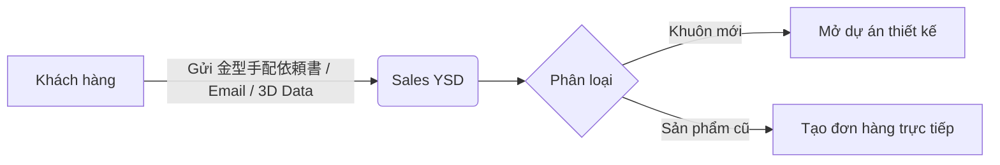

**Các bước chi tiết:**

| Bước | Input | Output | Chỉ thị phát sinh |
|------|-------|--------|-------------------|
| 1. KH gửi yêu cầu | 金型手配依頼書, PDF bản vẽ | Case/Thread trao đổi | Nếu cần file 3D → Sales yêu cầu KH gửi STEP file |
| 2. Sales phân loại | Thông tin KH, sản phẩm | Quyết định: Mới/Lặp lại | Nếu mới → chuyển Engineering. Nếu cũ → tạo Order |
| 3. Lập hồ sơ KH | Tên, mã P/N, liên hệ | Record trong `companies` | Kiểm tra KH đã tồn tại chưa |

**Vai trò:** Khách hàng, Sales (Phòng Kinh Doanh — Kobayashi, Arai, Sakurai)  
**Biểu mẫu:** 金型手配依頼書 (Yêu cầu làm khuôn), PDF bản vẽ  
**Dữ liệu nhập liệu (UI/UX):** Tên KH, Mã P/N khách hàng, Ngày mong muốn giao hàng (希望納期)  
**Ví dụ thực tế:** IRI-003 — KH (IRI) gửi PDF bản vẽ, Sales (Kobayashi) yêu cầu file 3D STEP, KH gửi qua ZIP

---

## 1.2 Tư vấn & thảo luận quy cách sản phẩm

**Tổng quan:** Trao đổi đi lại giữa Sales, Thiết kế và Khách hàng để chốt thông số kỹ thuật khay.

**Các bước:**
1. Phân tích yêu cầu đóng gói (số lượng/khay, độ an toàn)
2. Đề xuất vật liệu (PET, PS, PP, tính chống tĩnh điện)
3. Xác nhận khả năng gia công với bộ phận Kỹ thuật

**Chỉ thị phát sinh:** Request sang Engineering để xem xét khả năng gia công  
**Ngoại lệ:** Yêu cầu test mẫu nhiều lần, 14+ vòng email (case SMK-230)

---

## 1.3 Quy trình báo giá (見積)

**Tổng quan:** Lập báo giá khay và khuôn cho KH. **Nghiệp vụ có tần suất cao nhất:** 14,651 email + 28,803 files trên server.

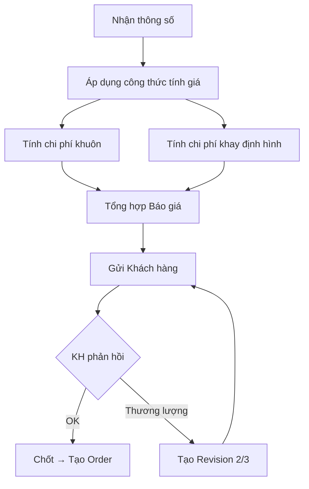

**Hai loại báo giá riêng biệt:**

| Loại | Nội dung | Người tính | Template |
|------|----------|-----------|---------|
| Báo giá khuôn | Chi phí gia công CNC, vật liệu nhôm, dao cắt | Engineering | 見積り計算式.xlsm (VBA macro) |
| Báo giá sản xuất khay | Giá/cái, giá/thùng, điều kiện thanh toán | Sales | 見積り原紙.xls |

**Dữ liệu nhập liệu:** Vật liệu, số lượng (Lot), kích thước, chi phí quản lý  
**Biểu mẫu:** 御見積書 (PDF gửi KH)

---

## 1.4 Thương lượng giá & phiên bản báo giá

**Tổng quan:** KH yêu cầu giảm giá → tạo báo giá revision 2, 3.  
**Xử lý đặc biệt:** Báo giá song song 3 mốc số lượng (20/50/100 tấm). Đàm phán miễn phí pocket test để giữ KH (case CHG).

---

## 1.5 Xác nhận đơn hàng (受注確認)

KH chốt báo giá → phát hành PO (注文書) → Sales đối chiếu với báo giá đã chốt.

---

## 1.6 Tạo đơn hàng trong hệ thống

**Dữ liệu nhập liệu (UI/UX):**
- P/N sản phẩm, Số lượng, Ngày giao, Loại vật liệu
- Địa điểm giao hàng (Delivery Site — 1 KH có nhiều địa điểm)
- Loại đơn: Sản xuất / Thiết kế / Nội bộ

---

## 1.7 Cập nhật giá hàng năm (価格改定)

**Tổng quan:** Điều chỉnh giá theo biến động giá nhựa nguyên liệu. 366 thư mục KH, 2,683 files trên server.  
**Luồng:** Lập bảng so sánh giá cũ/mới → Gửi thông báo (価格改定のお願い) → KH xác nhận hoặc đàm phán lại.

---

## 1.8 Đơn hàng nội bộ (社内受注)

Đơn hàng nội bộ (mẫu Free/Office) — tách dòng order_line trên cùng đơn.  
**Ví dụ:** CHG_order có 2 tấm cho văn phòng — 事務所用.

---

# CHƯƠNG 2: ENGINEERING & DESIGN (設計・開発)

## 2.1 Nhận yêu cầu thiết kế từ Sales

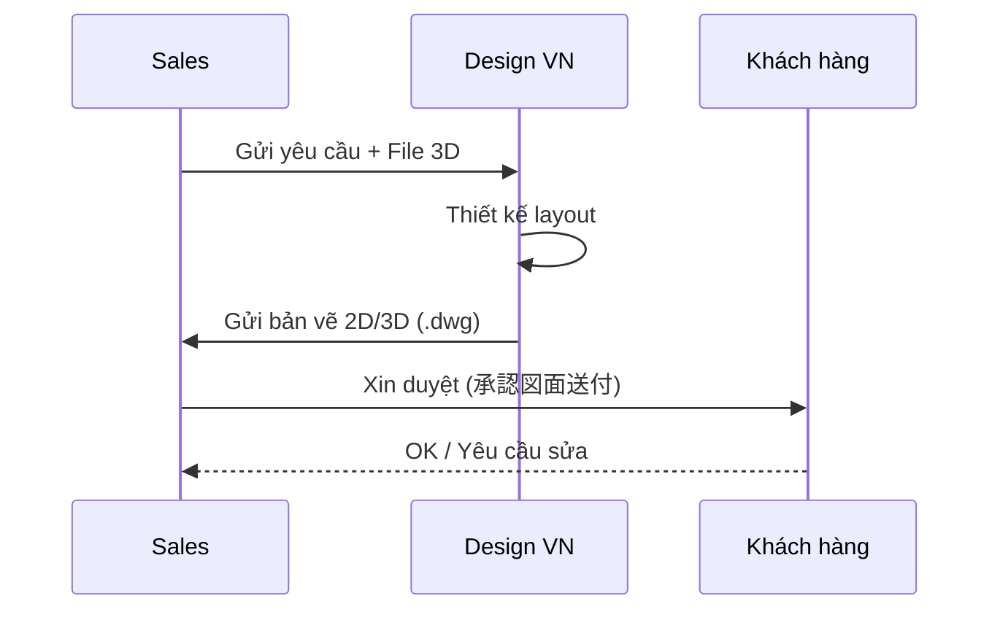

---

## 2.2 Thiết kế layout khay (CAD)

**Quy tắc đặt tên:** `Tên_khuônP(Q)R1` (Q = tên người thiết kế — Quan)  
**Output:** Bản vẽ `.dwg` lưu trên `\\SERVER\ysd-cad\AUTOCAD\[KH]\` (30,066 files)

---

## 2.3 Xác định thông số kỹ thuật

**46 thông số trong `design_revisions`:**
- Cutline (đường cắt): `cutline_length`, `cutline_width`
- Cavity: `cavity_count`, `cavity_layout`
- Draft angle, Undercut specifications
- Vật liệu: `plastic_type_designed` (VD: "PET 透明 1mm [640] 帯電防止付")
- Stacking type, corner R, chamfer C

---

## 2.4 Quy trình duyệt thiết kế (Design Approval Workflow)

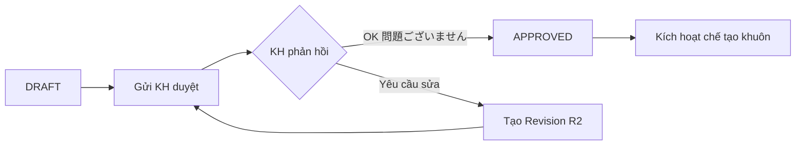

**Ví dụ:** IRI-003 — KH (Kamada) phản hồi "問題ございません" qua email.

---

## 2.5 Quản lý phiên bản thiết kế

**Quy tắc Revision:** Không có R0. Bản gốc = `JAE-001`. Sửa lần 1 = `JAE-001-R1`.  
Sửa đổi hình dáng → phiên bản mới. Mỗi revision ghi `change_summary`.

---

## 2.6 Thiết kế sản phẩm thử nghiệm (Prototype / 試作)

**1,835 email liên quan** — nghiệp vụ thường xuyên.  
**Ví dụ:** CHG-002, dùng PET xanh 0.7mm thay PET đen (lead time 1 tháng).

**Luồng cần bổ sung status:**
`DRAFT → PENDING_REVIEW → SAMPLE_SENT → SAMPLE_APPROVED → APPROVED (Mass Production)`

---

## 2.7 Chuyển từ prototype sang sản xuất hàng loạt

Sau KH duyệt mẫu → chuyển thiết kế sang `design_category = 'MASS_PRODUCTION'` → phát hành 生産指示書.

---

## 2.8 Sản phẩm Set/Combo (A+B tray dập chung)

1 khuôn dập đồng thời Khay A và Khay B. Mã sản phẩm: STT-002AB.  
Giao hàng xen kẽ A-B-A-B (+5 yen/tấm phí thao tác — case CHG).

---

## 2.9 Quản lý file CAD trên server

Lưu trữ tại `\\SERVER\ysd-cad\`:
- `AUTOCAD\` — 30,066 files bản vẽ
- `金型データー\` — 22,903 files dữ liệu khuôn CAM/NC
- `プラグDATA\` — 14,279 files plug

---

# CHƯƠNG 3: MOLD & EQUIPMENT MANAGEMENT (金型・設備管理)

> [!IMPORTANT]
> **Khuôn = tài sản của KH.** YSD ký giấy mượn khuôn (金型預かり証) từ KH để lưu giữ và sản xuất.

## 3.1 Quy trình chế tạo khuôn mới (WO → Job → Job Steps → Work Logs)

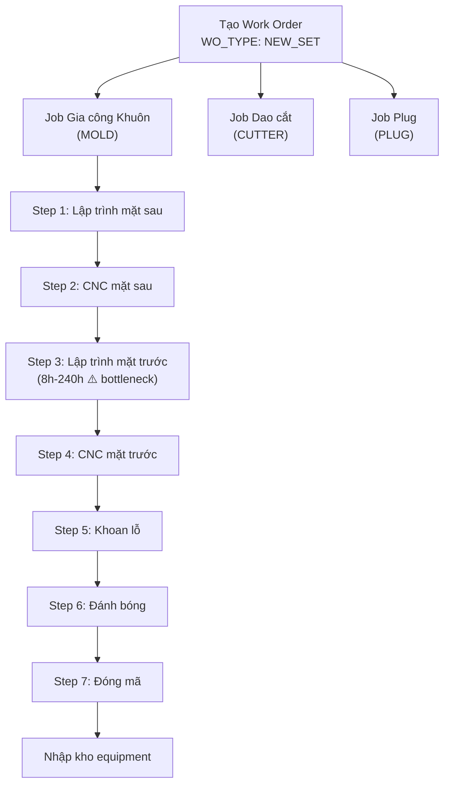

**Mỗi thiết bị 1 job riêng** (ADR-003). Work logs ghi nhật ký giờ công hàng ngày.

---

## 3.2 Chế tạo dao cắt (Cutter)

Thường **outsource** (đặt gia công ngoài). YSD thiết kế bản vẽ → gửi đi → nhận về kiểm tra.  
**Phân loại:** In-line (CUTTER_INLINE, mặc định) vs Separate (CUTTER_SEPARATE, 別抜き=有).

---

## 3.3 Chế tạo thiết bị phụ trợ (Plug, Base, Frame)

- **Plug (khuôn gỗ):** Gia công tại YSD
- **Frame, Base:** Sản xuất theo kích thước CAV để dùng chung
- **Mã nhận dạng:** VD: `WB-74CZD` (Water Base cho CAV 74C-ZD)

---

## 3.4 Gá lắp SET (Assembly of tooling set)

Để chạy máy, cần lắp đủ SET: **Khuôn + Dao cắt + Plug + Khung trên/dưới + Đế làm mát + Đế áp suất + Stacking**

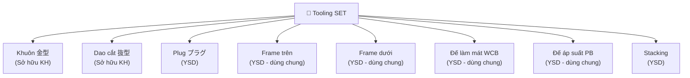

---

## 3.5 Quy trình mượn khuôn từ KH (金型預かり証)

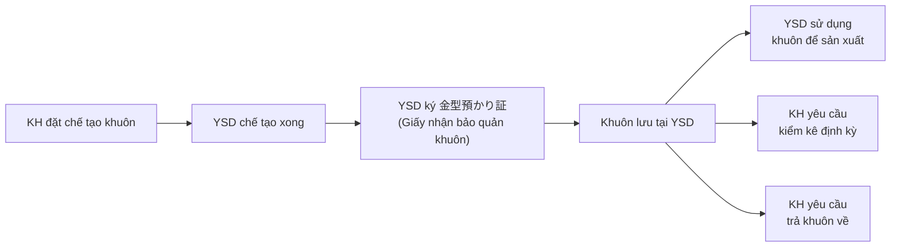

**Lưu ý:** Khi có thay đổi thiết kế (revision), phải phát hành lại giấy mượn.

---

## 3.6 Kiểm kê khuôn định kỳ (棚卸)

**238 email liên quan** — KH (Canon, Panasonic, NLC) định kỳ yêu cầu kiểm kê.

**Quy trình:**
1. KH gửi danh sách khuôn cần kiểm kê
2. YSD kiểm tra thực tế tại kho → chụp ảnh khuôn có gắn nhãn mác (金型写真看板)
3. Lập báo cáo kiểm kê kèm ảnh → gửi KH xác nhận
4. KH phản hồi: giữ / bỏ / trả về

**Dữ liệu UI/UX:** Chức năng chụp ảnh khuôn kèm nhãn trên tablet, gắn vào record equipment.

---

## 3.7 Phí bảo quản khuôn (金型保管料)

Khuôn non-active → tính phí lưu kho hàng năm cho KH.  
**Ví dụ:** `フジクラ 上野山様 金型保管料(20250612).xlsx`

---

## 3.8 Sửa chữa & cải tạo (修理・改造)

**4,141 email liên quan** — nghiệp vụ cực kỳ thường xuyên.  
Tạo WO type `REPAIR` hoặc `MODIFICATION`. Phiên bản khuôn thay đổi → dập thêm mã R1.

---

## 3.9 Mạ Teflon (7 bước)

Gửi khuôn đi phủ Teflon → module theo dõi chuyên biệt (teflonlog) → chi phí riêng.

---

## 3.10 Thanh lý khuôn (廃棄)

**Quy trình phê duyệt 4 cấp:**
```
担当 (Nhân viên) → 管理職 (Quản lý) → 事業部 (Khối KD) → 社長 (Giám đốc)
```

KH gửi danh sách khuôn non-active → YSD kiểm tra 貸出書 (Giấy mượn) → Phê duyệt → Thanh lý.

---

## 3.11 Quản lý vị trí lưu kho (Rack/Shelf)

30 kệ × 5 tầng. QR code gắn lên hông khuôn nhôm → scan bằng hệ thống.

---

## 3.12 Thiết bị dùng chung (SHARED) & bản sao (Copy number)

- **SHARED:** Base, Frame phân theo kích thước CAV → dùng chung nhiều sản phẩm
- **Copy number:** Khuôn bản sao: `-N1`, `-N2` (VD: JAE-001-N1)
- **Số khoang:** `--2P`, `--3P` (số pocket/cavity)

---

# CHƯƠNG 4: PRODUCTION (成形・製造)

## 4.1 Lập kế hoạch sản xuất (生産計画)

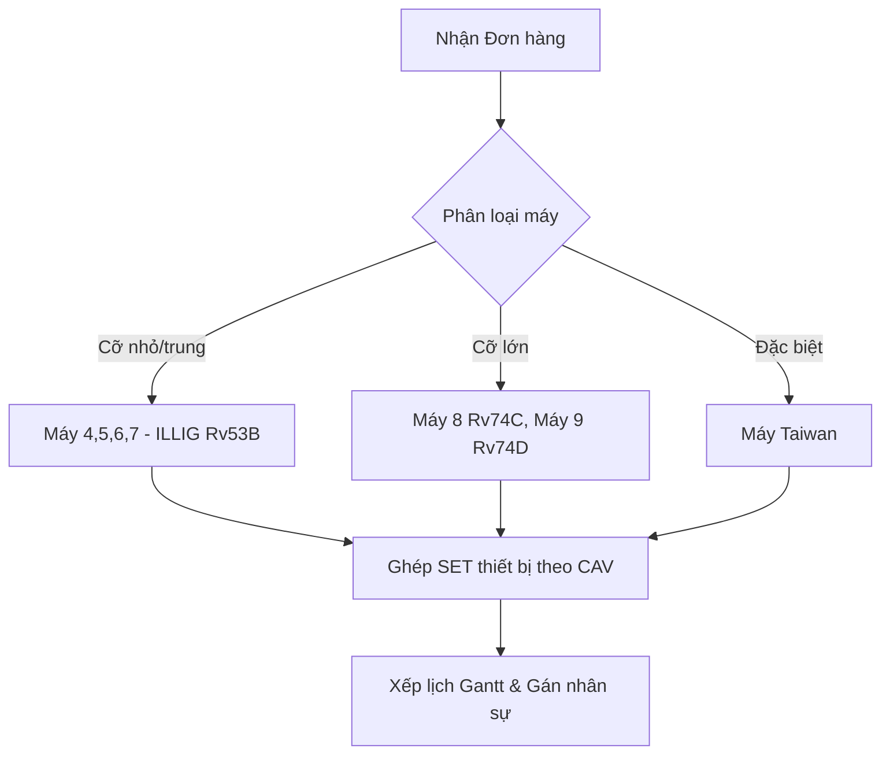

**Edge case:** Khuôn xong nhưng máy bận (Bottleneck) → cần re-schedule. Thiết bị dùng chung (WB-74CZD) cần kiểm tra conflict.

---

## 4.2 Tạo phiếu chỉ thị sản xuất (生産指示書)

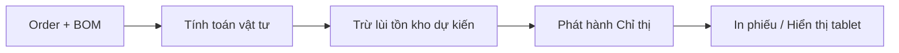

**Input:** P/N, Số lượng, Đóng gói (荷姿), Ngày giao (納期)  
**Output:** Phiếu chỉ thị in ra hoặc hiển thị tablet  
**Liên kết tự động:** Khi tạo phiếu → trừ tồn kho vật liệu dự kiến (指示書連動)

---

## 4.3 Thực hiện sản xuất (成形実行)

1. **Setup:** Lắp đủ 8 thành phần thiết bị, cài đặt Heater zones (12 zones) và Timing
2. **Sản xuất:** Chạy ép màng nhựa → Cắt (In-line hoặc Separate)
3. **Phân loại output:**
   - Sản phẩm bán (Mass production)
   - Mẫu miễn phí (Free)
   - Mẫu QC (入検用)
   - Hàng chạy rà máy (Machine Adjust)
   - Mẫu văn phòng (事務所用 — Office)

---

## 4.4 Nhật ký sản xuất (日報 / Work Logs)

**Dữ liệu ghi nhận hàng ngày:**
- Thời gian Start/End
- Mã cuộn nhựa sử dụng (quét QR)
- Sản lượng: OK / NG (5 loại NG category)
- Thao tác viên

---

## 4.5 Sản xuất đa site (Multi-site)

| Site | Ký hiệu | Đặc điểm |
|------|---------|-----------|
| 本社 Saitama | — | Nhà máy chính |
| 青森 Aomori | ☆ | Sở hữu Máy 9 ILLIG RV-74d |
| 茨城 Ibaraki | — | Nhà máy vệ tinh |
| 坂田精文堂 Sakata | ★ | Đối tác gia công ngoài |

---

## 4.6 Kanban status flow

`PENDING → IN_PROGRESS → PAUSED (thiếu nhựa/chỉnh máy) → COMPLETED`

---

# CHƯƠNG 5: MATERIAL & INVENTORY (材料・在庫)

## 5.1 Quản lý danh mục vật liệu nhựa (Plastic Master)

| Thuộc tính | Giá trị | Ví dụ |
|-----------|---------|-------|
| Loại nhựa | PS, PP, PVC, PET | PET 透明 1mm |
| Biến thể | Natural(N), Clear(CL), Brown(茶), White(W), Black(B) | PS Brown |
| Độ dày | 0.38 - 1.2mm | 0.50mm |
| Chiều rộng | 405 - 640mm | [640] |
| Đặc biệt | 帯電防止 (Chống tĩnh điện), 塗布 (Phủ), 導電印刷 (In dẫn điện) | 帯電防止付 |

> [!WARNING]
> Vật liệu 導電印刷 (In dẫn điện) có lead time lên tới **1 tháng**.

---

## 5.2-5.3 Nhập kho & Kiểm kê tồn kho (在庫管理)

> [!CAUTION]
> **GAP NGHIÊM TRỌNG:** Hiện tại kiểm kê bằng **483+ file Excel thủ công** (325 dòng × 114 cột/file), cập nhật hàng ngày, chia theo site. Đây là P0 cần số hóa ngay.

**Giải pháp:**
- Quản lý theo Cuộn (Roll receipt) — mỗi cuộn có mã QR
- Multi-site inventory: tab lọc theo Site (Saitama, Aomori, Sakata)
- Real-time visibility thay vì Excel cục bộ

---

## 5.4 Tiêu hao vật liệu (Material Consumption)

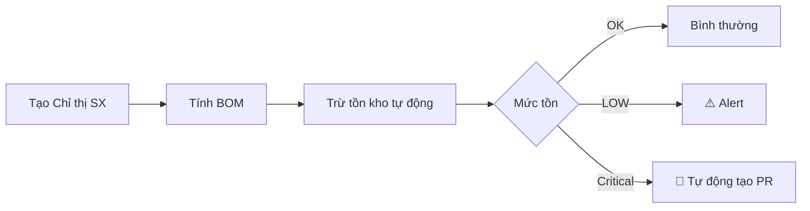

---

## 5.5 PPWR Compliance

Lưu trữ % nhựa tái chế (粉砕材含有率). SMK yêu cầu ghi rõ trên Bảng kiểm tra.

---

# CHƯƠNG 6: LOGISTICS & DELIVERY (出荷・納品)

## 6.1 Chuẩn bị giao hàng

- Đóng gói theo quy cách KH (VD: 200 tấm × 2 hộp)
- **Nhãn (Labels):** Format riêng per KH — SMK yêu cầu mã khuôn trên nhãn

---

## 6.2 Lập phiếu giao hàng (納品書)

> [!IMPORTANT]
> Không thể dùng chung 1 form. Cần **Module Customer Config** lưu template in ấn per KH.

| KH | Format | Đặc điểm |
|----|--------|----------|
| SMK | Excel 3-4 sheet | Đổi format 04/2025 |
| KYD | 指定納品書 | Form giao hàng chỉ định |
| JAE/HAE | Form YSD + 検査表 | Kèm bảng kiểm đặc thù |
| Standard | Form YSD chuẩn | — |

---

## 6.3-6.4 Vận chuyển & Giao hàng một phần

- Hàng ngày: vận chuyển thường
- **>5 pallets/ngày:** Hệ thống cảnh báo chuyển sang Charter (xe nguyên chuyến)
- **Partial Delivery:** 1 đơn → giao nhiều đợt (VD: JAE đặt 5 đợt/ngày)

---

## 6.5-6.6 Xác nhận giao & Quản lý địa điểm

**Luồng:** `SHIPPED → DELIVERED` | Hàng lỗi → `RETURNED` → Claim  
**Delivery Sites:** Master list từ `納入先一覧表.xlsx` (1,069 dòng). 1 KH có nhiều điểm giao.

---

# CHƯƠNG 7: QUALITY CONTROL (品質・検査)

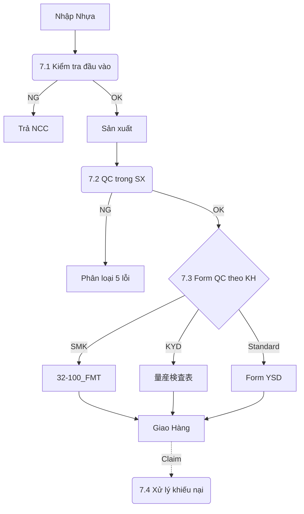

---

## 7.1 Kiểm tra đầu vào (入検)

Kiểm tra chứng nhận SDS/RoHS, đo chiều dày nhựa theo lô.

---

## 7.2 QC trong sản xuất (工程内検査)

- Đo kích thước (dung sai ±0.3, ±0.5, ±1.0mm)
- Kiểm tra ngoại quan
- Phân loại OK/NG (5 danh mục NG)

---

## 7.3 Biểu mẫu QC theo KH

**Cần Module Customer Config** — mỗi KH có format riêng.  
SMK yêu cầu 4 cấp ký duyệt + ghi % nhựa tái chế.

---

## 7.4 Xử lý khiếu nại (クレーム)

Tiếp nhận → Phân tích RCA → Báo cáo biện pháp khắc phục → Theo dõi Kaizen.

---

## 7.5 Đánh giá nhà cung cấp (供給者評価)

Đánh giá định kỳ hàng năm. File: `供給者一覧2025.3.xls`, `購買製品区分別分類表兼供給者評価表2025.3.xls`.

---

# CHƯƠNG 8: FINANCE & ACCOUNTING (経理・会計)

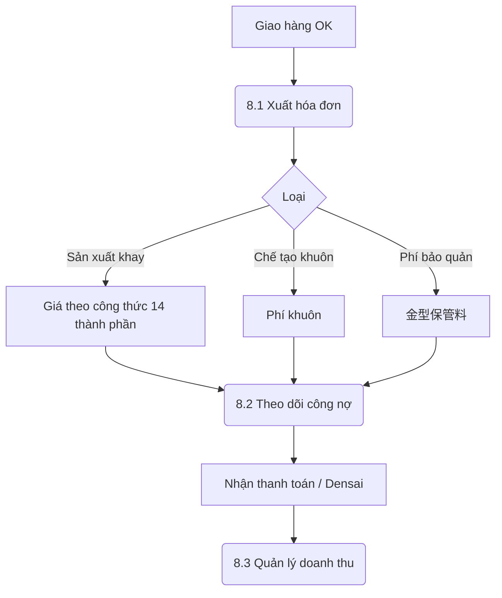

---

## 8.4 Quản lý chi phí & giá thành (原価管理)

**14 thành phần tính giá:**
1. Chi phí vật liệu (BOM cost)
2. Chi phí nhân công (work_logs hours × Rate)
3. Chi phí máy (machine hours × Rate)
4. Chi phí gia công ngoài (outsource)
5. Quản lý, Đóng gói, Vận chuyển, Khấu hao...

---

## 8.5 Phí bảo quản khuôn (金型保管料)

YSD giữ 4,700+ bộ khuôn (tài sản KH). Khuôn non-active → tính phí bảo quản.  
**Phí = Số khuôn × Đơn giá/tháng.** Phát hành hóa đơn cho KH.

---

# CHƯƠNG 9: ADMINISTRATION, HR & ISO (管理・人事・ISO)

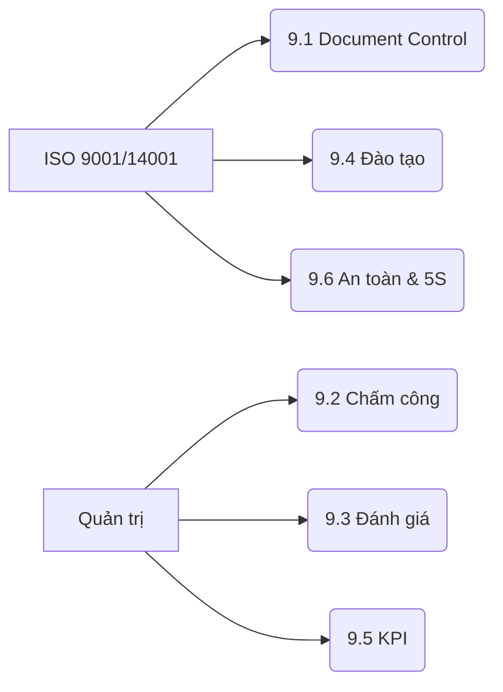

---

## 9.1 ISO Document Control

Quản lý hàng trăm file master, lịch sử version (42 dirs trên server).  
**KPI:** Tỷ lệ giao hàng đúng hạn (納期遵守率), Tỷ lệ lỗi sản xuất.

---

## 9.2 Quản lý nhân sự (人事管理)

- Hồ sơ nhân viên (`従業員名簿`)
- Chấm công (タイムカード) — hiện trên server, chưa số hóa
- Lịch làm việc: 730 ngày (ngày nghỉ/làm) → tính capacity và deadline

---

## 9.3-9.7 Đánh giá, Đào tạo, Mục tiêu, An toàn, 5S

- **Đánh giá:** `職務分掌表`, `責任分担表`
- **Đào tạo:** OJT, ISO awareness, an toàn lao động
- **Mục tiêu:** KPI phòng ban, `部門目標`
- **An toàn:** `全体作業規定`, PCCC (`消防訓練`)
- **5S:** Bảng biểu trực quan, khu vực NG品, sơ đồ nhà máy

---

> [!NOTE]
> **Hướng dẫn cập nhật tài liệu:**  
> Mỗi chương là một module độc lập. Khi cần cập nhật:
> 1. Chỉ sửa section tương ứng trong chương cần cập nhật
> 2. Ghi timestamp và lý do thay đổi ở đầu section
> 3. Không thay đổi cấu trúc heading (##) để giữ liên kết mục lục
> 4. Thêm sub-section mới bằng cách thêm ### mới dưới ## parent
